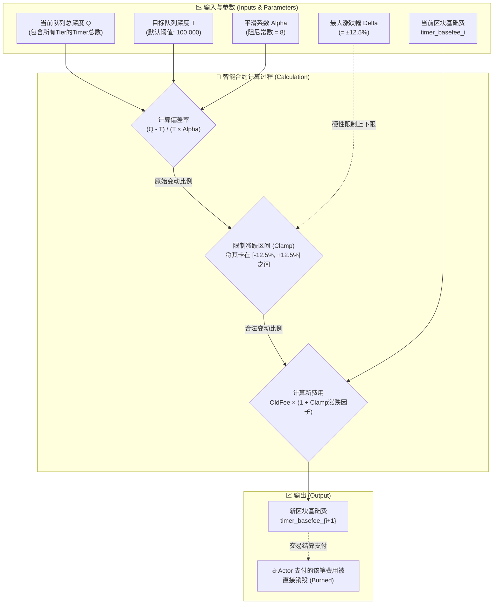
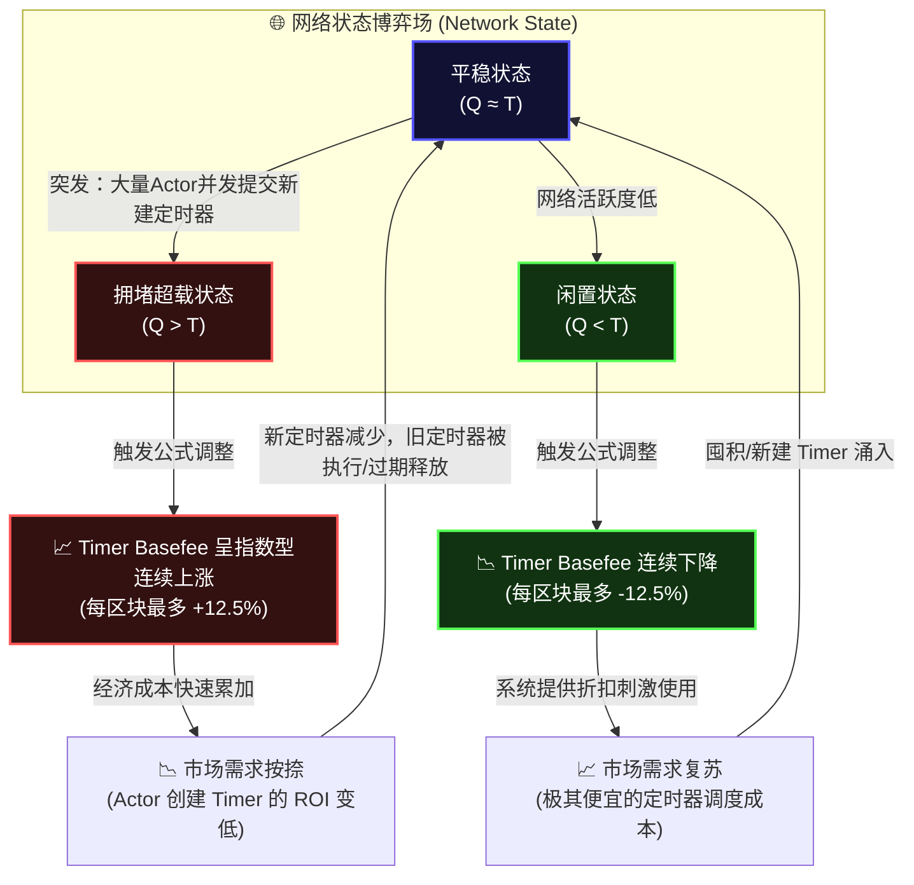

# Cowboy Timer Basefee 解析

本文档详细解读 Cowboy 协议中 Timer Basefee（定时器基础费）的计算公式、运作原理，以及其对开发基于强化学习（如 DQN, PPO, SAC）的 Gas 竞价智能体（GBA）的架构启示。

## 1. 计算公式与图解

在 Cowboy 网络中，为了防止定时器队列（Timer Queue）过载被恶意利用，并保证系统未来的计算资源不被过度预支，协议采用了与 EIP-1559 类似但基于**队列深度 (Queue Depth)** 的基础费调节机制。

### 公式

每个区块的 Timer Basefee 由以下公式计算得出：

```text
timer_basefee_{i+1} = timer_basefee_i × (1 + clamp((Q - T) / (T × alpha), -delta, +delta))
```

**参数解释：**

*   **`Q`**：当前的定时器队列总深度（横跨 Block Ring Buffer、Epoch Queue 等所有 Tier 层级的 Timer 总数）。这是决定费用调整的核心先导变量。
*   **`T`**：目标队列深度（Target Queue Depth）。这是一个可通过治理机制调整的网络参数，当前默认设定为 **100,000**。
*   **`alpha`**：平滑系数（阻尼常数），设定为 **8**。这与 Cycle 和 Cell basefee 的算法保持一致。
*   **`delta`**：单次区块间的最大波动限制，设定为 **0.125**。即单次 Basefee 的涨跌幅最多为 12.5%（同样与 Cycle/Cell 保持一致）。

### 计算流程图解



---

## 2. 运作原理反馈循环

Timer Basefee 的调节本质上是一个负反馈循环（PID 控制中的比例控制部分）。该机制实现了系统的**弹性自我调节（Self-Regulating）**。

### 核心机制说明

1.  **费用上升抑制需求**：当队列中积压的定时器过多导致网络拥堵（`Q > T`）时，更新因子为正，下一个区块的 `timer_basefee` 会成比例上涨。定时器创建成本的增加将通过市场杠杆自然抑制需求（阻止垃圾定时器洪水的灌入）。
2.  **费用下降刺激复苏**：当网络闲置（`Q < T`）时，Basefee 逐渐下降，极低的调度成本将刺激开发者和智能体发送或囤积定时器。
3.  **通缩销毁设计**：Timer Basefee 被全额**销毁（Burned）**。这不仅对齐了网络生态激励，还消除了矿工/验证者为了套取 Basefee 而自我发起粉尘攻击的动机。
4.  **互补防御机制**：结合白皮书中提到的**同区块指数级附加费（Same-Block Exponential Pricing）**，既防止了宏观层面队列过载（由 Timer Basefee 承担防线），又防止了微观层面单个区块被定向炸弹攻击（由同区块指数附加费承担防线）。

### 反馈循环图解



---

## 3. 对 GBA (Gas Bidding Agent) 强化学习的架构启示 💡

由于 Actor 可以指定一个专门的强化学习智能体（如基于 DQN / PPO / SAC 算法）作为 GBA 动态出价，Timer Basefee 的机制为此提供了一个天然且复杂的博弈论测试沙盒。

将上述原理融入到 RL 智能体的环境设计中，有以下关键启发：

1.  **先行指标监控（Leading Indicator Observation）**：
    *   **状态设计**：不要仅仅把 `timer_basefee_i` 放入状态字典。更重要的是引入 `Q`（当前队列深度）以及近期区块中 `Q` 的**导数（变异率 ∆Q/∆t）**。
    *   **原因**：`timer_basefee` 的涨跌是对队列深度的“滞后性反应”。能够预测到 `Q` 变化趋势的 Agent 会比仅反应于价格的 Agent 获得更强烈的优势。

2.  **抢跑与囤积策略（Front-running / Accumulation）**：
    *   如果 Agent 网络预测到 `Q` 正在急剧攀升而即将突破 `T`，但当前的 Basefee 还没有涨到最高惩罚点时，Agent 可以学习到**趁低成本抢先提交/囤积长期定时器**的策略。它利用了系统对大队列反应的滞缓窗口期。

3.  **延迟满足（Delayed Execution）**：
    *   在系统被大量任务塞满，开始进入高费用下降期时，具备长序列奖励视野的 PPO/SAC Agent 会学习到主动**暂缓非紧急定时器**（将其暂存于 Actor 离线内存中，而非立即上链）。等到 Basefee 下降至合理区间再批量提交，以此大幅节省代币。

4.  **恶意挤压与反挤压博弈**：
    *   如果允许多个具有不同 Actor 归属的 GBA 在同一环境中进行多智能体强化学习 (MARL)，他们可能会进化出演化出诸如“虚假需求抬高对手成本（如果对方策略是盲目跟投的话）”或者“错峰行动避免踩踏”等高级经济行为。这非常有利于建立 PoA（Price of Anarchy）测算的实验基线模型。
