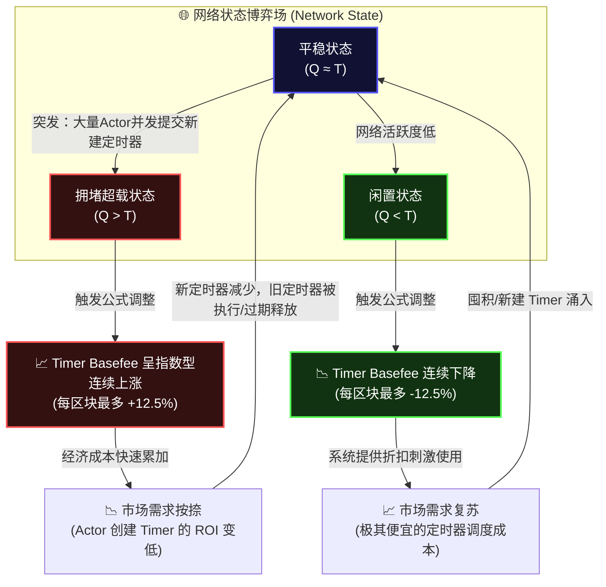

# Cowboy 全景经济学：双轨 Gas、Timer 机制与 Actor 生存法则

本文档综合解析了 Cowboy 协议中的核心经济机制，包括基础费（Timer Basefee）、双轨计量系统（Cells & Cycles）、它们与 EIP-1559 的渊源，以及 Gas 竞价智能体（GBA）的形态与 Actor 在网络中的财务生存法则。这些理论是为 Cowboy 开发高级强化学习智能体（如 DQN, PPO, SAC）的架构基础。

---

## 1. 计费系统：EIP-1559 的三向延伸

Cowboy 抛弃了将“计算”和“存储”混为一谈的传统 Gas 模型，而是首创了**双轨计量 (Dual-Metered Gas)** 以及专门的**定时器 (Timer)** 市场。这三种资源的定价机制，全部继承并延伸自以太坊 EIP-1559 的核心思想。

### EIP-1559 核心原理回顾
*   **Basefee (基础费)**：由算法根据上一个区块的拥堵情况计算得出的硬门槛。这笔费用会被**100%销毁（Burned）**，用于对齐经济激励并防止矿工通过虚假交易抬高价格。
*   **Tip (小费)**：用户为了让矿工优先打包交易而额外付出的加急费，直接支付给**矿工**。
*   **弹性调节**：如果资源使用超过目标阈值（如满载率的 50%），下一个区块的 Basefee 就上涨（最多 +12.5%）；反之则下降（最多 -12.5%）。

### Cowboy 的三重 Basefee 市场
Cowboy 将 EIP-1559 平移到了三种关键资源上，且它们的调节逻辑和核心参数（`alpha = 8`, `delta = 12.5%`）完全一致：

1.  **Cycles（计算资源）**：衡量 CPU 计算工作量（例如执行 Python 字节码）。参照物是**“上一个区块的算力消耗（Cycles_Used）是否超过目标阈值”**。
2.  **Cells（空间数据）**：衡量 I/O 和持久化存储占用（1 Cell = 1 Byte）。参照物是**“上一个区块的数据吞吐（Cells_Used）是否超过目标阈值”**。
3.  **Timer（定时器队列）**：控制未来跨区块调度。参照物是**“当前的宏观队列总深度（Q）是否超过了目标深度（T = 100,000）”**。

这三个市场独立涨跌，互不干扰验证。

---

## 2. Timer Basefee 的计算机制与图解

Timer Basefee 位于防御网络不受“垃圾定时器饱和攻击”的第一线，它根据滞后的队列反馈进行 PID 比例控制。

### 公式说明
```text
timer_basefee_{i+1} = timer_basefee_i × (1 + clamp((Q - T) / (T × alpha), -delta, +delta))
```
*   `clamp(x, min, max)` 是一种数学截断函数，用于将根据队列偏差计算出的原始涨跌幅，强行“夹紧”在 [-12.5%, +12.5%] 内，防止因单次拥堵造成基础费暴涨震荡。

### 运作原理反馈循环



---

## 3. 费用支付矩阵：谁为开销买单？

在 Cowboy 的经济体中，遵循**“谁触发了消耗，谁就买单”**的核心原则。

### 场景一：外部用户（EOA）发起的主动交互
当普通用户从钱包发起一笔交易调用 Actor 函数时，由**外部用户全额支付**费用：
*   **支付方**：EOA 账户余额。
*   **计算公式**：
    `总费用 = 消耗Cycles * (bf_c + Cycles_tip) + 消耗Cells * (bf_b + Cells_tip)`
*   （用户付出的 Basefees 被销毁，Tips 归矿工所有，预设预算 `max_fee` 没用完的全额原路退还）。

### 场景二：Actor 自主后台运行（数字逻辑心跳）
当 Actor 不依赖用户点击，而是靠业务逻辑或 Timer 自动运转时，它变成了一个独立的**数字生命/公司**。它的所有开销必须由**Actor 自己的金库（Balance）**承担。

| 费用类型 | 支付时机 | 谁负责出价 / 执行 | 资金去向 |
| :--- | :--- | :--- | :--- |
| **Timer Basefee** (队列占地费) | 调用 `set_timer()` **创建时** | Actor 的业务代码 | **销毁** (限制排队占坑) |
| **GBA 竞价费** (唤醒劳务小费) | Timer **到期 (Due)** 被唤醒时 | **GBA 智能体** 根据行情打分出价 | 给**矿工**，包含(Tip_c/Tip_b)，同时扣除当期 bf 销毁 |
| **State Rent** (数据存储租金) | 连续不断，按时间/区块 | 协议按区块固定扣除 | **销毁** (不付租金则数据被 Pruned) |
| **Runner Fee** (链下外包费) | 下发链外推理任务时建立托管 | Actor 冻结预设金额 | 给**链下节点(Runner)** 提供算力者 |

---

## 4. GBA (Gas Bidding Agent) 的形态与财务使命

### 物理与执行形态
GBA 本身并非底层黑盒，而是部署在链上的 **Python 程序**（可以是 Actor 内部的一个 `@view` 函数，也可以是独立的第三方经纪人 Actor）。

它在特殊的区块生命周期中被底层协议以**同步只读 (Synchronous View Call)** 方式触发。它接收包含 `current_basefees`、`timer_urgency` 和 `owner_balance` 的全景上下文，其唯一职责是快速且确定性地输出一个竞价数值（Cycles 和 Cells 的小费）参与暗盒拍卖，争取系统预留的定时器执行额度。

### RL (强化学习) 架构启示：向 CFO 进化

由于 Actor 必须自负盈亏，如果它赚不到钱支付上述那些开支，金库就会见底并破产消除。这种残酷的生存法则决定了 GBA 的设计空间：

1.  **先行指标监控**：Agent 的状态空间不应只看价格，必须关注队列深度 `Q` 及其导数 `∆Q/∆t`。能预测到拥堵来临的 Agent，能**趁低成本抢先提交/囤积期权**。
2.  **错峰与延迟满足**：当系统陷入天价的基础费降级期，为了保证 Actor 的商业利润（ROI），GBA 应当学会长远规划，主动将非紧急的 Timer 截留，待基础费（bf）下降后再批量释放出价。
3.  **非对称混合竞价**：由于 Cycles 和 Cells 市场是拆分的，最高级的 GBA 能判断出接下来的回调任务是“算力消耗型”还是“宽带消耗型”，并进行非对称报价。
4.  **恶意压制博弈 (PoA 计算基石)**：在有限的 20% Timer Budget 区块空间内，多个 RL 智能体会衍生出“抬高对手竞价成本”或“集群式错峰”等博弈行为，这就是测试无政府代价（Price of Anarchy）的最佳沙盒。
