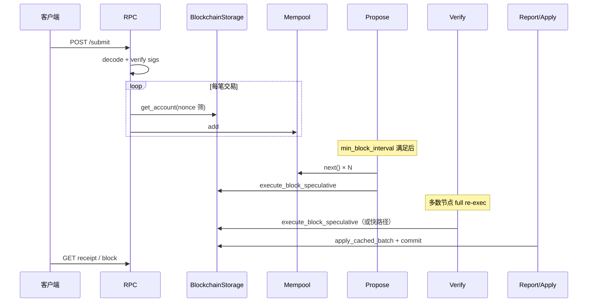

# Cowboy Node：简单交易（Transfer）全链路性能与可观测性方案

**版本**：1.2
**日期**：2026-04-02  
**状态**：设计 / 待评审  
**路径**：`refs/202604/2026-04-02_简单交易全链路性能与可观测性方案.md`  
**适用范围**：`node/` 工作区（RPC、chain、mempool、storage、execution）

---

## 1. 背景与目标

### 1.1 背景

在 Cowboy 链上，**系统指令 `Transfer`**（原生代币转账）属于计算与状态变更都相对简单的交易类型，常被用作：

- 延迟与吞吐基线（benchmark）；
- 端到体验证（从钱包/CLI 提交到可查询 receipt）；
- 与复杂 Actor / Runner 交易对比时的「对照组」。

当前实现采用 ** speculative execution 模型**：在 **propose / verify** 阶段完成执行并计算 `state_root` / `receipt_root`，在 **report（finalization）** 阶段将缓存批次 **apply** 到持久存储。该模型在正确性上清晰，但在多节点、高并发提交下存在 **重复执行、锁竞争、调度复杂度** 等可优化空间；同时缺少 **细粒度指标** 时，难以量化「慢在 RPC、mempool、共识间隔还是存储提交」。

### 1.2 本文目标

1. **详细描述** 一笔简单 `Transfer` 从提交、入池、出块、验证、落库到可查询的 **全链路** 与 **关键代码位置**。  
2. **系统化列出** 可提升性能的环节（按层级：RPC、mempool、共识应用层、执行与存储），并区分 **投入小收益快** 与 **需协议级改动**。  
3. **给出可观测性方案**：在何处 **埋点**、推荐 **Prometheus 指标 / 日志字段 / 分布式追踪** 约定，以便压测与线上评估有统一依据。  
4. **不修改协议语义** 的前提下，标出「仅实现优化」与「可能涉及共识/状态同步语义」的边界。

### 1.3 非目标

- 不定义新的手续费或共识算法。  
- 不替代 CIP 文档；与费用模型冲突时以 **CIP-3** 等规范为准。  
- 本文不承诺具体排期，仅作技术方案与优先级参考。

---

## 2. 范围与术语

| 术语 | 含义 |
|------|------|
| **简单交易** | 本文默认 `Instruction::System(SystemInstruction::Transfer { to, amount })`，非 deferred、无 PVM。 |
| **提交** | 客户端通过 HTTP `POST /submit` 提交 `Submission::Transactions`。 |
| **入池** | 交易通过校验后加入 **Mempool**。 |
| **出块** | Leader 在 `Application::propose` 中从 mempool 取交易组块并 speculative 执行。 |
| **验证** | Validator 在 `Application::verify` 中校验签名、`tx_root`，并对执行结果做 **全量重放或 leader 快路径**。 |
| **确认（finalize）** | `Reporter::report` 触发 `apply_cached_batch`，状态与索引对查询可见（以 RPC 行为为准）。 |

---

## 3. 端到端路径详解（Transfer）

### 3.1 客户端与编码

- 客户端构造 `Transaction`：`nonce`、`cycles_limit` / `cells_limit`、`max_fee_per_cycle` / `max_fee_per_cell`（需不低于当前 basefee）、`Instruction::System(Transfer { ... })`，并用 secp256k1 签名。  
- 编码：`cowboy_types::api::Submission::Transactions(Vec<Transaction>)` 序列化后作为 **octet stream** 提交。

### 3.2 RPC：`POST /submit`

**主要逻辑**（概念顺序）：

1. **体大小上限**：防止超大 body（如 512 KiB 级别 cap，具体以代码为准）。  
2. **解码** `Submission`。  
3. **拒绝 deferred**：外部不得直接提交 deferred 交易。  
4. **逐笔 `tx.verify()`**：secp256k1 验签。  
5. **Nonce 粗筛**：对每笔交易 `blockchain_storage.read().await.get_account(&tx.from)`，若 `tx.nonce < account.nonce` 则丢弃（防陈旧交易占池）。  
6. **`mempool.add(tx)`**：在持有 `mempool` 锁的情况下插入；可能因重复 digest、per-sender backlog、全局笔数/字节上限失败。

**特征**：

- 多笔交易时，**账户读与 mempool 加锁** 大体呈 **逐笔串行**，高并发下 submit 延迟易被放大。  
- 验签在 handler 内已做；与后续区块内验签（见 3.4）在逻辑上重复，属于 **Defense-in-depth**，但若要做极致性能可评估 **单次强校验 + 后续信任边界** 的风险。

### 3.3 Mempool 与（可选）索引器回流

- **本节点 RPC 提交** 路径直接进入本机 mempool。  
- **其他节点** 可能通过 **MempoolListener** 连接 indexer WebSocket，异步拉取 Pending 交易并入池；存在额外延迟与背压（重连、消息大小上限等）。

**选块**：`Mempool::next()` 在**每个账户队头交易**上计算综合分数（与 fee-per-byte、入池顺序等相关），再**全局取最高分**的账户的队头交易。实现上会对 `tracked` 中账户做遍历，详细见第 4 节。

### 3.4 共识应用层：`propose`

1. **最小区块间隔**：`min_block_interval`（默认 **1000 ms**，目标 **约每秒 1 块**）。若距离上次出块时间不足，**直接本次不 propose**（返回 `None`）。这是 **端到端延迟的硬下限之一**（测试/产品可调）。  
2. **拉交易**：在 `MAX_BLOCK_TRANSACTIONS` 限制下循环 `mempool.next()`。  
3. **构造临时块**：`tx_root` / `state_root` / `receipt_root` 先占位；`Block::execution_hash()` 与最终块在验签侧一致（**不含三棵 Merkle root**），保证 propose 与 verify 执行环境一致。  
4. **Speculative 执行**：`execute_speculative(temp_block)` → `BlockchainStorage::execute_block_speculative` + `ExecutionEngine`。  
5. **Leader 缓存**：将 `(execution_hash, state_root, receipt_root)` 写入 `last_propose_cache`，供本节点 **verify 快路径**。  
6. **失败策略**：若 speculative 失败（非单笔可恢复错误），当前策略可 **清空本块交易、 propose 空块** 以避免卡死（具体日志与计数见 `propose_failures`）。

### 3.5 Transfer 在执行层的行为（摘要）

在 `ExecutionEngine::execute_transaction` 中（非 deferred）：

- 再次 **验签**；读 **sender** 账户；校验 **nonce**、**basefee**、**余额是否覆盖最大 gas 支出**；  
- 计量 **base cycles/cells**；对 instruction 做 **`serde_json::to_vec`** 以计算 **intrinsic calldata cells**；  
- `nonce += 1` 后进入 `execute_system_instruction`；  
- **`Transfer`** 分支：`get_account(to)`，更新两边余额，`set_account(to)`（sender 随后在统一路径写回）。

因此单笔 Transfer 至少包含 **多次账户读写在状态抽象上的往返**；若底层 QMDB 无块内有效缓存，则表现为多次 IO。

### 3.6 Speculative 存储路径（块级）

`execute_block_speculative` 中除逐笔执行外，还包括（与简单 Transfer 同属一块时相互影响）：

- 可能因 **高度 races** 对 **更早高度的 cached batch** 做 **early `apply_cached_batch`**，避免读到旧状态。  
- 加载 **basefee**、`prepare_block_basefee`、**lane 预算**、**定时器**、**basefee 结算与 burn/tip**、**receipt / log** 与 **Merkle 根** 计算，以及 **`cache_speculative_batch` + rollback** 等。

简单 Transfer 本身不重，但块级固定成本会摊薄到每笔头上。

### 3.7 `verify`

1. **时间戳与高度** 等检查。  
2. **`tx_root` 重算** 与块内声明比对。  
3. **块内所有交易验签**（含网络传入、非本节点 RPC 来的交易）。  
4. 若配置 speculative：  
   - **Leader fast path**：若 `last_propose_cache` 中 `execution_hash` 匹配，则 **只比对 `state_root` / `receipt_root`**，**跳过重放**。  
   - **否则**：对 **`block.clone()` 再跑一遍** `execute_block_speculative`，与块头三根比对。

**含义**：多节点时 **绝大多数验证者** 在大多数情况下走 **全量重放**，CPU 与存储读放量接近 **「每块 × (验证者数量 − 1 次快路径命中)」**。

### 3.8 `report`（finalize）

1. **`apply_cached_batch(height)`**：将 propose/verify 阶段缓存的 **pending 写入** 提交；返回 deferred 列表可供重新入池。  
2. **缓存未命中路径**：若 apply 失败，可能 **fallback 再执行块** 后重试 apply（异常慢路径）。  
3. **Mempool 清理**：去掉已上链的交易等（`cleanup_mempool`）。  
4. **周期性 `sync_storage`**（如每固定块数）：影响延迟尾部与磁盘抖动。

### 3.9 查询侧

- 交易体、回执、账户 nonce 等通过 **RPC** 读取；**finalize 之前** 与之后可见性需与产品一致（通常以 finalized 状态为准）。  
- 索引可能滞后于 **本机** report，取决于是否同事务/同进程。

### 3.10 端到端时序（示意）

---

## 4. 性能瓶颈分层分析（详细）

### 4.0 瓶颈优先级总览

下表以 **P0（最高）→ P4（最低）** 标注严重程度，结合执行位置与问题类型：

| 优先级 | 瓶颈 | 代码位置 | 类型 | 影响估计 |
|--------|------|---------|------|---------|
| **P0** | 交易串行执行循环 | `speculative.rs:180–182` | CPU + I/O | O(tx_count)，1000 笔全靠单线程，随负载线性增长 |
| **P0** | 状态 Merkle 化 | `speculative.rs:581` | CPU + I/O | Blake3 MMR 覆盖所有 state_pending 变更，1000 笔 Transfer ≈ 2000 账户改写 |
| **P1** | Verify 批量签名验证 | `application.rs:534` | CPU | 非 leader 节点每块 1000× secp256k1 ecrecover |
| **P1** | 三阶段串行 QMDB 提交 | `blockchain_storage.rs:286–341` | I/O | state_db → tx_index → tx_receipts 顺序磁盘写入 |
| **P2** | 每笔 tx 2–4 次存储 I/O | `transaction.rs` + `system_instruction.rs:70` | I/O | Transfer = get_account(sender) + get_account(receiver) + 2× set_account |
| **P2** | storage RwLock 写锁竞争 | `application.rs` propose/verify | 锁 | propose 持写锁期间 verify 阻塞，影响共识时序 |
| **P3** | 每 100 块 sync+prune I/O 尖峰 | `blockchain_storage.rs:352–410` | I/O 尖峰 | 周期性 fsync，可引发出块时延抖动 |
| **P3** | Timer 内联执行 | `speculative.rs:260–373` | CPU + I/O | 依赖 timer 数量，通常低，但可叠加 |
| **P4** | Mempool 全局 Mutex | `application.rs:385` | 锁 | 持锁时间短，现阶段影响小 |

**关键阈值**：`min_block_interval = 1000 ms`。若 1000 笔 Transfer 的「执行循环 + Merkle 化」之和超过 1000 ms，出块频率将开始下降。

---

### 4.1 RPC 提交层

| 问题 | 说明 | 影响 |
|------|------|------|
| 逐笔 `get_account` | 每笔交易一次异步读锁 + DB 读 | 批量提交时 RTT 与锁竞争线性叠加 |
| 逐笔 `mempool.add` | 多次抢 mempool 互斥锁 | 与 propose 争用同一锁时延迟尖刺 |
| 重复验签 | submit 与执行/verify 层级各有验签动机 | CPU 重复，安全边界可评审是否合并假设 |

### 4.2 Mempool 调度层

| 问题 | 说明 | 影响 |
|------|------|------|
| `next()` 全局扫描 | 每次弹出需遍历所有有待处理交易的账户，计算分数 | 复杂度约 **O(账户数 × 每块交易数)**，账户多时 CPU 明显 |
| 字节与笔数上限 | 满池时拒绝或驱逐 | 突发表现在「提交成功但 skipped」 |
| 分数与确定性 |  tie-break 依赖 sender key 等 | 必须保持确定性以便网络一致；优化数据结构时须保留 |

### 4.3 共识与应用层

| 问题 | 说明 | 影响 |
|------|------|------|
| `min_block_interval` | 默认 1000 ms（约每秒 1 块） | **出块间隔下限**，简单 Transfer 无法突破 |
| propose 中 execution 失败 | 整批丢弃、空块前进 | 尾部延迟与「交易消失」类观感需监控 |
| ExecutionEngine `Mutex` + Storage `RwLock` write | speculative 路径独占 | 提交读锁与执行写锁交错，易抖动 |

### 4.4 验证层（多节点核心）

| 问题 | 说明 | 影响 |
|------|------|------|
| 非 leader 全量重放 | 与 propose 同量级执行 | **验证者越多，重复工作越多**（无共享执行证明时） |
| Leader fast path | 仅本节点刚 propose 的同哈希块 | 无法推广到其他节点 |

### 4.5 执行与状态层（单笔 Transfer）

| 问题 | 说明 | 影响 |
|------|------|------|
| `serde_json::to_vec` for calldata | 每笔系统交易仍走 JSON 序列化 | 固定 CPU；高 TPS 时占比上升 |
| 多次 `get_account` / `set_account` | Transfer 涉及双方账户 | 存储 API 调用次数可统计；块内缓存可优化 |
| 块级 fixed cost | basefee、timer、merkle 等 | 小交易占比高时，固定成本主导 |

### 4.6 持久化与尾部

| 问题 | 说明 | 影响 |
|------|------|------|
| `apply_cached_batch` → `commit_batch` | 大块或多写入时 IO | finalize 阶段 tail latency |
| early-commit | 防止陈旧读，可能 extra commit | 偶发尖刺 |
周期性 sync | 如每 N 块 | 磁盘/fsync 类抖动 |

---

## 5. 优化方案（分层与优先级）

### 5.1 短期（实现成本低、语义风险低）

1. **指标拆分**：在 `propose` 中拆分 **mempool 耗时** vs **speculative 耗时**；在 `verify` 区分 **fast path / full reexec** 计数与耗时。  
2. **Mempool `next()` 数据结构**：用 **堆/lazy 全局最优** 维护「各账户队头」优先级，将单次 `next()` 从 O(账户数) 降至近似 O(log N)（需仔细处理驱逐、nonce 有序性、确定性 tie-break）。  
3. **RPC 批量提交**：合并多次 `get_account` 为批量接口或单次快照读；或减少锁切换次数（注意 nonce 与一致性）。  
4. **验签并行化**（verify 块内）：并行 `ecrecover`，结果汇总顺序与当前顺序语义一致即可。  
5. **Calldata 计量**：对 **已知系统指令** 探索 **不经完整 JSON** 的 cell 计算（须与协议/CIP-3 一致，需评审）。  

### 5.2 中期（中等开发量）

1. **块内账户读缓存**：在同一 speculative batch 内对 `get_account` 做 LRU/HashMap，减少重复读（注意与 rollback 一致性）。  
2. **Submit 与 mempool 锁分段**：如短临界区仅更新索引，长操作移出（需避免死锁与重复添加）。  
3. **`min_block_interval` 配置化**：不同环境（单节点压测 vs 主网）可分离默认值并文档化。  

### 5.3 长期（协议/架构级）

1. **执行证明或状态差分同步**：使验证者 **不必全量重放** 同等执行（如欺诈证明、ZK、或受信任快照 + challenge 窗口）；工作量大且改变信任模型。  
2. **分片 / 执行与共识解耦**：超出本文范围，但与「多验证者重复执行」同一类根本矛盾。  

### 5.4 优化项与风险矩阵（摘要）

| 方案 | 性能收益 | 实现成本 | 语义/共识风险 |
|------|----------|----------|----------------|
| propose 耗时拆分指标 | 中（可观测） | 低 | 无 |
| mempool 堆优化 | 中高 | 中 | 低（需确定性回归测试） |
| RPC 批量读 | 中 | 低–中 | 低（一致性需测） |
| 验签并行 | 中（大块） | 低 | 低 |
| calldata 快速路径 | 中–高 | 中 | **高**（须对齐 CIP） |
| 块内账户缓存 | 中 | 中 | 中（回滚正确性） |
| 减少重复执行（协议级） | 极高 | 极高 | **极高** |

---

## 6. 可观测性方案（埋点与评估依据）

### 6.1 原则

- **histogram** 用于耗时；**counter** 用于事件次数；**gauge** 用于瞬时点（池大小、当前高度）。  
- Label **控制基数**：避免无界 `tx_hash` 作为 Prometheus label；链上类型可用 `instruction_kind` 等低开销枚举。  
- **同一笔交易** 建议用 **日志中的 digest（hex）** 或 **trace id** 贯穿，而非高基数字段进 metrics。

### 6.2 已有能力（复用）

- **block_production**（`Application`，`chain/src/application.rs:92–100`）：`blocks_proposed`、`blocks_verified`、`propose_failures`、`verify_failures`、`last_proposed_height`、`last_proposed_tx_count`、`propose_duration_ms`、`verify_duration_ms`。注册位置：L190–198。
- **Mempool**（`chain/src/mempool.rs:53–84`）：`transactions`、`accounts` gauge。
- **Deferred Tx**（`execution/src/execution/engine.rs:15–40`）：`DeferredTxMetrics`，用 `Arc<AtomicU64>` 实现 `created`、`executed_ok`、`executed_fail`、`pending`，供 RPC 侧无锁读取。
- **Mailbox**（`storage/src/blockchain_storage.rs:111–114`）：`mailbox_total_enqueued`、`mailbox_total_delivered`、`mailbox_overflow_events`、`mailbox_messages_queued`。
- **Sync/Prune 日志**（`storage/src/blockchain_storage.rs:367,402`）：已有 `elapsed_ms` 结构化日志，可直接用于告警分析。

### 6.3 建议新增指标（命名可随仓库规范微调）

#### 6.3.1 RPC `submit`

| 指标名（建议） | 类型 | 说明 |
|----------------|------|------|
| `cowboy_rpc_submit_requests_total` | counter | 请求次数（可加 `outcome=ok|err`） |
| `cowboy_rpc_submit_transactions_total` | counter | 提交笔数 |
| `cowboy_rpc_submit_added_total` / `skipped_total` | counter | 与响应 added/skipped 对齐 |
| `cowboy_rpc_submit_duration_seconds` | histogram | 整请求墙钟时间 |
| `cowboy_rpc_submit_decode_seconds` | histogram | 可选：解码 |
| `cowboy_rpc_submit_verify_seconds` | histogram | 可选：验签段 |
| `cowboy_rpc_submit_account_read_seconds` | histogram | 可选：nonce 筛选读阶段 |
| `cowboy_rpc_submit_mempool_seconds` | histogram | 可选：加池阶段 |

#### 6.3.2 Mempool

| 指标名（建议） | 类型 | 说明 |
|----------------|------|------|
| `cowboy_mempool_add_total` | counter | `result=accepted|rejected` |
| `cowboy_mempool_next_total` | counter | 被出块弹出次数 |
| `cowboy_mempool_dwell_seconds` | histogram | **自入池到被 `next` 取出** 的驻留时间（在 `next()` 内用 `insertion_counter - insertion_time[digest]` 推导） |

#### 6.3.3 Propose 细分（最高价值）

对应 `storage/src/speculative.rs`，在 `execute_block_speculative` 内部分段计时：

| 指标名（建议） | 类型 | 实现位置（`speculative.rs`） | 说明 |
|----------------|------|--------------------------|------|
| `cowboy_propose_mempool_drain_seconds` | histogram | `application.rs` L385 前后 | mempool 出队耗时 |
| `cowboy_propose_speculative_seconds` | histogram | L67 入口 / L599 出口 | `execute_block_speculative` 总时 |
| `cowboy_propose_tx_exec_seconds` | histogram | L147 / L206 前后 | **纯 tx 执行循环**，不含 Merkle |
| `cowboy_propose_merkle_seconds` | histogram | L581 前后 | **Merkle 化单点耗时**（最关键） |
| `cowboy_propose_state_pending_entries` | gauge | L581 前记录 `state_pending.len()` | 变更条目数，与 Merkle 耗时正相关 |
| `cowboy_propose_receipt_gen_seconds` | histogram | L375 / L453 前后 | Receipt 生成 |
| `cowboy_propose_timer_exec_seconds` | histogram | L260 / L373 前后 | Timer 内联执行 |
| `cowboy_propose_deferred_proc_seconds` | histogram | L455 / L578 前后 | Deferred tx 处理 |
| `cowboy_propose_cache_batch_seconds` | histogram | L589 前后 | `cache_speculative_batch` 内存克隆 |

#### 6.3.4 Verify

| 指标名（建议） | 类型 | 实现位置 | 说明 |
|----------------|------|---------|------|
| `cowboy_verify_sig_check_seconds` | histogram | `application.rs:534` 前后 | 批量签名验证耗时（P1 瓶颈） |
| `cowboy_verify_fast_path_total` | counter | 快路径分支 L569 | leader 快路径命中次数 |
| `cowboy_verify_full_exec_total` | counter | 完整执行分支 L599 | 全量重放次数 |
| `cowboy_verify_full_exec_seconds` | histogram | L599 前后 | 全量重放耗时 |

#### 6.3.5 Storage finalize

| 指标名（建议） | 类型 | 实现位置 | 说明 |
|----------------|------|---------|------|
| `cowboy_apply_cached_batch_seconds` | histogram | `blockchain_storage.rs:518` 前后 | `apply_cached_batch` 总时 |
| `cowboy_commit_state_db_seconds` | histogram | L289–297 前后 | state_db 三步提交（P1 瓶颈，最关键） |
| `cowboy_commit_tx_index_seconds` | histogram | L303–318 前后 | tx_index 提交 |
| `cowboy_commit_tx_receipts_seconds` | histogram | L323–336 前后 | tx_receipts 提交 |
| `cowboy_early_commit_batches_total` | counter | `speculative.rs:79–107` | speculative 中提前 apply 次数 |
| `cowboy_blocks_finalized_total` | counter | `application.rs:663` 成功路径 | 已最终确认块总数 |

#### 6.3.6 单笔 TX 执行（高频路径，用 AtomicU64 累积避免锁开销）

> 这些是每笔 tx 都触发的高频路径，**不用 Gauge 记每次**，用 `Arc<AtomicU64>` 累积总量，与 `tx_executed_total` 联合推算均值。

| 指标名（建议） | 类型 | 实现位置 | 说明 |
|----------------|------|---------|------|
| `cowboy_tx_executed_total` | counter | `transaction.rs` 成功路径 | 成功执行总笔数 |
| `cowboy_tx_failed_total` | counter | 失败路径 | 执行失败总笔数 |
| `cowboy_tx_transfers_total` | counter | `system_instruction.rs:70` | Transfer 指令执行次数 |
| `cowboy_tx_sig_verify_us_total` | counter（累积 μs） | `transaction.rs:64` 前后 | 签名验证总耗时 |
| `cowboy_tx_storage_read_us_total` | counter（累积 μs） | 每次 `get_account` 前后 | 存储读总耗时 |
| `cowboy_tx_storage_write_us_total` | counter（累积 μs） | 每次 `set_account` 前后 | 存储写总耗时 |
| `cowboy_tx_gas_cycles_total` | counter（累积） | `cycles_used` 累加 | 消耗的 cycles 总量 |
| `cowboy_tx_gas_cells_total` | counter（累积） | `cells_used` 累加 | 消耗的 cells 总量 |

#### 6.3.7 端到端延迟（最关键的综合指标）

| 指标名（建议） | 类型 | 实现方式 | 说明 |
|----------------|------|---------|------|
| `cowboy_tx_e2e_confirm_ms` | gauge（滑动近值） | mempool 入队时存 `HashMap<Digest, Instant>`，report 扫描已确认 tx 时计算差值 | 从 mempool 入队到 finalize 的完整延迟 |
| `cowboy_block_e2e_latency_ms` | gauge | propose_start（`application.rs:363`）到 report 完成时差 | 块粒度端到端时间 |

### 6.4 日志字段约定（结构化 tracing）

建议在关键路径统一包含（在适当时机）：

| 字段 | 说明 |
|------|------|
| `tx_digest` | 交易 digest hex（单笔诊断） |
| `height` | 块高 |
| `stage` | `submit_accepted` / `mempool_add` / `included_in_proposal` / `verified` / `finalized` |
| `duration_ms` | 本阶段耗时 |
| `fast_path` | verify 是否快路径（bool） |

### 6.5 分布式追踪（可选）

- 在 **网关或客户端** 生成 `trace_id`，通过 **HTTP header** 传入 RPC（若实现）。  
- span：`submit` → `mempool` → `propose` → `verify` → `apply`；便于在 **Jaeger/Tempo** 上看全链路。

### 6.6 压测与验收建议

1. **基线**：单节点、固定 `MAX_BLOCK_TRANSACTIONS`、仅 Transfer、记录 TPS / p50-p99 submit 延迟 / finalize 延迟。  
2. **对照**：打开 verify 全量重放的多节点场景，对比 CPU 与 wall time。  
3. **回归**：任一 mempool 或执行优化后，跑 **确定性 / 共识** 相关测试与「同块多笔 Transfer」用例。  
4. **仪表盘**： Grafana 面板至少包含：mempool 深度、`propose_duration` 拆分、`verify_fast_path_ratio`、`apply_cached_batch` p99。

---

## 7. 关键代码索引（精确行号，便于实现时跳转）

| 环节 | 路径（相对于 `node/`） | 关键函数 / 行号 |
|------|-------------------------|----------------|
| RPC submit handler | `rpc/src/handlers/chain.rs` | `submit_transaction()` L90–204 |
| RPC AppState | `rpc/src/state.rs` | `AppState` L15–32（storage RwLock + mempool Mutex） |
| Mempool add | `chain/src/mempool.rs` | `Mempool::add()` L150–208 |
| Mempool next/score | `chain/src/mempool.rs` | `tx_score()` L89–106；`next()` L244–275 |
| Mempool 现有指标 | `chain/src/mempool.rs` | `transactions` / `accounts` gauge L53–84 |
| Propose | `chain/src/application.rs` | `propose()` L358–477 |
| Verify | `chain/src/application.rs` | `verify()` L498–644；验签 `verify_transaction_signatures()` L722 |
| Leader 快路径 | `chain/src/application.rs` | 命中分支 L559–589；full exec 分支 L595–623 |
| Report / finalize | `chain/src/application.rs` | `report()` L650–714；sync+prune L264–279 |
| 已有 block_production 指标 | `chain/src/application.rs` | `propose_duration_ms` / `verify_duration_ms` L92–100，L190–198 |
| Speculative 执行入口 | `storage/src/speculative.rs` | `execute_block_speculative()` L67–600 |
| 执行循环 | `storage/src/speculative.rs` | lane budget 循环 L147–206；`execute_one_tx()` 调用 L180–182 |
| Merkle 化 | `storage/src/speculative.rs` | `speculative_state_root()` L581 |
| Receipt 生成 | `storage/src/speculative.rs` | L375–453 |
| Timer 执行 | `storage/src/speculative.rs` | L260–373 |
| Deferred 处理 | `storage/src/speculative.rs` | L455–578 |
| 三阶段提交 | `storage/src/blockchain_storage.rs` | `commit_batch()` L286–341 |
| apply 缓存批次 | `storage/src/blockchain_storage.rs` | `apply_cached_batch()` L518–552 |
| sync / prune | `storage/src/blockchain_storage.rs` | `sync_all()` L352–372；`prune_all()` L382–410 |
| 单笔执行 | `execution/src/execution/transaction.rs` | `execute_transaction()` L18–329 |
| Transfer 指令 | `execution/src/execution/system_instruction.rs` | Transfer match arm L70–91 |
| Deferred 指标 | `execution/src/execution/engine.rs` | `DeferredTxMetrics` L15–40 |
| 索引器 mempool WS | `chain/src/mempool_listener.rs` | — |

---

## 8. 附录 A：`min_block_interval` 与默认来源

- 见 `Application::new` / `with_mempool` / `with_mempool_and_storage`：`min_block_interval: Duration::from_millis(1000)`。  
- 调整该值会直接改变 **出块尝试频率与用户体验**（默认对应约每秒 1 次 propose 尝试的下限）；须在测试网验证对共识组件的影响（文档化后再改生产默认值）。

---

## 9. 附录 B：与 CIP / 产品文档的关系

- **费用与 gas**：以 **CIP-3** 及 `ExecutionEngine` 实现为准；任何「省 JSON」或计量捷径须先规范对齐。  
- **State root / 执行确定性**：优化不得改变 **相同输入下的根哈希**；新增测试应对照 golden 或与当前 `execution_hash` 语义一致。

---

## 10. 修订记录

| 日期 | 版本 | 说明 |
|------|------|------|
| 2026-04-02 | 1.0 | 初稿：全链路说明、性能分层、可观测性与实施优先级 |
| 2026-04-02 | 1.1 | 补充：P0–P4 瓶颈优先级总览、精确代码行号索引、指标实现位置列、端到端延迟指标、AtomicU64 高频埋点方案 |
| 2026-04-03 | 1.2 | `min_block_interval` 与代码对齐：默认 1000 ms、目标约每秒 1 块；附录改为 `from_millis(1000)` 并含 `with_mempool_and_storage` |

---

*本文档由代码阅读与架构推演整理而成，实现细节以当时 `main` 分支为准；落码前请对照最新 `node/` 差异做一次索引校验。*
