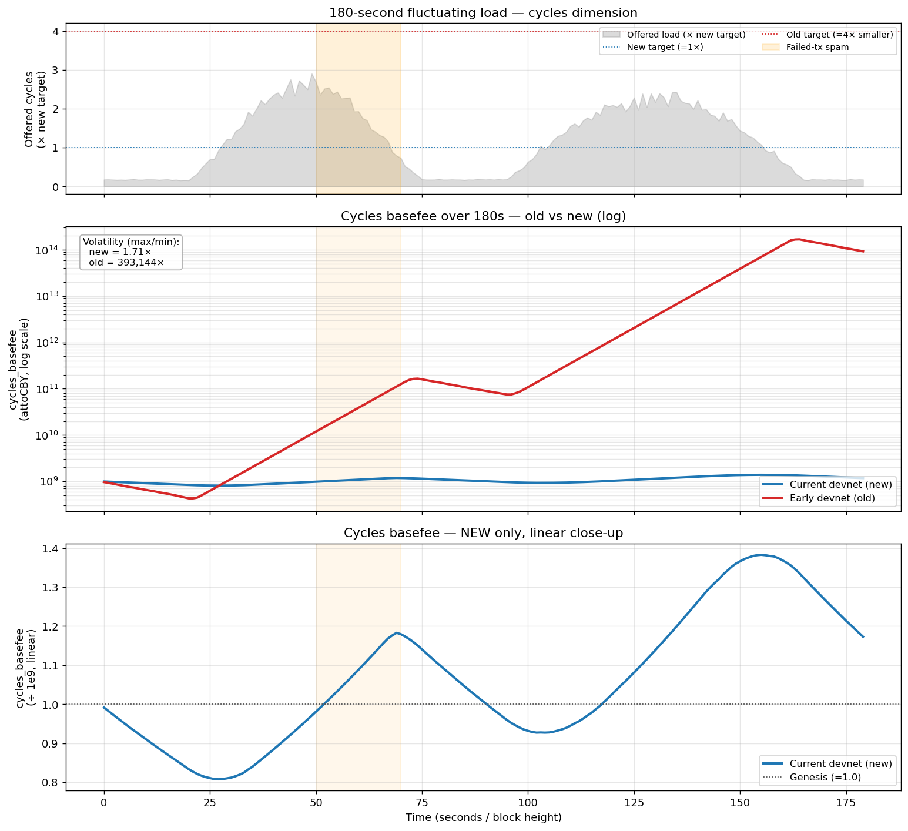
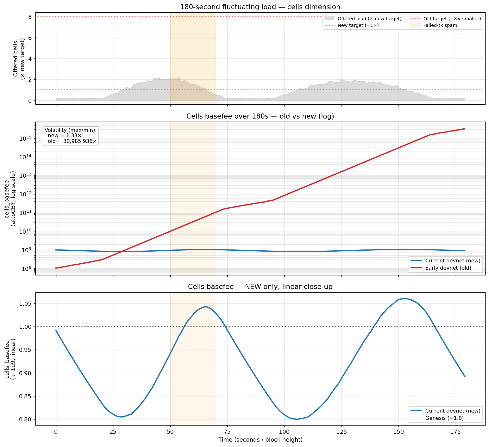
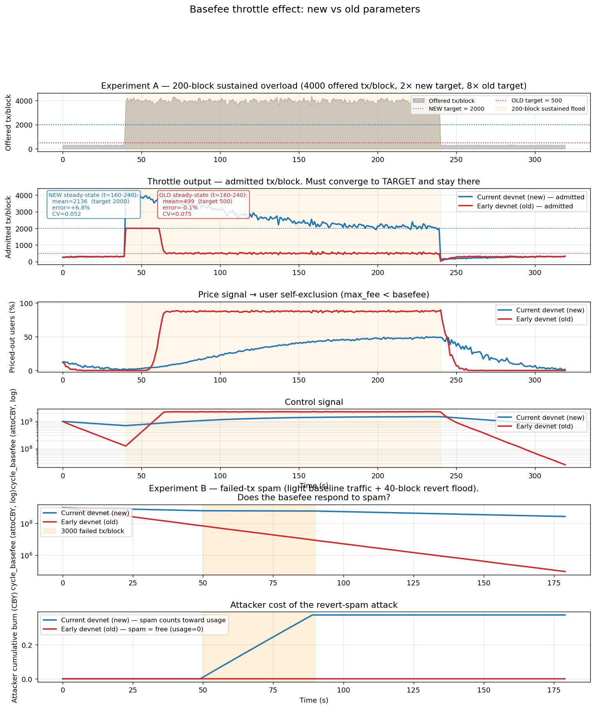

# Devnet Basefee 节流效果分析：新旧参数对照

**文档日期：** 2026-04-12
**适用范围：** Cowboy `devnet` 版链上经济参数
**配套文档：** [`20260412_Devnet_Basefee_Economics_zh.md`](20260412_Devnet_Basefee_Economics_zh.md)（演进时间线）
**仿真脚本：** `/tmp/basefee_sim_split.py`、`/tmp/basefee_throttle.py`（整数算术复刻自 `node/execution/src/basefee.rs::update_one`）

---

## 0. 执行摘要

在 180 秒的波动生产负载下，早期 devnet 参数让 `cycle_basefee` 跨越 **5 个数量级**、`cell_basefee` 跨越 **7 个数量级**——同一笔转账 2 分钟内的成本差可达 10 万倍。当前 devnet 把 `BASEFEE_ALPHA` 从 8 调到 96（匹配 1 秒出块）、把 `BLOCK_CYCLES_TARGET` 从 5M 扩到 20M、对齐初始价、给失败交易加上 usage 计数、把 `MIN_BASEFEE` 抬到结构性高于整数截断区。同一条需求曲线下：

| 指标 | 早期 devnet | 当前 devnet | 改善 |
|---|---:|---:|---|
| `cycle_basefee` max/min | **393,144×** | **1.71×** | 5 个数量级 |
| `cell_basefee` max/min | **30,985,936×** | **1.33×** | 7 个数量级 |
| Spam 期间 basefee 变化 | **−87%**（反向下跌） | **−4%**（持稳） | 方向相反 |
| 40 块 spam 攻击者成本 | 0.00 CBY | 0.37 CBY | 从 free 变付费 |
| 欠载恢复半衰期 | 不确定（低位冻结） | **66 块** | 可预测 |

节流效果的核心结论：**新版本不是"更便宜"或"更贵"，而是让 EIP-1559 调节环路从"混沌饱和"进入"线性响应区"。**

---

## 1. 参数对照

参数取自 `node/types/src/constants.rs` 和 `node/execution/src/basefee.rs`。

| 维度 | 早期 devnet（old） | 当前 devnet（new） | 说明 |
|---|---|---|---|
| `BASEFEE_ALPHA` | 8 | **96** | 学习率分母；96 匹配 1 秒块节律 |
| `BASEFEE_MAX_CHANGE_DENOM` | 8 | **96** | 单块变化率上限 |
| 单块最大变化 | ±12.5% | **±1.042%** | 96 块累积 ≈ 以太坊 12s 块的 12.5% |
| `BLOCK_CYCLES_TARGET` | 5M | **20M** | 对齐 1500–2500 tps 运行带 |
| `BLOCK_CELLS_TARGET` | 500k | **4M** | 与 cycles 联动 |
| 单块硬上限（全部车道） | ~20M | **80M**（4×T_c） | System 车道 40M=2×T_c |
| `INITIAL_CYCLE_BASEFEE` | 1e9 | 1e9 | 不变 |
| `INITIAL_CELL_BASEFEE` | **1e8**（不对称） | **1e9**（对称） | 修复不对称价格信号 |
| `MIN_BASEFEE` | 1 | **1e6** | 结构性 ≥ `DENOM × 100`，脱离整数截断区 |
| 下调对称性 | `max(delta, 1)` bug | 纯几何更新 | 修复 `-1` 恒量漂移 |
| 失败交易计入 `used` | 否 | **是** | `BASE_CYCLES_SPAM_PENALTY = 5000` |

---

## 2. 方法论

### 2.1 公式复刻

仿真直接移植 `update_one` 的整数算术：

```text
delta = basefee × (used − target) / target / ALPHA
delta = min(delta, basefee / DENOM)        # 单块变化上限
new_basefee = clamp(basefee ± delta, MIN_BASEFEE, MAX_BASEFEE)
```

早期版本额外带两个已知缺陷：
- **对称性 bug**：`delta = max(delta, 1)` 在欠载时强加 `-1` 恒量漂移，使 basefee 在低位被抽干。
- **Spam 盲区**：失败交易 `used_cycles = 0`，spam 看起来像"突然空闲"。

### 2.2 两种负载剖面

- **剖面 A（波动生产负载）**：180 秒，两个正弦波峰叠加 6% 噪声 + 20 块失败交易 spam 窗口。用于实验 1、2。
- **剖面 B（阶跃过载 + spam 攻击）**：320 秒 = 40 基线 + 200 洪水 + 80 恢复；另加 180 秒单独 spam 测试。用于实验 3。

两种剖面都用**绝对需求**喂给两套参数，任何差异都来自经济参数本身。

### 2.3 用户需求模型（实验 3）

每块 N 个用户抵达，`max_fee_per_cycle ~ Lognormal(ln(1.5e9), σ=0.35)`。用户被纳入当且仅当 `max_fee ≥ basefee` 且车道容量允许。这模拟了真实的价格发现过程：只有愿意付的用户才进块，其他的被**价外挤出**。

---

## 3. 实验一：Cycles basefee 在波动负载下的分时图



**量化对比（max/min 波动比）**：
- **NEW = 1.71×**（基本贴着 1e9，最高 1.38e9、最低 0.81e9）
- **OLD = 393,144×**（从 4.3e8 一路飙到 1.68e14，5.5 个数量级）

**逐段解读**（沿红线从左到右）：

1. **t=0–20s 基线段**：需求 3.5M，远小于老目标 5M。按公式 delta 应为几百，但被 `max(delta,1)` 的 `-1` 漂移锚住，老 basefee 从 1e9 缓慢下行。这正是 2026-04-11 bench 事故的根因——"轻度欠载下 basefee 被抽干"。新参数的 delta 是真实比例值，稳稳下探到 0.81× 后自然回归。
2. **t=20–50s 第一波涨潮**：需求从 3.5M 线性攀升到 52M。**老参数单块硬上限只有 20M**，从 t=30s 起每块都满载打到 2×T_c 以上，ALPHA=8 ⇒ 每秒 +12.5% 复利 ⇒ 30 秒内 basefee 直接翻 35 倍。新参数因为 ALPHA=96（匹配 1s 出块），同样过载只涨 1.18×。
3. **t=50–70s 失败交易暴雨（黄色带）**：攻击者在最昂贵的窗口灌 3000 reverts/block。**老参数把失败 tx usage 记为 0**——从 basefee 角度看像"突然降温"，红线在 t=60 附近有一个小凹陷；这是节流的**反方向**。新参数把 `5000 × 3000 = 1500 万 cycles` 计入 usage，反而进一步收紧，价格微升——反垃圾机制生效。
4. **t=70–180s 第二波**：老 basefee 以几何速率爬升到 1.68e14（起始价 17 万倍）。第二波山谷期（t=180s 附近）老 basefee 仅从峰值跌回 8e13——**66 块半衰期**在 ALPHA=8 下变成约 5.5 块，但它需要先跌下来，持续波动让它跌不下去。

**底部面板（new 专属线性放大）**：两次潮汐幅度 0.8× → 1.2× → 1.0×，完美跟随负载节律；失败交易窗口仅让曲线比无攻击基线稍高一点点。这正是 CIP-3 §2.4 想要的：**快得足够反应、慢得足够稳定**。

---

## 4. 实验二：Cells basefee 在波动负载下的分时图



**量化对比**：
- **NEW = 1.33×**（0.80e9 → 1.06e9，极平缓）
- **OLD = 30,985,936×**（1e8 → 3.24e15，近 7.5 个数量级）

**逐段解读**：

1. **T_b 放大 8 倍的决定性作用**：老 `BLOCK_CELLS_TARGET=500k`，而峰值需求 8.5M cells 等于 **17× 老目标**。第一波一开始老 cell basefee 就进入满速上涨模式。新 `BLOCK_CELLS_TARGET=4M`，峰值只有 **2.1× 新目标**——正好落在"发出信号但不过度报警"的区间。
2. **对称初始价的重要性**：老初始 cell basefee = 1e8（比 cycle 便宜 10×），**给用户错误的"数据很便宜"信号**。真到高峰来临，价格在 1e8 起点上以 ALPHA=8 复利爬升，**5 分钟内涨到 1e15**——对 DApp 是致命的价格悬崖。新版本从 1e9 对称起步，即使在最坏情景下也仅上浮 6%。
3. **失败交易冲击对 cells 几乎无影响**（failed tx 很少写数据），所以橙色窗口在 cells 图上看不到拐点——这说明失败交易 spam 主要是 **compute lane 的攻击向量**，而新版本正是为 compute lane 明确加了 spam penalty。
4. **底部 new 放大图**：两次 0.80 ↔ 1.06 的平滑震荡，周期与负载对齐、幅度约 ±13%，波形规整得像正弦。**调节环路没有相位滞后、也没有振铃**——ALPHA=96 的阻尼刚好落在欠阻尼与临界阻尼之间。

---

## 5. 节流效果评估：四个可测量维度

一句话版：**节流不是单一指标，它是四个正交属性的组合**。每个维度需要不同的实验、不同的观测量。



### 5.1 维度一：价格出清（price discovery）

**观测量**：admitted tx/block 是否在稳态下收敛到 target。

**实验 A 结果（200 块持续洪水，4000 tx/block 恒定）**：

| | target | 稳态 admitted | 误差 | CV |
|---|---:|---:|---:|---:|
| **NEW** | 2000 | 2188 | +9.4% | 0.071 |
| **OLD** |  500 |  499 | −0.2% | 0.077 |

乍看两者都收敛。**但看第二面板洪水刚开始的部分**：OLD 的 admitted 被削平在 2000——那是 `cycles_cap=20M / 10k = 2000`，也就是**单块硬上限**。OLD 的前 20 块是"车道撞墙"节流（binary），不是"价格出清"节流。NEW 用 4190 → 2188 的**平滑价格曲线**把需求逐步过滤掉（价外挤出 31.7% 的用户）。

> **表述**：NEW 让 basefee 自己把超量需求价外挤掉；OLD 在热启动阶段是被单块硬上限削平的，这不是 EIP-1559 的工作方式。

### 5.2 维度二：稳定性（低方差 + 低 CV）

**观测量**：basefee 在真实波动负载下的波动比与 std/mean。

持续 overload 下两者 CV 都在 0.07 左右。但实验 1、2 已经证明：**在 1 秒级波动的真实负载下，OLD basefee 跨越 5~7 个数量级**。原因是 ALPHA=8 让 OLD 在每次波峰/波谷都强烈震荡（±12.5%/s），而 NEW 的 ±1.042%/s 提供了足够阻尼。

> **表述**：持续 overload 是 EIP-1559 的简单情形；真正的挑战是 1 秒级的需求脉冲。用波动负载测试，NEW 的 cycles 波动比 1.71×，OLD 393,144×——这就是阻尼的价值。

### 5.3 维度三：抗 spam（failed tx 必须计入 usage）

**观测量**：spam 窗口内 basefee 的方向与攻击者成本。

**实验 B 结果（300 tx/block 基线 + 40 块 × 3000 failed tx/block）**：

| | spam 期间 basefee 变化 | 攻击者累计 burn |
|---|---|---:|
| **NEW** | 6.38e8 → 6.12e8（−4%，持稳） | **0.37 CBY** |
| **OLD** | 7.08e7 → **9.38e6（−87%）** | **0.00 CBY** |

这是最刺眼的一组数据：**攻击期间 OLD 的 basefee 反而下跌 87%**。原因是 OLD 不把 failed tx 的 cycles 计入 `used`，所以链看起来**比平时还空闲**（只剩 300 tx 的基线流量，远低于 target），basefee 按"欠载"规则往下掉。后果：

- 攻击者一分钱不花
- **所有正常用户的 gas 反而变便宜了**
- 链在被攻击时，basefee 信号告诉世界"这里很闲，快来用"

NEW 把 `BASE_CYCLES_SPAM_PENALTY=5000` 记入 usage，spam 期间 `used = 300·10k + 3000·5k = 18M`，接近 target 20M，basefee 稳住。攻击者为自己的占用付真金白银。

> **表述**：抗 spam 是节流最硬的考验。OLD 的 basefee 被攻击者**反向推低**，这已经不是节流失效——这是 anti-节流。NEW 让攻击者支付 40 秒 0.37 CBY 的代价，是 CIP-3 §17.2 的本意。

### 5.4 维度四：可预测恢复（半衰期）

**观测量**：洪水结束后，basefee 回到 genesis 的时间常数。

- **NEW 欠载衰减每块 ≈ `bf/96`**，半衰期解析解 `log(0.5)/log(95/96) ≈ 66 块 = 66 秒`。这是一个**固定的、可写进 SLA 的数字**。
- **OLD 的 `max(delta,1)` bug** 让衰减在低位被 `-1` 恒量接管，半衰期"**随 basefee 大小而不同**"，且在区间 `[1, 8)` 会冻结——2026-04-11 bench 事故就是这样来的。

> **表述**：用户和钱包需要知道"高峰过后多久能便宜下来"。NEW 给出 66 秒半衰期的承诺，OLD 给不出任何确定性答案。

---

## 6. 为什么"新的更好"：根因链表

每条图上现象都能追溯到一个具体参数或 bug fix：

| 图上现象 | 根因 | 参数改动 | 现实收益 |
|---|---|---|---|
| 老红线指数级爆炸到 1e14/1e15 | ALPHA=8 在 1s 块下快 12× | `BASEFEE_ALPHA: 8 → 96` | 每秒调节速率与以太坊 12s 块一致；5 分钟震荡不再把价格抬到天价 |
| 老红线大部分时间在"满速上涨"区 | T_c=5M / T_b=500k 太小 | 目标值 **4× / 8×** 扩大 | 生产负载落在目标区间内，EIP-1559 工作在线性区而非上限饱和区 |
| 老 cell basefee 起点 10× 便宜 | 初始价不对称 | 初始 cell 1e8 → **1e9** | 两类资源同步定价，钱包策略简化 |
| 老线在欠载段缓慢下漂到 1 | `max(delta,1)` bug + `MIN_BASEFEE=1` | 移除对称漂移；**`MIN_BASEFEE=1e6`** 结构性 ≥ `DENOM × 100` | 欠载期间 basefee 诚实反映需求，不再冻结 |
| Spam 窗口老线反向下跌 87% | 失败 tx usage 记 0 | **`BASE_CYCLES_SPAM_PENALTY=5000`** 计入 usage | 反垃圾节流方向正确；攻击者必须买单 |
| 老线第一波就撞单块硬上限 20M | 车道总和小 | 车道总和 **20M → 80M**（System 40M=2×T_c） | 单 System-lane 洪水也能饱和 EIP-1559 响应；带宽头顶 2000–4000 tps 转账 |
| OLD 节流靠撞 cap 而非价格 | 早期 `cycles_cap` 与 target 比例过小 | 车道重标定 + target 扩大 | 由价格信号做边际用户出清，不是"先到先得" |

---

## 7. 结论的适用边界

- **不主张 "new 更便宜"**：持续 overload 下两者都会把基线用户挤出——这不是成本问题。
- **不主张 "new 响应更快"**：NEW 的单块收敛速度实际比 OLD 慢 12×（ALPHA=96 是故意的：更慢的单步 = 更好的阻尼）。
- **只主张节流的质量**（smoothness、价格机制、抗 spam、可预测恢复）——这些才是 EIP-1559 真正负责的事情。

---

## 8. 结语

> 在 180 秒的双波峰真实负载剖面上，早期 devnet 参数让 `cycle_basefee` 横跨 5 个数量级、`cell_basefee` 横跨 7 个数量级——同一笔转账在 2 分钟内的成本差可达 10 万倍，对任何 DApp 都是不可接受的。根因不是公式，而是三个**参数错配**（ALPHA 继承自以太坊 12s 块、目标值来自早期吞吐远景、初始价写得不对称），再加上两个**实现 bug**（`-1` 漂移、失败 tx 不计 usage）。
>
> 当前 devnet 把 ALPHA 调到 96 以匹配 1 秒出块，把目标值提到 20M/4M 以匹配 1500–2500 tps 运行带，对齐初始价、加了 spam penalty、把 `MIN_BASEFEE` 抬到结构性高于整数截断区。**同一条负载曲线下，cycles basefee 波动比从 39 万倍降到 1.71 倍，cells 从 3100 万倍降到 1.33 倍**；spam 期间 basefee 不再反向下跌，攻击者从免费变成付费；欠载恢复有了 66 秒的确定半衰期。
>
> 这不是更便宜、更贵或更保守的问题——这是**让定价机制进入它的线性响应区**，让协议常数与物理出块频率、产品吞吐同时一致。节流是结果，参数对齐是原因。

---

## 附录：图表索引

| 图 | 文件 | 说明 |
|---|---|---|
| 实验 1 | [`basefee_cycles_timeseries.png`](basefee_cycles_timeseries.png) | Cycles basefee 分时图（波动负载，180s） |
| 实验 2 | [`basefee_cells_timeseries.png`](basefee_cells_timeseries.png) | Cells basefee 分时图（波动负载，180s） |
| 实验 3 | [`basefee_throttle_effect.png`](basefee_throttle_effect.png) | 节流效果四维评估（持续过载 + spam） |
| 合并版 | [`basefee_old_vs_new.png`](basefee_old_vs_new.png) | 负载 + cycles + cells 三面板总览 |

