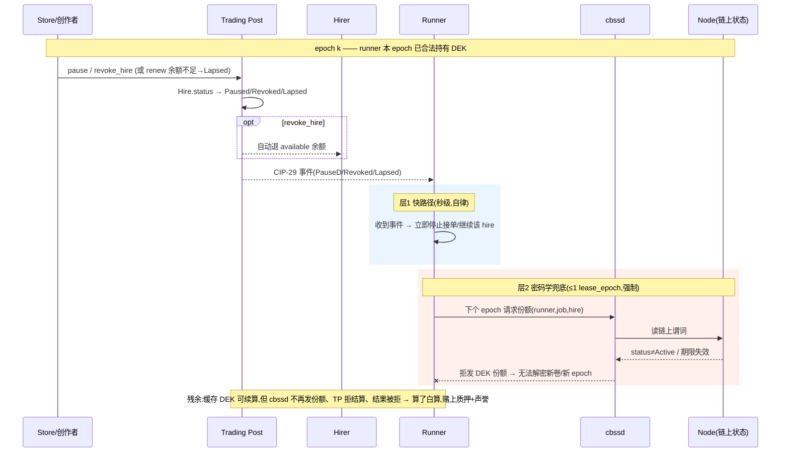

# CIP-33 Trading Post — 商业企图与机制详解(含时序图)

> 来源:`cowboy/docs/cips/cip-33-actor-hiring-and-distribution.md`(Draft,Standards Track / System Actor)
> 实现:node PR #700(CIP-33 Trading Post system actor + rails);规格 PR:cowboy #180
> 状态参考:Marshal 审计 #700 = NEEDS_HUMAN(2 latent HIGH 已上棘轮),#180 = NEEDS_HUMAN(规格↔实现协调)
> 整理:2026-06-14

---

## 0. 一句话本质

CIP-33 把 **"AI Agent / 智能合约的 App Store + 分销 + 计费 + 版权保护"** 做成链上协议层基础设施。它本身不是一个商店,而是任何人都能在上面开商店的"水电煤"。所有状态与逻辑住在一个治理控制(CIP-12 升级)的创世系统合约——**Trading Post(交易站)**。

类比:**App Store + Stripe Connect 分账 + DRM 版权保护** 三合一,但全部做成中立的链上协议:**商店随便开、分成强制执行、不付费就解不了密**;最大胆的延伸是让 **AI agent 之间互相雇佣付费**。

---

## 1. 它解决的核心矛盾

一个 agent 市场需要 5 个机制,而没有任何单一 App 应该独占它们:

1. **可雇佣声明(Hireability)** — 机器可读地声明某 actor 可被雇佣、以何条款、被人和被其他 actor。
2. **分销权(Distribution rights)** — 创作者授权某商店分销自己的 actor。
3. **分成(Fee splits)** — 雇佣收入按声明在创作者/商店/推荐人之间拆分,与付款原子执行。
4. **背书(Attestation)** — 可验证的评审结论绑定到精确代码快照,信任随再分发存续。
5. **强制(Enforcement)** — 对私有代码 actor,可授予、计量、撤销访问,且无需信任店面。

两条死路:
- 把"某个官方商店"写进共识 → 协议被产品垄断,违背无许可前提。
- 全交给应用层约定 → **重蹈以太坊 NFT 版税覆辙**(版税只是君子协定,任何市场可无视)。

**CIP-33 的答案:轨道在协议、商店是应用(rails-in-protocol, stores-as-apps)。** 协议强制保证分成/计费/访问控制;评审标准、佣金率、策展、UX 全是商店的产品。差异化推论:**actor 用人类同一套轨道雇佣 actor**,使每个发布的 actor 成为所有其他 actor 可调用的能力。

---

## 2. 核心机制(玩法)

### 2.1 三层身份
- **Declaration(声明)**:创作者声明 actor 可雇佣,带 append-only 版本(不可原地改)。`declaration_id = H(creator‖actor‖salt)`,防 id 抢注。
- **Store(商店)**:任何人可开,**无任何协议特权**(包括 Cowboy 官方旗舰店也只是普通 store)。创作者 `grant` 授权某商店分销(默认非独占、可撤销)。
- **Hire(雇佣)**:买家——**人账户或另一个 actor**——付费雇佣。

### 2.2 强制分成(对以太坊版税失败的直接修正)
- `SplitVector = [(beneficiary, share_bps)]`,Σ=10000bps,≤8 项,无零份额。
- **付款时原子拆分**,在同一次方法执行内直接改余额到位;整除余数 dust 归创作者。
- **故意不走 CIP-20 transfer hook**——防止某收款方用 hook 中断/重入多腿分账;每腿仍发标准 CIP-20 事件供索引。
- **协议自己一分钱不抽**(只赚 gas + compute)。

### 2.3 四种定价
- `OneShot`:一次买断、永久,**actor 退休后仍须服务**(想要日落须用 Subscription)。
- `Subscription`:订阅,`renew` 推进 `paid_through`。
- `PerCall`:按调用计量,走 CIP-8 MPP 会话;钱在 `reserved` 里。
- `Free`:无钱,有效性 = 声明 ∧ grant ∧ hire 全 Active。

预付模型:钱只能显式充值(`hire`/`deposit`),**没有任何方法反向掏买家钱包**;`renew` 在周期边界从 available(=prepaid−reserved)扣费,任何人/CIP-5 定时器可调;不足 → `Lapsed`。

### 2.4 杀手锏:加密强制 = "解密垄断"而非"分销垄断"
对私有代码 actor:代码卷加密(CIP-9),实例必须拿到 **DEK** 才能跑;DEK 发放由 **CBSS(CIP-24)** 按**链上状态条件**放行。Trading Post 把"密钥发放"挂在"雇佣/租约是否有效"上 →

- **没付费 → runner 拿不到密钥 → 代码跑不起来**。
- **付费捕获与 IP 保护是同一套机制**,且**不改共识、不需要可信商店**;盗版商店转发代码也跑不了。

### 2.5 真正的差异化:Actor 雇 Actor
人能走的雇佣轨道,运行中的 actor 也能走:一个 agent 可在执行时动态发现并 `hire()` 另一个 agent 的能力(`call()` 进 `hire(...)`,用 CIP-20/CBY syscall 付款,无新 host 函数)。这是它对标"AI agent 经济"的最大野心。

### 2.6 评价背书(Attestation)
任何地址都能对某确切 `manifest_root` 发表评审(Approved/Flagged/Rejected),append-only + 可降级,绑定精确哈希。**协议不排名、不裁决**,信任谁由客户端/钱包/商店决定。Cowboy 官方评审团只是"其中一个 attester"。开放是**规格本意**(`§2.7: any address may attest`)。

---

## 3. 商业企图 / 谁赚钱

| 角色 | 怎么赚 |
|------|--------|
| 创作者 | 卖 actor 访问权(买断/订阅/按调用),分成强制到账 |
| 商店 | 收佣金(从自己那份 split 扣);靠策展+评审+信任+补偿政策竞争;可被压价;创作者可多店并行或直卖 |
| 推荐人 | 推荐位分成(从商店份额扣) |
| **协议/链** | **不抽佣**,只赚 gas + compute |

商业哲学:**利润中心放在不可分叉的计算层,分销做成开放竞争市场**——既避免"协议绑架某商店"的中心化,又用加密强制解决开放分销下的收费难题。"协议的抽成在计算(不可分叉那层),分销保持可竞争。"

---

## 4. 时序图

### 4.1 正常 hire:付款 → 分账 → 密钥发放 → 执行(私有代码 actor)

```mermaid
sequenceDiagram
    participant H as Hirer(人/actor)
    participant TP as Trading Post
    participant B as 收款方(创/店/荐)
    participant N as Dispatcher/Node
    participant R as Runner
    participant K as cbssd(CBSS)
    participant F as CBFS(加密卷)

    Note over H,F: 前置:DEK 已用 CBSS-IBE 加密到 tradingpost/{decl}/{ver}/{artifact}
    H->>TP: hire(decl, grant?, term, $X)
    TP->>TP: pin 版本+artifact;校验 split
    par 原子分账(不走 CIP-20 hook)
        TP->>B: 创作者份额
        TP->>B: 商店份额
        TP->>B: 推荐人份额(dust→创作者)
    end
    TP->>TP: 余款→prepaid;建 Hire(Active);初始化 lease
    TP-->>H: HireCreated(hire_id) + CIP-29 事件

    N->>R: 派 job_id,绑定 (hire_id, artifact)
    R->>K: 请求份额(runner_id, job_id, hire_id)
    K->>N: 读当前区块链上状态
    N-->>K: job归属✓ 绑定✓ Active✓ 期限有效✓
    alt 全部满足
        K-->>R: IBE 份额(每 hire/runner/epoch 一次)
    else 任一不满足
        K-->>R: 拒发 → 无法解密
    end
    R->>F: 取加密卷
    F-->>R: 密文
    R->>R: 用 DEK 解密 → 执行 pinned artifact
```

**密钥发放谓词(cbssd 按当前区块读 Node RPC):**
```
job(job_id) 已派给 runner_id
  ∧ job 绑定到 (hire_id, pinned artifact)
  ∧ Hire(hire_id).status == Active
  ∧ 期限有效:
      Subscription | OneShot → current_block ≤ paid_through
      PerCall               → 绑定的 MPP 会话 open ∧ funded
      Free                  → declaration ∧ grant(if any) Active
```
份额每 `(hire, runner, lease_epoch)` 只发一次;每个 lease-epoch 边界重评(`lease_epoch_blocks` 默认 1800 块 ≈ 30 分钟)。

### 4.2 PerCall 按调用结算

```mermaid
sequenceDiagram
    participant H as Hirer/Actor
    participant TP as Trading Post
    participant B as 收款方

    Note over H,TP: 会话 open:available ──移入──▶ reserved("funded")
    Note over H,TP: ...计量调用走 CIP-8 MPP 会话...
    H->>TP: settle_per_call(hire, session_receipt)
    Note right of TP: receipt = CIP-8 会话结算单【双方签名】的调用数/金额
    TP->>TP: 从 reserved 扣 settled;余下 release 回 available
    TP->>B: 对 settled 执行 hire 的 pinned split
```

### 4.3 失效 / 撤销:两层停服 + 缓存 DEK 残余

失效触发源:

| 触发 | 谁能做 | 是否掐正在付费的服务 |
|---|---|---|
| `pause` / `revoke_hire` | 商店(其分销的 hire);创作者(仅直接雇佣的 Free/PerCall) | **会**(信任安全例外) |
| 余额不足 → `Lapsed` | 自动(renew 时) | 会(欠费停租) |
| `revoke_grant` / `retire_declaration` | 创作者 | **不会**——只挡新雇佣,已付费服务到 paid_through 仍履约 |



**两层失效:**
- **层 1 快路径(秒级)**:runner MUST 订阅 CIP-29 生命周期事件,观察到 `pause`/`revoke_hire` 即停;靠声誉/slashing(CIP-2)担保,非共识。
- **层 2 密码学兜底(≤ 一个 lease_epoch)**:不论 runner 是否自律,下个 lease-epoch 边界 cbssd 必然停发份额。**最坏延迟 = 一个 lease_epoch(默认 ≈30 分钟)。**

**残余风险(已接受,有界)**:epoch k 已合法解密的 runner 可缓存 DEK 续算,但**算了白算**——cbssd 不再发新份额、TP 拒绝对非 Active hire 结算、撤销 hire 的 job 结果在结算流被拒;惩罚面 = runner 质押 + 声誉。商店权力"诚实":只能掐它分销的、未来的调度+密钥,够不到 runner 内存、动不了 actor 本体、不影响走别家 store 的 hire,且每个 pause/revoke 发 CIP-29 事件公开可审计。

---

## 5. 消费者保护 / 诚实声明(规格自陈)

- **创作者不能 rug 已付费订户**:`retire`/`revoke_grant` 只挡新雇佣,已付费服务到 `paid_through`(OneShot 为永久)仍须履约。
- **商店有权在付费期内 pause/revoke**(信任安全例外):只退未花预付款;**OneShot 买断的永久访问可能被商店掐断且无协议补救**——文档明示让客户端据此衡量商店信任,商店以补偿政策竞争。
- **直接雇佣的创作者无此例外**:只能 pause/revoke 直接雇佣的 Free/PerCall;付费的 Subscription/OneShot 直接雇佣**创作者根本不能撤销**(退出方式只有不再续约),避免撤销权变成 rug 工具。

---

## 6. 未决问题(§6)与已知实现缺口

规格未决(§6):按周期托管已执行分账以支持 pro-rata 退款;per-epoch IBE 标签轮换硬化缓存 DEK;PerCall 速率限制与会话上限;能力 schema 注册表;Forked 实例是否默认;加密等价性证明(目前 `claimed_root` 只是签名声明不是证明)。

**实现侧已知缺口(node #700,截至 2026-06-14,Marshal 审计):**
- 🔴 `settle_per_call` **先付后扣、无 per-tx 回滚**(违反 §2.4 "settlement fails closed as a whole")→ 棘轮 `econ.trading_post_settle_conservation`。
- 🔴 PerCall receipt validator 仍是**未签名 stub**(违反 §2.6.3 "bilaterally signed")→ 棘轮 `tp.percall_settle_fail_closed_under_stub`。
- 两者目前 **latent/dormant**:`reserved` 生产从不充值(§2.5.1/§2.6.3 的 session-open 充值路径尚未建)。**建此路径即激活两 HIGH**,故规格+实现+不变量需作为一次升级原子上线。

---

## 7. 三句话总结

1. **分账协议强制、原子、不可绕过**(修以太坊版税之失)。
2. **密钥发放 = 付费闸门**:cbssd 按"雇佣是否有效"的链上谓词决定发不发解密份额,**没付费就跑不了**;撤销/欠费在 ≤1 个 lease_epoch(≈30 分钟)内密码学生效。
3. **协议不抽佣、不绑定商店、不裁决评审**:把利润放在不可分叉的计算层,分销/策展/信任全交给开放竞争的应用层市场;最大野心是 **agent 雇 agent**。
