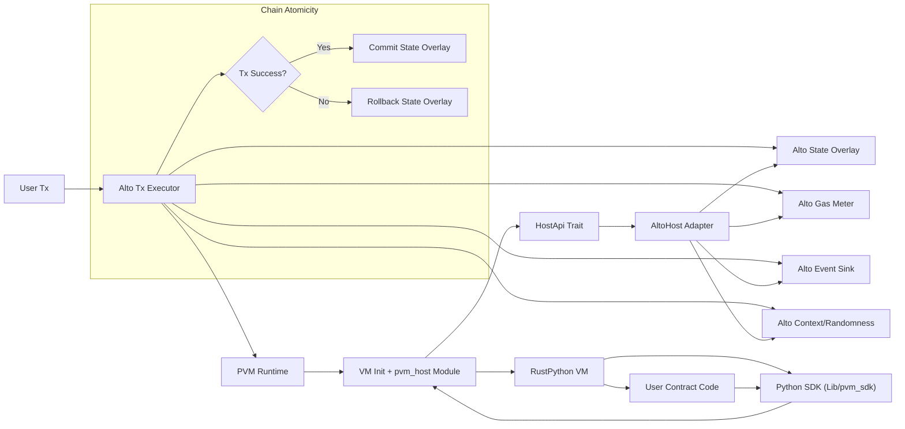

# PVM 与主链（Alto）低耦合对接方案与 API 说明

本文基于当前 PVM 代码形态（RustPython fork）整理一套可落地的低耦合方案，同时汇总 Alto <-> PVM 的调用接口与约定，便于链侧集成与后续维护。

## 1. 目标与边界

### 1.1 执行约束
- 默认每笔 TX 在链上同步执行完毕；如启用 continuation（FSM 或 Checkpoint），恢复执行视为下一笔 TX，并通过 resume/checkpoint 参数显式接力。
- 所有非确定性输入必须通过 Host API 注入（时间、随机数、区块高度）。
- 不允许 PVM 直接访问主链内部类型或存储结构。

### 1.2 耦合边界
- PVM 核心不依赖 Alto 类型，不引入 Alto crate 依赖。
- Alto 仅通过 Host API 适配层对接 PVM。
- PVM 的 Python SDK 不直接绑定链接口，只调用 `pvm_host`。

## 2. 目录与模块拆分建议

建议将“链集成能力”从 RustPython fork 中剥离出来，并以小范围 patch 方式保留必要 hooks。

### 2.1 目录布局

- `crates/pvm-host`
  - 定义最小 Host API trait、类型、错误码
  - 只包含纯 Rust 类型，不依赖链实现

- `crates/pvm-runtime`
  - PVM 运行时包装器，初始化 VM 并注册 `pvm_host` 模块
  - 负责执行入口、加载/卸载 VM、桥接 Host API

- `crates/codegen`
  - `pvm_fsm` 编译 pass（基于 `@runner.continuation/@actor.continuation` 生成 FSM）

- `Lib/pvm_sdk`
  - Python 侧 SDK，包含 `actor/runner/continuation/runtime/verify/types` 等模块
  - 只调用 `pvm_host` 模块，不直接绑定链侧细节

- `crates/vm`
  - RustPython fork 的 VM 层能力（checkpoint/resume、continuation mode、`rustpython_checkpoint`）

- `crates/pvm-alto`（可放 Alto repo 或此处）
  - 实现 `HostApi`，将 Alto 状态、事件、gas、区块上下文适配到 PVM

- `src/main.rs`（pvm binary）
  - 仅作为本地调试入口，调用 `pvm-runtime`
  - 链上执行使用库调用，不依赖该 binary

### 2.2 保持上游同步的策略
- 对 RustPython 核心修改尽量少，使用 `cfg(feature = "pvm")` 包裹。
- 所有 PVM 专用逻辑尽量放到 `pvm-runtime` 或 `pvm-host`。
- 保持清晰 patch 列表，使用 `git range-diff` 或 `format-patch` 管理上游同步。

## 3. Alto <-> PVM API 对接

### 3.1 Rust 侧执行入口（pvm-runtime）

```rust
pub fn execute_tx(
    host: &mut dyn HostApi, // 链侧 Host 适配器：负责状态/事件/gas/上下文等能力注入
    code: &[u8],            // 合约源码（UTF-8 bytes），按 Python 源码解析执行
    input: &[u8],           // 交易输入原始 bytes，注入到 Python 变量/入口参数
) -> Result<Bytes, HostError> // 成功返回输出 bytes，失败返回稳定 HostError
```

```rust
pub fn execute_tx_with_options(
    host: &mut dyn HostApi,     // 链侧 Host 适配器
    code: &[u8],                // 合约源码（UTF-8 bytes）
    input: &[u8],               // 交易输入原始 bytes
    options: &ExecutionOptions, // 执行参数：模块名/入口函数/确定性/continuation 等
) -> Result<Bytes, HostError>   // 成功返回输出 bytes，失败返回稳定 HostError
```

- `code`: Python 源码（UTF-8 bytes）
- `input`: 交易输入（raw bytes），会注入到 Python 侧
- 返回值：Python 合约输出 bytes

### 3.2 执行选项（ExecutionOptions）

关键字段（见 `crates/pvm-runtime/src/lib.rs`）：

- `module_name`: Python 模块名（默认 `__main__`）
- `source_path`: 伪路径/文件名（用于 traceback / `__file__`）
- `input_var`: 默认注入变量名（默认 `__pvm_input__`）
- `output_var`: 默认输出变量名（默认 `__pvm_output__`）
- `entrypoint`: 可选函数入口（设置后调用 `entrypoint(input_bytes)`）
- `host_module_name`: Python 侧 Host 模块名（默认 `pvm_host`）
- `init_stdlib`: 是否初始化 stdlib（默认 true）
- `deterministic`: 设为 true 时启用确定性运行时限制
- `hash_seed`: 指定 hash seed（用于非严格确定性配置）
- `determinism`: 细粒度确定性选项（白/黑名单、软浮点、gas 等）
- `set_main_module`: 是否将模块别名注册为 `__main__`
- `continuation`: continuation 运行配置（见 3.7）

### 3.3 Host API 核心类型

```rust
pub type Bytes = Vec<u8>; // 统一的字节容器类型，所有 Host API 输入/输出基于 bytes

#[derive(Clone, Debug)]
pub struct HostContext {
    pub block_height: u64, // 区块高度（链上确定性输入）
    pub block_hash: [u8; 32], // 区块哈希（32 bytes）
    pub tx_hash: [u8; 32], // 交易哈希（32 bytes）
    pub sender: Bytes, // 交易发起方地址（编码由链侧定义）
    pub timestamp_ms: u64, // 区块时间戳（毫秒）
    pub actor_addr: Bytes, // 合约/Actor 地址（编码由链侧定义）
    pub msg_id: Bytes, // 消息/调用 ID（用于跨调用关联）
    pub nonce: u64, // 交易/消息 nonce（防重放或排序）
}

#[derive(Clone, Debug)]
pub enum HostError {
    OutOfGas, // gas 已耗尽
    InvalidInput, // 输入不合法（语法/类型/参数校验失败）
    NotFound, // 资源不存在（如 key 未命中）
    StorageError, // 状态存取失败（底层存储/IO 错误）
    Forbidden, // 非确定性/权限违规
    Internal, // 其他内部错误
}
```

### 3.4 HostApi trait（链侧实现）

定义在 `crates/pvm-host/src/lib.rs`：

```rust
pub trait HostApi {
    /// 读取合约状态；key 为原始 bytes；None 表示不存在。
    fn state_get(&self, key: &[u8]) -> HostResult<Option<Bytes>>;
    /// 写入合约状态；value 为原始 bytes（编码由链侧约定）。
    fn state_set(&mut self, key: &[u8], value: &[u8]) -> HostResult<()>;
    /// 删除合约状态。
    fn state_delete(&mut self, key: &[u8]) -> HostResult<()>;

    /// 发送链上事件；topic 为可读字符串，data 为原始 bytes。
    fn emit_event(&mut self, topic: &str, data: &[u8]) -> HostResult<()>;

    /// 扣除 gas；amount 为要扣除的 gas 数量。
    fn charge_gas(&mut self, amount: u64) -> HostResult<()>;
    /// 查询剩余 gas。
    fn gas_left(&self) -> u64;

    /// 获取链上上下文（区块/交易/消息等）。
    fn context(&self) -> HostContext;
    /// 提供确定性随机性；domain 为自定义域分隔 bytes。
    fn randomness(&self, domain: &[u8]) -> HostResult<[u8; 32]>;

    /// 发送跨合约消息；target 为目标地址 bytes，payload 为消息载荷 bytes。
    fn send_message(&mut self, target: &[u8], payload: &[u8]) -> HostResult<()>;
    /// 调度未来高度的定时消息；返回 timer_id bytes 用于取消。
    fn schedule_timer(&mut self, height: u64, payload: &[u8]) -> HostResult<Bytes>;
    /// 取消定时器；timer_id 为 schedule_timer 的返回值。
    fn cancel_timer(&mut self, timer_id: &[u8]) -> HostResult<()>;
}
```

### 3.5 Python 模块（pvm_host）

由 `pvm-runtime` 注入，定义在 `crates/pvm-runtime/src/module.rs`：

```python
import pvm_host

pvm_host.get_state(key: bytes) -> bytes | None  # 读取状态；不存在返回 None
pvm_host.set_state(key: bytes, value: bytes) -> None  # 写入状态
pvm_host.delete_state(key: bytes) -> None  # 删除状态
pvm_host.emit_event(topic: str, data: bytes) -> None  # 发事件；topic 为可读字符串
pvm_host.charge_gas(amount: int) -> None  # 扣除 gas
pvm_host.gas_left() -> int  # 查询剩余 gas
pvm_host.context() -> dict  # 读取链上上下文字段
pvm_host.randomness(domain: bytes) -> bytes  # 确定性随机数，domain 为域分隔
pvm_host.send_message(target: bytes, payload: bytes) -> None  # 发跨合约消息
pvm_host.schedule_timer(height: int, payload: bytes) -> bytes  # 计划定时消息，返回 timer_id
pvm_host.cancel_timer(timer_id: bytes) -> None  # 取消定时器
pvm_host.runtime_config() -> dict  # 读取运行时配置（如 continuation_mode）
```

`context()` 返回字段：

- `block_height`: int
- `block_hash`: bytes(32)
- `tx_hash`: bytes(32)
- `sender`: bytes
- `timestamp_ms`: int
- `actor_addr`: bytes
- `msg_id`: bytes
- `nonce`: int

`runtime_config()` 当前返回字段：

- `continuation_mode`: `"fsm"` 或 `"checkpoint"`

### 3.6 输入/输出约定

**输入**：

- `input` bytes 会注入到 Python 变量 `__pvm_input__`（可配置）。
- 若设置 `entrypoint`，运行时会执行 `entrypoint(input_bytes)`。

**输出**：

- `__pvm_output__ = b"..."`
- 或 `entrypoint(...) -> bytes`

输出必须是 bytes-like 或 `None`，否则抛出类型错误。
若触发 checkpoint（`rustpython_checkpoint.checkpoint_bytes()`），本次执行输出为空 bytes，并由 runtime 负责写入 checkpoint（见 3.7）。

### 3.7 Checkpoint/Continuation 参数提交

**现状（已实现）**：

- `ExecutionOptions` 已包含 `continuation: Option<ContinuationOptions>`，默认 `mode = fsm`。
- `pvm` CLI 支持 `--continuation fsm|checkpoint` 与 `--resume <path>`（文件恢复，仅适合本地调试）。
- `rustpython_checkpoint.checkpoint_bytes()` 用于链上场景的 bytes checkpoint（避免文件 I/O）。

**ContinuationOptions 结构**（见 `crates/pvm-runtime/src/continuation.rs`）：

```rust
pub struct ContinuationOptions {
    pub mode: ContinuationMode, // fsm | checkpoint：选择编译期 FSM 或运行时快照
    pub resume_bytes: Option<Vec<u8>>, // 直接传入的快照 bytes（优先级高于 resume_key）
    pub resume_key: Option<Vec<u8>>, // 从 host state 读取快照的 key（链侧存储定位）
    pub checkpoint_key: Option<Vec<u8>>, // 保存快照到 host state 的 key（为空则丢弃）
}
```

**语义说明**：

- `mode = Fsm`：
  - VM 编译期启用 `pvm_fsm` transform（`@runner.continuation/@actor.continuation`）。
  - `resume_*` 在运行时被忽略（仅 Checkpoint 模式读取）。
- `mode = Checkpoint`：
  - `resume_bytes`（优先）或 `resume_key` 用于从 host state 读取快照。
  - 调用 `checkpoint_bytes()` 后，runtime 将快照写入 `checkpoint_key`（如配置），并返回空 bytes。
- `checkpoint_key` 未设置时，checkpoint bytes 会被丢弃（仅用于调试/观察）。

**推荐流程**：

1) 首次执行：`mode = Checkpoint`，`resume_bytes = None` / `resume_key = None`
2) 触发 checkpoint：runtime 写入 `checkpoint_key` 对应的 host state
3) 下一笔 TX：将 `resume_key` 或 `resume_bytes` 传回，继续执行

### 3.8 错误与异常映射

- Python 侧 `pvm_host.HostError` 继承 `RuntimeError`，额外字段：
  - `code`: u32（稳定错误码）
  - `name`: str（稳定错误名）
- Python 抛 `pvm_host.HostError` -> Rust `HostError`（按 code/name 还原）
- Python 抛 `pvm_host.DeterministicValidationError` -> `HostError::InvalidInput`
- Python 抛 `pvm_host.NonDeterministicError` -> `HostError::Forbidden`
- Python 抛 `pvm_host.OutOfGasError` -> `HostError::OutOfGas`
- Python `SyntaxError`/`TypeError` -> `HostError::InvalidInput`
- 其他异常 -> `HostError::Internal`

### 3.9 文件与代码位置索引

- Host API 定义：`crates/pvm-host/src/lib.rs`
- Runtime 入口：`crates/pvm-runtime/src/lib.rs`
- Python Host 模块：`crates/pvm-runtime/src/module.rs`
- Host 句柄桥接：`crates/pvm-runtime/src/host.rs`
- Continuation 选项与运行配置：`crates/pvm-runtime/src/continuation.rs`
- 文件系统模拟 Host：`crates/pvm-alto/src/lib.rs`
- Checkpoint stdlib：`crates/vm/src/stdlib/rustpython_checkpoint.rs`
- FSM 编译 pass：`crates/codegen/src/pvm_fsm.rs`
- Python SDK：`Lib/pvm_sdk/`
- 示例调用：`examples/pvm_runtime_chain_demo/`

### 3.10 本地验证（FSM/Checkpoint）

以下验证流程基于 `examples/pvm_runtime_chain_demo/` 下的 demo 脚本。

- 构建：
  - `cargo build --example pvm_runtime_chain_demo`
- macOS 动态库：
  - 需要同时提供 `libffi` 与 `libiconv`，示例：
    - `DYLD_LIBRARY_PATH=/opt/homebrew/opt/libffi/lib:/opt/homebrew/opt/libiconv/lib`
- FSM 流程：
  - 一键脚本：`examples/pvm_runtime_chain_demo/run_fsm_demo.sh`
  - 启动：`DYLD_LIBRARY_PATH=... target/debug/examples/pvm_runtime_chain_demo --continuation fsm examples/pvm_runtime_chain_demo/fsm_demo.py start`
  - 恢复：`DYLD_LIBRARY_PATH=... target/debug/examples/pvm_runtime_chain_demo --continuation fsm examples/pvm_runtime_chain_demo/fsm_demo.py ok`
  - 期望输出：
    - `output_hex=73746172746564`（started）
    - `output_hex=646f6e65`（done）
  - 状态：`tmp/pvm_state/66736d5f726573756c74` 为 `ok`
- Checkpoint 流程（确定性模式）：
  - 一键脚本：`examples/pvm_runtime_chain_demo/run_checkpoint_demo.sh`
  - 触发 checkpoint：`DYLD_LIBRARY_PATH=... target/debug/examples/pvm_runtime_chain_demo --continuation checkpoint --checkpoint-key 636865636b706f696e74 examples/pvm_runtime_chain_demo/checkpoint_demo.py`
  - 写入 runner 结果（示例脚本）：
    - 读取 `cid`：`python - <<'PY'\nfrom pathlib import Path\nprint(Path('tmp/pvm_state/636964').read_bytes().hex())\nPY`
    - 写入 `__runner_result:{cid}`：`python - <<'PY'\nfrom pathlib import Path\nimport json\nstate_dir = Path('tmp/pvm_state')\ncid = (state_dir / '636964').read_bytes()\nkey = b\"__runner_result:\" + cid\npayload = {\"result\": \"ok\"}\nraw = json.dumps(payload, sort_keys=True, separators=(\",\", \":\"), ensure_ascii=True).encode(\"ascii\")\n(state_dir / key.hex()).write_bytes(raw)\nPY`
  - 恢复执行：`DYLD_LIBRARY_PATH=... target/debug/examples/pvm_runtime_chain_demo --resume-key 636865636b706f696e74 examples/pvm_runtime_chain_demo/checkpoint_demo.py`
  - 期望状态：
    - `tmp/pvm_state/73746570` 为 `after`
    - `tmp/pvm_state/726573756c74` 为 `{'result': 'ok'}`
- 诊断：
  - 若需查看 Python 异常，设置：`PVM_PRINT_EXCEPTION=1`
- 本次实际验证结果（手动运行）：
  - FSM：`output_hex=73746172746564`（start）、`output_hex=646f6e65`（ok），`tmp/pvm_state/66736d5f726573756c74` 为 `ok`
  - Checkpoint：恢复后 `tmp/pvm_state/73746570` 为 `after`，`tmp/pvm_state/726573756c74` 为 `{'result': 'ok'}`

## 4. PVM 运行时落地方案

### 4.1 `pvm-runtime` 执行流程

- 对外暴露 3.1 的执行函数。
- 运行流程：
  1. 依据 `ExecutionOptions` 配置 `Settings`（determinism/continuation/stdlib）。
  2. 初始化 VM，注册 `pvm_host` 模块。
  3. 安装 `HostGuard` 与 `RuntimeConfig`（供 `pvm_host.runtime_config()` 读取）。
  4. Checkpoint 模式下如有 `resume_bytes`/`resume_key`，调用 `vm.resume_from_bytes` 继续执行。
  5. 执行结束后若存在 checkpoint bytes，则写入 `checkpoint_key` 并返回空 bytes；否则提取正常输出。

### 4.2 `pvm_host` Python 模块

SDK 层仅依赖 `pvm_host`，不直接依赖 Alto。

## 5. 断点/Continuation 与链上原子性

- Continuation 行为由 `ContinuationMode` 控制：`Fsm` 启用编译期 FSM 改写，`Checkpoint` 使用 VM 快照挂起/恢复。
- `pvm_sdk.runtime.mode()` 通过 `pvm_host.runtime_config()` 判断当前模式；`runner/actor` 的 await 仅在 Checkpoint 模式允许。
- `pvm_sdk.continuation` 使用 JSON（排序键、ASCII）编码，默认写入 `__continuation:{cid}`；Runner 结果读取 `__runner_result:{cid}`，Runner 地址默认 `__runner__`。
- 恢复执行应视为下一笔 TX，链侧需显式传入 resume 参数并保持原子性。
- 现有 FSM transform 限制较严格：要求 `async def` + `ctx = capture()` + `ctx.<name> = await runner.*` 序列化步骤，暂不支持复杂控制流。

## 6. 与 RustPython 上游同步的最小侵入策略

### 6.1 修改边界
- 核心 VM 不引入 Alto 依赖。
- 必要 hooks 使用 `cfg(feature = "pvm")` 包裹。
- PVM 功能尽量放入新 crate 或新增模块，而非修改既有 VM 逻辑。

### 6.2 同步策略
- 维护 `upstream` 远程，定期 rebase/merge。
- 为 PVM 改动维护独立 patch 目录（如 `patches/`）。
- 优先使用外部 crate 注入能力，减少修改上游文件。

## 7. 分阶段落地计划

### 阶段 1：Host API 与 Runtime
- 实现 `crates/pvm-host` 与 `crates/pvm-runtime`。
- 生成 `pvm_host` 模块并可被 Python 调用。
- 本地 pvm binary 调用 `execute_tx`。

### 阶段 2：Alto 适配
- 在 Alto 侧实现 `HostApi`。
- 将 PVM 作为库嵌入 Alto 交易执行流程。

### 阶段 3：Gas 与 Determinism
- 增加 VM 层或字节码级 gas hooks。
- 固定 hash seed、限制非确定性行为。

### 阶段 4：Actor/Continuation
- SDK 已包含 `runner/actor/continuation/runtime/verify` 基础实现（部分 API 为占位）。
- `ContinuationMode::Fsm` 编译 pass 已接入，`ContinuationMode::Checkpoint` 支持 bytes checkpoint + host state。
- 仍需补齐 Runner/Actor 回调、验证与超时逻辑。

## 8. 风险与注意事项

- Host API 必须保持稳定，避免 SDK/VM 与链升级频繁冲突。
- 若引入 async/continuation，必须严格保证跨区块确定性。
- 将 `pvm_host` 定义为唯一链交互入口，避免绕过 Host。
- continuation 状态当前为 JSON 编码（非 CBOR），若需更强的可验证序列化需统一迁移策略。
- Checkpoint bytes 体积可能较大，链侧需有大小限制与计费策略。

---

如需进一步落地，我可以提供：
- `pvm-host` 的具体代码骨架与错误码设计
- `pvm-runtime` 的执行入口实现
- Alto 对接适配层草案与执行流程示例

## 9. Alto 侧实现骨架（代码草案）

以下为基于 Alto 的 HostApi 适配骨架示例。具体 Alto 类型名需替换为实际实现，但结构建议保持一致。

### 9.1 Alto 侧 crate 布局（建议）

- `crates/pvm-alto`
  - `lib.rs`：对外入口，执行 TX 并调用 PVM
  - `host.rs`：`HostApi` 实现
  - `error.rs`：HostError <-> AltoError 映射
  - `types.rs`：上下文与数据结构封装

### 9.2 AltoHost 结构与 HostApi 实现

```rust
use pvm_host::{Bytes, HostApi, HostContext, HostError};

// Alto 侧交易执行上下文（示意）
pub struct AltoTxContext<'a> {
    pub block_height: u64, // 当前区块高度
    pub block_hash: [u8; 32], // 当前区块哈希（32 bytes）
    pub tx_hash: [u8; 32], // 当前交易哈希（32 bytes）
    pub sender: Bytes, // 交易发起方地址
    pub timestamp_ms: u64, // 区块时间戳（毫秒）
    pub actor_addr: Bytes, // 当前合约/Actor 地址
    pub msg_id: Bytes, // 当前消息/调用 ID
    pub nonce: u64, // 交易/消息 nonce
    pub state: &'a mut AltoStateOverlay, // 可回滚状态 overlay（读写集）
    pub events: &'a mut AltoEventSink, // 事件/消息输出收集器
    pub gas: &'a mut AltoGasMeter, // gas 计量器
    pub randomness: &'a AltoRandomness, // 随机性源（需确定性）
}

pub struct AltoHost<'a> {
    ctx: &'a mut AltoTxContext<'a>, // 链侧上下文引用，用于实现 HostApi
}

impl<'a> AltoHost<'a> {
    /// 构造 Host 适配器，封装链侧上下文。
    pub fn new(ctx: &'a mut AltoTxContext<'a>) -> Self {
        Self { ctx }
    }
}

impl HostApi for AltoHost<'_> {
    // 以下方法将 PVM 的 HostApi 调用映射到 Alto 的状态/事件/gas 等能力。
    fn state_get(&self, key: &[u8]) -> Result<Option<Bytes>, HostError> {
        self.ctx
            .state
            .get(key)
            .map_err(|_| HostError::StorageError)
    }

    // 写入状态；底层失败统一映射为 StorageError。
    fn state_set(&mut self, key: &[u8], value: &[u8]) -> Result<(), HostError> {
        self.ctx
            .state
            .set(key, value)
            .map_err(|_| HostError::StorageError)
    }

    // 删除状态。
    fn state_delete(&mut self, key: &[u8]) -> Result<(), HostError> {
        self.ctx
            .state
            .delete(key)
            .map_err(|_| HostError::StorageError)
    }

    // 事件输出进入链侧事件 sink。
    fn emit_event(&mut self, topic: &str, data: &[u8]) -> Result<(), HostError> {
        self.ctx
            .events
            .emit(topic, data)
            .map_err(|_| HostError::Internal)
    }

    // gas 扣费：失败视为 OutOfGas。
    fn charge_gas(&mut self, amount: u64) -> Result<(), HostError> {
        self.ctx.gas.charge(amount).map_err(|_| HostError::OutOfGas)
    }

    // 查询剩余 gas。
    fn gas_left(&self) -> u64 {
        self.ctx.gas.remaining()
    }

    // 读取链上上下文（用于 pvm_host.context()）。
    fn context(&self) -> HostContext {
        HostContext {
            block_height: self.ctx.block_height,
            block_hash: self.ctx.block_hash,
            tx_hash: self.ctx.tx_hash,
            sender: self.ctx.sender.clone(),
            timestamp_ms: self.ctx.timestamp_ms,
            actor_addr: self.ctx.actor_addr.clone(),
            msg_id: self.ctx.msg_id.clone(),
            nonce: self.ctx.nonce,
        }
    }

    // 以 domain 作为域分隔，派生确定性随机数。
    fn randomness(&self, domain: &[u8]) -> Result<[u8; 32], HostError> {
        self.ctx
            .randomness
            .derive(domain)
            .map_err(|_| HostError::Internal)
    }

    // 发送跨合约消息（此处示意为事件输出）。
    fn send_message(&mut self, target: &[u8], payload: &[u8]) -> Result<(), HostError> {
        self.ctx
            .events
            .emit_message(target, payload)
            .map_err(|_| HostError::Internal)
    }

    // 调度未来高度触发的定时消息，返回 timer_id。
    fn schedule_timer(&mut self, height: u64, payload: &[u8]) -> Result<Bytes, HostError> {
        self.ctx
            .events
            .schedule_timer(height, payload)
            .map_err(|_| HostError::Internal)
    }

    // 取消定时器。
    fn cancel_timer(&mut self, timer_id: &[u8]) -> Result<(), HostError> {
        self.ctx
            .events
            .cancel_timer(timer_id)
            .map_err(|_| HostError::Internal)
    }
}
```

### 9.3 Alto 交易执行入口（示意）

```rust
use pvm_runtime::execute_tx;
use pvm_host::HostError;

pub fn execute_pvm_tx(tx: &AltoTx, ctx: &mut AltoTxContext) -> Result<AltoReceipt, AltoError> {
    // 1. 创建 Host 适配（将链侧上下文暴露给 PVM）
    let mut host = AltoHost::new(ctx);

    // 2. 调用 PVM 执行（code/input 都是原始 bytes）
    let output = execute_tx(&mut host, &tx.code, &tx.input)
        .map_err(|e| map_host_err(e))?;

    // 3. 按 Alto 规范处理返回值（例如写入回执）
    Ok(AltoReceipt { output })
}

fn map_host_err(err: HostError) -> AltoError {
    // HostError 到 AltoError 的稳定映射，便于链侧判定失败类型
    match err {
        HostError::OutOfGas => AltoError::OutOfGas,
        HostError::InvalidInput => AltoError::InvalidTx,
        HostError::StorageError => AltoError::StorageFailure,
        _ => AltoError::ExecutionFailure,
    }
}
```

### 9.4 状态隔离与原子性

为满足“每笔 TX 内完整执行”的要求，建议 Alto 使用可回滚的 state overlay：
- `AltoStateOverlay` 记录写集；
- PVM 成功执行则 commit；
- 执行失败或异常则 rollback。

### 9.5 Gas 计量建议

- 初期可使用 Host 层粗粒度计量（每次 `state_get/set`、`emit_event` 等消耗固定 gas）。
- 后续如需细粒度，可在 VM 指令执行处增加 hook，并通过 Host API 扣费。

## 10. 系统架构图（Mermaid）



## 11. 本次方案落地的实际改动（仓库内）

以下是已按本方案落地的具体代码变更点（与 Alto 适配层解耦）：

- 新增 `crates/pvm-host`：Host API 定义与错误类型
  - `crates/pvm-host/Cargo.toml`
  - `crates/pvm-host/src/lib.rs`（`HostApi`/`HostContext`/`HostError`，含 message/timer API）
- 新增 `crates/pvm-runtime`：PVM 运行时封装与 `pvm_host` 原生模块
  - `crates/pvm-runtime/Cargo.toml`（新增 `stdlib` feature 与默认开启）
  - `crates/pvm-runtime/src/lib.rs`（`execute_tx` + VM 初始化 + continuation/resume + 结果提取）
  - `crates/pvm-runtime/src/module.rs`（`pvm_host` 模块：state/event/gas/context/randomness/message/timer/runtime_config）
  - `crates/pvm-runtime/src/host.rs`（Host 句柄安装/卸载与线程本地桥接）
- 新增 `crates/pvm-runtime/src/continuation.rs`：ContinuationOptions 与 RuntimeConfig
- 新增 `crates/codegen/src/pvm_fsm.rs`：FSM continuation 编译 transform
- 扩展 `crates/vm/src/stdlib/rustpython_checkpoint.rs`：`checkpoint_bytes()` 支持
- 新增 `Lib/pvm_sdk` 与 `crates/pylib/Lib/pvm_sdk`：runner/actor/continuation/runtime/verify/types
- 扩展 `crates/pvm-alto/src/lib.rs`：实现 message/timer API（事件输出）

说明：
- 当前 `execute_tx` 接口采用源代码字节串执行（`code: &[u8]`，UTF-8），输出通过 `__pvm_output__` 约定返回 bytes。
- 发生 checkpoint 时返回空 bytes；若配置 `checkpoint_key` 则写入 host state。
- Host 句柄为每次执行安装的线程本地指针，生命周期由 `HostGuard` 控制，避免 PVM 与链对象硬耦合。
- VM 初始化使用 `rustpython::InterpreterConfig`，避免直接侵入 `rustpython-vm` 内部构建路径。
