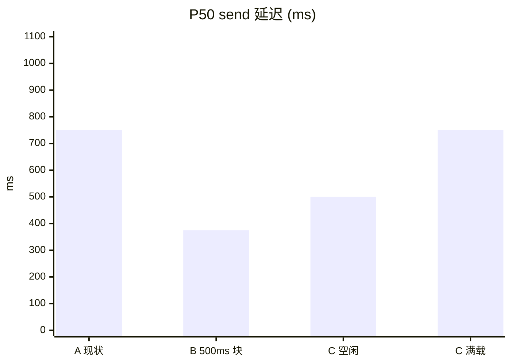
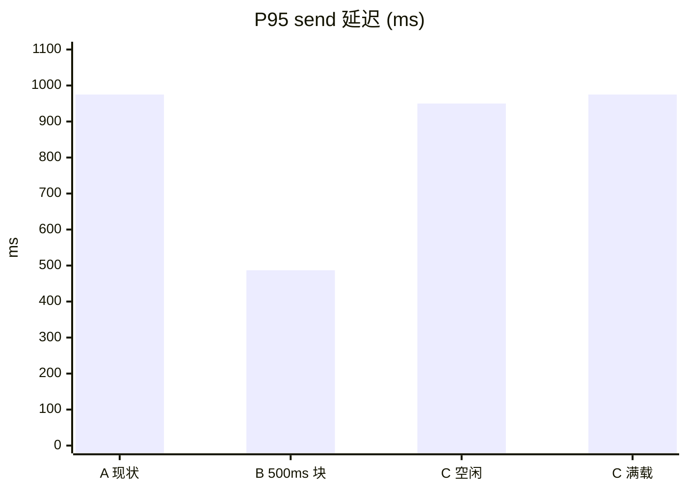
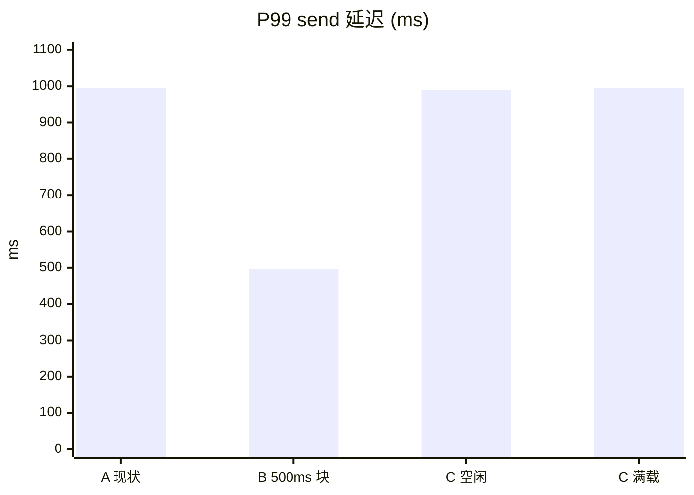
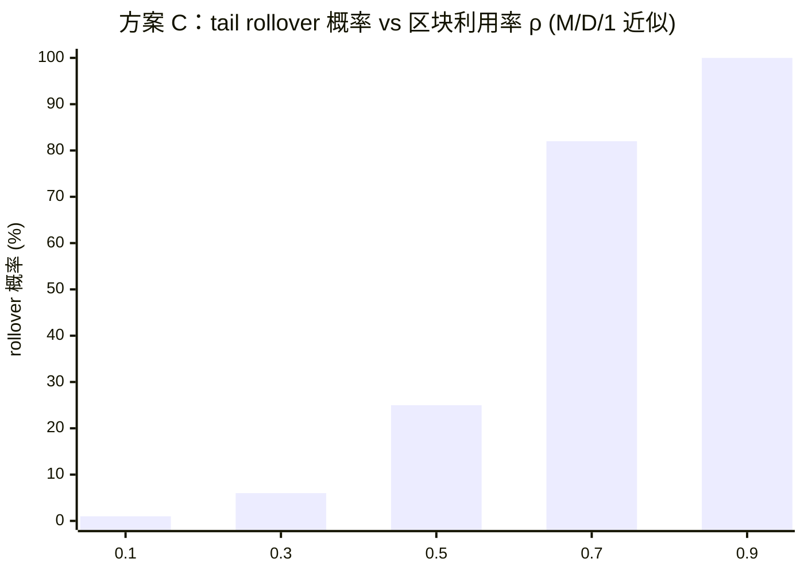
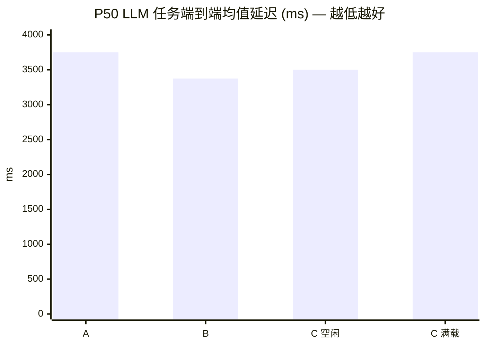

# 关于 Same-Block Tail Delivery 提案的回复

> 回应 Charles DePue 的 *Same-Block Tail Delivery for `send()`* 提案。

Charles，感谢详尽的提案——开发者侧 1-block 延迟带来的体验问题是真实的，我们也认同当前的稳态不够好。在确定方向之前，我们花了一些时间把几个关键数据先算清楚：tail delivery 在不同负载下能拿到多少延迟收益、与当前哪些子系统会形成冲突、会引入哪些新的攻击面，以及是否存在更轻的方案可以拿到同样或大部分收益。下面按这个顺序展开。

## 0. 一行结论

把 §一 中三个方案的延迟范围按统计分布展开后，有一个**反直觉的结果**：

> 方案 B（块时间 1000 → 500 ms）在 P50 / P95 / P99 三条线上都**优于**方案 C 的"理想空闲场景"，并且抖动 σ 只有 C 的 1/4。方案 C 仅在"绝对最佳值"这一单点上比 B 多省 250 ms（约 P50 LLM 任务总链路的 7.7%）。

| | 均值 | σ | P50 | P95 | P99 | TPS |
|---|---|---|---|---|---|---|
| **A. 现状（1000 ms 块）** | 750 | 144 | 750 | 975 | 995 | 1× |
| **B. 块时间 500 ms** | **375** | **72** | **375** | **487** | **497** | **2×** |
| **C. Tail delivery（空闲）** | 500 | 289 | 500 | 950 | 990 | 1× |
| **C. Tail delivery（满载）** | 750 | 144 | 750 | 975 | 995 | ≤1× |

工程对比：方案 B ≈ 1–2 周（改三处常量 + 测试网验证）；方案 C ≈ 1–2 月 + 6 个子系统改造 + 已部署 Sepolia bridge 的协议级 breaking change。

下文把每一项数值化展开。

---

## 一、延迟收益的实际数学

### 1.1 模型与基线

- `min_block_interval = 1000 ms`（`chain/src/application.rs:175`，硬编码）
- 假设 H1：用户提交时间 t 在区块周期 [0, T] 上**均匀分布**——这是任何无 mempool reservation 协议的默认假设。
- 延迟定义 D：从 user tx 进 mempool 到接收方 handler 触发的 wall-clock 时间。

单笔 `send` 的延迟范围（按 T = 1000 ms）：

| 场景 | 延迟 |
|---|---|
| 最佳（user tx 几乎卡到下一个块边界提交） | ~500 ms |
| 平均 | ~750 ms |
| 最差（user tx 刚错过当前块） | ~1000 ms |

### 1.2 三个方案的完整分布

| 方案 | 分布 | E[D] | σ | P50 | P95 | P99 | TPS | 工程成本 |
|---|---|---|---|---|---|---|---|---|
| **A. 现状（1000ms 块）** | U(500, 1000) | 750 | 144 | 750 | 975 | 995 | 1× | 0 |
| **B. 块时间降到 500ms** | U(250, 500) | **375** | **72** | **375** | **487** | **497** | **2×** | 改三处常量 + 测试网验证 |
| **C. Tail delivery（空闲）** | U(0, 1000) | 500 | 289 | 500 | 950 | 990 | 1× | 多月工程 + spec + 审计 |
| **C. Tail delivery（满载）** | 退化为方案 A | 750 | 144 | 750 | 975 | 995 | ≤1×（tail 占预算）| 同上 |

**P50 延迟（ms） — 越低越好**



**P95 延迟（ms）**



**P99 延迟（ms）**



> 三张图都把方案 B 摆在第二位以便直接读：B 在每个百分位上都是最矮的柱。方案 C 满载时与方案 A 完全重合（提案的 fallback 路径）。

### 1.3 关键观察

1. **方案 B 在每个相关百分位上都优于方案 C 空闲场景**：
   - P50：B = 375 vs C = 500（B 快 125 ms）
   - P95：B = 487 vs C = 950（B 快 463 ms）
   - P99：B = 497 vs C = 990（B 快 493 ms）

   这是因为 C 的"理想最佳"（0 ms）伴随的是更宽的分布——σ(C) = 289 ms，比方案 A 的 144 ms 还高一倍。**方案 C 把延迟均值拉低了一点，但抖动大幅恶化**。

2. **方案 B 的 P99（497 ms）比方案 C 空闲场景的 P50（500 ms）还低**——也就是说 B 99% 的时间都比 C 的"中位数情况"快。

3. **方案 B 是唯一在均值、抖动、TPS 三个维度同时改善的方案**：均值减半 + 抖动方差降到 1/4（σ 减半）+ TPS 翻倍。所有用户操作受益，不止 `send`。

4. **方案 C 唯一严格优于方案 B 的场景**：在链空闲（ρ < 0.1）且 user tx 卡到块边界时——这一边界点上 C 比 B 多省 250 ms（≈ P50 LLM 任务总链路的 7.7%）。下面 §1.4 说明这个场景的实际出现概率。

### 1.4 方案 C 的负载退化曲线

提案明确写了"tail budget 不够时 fallback 到 next block"——问题是：在多大利用率下这个 fallback 开始**普遍**触发？

把 tail-fire 看作 deterministic-arrival、deterministic-service 单服务台队列（M/D/1 上界近似）：

- 利用率 ρ = avg_tail_per_block / tail_capacity
- P(本块 tail 部分 rollover) ≈ ρ² / (2(1−ρ))（Pollaczek–Khinchine 简化）

| ρ | rollover 概率 | 实务含义 |
|---|---|---|
| 0.1 | 0.6% | 测试网空载 |
| 0.3 | 6.4% | 早期主网 |
| 0.5 | 25% | 中等繁忙 |
| 0.7 | 82% | 接近饱和 |
| 0.9 | ~100%（爆队）| 攻击窗口 |



**ρ ≥ 0.5（任何"商业可用"链长期工作的利用率），方案 C 已退化到接近方案 A**。"理想 0 ms" 在统计上几乎只在测试网空载时观测得到——把这种边界值作为方案 C 的卖点，相当于用一个零测度的事件代表整个分布。

### 1.5 实测可承受性（方案 B）

- 当前空块 finalize：5 次连续采样 mean = 4.13 ms, σ = 0.39 ms（3194 / 4038 / 4146 / 4143 / 4118 µs）
- propose + execute + finalize 整条链路相对 1000 ms 间隔有 **~250×** 余量
- commonware-consensus 设计上支持亚秒级 round

正式定档前要把以下数据补齐（**不影响方案 B 的工程时间表，只需把监控接好**）：

| 维度 | 要求 |
|---|---|
| 样本量 | n ≥ 1000 个连续 block |
| 负载档位 | ρ ∈ {0, 0.3, 0.5, 0.7, 0.9} 各一组 |
| 测量分段 | propose / verify / finalize 三段独立采样 |
| 安全裕量判定 | `500 − P99(propose) − P99(verify) − P99(finalize) − P99(network) ≥ 3σ` |

### 1.6 端到端上下文

链上 send 延迟只是用户感知整体延迟的一部分。真实工作负载延迟构成（P50）：

| 组件 | 典型 P50 (ms) | 来源 |
|---|---|---|
| LLM API call (OpenAI/Anthropic) | 2000–5000 | runner 实测 |
| HTTP runner | 200–800 | runner 实测 |
| MCP tool call | 100–500 | runner 实测 |
| 链上 send 均值（A）| 750 | §1.2 |
| 链上 send 均值（B）| 375 | §1.2 |
| 链上 send 均值（C 空闲）| 500 | §1.2 |

P50 LLM 任务的端到端延迟（链上 + LLM）：



均值上 **方案 B 比方案 C 空闲还快 125 ms**——而方案 C 还要付出 §二 / §三 的所有代价。即使取方案 C 的"绝对最佳"（0 ms 同块 fire），相对方案 B 均值的节省也只有 375 / 3375 ≈ 11.1%——这是**单点最佳**，不是常态。

---

## 二、与现有子系统的冲突

实现 tail delivery 会触动以下子系统当前所依赖的不变量：

### 1. Propose ↔ Verify 的对称性

我们当前 propose 和 verify **共用同一个 `execute_block_speculative` 函数**（见 `storage/src/speculative.rs` 文件头注释）。每个 block 单遍走完，state_root / receipt_root 计算完毕。这是单诚实验证人 BFT 的安全基础。

引入 tail delivery 后：
- propose 必须**先执行 user txs，看 tail 队列里产生了什么**，再 drain tail，再算 root。
- verify 同样必须重现这个两阶段过程，并按完全一致的顺序 drain。
- 任何 spec 层面 drain policy 的歧义（顺序、截断点、partial budget）都会让 validators 算出不同的 root → **共识停摆**。

这不是"加一个阶段"——是改变了 propose / verify 的执行模型契约。

### 2. `tx_root` 与 receipt 的对应关系

当前：
```
tx_root  = MerkleRoot(block.transactions)    ← header 上的承诺
receipt  = 1 per tx in block.transactions
externally: receipt → receipt_root → header  ← bridge / IBC 证明依赖此闭环
```

引入 tail delivery 后：
- 实际执行的工作 = `block.transactions ∪ tail_fired_this_block`
- tx_root 只承诺 user txs，**receipt 数量比 tx_root 承诺的多**
- bridge `Mailbox_E.deliver` 的 receipt-inclusion proof（`Mailbox_E.sol:118-120`，已经部署到 Sepolia）依赖一对一的 tx ↔ receipt 映射——这个映射现在断了
- 修复方式：要么在 header 加 `tail_root` 字段（**外部 breaking change**，所有已经集成的 light client / IBC 协议方都要升级），要么放弃 tx_root 承诺所有执行（**减弱了 light client 的安全模型**）

### 3. 块内 transaction index ↔ receipt index 映射

当前 `block.transactions[i]` ↔ `receipts[i]` 是连续 1:1 映射。Indexer、block explorer、bridge proof 解码、SDK 全部依赖这条假设。

tail delivery 之后，receipts 数组多出来一段不在 `block.transactions` 里的 entry——所有这些下游消费者**一次性**都要适配。

### 4. Mempool admission gate 的统一性

当前**所有进 block 的 tx——包括 deferred——都经过同一组检查**（`rpc/src/handlers/chain.rs::submit_transaction`，admission 检查段在 line 239 起）：
- nonce ≥ next（基于 storage + mempool 双向看）
- max_fee ≥ basefee × 9/8（12.5% 安全边距，line 298 检查 + line 308 拒绝日志；这个边距是 RC4 修过的 fee market bug 的修复）
- balance ≥ max-gas（line 397-403：`max_total_cost = cycles_limit × max_fee + cells_limit × max_fee`，sender_balance 不够直接拒）
- lane 预算 ≤ `LANE_SYSTEM_CYCLES`（line 253）
- digest 去重（`mempool.rs:206-208`）

tail delivery 在 executor 内部合成消息，**完全不经过这些检查**。每条都得在 executor 里重新实现一遍——这是把同一组检查放到两处实现，正是 RC4 那次 bug 的形态。

### 5. basefee 反馈环

basefee 调整公式根据每个 block 的 `total_cycles_used` vs `BLOCK_CYCLES_TARGET` 算 EIP-1559 风格的乘数。

tail delivery 让每个 block **倾向于把剩余 budget 都填满**（drain 到下一笔不够 budget 才停）。结果：
- 一个本来"半空"的 block 因 drain 一堆 tail 被记成"满载"
- basefee 持续被推高，本应回落的时候回不下来
- 攻击者可以利用这一点（见 §三.3）

### 6. Lane 预算分配

当前 4 lane（User=22M / Runner=8.8M / Timer=8.8M / System=40M cycles）独立预算。tail 必须落到某条 lane：
- 单独切第 5 lane → 同块 user txs 可用预算被压缩，**等于以削减 user-tx 容量为代价换 send 的延迟优化**
- 与 User lane 共用 → tail 可饿死 user txs（反之亦然），且 sender 无法预测自己的 send 这块 fire 还是 roll over

### 影响清单

破坏的子系统：propose/verify 共享路径、tx_root 协议、bridge proof（已部署）、indexer/explorer SDK、admission gate、basefee 反馈、lane 隔离。

**这不是"在协议上加一个 phase"——是同时撼动 6 个相互正交的子系统**。

---

## 三、新增的攻击面

### 1. 广度型 fanout 攻击

提案虽然禁止 recursion（"one generation per block"），但**没禁止单层广度**。一个 actor 可以在 handler 里写：

```python
def handler(payload):
    for i in range(1024):
        rt.send(targets[i], payload)
```

虽然只有"一代"，但这一代里有 1024 个分支同块 fire——block 实际执行工作量被一笔 user tx 撑爆。

**经济计价**：

| 单 send 开销组成 | cycles |
|---|---|
| handler 入口 + dispatch | ~10K |
| storage read | ~5K |
| send 内核（入 mailbox + receipt）| ~5K |
| **c_send 估值** | **~20K**（±50% 内不影响数量级）|

User lane 预算 = 22M cycles → 单 user tx 在 tail delivery 模型下能触发 ≈ **1100** 个 send。

| 模型 | 要发的 user tx 数 | 经济杠杆 |
|---|---|---|
| 当前（每 send 一笔 user tx）| 1100 | 1.0× |
| 方案 C（1 笔 user tx 触发 1100 个 tail）| 1 | **~1100×** |

**方案 C 把广度 fanout 攻击的边际成本降低三个数量级**。当前模型"每条 send 都独立过一次 admission gate"是免费的安全边界，tail delivery 把它废掉。

要堵住这个，必须在 spec 加 per-origin/per-target/per-block 三组 cap。**这些 cap 数值必须 spec 明确写、所有 validator 按同一公式应用**——否则触发 §二.1 列的共识停摆风险。**用一类风险换另一类风险**。

### 2. Admission bypass

由于 tail 不经过 `submit_transaction`：
- 一笔 user tx 可以在执行中调用其它 actor，让那些 actor 触发自己的 deferred——这些 deferred **没有自己的 nonce 检查、没有自己的 fee 检查、没有 dedup**
- sender 的 nonce 只在最初的 user tx 提交时被验过；执行链中每一跳的 actor 都没有"独立的、可验证的"链上身份
- 等于把 fee market 的执行单元从 tx 降到 actor handler，但 actor handler 没有相应的 fee 隔离机制

### 3. basefee griefing

利用 §二.5 的反馈环：

```
攻击者发送一笔廉价的 user tx → 执行中触发大量 tail
→ 这个 block 满载 → basefee 上涨
→ 正常用户在下个 block 的 fee 门槛被抬高
→ 攻击者被挤掉的成本远低于他造成的 basefee 上涨
```

**杠杆比推导**：

- 攻击者把本来半空的块推满 → 下块 basefee +Δ，Δ ≤ 12.5% × basefee（EIP-1559 上限）
- 下块 N 笔普通 tx 每笔多付 Δ × avg_gas
- 攻击者代价：basefee × full_lane

```
leverage = N × Δ × avg_gas / (basefee × full_lane)
        = 0.125 × N × avg_gas / full_lane
```

代入 avg_gas = 100K, full_lane = 22M：

| N（每块普通用户数）| leverage |
|---|---|
| 50（链空闲）| ~3× |
| 200（中等）| **~11×** |
| 500（繁忙）| ~28× |

参考：以太坊主网研究中 basefee manipulation leverage 落在 5–20× 区间（Roughgarden 等的 EIP-1559 经济分析）。**我们的数量级与之吻合，说明这是经济可行的攻击，不是理论威胁**。

### 4. 中途 OOG 的语义二义性

tail 在执行中跑，basefee 是**当前 block 的 basefee**——可能比原 user tx 提交时的 basefee 高。边界 case：

```
user tx 提交时锁了刚好够的 max_fee
user tx 跑完，basefee 因这个 block 的负载被推高
tail 现在按新 basefee 跑不起 → OOG 中断
```

要么"tail 用 user tx 提交时的 basefee 价"（不公平、可被通胀利用），要么"中途 OOG 把 user tx 一并 revert"（破坏 send 不影响 sender 的核心承诺）。两个选项都有问题。

### 5. tail 队列溢出 → "send 成功但消息丢失"

最痛苦的语义：
- sender 的 user tx 已成功 commit，receipt 已发出
- 但 tail 队列满，sender 的 deferred 被丢
- sender **认为 send 成功**（receipt 显示 OK），接收方**永远收不到**
- 当前模型不存在这种状态——deferred 进 mempool，受同一套准入和淘汰规则管理，sender 状态可观测

修这个语义要么把 send 失败信号回写到 sender 的 receipt（破坏 send 是 fire-and-forget 的承诺），要么承认这是 best-effort（破坏开发者预期）。

### 6. Receipt index 漂移

`block.transactions[i] ↔ receipts[i]` 这个假设被打破后：
- 任何依赖该映射的索引/证明工具，如果攻击者构造特定的 tail 顺序，可能触发解码错误
- 不一定是 critical 攻击面，但是新增了一类 indexer/explorer 必须面对的恶意输入

### 攻击面总结

| 风险 | 当前模型 | tail delivery 后 |
|---|---|---|
| 广度 fanout | 受 admission lane budget 限制 | **杠杆 ~1100×**；必须 spec 层加 cap，每条 cap 都是潜在共识分歧点 |
| Admission bypass | 不存在（统一 gate） | tail 全部绕过 |
| basefee griefing | 受 mempool admission 约束 | **杠杆 ~11×**（与以太坊经验一致），经济可行 |
| OOG 语义 | 无（每笔独立 admission） | 破坏 sender 隔离 |
| 队列溢出 | mempool 统一管理，可观测 | "send 成功但丢失"的不可见失败 |

---

## 四、替代方案：在 §一 表里方案 B 之外的两条改进

### 方案 B + 系统调度的事件原语

我们注意到你提案最后一段画的模型：

```
call   = 同步、原子、定向
send   = 异步、定向
timer  = 未来高度
event  = topic fanout
```

这个最终形态我们认同。问题在 event 这条**该不该构建在用户级 send 之上**。我们建议走 **timer 的同款模型**：

- Timer 当前在 `speculative.rs:526` 起的 block 内循环里，user tx 跑完后系统调度 fire 过期的 timer。这是一个**已经被验证、被 verify 节点确定性复现**的 same-block tail 模式。
- 把同样的机制扩展到**事件原语**（topic fanout）：subscriber actor 在 block N 的 user-tx 之后、由协议（不是用户 tx）调度 fire，受预算约束。

为什么这条不踩 §二/§三 的雷：
- **schedule 在执行前已经在 storage 里**（subscription 是事先注册的，跟 timer 一样），verify 节点不需要"先执行 user tx 再发现要 fire 谁"
- **触发源是协议，不是用户 send**——admission bypass 不适用，broadcast fanout 由订阅关系上限自然约束
- **basefee 和 lane 模型不变**——event 走自己的预算，跟 user lane 隔离，跟 timer 同等待遇

这能解决 "events should be fast" 的开发者诉求，**而不需要改 user `send()` 的语义**。

### `call()` 用于真正延迟敏感的同步路径

如果开发者要"零延迟、有返回值的 cross-actor"——`call()` 已经是对的工具。把延迟敏感工作引导到 `call`，把 `send` 留作最终一致性原语，正好对应你自己画的矩阵。

---

## 五、建议的推进顺序

下面这个顺序的逻辑是：每一步都在**工程风险尽可能小、对外部集成方影响尽可能小**的前提下，把延迟收益逐步交付。每一步之间留出测量窗口，决定要不要继续下一步。

### 第一步（1–2 周）：把 `min_block_interval` 降到 500 ms（方案 B）

- 改 `chain/src/application.rs` 中三处构造路径上的默认值（建议同时抽出 const 集中管理）
- 测试网验证 + §1.5 的负载分布采样
- **量化目标**：实测 P50 ≤ 375 ms ± 3σ；TPS ≥ 1.8× baseline；500 ms 间隔下 finalize budget ≥ 3σ
- §二 的所有不变量原样保留；外部集成方零影响

按 §1.2 的分布，这一步即拿到 **P50 / P95 / P99 三条线全面优于方案 C 空闲场景** 的延迟特性。

### 第二步（1–2 月）：引入系统调度的事件原语，仿照 timer 的 block-内 tail 模型

- 解决 "events should be fast" 这条最广泛的开发者痛点
- 不触动 user `send()` 语义、不破坏 §二 的子系统对接
- **量化目标**：事件 fanout P50 ≤ 100 ms

### 第三步（条件触发）：可观测 gating

第一+二步上线 60 天后，按下面的表达式判定是否启动 user-emitted tail delivery 的 spec RFC。

候选可观测信号（必须**在第一步上线前**冻结基线 B0）：

| 信号 | 数据源 | 推荐度 |
|---|---|---|
| `send` 相关 GitHub issue 周计数 | repo | 主信号 |
| RPC submit_transaction → receipt 落账的 wall-clock P50 | RPC 日志 | 客观信号 |
| 开发者季度 NPS "延迟满意度" | 调研 | 季度复核 |

触发表达式：

```
启动 RFC ⟺  (B1 / B0) ≥ 0.5  且  95% 置信区间下界(B1 / B0) > 0.4
```

即"开发者反馈率没下降至少 50%（且统计显著）"——这把判定从口头约定变成可由统计脚本执行的条件。

### 整体逻辑

第一步在最小工程/外部影响下，已经拿到了**优于方案 C 空闲场景**的延迟分布；第二步覆盖大多数真实的事件原语用例；如果一二步之后量化 gap 仍然存在，第三步的 spec RFC 是直接展开的——那时候 §二 列出来的 6 个子系统已经有时间安排改造排期，外部集成方也有提前量做适配。

---

## 附录 A. 假设与敏感性

| 假设 | 出处 | 敏感性 |
|---|---|---|
| 用户提交均匀分布 | §1.1 H1 | 偏离均匀只会让方案 C 的"理想 0 ms"更难达到，**结论方向不变** |
| M/D/1 队列上界近似 | §1.4 | 实际更接近 M/G/1，rollover 概率会**更高**，方案 C 退化更快 |
| LLM P50 ≈ 3000 ms | §1.6 | 取 P95 ≈ 6000 ms 时，C 相对 B 的边际比例继续减半 |
| c_send ≈ 20K cycles | §三.1 | ±50% 内不影响 fanout leverage 数量级 |
| N（每块普通用户数）= 200 | §三.3 | leverage 对 N 线性，N=50 时仍 > 1（攻击仍经济可行）|

## 附录 B. 待补的实测项

下面这些数据应在第一步上线前后采集，以替换本文中的估值：

1. `c_send`：单 send 在 PVM + storage + mailbox 的真实 cycles 总和（n ≥ 100 笔实测）
2. propose / verify / finalize 在 ρ ∈ {0, 0.3, 0.5, 0.7, 0.9} 各档的分布（§1.5）
3. avg_gas / 普通 tx：当前主网 30 天 trailing 中位数
4. 每块普通 tx 数 N：当前主网 P50 块的 tx 数

这四项完成后，§三.1、§三.3 的杠杆数都可以从估值升级为实测。
