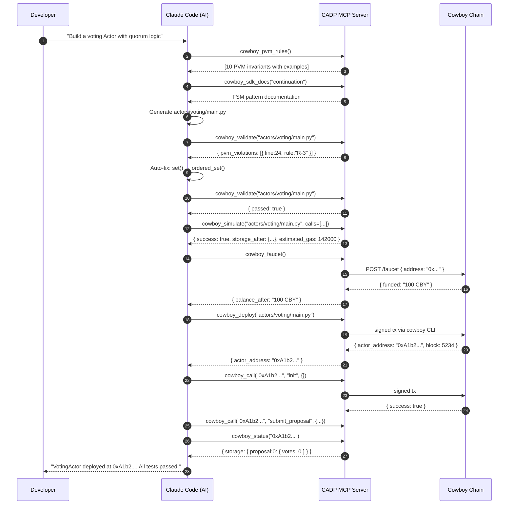

<Note>
  **Status:** Draft
  **Type:** Standards Track
  **Category:** Developer Infrastructure
</Note>

## 1. Abstract

This proposal defines the **Cowboy AI Development Co-pilot (CADP)** — a protocol-level specification for an autonomous, AI-native development infrastructure that enables remote Cowboy Actor developers to write, validate, simulate, deploy, and monitor on-chain Actors purely through natural language interaction with AI models such as Claude Code.

CADP standardizes the interface between AI coding assistants and the Cowboy chain through the **Model Context Protocol (MCP)**, creating a bidirectional bridge that arms the AI with deterministic Cowboy domain knowledge (via `CLAUDE.md`) and sovereign chain access (via the MCP Server). The goal is to eliminate all manual toolchain steps between a developer's intent and its deployed on-chain realization.

---

## 2. Motivation

The Cowboy Actor system possesses several properties that create a steep learning curve for new developers:

1. **Strict PVM Determinism**: Developers must internalize ~10 invariant rules (no `import time`, no `import random`, no `set()`, no hardware FPU, explicit `capture()` before every `await`, etc.). Any violation produces a non-consensus Actor silently.
2. **FSM Compilation Model**: All async operations (LLM inference, HTTP, cross-Actor calls) must be expressed as Finite State Machine continuations — a pattern radically different from conventional async/await.
3. **Unfamiliar Deployment Toolchain**: Deploying to the chain requires knowledge of CBOR encoding, secp256k1 key management, the `cowboy-cli` binary interface, and gas estimation.
4. **Remote Developers Have No Local Infra**: Most contributors will not run a local validator node, Rust toolchain, or full node codebase.

Without intervention, the above barriers mean only a very narrow slice of developers — those who have deeply studied the node codebase — can meaningfully contribute Actors.

**CADP proposes to solve this completely**, by making the AI itself the carrier of all Cowboy-specific expertise, and by making the MCP Server the execution layer that connects AI intent to chain reality.

---

## 3. Goals & Non-Goals

### Goals

- G-1: A remote developer with only Python and a text editor can produce and deploy a working Actor in under 10 minutes, guided entirely by AI.
- G-2: All PVM determinism rules are enforced by the CADP toolchain before code ever reaches the chain — AI-generated code that violates rules is never deployed without correction.
- G-3: The AI can autonomously run a full development iteration loop: write → validate → simulate → deploy → test → observe → fix, without human intervention at each step.
- G-4: CADP must support the full lifecycle of an Actor from first deploy through multi-version upgrade.
- G-5: All CADP tools are deterministic and idempotent — the same tool call with the same arguments always produces the same chain effect.

### Non-Goals

- NG-1: CADP does not modify the on-chain PVM execution engine itself; it operates at the tooling layer.
- NG-2: CADP does not replace the need for on-chain gas metering or security audits.
- NG-3: CADP does not define AI model selection — it is AI-model-agnostic and works with any MCP-compatible client.

---

## 4. System Architecture

```
┌──────────────────────────────────────────────────────────────┐
│                    Developer's Machine                        │
│                                                               │
│   Developer (natural language intent)                        │
│          │                                                    │
│          ▼                                                    │
│   ┌─────────────────────────────────────────────────┐       │
│   │              Claude Code / AI Client             │       │
│   │                                                   │       │
│   │  ┌─── CLAUDE.md ──────────────────────────────┐ │       │
│   │  │  Layer 1: PVM Iron Rules (10 invariants)   │ │       │
│   │  │  Layer 2: SDK API Quick Reference          │ │       │
│   │  │  Layer 3: Actor Structural Template        │ │       │
│   │  │  Layer 4: Deployment Command Reference     │ │       │
│   │  └────────────────────────────────────────────┘ │       │
│   └─────────────────────────┬───────────────────────┘       │
│                              │ MCP stdio transport            │
│                              ▼                               │
│   ┌──────────────────────────────────────────────────┐      │
│   │           cowboy_mcp_server (CADP Server)         │      │
│   │                                                   │      │
│   │  TIER 1: Knowledge Layer                         │      │
│   │    cowboy_sdk_docs  cowboy_pvm_rules              │      │
│   │                                                   │      │
│   │  TIER 2: Verification Layer                      │      │
│   │    cowboy_validate  cowboy_simulate               │      │
│   │                                                   │      │
│   │  TIER 3: Execution Layer                         │      │
│   │    cowboy_deploy  cowboy_call  cowboy_query       │      │
│   │                                                   │      │
│   │  TIER 4: Observability Layer                     │      │
│   │    cowboy_status  cowboy_logs  cowboy_trace       │      │
│   │                                                   │      │
│   │  TIER 5: Lifecycle Layer                         │      │
│   │    cowboy_faucet  cowboy_upgrade  cowboy_diff     │      │
│   └─────────────────────────┬────────────────────────┘      │
└─────────────────────────────┼────────────────────────────────┘
                              │ HTTP / cowboy-cli binary
                    ┌─────────▼──────────────────┐
                    │    Cowboy Chain (Remote)    │
                    │                             │
                    │  Devnet RPC :4000           │
                    │  ├── POST /submit           │
                    │  ├── GET /actor/{addr}      │
                    │  ├── GET /block/{height}    │
                    │  ├── GET /logs/{addr}       │
                    │  └── POST /faucet           │
                    │                             │
                    │  PVM Validator              │
                    │  Runner (LLM/HTTP/MCP)      │
                    └─────────────────────────────┘
```

---

## 5. CADP MCP Tool Specification

CADP defines **15 MCP tools** organized into 5 tiers. All tools communicate over the MCP stdio transport and are invocable directly by AI coding assistants.

### Tier 1 — Knowledge Layer

These tools give the AI on-demand domain knowledge.

#### `cowboy_sdk_docs`

Query the cowboy_sdk reference documentation.

```
Input:  { "topic": string }  // e.g. "continuation", "storage", "rules", "token_api"
Output: Formatted markdown documentation for the topic
```

Supported topics: `actor`, `runner`, `capture`, `storage`, `call`, `send`, `continuation`, `guards`, `taskgroup`, `verify`, `models`, `types`, `pvm_time`, `pvm_random`, `codec`, `rules`, `gas`, `token_api`.

#### `cowboy_pvm_rules`

Returns the full, authoritative list of PVM determinism invariants as structured data, with code examples for each violation and its correct form. Used by the AI as an always-available checklist before every code generation.

```
Input:  {}
Output: Array of { rule_id, description, violation_example, correct_example, severity }
```

---

### Tier 2 — Verification Layer

These tools protect the chain from non-deterministic or malformed code.

#### `cowboy_validate`

Performs multi-stage static analysis on an Actor source file:

1. **Syntax check** via `py_compile`.
2. **AST-level PVM rule enforcement**: parses the Abstract Syntax Tree to detect forbidden `import` statements, unguarded `set()` constructors, `await` expressions outside `@runner.continuation`, missing `capture()` calls before `await` points, async functions exceeding 8 `await` nodes.
3. **Module-level entry point verification**: confirms that all required module-level dispatch functions (`init`, `<handler>`, `<handler>__resume`, `on_runner_result`) are present and correctly exposed.
4. **Storage schema extraction**: derives the expected storage key schema from usage patterns in the code, for use by `cowboy_diff` during upgrades.

```
Input:  { "code_path": string }
Output: {
  "passed": bool,
  "syntax_errors": [...],
  "pvm_violations": [{ "line": int, "rule_id": string, "message": string }],
  "missing_entrypoints": [...],
  "storage_schema": { "key": "type_hint" },
  "warnings": [...]
}
```

#### `cowboy_simulate`

Executes Actor code in a local in-process PVM mock environment **before deployment**, producing a complete execution trace without touching the chain.

The simulator uses the `mock_pvm_host` from `cowboy_sdk` and executes a sequence of handler calls as specified, returning the resulting storage state delta, emitted events, and gas consumption estimate.

```
Input: {
  "code_path": string,
  "calls": [
    { "handler": string, "payload": object, "sender": string? }
  ]
}
Output: {
  "success": bool,
  "storage_after": { key: decoded_value },
  "events_emitted": [...],
  "estimated_gas": int,
  "execution_trace": string,   // human-readable step-by-step trace
  "error": string?
}
```

**This is the most powerful new tool in CADP.** It makes deployment the last step, not the primary debugging loop.

---

### Tier 3 — Execution Layer

#### `cowboy_deploy`

Deploys a validated Actor to the chain. Internally calls the `cowboy` CLI binary (resolved via `COWBOY_CLI_PATH`, PATH, or cargo fallback) with the developer's signing key.

Parameters include:
- `code_path`: path to the Actor source file
- `salt`: deterministic deployment salt (for address derivation)
- `cycles_limit`: max cycles budget
- `cells_limit`: max storage cell budget

```
Input:  { "code_path": string, "salt": string?, "cycles_limit": int?, "cells_limit": int? }
Output: { "actor_address": string, "tx_hash": string, "block_height": int, "gas_used": int }
```

#### `cowboy_call`

Submits a signed, state-mutating transaction to an Actor handler.

```
Input:  { "actor_address": string, "handler": string, "payload": object, "cycles_limit": int? }
Output: { "success": bool, "result": decoded_value, "events": [...], "gas_used": int, "error": string? }
```

#### `cowboy_query`

Calls a read-only Actor handler without submitting a transaction (uses `--dry-run` or a GET endpoint where available). Does not consume gas or alter state.

```
Input:  { "actor_address": string, "handler": string, "payload": object }
Output: { "result": decoded_value }
```

---

### Tier 4 — Observability Layer

#### `cowboy_status`

Fetches and decodes the complete current storage state of an Actor. CBOR-encoded values are decoded and presented as structured data, with each key annotated with its inferred type.

```
Input:  { "actor_address": string }
Output: {
  "address": string,
  "balance": string,
  "storage": { key: { "raw_hex": string, "decoded": decoded_value, "type": string } }
}
```

#### `cowboy_logs`

Fetches the most recent on-chain events emitted by an Actor, with CBOR decoding and semantic annotation (event name, args, sender, block height).

```
Input:  { "actor_address": string, "limit": int?, "from_block": int? }
Output: { "events": [{ "block": int, "name": string, "args": object, "tx_hash": string }] }
```

#### `cowboy_trace`

**(New in CADP)** Fetches the full execution trace of a specific transaction by hash. Returns a structured decomposition of every PVM opcode executed, gas consumed at each step, and the exact point of failure if the transaction reverted.

This enables the AI to autonomously diagnose on-chain failures without developer interpretation.

```
Input:  { "tx_hash": string }
Output: {
  "status": "success" | "reverted",
  "revert_reason": string?,
  "revert_at_line": int?,          // mapped back to source line if PVM supports
  "gas_breakdown": { phase: cost },
  "storage_delta": { key: { before, after } },
  "continuation_state": string?    // current FSM phase if reverted mid-continuation
}
```

---

### Tier 5 — Lifecycle Layer

#### `cowboy_faucet`

Requests testnet tokens for the wallet currently configured in the MCP server's environment. Called automatically by CADP before deployment attempts if the wallet balance is insufficient.

```
Input:  { "amount_cby": int? }
Output: { "address": string, "balance_before": string, "balance_after": string, "tx_hash": string }
```

#### `cowboy_upgrade`

Deploys a new version of an Actor at the same address (using the upgrade mechanism), after running `cowboy_diff` to verify storage schema compatibility.

```
Input:  { "actor_address": string, "new_code_path": string }
Output: { "compatible": bool, "breaking_keys": [...], "tx_hash": string?, "warning": string? }
```

#### `cowboy_diff`

**(New in CADP)** Compares the storage schema of an existing deployed Actor (inferred from the current code) with a new version, to detect breaking changes that would make existing on-chain state unreadable.

```
Input:  { "current_code_path": string, "new_code_path": string }
Output: {
  "added_keys": [...],
  "removed_keys": [...],       // BREAKING: these keys still exist on-chain
  "type_changed_keys": [...],  // BREAKING: CBOR type mismatch
  "safe_to_upgrade": bool,
  "migration_code_hint": string?  // AI-generated migration function suggestion
}
```

#### `cowboy_wallet`

Manages the developer wallet for the MCP session: shows address, balance, and can generate a new key for first-time developers.

```
Input:  { "action": "info" | "generate" | "balance" }
Output: { "address": string, "balance": string, "key_path": string }
```

#### `cowboy_actor_index`

**(New in CADP)** Queries the chain indexer for all Actors deployed by the current wallet, their addresses, deployment blocks, and current status. Allows the AI to maintain a "workspace" of all active Actors without the developer tracking addresses manually.

```
Input:  { "owner_address": string? }
Output: { "actors": [{ "address": string, "deployed_at_block": int, "handler_count": int, "last_activity_block": int }] }
```

---

## 6. Knowledge Injection: CLAUDE.md

`CLAUDE.md` is the static half of CADP. When Claude Code is launched in a project directory, it automatically reads `CLAUDE.md` and merges its content into the AI system prompt. This is a **zero-cost, zero-latency** mechanism for injecting Cowboy-specific expertise into the AI at every interaction.

The `CLAUDE.md` for a CADP-enabled project must contain:

```
CLAUDE.md Structure:
├── §1  IDENTITY — What Cowboy is, what an Actor is
├── §2  PVM IRON RULES — 10 determinism invariants, each with a ✗/✓ example
├── §3  ACTOR SKELETON — Minimal valid Actor structure (copy-pasteable)
├── §4  SDK API QUICK REFERENCE — One-line signatures for all cowboy_sdk exports
├── §5  FSM PATTERN — How to write @runner.continuation correctly
├── §6  STORAGE CONVENTIONS — Key naming, CowboyModel usage, CBOR gotchas
├── §7  DEPLOY CHEATSHEET — MCP tool invocation sequence
└── §8  COMMON MISTAKES — Top 10 errors new developers make
```

The file is distributed alongside the MCP Server and kept at the project root. Developers download it once; it requires no dynamic API calls.

---

## 7. The Autonomous Development Loop

When CADP is fully configured, a Claude Code session operates as follows for any Actor development request:

```
Developer: "Build a voting Actor. Users submit proposals and vote on them. 
            Each proposal needs a quorum of 10 votes to pass."

─────── The following loop executes autonomously ───────

1. KNOWLEDGE PHASE
   cowboy_sdk_docs("actor")
   cowboy_sdk_docs("storage")
   cowboy_pvm_rules()
   → AI builds internal model of constraints and APIs

2. GENERATION PHASE  
   → AI writes VotingActor code to actors/voting/main.py

3. VERIFICATION PHASE
   cowboy_validate("actors/voting/main.py")
   → { pvm_violations: [{ line: 24, rule: "R-4", message: "set() forbidden, use ordered_set" }] }
   → AI auto-fixes line 24: proposals = ordered_set()
   cowboy_validate("actors/voting/main.py")
   → { passed: true }

4. SIMULATION PHASE
   cowboy_simulate("actors/voting/main.py", calls=[
     { handler: "init", payload: {} },
     { handler: "submit_proposal", payload: { text: "Increase gas limit" } },
     { handler: "vote", payload: { proposal_id: 0 } }
   ])
   → { success: true, storage_after: { "proposal:0": { text: "...", votes: 1 } }, estimated_gas: 142000 }
   → AI confirms logic is correct

5. DEPLOYMENT PHASE
   cowboy_faucet()   # auto-called if balance < threshold
   cowboy_deploy("actors/voting/main.py", salt="voting-v1")
   → { actor_address: "0xA1b2...", tx_hash: "0xde..", block_height: 5234 }

6. INITIALIZATION PHASE
   cowboy_call("0xA1b2...", "init", {})
   → { success: true }

7. FUNCTIONAL TEST PHASE
   cowboy_call("0xA1b2...", "submit_proposal", { text: "Increase gas limit" })
   cowboy_call("0xA1b2...", "vote", { proposal_id: 0 })
   cowboy_status("0xA1b2...")
   → { storage: { "proposal:0": { text: "...", votes: 1, passed: false } } }

8. REPORT PHASE
   → "Deployed VotingActor at 0xA1b2.... All 3 test scenarios passed. 
      Current state shows 1 active proposal with 1 vote (quorum: 10).
      Gas used: 142,351 cycles. Storage: 2 entries."

─────── Developer receives result, no intermediate steps needed ───────
```

---

## 8. Security Considerations

### 8.1 Private Key Handling

The MCP Server reads the signing key at startup from the path specified in `PRIVATE_KEY_FILE`. The key is used exclusively for transaction signing and never transmitted over the network in plaintext. The server must:

- Refuse to start if the key file has world-readable permissions (`chmod 600` enforced at init).
- Never log the private key or its derived public key in full.
- Support an optional `--dry-run` mode for `cowboy_deploy` and `cowboy_call` that skips signing entirely.

### 8.2 AI-Initiated Transaction Limits

To prevent runaway AI agents from draining wallets or spamming the chain, CADP defines optional guardrails:

- `MAX_DEPLOYS_PER_SESSION`: max number of `cowboy_deploy` calls per MCP session (default: 10).
- `MAX_CALLS_PER_SESSION`: max number of `cowboy_call` calls per MCP session (default: 100).
- `MIN_BALANCE_THRESHOLD_CBY`: if wallet balance drops below this, all write tools are suspended (default: 10 CBY).

These limits are configurable via environment variables and are enforced in the MCP Server before any signing operation.

### 8.3 Code Validation Gate

`cowboy_deploy` MUST internally call `cowboy_validate` as a prerequisite. A deploy request for code that fails validation MUST be rejected with a descriptive error, even if the AI attempts to bypass the validation step. This gate cannot be disabled.

### 8.4 Simulated Execution Before Deployment

When `cowboy_simulate` is available, `cowboy_deploy` SHOULD automatically run a simulation pass with a minimal `init` call before submitting the transaction. If simulation fails, deployment is blocked and the AI is returned the simulation error for self-correction.

---

## 9. Configuration Reference

The CADP MCP Server is configured entirely via environment variables:

| Variable | Default | Description |
|----------|---------|-------------|
| `RPC_URL` | `http://validator-01.dev.cowboylabs.net:4000` | Cowboy chain RPC endpoint |
| `COWBOY_WORKSPACE` | `.` | Root directory for resolving relative code paths |
| `PRIVATE_KEY_FILE` | `.cowboy/key` | Path to secp256k1 signing key |
| `COWBOY_CLI_PATH` | *(auto-detect)* | Path to cowboy binary (falls back to PATH, then cargo) |
| `DEFAULT_CYCLES` | `5000000` | Default cycles limit for deploy/call |
| `DEFAULT_CELLS` | `5000000` | Default cells limit for deploy/call |
| `MAX_DEPLOYS_PER_SESSION` | `10` | AI transaction guardrail |
| `MAX_CALLS_PER_SESSION` | `100` | AI transaction guardrail |
| `MIN_BALANCE_THRESHOLD_CBY` | `10` | Balance floor before write tools suspend |
| `PVM_LIB` | `node/pvm/Lib` | SDK source path (overrides pip install for local dev) |

### `.mcp.json` Reference

```json
{
  "mcpServers": {
    "cowboy": {
      "command": "python3",
      "args": ["./cowboy_mcp_server.py"],
      "env": {
        "RPC_URL": "http://validator-01.dev.cowboylabs.net:4000",
        "COWBOY_WORKSPACE": ".",
        "PRIVATE_KEY_FILE": ".cowboy/key",
        "DEFAULT_CYCLES": "5000000"
      }
    }
  }
}
```

---

## 10. Installation & Setup (Remote Developer)

The full CADP stack for a remote developer who has no local node:

```bash
# 1. Install SDK
pip install cowboy-sdk

# 2. Install cowboy CLI binary (Linux x86_64)
curl -L https://github.com/cowboylabs/cowboy/releases/latest/download/cowboy-linux-x86_64 \
     -o ~/.local/bin/cowboy && chmod +x ~/.local/bin/cowboy

# 3. Initialize project (creates wallet, fetches testnet funds automatically)
cowboy init dev
# → Creates .cowboy/key, .cowboy/config.json
# → Calls /faucet to fund the new wallet

# 4. Download CADP server and rules
curl -L https://raw.githubusercontent.com/cowboylabs/cowboy/main/refs/dev_support/cowboy_mcp_server.py \
     -o cowboy_mcp_server.py
curl -L https://raw.githubusercontent.com/cowboylabs/cowboy/main/refs/dev_support/CLAUDE.md \
     -o CLAUDE.md

# 5. Install MCP dependency
pip install mcp

# 6. Launch Claude Code (automatically picks up CLAUDE.md and .mcp.json)
claude code .
```

Total time to first `import cowboy_sdk` + AI session ready: **< 5 minutes**.

---

## 11. Implementation Phases

### Phase 1 — Foundation (Current)
- ✅ `cowboy_sdk` published to PyPI (`cowboy-sdk`)
- ✅ MCP Server with Tier 1 (docs), Tier 3 (deploy/call/query), Tier 4 basic (status/logs)
- ✅ `CLAUDE.md` with PVM Iron Rules
- ✅ `cowboy_validate` with regex-based PVM lint
- ✅ `_resolve_cli()` binary auto-detection (no Rust required for remote devs)

### Phase 2 — Verification Power
- 🔜 `cowboy_validate`: upgrade from regex to full AST analysis (detect `await` depth, FSM entry point completeness)
- 🔜 `cowboy_simulate`: in-process mock PVM executor with storage trace output
- 🔜 `cowboy_diff`: storage schema compatibility checker for Actor upgrades
- 🔜 `cowboy_pvm_rules`: structured rule catalog as a dedicated tool

### Phase 3 — Observability Depth
- 🔜 `cowboy_trace`: full transaction trace from chain indexer
- 🔜 `cowboy_logs`: semantic CBOR decoding and event annotation
- 🔜 `cowboy_status`: inferred type annotations on storage values

### Phase 4 — Lifecycle Automation
- 🔜 `cowboy_faucet`: automatic balance monitoring and top-up
- 🔜 `cowboy_upgrade`: safe multi-version Actor lifecycle management
- 🔜 `cowboy_actor_index`: workspace-level Actor registry
- 🔜 `cowboy_wallet`: first-run key generation guidance

---

## 12. Comparisons & Prior Art

| System | AI Code Gen | PVM Rule Enforcement | Simulation Before Deploy | On-chain Observability | Remote Dev (No Local Node) |
|--------|-------------|---------------------|--------------------------|------------------------|---------------------------|
| **CADP (this CIP)** | ✅ Claude Code | ✅ AST-level gate | ✅ In-process mock PVM | ✅ Trace + semantic logs | ✅ Binary only |
| Hardhat (Ethereum) | ❌ Manual | ❌ None | ✅ Local node | ✅ Basic | ❌ Requires local node |
| Foundry (Ethereum) | ❌ Manual | ❌ None | ✅ Local node | ✅ Forge trace | ❌ Requires local node |
| Anchor (Solana) | ❌ Manual | ⚠️ Partial (type system) | ✅ Local validator | ⚠️ Basic | ❌ Requires local validator |

CADP's unique contribution is the **seamless fusion of AI intent, domain rule enforcement, and chain interaction into a single autonomous loop** — none of the above systems provide a comparable integrated experience.

---

## Appendix A: PVM Iron Rules (CIP-10 Normative Reference)

The following 10 rules MUST be enforced by `cowboy_validate` as hard errors:

| Rule ID | Violation | Correct Form |
|---------|-----------|--------------|
| R-1 | `import time` | `from cowboy_sdk import pvm_time` |
| R-2 | `import random` | `from cowboy_sdk import pvm_random` |
| R-3 | `set(...)` or `{...}` (set literal) | `from cowboy_sdk import ordered_set; ordered_set(...)` |
| R-4 | `await` outside `@runner.continuation` | Wrap function with `@runner.continuation` |
| R-5 | `await` without preceding `capture()` | Add `ctx = capture(); ctx.var = val` before each `await` |
| R-6 | `await` count > 8 in one function | Split into multiple continuation functions |
| R-7 | Missing module-level entry function | Add `def handler(p): return _a().handler(p)` |
| R-8 | Missing `__resume` for continuation | Add `def handler__resume(p): return _a().handler__resume(p)` |
| R-9 | `import pickle` | Use `from cowboy_sdk import codec; codec.encode(...)` |
| R-10 | Hardware float operations | Use `SoftFloat` type (handled by PVM layer automatically) |

---

## Appendix B: Autonomous Loop Sequence Diagram


