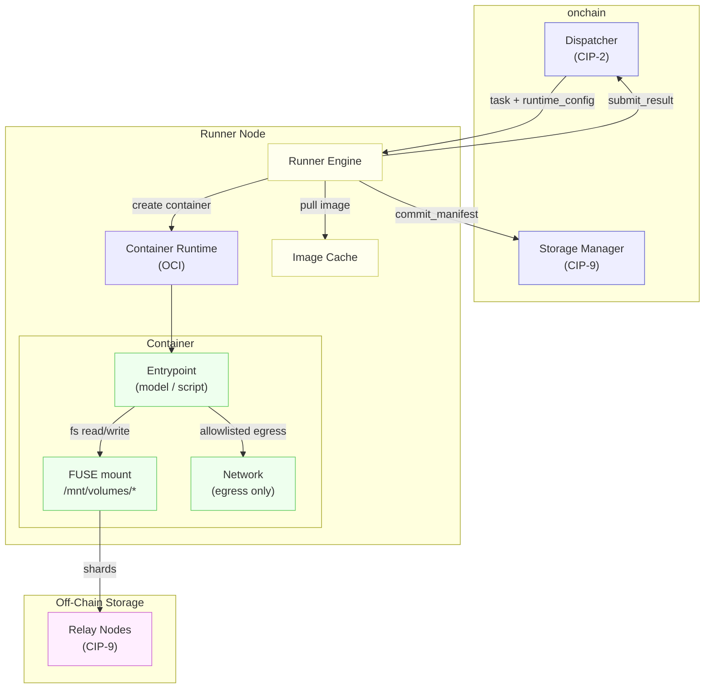
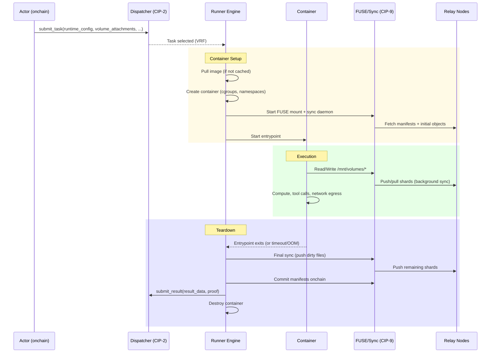

# CIP-10 v2

> **Versioning.** This is v2 of CIP-10. v1 is the canonical document `cip-10-runner-containers.md` (preserved verbatim as Part I). v2 = v1 + the alignment revision (Part II).
>
> **Conflict rule:** Part II is canonical wherever it contradicts Part I.
>
> **Summary of v2 changes**
>
> - **Container Registry actor allocated at `0x0F`** (continues the v2 sequence after `0x0E` `RECEIPT_REGISTRY`). Resolves v1 §11.2 placeholder `0x0...cowboy.containers`.
> - **Fee distribution routes through `SettlementConfig`** at `GOVERNANCE_SYSTEM_ACTOR=0x09` via the existing `UpdateSettlementConfig` opcode with `target_pool: CONTAINER` discriminant. Same pattern as CIP-2/3/14/15 v2.
> - **Three-flow off-chain billing model** clarified: runner job (CIP-2), storage rent (CIP-9), container compute (CIP-10) are independent escrows that share only the SettlementConfig template.
> - **`BillingAttestation.tee_signature` upgrades to `CompositeAttestation`** per CIP-23 v2 §3.12.
> - **System instruction opcodes 60–63** allocated for image / class registration (governance-only senders). No collision with CIP-13 v2 (44–48), CIP-23 (50–53), or current allocations (40–43).

---

## Part I — v1 Specification (verbatim from `cip-10-runner-containers.md`)


<Note>
  **Status:** Draft<br/>
  **Type:** Standards Track<br/>
  **Category:** Core<br/>
  **Created:** 2026-03-07<br/>
  **Requires:** CIP-2, CIP-9<br/>
</Note>

## 1. Abstract

This proposal defines the **Runner Container Runtime** — a standardized, OCI-compatible container execution environment for off-chain Runner jobs. It specifies how container images are addressed, fetched, and cached; how containers are provisioned with CIP-9 storage mounts, resource limits, network policies, and GPU access; and how the container lifecycle integrates with CIP-2's task dispatch and result submission flow.

Key properties:

- **OCI-compatible**: Containers use standard OCI images. Any image that runs on Docker or Podman runs on a Cowboy Runner.
- **Storage-integrated**: CIP-9 volumes are mounted as FUSE filesystems inside the container at deterministic paths. The model or script sees a standard filesystem.
- **Resource-bounded**: Every container declares CPU, memory, disk, and optional GPU limits. Runners enforce these limits and refuse tasks that exceed their capacity.
- **Network-isolated**: Containers run with no ingress and allowlisted egress by default. The task definition specifies which external endpoints are reachable.
- **Ephemeral**: Containers are destroyed after job completion. All persistent state lives in CIP-9 volumes; the container's own filesystem is scratch space.
- **Model-agnostic**: The runtime supports LLM tool-calling workloads (Llama, Kimi-K2, Claude, GPT, etc.), Python scripts, compiled binaries, and arbitrary OCI entrypoints with the same container primitive.

---

## 2. Motivation

CIP-2 defines how Actors dispatch tasks to Runners and receive results. CIP-9 defines how Runners access durable, encrypted storage volumes. However, neither CIP specifies the **execution environment** in which Runner code actually runs. This leaves critical questions unanswered:

1. **What environment does the code run in?** A bare Python process? A Docker container? A VM? Without a standard, Runners cannot guarantee reproducible execution.
2. **How are dependencies managed?** An ML inference job needs specific library versions, model weights, and system packages. The Runner node's host environment should not bleed into the job.
3. **How is the job sandboxed?** A malicious task definition could attempt to access the Runner's host filesystem, exfiltrate secrets, or abuse network access.
4. **How are hardware accelerators exposed?** GPU inference requires device passthrough with controlled access.
5. **What does an LLM see?** When Claude or Kimi-K2 runs as a Cowboy Runner doing tool calling, it needs a shell environment with its standard tools (Read, Write, Bash, etc.) operating against mounted volumes. The container must provide this environment transparently.

Existing container orchestration systems (Kubernetes, Nomad, Fly.io) solve pieces of this, but none integrate with onchain task dispatch, VRF-based runner selection, or decentralized billing. CIP-10 defines the minimal container runtime spec needed for Cowboy Runners, built on OCI standards so that existing tooling and images work out of the box.

---

## 3. Definitions

- **Container**: An isolated, ephemeral execution environment created from an OCI image. A container has its own filesystem root, process namespace, network namespace, and resource limits. It is destroyed after the job completes.
- **OCI Image**: A container image conforming to the [Open Container Initiative Image Specification](https://github.com/opencontainers/image-spec). Consists of an ordered set of filesystem layers, a configuration (entrypoint, env vars, working directory), and a manifest.
- **Image Manifest**: The OCI descriptor that identifies an image by its content-addressed digest (`sha256:...`). Pinning a digest ensures reproducible builds.
- **Runtime Config**: A structured definition within a CIP-2 task that specifies the container image, resource limits, network policy, GPU requirements, volume mounts, and environment variables for the job.
- **Scratch Filesystem**: The container's own writable filesystem layer (overlayfs). This is ephemeral and destroyed on container teardown. It is NOT backed by CIP-9 storage.
- **Base Image**: A pre-built, protocol-maintained OCI image optimized for common Runner workloads (LLM tool-calling, Python data science, etc.). Base images may be cached on Runner nodes for fast startup.

---

## 4. Design Overview

### 4.1 Architecture

A Runner node is a machine (physical or virtual) that runs an OCI-compatible container runtime. When a Runner is selected for a CIP-2 task, it:

1. Pulls the container image (if not cached).
2. Creates a container with the specified resource limits and network policy.
3. Mounts CIP-9 volumes as FUSE filesystems inside the container.
4. Starts the container entrypoint.
5. Monitors execution until completion, timeout, or crash.
6. Commits storage manifests and submits results onchain.
7. Destroys the container.



### 4.2 Relationship to Existing CIPs

- **CIP-2 (Off-Chain Compute)**: CIP-10 extends the `OffchainTask` struct with a `runtime_config` field that specifies the container environment. The existing VRF selection, result submission, and deferred callback mechanisms are unchanged.
- **CIP-9 (Runner Attached Storage)**: CIP-9 volumes specified in `volume_attachments` are mounted inside the container as FUSE filesystems at `/mnt/volumes/{name}/`. The FUSE daemon and sync daemon (CIP-9 §12.1) run as sidecar processes alongside the container.
- **CIP-3 (Fee Model)**: Container resource usage (CPU-seconds, memory-seconds, GPU-seconds) uses attestation-based billing — metered externally by Runner cgroup counters, settled onchain via `BillingAttestation` (§12.3). This is distinct from CIP-3 Cycles/Cells, which are metered directly by the VM during transaction execution.

---

## 5. Container Images

### 5.1 Image Format

All images MUST conform to the OCI Image Specification v1.1+. This ensures compatibility with Docker, Podman, containerd, and other standard tools.

Supported image media types:
- `application/vnd.oci.image.manifest.v1+json`
- `application/vnd.docker.distribution.manifest.v2+json` (Docker v2, backward-compatible)

Multi-architecture manifests (`application/vnd.oci.image.index.v1+json`) are supported. The Runner selects the appropriate platform variant (`linux/amd64` or `linux/arm64`) based on its host architecture.

### 5.2 Image Addressing

Images are addressed by digest for reproducibility:

```
ImageRef {
  registry:  string,        // registry hostname (e.g., "registry.cowboylabs.org", "ghcr.io")
  repository: string,       // image name (e.g., "cowboy/runner-base")
  digest:    string,        // content-addressed digest (e.g., "sha256:abc123...")
  tag:       string?,       // optional human-readable tag (informational only; digest is authoritative)
}
```

**Digest pinning is mandatory** in task definitions. Tags are informational — the runtime always pulls by digest. This prevents supply chain attacks where a tag is re-pointed to a different image after a task is submitted.

### 5.3 Image Registries

Runner nodes pull images from OCI-compliant registries. Three registry tiers are supported:

1. **Protocol registry** (`registry.cowboylabs.org`): Maintained by the Cowboy protocol. Hosts base images and community-vetted images. Images are replicated across multiple mirrors for availability. No authentication required for pulls.
2. **Public registries** (`ghcr.io`, `docker.io`, etc.): Standard public registries. The task definition specifies the full image reference. Runner nodes must have network access to the registry.
3. **Private registries**: Authenticated registries where the account owner provides pull credentials in the task definition (encrypted with the Runner's TEE attestation key). Credentials are scoped to the job duration and never persisted by the Runner.

### 5.4 Image Caching

Runner nodes maintain a local image cache (LRU, configurable max size). Cache behavior:

- **Cache hit**: Image layers already present locally. Container creation starts immediately.
- **Cache miss**: Layers are pulled from the registry. Pull time depends on image size and network.
- **Base images**: Protocol base images (§5.5) are pre-pulled and pinned in the cache. They are never evicted.

**Expected pull times:**

| Image Size | Cache Hit | Cache Miss (100 Mbps) | Cache Miss (1 Gbps) |
|-----------|:---------:|:---------------------:|:--------------------:|
| 100 MiB (base) | 0s | ~8s | ~1s |
| 500 MiB (ML deps) | 0s | ~40s | ~4s |
| 2 GiB (full ML stack) | 0s | ~160s | ~16s |

Task submitters SHOULD prefer thin images that layer on top of cached base images to minimize startup latency.

### 5.5 Base Images

The protocol maintains a set of base images optimized for common workloads:

| Image | Description | Size | Contents |
|-------|-------------|:----:|----------|
| `cowboy/runner-base` | Minimal Linux + shell | ~50 MiB | Alpine, bash, coreutils, curl, jq |
| `cowboy/runner-python` | Python data science | ~300 MiB | Python 3.12, pip, numpy, pandas, requests |
| `cowboy/runner-ml` | ML inference | ~1.5 GiB | Python 3.12, PyTorch, transformers, CUDA runtime |
| `cowboy/runner-agent` | LLM tool-calling | ~200 MiB | bash, coreutils, Python 3.12, jq, grep, find, git, common CLI tools |

The `runner-agent` image is the recommended base for LLM tool-calling workloads. It provides the standard Unix tools that models expect when using filesystem-based tool sets (Read, Write, Bash, Glob, Grep).

Base image digests are published onchain in the Container Registry actor (§11.2), allowing task submitters to reference them by well-known name and have the digest resolved deterministically.

---

## 6. Runtime Environment

### 6.1 Container Filesystem Layout

Every container starts with the following filesystem structure, regardless of image:

```
/
├── mnt/
│   └── volumes/                    # CIP-9 volume mount root
│       ├── {volume_name_1}/        # FUSE-mounted volume
│       └── {volume_name_2}/        # FUSE-mounted volume
├── tmp/                            # writable tmpfs (scratch space)
├── workspace/                      # writable, default working directory
└── ... (image filesystem layers)   # read-only image content
```

**Key directories:**

| Path | Writable | Backed by | Purpose |
|------|:--------:|-----------|---------|
| `/mnt/volumes/*` | Per CapToken | CIP-9 Relay Nodes (durable) | Persistent storage |
| `/tmp` | Yes | Container scratch (tmpfs) | Temporary files |
| `/workspace` | Yes | Container scratch (overlayfs) | Working directory |
| Image paths (`/usr`, `/bin`, etc.) | No | Image layers | System binaries and libraries |

### 6.2 Environment Variables

The runtime injects the following environment variables into every container:

```
COWBOY_TASK_ID=<task_id>                    # CIP-2 task ID
COWBOY_RUNNER_ADDRESS=<runner_address>       # This Runner's address
COWBOY_ACCOUNT_ADDRESS=<account_address>     # Task submitter's account
COWBOY_TIMEOUT_BLOCK=<timeout_block>         # Job deadline (block height)
COWBOY_VOLUME_MOUNTS=<comma-separated>       # e.g., "agent-memory,pipeline"
COWBOY_NETWORK_POLICY=<policy_name>          # e.g., "allowlist", "none"
```

Additional environment variables from the task definition's `runtime_config.env` are merged in (task-defined vars take precedence for non-`COWBOY_` prefixed keys). The `COWBOY_` prefix is reserved and cannot be overridden.

### 6.3 Entrypoint and Command

The container entrypoint is resolved in this order:

1. **`runtime_config.command`** (if specified in the task definition) — overrides the image's `ENTRYPOINT` and `CMD`.
2. **Image `ENTRYPOINT` + `CMD`** — the default from the OCI image config.

For LLM tool-calling workloads, the entrypoint is typically a model harness process that:
1. Connects to the model API (Claude, Kimi-K2, etc.) or runs a local model.
2. Provides the model with a system prompt and tools (Read, Write, Bash, etc.).
3. Executes tool calls against the container's filesystem (including FUSE-mounted volumes).
4. Returns the final result to the Runner engine for onchain submission.

The protocol does NOT prescribe how the model harness works. This is the domain of Runner operator software. CIP-10 only specifies the container environment in which it runs.

### 6.4 User and Permissions

Containers run as a non-root user (`uid=1000`, `gid=1000`) by default. This can be overridden in the image but is constrained:

- **Root (`uid=0`) is prohibited** unless `runtime_config.allow_root = true` and the Runner supports it. Runners MAY reject tasks requesting root.
- FUSE mount points (`/mnt/volumes/*`) are owned by the container user.
- The container process has no access to the host filesystem, network namespace, or other containers.

---

## 7. Resource Limits

### 7.1 Resource Declaration

Every task MUST declare resource limits in its `runtime_config`. Runners use these limits to determine if they can accept the task and to enforce isolation during execution.

```
ResourceLimits {
  cpu_millicores:   u32,       // CPU allocation (1000 = 1 core)
  memory_mib:       u32,       // Memory limit in MiB
  scratch_disk_mib: u32,       // Scratch filesystem (overlayfs) limit in MiB
  gpu:              GpuRequest?, // Optional GPU request (see §8)
  max_duration_sec: u32,       // Hard wall-clock timeout (seconds)
}
```

### 7.2 Enforcement

| Resource | Mechanism | On Exceed |
|----------|-----------|-----------|
| CPU | cgroups v2 `cpu.max` | Throttled (not killed) |
| Memory | cgroups v2 `memory.max` | OOM-killed |
| Scratch disk | overlayfs quota / `tmpfs size=` | Write returns `ENOSPC` |
| Wall-clock time | Timer in Runner engine | Container killed, task marked `TIMED_OUT` |

CIP-9 volume storage limits are enforced by CapToken `max_bytes` (CIP-9 §7.1), not by container-level disk quotas.

### 7.3 Resource Classes

To simplify task definition, the protocol defines standard resource classes. Task submitters can specify a class name instead of individual limits:

| Class | CPU | Memory | Scratch Disk | Duration | Use Case |
|-------|:---:|:------:|:------------:|:--------:|----------|
| `small` | 1000m (1 core) | 512 MiB | 1 GiB | 300s | Simple scripts, API calls |
| `medium` | 2000m (2 cores) | 2 GiB | 5 GiB | 600s | LLM tool-calling, data processing |
| `large` | 4000m (4 cores) | 8 GiB | 20 GiB | 1800s | Heavy ML inference, large datasets |
| `gpu-small` | 4000m (4 cores) | 16 GiB | 50 GiB | 1800s | GPU inference (1x GPU) |
| `gpu-large` | 8000m (8 cores) | 32 GiB | 100 GiB | 3600s | Multi-GPU training/inference |

Resource classes are defined onchain in the Container Registry actor and are governance-tunable. Custom limits override class defaults.

### 7.4 Runner Capability Advertising

Runners advertise their available resources in the Runner Registry (CIP-2). The `RunnerProfile` struct is extended:

```
RunnerProfile {
  ... (existing CIP-2 fields) ...
  # NEW: Resource capabilities
  total_cpu_millicores:  u32,
  total_memory_mib:      u32,
  total_scratch_mib:     u32,
  gpu_devices:           list[GpuDevice],
  supported_platforms:   list[string],      // e.g., ["linux/amd64", "linux/arm64"]
  base_images_cached:    list[bytes32],     // digests of cached base images
}
```

When evaluating whether to accept a task, a Runner checks that the requested resources fit within its available capacity (total minus currently allocated to running containers).

---

## 8. GPU Passthrough

### 8.1 GPU Request

Tasks requiring GPU access specify a `GpuRequest`:

```
GpuRequest {
  count:          u8,        // number of GPUs requested
  min_vram_mib:   u32,       // minimum VRAM per GPU
  compute_cap:    string?,   // minimum CUDA compute capability (e.g., "8.0")
  driver:         string?,   // required driver framework ("cuda", "rocm")
}
```

### 8.2 Device Exposure

GPU devices are exposed to the container via the OCI runtime's device mapping:

- **NVIDIA GPUs**: Exposed via `nvidia-container-runtime` (CDI). The container sees `/dev/nvidia*` devices and CUDA libraries.
- **AMD GPUs**: Exposed via ROCm device mapping. The container sees `/dev/kfd` and `/dev/dri/render*`.

Only the requested number of GPUs are visible to the container. The Runner engine manages GPU allocation across concurrent containers.

### 8.3 GPU Capability in Runner Registry

Runners with GPUs advertise them:

```
GpuDevice {
  vendor:        string,     // "nvidia", "amd"
  model:         string,     // "A100", "H100", "MI300X"
  vram_mib:      u32,        // e.g., 81920 for A100-80G
  compute_cap:   string,     // e.g., "8.0" for A100
}
```

### 8.4 Capability-Aware Runner Prefiltering

The naive approach — VRF selects from all active Runners, then incapable Runners call `skip_task()` — creates a latency griefing problem for resource-constrained tasks. If only 5% of Runners have GPUs, a GPU task could bounce through 20+ skip rounds before landing on a capable Runner, each round adding ~12 seconds of onchain latency.

CIP-10 introduces **capability prefiltering** as an extension to the CIP-2 VRF selection:

1. The Dispatcher maintains **capability indices** — filtered sublists of the active runner list grouped by advertised capabilities (GPU vendor/model, platform architecture, memory tier, cached base images).
2. When a task specifies resource requirements (e.g., `gpu.count > 0`, `memory_mib > 16384`), the VRF selection runs against the **filtered sublist** of capable Runners, not the full active list.
3. The `start_index` calculation from CIP-2 §6 is applied to the filtered list: `start_index = hash(vrf_seed + (submission_block - vrf_generation_block)) (mod filtered_list_size)`.
4. If the filtered list is empty (no capable Runners registered), the task fails immediately at submission with `NO_CAPABLE_RUNNERS`.

**Verification**: The capability index is deterministic — it is derived from onchain `RunnerProfile` data. Any party can reconstruct the filtered list and verify the VRF selection. `skip_task()` remains as a fallback for edge cases (e.g., a Runner's advertised capacity is currently fully allocated to other containers).

For tasks with no special requirements (no GPU, standard resource class), the VRF selection operates on the full active list as in CIP-2, with no behavioral change.

---

## 9. Network Policy

### 9.1 Default: Isolated

By default, containers have **no network access**. This is the safest posture and sufficient for pure computation tasks that read from CIP-9 volumes and write results.

### 9.2 Egress Allowlist

Tasks that need external network access (API calls, web scraping, model API endpoints) declare an egress allowlist:

```
NetworkPolicy {
  mode:           ENUM { NONE, ALLOWLIST },
  egress_rules:   list[EgressRule],
}

EgressRule {
  host:     string,          // hostname or IP (e.g., "api.anthropic.com", "api.moonshot.cn")
  port:     u16?,            // specific port (default: 443)
  protocol: ENUM { TCP, UDP },  // default: TCP
}
```

**Rules:**

- **No wildcards**: Each allowed host must be explicitly listed. `*.example.com` is not valid.
- **DNS resolution and IP pinning**: DNS resolution is performed by a **host-side DNS proxy** (not inside the container) that enforces the allowlist. The proxy resolves each allowlisted hostname at container startup, pins the resolved IP(s), and configures iptables rules to permit traffic only to those pinned IPs on the specified ports. This prevents DNS rebinding attacks (where an attacker changes a DNS record mid-session to redirect traffic to an internal IP). The container's `/etc/resolv.conf` points to the host proxy, which rejects queries for non-allowlisted domains.
  - **TLS SNI verification**: For TLS connections (port 443), the Runner's network filter verifies that the TLS ClientHello SNI matches the allowlisted hostname. This prevents an attacker from using an allowlisted IP to tunnel traffic to a different hostname.
  - **DNS TTL refresh**: Pinned IPs are refreshed at DNS TTL expiry (minimum 60s, maximum 300s) to handle legitimate IP rotations (CDNs, load balancers). New IPs are verified against the allowlist hostname before being permitted.
- **No ingress**: Containers cannot listen on ports or accept incoming connections. There are no inbound requests to the container.
- **No inter-container networking**: Containers from different tasks cannot communicate directly, even if they run on the same Runner node. Communication between tasks happens through CIP-9 shared volumes.

### 9.3 Model API Access

For LLM tool-calling workloads, the model API endpoint must be in the egress allowlist. The Runner operator's model harness handles authentication with the model provider.

```python
# Example: Task requiring Claude API access
NetworkPolicy(
    mode=ALLOWLIST,
    egress_rules=[
        EgressRule(host="api.anthropic.com", port=443, protocol=TCP),
    ]
)
```

For Runners that host models locally (on-device inference), no egress is needed — the model runs inside the container.

---

## 10. Container Lifecycle

### 10.1 Full Lifecycle



### 10.2 Phase Details

**Phase 1: Setup** (~1-30s depending on image cache state)

1. **Image pull**: If the image is not cached, pull layers from the registry. If pull fails (registry unavailable, digest mismatch), the Runner calls `skip_task()`.
2. **Container creation**: Create the container with resource limits (cgroups v2), namespace isolation (PID, mount, network, user), and filesystem layers (overlayfs for scratch).
3. **Volume mounts**: For each `VolumeAttachment` in the task definition:
   - Obtain CapToken from the Dispatcher.
   - Obtain volume encryption key (TEE-sealed or threshold-shared, per CIP-9 §9.2).
   - Start the FUSE daemon mounting the volume at `/mnt/volumes/{name}/`.
   - Start the sync daemon for background push/pull.
   - Fetch the current manifest from Relay Nodes.
4. **Environment injection**: Set `COWBOY_*` env vars and task-defined env vars.
5. **Start entrypoint**: Execute the container's entrypoint process.

**Phase 2: Execution** (bounded by `max_duration_sec`)

- The entrypoint process runs. For LLM workloads, this is the model harness executing tool calls against the filesystem.
- FUSE-mounted volumes handle reads/writes transparently (CIP-9 §12.1).
- The sync daemon pushes and pulls in the background at the configured interval.
- The Runner engine monitors resource usage and enforces limits.

**Phase 3: Teardown** (~5-30s)

1. **Entrypoint exit**: The entrypoint exits with code 0 (success) or non-zero (failure).
2. **Final sync**: The sync daemon performs a final push of all dirty files to Relay Nodes. This blocks until complete or until a teardown timeout (`TEARDOWN_TIMEOUT_SEC`, default 30s) is reached.
3. **Manifest commit**: The Runner commits storage manifests onchain for each attached volume.
4. **Result submission**: The Runner calls `submit_result()` on the CIP-2 Runner Submission Contract with the job output.
5. **Container destruction**: The container, its scratch filesystem, and all in-memory state are destroyed. Volume data persists on Relay Nodes.

### 10.3 Failure Modes

| Failure | Detection | Response |
|---------|-----------|----------|
| **OOM kill** | cgroups `memory.events` | Container killed. Runner submits failure result. Data from last sync persists. |
| **Timeout** | Runner engine wall-clock timer | Container killed (SIGTERM, then SIGKILL after 10s). Final sync attempted. Runner submits `TIMED_OUT` result. |
| **Entrypoint crash** | Non-zero exit code | Runner submits failure result with exit code. |
| **Image pull failure** | Pull timeout or digest mismatch | Runner calls `skip_task()`. Next VRF-selected Runner takes over. |
| **FUSE mount failure** | Mount syscall error | Container not started. Runner calls `skip_task()`. |
| **Relay Node unreachable** | Sync daemon connection timeout | Sync retries with backoff. If all Relay Nodes for a volume are unreachable, container continues with locally cached data. Final sync may fail, losing unsynced writes. |
| **Runner node crash** | Heartbeat timeout (CIP-2) | Container dies with the node. Task times out and is re-assigned. Unsynced data is lost. Synced data persists on Relay Nodes. |

### 10.4 Exit Codes

The Runner engine maps container exit codes to CIP-2 task result statuses:

| Exit Code | Meaning | CIP-2 Status |
|:---------:|---------|:------------:|
| 0 | Success | `COMPLETED` |
| 1-125 | Application error | `FAILED` |
| 137 (128+9) | OOM killed (SIGKILL) | `FAILED_OOM` |
| 143 (128+15) | Timed out (SIGTERM) | `TIMED_OUT` |
| 126 | Command not found / permission denied | `FAILED` |
| 127 | Entrypoint not found | `FAILED` |

---

## 11. onchain State

### 11.1 CIP-2 Task Definition Extension

The `OffchainTask` struct from CIP-2 is extended with a `runtime_config` field:

```
struct OffchainTask:
    ... (existing CIP-2 fields) ...
    volume_attachments: list[VolumeAttachment]    # CIP-9
    runtime_config:     RuntimeConfig              # CIP-10 (NEW)
```

Where:

```
RuntimeConfig {
  image:             ImageRef,
  resource_class:    string?,         // e.g., "medium" (shorthand for resource limits)
  resources:         ResourceLimits?, // explicit limits (overrides class if both specified)
  network:           NetworkPolicy,
  gpu:               GpuRequest?,
  env:               map[string, string],  // additional env vars
  command:           list[string]?,   // override entrypoint + cmd
  working_dir:       string?,         // override working directory (default "/workspace")
  allow_root:        bool,            // default false
}
```

### 11.2 Container Registry Actor

A new system actor at `0x0...cowboy.containers` maintains:

**BaseImageEntry** (per base image):

```
BaseImageEntry {
  name:       string,          // e.g., "cowboy/runner-agent"
  digest:     bytes32,         // current pinned digest
  updated_at: u64,             // block height
  size_bytes: u64,             // total image size
  platforms:  list[string],    // supported architectures
}
```

**ResourceClassEntry** (per resource class):

```
ResourceClassEntry {
  name:              string,
  cpu_millicores:    u32,
  memory_mib:        u32,
  scratch_disk_mib:  u32,
  max_duration_sec:  u32,
  gpu_count:         u8,
  gpu_min_vram_mib:  u32,
}
```

Base image digests and resource classes are updated via governance proposals.

### 11.3 Key Space

Container Registry entries use the CIP-4 `STORAGE` key space:

```
# Base images
key = 0x1 || keccak256(container_registry_address) || 0x00 || keccak256("image" || image_name)
value = rlp(BaseImageEntry)

# Resource classes
key = 0x1 || keccak256(container_registry_address) || 0x00 || keccak256("class" || class_name)
value = rlp(ResourceClassEntry)
```

---

## 12. Billing and Fees

### 12.1 Compute Resource Billing

Container resource usage is billed alongside the CIP-2 `payment_per_runner`. The task submitter locks funds at `submit_task()` time covering the maximum possible resource cost:

```
max_compute_cost = (cpu_millicores / 1000) * max_duration_sec * CPU_FEE_PER_CORE_SEC
                 + (memory_mib / 1024) * max_duration_sec * MEMORY_FEE_PER_GIB_SEC
                 + gpu_count * max_duration_sec * GPU_FEE_PER_SEC
```

At job completion, the actual usage is metered and the difference is refunded:

```
actual_compute_cost = (cpu_used_millicores / 1000) * actual_duration_sec * CPU_FEE_PER_CORE_SEC
                    + (peak_memory_mib / 1024) * actual_duration_sec * MEMORY_FEE_PER_GIB_SEC
                    + gpu_count * actual_duration_sec * GPU_FEE_PER_SEC

refund = max_compute_cost - actual_compute_cost
```

### 12.2 Image Pull Fees

Image pulls from the protocol registry are free. Pulls from external registries incur bandwidth costs:

```
pull_cost = image_size_bytes * EGRESS_FEE_PER_BYTE
```

This is waived for cached images (size = 0 bytes transferred).

### 12.3 Billing Attestations and Dispute Window

Off-chain billing requires trust that the Runner honestly reports resource usage. Without verification, a malicious Runner could over-report to extract more payment or under-report to undercharge. RAS mitigates this with **billing attestations** and a **dispute window**.

**Billing attestation**: When submitting results, the Runner includes a `BillingAttestation`:

```
BillingAttestation {
  task_id:               uint256,
  cpu_used_millicores:   u32,        // average CPU utilization
  peak_memory_mib:       u32,        // peak memory usage
  actual_duration_sec:   u32,        // wall-clock execution time
  gpu_seconds:           u32,        // GPU time used
  bytes_egressed:        u64,        // network egress bytes
  runner_address:        bytes32,
  tee_signature:         bytes64?,   // TEE attestation signature (if available)
  cgroup_digest:         bytes32,    // BLAKE3 hash of cgroup accounting snapshot
}
```

For **TEE Runners**: The attestation is signed by the enclave. The TEE monitors cgroup counters and produces a tamper-proof usage report. This is the strongest guarantee — the Runner cannot inflate measurements without breaking the TEE.

For **non-TEE Runners**: The attestation is self-reported and signed by the Runner. This is weaker but is constrained by the **dispute window**.

**Dispute window**: After result submission, there is a `BILLING_DISPUTE_WINDOW` (e.g., 300 blocks, ~1 hour) during which the task submitter can challenge the billing attestation.

Dispute resolution:

| Scenario | Resolution |
|----------|------------|
| TEE attestation present | Attestation is authoritative; disputes rejected unless TEE itself is compromised |
| Non-TEE, no dispute filed | Attestation accepted after window closes |
| Non-TEE, dispute filed | Fall back to `max_compute_cost` (the pre-locked amount); no refund to the submitter; Runner receives the full locked amount |
| Repeated disputes against a Runner | Runner's `tasks_failed` counter in the Registry is incremented; VRF selection reputation degrades |

The dispute mechanism is intentionally simple for v1 — it does not try to adjudicate the "true" resource usage (which is unknowable onchain for non-TEE Runners). Instead, it uses economic incentives: Runners who over-report get disputed and lose reputation; the task submitter's worst case is the pre-locked max cost (which they already accepted at submission). This is similar to optimistic rollup dispute games — honest behavior is the dominant strategy because disputes are expensive for both parties.

### 12.4 Relationship to CIP-3

Like CIP-9 storage fees, container compute fees use **attestation-based billing** — the metering happens externally (cgroup counters on the Runner), but the settlement is entirely onchain (fund locking, attestation submission, dispute resolution, refunds). This is distinct from CIP-3 Cycles and Cells, which are metered directly by the VM during transaction execution. The chain cannot run the container itself, so it relies on the Runner's `BillingAttestation` (verified by TEE signature or bounded by the dispute window) to determine actual usage. onchain operations (task submission, result submission, manifest commits) consume Cycles and Cells per CIP-3 as normal.

---

## 13. Parameters

| Parameter | Value | Notes |
|-----------|-------|-------|
| **Container Limits** | | |
| `MAX_CPU_MILLICORES` | 16000 (16 cores) | Per container |
| `MAX_MEMORY_MIB` | 65536 (64 GiB) | Per container |
| `MAX_SCRATCH_DISK_MIB` | 204800 (200 GiB) | Per container |
| `MAX_DURATION_SEC` | 7200 (2 hours) | Hard wall-clock limit |
| `MAX_GPU_COUNT` | 8 | Per container |
| `TEARDOWN_TIMEOUT_SEC` | 30 | Max time for final sync + cleanup |
| **Network** | | |
| `MAX_EGRESS_RULES` | 32 | Per task |
| `MAX_EGRESS_BANDWIDTH` | TBD | Per container, governance-tunable |
| **Images** | | |
| `MAX_IMAGE_SIZE` | 10 GiB | Reject images larger than this |
| `IMAGE_PULL_TIMEOUT_SEC` | 300 (5 min) | Give up and skip_task() |
| `MIN_IMAGE_CACHE_SIZE` | 20 GiB | Runner must reserve for base images |
| **Billing** | | |
| `CPU_FEE_PER_CORE_SEC` | TBD | CBY per core-second, governance-tunable |
| `MEMORY_FEE_PER_GIB_SEC` | TBD | CBY per GiB-second, governance-tunable |
| `GPU_FEE_PER_SEC` | TBD | CBY per GPU-second, governance-tunable |
| `EGRESS_FEE_PER_BYTE` | TBD | CBY per byte, governance-tunable |
| `COMPUTE_FEE_BURN_RATE` | 10% | Portion burned, consistent with CIP-3/CIP-9 |
| **Billing Disputes** | | |
| `BILLING_DISPUTE_WINDOW` | 300 | Blocks (~1 hour) to file a dispute |
| `DISPUTE_BOND` | TBD | CBY bond required to file a dispute (refunded if valid) |

---

## 14. Security Considerations

### 14.1 Container Escape

A container escape (breaking out of namespaces/cgroups into the host) is the most critical threat. Mitigations:

- **Namespace isolation**: PID, mount, network, user, UTS, IPC namespaces are all isolated.
- **Seccomp profile**: A restrictive seccomp profile blocks dangerous syscalls (`mount`, `reboot`, `kexec_load`, etc.).
- **Capabilities dropped**: All Linux capabilities are dropped except a minimal set (`CAP_NET_BIND_SERVICE` for egress, `CAP_FOWNER` for FUSE mounts).
- **Read-only root**: The image filesystem is mounted read-only. Only `/tmp`, `/workspace`, and CIP-9 mounts are writable.
- **No privileged mode**: `--privileged` is never allowed. Even `allow_root=true` does not grant host capabilities.
- **gVisor/Kata** (optional): Runner operators MAY use gVisor (application kernel) or Kata Containers (lightweight VM) for additional isolation. This is an operator choice, not a protocol requirement.

### 14.2 Image Supply Chain

- **Digest pinning**: Images are always pulled by digest, preventing tag-based supply chain attacks.
- **Base image governance**: Protocol base images are updated only via governance proposals. Digests are recorded onchain.
- **No implicit pulls**: The Runner never pulls an image not explicitly specified in the task definition.
- **Layer verification**: Each layer's digest is verified on pull per the OCI distribution spec.

### 14.3 Network Exfiltration

- **Default deny**: No network access unless explicitly allowlisted.
- **No wildcards**: Allowlist entries must be specific hostnames.
- **No DNS exfiltration**: DNS resolution happens inside the container but is restricted to resolving allowlisted hosts (Runners SHOULD use a DNS proxy that blocks queries for non-allowlisted domains).
- **Bandwidth limits**: `MAX_EGRESS_BANDWIDTH` prevents a container from saturating the Runner's network.

### 14.4 Resource Exhaustion

- **Mandatory limits**: Tasks without resource limits are rejected at the Dispatcher.
- **cgroups enforcement**: CPU throttling and memory OOM-kill prevent runaway containers.
- **Disk quotas**: Scratch disk is bounded by overlayfs/tmpfs limits.
- **CIP-9 quotas**: Volume write quotas are enforced by CapToken `max_bytes`.

### 14.5 Secret Leakage

- **No host env inheritance**: Container environment is clean — only `COWBOY_*` vars and task-defined vars.
- **No host filesystem**: The container has no access to the Runner's host filesystem, Docker socket, or metadata services.
- **TEE attestation**: For sensitive workloads, Runners must attest via TEE (CIP-2 `tee_required=true`). The volume key (CIP-9) and any task secrets are sealed to the enclave.
- **Scratch destruction**: Container scratch filesystem is destroyed immediately after teardown.

### 14.6 GPU Side Channels

- **MIG isolation** (NVIDIA): For multi-tenant GPU sharing, Runners SHOULD use Multi-Instance GPU (MIG) to provide hardware-level isolation between containers.
- **Memory clearing**: GPU memory is cleared between container executions to prevent cross-job data leakage.
- **Single-tenant default**: In v1, a GPU device is assigned to at most one container at a time (no sharing).

---

## 15. Implementation Notes

### 15.1 Recommended Runtime Stack

| Component | Recommended | Alternatives |
|-----------|-------------|-------------|
| Container runtime | `runc` (OCI reference) | `crun` (Rust, lighter), `runsc` (gVisor) |
| Image management | `containerd` | `podman` (rootless), `skopeo` (pull only) |
| Networking | `netns` + `iptables` | `nftables`, `cilium` |
| GPU | `nvidia-container-toolkit` | `ROCm` (AMD) |
| FUSE | `fuser` crate (CIP-9) | `go-fuse` |
| cgroups | cgroups v2 (unified hierarchy) | — |

### 15.2 Rootless Operation

Runner operators are RECOMMENDED to run the container runtime in rootless mode (user namespaces, rootless containerd). This provides defense-in-depth — even if a container escape occurs, the attacker has only unprivileged host access.

### 15.3 Container Creation Time Budget

Target: container ready to execute within 5 seconds of task acceptance (assuming cached image):

| Step | Target Time | Notes |
|------|:-----------:|-------|
| Create namespaces + cgroups | ~50ms | Kernel operations |
| Set up overlayfs | ~100ms | Mount layers |
| Set up network namespace | ~100ms | Create veth, iptables rules |
| FUSE mount (per volume) | ~500ms | CIP-9 key delivery + manifest fetch |
| Start entrypoint | ~50ms | exec into container |
| **Total (1 volume, cached image)** | **~800ms** | |

### 15.4 Logging

Container stdout/stderr is captured by the Runner engine. Log handling:

- Logs are buffered in memory (max `LOG_BUFFER_SIZE`, default 10 MiB).
- Logs are available to the task submitter as part of the result payload (if the result_schema requests them).
- Logs are NOT persisted by the Runner after container destruction.
- If the task attaches a CIP-9 volume, the entrypoint can write logs to the volume for durable storage.

---

## 16. Scope and Future Work

### 16.1 v1 Scope (This CIP)

- OCI-compatible container images with digest pinning.
- Container filesystem isolation with read-only root and writable scratch.
- CIP-9 FUSE volume mounts inside containers.
- Mandatory resource limits (CPU, memory, scratch disk, wall-clock time).
- GPU passthrough (NVIDIA CUDA, AMD ROCm).
- Network isolation with explicit egress allowlists.
- Standard base images for common workloads (agent, Python, ML).
- Container lifecycle integrated with CIP-2 task dispatch.
- Compute resource billing (CPU-sec, memory-sec, GPU-sec).
- onchain Container Registry for base image digests and resource classes.

### 16.2 Explicitly Out of Scope

- **Long-running services**: v1 containers are ephemeral (bounded by `max_duration_sec`). Persistent services (web servers, databases) that run indefinitely are a future CIP. CIP-5 timers can be used to re-dispatch periodic jobs.
- **Container-to-container networking**: Direct communication between containers from different tasks. In v1, coordination happens via CIP-9 shared volumes.
- **Custom container runtimes**: v1 requires an OCI-compatible runtime. Support for WASM, Firecracker micro-VMs, or other execution models is a future extension.
- **Image building onchain**: v1 images are built externally and pushed to registries. A decentralized image build service is a future CIP.
- **Trusted builder attestation**: Verifying that an image was built from a specific source repository (e.g., via Sigstore). This is a future supply chain security enhancement.
- **Spot/preemptible execution**: v1 has no concept of interruptible, lower-cost execution tiers. This is a future pricing extension.
- **Multi-container pods**: v1 runs a single container per task. Sidecar patterns (e.g., running a local model alongside a tool-calling harness) require the entrypoint to manage sub-processes internally or be combined into a single image.

---

## Appendix A: Examples

### A.1 LLM Tool-Calling Agent (Claude)

An autonomous research agent runs as Claude with tool calling, reading/writing to a persistent memory volume.

**Task submission:**
```python
submit_task(
    task_definition=encode_task({
        "model": "claude-sonnet",
        "system": "You are a research assistant. Your notes are in /mnt/volumes/notes/.",
        "prompt": "Research the latest developments in fusion energy. Update your notes.",
    }),
    runtime_config=RuntimeConfig(
        image=ImageRef(
            registry="registry.cowboylabs.org",
            repository="cowboy/runner-agent",
            digest="sha256:a1b2c3...",
        ),
        resource_class="medium",
        network=NetworkPolicy(
            mode=ALLOWLIST,
            egress_rules=[
                EgressRule(host="api.anthropic.com", port=443),
            ],
        ),
        env={"ANTHROPIC_API_KEY": "<encrypted>"},
    ),
    volume_attachments=[
        VolumeAttachment(
            volume_name="notes",
            access_mode=READ_WRITE,
            mount=True,
            max_bytes=100_000_000,
        ),
    ],
    num_runners=1,
    timeout_blocks=500,
    ...
)
```

**What happens on the Runner node:**
```
1. Runner selected via VRF
2. Image "cowboy/runner-agent" already cached (base image) → skip pull
3. Create container:
   - cgroups: cpu.max=200000/100000, memory.max=2G
   - namespaces: new PID, mount, net, user
   - network: iptables ALLOW api.anthropic.com:443, DROP all else
4. FUSE mount /mnt/volumes/notes/ (CIP-9 key delivery, manifest fetch)
5. Start entrypoint (model harness)
```

**Claude's tool calls inside the container:**
```
1. Bash("ls /mnt/volumes/notes/")
   → research/  summaries/  sources.json

2. Read("/mnt/volumes/notes/summaries/fusion-2026-02.md")
   → [last month's fusion research summary]

3. [Claude searches the web via allowed API, analyzes findings]

4. Write("/mnt/volumes/notes/research/fusion-2026-03-07.md", new_findings)
   → Written to local tmpfs, sync daemon pushes to Relay Nodes

5. Write("/mnt/volumes/notes/summaries/fusion-2026-03.md", updated_summary)

6. Bash("wc -l /mnt/volumes/notes/research/*.md")
   → 15 research notes total
```

**Teardown:**
```
7. Entrypoint exits (code 0)
8. Final sync: 2 dirty files pushed to Relay Nodes
9. Manifest committed onchain
10. submit_result() with summary of work done
11. Container destroyed. Volume data persists.
```

### A.2 GPU ML Inference

A model inference job runs PyTorch on a GPU, reading input from one volume and writing predictions to another.

**Task submission:**
```python
submit_task(
    task_definition=encode_task({
        "action": "inference",
        "model_path": "models/classifier-v3.pt",
        "input_dir": "batch-2026-03-07/",
    }),
    runtime_config=RuntimeConfig(
        image=ImageRef(
            registry="registry.cowboylabs.org",
            repository="cowboy/runner-ml",
            digest="sha256:d4e5f6...",
        ),
        resources=ResourceLimits(
            cpu_millicores=4000,
            memory_mib=16384,
            scratch_disk_mib=51200,
            max_duration_sec=1800,
            gpu=GpuRequest(count=1, min_vram_mib=24576, compute_cap="8.0", driver="cuda"),
        ),
        network=NetworkPolicy(mode=NONE),
    ),
    volume_attachments=[
        VolumeAttachment(volume_name="models", access_mode=READ_WRITE, mount=True,
                         max_bytes=5_000_000_000),
        VolumeAttachment(volume_name="predictions", access_mode=WRITE_ONLY, mount=True,
                         path_prefix="batch-2026-03-07/", max_bytes=1_000_000_000),
    ],
    ...
)
```

**Inside the container:**
```python
import torch

# Volumes are just directories
model = torch.load("/mnt/volumes/models/classifier-v3.pt")
model.cuda()

for batch_file in Path("/mnt/volumes/models/batch-2026-03-07/").glob("*.pt"):
    inputs = torch.load(batch_file).cuda()
    preds = model(inputs)
    torch.save(preds, f"/mnt/volumes/predictions/{batch_file.stem}_pred.pt")
```

No network needed. GPU exposed via CUDA. Volumes look like normal directories.

### A.3 Agent Swarm with Custom Image

A custom image bundles specialized tools for a financial analysis swarm. The coordinator uses the `runner-agent` base image; sub-agents use a custom image with financial data libraries.

**Sub-agent task:**
```python
submit_task(
    task_definition=encode_task({
        "model": "kimi-k2",
        "system": "You are a financial analyst. Use the tools in /usr/local/bin/ to analyze data. Write reports to /mnt/volumes/reports/.",
        "prompt": f"Analyze {company}'s Q4 earnings. Use fin-scrape and fin-analyze tools.",
    }),
    runtime_config=RuntimeConfig(
        image=ImageRef(
            registry="ghcr.io",
            repository="acme-finance/analyst-runner",
            digest="sha256:789abc...",
        ),
        resource_class="medium",
        network=NetworkPolicy(
            mode=ALLOWLIST,
            egress_rules=[
                EgressRule(host="api.moonshot.cn", port=443),
                EgressRule(host="api.sec.gov", port=443),
                EgressRule(host="finance.yahoo.com", port=443),
            ],
        ),
    ),
    volume_attachments=[
        VolumeAttachment(volume_name="reports", access_mode=WRITE_ONLY, mount=True,
                         path_prefix=f"analyst-{i}/", max_bytes=50_000_000),
    ],
    ...
)
```

**Kimi-K2's tool calls:**
```
1. Bash("fin-scrape --source sec-edgar --ticker AAPL --filing 10-Q")
   → Scrapes SEC filing (allowed via egress rule)

2. Bash("fin-analyze --input /tmp/aapl-10q.json --metrics revenue,margins,guidance")
   → Custom tool in the image analyzes the filing

3. Write("/mnt/volumes/reports/aapl-q4-analysis.md", analysis)
   → Written to agent-2/aapl-q4-analysis.md (prefix-scoped)

4. Write("/mnt/volumes/reports/aapl-q4-data.json", structured_data)
```

The custom image brings domain-specific tools (`fin-scrape`, `fin-analyze`) that the model uses via Bash. The FUSE mount handles persistence. The model doesn't know about containers, shards, or Relay Nodes.

---

## Appendix B: Container Security Profile

The default seccomp profile for CIP-10 containers. Runners MUST apply at least this restrictive a profile:

**Allowed syscall categories:**
- Process management: `clone`, `fork`, `execve`, `exit`, `wait4`, `kill`, `getpid`, `getppid`
- File I/O: `open`, `read`, `write`, `close`, `stat`, `fstat`, `lstat`, `readdir`, `mkdir`, `unlink`, `rename`
- Memory: `mmap`, `munmap`, `mprotect`, `brk`, `madvise`
- Network (if allowlisted): `socket`, `connect`, `sendto`, `recvfrom`, `bind` (loopback only)
- Time: `clock_gettime`, `nanosleep`, `gettimeofday`
- Misc: `ioctl` (limited), `fcntl`, `pipe`, `poll`, `select`, `epoll_*`, `futex`

**Blocked syscall categories:**
- Mount operations: `mount`, `umount2`, `pivot_root` (FUSE mounts are set up by the host before container start)
- Module loading: `init_module`, `finit_module`, `delete_module`
- System: `reboot`, `sethostname`, `setdomainname`, `syslog`
- Dangerous: `ptrace`, `process_vm_readv`, `process_vm_writev`, `kexec_load`
- Raw I/O: `iopl`, `ioperm`

The FUSE filesystem is mounted by the Runner engine (host-side) before the container starts. The container process interacts with it through normal file I/O syscalls — no mount privileges required inside the container.

---

## Part II — v2 Revision (canonical; concrete addresses + fee plumbing)

### 0. What this revision does

CIP-10 v1 §11.2 placeholder-addresses the Container Registry actor as `0x0...cowboy.containers`. CIP-10 v1 §12 specifies billing fee constants but does not say where collected fees route or how they integrate with CIP-3's `SettlementConfig` pattern. CIP-23 (TEE Execution) §3.12 amends CIP-10 §12.3 BillingAttestation to use CompositeAttestation. v2 pins all three.

### 1. Container Registry actor address: `0x0F`

The Container Registry actor is allocated at `0x0F`, continuing the existing low-byte sequence. All v1 §11.2 references to `0x0...cowboy.containers` resolve to `0x0F`.

| Address | Actor | CIP |
|---:|---|---|
| `0x05` | TEE Verifier | CIP-2 / CIP-23 v2 |
| `0x0A` | Storage Manager | CIP-9 |
| `0x0B` | Relay Registry | CIP-9 |
| `0x0C` | Route Registry | CIP-14 v2 |
| `0x0D` | Gateway Registry | CIP-14 v2 |
| `0x0E` | Receipt Registry | CIP-14 v2 |
| **`0x0F`** | **Container Registry** | **CIP-10 v2 (this section)** |

### 2. Container fee distribution via SettlementConfig

CIP-10 v1 §12 specifies fee constants (`CPU_FEE_PER_CORE_SEC`, `MEMORY_FEE_PER_GIB_SEC`, `GPU_FEE_PER_SEC`, `EGRESS_FEE_PER_BYTE`) but does not define how collected fees are split between runner / treasury / burn. v2 routes container compute fees through the existing `SettlementConfig` pattern at `GOVERNANCE_SYSTEM_ACTOR=0x09`:

```
ContainerSettlementConfig {
  runner_percent:    8900,   // 89%
  treasury_percent:   100,   // 1%
  burn_percent:      1000,   // 10%
}
```

Stored at `0x09` under key `system:container_settlement_config`. Updated via the existing `UpdateSettlementConfig` opcode with `target_pool: CONTAINER` discriminant — no new opcode. Defaults match the CIP-2 runner-job split for consistency. Governance MAY tune.

### 3. Three independent off-chain billing flows (clarification)

`ext_cip-2-9-10-runner-fee-chain.md` §3 identifies three independent billing flows. v2 confirms they share **no escrow and no settlement actor**, but DO share the `SettlementConfig` template and the `UpdateSettlementConfig` opcode:

| Flow | Source | Settlement actor | Settlement key | Reservation |
|---|---|---|---|---|
| Runner job payment (CIP-2) | submitter at `submit_task` | `0x03` Result Verifier | `system:settlement_config` | Per-job `max_price + tip` |
| Storage rent (CIP-9) | account, per-epoch deduction | `0x0A` Storage Manager | (per-volume billing, see CIP-9 §10) | `MIN_STORAGE_BALANCE` |
| Container compute (CIP-10) | submitter at `submit_task` | `0x0F` Container Registry | `system:container_settlement_config` | `max_compute_cost` (v1 §12.1) |

All three reserve funds at request time and refund the unused portion at settlement. There is no cross-pool escrow; a deficit in one flow does not draw from another.

### 4. BillingAttestation reuses CIP-23 CompositeAttestation

Per CIP-23 v2 §3.12, the `BillingAttestation.tee_signature: Option<bytes64>` field defined in CIP-10 v1 §12.3 is replaced with:

```rust
pub tee_signature: Option<CompositeAttestation>,    // per CIP-23 §3.4
```

Verification: `0x0F` Container Registry calls `0x05::VerifyCae` with `result_hash = keccak(billing_fields_rlp)` per CIP-23 §3.12 pipeline. Non-TEE runners continue to self-sign and rely on the `BILLING_DISPUTE_WINDOW = 300` blocks for dispute resolution; v1 §12.3 dispute table is otherwise unchanged.

### 5. Container Registry instructions (opcodes 60–63)

CIP-10 v1 implies but does not enumerate the system instructions for image / class management. v2 names them and allocates concrete opcodes:

| Opcode | Instruction | Sender |
|---:|---|---|
| 60 | `RegisterBaseImage { name, digest, size_bytes, platforms }` | `GOVERNANCE_SYSTEM_ACTOR=0x09` |
| 61 | `DeregisterBaseImage { name }` | `GOVERNANCE_SYSTEM_ACTOR=0x09` |
| 62 | `RegisterResourceClass { name, cpu, memory, disk, max_duration, gpu_count, gpu_min_vram }` | `GOVERNANCE_SYSTEM_ACTOR=0x09` |
| 63 | `DeregisterResourceClass { name }` | `GOVERNANCE_SYSTEM_ACTOR=0x09` |

Opcodes 60–63 do not collide with: CIP-13 v2 (44–48), CIP-23 (50–53), or current code (40–43). See CIP-23 v2 Part II §4 for the full opcode map.

### 6. Backwards compatibility

Strictly additive. The actor at `0x0F` did not previously exist; allocating it does not change any existing state. Container fees were already specified in CIP-10 §12; v2 only pins the routing path.

