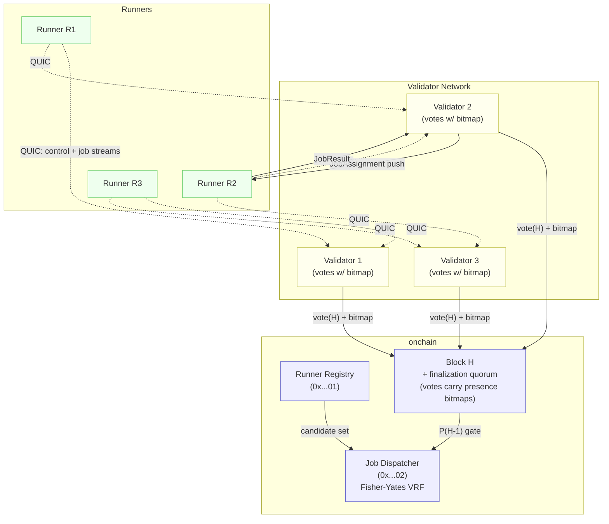

<Note>
  **Status:** Draft<br/>
  **Type:** Standards Track<br/>
  **Category:** Core<br/>
  **Created:** 2026-04-14<br/>
  **Revised:** 2026-05-11 (r1.1 — align with CIP-13 v2 `effective_stake`; block-time disclaimer)<br/>
  **Requires:** CIP-2, CIP-13 v2 (`effective_stake` is normative on the VRF / Fisher-Yates weight base used by §9)<br/>
</Note>

> **Revision history**
>
> - **r1.1 (2026-05-11)** — Two corrections after cross-CIP audit:
>   1. **§9.3 weight base anchored to CIP-13 v2 `effective_stake`.** The original v0.2 algorithm in §9.3 read `candidate[i].stake` (lines 397 / 404), while §9.3 prose (line 415) referenced "effective stake on iteration 0". CIP-13 v2 §3 (Updated 2026-04-21) makes `effective_stake = registration.stake + delegation_totals.total_active` the normative VRF / Fisher-Yates weight base. r1.1 changes the algorithm in §9.3 to `base[i] = stake_to_weight(effective_stake(candidate[i]), MIN_STAKE_CBY_WEI)` accordingly; the MRU multiplier semantics are unchanged. Internal inconsistency closed; cross-CIP alignment achieved.
>   2. **§13 block-time disclaimer.** All block-count defaults in the constants table were expressed "at 5 s blocks". Other v2 CIPs assume 1 s (CIP-14 v1) or 500 ms (CIP-23 v2). r1.1 adds an explicit disclaimer in §13 noting that the block-count defaults assume a 5 s block target; under any other block-time policy the corresponding wall-clock targets (12h subset epoch, 21min MRU TTL, 85min stale-heartbeat ceiling) take precedence over the raw block counts, and the constants MUST be rescaled by governance before activation. Tracked alongside CIP-14 / CIP-23 block-time inconsistency in `wiki/drift.md` L-5.
> - **v0.2 (2026-04-14)** — addresses canonicalization, MRU, dispatch-outcome review findings.

## 1. Abstract

This proposal replaces the current poll-based runner job retrieval mechanism (CIP-2 §3) with a **push-based delivery layer** built on persistent QUIC connections from runners to a deterministically chosen subset of validators, combined with **presence attestations carried inside validator votes**. The attestations are aggregated deterministically from the finalization quorum to produce a **canonical presence bitmap** consumed by the existing on-chain Fisher-Yates selection.

The existing on-chain runner selection (CIP-2 §4–§5) is preserved unchanged in its core algorithm. CIP-11 adds three things:

1. A **runtime connectivity layer**: each runner holds long-lived QUIC streams to a fixed-size, deterministically assigned subset of validators.
2. A **vote-piggybacked attestation**: each validator's vote on block `H` carries a bitmap describing the runners it is locally connected to at the moment of voting.
3. A **canonical presence bitmap derivable from the finalization quorum**: the bitmap for block `H` is a deterministic function of the validator votes that finalize `H`. Selection at block `H+1` filters the runner candidate set by `canonical_bitmap[H]` and applies a weight multiplier to the most-recently-successful runner per `(submitter, job_kind)`.

Because the canonical bitmap is derived from canonical block contents (the finalization quorum's votes), every validator that observes the same finalization computes the same bitmap, with no dependence on off-chain message timing.

Once a runner is selected, validators that hold an active connection to it **push** the `JobAssignment` over the existing stream rather than waiting to be polled. The runner's existing on-chain heartbeat (CIP-2 SA-14) is retained as a slow-path defense-in-depth signal but is no longer the load-bearing liveness mechanism.

Key properties:

- **No polling on the hot path.** Job dispatch latency drops from `~poll_interval` (default 5 s) to one network round trip.
- **Bounded fan-out.** Each runner holds `k` connections (default 3–8 depending on validator-set size); each validator holds `O(N_runners · k / N_validators)` connections.
- **Consensus-safe determinism.** The presence bitmap is a function of the finalization quorum's signed votes, not of any validator's local off-chain view.
- **Reuses on-chain identity.** Runner identity, stake, capabilities, and entitlements remain in the Runner Registry (`0x0000…0001`); CIP-11 adds no new on-chain registration step.
- **Reuses existing transport.** Inter-validator messages ride on the existing `commonware-p2p` vote channel; no new p2p stack is introduced.

---

## 2. Motivation

Today, the runner side of CIP-2 is implemented as follows:

1. The Job Dispatcher (`0x0000…0002`) selects M runners on-chain via stake-weighted Fisher-Yates over the registered candidate set and writes each assignment to `runner_jobs_key(addr)`.
2. Each runner separately polls `GET /runner/{addr}/jobs` over plain HTTP every `job_poll_interval_seconds` (default 5 s).
3. When the runner has a result, it POSTs to `/runner/{addr}/job_result`. The validator builds a `JobResultSubmit` transaction and forwards it to the mempool.

This works but has four concrete problems that block the system from scaling and from meeting latency budgets for interactive workloads:

1. **Polling latency is the floor on job start time.** A 5 s poll interval is already a large fraction of the desired end-to-end budget for short jobs (LLM completions, single MCP calls). Driving it lower wastes bandwidth across thousands of runners.
2. **Liveness is not actually consulted.** The Registry's `last_heartbeat` field exists but is not a hard gate on candidate selection. Selection happily assigns jobs to runners whose process died ten minutes ago, which then time out and re-select. The user-visible effect is a multi-block latency spike on every silent runner failure.
3. **Heartbeats are expensive.** With ~1000 runners each posting a `POST /heartbeat` transaction every few blocks, the chain pays for liveness signal bandwidth that an attestation layer could carry off-chain at near-zero cost.
4. **There is no path to runner stickiness.** "Most-recently-successful runner for actor A" is a natural cache locality optimization (CBFS volume warm caches, MCP server connection reuse, model warm starts) but cannot be expressed cleanly when delivery is pull-based and dispatcher state has no MRU index.

CIP-11 addresses (1)–(4) without replacing the on-chain selection function, the staking model, or the result verification flow.

---

## 3. Definitions

- **Connectivity Subset** (`Sub(R)`): The deterministic, fixed-size set of validators that runner `R` is required to maintain QUIC connections to. Computed from the current validator set (§5).
- **Vote Presence Bitmap**: A bitmap embedded in a validator's vote on block `H`, indexed by Runner Registry order, indicating which runners that validator currently has a healthy control stream to.
- **Canonical Presence Bitmap** (`P(H)`): A deterministic bitmap derived from the vote presence bitmaps of the finalization quorum for block `H`. Indexed by Runner Registry order. Bit `i` is set iff at least `presence_threshold` of the finalizing votes have bit `i` set.
- **Push Dispatch**: The act of a validator opening a new QUIC stream to a runner and writing a `JobAssignment` frame, replacing the runner's `GET /runner/{addr}/jobs` poll.
- **MRU Weight Multiplier**: A deterministic weight adjustment applied to the most-recently-successful runner for a given `(submitter, job_kind)` pair during the first Fisher-Yates draw (§9.3).
- **Subset Slot**: An integer in `[0, k)` identifying the runner's position in the deterministic ordering relative to a single validator. Used to load-balance reconnects.
- **Dispatch Outcome**: One of `Success`, `Duplicate`, `SoftFailure`, or `HardFailure` — a validator's classification of a single push dispatch attempt (§10.6).

---

## 4. Design Overview

### 4.1 Architecture



### 4.2 Lifecycle

1. **Bootstrap.** Runner reads the current validator set and computes its connectivity subset `Sub(R)` (§5). It opens a long-lived QUIC connection to each validator in `Sub(R)`.
2. **Handshake.** On each connection, runner and validator complete a pubkey-bound handshake (§6.2). Validator verifies the runner is registered, has sufficient stake, and is correctly assigned to it via `Sub(R)`.
3. **Heartbeat.** On the control stream, the runner emits a `HeartbeatPing` once per block. The validator records the runner as locally present.
4. **Vote with attestation.** When a validator votes on block `H`, its vote payload includes a `vote_presence_bitmap` summarizing which runners it currently has healthy control streams to (§7).
5. **Finalization derives canonical bitmap.** Once `H` is finalized by a 2f+1 quorum of votes, every validator computes `P(H)` deterministically from the finalizing votes (§8). No off-chain message timing is consulted.
6. **Selection.** When a job is submitted at block `H+1`, the Job Dispatcher runs the existing Fisher-Yates VRF selection over the candidate set, additionally gated by `P(H)` and with the first draw weight-multiplied for the MRU runner (§9).
7. **Push dispatch.** Validators that hold an active connection to an assigned runner open a job stream and send `JobAssignment`. The runner deduplicates by `job_id`.
8. **Result.** The runner streams the result back on the same job stream and signs it. The first validator to receive a valid result builds the `JobResultSubmit` transaction (existing CIP-2 path).
9. **MRU update.** When the Result Verifier records a successful `JobResult`, it updates `mru_key(submitter, job_kind)` in the Job Dispatcher actor (§9.4).
10. **Re-selection.** If no validator reports successful delivery within `dispatch_timeout_blocks`, the Dispatcher applies the existing CIP-2 §6 timeout-based re-selection.

### 4.3 Relationship to Existing CIPs

- **CIP-2 (Off-Chain Compute).** CIP-11 strictly extends CIP-2. The candidate list (§4), Fisher-Yates VRF selection (§5), commit-reveal verification, and timeout-based re-selection (§6) are all preserved. Push dispatch over QUIC replaces polling on the delivery hot path; the polling endpoint `GET /runner/{addr}/jobs` is retained as a delivery-only fallback during and after migration (§14). The `last_heartbeat` field on `RunnerRegistration` is retained as a slow-path signal but is no longer load-bearing.
- **CIP-9 (Runner Storage).** Push delivery reduces the cold-start window before a runner can begin reading from CBFS volumes. MRU bias (§9.3) directly improves CBFS read-cache hit rates by routing jobs for the same actor to the same runner where possible.
- **CIP-10 (Runner Containers).** Lower job-start latency reduces idle container cost. CIP-10 base images SHOULD ship with the CIP-11 client transport.
- **CIP-13 (Runner Delegation).** Delegated stake is opaque to CIP-11; a runner's identity for connectivity purposes is still its registered address.

---

## 5. Connectivity Subset Assignment

Each runner connects to a deterministic subset of the current validator set rather than every validator. This bounds connection fan-out without sacrificing redundancy.

### 5.1 Subset Function

Let `V_t = [v_1, ..., v_n]` be the active validator set at epoch `t`, ordered by validator address. Let `R.pubkey` be the runner's secp256k1 public key.

The connectivity subset for runner `R` at epoch `t` is:

```
Sub(R, t) = first k validators in
            sort_by(v ∈ V_t, key = keccak256(R.pubkey ‖ v.pubkey))
```

The subset size `k` is given by:

```
k = clamp(ceil(log2(|V_t|)) + 1, MIN_SUBSET, MAX_SUBSET)
```

with default constants `MIN_SUBSET = 3`, `MAX_SUBSET = 8`. For the early-network case `|V_t| ∈ [5, 10]`, `k = 4`. For `|V_t| = 100`, `k = 8`.

### 5.2 Properties

- **Stable under runner churn.** A new runner's subset is independent of existing runners' subsets. Adding or removing a runner does not change any other runner's subset.
- **Stable-ish under validator churn.** When a single validator joins or leaves, the expected fraction of runners whose subset changes is bounded by `O(k / |V_t|)`. Runners affected by a validator leaving simply open a connection to the next validator in the sorted list.
- **Load-balanced in expectation.** Each validator handles `|R| · k / |V_t|` runner connections in expectation, with concentration of `O(sqrt(|R|))` by Chernoff bounds.
- **Validator-side DoS gate.** A validator MUST reject connections from a runner not in the runner's expected `Sub(R, t)` for the validator's own identity. This bounds Sybil connection storms to `k` connections per registered runner identity, which costs a full Runner Registry registration plus `MIN_STAKE_CBY_WEI`.

### 5.3 Subset Rotation

The connectivity subset is recomputed once per **subset epoch**, defined as a fixed number of blocks `SUBSET_EPOCH_BLOCKS` (default 8192, ~12h at 5 s blocks) or whenever the validator set changes by more than `VALIDATOR_CHURN_THRESHOLD` (default 10%) since the last rotation, whichever comes first. Rotation events are signaled in-block via a `subset_epoch` counter.

When `subset_epoch` advances, runners SHOULD overlap connections — keep the previous-epoch subset open for `OVERLAP_BLOCKS` (default 32) before tearing them down — to avoid a step function in presence bitmap coverage at the rotation boundary.

---

## 6. The QUIC Connection Layer

### 6.1 Transport

Connections use **QUIC** (RFC 9000) with TLS 1.3. The reference implementation MAY use `quinn` or any other compliant QUIC stack. Each runner-validator connection carries:

- One **control stream** (bidirectional, stream id 0) for the lifetime of the connection.
- Zero or more **job streams** (validator-initiated, bidirectional), one per active job assignment.

QUIC's connection migration handles temporary network changes (mobile uplinks, runner relocation) without requiring re-handshake.

### 6.2 Handshake and Authentication

The TLS handshake uses self-signed certificates whose subject public key matches the participant's on-chain identity. After the TLS handshake completes, both sides exchange a `Hello` frame on the control stream:

```
Hello {
  version:           u16,                  // CIP-11 wire version
  party_pubkey:      [u8; 33],             // secp256k1 compressed
  party_role:        Role,                 // Runner | Validator
  block_height:      u64,                  // sender's view of head
  challenge_nonce:   [u8; 32],             // recipient must echo+sign
}

HelloAck {
  version:           u16,
  party_pubkey:      [u8; 33],
  party_role:        Role,
  signed_challenge:  [u8; 65],             // ecdsa over peer's challenge_nonce
  block_height:      u64,
}
```

The runner's `party_pubkey` MUST resolve to a `RunnerRegistration` in the on-chain Runner Registry with `health != Deregistered`. The validator MUST verify that its own identity is in `Sub(runner.pubkey, current_subset_epoch)`. Any mismatch is a fatal error and the connection is closed.

The validator MUST rate-limit `Hello` attempts per peer IP to prevent connection-storm DoS.

### 6.3 Heartbeats

Once connected, the runner sends a `HeartbeatPing` on the control stream every `HEARTBEAT_BLOCKS` (default 1) once it observes a new block height. The validator responds with `HeartbeatPong` carrying its own current head:

```
HeartbeatPing {
  block_height:      u64,                  // runner's view
  nonce:             u64,                  // monotonically increasing
  signed:            [u8; 65],             // ecdsa over (block_height ‖ nonce)
}

HeartbeatPong {
  block_height:      u64,                  // validator's view
  validator_signed:  [u8; 65],             // ecdsa over (block_height ‖ runner_pubkey)
}
```

Validators record `presence[runner] = (block_height, signed_payload)` on each successful Ping. A runner that fails to send a `HeartbeatPing` for `PRESENCE_TIMEOUT_BLOCKS` (default 3) is dropped from the validator's local presence set.

The Ping nonce MUST be strictly monotonic per runner per connection; a non-monotonic nonce is treated as a connection error. This preserves the anti-replay property of the existing on-chain heartbeat mechanism (CIP-2 SA-14).

### 6.4 Backpressure

The runner reports load on the control stream:

```
BackpressureSignal {
  active_jobs:        u32,
  max_concurrent:     u32,                 // from RunnerCapabilities
  accepting_new:      bool,                // false ⇒ omit me from next vote bitmap
  reason:             Option<String>,      // human-readable, e.g. "gpu_oom"
}
```

When `accepting_new = false`, validators MUST clear the corresponding bit in their next outgoing vote presence bitmap. This is the clean "shed load" path: the runner remains connected and authenticated, but is invisible to selection until it re-asserts capacity.

### 6.5 Capability and Entitlement Updates

Capability changes (e.g., a model alias becoming unavailable, an egress region brought offline) are pushed on the control stream:

```
CapabilityDelta {
  block_height:       u64,
  added_capabilities: Vec<Capability>,
  removed_capabilities: Vec<Capability>,
  added_entitlements: Vec<EntitlementId>,
  removed_entitlements: Vec<EntitlementId>,
  signed:             [u8; 65],
}
```

`CapabilityDelta` is **advisory and runtime-only**. It does not amend the on-chain `RunnerRegistration`. Validators MAY apply the delta locally so that they refrain from setting the runner's bit when the runner cannot serve a job pending in their mempool; permanent capability changes still require an on-chain registry update.

---

## 7. Vote-Piggybacked Presence Attestations

CIP-11 does not introduce a separate gossip channel for runner presence. Each validator's vote on block `H` carries a presence bitmap describing its locally observed connectivity at the time of voting. This makes the presence evidence a canonical part of finalization: anyone who can verify that `H` is finalized can derive `P(H)` from the same data.

### 7.1 Vote Payload Extension

The validator vote message defined by the consensus framework is extended with one new field:

```
vote_presence_bitmap: BitVec               // length = |RunnerRegistry as of block H|
```

The vote signature MUST cover this field; otherwise the bitmap is forgeable. The encoding is little-endian byte-packed with an explicit bit length prefix.

### 7.2 Bitmap Construction (Per Validator)

When a validator is preparing its vote on block `H`, it sets bit `i` in `vote_presence_bitmap` iff **all** of the following hold at the time the vote is composed:

1. Runner `i` has an authenticated, open QUIC control stream to this validator.
2. The validator has received a valid `HeartbeatPing` from runner `i` within the last `PRESENCE_TIMEOUT_BLOCKS` blocks.
3. The runner has not most recently signaled `BackpressureSignal { accepting_new: false }`.
4. The validator's identity is in `Sub(runner_i.pubkey, current_subset_epoch)`.

A validator MUST emit exactly one vote per block; suppression of "unchanged" bitmaps is **not** permitted (this resolves the v0.1 conflict where missing attestations were ambiguous). If a validator does not vote on block `H` for any reason, that validator's attestation simply does not contribute to `P(H)`.

### 7.3 Optional Observability Channel (Non-Normative)

Implementations MAY operate a separate, advisory gossip channel that broadcasts current presence between blocks for monitoring and dashboarding. Such a channel MUST NOT be consulted for any consensus-relevant decision and is out of scope for this CIP.

---

## 8. Canonical Presence Bitmap

The canonical bitmap for block `H` is a deterministic function of the votes that finalize `H`. Validation of the bitmap therefore depends only on canonical block contents, not on any validator's local off-chain view.

### 8.1 Derivation

Let `Votes(H)` denote the set of validator votes included in the finalization quorum for block `H`. Let `b_v[i]` be the i-th bit of validator `v`'s `vote_presence_bitmap` (or `0` if the bit index is out of range for that vote, e.g., due to a registry mutation since the validator composed its vote — see §8.4).

```
present_count[i] = | { v ∈ Votes(H) : b_v[i] = 1 } |

P(H)[i]          = 1  iff  present_count[i] ≥ presence_threshold(|Votes(H)|)
                   0  otherwise
```

Every validator that observes the same finalization computes the same `P(H)`. There is no tolerance check, no "proposer-claimed bitmap," and no reference to local gossip state.

### 8.2 Threshold

```
presence_threshold(n) = floor((n - 1) / 3) + 1            // == f + 1, where n = 3f + 1
```

This is the **f+1 threshold**, chosen for two properties:

1. **Fabrication resistance.** A Byzantine fault budget of `f` adversarial validators cannot reach `f+1` attestations on their own. To set a bit in `P(H)`, at least one honest validator must have a real, authenticated control stream to that runner. A bit set in `P(H)` therefore implies the runner is reachable from the validator set.
2. **Suppression resistance.** With `n = 3f+1` minimum finalization quorum, at most `f` honest validators may legitimately attest "not present" for any given runner that has been actually online. Even if every adversarial validator also attests "not present," there are still `f+1` honest "present" votes — sufficient to set the bit. A proposer cannot suppress a present runner without the cooperation of `f+1` actual offline-observation events.

The 95% tolerance and one-sided "no fabrication" rule from v0.1 are both removed. They permitted up to 5% silent suppression by the proposer; the f+1 threshold above closes that gap.

### 8.3 Storage Cost

| `|RunnerRegistry|` | Per-vote bitmap | Per-block votes (n=10) | Per-block votes (n=100) |
|---|:---:|:---:|:---:|
| 100 | 13 B | 130 B | 1.3 KB |
| 1,000 | 125 B | 1.25 KB | 12.5 KB |
| 10,000 | 1.25 KB | 12.5 KB | 125 KB |

At expected steady-state scale (~1,000–10,000 runners, ~10–100 validators), the per-block evidence cost is bounded by a small constant relative to existing block-vote sizes. Bitmap RLE compression MAY be applied if useful (typical bitmaps are dense).

The canonical bitmap `P(H)` itself is **not** stored as a separate field on the block — it is recomputed from votes on demand. Implementations MAY cache it.

### 8.4 Indexing Across Registry Mutations

Vote presence bitmaps are indexed by Runner Registry order **as of the parent of the block being voted on**. When a validator votes on block `H`, the bitmap length matches `|RunnerRegistry|` at block `H-1`. Registry mutations applied in block `H` (registrations, deregistrations) shift the index space for votes on block `H+1`.

If a vote's bitmap length does not match `|RunnerRegistry|` at the parent of `H`, the bitmap is treated as if all bits beyond the agreed length are 0, but the vote is otherwise accepted. This tolerates a validator that observed the registry slightly differently due to txpool ordering on the same block, without rejecting its consensus signature.

---

## 9. Updated Selection Algorithm

CIP-11 modifies two steps of the existing dispatcher (`node/execution/src/runner/dispatcher.rs`):

- The candidate filter list (CIP-2 §4 / `select_runner_committee_with_seed` filter chain): one new filter is inserted.
- The first weighted Fisher-Yates draw (CIP-2 §5): the MRU runner's stake weight is multiplied by `MRU_WEIGHT_MULTIPLIER`.

### 9.1 Candidate Filter Diff

Insert one new filter between the existing health filter (Filter 1) and the reputation filter (Filter 2):

```
Existing dispatcher filters (unchanged numbering):
  0. Exclusion list (re-selection)
  1. Health:                  HealthStatus::Healthy
  1.5. Presence (NEW):        P(H-1)[runner_idx] = 1
  2. Reputation:              reputation ≥ 50
  3. Capability:              supports JobType
  4. TEE:                     tee_required ⇒ tee_support.is_some()
  5. Price:                   compute_second ≤ max_price
  6. Concurrency:             active_jobs < max_concurrent_jobs
  7. Entitlement:             holds required_runner_pool
  8. Stake sufficiency:       stake ≥ 1.5 × max_price
```

`P(H-1)` is the canonical presence bitmap from the parent block (§8). The Presence filter is the load-bearing liveness gate.

The Health filter remains for defense in depth: a runner whose on-chain `last_heartbeat` is more than `STALE_HEARTBEAT_BLOCKS` (default 1024, ~85 min at 5 s blocks) old is excluded even if its presence bit is set, on the assumption that something pathological is going on (e.g., a runner that QUIC-connected but then somehow stopped submitting on-chain heartbeats over a very long window).

`runner_idx` is the runner's index in the Runner Registry as of the parent block — the same indexing rule used by `P(H-1)`.

### 9.2 Selection Algorithm (Unchanged)

The stake-weighted Fisher-Yates VRF selection (`select_runner_committee_with_seed`) is preserved. CIP-11 makes exactly one targeted change to the per-iteration weight calculation; see §9.3.

The VRF seed function is preserved bit-for-bit:

```
seed = keccak256(block_hash_proxy ‖ "cowboy-runner-select-v2:" ‖ job_id ‖ submitted_at_le8)
```

The committee size `M = job_spec.verification.runners` is preserved.

### 9.3 MRU Weight Multiplier

The base weight per candidate uses CIP-13 v2 §3's `effective_stake` (not raw `registration.stake`). Per CIP-13 v2:

```
effective_stake(c) = c.registration.stake + c.delegation_totals.total_active
```

`stake_to_weight(...)` is then applied per the CIP-2 §5 formula (`floor(log2(effective_stake / MIN_STAKE + 1)) + 1`). The base vector is computed once before the Fisher-Yates loop, then per-iteration index is drawn with probability proportional to the weights for that iteration.

CIP-11 modifies the weight vector for **iteration 0 only**:

```
mru = lookup_mru(submitter, job_kind, current_block_height)        // §9.4
for i in candidates:
    base[i] = stake_to_weight(effective_stake(candidates[i]), MIN_STAKE_CBY_WEI)   // CIP-13 v2 §3
    if Some((addr, set_at)) = mru
       and candidates[i].address == addr
       and (current_block_height - set_at) ≤ MRU_TTL_BLOCKS:
        weights_iter0[i] = base[i].saturating_mul(MRU_WEIGHT_MULTIPLIER)
    else:
        weights_iter0[i] = base[i]
```

For iteration 1 and later, `weights = base` (unchanged). This preserves committee diversity: the MRU runner is favored to be picked first, but subsequent committee slots are drawn at the unbiased stake-weighted distribution.

Defaults: `MRU_TTL_BLOCKS = 256` (~21 min at 5 s blocks; see §13 block-time disclaimer), `MRU_WEIGHT_MULTIPLIER = 4` (~four times the runner's effective stake on iteration 0). Both governance-adjustable.

If the MRU runner is not in the candidate set (e.g., because the presence filter cleared its bit, or because it's at concurrency limit), no bias is applied — the standard fallback behavior takes over without any special-casing.

### 9.4 New Dispatcher State: `mru_key`

The Job Dispatcher actor (`0x0000…0002`) gains one new key family in its existing `storage` map:

```
mru_key(submitter: Address, job_kind: u8) → MruRecord {
  runner_address: Address,
  set_at_block:   u64,
}
```

`job_kind` is the discriminant byte of the `JobType` enum: `0x01` for `Llm`, `0x02` for `Http`, `0x03` for `Mcp`, `0x04` for `EthSend`, `0x05` for `Custom`.

**Write path (Result Verifier).** When the Result Verifier (`0x0000…0003`) finalizes a verified result for a job from `submitter` of kind `k` whose winning runner is `r`, it writes `mru_key(submitter, k) := MruRecord { runner_address: r, set_at_block: current_block_height }`.

**Read path (Job Dispatcher).** When `select_runner_committee_with_seed` is preparing weights for iteration 0 (§9.3), it reads `mru_key(submitter, k)`. A read returning `None`, or a record where `current_block_height - set_at_block > MRU_TTL_BLOCKS`, results in no bias being applied.

**Storage cost.** One 28-byte record per active `(submitter, job_kind)` pair. Records SHOULD be expired and reclaimed lazily on next read past `MRU_TTL_BLOCKS`.

### 9.5 MRU Scope (Open for Future Refinement)

Default scope is `(submitter_address, job_kind_discriminant)`. This is admittedly coarse: for cache locality on LLM jobs, the relevant key is more like `(submitter, model_id)`; for MCP jobs, `(submitter, server_url, tool_name)`; for jobs touching CIP-9 volumes, `(submitter, primary_volume_id)`. A future CIP-11 revision MAY introduce an extensible `mru_scope` field on `JobSpec` that lets the submitter choose the scope; v1 ships with the coarse default for simplicity.

---

## 10. Push Job Delivery

### 10.1 Dispatch

When the Job Dispatcher records an assignment for runner `R` at block `H`, every validator with an active connection to `R` SHALL open a new bidirectional QUIC stream and send:

```
JobAssignment {
  job_id:           [u8; 32],
  job_spec:         JobSpec,                    // canonical encoding from CIP-2
  block_height:     u64,                        // H
  deadline_block:   u64,                        // H + timeout_blocks
  validator_signed: [u8; 65],                   // ecdsa over (job_id ‖ deadline)
}
```

Up to `k` validators may send the same `JobAssignment` for the same `job_id`. The runner MUST deduplicate by `job_id`.

### 10.2 Runner Acknowledgment

The runner replies on the same stream:

```
JobAck {
  job_id:           [u8; 32],
  status:           AckStatus,                  // see below
  reason:           Option<String>,
  signed:           [u8; 65],
}

enum AckStatus {
  Accepted,                // first delivery for this job_id, runner is executing
  Duplicate,               // job_id already in flight from another validator (NORMAL)
  Reject(RejectReason),    // runner cannot serve, e.g. capacity, missing entitlement
}
```

`Duplicate` is the **expected** ack in the `k-1` cases where another validator's dispatch for the same `job_id` arrived first. It is not a failure — neither this validator nor the runner did anything wrong.

`Reject` indicates the runner is alive on the wire but cannot accept this specific job. The job is left to other dispatching validators or to the timeout-based re-selection path. The runner remains present.

### 10.3 Result

The runner streams the result back on the same job stream when execution completes:

```
JobResult {
  job_id:           [u8; 32],
  result_data:      Vec<u8>,                    // CIP-2 commit-reveal payload
  runner_signed:    [u8; 65],
}
```

Only the validator whose dispatch was `Accepted` receives `JobResult` (the runner has no reason to fan out the result; it has the dispatching validator's identity from the stream). That validator validates the runner signature and constructs the existing `JobResultSubmit` transaction (CIP-2 §3) using the same payload. From the chain's perspective, nothing about result settlement changes — the only difference is that the result arrived over a persistent stream rather than a `POST /job_result` HTTP request.

### 10.4 Streaming Progress (Optional)

Long-running jobs MAY stream progress on the job stream:

```
JobProgress {
  job_id:           [u8; 32],
  fraction:         u8,                         // 0–100
  detail:           Option<String>,
}
```

Validators MAY surface progress to subscribed RPC clients. `JobProgress` is informational and does not affect on-chain state.

### 10.5 Cancellation

If the on-chain dispatcher records that the job is no longer assigned to `R` (e.g., timeout-based re-selection has advanced to a different runner), validators with an open job stream to `R` for that `job_id` SHALL send:

```
JobCancel {
  job_id:           [u8; 32],
  reason:           CancelReason,               // Reassigned | Expired | Failed
  validator_signed: [u8; 65],
}
```

On receipt, the runner stops work on the job. Results submitted after `JobCancel` are dropped at the validator (or rejected by the mempool if a different runner has already submitted a verified result).

### 10.6 Dispatch Outcome Classification

A validator classifies each push dispatch attempt for a given `job_id` as one of the following **dispatch outcomes**, recorded locally:

| Outcome | Trigger | Effect on local presence |
|---|---|---|
| `Success` | Received `JobAck { Accepted }` followed eventually by `JobResult` | Presence unchanged (positive) |
| `Duplicate` | Received `JobAck { Duplicate }` | Presence unchanged — runner is alive |
| `SoftFailure` | Received `JobAck { Reject(_) }` or any other framed response | Presence unchanged — runner is alive |
| `HardFailure` | No framed response within `ACK_TIMEOUT_BLOCKS` after `JobAssignment` | Presence cleared |

**Presence floor:** If a valid `HeartbeatPing` is received from runner `R` after a `HardFailure` was recorded for some job, the presence bit is restored. Heartbeat liveness always trumps a single dispatch failure.

This resolves the v0.1 ambiguity in which `Duplicate` was treated as a failure that cleared presence — under that rule, normal multi-validator dispatch would have routinely poisoned presence.

---

## 11. Failure Handling and Re-selection

### 11.1 Per-Dispatch Timeout

A validator that has sent `JobAssignment` and recorded `HardFailure` per §10.6 MUST close the job stream and clear the runner's presence bit locally. The default `ACK_TIMEOUT_BLOCKS = 3` is chosen to be large enough to absorb one bad block + one heartbeat round trip without false-positiving on a transiently busy runner.

`Duplicate` and `SoftFailure` outcomes do not affect presence (§10.6).

### 11.2 Per-Job Timeout

If no validator has produced a `JobResultSubmit` by `min(deadline_block, H + JOB_TIMEOUT_BLOCKS)`, the on-chain Job Dispatcher applies the existing CIP-2 §6 timeout-based re-selection: the next runner committee is drawn at the next block, excluding the timed-out runner(s).

The timeout is **block-height-tied**, not wall-clock-tied, so all validators advance to the fallback runner in lockstep without coordination.

### 11.3 Connection Loss

A QUIC connection that fails (closed by either side, transport timeout, certificate validation failure on resumption) triggers:

- The validator clears the runner from its local presence set immediately.
- The runner attempts to reconnect with exponential backoff (`100 ms × 2^n`, capped at 30 s, jittered ±25%).
- If the runner has not reconnected by the next vote, the validator's vote bitmap will not include the runner; downstream this may push `present_count` below `presence_threshold` and clear `P(H)[runner_idx]`.

### 11.4 Validator Set Changes Mid-Job

If the validator set changes between job submission at block `H` and result settlement, the runner's connectivity subset is recomputed at the next subset epoch boundary (§5.3). In-flight jobs continue to drain on existing connections; new jobs are delivered over the new subset. The overlap window (§5.3) ensures no gap.

### 11.5 Reputation and Slashing

CIP-11 introduces no new slashing conditions. Existing CIP-2 reputation decay applies to repeated job-assignment timeouts; under CIP-11 those timeouts are now substantially less likely to be caused by polling-interval delay and substantially more likely to reflect actual runner unavailability, so the existing decay parameters MAY be tuned more aggressively in a follow-up.

---

## 12. Wire Format

### 12.1 Frame Encoding

All runner↔validator frames use length-prefixed canonical encoding:

```
Frame {
  length:    u32 (big-endian),     // bytes following
  type:      u8,                   // see frame type table
  payload:   bytes,                // serde-cbor encoded
}
```

CBOR is chosen to match existing `commonware-p2p` framing conventions.

### 12.2 Frame Type Table

| Type | Frame | Direction |
|:----:|---|---|
| `0x01` | `Hello` | Both |
| `0x02` | `HelloAck` | Both |
| `0x10` | `HeartbeatPing` | R → V |
| `0x11` | `HeartbeatPong` | V → R |
| `0x12` | `BackpressureSignal` | R → V |
| `0x13` | `CapabilityDelta` | R → V |
| `0x20` | `JobAssignment` | V → R (new stream) |
| `0x21` | `JobAck` | R → V |
| `0x22` | `JobProgress` | R → V |
| `0x23` | `JobResult` | R → V |
| `0x24` | `JobCancel` | V → R |
| `0xF0` | `Goodbye` | Both |

### 12.3 Vote Payload Extension (Inter-Validator)

The validator vote message is extended with one new field, `vote_presence_bitmap`, encoded as:

```
VotePresenceBitmap {
  bit_length:        u32,                       // == |RunnerRegistry at parent block|
  bytes:             Vec<u8>,                   // ceil(bit_length / 8) bytes, little-endian
}
```

The vote signature MUST cover this field. No separate gossip kind is registered; the bitmap rides on the existing vote channel.

### 12.4 Versioning

`Hello.version = 1` for this CIP. Future CIPs that change the wire format MUST bump the major version. Validators MUST close connections from runners advertising an unsupported major version with `Goodbye { reason: "unsupported_version" }`.

---

## 13. System Constants

| Constant | Default | Notes |
|---|:---:|---|
| `MIN_SUBSET` | 3 | Floor on `k` |
| `MAX_SUBSET` | 8 | Ceiling on `k` |
| `SUBSET_EPOCH_BLOCKS` | 8192 | ~12h at 5 s blocks |
| `VALIDATOR_CHURN_THRESHOLD` | 10% | Triggers off-cycle subset rotation |
| `OVERLAP_BLOCKS` | 32 | Old subset retained after rotation |
| `HEARTBEAT_BLOCKS` | 1 | One ping per block |
| `PRESENCE_TIMEOUT_BLOCKS` | 3 | Drop runner from local presence after |
| `presence_threshold(n)` | `floor((n-1)/3) + 1` | f+1 of finalization quorum (§8.2) |
| `STALE_HEARTBEAT_BLOCKS` | 1024 | On-chain heartbeat staleness ceiling (defense in depth) |
| `MRU_TTL_BLOCKS` | 256 | MRU bias decay |
| `MRU_WEIGHT_MULTIPLIER` | 4 | First-iteration stake weight multiplier (§9.3) |
| `ACK_TIMEOUT_BLOCKS` | 3 | HardFailure threshold (§10.6) |
| `JOB_TIMEOUT_BLOCKS` | (CIP-2) | Use existing per-JobSpec value |

All constants SHOULD be governance-adjustable (CIP-12).

> **Block-time disclaimer (r1.1).** All block-count defaults above are calibrated for a **5 s block target**. Other v2 CIPs assume different block times — CIP-14 v1 (1 s) and CIP-23 v2 (500 ms). The wall-clock targets in the rightmost column (~12h subset epoch, ~21min MRU TTL, ~85min stale-heartbeat ceiling) are the **normative** intent; the raw block counts are derived. Under any block-time policy other than 5 s, governance MUST rescale the constants to preserve the wall-clock targets before activation. This inconsistency is tracked alongside CIP-14 v1 (1 s) and CIP-23 v2 (500 ms) in `wiki/drift.md` L-5 (block-time assumption divergence across CIPs).

---

## 14. Migration and Coexistence

CIP-11 is rolled out in three phases, each enabled by a flag in the on-chain protocol parameters actor.

### Phase 1 — Shadow

- New transport ships in validator and runner binaries.
- Runners open QUIC connections; validators include `vote_presence_bitmap` in their votes.
- The canonical bitmap `P(H)` is **computed but ignored** by the dispatcher (`presence_filter_active = false`).
- Polling endpoint `GET /runner/{addr}/jobs` remains the load-bearing dispatch path.
- Goal: validate vote-bitmap convergence and observe `P(H)` accuracy under production load without affecting selection.

### Phase 2 — Hot Path

- `presence_filter_active = true`. The presence filter (§9.1) is enforced.
- Push dispatch over QUIC is the **primary** delivery path.
- The polling endpoint `GET /runner/{addr}/jobs` is retained as a **delivery-only** fallback: a runner that has been selected via `P(H-1)` but whose QUIC stream broke between selection and dispatch can still recover the assignment via polling. **Polling does not contribute to presence.** A runner that has never established QUIC connectivity to any validator in `Sub(R)` will not appear in `P(H)` and is therefore not eligible for selection. Operators on the legacy binary will need to upgrade.
- Goal: shift the job-start latency floor from `poll_interval` to one network RTT.

### Phase 3 — Sunset

- Polling endpoint returns `410 Gone`.
- On-chain `POST /heartbeat` transactions are accepted but no longer required for liveness; `last_heartbeat` is purely informational.
- Goal: reclaim the on-chain heartbeat tx bandwidth.

Each phase transition requires a governance vote (CIP-12). Phases 1 and 2 SHOULD be at least 4 weeks apart to allow runner-operator upgrade cycles. The cleaner-but-stricter alternative — collapsing Phases 1 and 2 into one — is acceptable if Phase 1 telemetry shows uniform fleet upgrade ahead of schedule.

---

## 15. Security Considerations

### 15.1 Sybil Connection Storms

The §5.2 DoS gate (validators reject connections from runners not in the deterministic subset) bounds Sybil connection storms to `k` connections per registered runner identity, which costs a full Runner Registry registration plus `MIN_STAKE_CBY_WEI`.

### 15.2 Presence Lying and Censorship

The two natural attacks on presence are **fabrication** (an adversary tries to set a bit in `P(H)` for a runner that isn't actually online) and **suppression** (an adversary tries to clear a bit for a runner that is actually online).

Under the `f+1` threshold (§8.2) and the assumption of `n = 3f+1` validators with at most `f` Byzantine:

- **Fabrication.** To set a bit in `P(H)`, at least `f+1` votes in the finalization quorum must claim that runner is connected. Adversary controls at most `f` votes, so independent fabrication is impossible. To set a bit, at least one honest validator must have a real, authenticated control stream to the runner — which by definition means the runner is reachable from the validator set. Fabrication therefore reduces to "the runner is online with at least one honest validator," which is exactly what we want the bit to mean.
- **Suppression by adversarial proposer.** A proposer must include `≥ 2f+1` votes to finalize a block. Even if every adversarial validator votes "not present" for runner R, the remaining `f+1` honest votes determine whether R's bit is set. If `≥ f+1` honest validators legitimately observe R as present and vote that way, R's bit is set in `P(H)` — the proposer cannot exclude any of them without dropping below the finalization quorum.
- **Suppression by adversarial honest-vote omission.** A proposer could in principle include only `2f+1` votes selected to minimize "present" counts (i.e., prefer "not present" votes when they exist). For this to clear an honest runner's bit, at least `f+1` honest validators would have to have legitimately voted "not present" — meaning they did not have a control stream to R at vote time. This is an honest disagreement about presence; the runner is genuinely partially unreachable, and clearing the bit is correct behavior.

The v0.1 attack — proposer flips up to 5% of bits under a tolerance check — does not exist in v0.2 because there is no proposer-claimed bitmap; the bitmap is derived deterministically from signed votes.

### 15.3 Connection Hijack

QUIC's TLS 1.3 binding to the runner's secp256k1 pubkey prevents connection hijack without the runner's private key. Compromise of a runner's private key already implies full control under the existing CIP-2 model; CIP-11 does not weaken this.

### 15.4 MEV / Job Front-Running

The MRU weight multiplier creates a small but non-zero "stickiness" advantage on iteration 0 of Fisher-Yates. A validator that operates a runner could attempt to bias re-selection of its own runner by becoming the MRU for a chosen actor. The bias is bounded by `MRU_WEIGHT_MULTIPLIER` (default 4×) on iteration 0 only; iterations 1..M-1 are unbiased. The marginal advantage is bounded and cannot be free-chosen — the validator must first legitimately complete a job for that actor, then their runner is preferred for the immediately next job within `MRU_TTL_BLOCKS`. This is exactly the cache-locality property we want; the failure mode is not exploitation but over-concentration of work, mitigated by capping the multiplier.

### 15.5 Bitmap Index Replay

Because the bitmap is indexed by Registry order as of the parent block, a re-org necessarily re-derives the bitmap from re-orged votes. No separate mitigation is required.

### 15.6 Plaintext Wire (Removed)

The current CIP-2 polling path is plaintext HTTP. Sensitive job content (LLM prompts that may contain secrets, signed transaction payloads in `EthSend` jobs) crosses the wire in cleartext. CIP-11's QUIC + TLS 1.3 transport closes this gap.

### 15.7 Vote-Size Amplification

Adding `vote_presence_bitmap` to votes increases the per-vote bandwidth by `ceil(|RunnerRegistry|/8)` bytes. At extreme registry sizes (`> 100k` runners) this is a real bandwidth tax on consensus. A future CIP MAY replace the inline bitmap with a per-validator commitment (e.g., Merkle root of the bitmap) plus on-demand proofs, at the cost of a heavier verification protocol. v1 ships with the inline bitmap.

---

## 16. Open Questions

1. **Optional observability gossip channel.** §7.3 mentions a non-normative monitoring-only gossip layer. Is it worth specifying as part of CIP-11 (so dashboards across implementations agree), or left as an implementation detail?
2. **MRU scope refinement.** Default scope `(submitter, job_kind)` is coarse; more useful would be `(submitter, model_id)` for LLM and `(submitter, primary_volume_id)` for storage-attached jobs. Tracked for v1.1 (§9.5).
3. **Multi-region validator sets.** If validators are split across geographies, the deterministic subset may give a runner all-foreign validators. Worth considering a region-aware subset function in a follow-up CIP.
4. **Aggregate vote signatures.** With BLS or similar aggregate signatures, the vote bitmap evidence could be compressed into a single per-bit aggregate signature attesting "these `f+1` validators agree." Out of scope until BLS lands in the consensus stack.
5. **Standalone runner crate vs in-tree types crate.** Implementation will need to land canonical wire types in a single crate (proposed: `node/runner` types are canonical, `runner/crates/*` re-exports). Out of scope for the spec; tracked for the implementation PR.

---

## 17. Reference Implementation Notes

The implementation diff is concentrated in:

- `node/validator/src/main.rs` — extend the consensus vote payload with `vote_presence_bitmap`; ensure the signature covers it.
- `node/runner/src/types.rs` — add wire-frame types (`JobAssignment`, `Hello`, `HeartbeatPing`, etc.) and the `MruRecord` storage record.
- `node/execution/src/runner/dispatcher.rs` — insert the §9.1 presence filter; add `lookup_mru()` and apply the §9.3 multiplier in iteration 0 of `select_runner_committee_with_seed`.
- `node/execution/src/runner/verifier.rs` — write `mru_key(submitter, job_kind)` on verified result.
- `node/runner/src/storage_keys.rs` — add the `mru_key` family.
- `node/types/src/execution.rs` — add a derived `presence_bitmap_at(H)` accessor (computed from finalizing votes, not stored as a block field).
- `node/rpc/src/handlers/runner.rs` — gate `GET /runner/{addr}/jobs` behind a feature flag for Phase 3 sunset.
- `runner/crates/runner-node/src/node.rs` — add QUIC client, replace polling loop with `JobAssignment` consumption.
- `runner/crates/chain-client/src/client.rs` — keep `submit_result_via_rest` as fallback; add stream-based result path.

A reference QUIC client/server implementation will live in a new crate `node/runner-transport` and be consumed by both the validator and the standalone runner.
