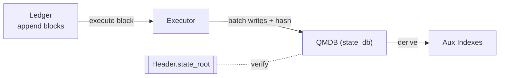

<Note>
  **Status:** Draft (Revised 2026-03-27 — rewritten for QMDB architecture)
  **Type:** Standards Track
  **Category:** Core
</Note>

## 1. Abstract
This proposal defines Cowboy's storage and state persistence mechanism, adopting a **QMDB** (flat key-value store with Blake3 hashing) architecture. The system employs:
- **Sequential ledger** for persisting consensus blocks;
- **QMDB** as the **canonical state repository**, with fixed 54-byte keys and Blake3-based Merkle commitments;
- **StateValue codec** (CBOR/binary) as the encoding format;
- **Namespaced key space** with byte-prefix routing for accounts, storage, timers, mailbox, and system state;
- **Rebuildable auxiliary indexes** to support queries and browsing;
- **Merkle proof layer** for light client state verification (C15 State Proofs).

## 2. Background and Motivation
The original CIP-4 design specified Merkle-Patricia Trie (MPT). Production implementation chose QMDB for:
- **Performance**: Flat KV with Blake3 hashing provides 10-100x throughput vs. hexary MPT for state reads/writes;
- **Simplicity**: Fixed 54-byte keys (1-byte prefix + 21-byte address/hash + 32-byte zero-pad) avoid tree rebalancing;
- **Proof capability**: QMDB native Merkle proofs + Binary Merkle Tree (BMT) for TX/receipt roots provide equivalent light client verification;
- **Production-proven**: Running on devnet with full E2E proof verification.

## 3. Overall Design
Data is organized into three layers:
1) **Ledger**: Append-only block segment files;
2) **QMDB (canonical state)**: Three flat KV databases (`state_db`, `tx_index`, `tx_receipts`) with Blake3 Merkle commitments;
3) **Aux (rebuildable indexes)**: Read-optimized tables (TxHash→location, BlockHash→height, event indexes), not included in state root.

### 3.1 Three-Layer Relationships and Data Flow
These three layers are not parallel repositories but a **top-down rebuildable, verifiable pipeline**:

**Ledger (sequential source of truth) → Execution → QMDB (canonical state roots) → Derivation → Aux (read-optimized indexes)**.

- **Write and Commit Path** (when a block is accepted):
  1) **Consensus produces block → Write to Ledger**: Append block header, transactions/messages; block header contains `state_root`, `tx_root`, `receipt_root`.
  2) **Speculative execution replays the block → Produce write batch**: Update account/actor/storage/timer/mailbox/deferred-tx keys; compute three Merkle roots.
  3) **Root verification**: Locally computed roots must match block header roots; otherwise reject block.
  4) **Batch commit**: Cache the write batch; on finalization, apply atomically to QMDB.
  5) **Derive/refresh Aux (can be async)**: Export from Ledger + QMDB to auxiliary indexes.

- **Read Path** (how they cooperate during queries):
  - By **transaction hash**: Query `tx_index` DB for location → read Ledger for raw tx, read `tx_receipts` for receipt.
  - By **address/slot**: Read `state_db` directly; can return **QMDB Merkle proof**.
  - By **event topic**: Query Aux indexes for candidates, then verify with receipts.

- **Consistency invariants**:
  1) `state_db.root_at(N) == Ledger.block[N].state_root`;
  2) `tx_root` computed via BMT over block transactions matches header;
  3) `receipt_root` computed via BMT over block receipts matches header;
  4) After deleting Aux, can rebuild from Ledger+QMDB within bounded time.



### 3.2 Rollback and Rebuild
- **Speculative rollback**: After speculative execution, the write batch is cached but not applied. On finalization, the cached batch is applied atomically.
- **Fork reorganization**: Replay from last finalized height using Ledger as source of truth.
- **Aux-only corruption**: Rebuild from Ledger + QMDB receipts; does not affect consensus correctness.
- **QMDB corruption**: Replay Ledger from genesis or trusted snapshot to regenerate state.

## 4. Key Space and Namespaces

### 4.1 State Key Format
All state keys are **54 bytes** (fixed length):

```
[1-byte prefix] [21-byte routing key (address or hash)] [32-byte suffix (zeros or hash)]
```

### 4.2 State Prefixes

| Prefix | Name | Routing Key | Description |
|--------|------|------------|-------------|
| `0x00` | Account | `address` | Account metadata (nonce, balance) |
| `0x01` | ActorMeta | `address` | Actor metadata (code hash, storage root) |
| `0x02` | ActorCode | `address` | Actor code bytes |
| `0x03` | ActorStorage | `address` | Actor storage slots (suffix = keccak of key) |
| `0x04` | Mailbox | `address` | Actor mailbox messages |
| `0x05` | Timer | `keccak(timer_id)` | Timer data |
| `0x06` | TimerIndex | `height (8 bytes)` | Timer list per block height |
| `0x07` | PendingDeferredTx | `keccak(tx_hash)` | Pending deferred transaction data |
| `0x08` | SystemState | `keccak(key)` | System state (basefee, etc.) |
| `0x09` | ActorEvents | `address` | Actor event log list |
| `0x0A` | SeenMessageIds | `address` | Message deduplication set |
| `0x0B` | ActorTimerCount | `address` | Per-actor timer count |
| `0x0C` | DeferredActorCount | `address` | Per-actor pending deferred TX count |
| `0x0D` | DeferredTxBlock | `keccak(tx_hash)` | Creation block height for deferred TXs |

### 4.3 Value Encoding
- **StateValue** variants: `Account(Account)`, `Actor(Actor)`, `ActorCode(Vec<u8>)`, `StorageSlot(Vec<u8>)`, `Mailbox(VecDeque<Message>)`, `Timer(Timer)`, `TimerList(TimerList)`, `DeferredTx(Transaction)`, `DeferredTxList(DeferredTxList)`, `SystemBytes(Vec<u8>)`, `ActorEventList(ActorEventList)`.
- Encoding: CBOR for transactions, binary codec for internal types.
- Decode bounds enforced: `DeferredTxList` max 16,384 entries; `ActorEventList` max 1,000 entries.

## 5. QMDB State Commitments

### 5.1 State Root
QMDB computes a Merkle root over all key-value pairs in `state_db` using Blake3 hashing. This root is included in every block header as `state_root`.

### 5.2 Transaction Root
Computed via **Binary Merkle Tree (BMT)** over `keccak256` hashes of all transactions in the block:
```
tx_root = BMT(keccak256(tx_0), keccak256(tx_1), ..., keccak256(tx_n))
```

### 5.3 Receipt Root
Computed via **BMT** over RLP-encoded receipts:
```
receipt_root = BMT(keccak256(rlp(receipt_0)), ..., keccak256(rlp(receipt_n)))
```

### 5.4 Proof System
QMDB provides native Merkle inclusion proofs for any state key:

**RPC Endpoints:**
- `GET /proof/account/{address}` — account state proof
- `GET /proof/actor/{address}` — actor metadata proof
- `GET /proof/storage/{address}/{key}` — actor storage slot proof
- `GET /proof/tx/{tx_hash}` — transaction inclusion proof (BMT)
- `GET /proof/receipt/{tx_hash}` — receipt inclusion proof (BMT)
- `POST /proof/multi` — batch state proof (up to 256 keys per request)

**Independent Verifier:**
The `cowboy-proof-verifier` crate provides standalone verification (Rust + WASM), requiring only the proof data and state root — no full node needed.

## 6. Execution and Consistency

### 6.1 Block Lifecycle
1. **Fetch block**: Read block header and body from Ledger.
2. **Pre-check**: Validate signatures, nonces, gas limits.
3. **Speculative execution**: Execute all transactions in batch mode:
   - `begin_batch()` → execute transactions → `commit_batch()`
   - Produces `state_pending`, `tx_index_pending`, `tx_receipts_pending` write sets
   - Processes timers, deferred TXs (with per-actor limits and expiration)
4. **Compute roots**: Calculate `state_root`, `tx_root`, `receipt_root` from the write set.
5. **Root verification**: Roots must match block header; reject if mismatch.
6. **Cache**: Store write batch for later finalization.
7. **On finalization**: Apply cached batch to QMDB databases.

### 6.2 Atomic Commit
Three QMDB databases are committed sequentially: `state_db` → `tx_index` → `tx_receipts`. Each individual DB commit is atomic. A crash between commits is recoverable: consensus layer replays finalized blocks on restart (see §3.2).

### 6.3 Determinism Requirements
- All execution engines must write via unified `StateKey`/`StateValue` interface;
- No wall clock, no external randomness during execution;
- Identical block + identical state must produce identical roots.

### 6.4 Errors and Block Rejection
- **Root mismatch**: Block rejected.
- **Storage errors**: Logged with opaque messages to clients; detailed errors server-side only.
- **Resource exhaustion**: Degrade gracefully (pause Aux derivation), never break QMDB atomicity.

## 7. Auxiliary Indexes (Rebuildable)

### 7.1 Index Schemas
- **`tx_index`**: `tx_hash → TransactionLocation { block_hash, tx_index }`
- **`tx_receipts`**: `tx_hash → TransactionReceipt { ... }`
- **Event indexes**: Per-actor event lists (in `state_db` as `ActorEventList`)

### 7.2 Construction
After block commit, scan transactions and receipts to update auxiliary indexes. Updates can lag behind finalization without affecting consensus.

### 7.3 Rebuild
Full rebuild by replaying Ledger from genesis. Incremental rebuild from last consistent height.

## 8. Snapshots and Sync

### 8.1 Sync Modes
- **Full node sync**: Replay Ledger from genesis or trusted snapshot.
- **Fast sync**: Download QMDB state at height `H`, verify root matches block header, replay from `H`.
- **Light client**: Maintain block header chain; verify state via Merkle proofs (`/proof/*` endpoints).

### 8.2 Proof Packaging
- Batch proofs (`POST /proof/multi`) deduplicate shared proof nodes across multiple keys.
- Max 256 keys per batch request.
- Responses include proof version, chunk location, MMR leaves, and operation digests.

## 9. Performance

### 9.1 QMDB Advantages
- **O(1) reads/writes**: Flat KV with fixed-size keys avoids tree traversal;
- **Efficient hashing**: Blake3 is 3-5x faster than Keccak-256;
- **Batch operations**: Block-level batch commit with deferred merkleization;
- **Bounded cache**: Speculative cache limited to 8 entries (evicts oldest on overflow).

### 9.2 Metrics
Key metrics: `block_apply_ms`, `proof_generation_ms`, `batch_commit_ms`, `speculative_cache_size`.

## 10. Security
- **Canonical source**: Only QMDB `state_db` as authoritative state;
- **Proof integrity**: Merkle proofs verified against `state_root` in finalized block header;
- **DoS mitigation**: Decode bounds on all list types; per-actor limits on timers (1,024) and deferred TXs (64); deferred TX expiration (1,000 blocks);
- **Error opacity**: Storage errors return opaque messages to API callers; detailed errors logged server-side only.

## 11. Parameters
- `STATE_KEY_LEN = 54` (fixed key size)
- `MAX_SPECULATIVE_CACHE_ENTRIES = 8`
- `MAX_DEFERRED_TX_LIST_SIZE = 16,384`
- `MAX_ACTOR_EVENTS = 1,000`
- `MAX_TIMERS_PER_ACTOR = 1,024`
- `MAX_PENDING_DEFERRED_PER_ACTOR = 64`
- `DEFERRED_TX_MAX_AGE_BLOCKS = 1,000`
- `SNAPSHOT_INTERVAL = 1024` (recommended)

## 12. State Rent (canonical spec; migrated from WP §17.5)

> This section is the **normative source** for actor-state rent mechanics. Whitepaper §17.5 now references this section. Rationale for the move: rent is a CIP-4 concern (it governs the lifecycle of state in the QMDB store); the WP retains a one-paragraph operational summary plus the governance monitoring cadence.

### 12.1 Mechanism

Actors exceeding the grace threshold pay ongoing rent measured in CBY:

```
rent_per_rent_epoch(actor) = max(0, account_size_bytes(actor) − grace_threshold) × rent_rate
```

where:

- `account_size_bytes(actor)` = total bytes of actor code + actor storage + mailbox state at the start of the rent epoch.
- `grace_threshold` = 10,240 bytes (10 KB) — no rent below this size.
- `rent_rate` = 0.001 CBY/byte/year (governance-tunable, Tier-0 per CIP-12).
- `rent_epoch_length` = 1 day at 1-second blocks per WP §6.1 (i.e., 86,400 blocks per epoch).

Per-epoch settlement:

1. At the start of each rent epoch, `0x09` Governance computes `rent_due[actor]` for every actor with size > grace threshold.
2. The amount is debited from the actor's CBY balance.
3. If the actor's balance is insufficient, the unpaid amount accumulates as `rent_debt[actor]` (system bytes at `0x09:system:cip4:rent_debt`).
4. If `rent_debt[actor]` exceeds `eviction_threshold × rent_per_rent_epoch(actor)` (default `eviction_threshold = 10` rent epochs), the actor is **evicted** (state archived; recoverable on debt repayment per §12.3).

### 12.2 Catch-up

When an actor with `rent_debt > 0` next interacts on-chain (e.g., a transaction triggers the actor, or the owner deposits CBY), the catch-up settlement runs:

```
catch_up_fee = rent_debt[actor] × 1.10        # 10% penalty for using grace
remaining_debt = rent_debt[actor] − amount_paid_by_actor
```

If `remaining_debt` reaches zero, the eviction countdown resets. The catch-up rate (10%) is `system:cip4:rent_catchup_bps = 1000` (Tier-0 tunable).

**Rate-stamping for catch-up.** The catch-up fee uses the rent rate **at the epoch the debt was incurred** (`rent_rate_at_miss_epoch`), not the current rate. This prevents a "rate-hike catch-up trap" where a governance proposal that raises `rent_rate` would retroactively increase old debts; rate hikes apply prospectively only.

Implementation: each rent-epoch's `rent_rate` is snapshotted alongside the `rent_debt` entry so historical rates persist with the debt.

### 12.3 Eviction and Restoration

- **Eviction (after 10 rent-epochs of unpaid rent — 7 grace + 3 warning):** Actor storage and active timers are pruned. Code, address, balance, and storage root hash are **preserved**. The actor enters a "dormant" state.
- **Restoration:** anyone may repay the accumulated `rent_debt` (with `catch_up_fee` per §12.2) and provide the original storage data (verified against the recorded root hash). The actor returns to "active".

### 12.4 Storage quotas

Each actor has a base storage quota of **1 MiB**, extendable up to **8 MiB** via a storage bond. The bond is locked while the quota is in use, returned when reduced, and forfeited if the actor is evicted. Rent applies to the **full allocated quota**, not the current usage — actors that reserve quota they don't use pay rent on the reservation, deterring quota hoarding.

### 12.5 Parameters

All Tier-0 governance-tunable (CIP-12 §5.1):

| Parameter | Default | Storage key |
|---|---|---|
| `grace_threshold` | 10,240 bytes (10 KB) | `0x09:system:cip4:rent_grace_threshold` |
| `rent_rate` | 0.001 CBY/byte/year | `0x09:system:cip4:rent_rate` |
| `rent_epoch_length` | 86,400 blocks (~1 day at 1s) | `0x09:system:cip4:rent_epoch_length` |
| `eviction_threshold_epochs` | 10 | `0x09:system:cip4:eviction_threshold_epochs` |
| `rent_catchup_bps` | 1,000 (= 10%) | `0x09:system:cip4:rent_catchup_bps` |

### 12.6 CBY-denominated rent (Decision Register #4 — HOLD)

The architecture review proposed re-pegging rent to USD via a 7-day TWAP oracle. The analysis Decision Register #4 selected **HOLD on CBY-denominated** for v1 to avoid introducing a consensus-layer oracle dependency. Operational mitigation:

- **Monitoring cadence.** The Cowboy Foundation publishes monthly the implied USD value of `rent_rate × 1 MiB × 365 days`. Target band: `[$1, $10] / MiB / year` at the prevailing CBY/USD spot.
- **Tier-0 adjustment trigger.** If the implied USD rent drifts outside the target band for two consecutive monthly reviews, a Tier-0 governance proposal MUST be filed to adjust `rent_rate`.
- **No oracle dependency in v1.** A future CIP MAY introduce oracle-anchored rent; this CIP does not.

Re-evaluation triggers for re-pegging: (a) availability of a battle-tested CBY/USD oracle module (precondition for any USD-pegged consensus parameter), or (b) sustained USD-rent drift outside the band beyond what Tier-0 cadence can manage.

### 12.7 Relationship to other CIPs

- **CIP-7 retention contracts:** separate facility (off-chain blob storage with provider negotiation). State rent in §12 above applies to *on-chain QMDB* state only.
- **CIP-9 / CIP-31 CBFS:** separate facility (decentralized off-chain storage via Relay Nodes). CBFS storage fees and Relay economics live in CIP-9 §10.4 + CIP-31, not here.
- **WP §17.5:** operational summary plus the monitoring cadence above; this CIP §12 is the normative spec.
- **WP §13 parameter block:** the five Tier-0 parameters above appear in WP §13 as a one-line reference to this section.

---

## Appendix A: StateValue Variants
```
Account { nonce: u64, balance: u128 }
Actor { address, code_hash, code: Vec<u8>, balance: u128, nonce: u64, storage: BTreeMap, mailbox: VecDeque<Message> }
Timer { actor_address, height: u64, payload: Vec<u8>, timer_id: Vec<u8>, handler: String }
TimerList { timer_ids: Vec<Vec<u8>> }
DeferredTxList { hashes: Vec<Sha256Digest> }
TransactionReceipt { transaction, cycles_used, cells_used, block_height, block_hash, tx_index, status, events, ... }
ActorEventList { events: Vec<ActorEvent> }
SystemBytes(Vec<u8>)  // for basefee state, per-actor counters, etc.
```

## Appendix B: Key Prefix Quick Reference
| Prefix | Name | Example Key |
|--------|------|-------------|
| `0x00` | Account | `0x00 \|\| address \|\| zeros` |
| `0x01` | ActorMeta | `0x01 \|\| address \|\| zeros` |
| `0x02` | ActorCode | `0x02 \|\| address \|\| zeros` |
| `0x03` | ActorStorage | `0x03 \|\| address \|\| keccak(slot_key)` |
| `0x04` | Mailbox | `0x04 \|\| address \|\| zeros` |
| `0x05` | Timer | `0x05 \|\| keccak(timer_id)[0:21] \|\| zeros` |
| `0x06` | TimerIndex | `0x06 \|\| height_bytes \|\| zeros` |
| `0x07` | PendingDeferredTx | `0x07 \|\| keccak(tx_hash)[0:21] \|\| zeros` |
| `0x08` | SystemState | `0x08 \|\| keccak(key_name)[0:21] \|\| zeros` |
| `0x09` | ActorEvents | `0x09 \|\| address \|\| zeros` |
| `0x0A` | SeenMessageIds | `0x0A \|\| address \|\| zeros` |
| `0x0B` | ActorTimerCount | `0x0B \|\| address \|\| zeros` |
| `0x0C` | DeferredActorCount | `0x0C \|\| address \|\| zeros` |
| `0x0D` | DeferredTxBlock | `0x0D \|\| keccak(tx_hash)[0:21] \|\| zeros` |

## Appendix C: Proof Response Format
```json
{
  "proof_version": 1,
  "loc": <u64>,
  "chunk": "<hex>",
  "mmr_leaves": <u64>,
  "digests": ["<hex>", ...],
  "partial_chunk_digest": "<hex>",
  "ops_root": "<hex>"
}
```
Verification: reconstruct the Merkle path from `loc` through `digests` to `ops_root`, then verify `ops_root` matches the `state_root` from the block header.
