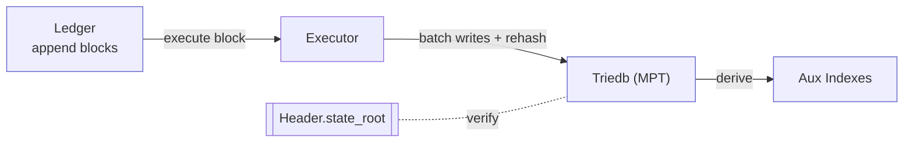
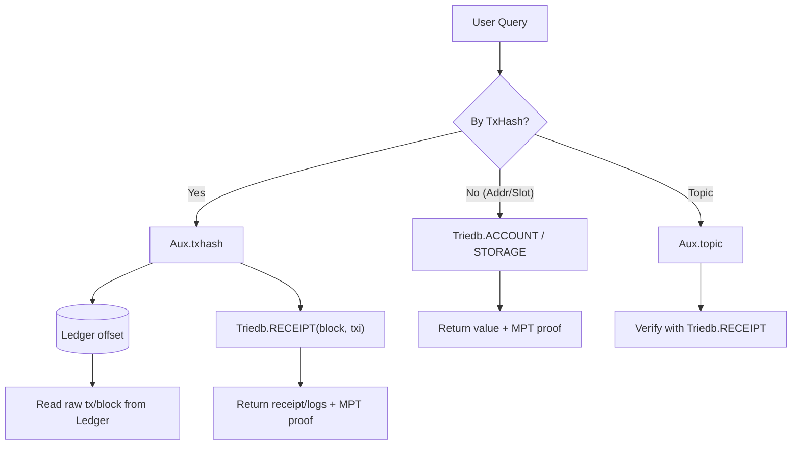

<Note>
  **Status:** Draft
  **Type:** Standards Track
  **Category:** Core
</Note>

## 1. Abstract
This proposal defines Cowboy's storage and state persistence mechanism, adopting a **Merkle-Patricia Trie (MPT)/triedb** architecture for a dual-engine execution environment supporting **PyVM and EVM**. The system employs:
- **Sequential ledger** for persisting consensus blocks;
- **Triedb (single-file/segmented KV)** as the **canonical state repository**, with **Hexary MPT** as the state commitment tree;
- **RLP** as the default encoding (with extension fields where necessary);
- **Namespaced key space** to distinguish PyVM and EVM states;
- **Cross-VM call wrapper (C-ABI)** for interface-layer adaptation, keeping the storage layer neutral;
- **Rebuildable auxiliary indexes** to support queries and browsing.

## 2. Background and Motivation
MPT/triedb has been extensively validated in the EVM ecosystem at scale, with mature node layouts, RLP encoding, and proof toolchains. Benefits of Cowboy adopting MPT:
- Reuse of EVM/Ethereum ecosystem indexers, auditing, and light client components;
- Simple and consistent model, reducing engineering complexity;
- Decoupling VM semantics through **namespace + C-ABI**, maintaining storage layer neutrality.

## 3. Overall Design
Data is organized into three layers:
1) **Ledger**: Append-only block segment files;
2) **Triedb (canonical state)**: Single-file (or segmented) KV with **MPT** as commitment root;
3) **Aux (rebuildable indexes)**: Read-optimized tables (TxHash→location, BlockHash→height, log topic→location), not included in state root.


### 3.1 Three-Layer Relationships and Data Flow
These three layers are not parallel repositories but a **top-down rebuildable, verifiable pipeline**:

**Ledger (sequential source of truth) → Execution → Triedb (canonical state root, MPT) → Derivation → Aux (read-optimized indexes)**.

- **Write and Commit Path** (when a block is accepted):
  1) **Consensus produces block → Write to Ledger**: Append block header, transactions/messages, commit info; block header contains `state_root` (backfilled/verified by execution).
  2) **Execution layer replays the block → Produce Triedb batch**: Update ACCOUNT/STORAGE/CODE/RECEIPT/BLOCKMETA keys; write to triedb in batches sorted by key, recompute MPT root.
  3) **Block-level atomic commit**: After commit, locally computed `state_root` must equal block header `state_root`, otherwise reject block/rollback.
  4) **Derive/refresh Aux (can be async)**: Export from **Ledger + Triedb** to `txhash→(block,txi,offset)`, `blockhash→height`, `topic→locations`, etc. Aux errors can be rebuilt.

- **Read Path** (how they cooperate during queries):
  - By **transaction hash**: First query **Aux.txhash** to get `(block, txi, offset)`;
    - For original transaction/block body → Use offset to read **Ledger**;
    - For authoritative receipt/logs/state → Read **Triedb** directly (`RECEIPT`/`ACCOUNT`/`STORAGE`), can return **MPT proof**.
  - By **address/slot**: Read **Triedb** directly;
  - By **event topic**: First query **Aux.topic** for candidates, then verify with **Triedb.RECEIPT** or **Ledger**.

- **Foreign key/pointer conventions**:
  - `Triedb.BLOCKMETA(block).state_root == Ledger.block[block].state_root`;
  - `Triedb.RECEIPT(block,txi)` aligns with `(block, txi)` in Ledger body;
  - `Aux.txhash[H] → (block,txi,offset)` points to Ledger segment file location; `Aux.topic`'s `(block,txi,log_i)` can be verified in Triedb/Receipts.

**Diagram A: Commit Path (Write/Commit)**


**Diagram B: Read Path (Read/Query)**


### 3.2 Rollback and Rebuild (Reorg/Recovery)
- **Fork Reorganization (Reorg)**:
  1) Use **Ledger** final branch as reference, locate common ancestor height `H`;
  2) **Triedb** rolls back to snapshot `H` (or recover via rollback log);
  3) Replay from `H+1` along new branch **to latest**, verifying `state_root` per block;
  4) **Aux** incrementally or fully rebuilds for range `[H..tip]`.

- **Aux-only corruption**:
  - Directly discard and rebuild from **Ledger + Triedb.RECEIPT**; does not affect on-chain correctness.

- **Triedb node loss/corruption**:
  - Replay **Ledger** from trusted snapshot `H` or genesis to generate same root; Aux can be rebuilt in parallel.

- **Consistency invariants (implementations should verify)**:
  1) `Triedb.root_at(N) == Ledger.block[N].state_root`;
  2) `Triedb.RECEIPT(block,txi)` ordering matches Ledger body;
  3) `Aux.txhash[h]`'s pointed `(block,txi)` can be verified in Triedb/Receipts and Ledger;
  4) After deleting Aux, can rebuild same content from **Ledger+Triedb** within bounded time;
  5) Given same Ledger segment, replaying on empty Triedb should yield same `state_root`.

## 4. Key Space and Namespaces
### 4.1 Top-Level Prefixes (Logical Tables)
- `0x0` **ACCOUNT**: Account/Actor metadata.
- `0x1` **STORAGE**: Contract/Actor storage slot key-values (interpreted per VM namespace).
- `0x2` **CODE**: Code bytes (PyVM bundle or EVM bytecode).
- `0x3` **RECEIPT**: Receipts (by block sequence number).
- `0x4` **BLOCKMETA**: Block metadata (metering/fee rate snapshots, etc.).
- `0x5` **MAILBOX**: Mailbox segments/metadata.

All above are included in **MPT canonical root**; below AUX tables are **non-canonical**.

### 4.2 VM Namespaces (vm_ns)
- `vm_ns = 0x00`: **PyVM**
- `vm_ns = 0x01`: **EVM** 

Unified storage slot key: `STORAGE : 0x1 || keccak(address) || vm_ns || slot_key32`.

### 4.3 Key Formats (RLP values)
- **ACCOUNT**  
  `key = 0x0 || keccak(address)` → `value = rlp([nonce, balance, code_hash, vm_kind, metadata])`  
  - `vm_kind ∈ {0=EOA, 1=PyVM, 2=EVM}`, `metadata`: version/permissions/capabilities.

- **STORAGE**  
  `key = 0x1 || keccak(address) || vm_ns || slot_key32` → `value = rlp(zeroless(value_bytes))`  
  - **PyVM**: `slot_key32 = keccak(utf8(path) || optional_index)` (stable mapping of dict/attr paths).
  - **EVM**: `slot_key32 = keccak(slot_index_or_key)` (32B position). 

- **CODE**  
  `key = 0x2 || code_hash` → `value = raw_code_bytes`  
  - **PyVM**: `mpy`/Py bytecode bundle (containing `manifest.rlp`: entry/dependencies/permissions/storage mode).
  - **EVM**: Deployed bytecode;  

- **RECEIPT**  
  `key = 0x3 || u64(block) || u32(tx_index)` →  
  `value = rlp([status, vm_kind, gas_used, logs_bloom, logs_root, fee_breakdown, proof_ref?])`

- **BLOCKMETA**  
  `key = 0x4 || u64(block)` →  
  `value = rlp([state_root, fee_schedule_hash, meters_compute{pyvm,evm}, meters_data, extra])`

- **MAILBOX**  
  `key = 0x5 || keccak(address) || u32(segment_idx)` →  
  `value = rlp([range_start, range_end, segment_root, sealed_flag])`

## 5. MPT Details

This section specifies the **storage contents**, **node structure**, **key paths (secure-trie)**, and **proof and multi-key proof** specifications for the **Hexary Merkle-Patricia Trie (MPT)** adopted by Cowboy.

### 5.1 What's Stored in the Trie? (Logical Table Review)

All key-value pairs included in the **canonical root** enter the same MPT, with keys formed by concatenating "logical prefix + routing key" (see §4). Main logical tables:

- **ACCOUNT (0x0)**: Account/Actor metadata (unified account model).
- **STORAGE (0x1)**: Contract/Actor storage slots; distinguished by **VM namespace `vm_ns`** for PyVM/EVM semantics.
- **CODE (0x2)**: Code bytes (PyVM mpy/bytecode bundle + manifest | EVM bytecode).
- **RECEIPT (0x3)**: Receipts (indexed by block number and transaction sequence).
- **BLOCKMETA (0x4)**: Block metadata (state_root, fee rate snapshots, metering aggregates, etc.).
- **MAILBOX (0x5)**: Mailbox segment records (segment range, segment root, seal flag).

> These key-value pairs are **collectively** committed to a single `state_root`; RPC layer can produce MPT proofs for any key.

### 5.2 Node Types and Encoding

Cowboy adopts Ethereum-style **hexadecimal Patricia**, with nodes uniformly encoded using **RLP**:

- **Branch**: 17 slots (16 child pointers + 1 value slot). `[c0..c15, value]`
- **Extension**: Path prefix compression + single child pointer. `[HP(prefix, EXT), child_ptr]`
- **Leaf**: Terminates path and carries value. `[HP(suffix, LEAF), value]`
- **HP (Hex-Prefix) encoding**: Compresses nibble path into bytes and encodes LEAF/EXT, odd/even length flags.
- **Hash**: Take **Keccak-256** of node's **RLP**; parent nodes reference children either by hash or inline RLP when node is small.

### 5.3 Path and Keys (Secure-trie)

To obtain stable paths and resist malicious distribution, triedb's **Trie path** follows secure-trie rules:

1. First assemble **database key byte string** `DB_key_bytes` (the concatenation of logical prefix and routing key from §4, e.g. `0x0||keccak(address)` / `0x1||keccak(address)||vm_ns||slot_key32`, etc.).
2. Calculate `DB_key_hash = Keccak256(DB_key_bytes)` (**single Keccak over entire DB key**).
3. Split `DB_key_hash`'s 32 bytes into 64 **nibbles** as the Trie path.

> Note: This is **not** a separate double-hash on `keccak(address)`, but a single Keccak over the **complete DB key** to obtain the path (avoiding ambiguity). EVM `eth_getProof` compatibility is provided via "EVM view" derivation described in §10.

### 5.4 Value Encoding

- Structured objects like accounts, receipts, block metadata use **RLP lists** (see §4.3 and Appendix A).
- Storage slot values use **RLP(zeroless_bytes)** (empty value = delete, avoiding ambiguity).
- Code `CODE` values are **raw bytes** (PyVM bundle or EVM bytecode).

### 5.5 Proof

**Inclusion proof**: Server returns "all node RLPs needed for the path from root to target key"; client verifies hashes hop-by-hop from `state_root` to reach target leaf/value.

**Non-inclusion proof**: Path diverges at some node (extension prefix mismatch, branch missing child pointer, leaf suffix unequal), thereby proving target key doesn't exist.

**Interface**:

- `getProof(keys[]) -> ProofBundle`:
  - `ProofBundle` is a set of **deduplicated node RLPs**, covering multiple key paths simultaneously (see next section).
- `verifyProof(root, key, bundle)`: Client verifies single key (or iterates multiple keys).

### 5.6 Multi-key Proof (Batch Proof)

When client needs **a batch of keys** (e.g. multiple storage slots, multiple accounts), server will:

- Find path for each key independently;
- **Deduplicate** node RLPs involved in these paths, forming a **minimal covering set**;
- Return this set (plus key ordering/location info), allowing client to verify each key independently.

**Advantages**:

- Compared to multiple single-key proofs, batch package is typically smaller;
- Suitable for **batch state sync, light clients, cross-node consistency verification**.

### 5.7 Failure Semantics and Robustness

- **Empty value = delete**: If leaf value is empty byte string, treat as "key doesn't exist"; if needing to represent "logical empty", should encode `0x00` or similar placeholder at protocol layer.
- **Inline nodes**: When child node RLP < 32B, parent node may **inline** that RLP; verification should hash **parent node as whole** to ensure integrity.
- **Strict hash**: Hash function is Keccak-256 (not SHA3-256).

## 6. Execution and Consistency

This section details the process from block acceptance by consensus to disk commit, atomicity guarantees, error handling, and implementation requirements.

### 6.1 Block Lifecycle (Execution Perspective)

1. **Fetch block**: Read block header and body (transactions/messages) from Ledger.
2. **Pre-check**: Static rule validation (signatures, nonces, basic fields, gas limit, size, etc.).
3. **Sequential execution**: Execute transactions in block order, producing:
   - `ACCOUNT/STORAGE/CODE` write-set
   - `RECEIPT` (containing `status, vm_kind, gas_used, logs_*`)
   - `BLOCKMETA` (this block's `meters_*` aggregates and `fee_schedule_hash`)
   - `MAILBOX` segment writes (if this block has enqueues) and possible seals
4. **Batch write to triedb**: Sort write-set by key and batch write, recompute MPT;
5. **Root verification**: Locally computed `state_root'` must exactly match block header `state_root`;
6. **Commit**: Atomic per block, commit to disk (WAL→SST);
7. **Derive Aux**: Asynchronously/delayed update of `aux.txhash / aux.blockhash / aux.topic`, etc.

### 6.2 Atomic Commit Algorithm (Recommended)

- **Single batch transaction**:
  - Collect all block changes as `batch`, use single `WriteBatch` to write to column families `ACCOUNT/STORAGE/CODE/RECEIPT/BLOCKMETA/MAILBOX`;
  - Rebuild/update MPT nodes in memory until obtaining `state_root'`;
  - If `state_root' == header.state_root`, write `batch` atomically; otherwise **reject block** and log error.
- **Failure recovery**:
  - If crash occurs before `batch` commit, replay this block after restart;
  - If occurs during Aux derivation, Aux can be discarded and rebuilt without affecting consistency.

### 6.3 EVM and PyVM Consistency Hooks

- All VM execution engines must:
  1. Only write via unified `putState(key,value)`/`delState(key)` interface;
  2. Not directly modify historical segments (sealed MAILBOX segments are read-only);
  3. Guarantee determinism within same scheduling frame (no wall clock, no external randomness).

### 6.4 Errors and Block Rejection

- **Root mismatch**: Reject directly;
- **Illegal writes** (out-of-bounds/violating read-only keys) and **illegal gas accounting** (less than actual) are executor bugs, node should halt block production and alert;
- **Resource exhaustion** (memory/disk capacity thresholds): Enter degraded mode (pause Aux derivation, defer compaction), but must not break triedb atomicity.

### 6.5 Invariants (Implementations Must Self-Check)

1. `Triedb.root_at(N) == Ledger.block[N].state_root`;
2. `RECEIPT(block,txi)` ordering matches Ledger body;
3. Sealed segments must not change once sealed;
4. `meters_*` aggregates match per-receipt sums exactly (zero tolerance).

## 7. Auxiliary Indexes (Aux, Rebuildable)

Aux is used to accelerate RPC and browsing queries, not included in state root, any corruption can be rebuilt from Ledger+Triedb. This section defines its **schema, construction, sync, and verification**.

### 7.1 Index Schemas

- **`aux.txhash`**: `tx_hash → {block, tx_index, ledger_offset}`
- **`aux.blockhash`**: `block_hash → height`
- **`aux.topic`**: `topic_hash || time_bucket → list< {block, tx_index, log_index} >`
- **(Optional) aux.code**: `code_hash → {vm_kind, size, first_seen_block}`

### 7.2 Construction and Updates

- After block commit, scan this block's `RECEIPT` and Ledger body:
  - Write `aux.txhash` for each transaction (can batch append);
  - Write `aux.blockhash` for block header;
  - Update `aux.topic` for each log by `topic[]`, using bucketing strategy like `BY_BLOCK_RANGE=4096`.
- Updates can lag; nodes can configure "derivation delay window" (e.g. 2-10 blocks) to smooth IO.

### 7.3 Rebuild Process

- **Full rebuild**: Traverse Ledger segment files and Triedb.RECEIPT, generate all Aux tables sequentially;
- **Incremental rebuild**: Advance forward from latest `aux.watermark` (last consistent height);
- **Consistency check**:
  - For random sampled `tx_hash`, verify its `(block,txi)` matches `RECEIPT`/Ledger;
  - For random sampled `topic` entries, query back `RECEIPT(block,txi)`'s `log_index`-th log to verify existence.

### 7.4 API Recommendations

- `getTxLocation(tx_hash) -> {block, txi, ledger_offset}`
- `getLogs(topic, from_block, to_block, limit) -> Events[]`
- `getCodeMeta(code_hash) -> {vm_kind, size, first_seen}`

## 8. Snapshots and Sync

This section specifies state distribution between nodes, light client verification, and bootstrap strategies.

### 8.1 Snapshot Format

- **Node forest**: A set of MPT nodes (RLP) and root `state_root(H)` at certain height `H`;
- **Manifest**: Contains:
  - Height/block hash;
  - Chunk boundaries and hashes of node list (for resumable transfer);
  - Hot key prefixes (PyVM: application namespaces, EVM: common contracts);
  - Version info (RLP/hash function/encoding version).

### 8.2 Sync Modes

- **Full node sync**: Start from genesis or latest trusted snapshot `H`, replay Ledger sequentially to latest; snapshots can serve as "starting state".
- **Fast sync**: Download snapshot at height `H` (node forest), verify root matches block header, then only replay Ledger for `H..tip` range.
- **Light client**: Only maintain block header chain and minimal state; obtain **multi-key MPT proof packages** via `getProof(keys[])` to verify reads.

### 8.3 Multi-key Proof Packaging Strategy

- **Minimal coverage**: Deduplicate nodes involved in paths for multiple keys;
- **Grouping**: Group keys by high-order prefix to improve sharing rate;
- **Limit control**: Cap max node count/byte size, split into multiple packages if exceeded;
- **Verification interface**: Client verifies key-by-key, node RLP results can be cached and reused.

### 8.4 Consistency and Security

- Snapshot root must match `state_root` in block header specified by `(height, block_hash)`;
- Proof packages must fully include all referenced child nodes (including inline cases);
- Adversarial inputs (giant values/deep paths) require resource limits and timeouts;
- Network layer can enable rate limiting and root-hash-based deduplication cache for snapshot/proof downloads.

## 9. Performance Strategies

To ensure stable block production and queries under high load, the following implementation strategies and parameters are recommended.

### 9.1 Write Path Optimization

- **Key clustering**: Sort write-set by nibble prefix after execution, reducing node splits and redundant hashing;
- **Batch writes**: Block-level single batch commit (LSM/column families), reducing WAL/compaction pressure;
- **Parallel hashing**: Multi-threaded RLP→Keccak on independent subtrees;
- **In-segment accumulation**: Build small Merkle for MAILBOX tail segment in memory, then attach to main tree, reducing fine-grained scattered writes.

### 9.2 Read Path Optimization

- **Node caching**: Pin hot branch/extension nodes (recommend 1-4 GiB);
- **Proof result caching**: Repeated `getProof` within short time can hit cache directly;
- **Aux preheating**: Build preloaded indexes for commonly used topics/code hashes.

### 9.3 Storage Engine Parameters (LSM Example)

- `block_cache_size >= 1 GiB`, `write_buffer_size >= 256 MiB`;
- `max_background_jobs` commensurate with CPU cores;
- Column families: Separate nodes, accounts/storage, receipts, mailboxes to reduce mutual pollution;
- Compaction strategy: Prioritize compacting levels containing hot key prefixes to avoid read amplification.

### 9.4 Metrics and Backpressure

- Key metrics: `block_apply_ms`, `rehash_ops/s`, `proof_hit_rate`, `aux_lag_blocks`, `compaction_pending_bytes`;
- Backpressure: When `aux_lag_blocks` or `compaction_pending_bytes` exceed thresholds, reduce RPC concurrency or pause non-critical index derivation;
- Observability: Provide Prometheus metrics and pprof/flamegraph interfaces to locate hotspots.

## 10. Compatibility
- **PyVM friendly**: Supports Pythonic structures via `vm_ns=0x00` and path hashing;
- **EVM compatible**: Account/storage/code consistent with Ethereum format (with added `vm_kind/vm_ns`);
- **Encoding**: Default RLP, with optional fields appended for specific structures when necessary.

## 11. Security
- **Canonical source**: Only triedb (MPT) as authoritative;
- **Proof integrity**: External proof packages verified per MPT rules;
- **DoS mitigation**: Key prefix quotas, mailbox segment size limits, Aux index throttling.

## 12. Parameters
- `VM_NS: {0x00=PyVM, 0x01=EVM}`  
- `SEGMENT_SIZE = 256` (mailbox segments)  
- `SNAPSHOT_INTERVAL = 1024`  
- `NODE_CACHE = 2 GiB`

---

## Appendix A: RLP Structure Recommendations
- **Account**: `[nonce, balance, code_hash, vm_kind, metadata]`  
- **Receipt**: `[status, vm_kind, gas_used, logs_bloom, logs_root, fee_breakdown, proof_ref?]`  
- **BlockMeta**: `[state_root, fee_schedule_hash, meters_compute{pyvm,evm}, meters_data, extra]`

## Appendix B: C-ABI (Cross-VM Call Wrapper)
```
struct CAbiCall {
  u8  target_vm_kind;   // 1=PyVM, 2=EVM
  u32 selector;         // keccak(signature)[0..4]
  list<bytes> args;     // Can use RLP(list<bytes>)
}
struct CAbiRet { bytes data; }
```
- **PyVM adaptation**: `dispatch[selector](*decode(args)) -> bytes`;
- **EVM adaptation**: `selector||abi.encode(args)` as calldata;
- Receipt records `vm_kind` and call frames.

## Appendix C: Key Prefix Quick Reference
- `0x0` ACCOUNT: `keccak(address)`  
- `0x1` STORAGE: `keccak(address)||vm_ns||slot_key32`  
- `0x2` CODE: `code_hash`  
- `0x3` RECEIPT: `u64(block)||u32(txi)`  
- `0x4` BLOCKMETA: `u64(block)`  
- `0x5` MAILBOX: `keccak(address)||u32(seg)`

## Appendix D: Worked Examples (PyVM and EVM Storage)

The following examples demonstrate how "accounts, code, and several storage slots" map to triedb keys/values; hashes and bytes are for illustration of paths only, not requiring byte-for-byte reproduction.

### D.1 PyVM Contract `P` Storage

Assume:

- Address `addrP = 0xAA..AA`; `vm_kind=PyVM (1)`; `vm_ns=0x00`.
- Code package `code_hash = keccak(PyBundle)`; contains `manifest.rlp` (entry/dependencies/permissions/storage contract).
- Contract has Pythonic storage:
  - `cfg.version = 3` → path `"cfg.version"`
  - `users[0xdeadbeef] = 42` → path `"users" || 0xdeadbeef`

**Account**

- `key = 0x0 || keccak(addrP)`
- `value = rlp([nonce, balance, code_hash, vm_kind=2, metadata])`

**Code**

- `key = 0x2 || code_hash` → `value = PyBundleBytes`

**Storage (path hashed to slot_key32)**

- `slot_key32(version) = keccak("cfg.version")`
- `slot_key32(user_deadbeef) = keccak("users" || 0xdeadbeef)`
- Unified key: `k = 0x1 || keccak(addrP) || 0x00 || slot_key32`
  - `v(version) = rlp(0x03)`
  - `v(user_deadbeef) = rlp(0x2a)`

**Mailbox (if enabled)**

- Tail segment `segment_idx=7`:
  - `k = 0x5 || keccak(addrP) || 0x00000007`
  - `v = rlp([range_start, range_end, segment_root, sealed_flag])`

### D.2 EVM Contract `E` (e.g. ERC-20) Storage

Assume:

- Address `addrE = 0xBB..BB`; `vm_kind=EVM (2)`; `vm_ns=0x01`.
- Deployed bytecode's `code_hash` follows EVM rules.
- EVM storage has two typical slots:
  - Simple variable `totalSupply` (`slot = 0x00`);
  - Mapping `balances[address]` (Solidity rule: `slot_key = keccak(pad(addr) || pad(slot_index))`).

**Account**

- `key = 0x0 || keccak(addrE)`
- `value = rlp([nonce, balance, code_hash, vm_kind=1, metadata])`

  > For maximum compatibility, can also provide `storageRoot/codeHash` fields in EVM view to align with Ethereum tooling account encoding (see §10 Compatibility).

**Code**

- `key = 0x2 || code_hash` → `value = evm_bytecode`

**Storage**

- `slot_key32(totalSupply) = keccak(0x00)` (or directly 32B zero-padded, depending on implementation's chosen "secure-trie pre-key")
- `slot_key32(balances[user]) = keccak( pad(user) || pad( mapping_slot_index ) )`
- Unified key: `k = 0x1 || keccak(addrE) || 0x01 || slot_key32`
  - `v(totalSupply) = rlp( totalSupply_bytes )`
  - `v(balance[user]) = rlp( balance_bytes )`

**Consistency with CREATE/CREATE2**

- Create address `address = keccak(rlp([sender, nonce]))[12:]`;
- CREATE2 address `keccak(0xff || sender || salt || keccak(init_code))[12:]`;
- Both consistent with Ethereum, **independent of triedb internal key design**.

