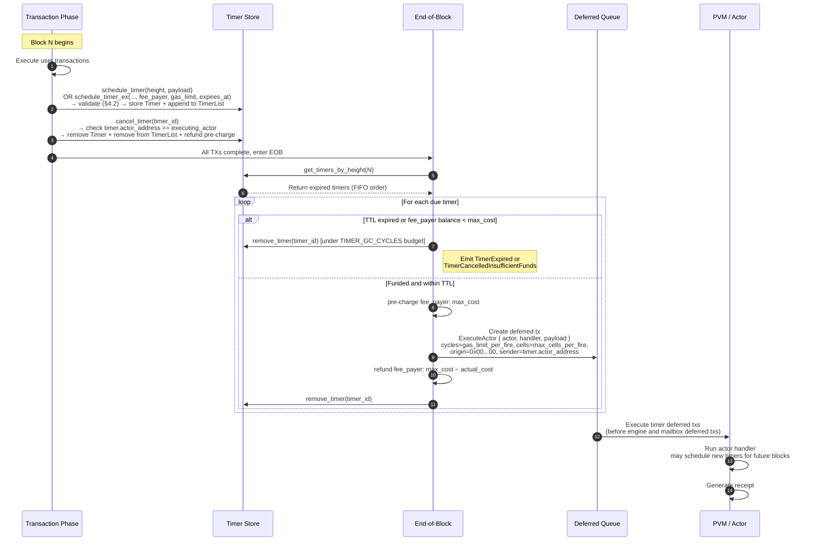

<Note>
  **Status:** Draft
  **Type:** Standards Track
  **Category:** Core
  **Created:** 2026-01-19
  **Revised:** 2026-04-20
  **Requires:** CIP-1, CIP-3
</Note>

<Tip>
  This document describes the timer mechanism **as currently implemented** in the Cowboy node. CIP-1 remains the authoritative specification for the broader Actor Message Scheduler (GBA bidding, tiered calendar queue). This CIP covers the concrete timer storage, scheduling, and end-of-block delivery that the node executes today.
</Tip>

## 1. Abstract

This proposal defines Cowboy's **native Timer mechanism** — a height-triggered, one-shot scheduling primitive with an explicit fee payer and self-terminating lifecycle. Actors register timers for a future block height; each timer records **who pays** (`fee_payer`), **how much gas it may consume per fire** (`gas_limit_per_fire`), and **when it gives up** (`expires_at`). At the **End of Block (EOB)**, the protocol collects all timers whose `height` matches the current block, **pre-charges the fee payer**, executes the handler, refunds unused gas, and removes the timer. A timer that its fee payer can no longer fund, or that has passed its TTL, is destroyed on the next block without executing. Execution follows insertion order (FIFO within a height bucket) — no priority queue or bidding is involved (see §9 for the target auction layer).

Metering follows **CIP-3**'s dual-metered model (Cycles/Cells). Protocol-level timer parameters (`max_ttl_blocks`, `max_cycles_per_fire`, `max_cells_per_fire`, `max_timers_per_actor`, `gc_cycles_per_block`) are held in a governed `TimerConfig`, updated through the same `SubmitProposal → CastVote → ExecuteProposal` path as `BasefeeConfig`.

---

## 2. Motivation

On-chain actors need the ability to schedule future execution without relying on external keepers. Use cases include:

- **Periodic tasks:** An actor schedules a timer in its handler to re-fire at a future height, creating a heartbeat loop.
- **Deferred settlement:** After an off-chain computation (CIP-2), an actor schedules a follow-up action at a known future height.
- **Time-locked operations:** Vesting, escrow release, or governance proposal execution at a predetermined height.

This revision prioritizes **simplicity, determinism, correctness, and economic soundness** over the more advanced scheduling features described in CIP-1 (GBA bidding, tiered queues). The auction layer is sketched in §9 and is compatible with the economics defined here — it can be layered on without revising §§3–8.

---

## 3. Specification

### 3.1 Timer Data Structure

```rust
struct Timer {
    actor_address: Address,  // the actor that owns this timer (also handler execution identity)
    height: u64,             // block height at which the timer fires
    payload: Vec<u8>,        // opaque bytes delivered to the handler (max 1 MiB)
    timer_id: Vec<u8>,       // unique identifier (max 256 bytes)
    handler: String,         // handler method name (max 256 bytes, default: "handle_timer")

    // Economics (Model B):
    fee_payer: Address,      // account debited at each fire (see §4.2)
    gas_limit_per_fire: u64, // max cycles this fire may consume (≤ TimerConfig.max_cycles_per_fire)
    expires_at: u64,         // absolute block height after which the timer self-destructs
}
```

The `Timer` codec version is bumped when these fields are introduced; previous-format timers cannot be decoded and require a chain wipe or migration (devnet-only acceptable).

### 3.2 Timer Index

Timers are stored in two structures:

- **Timer store:** `keccak256(timer_id) → Timer` — the canonical timer record.
- **Height index:** `keccak256(height.to_be_bytes()) → TimerList` — a list of `timer_id` values for each height, maintained in insertion order.

```rust
struct TimerList {
    timer_ids: Vec<Vec<u8>>,
}
```

Both structures are part of consensus state (QMDB Current databases) and contribute to `state_root`.

### 3.3 Timer ID Generation

Timer IDs are deterministically derived:

```
timer_id = keccak256(actor_address[20] || height[8 BE] || payload || nonce[8 BE])
```

Where `nonce` is the transaction nonce of the calling actor at the time of scheduling. This guarantees uniqueness across all timers.

---

## 4. API

### 4.1 Python Host API

Actors interact with timers via four host calls exposed to the PVM:

```python
# Schedule a timer for a future block height. Classic 2-arg form — timer
# is created with protocol defaults (fee_payer = actor_address,
# gas_limit = TimerConfig.max_cycles_per_fire, expires_at =
# current_height + TimerConfig.max_ttl_blocks). Returns the timer_id.
timer_id = pvm_host.schedule_timer(height: int, payload: bytes) -> bytes

# Model B extended scheduler — accepts actor-specified overrides for any of
# fee_payer / gas_limit / expires_at. Each argument defaults to None (use
# the protocol default). Exposed as a separate function (not extra kwargs
# on schedule_timer) so existing actor code keeps working without changes.
timer_id = pvm_host.schedule_timer_ex(
    height: int,
    payload: bytes,
    fee_payer: bytes = None,      # 20-byte address; None → actor_address
    gas_limit: int = None,        # None → TimerConfig.max_cycles_per_fire
    expires_at: int = None,       # None → current_height + TimerConfig.max_ttl_blocks
) -> bytes

# Extend a timer's TTL. Caller must own the timer (timer.actor_address ==
# executing_actor); otherwise rejected as Unauthorized.
pvm_host.extend_timer(timer_id: bytes, new_expires_at: int) -> None

# Cancel a previously scheduled timer. See §4.2 for authorization.
pvm_host.cancel_timer(timer_id: bytes) -> None
```

### 4.2 Constraints

- **Future height only:** `height` MUST be strictly greater than the current block height. Scheduling at the current or past height returns an error.
- **One-shot semantics:** Each timer fires exactly once and is immediately removed. To create recurring behavior, the actor must schedule a new timer from within its handler.
- **Custom handler:** By convention, if `payload` is valid JSON containing `{"_handler": "<name>", "_payload": "<base64>"}`, the timer invokes the named handler with the inner payload. Otherwise, the default handler `handle_timer` is invoked.
- **Payload size:** Maximum 1,048,576 bytes (1 MiB).
- **Handler name:** Maximum 256 bytes.
- **`fee_payer` validation (enforced at schedule time):**
  - `ZERO` (burn address) is rejected.
  - The reserved system-actor band `0x01`..=`0x0F` is rejected — covers every
    currently assigned system actor (runner registry / dispatcher / verifier
    / secrets / TEE / token registry / entitlement registry / RAS / basefee /
    governance) plus a few reserved slots. An actor cannot delegate payment
    to a system actor.
  - **`fee_payer` MUST be either the executing `actor_address` (actor pays
    itself) or the current `tx_sender` (deployer / invoker pays). Any other
    third-party address is rejected with `InvalidInput`.**
    - **Rationale.** Without this check, a hostile actor could schedule
      timers with an arbitrary victim's address as `fee_payer`; the
      block-level pre-charge (§6.3 step 4) would then drain the victim's
      account on every fire until depleted — a straight Broken-Access-Control
      class bug. The self-or-sender rule ensures every debit has implicit
      consent: either the actor is paying for its own execution, or the
      tx signer chose to fund this timer by submitting the scheduling
      transaction.
    - **Future opt-in third-party sponsorship** (NOT in this revision) would
      require an explicit on-chain allowance (e.g. `fee_payer` pre-authorizes
      the scheduling actor via a storage-based quota) or a signed
      authorization carried in the scheduling tx. Deliberately deferred —
      the current rule covers the two "typical" cases Model B.2 enumerates
      (actor self-funds; deployer funds its actor) with no attack surface.
  - Default when omitted: `actor_address`.
- **`gas_limit_per_fire`:** MUST be ≤ `TimerConfig.max_cycles_per_fire`.
- **`expires_at`:** MUST satisfy `expires_at ≤ current_height + TimerConfig.max_ttl_blocks`. A timer whose `expires_at` has passed is destroyed on its next scheduled fire without executing (see §5.4).
- **Per-actor cap:** An actor may hold at most `TimerConfig.max_timers_per_actor` live timers at any time (maintained via a per-actor secondary index).
- **`cancel_timer` authorization:** The PVM host call is only permitted to cancel timers where `timer.actor_address == executing_actor`. Cross-actor cancellation via `cancel_timer` is rejected as `Unauthorized` (closes CVE-class bug present prior to this revision). System-level cancellation paths (owner, governance) are exposed via system instructions, not host calls — see §5.4.

### 4.3 Side Effect Semantics

Timer scheduling and cancellation are **side effects** of transaction execution:

- Scheduled timers pass the §4.2 validation (fee_payer, TTL, gas caps, per-actor cap) during the originating tx's execution; validation failure reverts the tx. Accepted timers are collected in `ExecutionSideEffects.scheduled_timers` and persisted to storage after the transaction commits.
- Cancelled timers pass the §4.2 authorization check (or the §5.4 system-instruction authorization) and are collected in `ExecutionSideEffects.cancelled_timers`, then removed from storage after the transaction commits. Any pre-charged `max_cost` is refunded on the same commit.
- On transaction rollback, all timer side effects are discarded — no scheduled timer is persisted, no cancelled timer is removed, no pre-charge is finalized.

---

## 5. End-of-Block Delivery

### 5.1 Execution Order

Timer delivery occurs at the **end of block**, after all user transactions have been executed. The sequence within `process_block()` is:

1. Execute all user transactions (TX phase).
2. Query `get_timers_by_height(current_height)` — returns all due timers in insertion order (FIFO).
3. Classify each due timer per §5.4:
   - **TTL expired** (`current_height > expires_at`) or **insufficient funds** → remove under `TIMER_GC_CYCLES` (§6.5), emit the corresponding event, skip execution.
   - **Within TTL and funded** → pre-charge `fee_payer` (§6.3 step 4), construct a **deferred transaction** targeting the actor's handler, enqueue.
4. Remove the timer from both the timer store and the height index after each classification concludes.
5. Execute the enqueued deferred transactions; refund any over-reserved gas to `fee_payer` (§6.3 step 6).

Timer-created deferred transactions are ordered **before** engine and mailbox deferred transactions within the same block.

### 5.2 Deferred Transaction Construction

Each fired timer produces a deferred transaction with the following properties:

| Field | Value |
| :---- | :---- |
| Origin tx hash | `0x0000...0000` (32 zero bytes — "no parent tx" sentinel) |
| Instruction | `ExecuteActor { actor, handler, payload }` |
| Cycles limit | `timer.gas_limit_per_fire` |
| Cells limit | `TimerConfig.max_cells_per_fire` (conservative flat cap — actor-specified cell limit is unreliable since cells are hard to estimate ahead of time; over-reservation is refunded) |
| Sender | `timer.actor_address` (handler execution identity) |
| Fee payer | `timer.fee_payer` |

The zero-hash origin indicates "this tx has no parent user tx" — it does **not** imply free execution (see §6.3). Unlike user-initiated deferred transactions, timer deferred txs do **not** consume from a parent tx's `deferred_gas_pools` entry; their gas budget is drawn from `fee_payer`'s account directly.

### 5.3 Same-Block Prohibition

Timers created within the current block's transactions MUST NOT fire in the same block. This is enforced by the `height > current_block_height` constraint in `schedule_timer`.

### 5.4 Timer Lifecycle — Three Exit Paths

A timer is guaranteed to disappear through exactly one of the following paths:

1. **Natural fire** (§5.2, §6.3): `height` arrives, `fee_payer` has sufficient funds, handler runs (success or revert); timer is removed.
2. **Insufficient-funds self-destruct**: at fire time, `balance(fee_payer) < max_cost` (see §6.3). The timer is removed without executing. Event: `TimerCancelledInsufficientFunds { timer_id, fee_payer, required, available }`. Clearing runs under the GC budget (§6.5), not the execution lane.
3. **TTL expiry**: at fire time, `current_height > expires_at`. The timer is removed without executing. Event: `TimerExpired { timer_id, expires_at, current_height }`. Also under the GC budget.
4. **Explicit cancellation**, via either:
   - **Actor-self** — `pvm_host.cancel_timer(timer_id)` PVM syscall. The
     host-call layer requires `timer.actor_address == executing_actor`;
     cross-actor cancellation at this path is rejected as `Unauthorized`.
   - **Validator-set emergency** — `SystemInstruction::CancelTimer { timer_id }`
     (opcode `SYS_CANCEL_TIMER`). Authorization: `sender ∈ system_deployers`
     (same gate as `UpgradeActor` and `UpdateBasefeeConfig`). Idempotent:
     cancelling a timer that has already self-destructed (TTL / insufficient
     funds, §5.4 paths 2–3) succeeds as a no-op. Emits
     `timer.cancelled_by_governance` with the `timer_id` as event data.

TTL extension has the same dual path:

- **Actor-self** — `pvm_host.extend_timer(timer_id, new_expires_at)` PVM
  syscall. Caller must own the timer; new TTL must be strictly greater than
  the current block height.
- **Validator-set emergency** — `SystemInstruction::ExtendTimer { timer_id,
  new_expires_at }` (opcode `SYS_EXTEND_TIMER`). Same `system_deployers`
  gate as `CancelTimer`. For timers whose actor can no longer self-extend
  (bricked code, unreachable owner). Emits `timer.extended_by_governance`.

Both paths clamp the new TTL to `current_height + TimerConfig.max_ttl_blocks`
to prevent renewal past the unattended-lifespan ceiling. If the fire-time
self-destruct check has already debited `fee_payer` for the next fire's
`max_cost`, the cancel path refunds the unused portion.

**Note on governance routing.** This CIP deliberately wires `CancelTimer`,
`ExtendTimer`, and `UpdateTimerConfig` (§6.4) as **direct `SystemInstruction`
variants** gated by `system_deployers`, rather than as payloads of a full
`SubmitProposal → CastVote → ExecuteProposal` flow. The validator set acts
as the "governance body" for these operations, matching the existing
`UpdateBasefeeConfig` / `UpgradeActor` pattern. A future revision can layer
a multi-block proposal flow on top if needed; the current design keeps the
emergency-response path fast.

---

## 6. Metering

### 6.1 Scheduling and Cancellation Costs

| Operation | Cost (charged to `tx_sender`) |
| :-------- | :---------------------------- |
| `schedule_timer` / `schedule_timer_ex` | `SET_TIMER_BASE_CYCLES = 200` cycles + payload cells |
| `extend_timer` (PVM host) | `200` cycles (same as `schedule_timer`, no payload) |
| `cancel_timer` (PVM host) | `CANCEL_TIMER_CYCLES = 200` cycles (flat) |

Cell costs for index metadata writes are charged separately by the storage layer per CIP-3. The `schedule_timer` fee charges the **scheduling transaction's sender** — this is independent of the timer's `fee_payer`, which is only debited at fire time.

### 6.2 Execution Budget

Each timer handler execution receives a per-timer budget:

| Resource | Budget |
| :------- | :----- |
| Cycles | `timer.gas_limit_per_fire` (bounded by `TimerConfig.max_cycles_per_fire`, default 550,000) |
| Cells | `TimerConfig.max_cells_per_fire` (default 550,000) |

An actor may choose a smaller `gas_limit_per_fire` to reduce the per-fire max cost (see §6.3). The cell limit is taken from config rather than from the timer for simplicity — over-reservation is refunded.

### 6.3 Fee Settlement

Timer execution is **not free**. Each fire is metered and paid for by `timer.fee_payer`, with the same `burn + tip` breakdown as a normal user transaction:

```
1. Read the current basefee from BasefeeConfig:
       (cycle_basefee, cell_basefee)
2. Compute the worst-case cost:
       max_cost = timer.gas_limit_per_fire × cycle_basefee
                + TimerConfig.max_cells_per_fire × cell_basefee
3. If balance(timer.fee_payer) < max_cost:
       → Insufficient-funds self-destruct (§5.4 path 2).
       → No handler executes, no gas consumed on the execution lane.
4. Debit max_cost from fee_payer (pre-charge).
5. Execute the handler under the budget.
   - On success: writeset is committed.
   - On revert: writeset is discarded; gas used is still charged (same as a reverting user tx).
6. Refund:
       actual_cost = actual_cycles × cycle_basefee
                   + actual_cells  × cell_basefee
       credit(fee_payer, max_cost − actual_cost)
7. Basefee economics match normal txs: the basefee portion of actual_cost is burned;
   any tip goes to the block proposer. Timers contribute to block throughput accounting.
8. Remove the timer from storage.
```

A timer's handler that wants to keep firing must call `schedule_timer` (or `extend_timer` on the current timer before returning) from within itself. Each re-schedule is a fresh fire with a fresh `max_cost` check — this forms a **pay-as-you-go subscription loop**. When `fee_payer` runs dry, the subscription ends automatically on the next fire.

### 6.4 `TimerConfig` — Governed Parameters

Timer economics parameters are held in a governed config, stored under the basefee system actor using the same pattern as `BasefeeConfig`:

```rust
struct TimerConfig {
    max_ttl_blocks:       u64,   // default 2_592_000 (~30 days @ 1 s blocks)
    max_cycles_per_fire:  u64,   // default 550_000
    max_cells_per_fire:   u64,   // default 550_000
    max_timers_per_actor: u32,   // default 1_024
    gc_cycles_per_block:  u64,   // default 5_000_000 (see §6.5)
}
```

Stored at `state:actor:{BASEFEE_SYSTEM_ACTOR}:kv:system:timer_config`. Updated
via `SystemInstruction::UpdateTimerConfig` (opcode `SYS_UPDATE_TIMER_CONFIG`)
with sender ∈ `system_deployers` — the same direct-governance pattern used
by `CancelTimer` / `ExtendTimer` (§5.4) and `UpdateBasefeeConfig`. The
`constants.rs` defaults apply when the stored config is absent. This allows
the validator set to raise TTL, lower per-fire caps, or throttle GC without
a chain upgrade and without going through a multi-block proposal flow.
Emits `timer_config.updated` with the serialized new config as event data.

### 6.5 Lane Budgets — Flow Control, Not Free Gas

Two independent block-level budgets bound total timer work per block:

- **`LANE_TIMER_CYCLES`** — aggregate cycles that fired timer handlers (path 1 in §5.4) may consume in one block. A timer whose `gas_limit_per_fire` exceeds the remaining lane budget is **deferred to the next block** (it still costs its owner nothing in that block).
- **`TIMER_GC_CYCLES = TimerConfig.gc_cycles_per_block`** — a separate budget for removing expired and insufficient-funds timers (paths 2 and 3). This isolation prevents a resume-after-outage storm (many `expires_at < current_height` at once) from crowding out live-timer execution.

Neither budget grants free gas to handlers — they are purely per-block rate limits on how many timers may be dispatched. Every dispatched fire still charges `fee_payer` per §6.3.

---

## 7. Determinism & Replayability

The timer mechanism is fully deterministic:

- `get_timers_by_height(h)` depends only on the state of the timer store and height index at height `h`.
- Timer IDs are derived from on-chain data only (address, height, payload, nonce).
- Insertion order within a height bucket is determined by transaction execution order, which is consensus-critical.
- Classification (natural fire vs TTL expiry vs insufficient funds) is a pure function of `(current_height, timer.expires_at, balance(timer.fee_payer), max_cost)` — all inputs are in consensus state.
- Pre-charge/refund math (§6.3 steps 4–6) uses integer arithmetic over the basefee read from `BasefeeConfig` at the block boundary; no floating-point, no locale-dependent formatting.
- `TimerConfig` is read once per block from consensus state; mid-block changes do not apply.
- Local randomness, VRF, and wall-clock time are prohibited.
- On reorg, timer state (including pre-charge debits) rolls back with the QMDB state root, and delivery replays identically against the new parent state.

---

## 8. Security Considerations

- **Unbounded free execution:** Prior to this CIP, timers executed under a `!is_system_triggered` branch in `transaction.rs` that **skipped basefee deduction entirely**. A single actor writing a few KVs per fire, paired with a deployer whose balance had dropped to zero, ran forever at the validator's expense. §6.3 removes that branch: every fire is metered against `fee_payer` and self-destructs when funds run out.
- **Timer storms:** A malicious actor could schedule many timers for the same height, causing an EOB spike. Mitigations: per-timer scheduling cost (1,000 cycles) + `TimerConfig.max_timers_per_actor` per-actor cap (default 1,024) + `LANE_TIMER_CYCLES` block-level flow control. A future revision MAY add a global `MAX_FIRES_PER_BLOCK`.
- **Resume-after-outage storm:** If the chain halts for `N` blocks, on resume every timer with `expires_at < current_height` would try to clear at once. §6.5 isolates expired/self-destruct clearing into `TIMER_GC_CYCLES`, separate from `LANE_TIMER_CYCLES`, so live-timer execution is not crowded out. Timers not cleared in one block roll to the next — still expired means still expired.
- **`cancel_timer` cross-actor cancellation (fixed by this revision):** The `pvm_host.cancel_timer(timer_id)` host call previously performed no ownership check, allowing any actor to append any `timer_id` to `cancelled_timers` and silently delete another actor's timer. §4.2 requires `timer.actor_address == executing_actor` at the host-call layer; cross-actor cancellation is only possible via the `CancelTimer` system instruction with explicit authorization (owner or governance, §5.4).
- **Fee-payer griefing / unauthorized fund drainage (closed by §4.2):** An
  earlier draft of this CIP allowed "any valid address" as `fee_payer`,
  which would have let a hostile actor schedule timers with an arbitrary
  victim's address — the block-level pre-charge (§6.3 step 4) would then
  drain the victim on every fire until depleted. §4.2 tightens the rule to
  **`fee_payer` MUST be the executing `actor_address` or the current
  `tx_sender`**; any other third-party address is rejected at schedule time.
  This guarantees every pre-charge has implicit consent: the actor is
  paying for its own work, or the tx signer explicitly chose to fund this
  timer by submitting the scheduling tx. "Third-party sponsorship with
  opt-in" is an enumerated future extension (§4.2).
- **Gas suicide:** Because `gas_limit_per_fire` is actor-chosen, an actor can schedule cheaply-priced timers. The scheduling fee + `fee_payer` balance check at each fire prevents pure-spam: a zero-balance `fee_payer` produces at most one self-destruct event per scheduled timer before removal.
- **Payload abuse:** The 1 MiB payload limit prevents state bloat from oversized timer payloads.
- **Reentrancy:** Timer handlers execute in a fresh transaction context. They may schedule new timers, but those timers fire in future blocks only (same-block prohibition, §5.3).
- **Deduplication:** Timer IDs include the scheduling transaction's nonce (§3.3), preventing duplicate registration from replayed transactions.

---

## 9. Future: Timer Auction Mechanism

The current FIFO implementation is sufficient for devnet but lacks congestion management, economic prioritization, and latency guarantees. This section specifies the target auction design for mainnet. Implementation is ongoing; simulation results will inform final parameter choices.

**Relationship to Model B (§§3–8):** The auction layer is **orthogonal** to the fee-payer/TTL/self-destruct economics specified above. Model B answers *"who pays per fire, and when does a timer stop existing"*; the auction answers *"which due timers get to fire this block when lane budget is scarce"*. The auction consumes an additional `bid` on each timer; the `fee_payer` path of §6.3 still debits the same account at execution time. No field from §3.1 is removed when §9 is implemented.

### 9.1 Design Goals

The timer auction SHOULD satisfy:

- **Bounded worst-case latency:** Any timer executes within `N_max` blocks regardless of competition.
- **Honest bidding incentives:** The optimal bidding strategy should be simple — ideally, bid your true valuation. This is critical for an agentic blockchain where autonomous actors (not humans) must bid programmatically.
- **Surplus maximization:** Prioritize timers with higher urgency/value.
- **Computational efficiency:** EOB auction resolution in O(n log n) or better.

### 9.2 Exponential Bias Mechanism

To prevent wealthy actors from permanently outbidding others, each timer accumulates an **exponential bias** based on how long it has waited:

```
Bias(n) = e^(n * λ)
```

Where:
- `n` = number of blocks the timer has been deferred
- `λ` = governance-tunable decay parameter

The **effective priority score** for each timer is:

```
priority = (bid + Bias(n)) / total_cycles
```

This guarantees a **maximum wait time** against any competitor, no matter how rich:

```
N_max = ln(T / 3) / λ
```

Where `T` is the competing bidder's token balance. Beyond `N_max` blocks, the deferred timer's bias exceeds any economically rational bid.

### 9.3 The Critical Constraint

For the auction to function correctly, the following invariant MUST hold:

```
Average Value Decay Rate ≥ d/dt(Bias(t))
```

In discrete terms: `Y * Δn ≥ Bias(n + Δn) - Bias(n)` for the average bidder, where `Y` is the rate at which a timer's value decays per block.

**Why this matters:** If bias grows faster than value decays, rational actors would underbid and let bias carry them to execution for free, collapsing the auction into a pure waiting game. The protocol MUST maintain a dynamic `λ` control loop that adjusts `λ` to enforce this constraint based on observed bidding behavior and congestion.

### 9.4 Block Budget and Quota Caps

When the auction is active, EOB timer execution is bounded by the existing Model B flow-control budget plus two new quota caps:

- `LANE_TIMER_CYCLES` (existing, §6.5) — hard cap on total cycles consumed by fired timer handlers per block; the auction allocates within this budget.
- `MAX_FIRES_PER_BLOCK` (new) — global cap on the *count* of timer executions per block, independent of cycles.
- `MAX_FIRES_PER_ACTOR` (new) — per-actor cap to prevent monopolization.
- Timers that don't make the cut are deferred to the next block with `n += 1`, increasing their bias.

The GC lane (`TIMER_GC_CYCLES`, §6.5) remains separate from the auction — expired and insufficient-funds timers do not participate in bidding.

### 9.5 Payment Rule: Greedy VCG (Target) vs First-Price (Fallback)

**Target: Greedy VCG (second-price knapsack auction)**

The Vickrey-Clarke-Groves mechanism makes honest bidding a weakly dominant strategy — actors bid their true valuation and pay based on the externality they impose:

1. Sort eligible timers by `(bid + Bias(n)) / total_cycles` (descending).
2. Select timers greedily until `TIMER_PROCESSING_BUDGET_CYCLES` is exhausted.
3. For each selected timer, find the runner-up (first excluded timer).
4. Winner pays: `bid(runner_up) - Bias(winner)` (floored at the reserve price).

**Why VCG for Cowboy specifically:**
- Cowboy actors are autonomous programs, not humans. Writing an optimal first-price bidding strategy requires estimating competition, which is hard to do programmatically. VCG reduces the optimal strategy to "bid what it's worth to you."
- 1-second finality + VRF proposer selection significantly mitigate MEV / shill bidding attacks that plague second-price auctions on slower chains.
- Price stability — VCG produces more predictable clearing prices than first-price, which matters for DeFi actors budgeting for timer costs.

**Fallback: First-price auction**

If simulation shows VCG revenue is insufficient for validator economics or MEV exploitation is viable despite mitigations, the protocol falls back to first-price (you pay your bid). The allocation rule (priority scoring with exponential bias) remains identical — only the payment rule changes.

A **reserve price** (minimum bid floor) SHOULD be set regardless of payment rule to guarantee validators a baseline revenue per timer execution.

### 9.6 Fairness Targets

The auction should aim to minimize:

- `var(utility_i / bid_i)` — every actor gets proportional utility per token spent.
- `var(efficiency_i / bid_i)` — execution efficiency scales linearly with bid.

Minimizing these variances reduces the **price of anarchy** (the gap between auction outcomes and an ideal centralized allocator). The exponential bias mechanism and dynamic `λ` are the primary levers for achieving this.

### 9.7 `schedule_timer` API Extension

When the auction is implemented, `schedule_timer` gains a single additional parameter (`gas_limit` and `fee_payer` are already present per §4.1):

```python
timer_id = pvm_host.schedule_timer(
    height: int,
    payload: bytes,
    fee_payer: bytes = None,   # as §4.1
    gas_limit: int = None,     # as §4.1
    expires_at: int = None,    # as §4.1
    bid: int = 0,              # NEW: CBY bid for execution priority
)
```

The `bid` is locked at scheduling time and refunded (minus payment) or fully consumed depending on the payment rule, debited from the same `fee_payer` account used for per-fire gas. Timers scheduled without a `bid` (bid = 0) rely entirely on bias accumulation for eventual execution.

### 9.8 Implementation Roadmap

Phases already delivered by this revision (§§3–8) are marked ✓; remaining phases are auction-specific.

| Phase | Change | Complexity |
| :---- | :----- | :--------- |
| ~~Actor gas budget~~ | ~~Let actors specify `gas_limit` on `schedule_timer`~~ ✓ — delivered in §4.1 | — |
| 1. Count caps | Add `MAX_FIRES_PER_BLOCK`, `MAX_FIRES_PER_ACTOR` on top of existing `LANE_TIMER_CYCLES` | Low |
| 2. Bidding + exponential bias | Implement priority scoring with `(bid + e^(nλ)) / cycles` | Medium |
| 3. Payment rule | Greedy VCG (or first-price fallback based on simulation) | Medium |
| 4. Dynamic λ control loop | Auto-tune λ to maintain value-decay constraint | Medium |
| 5. State-triggered timers | Watch-key subscriptions (original CIP-5 concept) | High |

### 9.9 Open Questions

- **Calibration of λ:** Requires simulation against realistic workloads. Too high → bias dominates bids (auction becomes pure FIFO with delay). Too low → bounded latency guarantee weakens.
- **Reserve price level:** Must balance validator revenue against accessibility for low-value timers.
- **VCG revenue gap:** How much less do validators earn vs first-price under realistic congestion? Simulation needed.
- **Interaction with CIP-1 GBA:** CIP-1 describes a Gas Bidding Agent model where a contract returns dynamic bids. The auction mechanism here is compatible — the GBA simply becomes the source of the `bid` parameter. Integration details TBD.

---

## Appendix A: End-of-Block Timer Delivery Sequence



## Appendix B: Recurring Timer Pattern

Since timers are one-shot, actors implement recurring behavior by re-scheduling from within the handler. Each re-schedule is a fresh pay-as-you-go subscription tick — when `fee_payer` runs dry, the loop terminates automatically on the next fire (§5.4 path 2).

```python
class HeartbeatActor:
    INTERVAL = 10  # fire every 10 blocks

    def deploy(self):
        # Schedule first heartbeat. fee_payer defaults to the actor's own address;
        # top up self.address to fund the loop. Omit gas_limit / expires_at to use
        # TimerConfig defaults.
        pvm_host.schedule_timer(
            pvm_host.block_height() + self.INTERVAL,
            b""
        )

    def handle_timer(self, payload):
        # Do periodic work
        self.check_positions()
        self.rebalance()

        # Re-schedule for next interval. If the actor's balance can't cover the
        # next fire's max_cost, this schedule succeeds but that fire will self-
        # destruct with a TimerCancelledInsufficientFunds event.
        pvm_host.schedule_timer(
            pvm_host.block_height() + self.INTERVAL,
            b""
        )
```

### Deployer-funded variant

When the deployer wants to fund a long-lived service actor (e.g. a pricing
oracle), call `schedule_timer_ex` from within the `deploy` handler and pass
the deployer's address as `fee_payer`. Because `deploy` runs as part of the
deployer-initiated tx, `tx_sender == deployer` — the `fee_payer` check in
§4.2 accepts this value. Scheduling the same timer with `fee_payer =
self.deployer` from a handler invoked by someone OTHER than the deployer
would be rejected, which is the intended security boundary.

```python
def deploy(self):
    pvm_host.schedule_timer_ex(
        pvm_host.block_height() + self.INTERVAL,
        b"",
        fee_payer=self.deployer,       # == tx_sender during deploy → accepted
        gas_limit=200_000,              # tighter budget than the default 550k
        expires_at=pvm_host.block_height() + 2_592_000,  # ~30 days; use extend_timer to renew
    )
```
