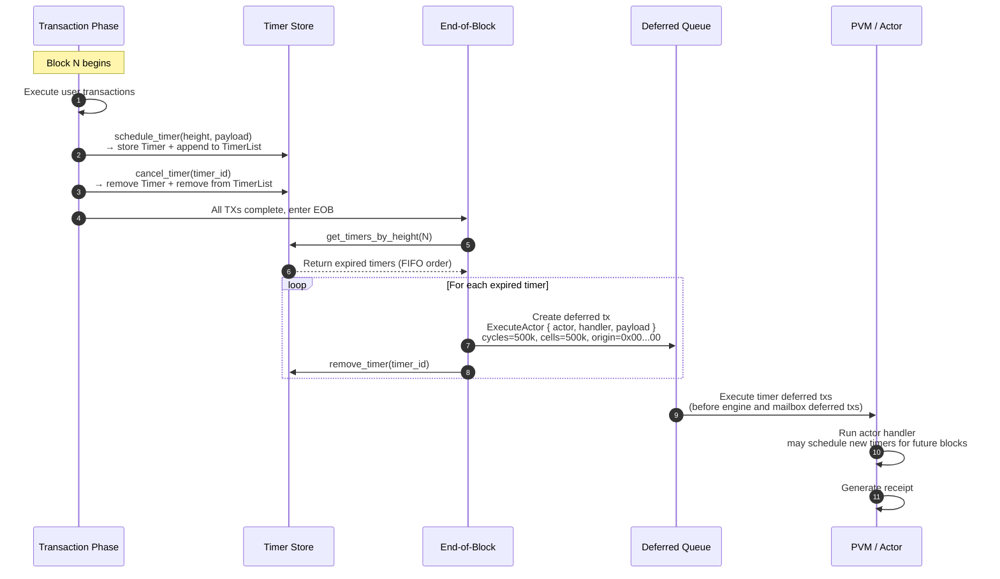

<Note>
  **Status:** Draft (Revised 2026-03-19 — aligned with implementation)
  **Type:** Standards Track
  **Category:** Core
  **Requires:** CIP-1, CIP-3
</Note>

<Tip>
  This document describes the timer mechanism **as currently implemented** in the Cowboy node. CIP-1 remains the authoritative specification for the broader Actor Message Scheduler (GBA bidding, tiered calendar queue). This CIP covers the concrete timer storage, scheduling, and end-of-block delivery that the node executes today.

> **修正案（2026-04-15）**: 代码实现以 CIP-1 风格 GBA 调度为准（`schedule_timer` host API + block-tail deferred tx）；Globalbox EOB timers 未实现。块 timer 预算 `8,888,890 cycles`、单 timer 上限 `550,000 cycles`。详见 [`analysis/2026-04-15_documentation_amendments.md §五`](../analysis/2026-04-15_documentation_amendments.md)。
</Tip>

## 1. Abstract

This proposal defines Cowboy's **native Timer mechanism** — a simple, height-triggered, one-shot scheduling primitive. Actors register timers for a future block height. At the **End of Block (EOB)**, the protocol collects all timers whose `due_height` matches the current block, creates a **deferred transaction** for each, and removes the timer. Execution follows insertion order (FIFO within a height bucket). No priority queue, scoring, or bidding is involved in the current implementation.

Metering follows **CIP-3**'s dual-metered model (Cycles/Cells).

---

## 2. Motivation

On-chain actors need the ability to schedule future execution without relying on external keepers. Use cases include:

- **Periodic tasks:** An actor schedules a timer in its handler to re-fire at a future height, creating a heartbeat loop.
- **Deferred settlement:** After an off-chain computation (CIP-2), an actor schedules a follow-up action at a known future height.
- **Time-locked operations:** Vesting, escrow release, or governance proposal execution at a predetermined height.

The current implementation prioritizes **simplicity, determinism, and correctness** over the more advanced scheduling features described in CIP-1 (GBA bidding, tiered queues). Those features may be layered on in future revisions.

---

## 3. Specification

### 3.1 Timer Data Structure

```rust
struct Timer {
    actor_address: Address,  // the actor that owns this timer
    height: u64,             // block height at which the timer fires
    payload: Vec<u8>,        // opaque bytes delivered to the handler (max 1 MiB)
    timer_id: Vec<u8>,       // unique identifier (max 256 bytes)
    handler: String,         // handler method name (max 256 bytes, default: "handle_timer")
}
```

### 3.2 Timer Index

Timers are stored in two structures:

- **Timer store:** `keccak256(timer_id) → Timer` — the canonical timer record.
- **Height index:** `keccak256(height.to_be_bytes()) → TimerList` — a list of `timer_id` values for each height, maintained in insertion order.

```rust
struct TimerList {
    timer_ids: Vec<Vec<u8>>,
}
```

Both structures are part of consensus state (QMDB Current databases) and contribute to `state_root`.

### 3.3 Timer ID Generation

Timer IDs are deterministically derived:

```
timer_id = keccak256(actor_address[20] || height[8 BE] || payload || nonce[8 BE])
```

Where `nonce` is the transaction nonce of the calling actor at the time of scheduling. This guarantees uniqueness across all timers.

---

## 4. API

### 4.1 Python Host API

Actors interact with timers via two host calls exposed to the PVM:

```python
# Schedule a timer for a future block height.
# Returns the timer_id (bytes).
timer_id = pvm_host.schedule_timer(height: int, payload: bytes) -> bytes

# Cancel a previously scheduled timer.
pvm_host.cancel_timer(timer_id: bytes) -> None
```

### 4.2 Constraints

- **Future height only:** `height` MUST be strictly greater than the current block height. Scheduling at the current or past height returns an error.
- **One-shot semantics:** Each timer fires exactly once and is immediately removed. To create recurring behavior, the actor must schedule a new timer from within its handler.
- **Custom handler:** By convention, if `payload` is valid JSON containing `{"_handler": "<name>", "_payload": "<base64>"}`, the timer invokes the named handler with the inner payload. Otherwise, the default handler `handle_timer` is invoked.
- **Payload size:** Maximum 1,048,576 bytes (1 MiB).
- **Handler name:** Maximum 256 bytes.

### 4.3 Side Effect Semantics

Timer scheduling and cancellation are **side effects** of transaction execution:

- Scheduled timers are collected in `ExecutionSideEffects.scheduled_timers` and persisted to storage after the transaction commits.
- Cancelled timers are collected in `ExecutionSideEffects.cancelled_timers` and removed from storage after the transaction commits.
- On transaction rollback, all timer side effects are discarded.

---

## 5. End-of-Block Delivery

### 5.1 Execution Order

Timer delivery occurs at the **end of block**, after all user transactions have been executed. The sequence within `process_block()` is:

1. Execute all user transactions (TX phase).
2. Query `get_timers_by_height(current_height)` — returns all timers in insertion order (FIFO).
3. For each expired timer, construct a **deferred transaction** targeting the actor's handler.
4. Remove the timer from both the timer store and the height index.
5. Enqueue the deferred transactions for execution.

Timer-created deferred transactions are ordered **before** engine and mailbox deferred transactions within the same block.

### 5.2 Deferred Transaction Construction

Each expired timer produces a deferred transaction with the following properties:

| Field | Value |
| :---- | :---- |
| Origin tx hash | `0x0000...0000` (32 zero bytes — system-triggered sentinel) |
| Instruction | `ExecuteActor { actor, handler, payload }` |
| Cycles limit | 550,000 |
| Cells limit | 550,000 |
| Sender | The actor that scheduled the timer |

The zero-hash origin distinguishes system-triggered timer transactions from user-initiated deferred transactions. System-triggered transactions use their own gas budget rather than drawing from a parent transaction's gas pool.

### 5.3 Same-Block Prohibition

Timers created within the current block's transactions MUST NOT fire in the same block. This is enforced by the `height > current_block_height` constraint in `schedule_timer`.

---

## 6. Metering

### 6.1 Scheduling and Cancellation Costs

| Operation | Cycle Cost |
| :-------- | :--------- |
| `schedule_timer` | `200` cycles + payload cells |
| `cancel_timer` | `200` cycles (flat) |

Cell costs for index metadata writes are charged separately by the storage layer per CIP-3.

### 6.2 Execution Budget

Each timer handler execution receives a fixed budget:

| Resource | Budget |
| :------- | :----- |
| Cycles | 550,000 |
| Cells | 550,000 |

Within this budget, the handler may create up to 2 deferred transactions (at 100,000 cycles each), leaving ~200,000 cycles for handler logic plus a 150,000-cycle safety margin.

### 6.3 Fee Settlement

Timer execution is system-triggered — no explicit basefee or tip is charged to the actor at execution time. The scheduling cost (paid at `schedule_timer` call time) covers the index write. Future revisions may introduce execution-time fee deduction aligned with CIP-1's GBA model.

---

## 7. Determinism & Replayability

The timer mechanism is fully deterministic:

- `get_timers_by_height(h)` depends only on the state of the timer store and height index at height `h`.
- Timer IDs are derived from on-chain data only (address, height, payload, nonce).
- Insertion order within a height bucket is determined by transaction execution order, which is consensus-critical.
- Local randomness, VRF, and wall-clock time are prohibited.
- On reorg, timer state rolls back with the QMDB state root, and delivery replays identically against the new parent state.

---

## 8. Security Considerations

- **Timer storms:** A malicious actor could schedule many timers for the same height, causing an EOB spike. Mitigation: the per-timer scheduling cost (1,000 cycles) provides economic backpressure. ✅ **Implemented:** `MAX_TIMERS_PER_ACTOR = 1,024` enforced via per-actor secondary index. Future revisions SHOULD add global caps (`MAX_FIRES_PER_BLOCK`).
- **Gas suicide:** The fixed 550,000 cycles/cells budget per timer fire prevents trivially cheap timer creation that would fail at execution. However, there is currently no `MIN_GAS_LIMIT_PER_TIMER` check — the scheduling cost alone serves as the deterrent.
- **Payload abuse:** The 1 MiB payload limit prevents state bloat from oversized timer payloads.
- **Reentrancy:** Timer handlers execute in a fresh transaction context. They may schedule new timers, but those timers fire in future blocks only (same-block prohibition).
- **Deduplication:** Timer IDs include the nonce, preventing duplicate registration from replayed transactions.

---

## 9. Future: Timer Auction Mechanism

The current FIFO implementation is sufficient for devnet but lacks congestion management, economic prioritization, and latency guarantees. This section specifies the target auction design for mainnet. Implementation is ongoing; simulation results will inform final parameter choices.

### 9.1 Design Goals

The timer auction SHOULD satisfy:

- **Bounded worst-case latency:** Any timer executes within `N_max` blocks regardless of competition.
- **Honest bidding incentives:** The optimal bidding strategy should be simple — ideally, bid your true valuation. This is critical for an agentic blockchain where autonomous actors (not humans) must bid programmatically.
- **Surplus maximization:** Prioritize timers with higher urgency/value.
- **Computational efficiency:** EOB auction resolution in O(n log n) or better.

### 9.2 Exponential Bias Mechanism

To prevent wealthy actors from permanently outbidding others, each timer accumulates an **exponential bias** based on how long it has waited:

```
Bias(n) = e^(n * λ)
```

Where:
- `n` = number of blocks the timer has been deferred
- `λ` = governance-tunable decay parameter

The **effective priority score** for each timer is:

```
priority = (bid + Bias(n)) / total_cycles
```

This guarantees a **maximum wait time** against any competitor, no matter how rich:

```
N_max = ln(T / 3) / λ
```

Where `T` is the competing bidder's token balance. Beyond `N_max` blocks, the deferred timer's bias exceeds any economically rational bid.

### 9.3 The Critical Constraint

For the auction to function correctly, the following invariant MUST hold:

```
Average Value Decay Rate ≥ d/dt(Bias(t))
```

In discrete terms: `Y * Δn ≥ Bias(n + Δn) - Bias(n)` for the average bidder, where `Y` is the rate at which a timer's value decays per block.

**Why this matters:** If bias grows faster than value decays, rational actors would underbid and let bias carry them to execution for free, collapsing the auction into a pure waiting game. The protocol MUST maintain a dynamic `λ` control loop that adjusts `λ` to enforce this constraint based on observed bidding behavior and congestion.

### 9.4 Block Budget and Quota Caps

When the auction is active, EOB timer execution is bounded:

- `MAX_FIRES_PER_BLOCK` — global cap on timer executions per block.
- `MAX_FIRES_PER_ACTOR` — per-actor cap to prevent monopolization.
- Timers that don't make the cut are deferred to the next block with `n += 1`, increasing their bias.

The block's timer budget (`TIMER_PROCESSING_BUDGET_CYCLES`) provides a hard cap on total cycles consumed by timer execution, ensuring user transactions are not crowded out.

### 9.5 Payment Rule: Greedy VCG (Target) vs First-Price (Fallback)

**Target: Greedy VCG (second-price knapsack auction)**

The Vickrey-Clarke-Groves mechanism makes honest bidding a weakly dominant strategy — actors bid their true valuation and pay based on the externality they impose:

1. Sort eligible timers by `(bid + Bias(n)) / total_cycles` (descending).
2. Select timers greedily until `TIMER_PROCESSING_BUDGET_CYCLES` is exhausted.
3. For each selected timer, find the runner-up (first excluded timer).
4. Winner pays: `bid(runner_up) - Bias(winner)` (floored at the reserve price).

**Why VCG for Cowboy specifically:**
- Cowboy actors are autonomous programs, not humans. Writing an optimal first-price bidding strategy requires estimating competition, which is hard to do programmatically. VCG reduces the optimal strategy to "bid what it's worth to you."
- 1-second finality + VRF proposer selection significantly mitigate MEV / shill bidding attacks that plague second-price auctions on slower chains.
- Price stability — VCG produces more predictable clearing prices than first-price, which matters for DeFi actors budgeting for timer costs.

**Fallback: First-price auction**

If simulation shows VCG revenue is insufficient for validator economics or MEV exploitation is viable despite mitigations, the protocol falls back to first-price (you pay your bid). The allocation rule (priority scoring with exponential bias) remains identical — only the payment rule changes.

A **reserve price** (minimum bid floor) SHOULD be set regardless of payment rule to guarantee validators a baseline revenue per timer execution.

### 9.6 Fairness Targets

The auction should aim to minimize:

- `var(utility_i / bid_i)` — every actor gets proportional utility per token spent.
- `var(efficiency_i / bid_i)` — execution efficiency scales linearly with bid.

Minimizing these variances reduces the **price of anarchy** (the gap between auction outcomes and an ideal centralized allocator). The exponential bias mechanism and dynamic `λ` are the primary levers for achieving this.

### 9.7 `schedule_timer` API Extension

When the auction is implemented, `schedule_timer` gains additional parameters:

```python
timer_id = pvm_host.schedule_timer(
    height: int,          # earliest block height (as today)
    payload: bytes,       # handler payload (as today)
    bid: int,             # CBY bid for execution priority (new)
    cycles_limit: int,    # actor-specified gas budget (new, replaces fixed 500k)
)
```

The `bid` is locked at scheduling time and refunded (minus payment) or fully consumed depending on the payment rule. Timers scheduled without a `bid` (bid = 0) rely entirely on bias accumulation for eventual execution.

### 9.8 Implementation Roadmap

| Phase | Change | Complexity |
| :---- | :----- | :--------- |
| 1. Caps | Add `MAX_FIRES_PER_BLOCK`, `MAX_FIRES_PER_ACTOR` | Low |
| 2. Actor gas budget | Let actors specify `cycles_limit` on `schedule_timer` | Low |
| 3. Bidding + exponential bias | Implement priority scoring with `(bid + e^(nλ)) / cycles` | Medium |
| 4. Payment rule | Greedy VCG (or first-price fallback based on simulation) | Medium |
| 5. Dynamic λ control loop | Auto-tune λ to maintain value-decay constraint | Medium |
| 6. State-triggered timers | Watch-key subscriptions (original CIP-5 concept) | High |

### 9.9 Open Questions

- **Calibration of λ:** Requires simulation against realistic workloads. Too high → bias dominates bids (auction becomes pure FIFO with delay). Too low → bounded latency guarantee weakens.
- **Reserve price level:** Must balance validator revenue against accessibility for low-value timers.
- **VCG revenue gap:** How much less do validators earn vs first-price under realistic congestion? Simulation needed.
- **Interaction with CIP-1 GBA:** CIP-1 describes a Gas Bidding Agent model where a contract returns dynamic bids. The auction mechanism here is compatible — the GBA simply becomes the source of the `bid` parameter. Integration details TBD.

---

## Appendix A: End-of-Block Timer Delivery Sequence



## Appendix B: Recurring Timer Pattern

Since timers are one-shot, actors implement recurring behavior by re-scheduling from within the handler:

```python
class HeartbeatActor:
    INTERVAL = 10  # fire every 10 blocks

    def deploy(self):
        # Schedule first heartbeat
        pvm_host.schedule_timer(
            pvm_host.block_height() + self.INTERVAL,
            b""
        )

    def handle_timer(self, payload):
        # Do periodic work
        self.check_positions()
        self.rebalance()

        # Re-schedule for next interval
        pvm_host.schedule_timer(
            pvm_host.block_height() + self.INTERVAL,
            b""
        )
```
