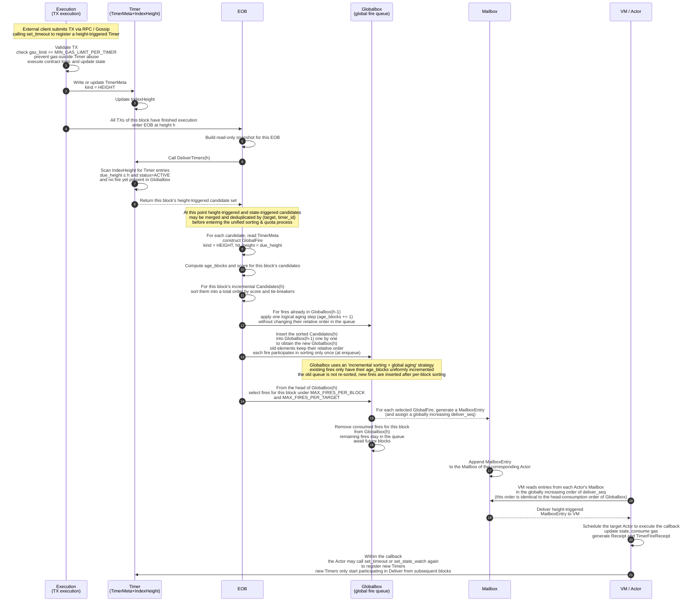
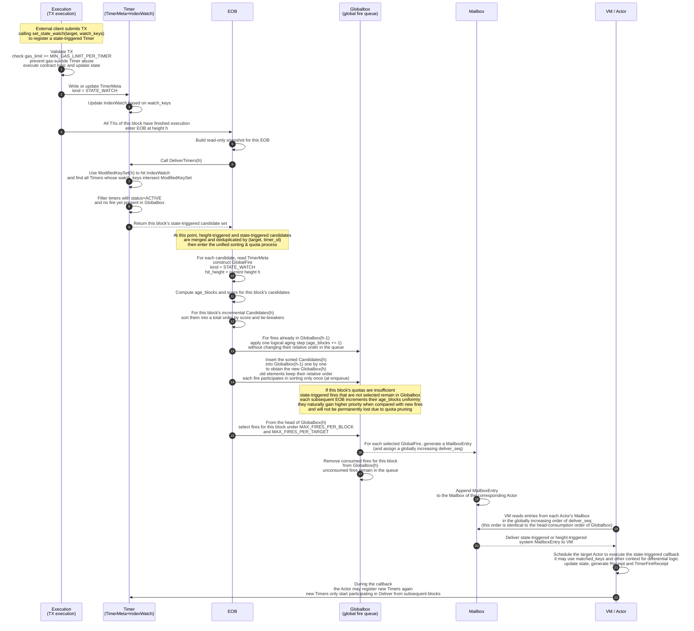

<Note>
  **Status:** Draft
  **Type:** Standards Track
  **Category:** Core
</Note>

## 1. Abstract

This proposal defines Cowboy’s **native Timer mechanism**. Without relying on any external keeper network, it provides contracts/Actors with two trigger capabilities and, at the **End of Block (EOB)**, deterministically filters, materializes, and delivers selected items to each Actor’s **Mailbox**.

To strengthen determinism and keep the design concise, this proposal only supports **height-triggered** and **state-triggered** modes:

- **Height-triggered**: fires when the block height `h` reaches or exceeds `due_height`;
- **State-triggered**: fires when a watched key is modified within the current block.

Under congestion, fairness is achieved via **aging weight (aging) + price signals (optional bidding) + quota-based rate limiting**; enqueueing is idempotent. Metering follows **CIP-3**’s dual-metered market (Cycles/Cells).

**This article focuses on the TX path for triggering Timers. It does not elaborate on the full EOB lifecycle and dynamic fee adjustment, which will be discussed separately.**

---

## 2. Motivation

On-chain systems widely need “on-time/on-condition” callbacks: periodic tasks, maturity liquidations, logic triggered after a given state change, etc. Traditional approaches rely on external keepers/cron/oracles and suffer from unpredictability and weak auditability. A native Timer mechanism should satisfy:

- **Strong determinism**: all nodes produce the same enqueue result at the same height;
- **Fairness and elasticity**: under congestion, schedule by “aging + price signals + quotas” to avoid starvation;
- **DoS resistance**: triggers that are not selected do not occupy the execution queue; pressure is absorbed at the index layer;
- **Scalability**: even with massive numbers of Actors, EOB can complete selection and materialization within milliseconds;
- **Auditable metering**: clear accounting and settlement for resources used by setting/canceling/executing.

---

## 3. Definitions

- **Timer**: a trigger registered for some `target` (Actor). Contains metadata such as `timer_id`, `due_height` or `watch_keys`, `payload`, `gas_limit`, optional `bid`, `owner`, etc.  
- **Fire**: a firing instance of some Timer judged as “to be delivered” at height `h` (with `fire_seq`).  
- **Mailbox**: each Actor’s system message queue. Only **selected fires** are **materialized** into Mailbox entries.  
- **Execution**: the execution engine component responsible for sequentially executing normal transactions (Tx) and system messages (MailboxEntry) within a block; it applies write-sets to update on-chain state during the TX phase, and during EOB schedules Actor callbacks by `deliver_seq` and generates receipts.  
- **Globalbox**: a cross-block persistent **global fire queue**, which is part of consensus state. Each firing instance is enqueued as a `GlobalFire`, kept in order according to the scoring rules. Once enqueued, its relative order is frozen. During each EOB, the system consumes fires from the head of Globalbox subject to quotas to generate Mailbox entries; unconsumed elements remain in the queue for subsequent blocks.  
- **Deterministic ordering (total order)**: an ordering comparator without randomness or local clocks, fully replayable.  
- **Dual-Meter**: separate metering and dynamic base fees for Cycles (execution-time resources) and Cells (state bytes), see **CIP-3**.

---

## 4. Design Overview

- **Transaction (Tx) phase**: only performs **registration/update/cancellation**, e.g., `set_timeout(due_height)`, `set_state_watch(keys)`, `cancel_timer(id)`; no callbacks are executed here.  
- **EOB phase (Deliver → Materialize → Execute)**:  
  1) **Deliver**: according to `due_height ≤ h` and `watch_keys ∩ ModifiedKeySet(h) ≠ ∅`, build the candidate set `Candidates(h)`, sort it by the scoring rules, and insert this block’s incremental candidates into the global ordered queue **Globalbox**;  
  2) **Materialize**: from the head of Globalbox, consume a number of fires under quotas, generate Mailbox entries (assign `deliver_id` / `deliver_seq`, snapshot `payload/gas/bid/trigger_ctx`);  
  3) **Execute**: execute the materialized Mailbox entries in the order of `deliver_seq` (which is consistent with the Globalbox queue order); within the same EOB we only execute a prefix of this global sequence. If periodic behavior is needed, the SDK/Runner issues a new `set_timeout` in subsequent blocks.

---

## 5. State Model & Indexes

### 5.1 Timer metadata (logical structure)

```text
TimerMeta {
  owner: Address,
  target: ActorID,
  timer_id: u256,
  kind: ENUM { HEIGHT, STATE_WATCH }
  due_height: u64?          // HEIGHT only
  watch_keys: [KeyPrefix]?  // STATE_WATCH only
  payload: bytes,
  gas_limit: u64,
  bid_fp: u128 (Q32.96),    // optional bid, fixed-point
  fire_seq: u32,            // number of fires already triggered
  status: ENUM { ACTIVE, COMPLETED, CANCELLED },
  last_fire_height: u64?,   // last height at which this timer fired
  expiry_height: u64?,      // optional: for GC, expiration height
  version: u8
}
```

### 5.2 TimerMeta indexes

- **IndexHeight**: `BTree<(due_height, target, timer_id)> → TimerMetaRef`  
- **IndexWatch**: `Map<KeyPrefix, Set<(target, timer_id)>>`

### 5.3 Global fire queue (Globalbox)

- **Globalbox** is the cross-block persistent global fire queue.  
- **Order frozen after enqueue**: once a `GlobalFire` has been inserted into Globalbox, its relative position in the queue is fixed. Subsequent updates to the corresponding Timer do **not** change the position of this fire in the queue.  
- **Incremental insertion**: each new EOB only sorts the incrementally hit candidate set `Candidates(h)` of the current block, then inserts them one by one into the existing ordered Globalbox queue; existing elements are not re-sorted and act as the ordered baseline.  
- **Head consumption**: during Materialize, Globalbox consumes a number of elements from the head of the queue under quotas to generate MailboxEntry. The remaining elements stay in the queue and participate in scheduling in subsequent blocks.  
- **State snapshot**: Globalbox must be included in `state_root` so that on reorg it can roll back / replay together with the parent state.

---

## 6. API Specification

### 6.1 Set & Cancel

- `set_timeout(target, due_height, payload, gas_limit, bid_fp?) -> timer_id`  
- `set_state_watch(target, watch_keys[], payload, gas_limit, bid_fp?) -> timer_id`  
- `cancel_timer(target, timer_id) -> bool`

**Error codes (examples)**:  
`ERR_INVALID_PARAM`, `ERR_TARGET_NOT_FOUND`, `ERR_TIMER_NOT_FOUND`, `ERR_QUOTA_EXCEEDED`, `ERR_UNSUPPORTED_TIMER_TYPE` (e.g., wall-clock time passed in).

### 6.2 Behavioral constraints

- **Idempotent set**: optionally map `(owner, target, client_nonce)` to a stable `timer_id`.  
- **Update semantics**: for timers that have not yet produced a fire in Globalbox, updating `payload/gas_limit/bid` affects the future fires generated when they are hit; **the queue position of fires already enqueued in Globalbox is not changed by updates**.  
- **Cancel semantics**: takes effect **before** materialization within the same EOB; already materialized entries are unaffected.

---

## 7. Deliver: Trigger Evaluation & Candidate Construction

### 7.1 Rules

- **Height-triggered**: `due_height ≤ h` and the timer has not yet produced a fire in Globalbox;  
- **State-triggered**: `watch_keys ∩ ModifiedKeySet(h) ≠ ∅` and the timer has not yet produced a fire in Globalbox, where `ModifiedKeySet(h)` is the set of keys modified in the current block.

### 7.2 Merge & dedupe

- From `IndexHeight.le(h)` and `IndexWatch[ModifiedKeySet(h)]`, pull candidate `(target, timer_id)` pairs, filter out those that already have a fire in Globalbox, and deduplicate by `(target, timer_id)` to get the incremental set `Candidates(h)` for this block.

### 7.3 Incremental set `Candidates(h)`

- The output of `DeliverTimers(h)` is the incremental candidate set `Candidates(h)` of the current block.  
- These candidates will be scored and sorted as described in Section 8 and then inserted into the global queue **Globalbox**.  
- Existing elements in Globalbox do not participate in sorting again in this block; they serve only as the ordered baseline for insertion.

---

## 8. Scheduling, Fairness & Quotas

### 8.1 Scoring (fixed-point integers)

```text
// Height-triggered
age_blocks = max(0, h - due_height)

// State-triggered
age_blocks = max(0, h - hit_height)

score = W_age * age_blocks + W_bid * bid_fp
```

- `W_age`, `W_bid` are governance parameters.  
- Floating-point numbers and local clocks are prohibited.  
- All fields above come from the same read-only snapshot at the beginning of EOB.  
- For fires that are already queued in Globalbox, once their queue position is determined, it will no longer be re-sorted as height increases; the increase of `age_blocks` mainly shows up in comparison with new fires inserted later.

### 8.2 Total-order comparator (from higher to lower priority)

1. `score` (higher is better);  
2. `priority_bucket` (optional: tier derived from bid or policy);  
3. `per_target_round_robin_cursor` (pure or chain-derived) to ensure fairness;  
4. `due_height` (earlier is better);  
5. `target_id` (lexicographic);  
6. `timer_id` (lexicographic / creation order).

### 8.3 Quotas

- Global: `MAX_FIRES_PER_BLOCK`;  
- Per-target: `MAX_FIRES_PER_TARGET`;  

Algorithm:

- Step 1: sort the incremental candidate set `Candidates(h)` of this block using the total-order comparator in Section 8.2, then insert them one by one into the existing ordered queue `Globalbox(h-1)` to obtain the new queue `Globalbox(h)`. Existing elements are not re-sorted after enqueue; they are used only as the ordered baseline.  
- Step 2: during Materialize, from the head of `Globalbox(h)`, consume fires according to `MAX_FIRES_PER_BLOCK` and `MAX_FIRES_PER_TARGET` to generate this block’s MailboxEntry set; unconsumed fires remain in Globalbox and participate in scheduling in subsequent blocks.  
- The effect of “gaining higher relative priority as `age_blocks` grows” is as follows: timers that mature/hit earlier are inserted into Globalbox earlier. Fires produced later at higher heights have smaller `age_blocks` and `score` when they are inserted, and thus can only be placed later in the queue. There is no need to reshuffle existing elements globally.

---

## 9. Materialization to Mailbox

### 9.1 Mailbox entry structure

```text
MailboxEntry {
  deliver_id = H(h, parent_state_root, timer_id, fire_seq),
  deliver_seq: u64,          // Globalbox global sequence number: monotonically increasing across EOBs, reflecting the stable execution order in Globalbox
  target: ActorID,
  payload_snapshot: bytes,
  gas_limit_snapshot: u64,
  bid_snapshot: u128,
  trigger_ctx: {
    kind: HEIGHT | STATE_WATCH,
    due_height: u64?,
    matched_keys: [Key]?
  }
}
```

### 9.2 Idempotence & deduplication

- `deliver_id` is unique; duplicate materializations are detected and discarded.  
- `fire_seq` is incremented by +1 after each materialization.  
- `deliver_seq` is assigned by Globalbox when consuming elements from the head, monotonically increasing across EOBs and never reused, and is used to restore a stable execution order during replay.  
- The system MAY encode the key fields of each fire into a `TimerFireReceipt` in receipts for long-term audit and accountability.  
- **Materialization only writes system structures (Mailbox and `fire_seq`); it does not modify contract-owned state. Contract state changes only during Execute.**

---

## 10. Execution Semantics

- All materialized Mailbox entries are executed in the global increasing order of `deliver_seq` (this order is equivalent to the queue order in Globalbox and independent of a particular EOB).  
- Failures (e.g., out of gas) still generate receipts and consume metered resources.  
- **Timers created within the current block MUST NOT execute in the same block**, to avoid contextual ambiguity.

---

## 11. Metering & Fees

- **Set/Cancel**: charge **Cycles** (CPU/IO) and necessary **Cells** (index metadata).  
- **Materialize/Execute**: materialization is on the write path but logically idempotent; execution charges Cycles and, if new state is written, Cells.  
- **Settlement**: EOB aggregates dual-meter usage per **CIP-3**; dynamic basefee is applied, basefee is burned, and tips go to the proposer.

---

## 12. Governance-Tunable Parameters

- `MAX_FIRES_PER_BLOCK` (global cap);  
- `MAX_FIRES_PER_TARGET` (per-Actor cap);  
- `W_age, W_bid` (scoring weights);  
- `MIN_GAS_LIMIT_PER_TIMER`, `MAX_PAYLOAD_SIZE` (robustness);  
- `MAX_TIMERS_PER_OWNER / PER_TARGET` (abuse protection).  

These parameters are recommended to be dynamically updatable via governance and take effect at the start of the next governance epoch.

---

## 13. Determinism & Replayability

- `DeliverTimers(h)` depends only on `{ h, parent_state_root, IndexHeight, IndexWatch, ModifiedKeySet(h), Globalbox(h-1) }`.  
- Local randomness, VRF, and wall-clock time are prohibited.  
- The total-order comparator and quota-pruning algorithm contain no implementation-specific branches.  
- `deliver_id = H(h, parent_state_root, timer_id, fire_seq)` ensures idempotence.  
- Upon reorg, Deliver / Materialize / Execute can be **fully replayed** against the new parent state (including Globalbox); the old path naturally becomes invalid.

---

## 14. Security Considerations & DoS Resistance

- **Quotas & backpressure**: non-selected items never enter the Mailbox; pressure is mainly absorbed at the index / Globalbox layer.  
- **Caps & charging**: charging for set/cancel plus per-Owner/Target caps suppress “timer storms”.  
- **Bid gaming**: `bid_fp` only affects ordering and does not guarantee same-block execution; min/max bid bounds may be configured.  
- **State-watch abuse**: limit the number of `watch_keys` and the matching rules; prune the fan-out from a block’s `ModifiedKeySet`.  
- **Reentrancy & idempotence**: the callback side is advised to use `(deliver_id)` for idempotent protection.  
- **Timer GC / TTL**: use `status + last_fire_height + expiry_height` to drive GC policy based on height TTL and Owner/Target limits, avoiding unbounded growth of TimerMeta / Globalbox.  
- **Gas suicide**: set `MIN_GAS_LIMIT_PER_TIMER` to avoid large quantities of guaranteed-to-fail triggers.

---

## 15. Performance & Implementation Notes

- **Index structures**:  
  - `IndexHeight`: B-tree / SkipList;  
  - `IndexWatch`: hash → RoaringBitmap / small set.  
- **EOB candidate scale**: complexity is primarily proportional to the number of new candidates `M_new` per block, rather than the total number of Actors `N` or the historical queue length.  
- **Sorting optimizations**: bucketization on `score/age` for `Candidates(h)` can approximate `O(M_new log M_new)` to `O(M_new)`; the insertion cost into Globalbox depends on the chosen data structure (e.g., SkipList/B+-tree).  
- **Sharded parallelism**: shard Deliver by `hash(target_id) mod S`; each shard performs Top-K selection and then a K-way merge.  
- **Snapshot read-only view**: establish a read-only view at EOB start to avoid concurrent write conflicts and improve predictability.

**Globalbox ordering & aging optimization**

In implementation, Globalbox’s ordering relies on a combination of **incremental sorting + global aging**, instead of performing a full re-sort of all fires in each EOB:

- At EOB of height `h`, we first compute `age_blocks(h)` and `score(h)` only for the new candidate set `Candidates(h)`, and sort these new fires. At this time, the existing Globalbox queue can be regarded as the “remaining parts” from the previous EOB, already sorted by `score(h-1)` and not consumed by the previous block’s quotas.  
- For these existing fires in the queue, this EOB only needs to apply a **single logical aging step**: increase their `age_blocks` by 1 relative to the previous height (or equivalently, reinterpret their age with the current height `h`), **without changing their relative order in Globalbox**. This ensures that:  
  - old fires become “older” in the new EOB and thus naturally gain an advantage when compared with newly inserted fires later;  
  - but since this aging is the same global offset applied to all existing elements, it does not cause any reordering within the old queue itself.  
- Once `Candidates(h)` has been sorted, we simply insert this new batch of fires into the existing Globalbox queue at the appropriate positions (for example using SkipList/B+-tree), obtaining the new ordered queue `Globalbox(h)`.  
- The core benefit of this strategy is that **each fire participates in sorting only once over its lifetime** (when it enters the queue). After that, each EOB involves only O(1) logical aging and bounded-complexity insertion; compared with “reshuffling all old elements together with the new ones for global re-sorting”, this reduces per-EOB sorting cost from `O((Q + M_new) log(Q + M_new))` to `O(M_new log M_new + M_new log Q)`, which significantly lowers sorting overhead under congested conditions where `Q ≫ M_new`.

---

## Appendix: Business Sequence Diagrams for Timer Trigger Conditions

The following two sequence diagrams illustrate the full business flow of height-triggered and state-triggered timers across the six roles: Execution / Timer / EOB / Globalbox / Mailbox / VM.

### Appendix A: Height-triggered Timer Business Sequence Diagram



### Appendix B: State-triggered Timer Business Sequence Diagram


