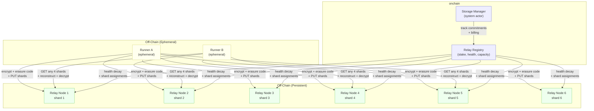
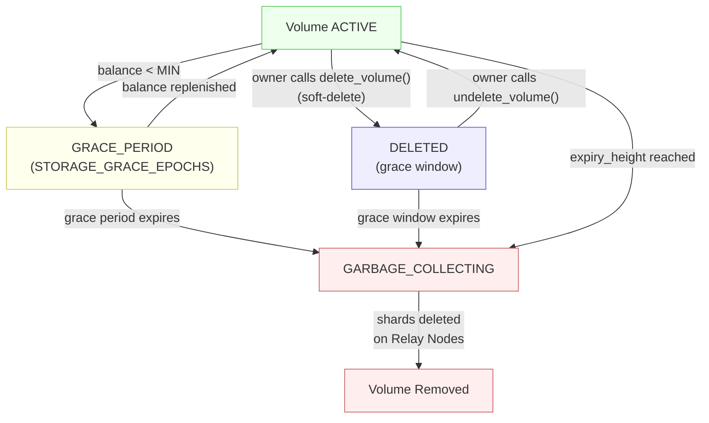

# CIP-9 v2

> **Versioning.** This is v2 of CIP-9. v1 is the canonical document `cip-9-runner-storage.md` (preserved verbatim as Part I). v2 = v1 + the alignment addendum (Part II), which is mostly *additive* over v1 — the bulk of CIP-9 stands unchanged.
>
> **Conflict rule:** Part II is canonical wherever it contradicts Part I.
>
> **Revision history**
>
> - **r2 (2026-05-11)** — **CBFS Merkle algorithm description corrected.** Part II §3 + the v2 changelog line previously claimed "RFC-6962-style imbalanced-tree promotion". Inspection of `cbfs/manifest/src/merkle.rs:32-66` shows the implementation is in fact a **power-of-2 padded BLAKE3 binary Merkle**: leaves `BLAKE3(bincode(ManifestEntry))`, resized to the next power of two with the zero hash `ContentHash([0u8; 32])` (line 44 `leaves.resize(padded_len, ContentHash([0u8; 32]))`), then balanced bottom-up `BLAKE3(left || right)`. Both schemes avoid CVE-2012-2459 (duplicate-last-leaf), but they are different schemes; this r2 changes the spec to match what code actually does. No on-chain root format change — `manifest_root` bytes are unchanged.
> - **r1 (2026-04-21)** — Initial v2 addendum (GET_MANIFEST RPC, ManifestCommitted event, canonical Merkle pin, status mapping, errata).
>
> **Summary of v2 changes**
>
> - **AMEND 9-G**: new `GET_MANIFEST` Relay Node RPC for direct one-round-trip manifest fetch (avoids per-shard reconstruction for public-volume Gateways).
> - **AMEND 9-H**: new `ManifestCommitted` chain event emitted on every successful `commit_manifest`; powers Gateway eager cache invalidation. Polling remains valid as a floor.
> - **§3 (clarification)**: pin canonical manifest serialization to `cbfs/manifest/src/merkle.rs` (existing CBFS bincode + **power-of-2 padded BLAKE3 binary Merkle** — zero-hash padding then balanced bottom-up; **not** Bitcoin-style duplicate-last-leaf, CVE-2012-2459 free).
> - **§5 (clarification)**: map existing CIP-9 status states (`ACTIVE` / `GRACE_PERIOD` / `DELETED` / `GARBAGE_COLLECTING`) to Gateway HTTP serving behavior. **No new `DELINQUENT` status.**
> - **§6 (clarification)**: Gateways are unauthenticated readers under the existing CIP-9 §7.6.3 PUBLIC volume model — not a privileged storage role.
> - **§9 errata**: corrects an over-broad earlier alignment list. The following are NOT missing from CIP-9 (they are all in §11.1 / §12.2 / §7.6 / §13): `StorageCommitment` schema, `commit_manifest` system instruction, `volume_id = keccak256(account_address || volume_name)` formula, `Visibility::Public` model, status state machine.

> **Terminology note (2026-08-15).** The storage engine this CIP calls **"Steamtrain"** was renamed to **CBFS** ("Cowboy File System") and now lives in the `cbfs/` workspace repo (the standalone `steamtrain/` repo was retired; see r2 above, which already cites `cbfs/manifest/src/merkle.rs`). Read every "Steamtrain" below as **CBFS** — the Part I body is preserved verbatim from v1 and is not rewritten. "Relay Node", "manifest", "Volume", "CapToken", and the on-chain wire formats are unchanged by the rename.

---

## Part I — v1 Specification (verbatim from `cip-9-runner-storage.md`)


<Note>
  **Status:** Draft
  **Type:** Standards Track
  **Category:** Core
  **Created:** 2026-03-04
</Note>

## 1. Abstract

This proposal defines **Steamtrain-backed runner storage** — a system for provisioning, addressing, accessing, and billing off-chain storage volumes that are associated with a Cowboy account and made available to Runners during job execution. It extends CIP-2 (Verifiable Off-Chain Compute) by giving Runners persistent, addressable storage that survives beyond a single job invocation.

**Steamtrain** is the storage data plane: encrypted object writes, manifest handling, erasure coding, Relay Node RPCs, placement records, autonomous repair, and the FUSE/object client interfaces. **Cowboy** layers the protocol control plane on top: onchain `StorageCommitment` records, CapToken issuance and revocation, Relay Registry state, billing, and task attachment semantics. Together they form what this document calls Runner Attached Storage (RAS).

Key properties:

- **Account-scoped**: All storage is owned by and billed to a Cowboy account (EOA or Actor).
- **Private by default, public by choice**: Private volumes are encrypted client-side before leaving the Runner; only the owning account can decrypt. Public volumes (`visibility = PUBLIC`) are stored unencrypted and readable by any party without a CapToken, enabling use cases like web asset hosting (CIP-11) and public datasets.
- **Access-controlled**: Runners receive scoped capability tokens granting **read-only**, **write-only**, or **read-write** access to a storage volume. Multiple concurrent CapTokens may be active on the same volume simultaneously. Public volumes require CapTokens only for writes, not reads.
- **Addressable**: Every stored object has a deterministic path within the account's storage namespace, enabling targeted reads and deletes by the account owner.
- **Durable**: Objects are erasure-coded (Reed-Solomon) and distributed across multiple Relay Nodes, tolerating node failures without data loss.
- **Metered**: Storage is billed in CBY via a per-epoch, per-byte fee model (including erasure coding overhead) that extends the Cells concept from CIP-3 to persistent off-chain blobs.

---

## 2. Motivation

Runners in the Cowboy off-chain compute system (CIP-2) are stateless by design — each job executes in an isolated environment and terminates. This creates four concrete gaps:

1. **Secret management.** Runners need access to API keys, certificates, and credentials without exposing them on the public chain. These secrets must only be decryptable by authorized Runners, optionally gated by TEE attestation.

2. **Large off-chain output.** Computation frequently produces artifacts exceeding the 64 KiB onchain inline cap (whitepaper §7). LLM inference may generate images, audio, datasets, or model weights that are too large for `result_data` and inefficient to pass through onchain callbacks. These must be stored off-chain with a verifiable content commitment anchored onchain.

3. **Multi-step data flow.** Iterative computation (AI training loops accumulating weights across invocations), stateful agents (conversation history, tool outputs, learned preferences persisting across scheduling cycles), pipeline handoff (Runner A produces intermediate data consumed by Runner B), and agent swarms (coordinator + concurrent sub-agents sharing a volume) all require persistent, addressable storage between jobs.

4. **Container persistence.** CIP-10 container runtimes require persistent storage layers for stateful applications, databases, and caching across job restarts. Without attachable storage, containers are limited to ephemeral scratch space.

A critical constraint is that **Runners are ephemeral**. Most Runners operate as short-lived containers without persistent local disk and are not guaranteed to remain available after job completion. This means the storage layer must be **separate from the compute layer** — Runners are clients of the storage system, not the storage system itself.

### 2.1 Why not existing systems?

Existing decentralized storage systems offer relevant concepts but none are a direct fit:

| System | Relevant Concept | Limitation for Cowboy Runners |
|--------|-----------------|-------------------------------|
| **Filecoin** | Content-addressed storage deals with proof-of-spacetime | Minimum 180-day deals; sector sealing takes hours; no built-in access control |
| **IPFS** | Content addressing (CID), pinning | No persistence guarantee; no native privacy; deletion only local |
| **Arweave** | Permanent one-time-payment storage | Immutable — no deletion possible; wrong model for ephemeral runner output |
| **Storj** | S3-compatible API; Macaroon-based capability tokens; client-side encryption | Centralized coordination (Satellites); not permissionless; not integrated with onchain billing |
| **Sia** | Encrypted erasure-coded storage with contract-based billing | Contract formation latency; single-renter access model |

RAS draws on the strongest ideas from these systems — **Storj's Macaroon-inspired capability tokens** for scoped access control, **Sia/Storj's erasure coding** for durability, **S3's path-based addressing** for usability, and **Sia's contract-expiry cleanup** as a safety net — while integrating them into a canonical Steamtrain-backed storage layer for Cowboy's account model, Runner framework, and dual-metered fee system.

---

## 3. Definitions

- **Volume**: A named, account-scoped storage namespace. An account may own multiple Volumes. Each Volume is an isolated container for stored objects.
- **Object**: A single blob of data stored within a Volume, identified by a path key.
- **Steamtrain**: The canonical off-chain storage engine used by this CIP. Steamtrain nodes implement the Relay Node data plane and Steamtrain clients implement the object API, manifest handling, and FUSE mount described here.
- **Storage Commitment**: An onchain record that tracks a Volume's existence, owner, size, shard placement, creation epoch, and billing state.
- **Capability Token (CapToken)**: A cryptographic bearer token encoding the permissions (read-only, write-only, or read-write), scope (volume + path prefix), time bounds, and size quota for a Runner's access to a Volume.
- **Relay Node**: A Steamtrain storage node participating in the Cowboy network that persistently stores erasure-coded shards of Volume data. Relay Nodes are a distinct network role from Runners and Validators, with their own staking and incentive model.
- **Shard**: A fragment of an erasure-coded object. An object is split into K data shards and M parity shards (K+M total); any K shards are sufficient to reconstruct the original object.
- **ObjectDescriptor**: The immutable content-identity record for a stored object. Contains the path, content hash, ciphertext hash, encryption nonce, size, erasure parameters, and per-shard hashes. Stored inside the encrypted manifest via `ManifestEntry::File`.
- **PlacementRecord**: The mutable shard-to-node assignment record for a stored object. Contains a `shard_id`, a list of `PlacementAssignment` (shard_index → node_id), duplicated erasure params and shard hashes (so repair workers can operate without manifest access), a `ciphertext_size` (the pre-padding ciphertext length needed for correct erasure reconstruction), and a CAS `version` for atomic updates. Replicated to all participating Relay Nodes independently of the manifest.

---

## 4. Design Overview

### 4.1 Architecture

Runners are ephemeral compute nodes. They do not store data persistently. Instead, a network of **Steamtrain Relay Nodes** provides durable, always-available storage. Runners write to and read from Relay Nodes over the network during job execution.



### 4.2 Lifecycle

1. **Create**: Account owner creates a Volume via the Storage Manager system actor, specifying a name, optional size quota, and replication parameters. An onchain Storage Commitment is written.
2. **Attach**: When submitting a CIP-2 task, the owner includes one or more volume attachments in the task definition, each specifying the volume name, access mode (read-only, write-only, or read-write), and an optional path prefix scope.
3. **Authorize**: The Dispatcher (or a delegated Storage Manager) issues a CapToken to each selected Runner. The token is scoped to the specified volume, access mode, path prefix, job duration, and byte quota.
4. **Write**: The Runner encrypts object data, erasure-codes it into K+M shards, and distributes shards to Relay Nodes. Shards are immediately available for retrieval by other CapToken holders on the same volume.
5. **Read**: The Runner fetches any K of K+M shards from Relay Nodes, reconstructs the object, decrypts, and verifies the content hash.
6. **Commit**: At job completion (or periodically), the Runner commits a storage manifest — a Merkle root of all objects written — to the onchain Storage Commitment.
7. **Manage**: The account owner can list, read, and delete individual objects or entire Volumes at any time via the Storage Manager.

### 4.3 Canonical Implementation Boundary

This CIP is intentionally split into a **Steamtrain data plane** and a **Cowboy control plane**. Both are normative parts of a conforming CIP-9 implementation.

**Steamtrain data plane responsibilities:**

- Object encryption/decryption for `PRIVATE` volumes and plaintext handling for `PUBLIC` volumes.
- Reed-Solomon erasure coding, shard hashing, and shard placement records.
- Relay Node RPCs (`PUT_SHARD`, `GET_SHARD`, `LIST_SHARDS`, placement replication, repair traffic).
- Manifest storage, reconstruction, Merkle root computation, and verification against the authoritative root.
- FUSE mount behavior, local cache, sync daemon, and direct object API.
- Shard repair, garbage collection of orphan shards, and local usage reporting hooks.

**Cowboy control plane responsibilities:**

- `StorageCommitment` lifecycle, authoritative `manifest_root`, and volume ownership semantics.
- CapToken issuance, revocation, and task-scoped attachment semantics.
- Relay Registry membership, staking, health, and repair coordination triggers.
- Billing, fee settlement, storage grace periods, and slashing policy.
- Integration with CIP-2 task submission and the Runner execution flow.

In other words: Steamtrain is the canonical storage substrate; CIP-9 specifies how Cowboy governs, authorizes, and pays for that substrate.

### 4.4 Relationship to Existing CIPs

- **CIP-2 (Off-Chain Compute)**: RAS extends the `OffchainTask` definition to include volume attachments. The Runner Submission Contract is extended to accept storage manifests alongside `result_data`.
- **CIP-3 (Fee Model)**: RAS introduces a new fee dimension — **persistent storage fees** — billed per byte per epoch (including erasure overhead). Unlike CIP-3 Cycles and Cells (which are metered by the VM during transaction execution), storage usage is metered externally by Relay Nodes and settled onchain via attestation-based billing.
- **CIP-4 (State Storage)**: onchain Storage Commitments live in the existing `STORAGE` key space under the Storage Manager actor's address. Volume data itself is NOT stored in the MPT trie.
- **CIP-10 (Runner Container Runtime)**: CIP-10 consumes the storage primitive defined here. Container image handling, cgroups, network policy, and GPU passthrough are separate concerns; volume attachment, mount semantics, and the object API are defined by CIP-9 and then mounted into CIP-10 runtimes.

---

## 5. Relay Nodes

### 5.1 Role and Responsibilities

Relay Nodes are a **new network participant role**, distinct from Runners and Validators. In v1 they are implemented as Steamtrain storage nodes. A Relay Node:

- Stores erasure-coded shards of encrypted Volume data.
- Stores `PlacementRecord` entries that map shard IDs to their assigned nodes (see §5.3.1).
- Serves shards and placement records to authorized requesters (Runners with valid CapTokens, account owners).
- Heartbeats to the onchain Relay Registry to prove liveness.
- Runs autonomous two-phase repair (self-heal + redundancy restoration) without Runner involvement (see §5.5).
- Replicates PlacementRecords to peer nodes via `ReplicatePlacement` RPCs.

Relay Nodes hold opaque ciphertext shards and never see plaintext. They verify CapTokens to gate access to both shard and placement operations (§7.1.1) but perform no computation on the data beyond repair.

### 5.2 Relay Registry

The Relay Registry is a system contract (analogous to the Runner Registry in CIP-2) that manages Relay Node registration, staking, health, and capacity.

```
RelayNodeProfile {
  address:           bytes32,
  stake_amount:      u256,           // CBY staked
  capacity_bytes:    u64,            // advertised storage capacity
  used_bytes:        u64,            // current usage
  last_heartbeat:    u64,            // block height
  health:            u8,             // decays per block, reset on heartbeat
  shards_held:       u32,            // number of active shards
  shards_lost:       u32,            // historical shard losses (reputation)
  region_hint:       bytes4          // optional: geographic hint for latency optimization
}
```

**Lifecycle:**

- **Register**: Relay Node stakes `MIN_RELAY_STAKE` CBY and calls `register_relay(capacity_bytes)`.
- **Heartbeat**: Relay Node calls `heartbeat()` periodically. Health resets to `MAX_RELAY_HEALTH` (e.g., 100 blocks). Health decays by 1 per block.
- **Removal**: If health reaches 0, the Relay Node is removed from the active list. Shards assigned to it are flagged for repair (see §5.5).
- **Unstake**: A Relay Node may unstake after a cooldown period (`RELAY_UNSTAKE_DELAY`), provided it has no active shard assignments or has transferred them.

### 5.3 Shard Assignment

When a Runner writes an object, it must select K+M Relay Nodes to receive shards. Selection follows these rules:

1. **Eligible set**: All Relay Nodes in the active list with `health > MIN_HEALTH_FOR_ASSIGNMENT` and sufficient free capacity.
2. **Diversity**: Selected nodes SHOULD have distinct `region_hint` values (best-effort, not enforced in v1).
3. **Determinism**: The initial assignment is recorded in the object's PlacementRecord (replicated to Relay Nodes, §5.3.1) so any future reader or repair worker knows which Relay Nodes hold which shards.

Each stored object produces two records: an **ObjectDescriptor** (immutable, stored in the encrypted manifest) and a **PlacementRecord** (mutable, replicated to Relay Nodes independently of the manifest).

```
ObjectDescriptor {
  object_path:      string,
  write_id:         bytes16,          // CSPRNG(16) — fresh random per write, ensures version isolation
  content_hash:     bytes32,          // BLAKE3 hash of plaintext
  ciphertext_hash:  bytes32,          // BLAKE3 hash of ciphertext (pre-erasure-coding)
  encryption_nonce: bytes12,          // random nonce used for AES-256-GCM (unique per write)
  size_bytes:       u64,              // original object size
  ciphertext_size:  u64,              // ciphertext length before erasure padding (needed for correct reconstruction)
  shard_id:         bytes32,          // BLAKE3(volume_id || object_path || write_id) — opaque, version-unique
  erasure_k:        u8,
  erasure_m:        u8,
  shard_hashes:     [bytes32; K+M],   // BLAKE3 hash of each shard
}
```

```
PlacementRecord {
  shard_id:         bytes32,          // matches ObjectDescriptor.shard_id
  version:          u64,              // CAS version — monotonically incremented on each reassignment
  assignments: [
    { shard_index: u8, node_id: bytes32 },
    ...  // K+M entries
  ],
  // Duplicated from ObjectDescriptor so repair workers can operate
  // without manifest access (critical for private volumes where the
  // manifest is encrypted):
  erasure_k:        u8,
  erasure_m:        u8,
  ciphertext_size:  u64,
  shard_hashes:     [bytes32; K+M],
}
```

**Why two records?** The manifest is encrypted for private volumes — repair workers (Relay Nodes) cannot read it. By replicating the erasure params, shard hashes, and `ciphertext_size` into the PlacementRecord, Relay Nodes can autonomously verify, reconstruct, and reassign shards without ever touching the manifest. The CAS `version` field enables atomic reassignment: a repair worker reads the current version, computes a new assignment, and writes with `expected_version = current`; if another node raced, the write fails and the worker retries.

The `write_id` ensures that overwrites to the same object path produce distinct shard addresses. Without it, overwriting a path would physically replace the old shards on Relay Nodes, destroying the only retrievable copy of the previous version. This would break rollback after failed commits, concurrent writers to overlapping paths, and reads from old manifests. With `write_id`, old shards remain on Relay Nodes until the new manifest commits and the old shards become orphans (garbage collected after `ORPHAN_SHARD_TTL`).

### 5.3.1 Placement Persistence

PlacementRecords are replicated to Relay Nodes independently of the manifest via three dedicated RPCs:

| RPC | Purpose |
|-----|---------|
| `PutPlacement(shard_id, record)` | Store or update a PlacementRecord. Used by the SDK during commit and by repair workers during reassignment. |
| `GetPlacement(shard_id)` | Fetch a PlacementRecord by shard ID. Used by the SDK during open/refresh and by repair workers. |
| `ReplicatePlacement(shard_id, record)` | Node-to-node replication during placement sync. |

All three RPCs are auth-gated by the same `AuthProvider` as shard operations (§7.1.1).

**Commit path:** When the SDK commits a volume, it publishes each PlacementRecord to all assigned Relay Nodes via `PutPlacement`. Failures are logged but do not block the commit — placement is best-effort during commit and self-heals via repair.

**Open path:** When the SDK opens a volume, it queries Relay Nodes for PlacementRecords via `GetPlacement` for each shard ID in the manifest. For any shard where no Relay Node returns a record (e.g., first open of a migrated volume), the SDK falls back to constructing an assumed placement from the node selector.

### 5.4 Erasure Coding

RAS uses **Reed-Solomon erasure coding** to distribute each object across multiple Relay Nodes.

**Default parameters (governance-tunable, overridable per-volume):**

| Parameter | Default | Description |
|-----------|---------|-------------|
| K (data shards) | 4 | Minimum shards to reconstruct |
| M (parity shards) | 2 | Additional parity shards |
| K+M (total shards) | 6 | Distributed to 6 distinct Relay Nodes |
| Storage overhead | 1.5x | Account is billed for effective_size × 1.5 |

**Write path (performed by the Runner):**

1. Generate `write_id = CSPRNG(16)` and compute `shard_id = BLAKE3(volume_id || object_path || write_id)`.
2. Encrypt the object (AES-256-GCM, see §9). Record `ciphertext_size` (pre-padding length).
3. Erasure-code the ciphertext into K data shards and M parity shards using Reed-Solomon (`reed-solomon-erasure` crate).
4. Compute `shard_hash = BLAKE3(shard_bytes)` for each shard.
5. Select K+M Relay Nodes and PUT each shard to its assigned node, authenticated by the CapToken.
6. Produce an `ObjectDescriptor` (stored in the manifest) and a `PlacementRecord` (published to Relay Nodes at commit time, §5.3.1).

**Read path (performed by the Runner):**

1. Look up the `ObjectDescriptor` from the manifest and the `PlacementRecord` (from local cache or fetched from Relay Nodes via `GetPlacement`).
2. Request any K shards from available Relay Nodes listed in the PlacementRecord (prefer lowest-latency nodes; fall back if some are unavailable).
3. Reconstruct the ciphertext using Reed-Solomon decoding, truncating to `ciphertext_size` to remove erasure padding.
4. Verify `ciphertext_hash`.
5. Decrypt (AES-256-GCM).
6. Verify `content_hash`.

**Comparison with other systems:**

| System | Scheme | Total Shards | Reconstruct From | Overhead |
|--------|--------|:------------:|:----------------:|:--------:|
| **RAS (default)** | Reed-Solomon 4/6 | 6 | any 4 | 1.5x |
| Storj | Reed-Solomon 29/80 | 80 | any 29 | 2.7x |
| Sia | Reed-Solomon 10/30 | 30 | any 10 | 3.0x |
| AWS S3 | Proprietary (3+ AZ replication) | — | — | ~3x |

The 4/6 default is conservative for v1. Accounts may opt for higher redundancy (e.g., 6/10 for 1.67x overhead, or 10/16 for 1.6x) via volume creation parameters. Governance may adjust the defaults as the Relay Node network matures.

### 5.5 Autonomous Shard Repair

Repair runs on the Relay Nodes themselves — no Runner involvement and no onchain timer required. Each Relay Node periodically inspects the PlacementRecords it holds and executes a two-phase repair cycle:

**Phase 1 — Self-heal (local shard verification):**

For each PlacementRecord where this node is an assigned holder:

1. Verify the local shard bytes against the expected `shard_hash` from the PlacementRecord.
2. If the shard is missing or corrupt, fetch K healthy shards from peer Relay Nodes listed in the same PlacementRecord.
3. Reconstruct the ciphertext using Reed-Solomon decoding, truncating to `ciphertext_size` (not the padded shard length — using the wrong length produces garbage).
4. Re-encode and extract the needed shard. Verify its hash. Store locally.

Self-heal is safe for any node to run concurrently — it only writes to local storage and does not modify the PlacementRecord.

**Phase 2 — Redundancy repair (dead node replacement):**

1. For each PlacementRecord, probe all assigned nodes. A node is considered dead if it is unreachable after the configured timeout.
2. **Leader election**: Only the assigned node with the **lowest `shard_index`** among live nodes drives reassignment for that PlacementRecord. This prevents multiple nodes from racing to repair the same shard.
3. The leader selects replacement node(s) from the known peer list (excluding already-assigned nodes).
4. The leader reconstructs the missing shard(s) from K surviving shards (same erasure reconstruction as Phase 1) and uploads via `PutShard` to the replacement node(s).
5. The leader writes an updated PlacementRecord with the new assignments and an incremented `version`, using a **CAS (Compare-and-Swap) write**: the `PutPlacement` RPC specifies `expected_version = current_version`. If another node raced and already updated the record, the CAS fails and the leader retries from step 1 on the next cycle.
6. The updated PlacementRecord is replicated to all assigned nodes via `ReplicatePlacement`.

**Failure tolerance**: With K=4, M=2, the system tolerates **any 2 simultaneous Relay Node failures** per object without data loss. If 3+ nodes holding shards of the same object fail before repair completes, the object is lost. Repair cycle frequency should be tuned aggressively (default: `REPAIR_CHECK_INTERVAL` blocks) to keep this window small.

**No Runner or onchain involvement**: Repair is fully autonomous. Relay Nodes read PlacementRecords (which contain all the information needed — erasure params, shard hashes, ciphertext_size, assignments), reconstruct shards from peers, and update placements via CAS. The onchain `StorageCommitment.degraded_shards` counter is updated by Relay Node heartbeats as a reporting mechanism, not a repair trigger.

### 5.6 Proof of Retrievability (PoR) Challenges

Heartbeats prove liveness but not retrievability — a Relay Node could be alive but have lost or withheld data. RAS uses **random PoR challenges** to verify that Relay Nodes actually hold the shards they claim to hold.

**Challenge mechanism:**

1. A periodic onchain timer (CIP-5, every `POR_CHALLENGE_INTERVAL` blocks) selects a random set of `(shard_id, shard_index, byte_offset, byte_length)` tuples targeting active Relay Nodes.
2. The challenged Relay Node must respond within `POR_RESPONSE_WINDOW` blocks with:
   - The requested byte range of the specified shard.
   - A **Merkle proof chain** linking the byte range to the onchain `manifest_root`:
     1. `byte_range_proof`: Merkle proof from the byte range to the `shard_hash`.
     2. `shard_inclusion_proof`: Merkle proof from the `shard_hash` to the `manifest_root` stored in the volume's onchain `StorageCommitment`.
3. The onchain verifier checks the full proof chain:
   - Verify `BLAKE3(byte_range_data)` matches the leaf in `byte_range_proof`.
   - Verify `byte_range_proof` resolves to `shard_hash`.
   - Verify `shard_inclusion_proof` resolves to the onchain `manifest_root`.
   - If any step fails, the response is invalid.

This two-level proof chain is necessary because only `manifest_root` is stored onchain (§12.2) — individual `shard_hash` values live in the off-chain manifest. The proof chain binds the challenged bytes all the way to the onchain commitment without requiring the chain to store per-shard metadata.

**Concurrent manifest updates:** If a volume's manifest is updated between challenge issuance and response, the Relay Node must provide proofs against the `manifest_root` that was active at challenge time. The challenge includes the `manifest_root` snapshot as a reference. If the challenged shard was removed by a manifest update during the response window, the challenge is voided (no penalty).

**Failure and slashing:**

| Outcome | Consequence |
|---------|-------------|
| Valid response within window | No action; challenge passed |
| No response within window | `shards_lost` incremented; shard flagged for repair; `POR_MISS_PENALTY` slashed from stake |
| Invalid response (proof mismatch) | `shards_lost` incremented; shard flagged for repair; `POR_FRAUD_PENALTY` slashed from stake (higher than miss penalty) |
| 3+ consecutive misses | Relay Node removed from active list; all shards flagged for repair; `RELAY_EVICTION_PENALTY` slashed |

**Design rationale:** This is a lightweight PoR scheme — it does not require the full Filecoin-style Proof-of-Spacetime (which seals sectors and requires constant re-proving). Instead, it spot-checks random byte ranges, making it cheap to verify but expensive to fake. A Relay Node that has genuinely stored the shard can respond trivially; one that has discarded it cannot.

**Challenge economics:** Challenges are funded from the storage fee pool — 2% of every per-epoch storage-fee batch accrues to the PoR challenge pool at `0x0B` (`STORAGE_FEE_CHALLENGE_POOL_BPS = 200`, formerly `POR_CHALLENGE_FEE_SHARE`; canonical split in §10.4 and CIP-31 §4).

**Challenge bond (required as of CIP-31).** Calling `por_challenge(shard_id, byte_offset, byte_length)` requires the caller to escrow `RELAY_CHALLENGE_BOND` (default 10 CBY, Tier-0 tunable; see CIP-31 §7) at `0x0B` for the duration of the challenge window. Lifecycle:

- **Valid response within `POR_RESPONSE_WINDOW`:** bond is refunded minus `POR_CHALLENGE_FEE` (default 1 CBY, retained by `0x0B`).
- **Miss or fraudulent response:** bond is refunded in full, **and** the challenger additionally receives `CHALLENGER_BOUNTY` (default 5 CBY) from the PoR challenge pool. The Relay's slash (`POR_MISS_PENALTY` / `POR_FRAUD_PENALTY` / `RELAY_EVICTION_PENALTY`) follows the same 10/2/88 burn/challenge-pool/Relay-pro-rata split as storage fees, with the slashed Relay excluded from the 88% distribution that epoch (CIP-31 §8).

The bond + per-challenge fee make speculative or griefing challenges economically irrational while ensuring that any challenger who provokes a real miss is net-positive (`+5 bounty − 1 fee = +4 CBY`).

### 5.7 Relay Node Incentives

Relay Nodes earn fees from two sources:

1. **Storage fees**: A share of the per-epoch storage fee paid by the account owner, proportional to the number and size of shards held.
2. **Transfer fees**: A per-byte fee for serving shards to Runners (read bandwidth).

Fee distribution:

```
Per epoch, for each volume:
  total_storage_fee = volume_effective_size * STORAGE_FEE_PER_BYTE_PER_EPOCH
  per_relay_share = total_storage_fee / num_relay_nodes_holding_shards

Per read operation:
  transfer_fee = bytes_served * TRANSFER_FEE_PER_BYTE
  (paid to the specific Relay Node serving the shard)
```

Relay Nodes that lose shards (detected via failed PoR challenges or repair triggers) have their `shards_lost` counter incremented and stake slashed per §5.6. High `shards_lost` degrades reputation and may reduce future shard assignments.

---

## 6. Storage Addressing

### 6.1 Path-Based Namespace

Every object in RAS is addressed by a three-part key:

```
/{account_address}/{volume_name}/{object_path}
```

- **account_address**: The 32-byte Ed25519 public key of the owning account (hex-encoded).
- **volume_name**: A UTF-8 string (max 64 bytes, restricted to `[a-zA-Z0-9_\-.]`).
- **object_path**: A UTF-8 string (max 512 bytes) using `/` as a logical separator. No leading or trailing `/`.

Examples:
```
/0xaabb...ccdd/model-weights/v3/layer_0.bin
/0xaabb...ccdd/agent-memory/conversations/2026-03-04/session_1.cbor
/0xaabb...ccdd/pipeline-scratch/job_4821/intermediate.parquet
```

### 6.2 Content Integrity

Each stored object is tagged with two hashes:

```
content_hash    = BLAKE3(plaintext_bytes)       // verifies decrypted content
ciphertext_hash = BLAKE3(ciphertext_bytes)      // verifies pre-erasure-coding ciphertext
shard_hash[i]   = BLAKE3(shard_bytes[i])        // verifies individual shards
```

BLAKE3 is used throughout (rather than keccak256) for content hashing because it is faster, parallelizable, and the integrity checks happen offchain where onchain compatibility is not a concern.

The storage manifest committed onchain is a Merkle root computed over all ObjectDescriptor entries in the volume, sorted lexicographically by `object_path`. This enables:

- **Integrity verification**: Any party can verify the full object lifecycle — shard hashes verify individual shards, ciphertext hash verifies reconstruction, content hash verifies decryption.
- **Efficient proofs**: A Merkle proof for a single object is O(log N) in the number of objects.

### 6.3 Addressing for Deletion

The account owner deletes objects by their full path:

```
delete_object(volume_name, object_path) -> bool
delete_volume(volume_name) -> bool
```

- `delete_object` marks all shards of the object for removal on the assigned Relay Nodes and updates the onchain manifest. Relay Nodes garbage-collect the shard data.
- `delete_volume` marks all objects for deletion and removes the onchain Storage Commitment. Storage fees cease immediately.
- Only the account owner (or an Actor acting on behalf of the account) may delete. Runners are never granted delete permission, even under read-write mode — this prevents malicious or compromised Runners from destroying data.

---

## 7. Access Control

### 7.1 Capability Tokens

Access to a Volume is mediated by **Capability Tokens (CapTokens)**, inspired by Storj's Macaroon system and UCANs. A CapToken is a compact, cryptographically signed structure encoding:

```
CapToken {
  volume_id:      bytes32,          // keccak256(account_address || volume_name)
  access_mode:    ENUM { READ_ONLY, WRITE_ONLY, READ_WRITE },
  path_prefix:    string,           // scope to objects under this prefix (e.g., "agent-3/")
  max_bytes:      u64,              // maximum total bytes writable
  valid_from:     u64,              // block height
  valid_until:    u64,              // block height (job timeout)
  runner_address: bytes32,          // the specific Runner authorized
  nonce:          u64,              // prevents replay
  signature:      bytes64           // Ed25519 signature by account owner (or delegated Storage Manager)
}
```

Note: For `PUBLIC` volumes (§7.6), CapTokens are required only for write access. Reads and listings are open to any party without a token, making READ_ONLY CapTokens unnecessary for public volumes.

### 7.1.1 Auth Enforcement on Placement RPCs

All three placement RPCs (`GetPlacement`, `PutPlacement`, `ReplicatePlacement`) are auth-gated by the same `AuthProvider` that gates shard operations. A request without a valid token (or with an expired/revoked token) is rejected before the Relay Node reads or writes any placement data.

This is critical because PlacementRecords contain shard-to-node mappings — leaking them would reveal which nodes hold which shards for a volume, enabling targeted denial-of-service against specific Relay Nodes. For public volumes, placement reads follow the same open-access model as shard reads (§7.6.3).

### 7.2 Access Modes (CapToken Scopes)

The following modes apply to **CapToken-gated access** on private volumes:

| Mode | Read Objects | Write Objects | List Objects | Delete Objects |
|------|:-----------:|:------------:|:------------:|:-------------:|
| **READ_ONLY** | Yes | No | Yes | No |
| **WRITE_ONLY** | No | Yes | No | No |
| **READ_WRITE** | Yes | Yes | Yes | No |

**WRITE_ONLY** is the default and preferred mode for most Runner jobs. It allows the Runner to produce output without being able to inspect existing data in the volume. This minimizes the trust surface.

**READ_ONLY** is appropriate when a Runner needs to consume data without modifying it — for example, reading a dataset, loading model weights for inference (not training), or a verifier checking another agent's output. Because the Runner cannot write, there is no risk of data corruption or quota exhaustion.

**READ_WRITE** is required when a Runner needs to both consume and produce data in the same volume (e.g., reading prior model weights to continue training, reading an agent's memory and updating it, or a coordinator agent reading reports from sub-agents and writing a synthesis).

> **Note — Public volumes:** Volumes with `visibility = PUBLIC` use a different access model. Reads and listings are open to any party without a CapToken. Writes still require a CapToken (WRITE_ONLY or READ_WRITE). See §7.6 for the full `PUBLIC` volume specification.

### 7.3 Concurrent CapTokens

Multiple CapTokens may be active on the same volume simultaneously. This is essential for the **agent swarm** pattern, where a coordinator Runner holds a READ_WRITE token while multiple sub-agent Runners hold WRITE_ONLY tokens scoped to disjoint path prefixes.

Rules for concurrent access:

- **Non-overlapping write prefixes**: If two CapTokens grant WRITE access, their `path_prefix` values MUST NOT overlap. The Dispatcher enforces this at token issuance.
  - **Prefix canonicalization**: Prefixes are canonicalized by ensuring a trailing `/` separator. A prefix `agent-1` is stored as `agent-1/`. This prevents ambiguity: `agent-1/` and `agent-10/` are non-overlapping; `agent-1/` and `agent-1/sub/` DO overlap (the first is a parent of the second). Overlap is defined as: prefix A overlaps prefix B if A is a prefix of B or B is a prefix of A (after canonicalization).
  - **Empty prefix** (`""`) means full volume access. No other WRITE CapToken may be active on the volume simultaneously if any token has an empty prefix.
- **Reads never conflict**: READ_ONLY tokens may coexist with any number of other READ_ONLY or WRITE tokens. A READ_WRITE token may read paths being written by other tokens.
- **No total ordering of writes**: Concurrent writes to different paths are independent. There is no global write ordering across CapTokens.
- **CapToken revocation**: A CapToken can be revoked before its `valid_until` by the Dispatcher recording the token's `nonce` in a revocation list. Relay Nodes check the revocation list on each request. Writes in-flight at revocation time may or may not land; the next manifest commit determines the canonical state. Revocation is best-effort and convergent — Relay Nodes may serve a revoked token briefly until the revocation propagates.

#### 7.3.1 Prefix Enforcement Boundaries

Prefix enforcement operates across three layers, each with different trust properties:

**Layer 1 — Issuance-time checking (onchain, strong).**
When the Dispatcher issues a new WRITE CapToken, it checks the requested `path_prefix` against all active WRITE CapTokens on the same volume. If the new prefix overlaps an existing one (per the overlap definition above), issuance is rejected. This is an onchain check and is fully trustworthy.

**Layer 2 — Coordinator verification (off-chain, detection).**
The coordinator (the entity holding the READ_WRITE CapToken) reads the committed manifest after each sub-agent's `commit_manifest()` and verifies that all object paths fall within the sub-agent's authorized prefix. If any path violates the prefix, the coordinator revokes the offending CapToken and may dispute the Runner.

**Important**: This layer is **detection, not prevention**. A rogue sub-agent can call `commit_manifest()` with out-of-prefix paths, and the chain will accept the commit — the `manifest_root` becomes canonical onchain. The coordinator discovers the violation only on its next manifest read. The coordinator's recourse is:

1. **Revoke** the offending sub-agent's CapToken (preventing further writes).
2. **Re-commit** a corrected manifest that excludes the unauthorized objects.
3. **Dispute** the Runner via the job settlement mechanism (CIP-2), potentially slashing the Runner's stake.

Between the rogue commit and the coordinator's corrective commit, other readers (if any) will see the unauthorized objects. This window is bounded by the coordinator's poll interval (§12.1.3).

The chain **cannot** verify prefix compliance directly because:
1. **Privacy conflict**: For private volumes, the manifest is encrypted — object paths are not visible onchain. Requiring the chain to verify paths would reveal them, contradicting the privacy guarantees in §9.3.
2. **Sampling is insufficient**: Even for public volumes, randomly sampling paths from the manifest and checking they fall within the prefix cannot prove the *absence* of unauthorized paths. A rogue Runner could include 1,000 valid paths and 1 unauthorized path; sampling would likely miss it.

Instead, the coordinator — who already holds the DEK and can decrypt the manifest — is the natural verifier. This is consistent with the trust model: the coordinator issued the sub-agent's CapToken and is responsible for the sub-agent's behavior.

**Layer 3 — Write-time (Relay Nodes, weak).**
Relay Nodes receive `PUT_SHARD` requests keyed by opaque `shard_id` values (`BLAKE3(volume_id || object_path || write_id)`). Because the shard ID is a one-way hash, **Relay Nodes cannot verify whether the underlying object path falls within the CapToken's prefix**. A Relay Node can verify that the CapToken is valid (signature, expiry, volume ID, write permission) but NOT that the write targets an authorized path. Prefix enforcement at the Relay Node layer is therefore **not possible by design** — this is the cost of shard ID opacity (§16.4), which protects object-path privacy.

**Consequence — junk-shard waste vector.**
Between `PUT_SHARD` and `commit_manifest()`, a rogue Runner holding a CapToken scoped to `agent-1/` could write shards for paths outside its prefix (e.g., `agent-2/poison.dat`). These out-of-prefix shards land on Relay Nodes but can never be meaningfully committed — the coordinator will detect the violation on manifest read and revoke the CapToken. The waste is bounded by the CapToken's `max_bytes` quota, which limits total shard bytes the Relay Node will accept for that token. Orphan shards (written but never referenced by a committed manifest) are garbage collected by Relay Nodes after `ORPHAN_SHARD_TTL` (§14).

**Summary:**

| Layer | Verifier | Strength | What it checks |
|-------|----------|----------|----------------|
| Issuance | Onchain Dispatcher | **Prevention** | No overlapping prefixes among active CapTokens |
| Commit | Coordinator (off-chain) | **Detection** | All committed paths fall within the writer's prefix (post-hoc; rogue commits are possible until corrected) |
| Write | Relay Nodes | **None** | CapToken is valid (but not prefix compliance) |

### 7.4 Caveats and Restrictions

CapTokens support **additive caveats** (restrictions can be appended but never removed):

- **Path prefix narrowing**: A CapToken scoped to `job_4821/` can be further restricted to `job_4821/checkpoints/` but never broadened to `/`.
- **Byte quota reduction**: A 1 GiB quota can be reduced to 512 MiB but never increased.
- **Time window narrowing**: The valid window can be shortened but never extended.

This enables delegation chains: the Storage Manager issues a broad CapToken to the Dispatcher, which narrows it per-job before passing it to the Runner.

### 7.5 Read Consistency

All reads are **READ_COMMITTED**: objects are visible only after the writing Runner has committed a manifest onchain that includes the object's ObjectDescriptor.

**Manifest verification (mandatory)**: When a Runner fetches a manifest from Relay Nodes, it MUST:

1. Fetch K shards of the manifest from Relay Nodes and reconstruct it.
2. Compute the Merkle root of the reconstructed manifest.
3. Compare the computed root to the onchain `manifest_root` in the volume's `StorageCommitment`.
4. **Reject on mismatch.** A mismatched root means the fetched manifest is stale, partially published, or corrupted.

This verification rule is the mechanism behind READ_COMMITTED: even though the manifest shard address is stable and overwritten on each commit, readers never trust fetched manifest data without checking it against the onchain root. The onchain `manifest_root` is the single source of truth.

This prevents dirty-read attacks: a malicious or buggy sub-agent could write garbage data and publish a manifest with it, but until `commit_manifest()` succeeds onchain, no reader will accept that manifest because its root won't match the onchain commitment.

> **Future work — READ_UNCOMMITTED**: A mode where objects are visible as soon as shards land on Relay Nodes (before `commit_manifest()`) is desirable for the real-time agent swarm pattern, where latency matters more than strict consistency. However, it is not implementable on the current design for two reasons:
>
> 1. **Discovery**: With versioned shard IDs (§5.3, `write_id` in the shard address), a reader cannot predict the `shard_id` for an uncommitted write — they don't know the writer's random `write_id`. Discovering uncommitted objects requires a separate metadata channel (pubsub or uncommitted manifest fragments) that this spec does not yet define.
> 2. **Prefix safety**: Without the coordinator verifying the committed manifest, a reader could observe out-of-prefix garbage from a rogue writer.
>
> READ_UNCOMMITTED is deferred to a future CIP that defines the discovery mechanism.

### 7.6 Public Volumes (`PUBLIC`)

#### 7.6.1 Overview

A volume with `visibility = PUBLIC` is publicly readable by any party without a CapToken. This enables DNS-addressable actors (CIP-11) and other use cases to serve static web assets, public datasets, or shared artifacts directly from Relay Nodes.

Public volumes are created by setting `visibility = PUBLIC` at volume creation time (§12.3). The visibility of a volume is **immutable after creation** — a private volume cannot be made public, and a public volume cannot be made private. This prevents accidental data exposure and simplifies Relay Node behavior.

#### 7.6.2 Properties

- **No encryption**: Objects in `PUBLIC` volumes are stored **unencrypted** on Relay Nodes. No DEK is generated for the volume. The `wrapped_dek` field in the `StorageCommitment` is empty.
- **No CapToken for reads**: Any party can fetch shards from Relay Nodes without presenting a CapToken. Relay Nodes serve `GET_SHARD` requests for public shards unconditionally.
- **CapToken still required for writes**: Only the account owner (or authorized Runners via CapToken) can write to the volume. Write access uses the same CapToken mechanism as private volumes.
- **Content integrity preserved**: `content_hash` (BLAKE3) is still computed and stored for every object. Readers MUST verify the content hash after shard reconstruction to detect corruption or tampering.
- **Erasure coding preserved**: Reed-Solomon coding applies identically. The only change is that the input to erasure coding is plaintext (not ciphertext).
- **Billing unchanged**: The account owner pays the same per-epoch, per-byte storage fees as private volumes.
- **Listing is public**: `list_objects` for public volumes does not require a CapToken. The manifest is stored unencrypted and readable by anyone who fetches it from Relay Nodes at the well-known manifest shard address (`BLAKE3(volume_id || "__manifest__")`).

#### 7.6.3 Relay Node Behavior

Relay Nodes determine whether a shard is publicly readable using **shard metadata** stored alongside each shard at write time (see Steamtrain §7.3). When a Runner writes shards to a public volume, the CIP-9 `AuthProvider` implementation sets `metadata: { "visibility": "PUBLIC" }` in the `AuthDecision`. The Relay Node stores this metadata alongside the shard bytes.

On a `GET_SHARD` request **without** a CapToken, the Relay Node passes the stored `shard_metadata` to the `AuthProvider`, which checks for `visibility = PUBLIC` and grants access. This avoids requiring the Relay Node to look up `StorageCommitment.visibility` onchain for every read — the authorization decision is self-contained in the stored metadata.

For public volumes:

- `GET_SHARD` requests are served without CapToken verification (authorized via shard metadata).
- `PUT_SHARD` requests still require a valid CapToken with write access. The `AuthProvider` attaches `{ "visibility": "PUBLIC" }` metadata to the `AuthDecision`, which the Relay Node persists alongside the shard.

For private volumes, no visibility metadata is stored (or metadata is absent), so unauthenticated `GET_SHARD` requests are rejected. All operations require a valid CapToken. Relay Nodes do not expose any listing operation — object listing is performed client-side by reading the manifest.

#### 7.6.4 Shard ID Opacity

For private volumes, shard IDs are opaque (`BLAKE3(volume_id || object_path || write_id)`) to prevent Relay Nodes from learning object paths or detecting overwrites (§16.4). For public volumes, shard IDs remain opaque for consistency, but the manifest is unencrypted, so object paths are visible to anyone reading the manifest. This is acceptable because the data itself is public.

#### 7.6.5 Content-Type Metadata

Public volumes support an optional **content-type map** stored as a well-known object at the path `_meta/content_types.json`:

```json
{
  "defaults": {
    ".html": "text/html; charset=utf-8",
    ".css": "text/css",
    ".js": "application/javascript",
    ".json": "application/json",
    ".png": "image/png",
    ".jpg": "image/jpeg",
    ".svg": "image/svg+xml",
    ".woff2": "font/woff2"
  },
  "overrides": {
    "data/feed.xml": "application/atom+xml"
  }
}
```

Consumers (e.g., CIP-11 Gateways) read this map to set appropriate HTTP `Content-Type` headers when serving objects. If no map exists, consumers infer content types from file extensions using a standard MIME type database.

#### 7.6.6 Cache Headers

Public volumes support an optional **cache configuration** stored at `_meta/cache_config.json`:

```json
{
  "default_max_age": 3600,
  "paths": {
    "assets/*": {"max_age": 86400, "immutable": true},
    "index.html": {"max_age": 0, "must_revalidate": true}
  }
}
```

Consumers use this to set `Cache-Control` headers. The `ETag` for any object is its `content_hash` (BLAKE3, hex-encoded), enabling conditional requests (`If-None-Match`). Cache invalidation is driven by manifest root changes — when the onchain `StorageCommitment.manifest_root` changes, consumers know the volume contents have been updated.

---

## 8. Volume Attachment

### 8.1 Attachment at Job Dispatch

When submitting a CIP-2 task, the account owner specifies volume attachments in the task definition:

```
VolumeAttachment {
  volume_name:   string,
  access_mode:   ENUM { READ_ONLY, WRITE_ONLY, READ_WRITE },
  path_prefix:   string?,          // optional: restrict to sub-path
  max_bytes:     u64,              // byte quota for this job
}
```

Multiple volumes can be attached to a single job. Each produces an independent CapToken.

### 8.2 Attachment Process

Since Runners have no persistent local disk, "attachment" is not about moving data to the Runner. Instead, attachment means:

1. **CapToken issuance**: The Dispatcher issues a scoped CapToken for each volume attachment.
2. **Volume key delivery** (private volumes only): The Dispatcher unwraps the volume DEK, re-encrypts it to the assigned Runner's ephemeral public key, and includes the `encrypted_dek` in the job assignment payload (see §9.2). Public volumes skip this step.
3. **Manifest fetch**: The Runner fetches the current volume manifest from Relay Nodes at the well-known manifest shard address (`BLAKE3(volume_id || "__manifest__")`), reconstructs it, and verifies the Merkle root matches the onchain `manifest_root` (§7.5). Only after verification does the Runner trust the manifest for reading or writing.

The Runner then reads and writes objects over the network to Relay Nodes as needed during execution. There is no bulk data "prefetch" phase — reads are on-demand.

**Expected latency:**

| Scenario | Attachment Latency | Notes |
|----------|-------------------|-------|
| Any volume (READ_ONLY, WRITE_ONLY, or READ_WRITE) | ~100-500ms | Key delivery + manifest fetch |
| First read of an object (1 MiB) | ~200ms-1s | Fetch K shards + reconstruct + decrypt |
| First read of an object (100 MiB) | 2-10s | Proportional to object size and network |

**Attachment cost** is a fixed fee covering key delivery and manifest sync:

```
attachment_cost = BASE_ATTACHMENT_FEE
```

This is charged at task submission time. Data transfer fees (reads/writes during execution) are metered separately.

### 8.3 Detachment

When a Runner job completes (or times out):

1. The Runner commits the final storage manifest onchain (if it wrote any objects).
2. The CapToken is invalidated (past `valid_until`).
3. Shards written during the job persist on Relay Nodes, independent of the Runner's lifecycle.

The Runner may terminate immediately after commit. Data durability does not depend on the Runner remaining online.

---

## 9. Encryption and Privacy

### 9.1 Encryption at Rest

All **private** Volume data is encrypted **client-side by the Runner** before erasure coding and distribution to Relay Nodes. Relay Nodes never see plaintext.

**Exception: Public volumes** (`visibility = PUBLIC`) skip encryption entirely. Objects are erasure-coded and distributed as plaintext. No DEK is generated, no wrapping key is needed, and Runners do not perform encryption or decryption. Content integrity is still verified via BLAKE3 content hashes. See §7.6 for full public volume semantics.

The encryption scheme uses **envelope encryption** with a random Data Encryption Key (DEK) per volume:

1. **Volume DEK (Data Encryption Key)**: A random 256-bit key generated at volume creation time. The DEK is never derived from the account's signing key — this maintains Ethereum-style key hygiene where signing keys are only used for signing, not key derivation.

   ```
   volume_dek = CSPRNG(32)  // generated once at create_volume()
   ```

   The DEK is **envelope-encrypted** for storage:
   ```
   wrapped_dek = AES-256-GCM(
     key = account_wrapping_key,   // derived from account owner's secret via HKDF
     nonce = random(12),
     plaintext = volume_dek,
     aad = volume_id
   )
   ```

   The `account_wrapping_key` is derived via HKDF from the owner's secret material (for EOAs: a dedicated encryption seed separate from the signing key; for Actor contracts: a key managed by the controlling EOA or a threshold scheme among authorized signers).

   The wrapped DEK is stored in the onchain Storage Commitment. Only the account owner can unwrap it.

2. **Object Encryption**: Each object is encrypted with AES-256-GCM using a **random nonce per write**:
   ```
   nonce = CSPRNG(12)       // fresh random nonce for EVERY write, including overwrites
   ciphertext = AES-256-GCM(key=volume_dek, nonce=nonce, plaintext=object_bytes, aad=object_path)
   ```

   The nonce is stored alongside the ciphertext in the ObjectDescriptor. This is critical: **deterministic nonces derived from the object path would cause nonce reuse on overwrites**, which is catastrophic for AES-GCM (leaks XOR of plaintexts, breaks authentication). A fresh random nonce on every write eliminates this class of attack entirely.

3. **Shard opacity**: Erasure coding is applied to the ciphertext, not the plaintext. Relay Nodes hold shards of ciphertext — even if they reconstructed all shards, they would only have ciphertext.

4. **Manifest encryption**: The volume manifest (list of object paths, sizes, content hashes, ObjectDescriptors) is encrypted with the volume DEK before transmission to Relay Nodes. PlacementRecords are stored separately on Relay Nodes (§5.3.1) and are not part of the encrypted manifest.

### 9.2 Runner Key Access

For a Runner to read/write objects on a private volume, it needs access to the volume DEK. The DEK is delivered during the job attachment flow (§8.2), not stored on-chain in plaintext.

**v1: Dispatcher-mediated key delivery.** The `wrapped_dek` is stored in the `StorageCommitment` (§11.1). When the Dispatcher assigns a job with volume attachments to a Runner, the key delivery proceeds as follows:

1. The Dispatcher reads the `wrapped_dek` from the Storage Manager for each attached volume.
2. The Dispatcher unwraps the DEK using the account owner's wrapping key. The wrapping key is derived deterministically from the owner's account keypair: `wrapping_key = HKDF-SHA256(account_secret, "steamtrain-volume-" || volume_id)`. The Storage Manager stores a `wrapping_key_hash` to verify correctness.
3. The Dispatcher re-encrypts the plaintext DEK to the assigned Runner's ephemeral public key (from the Runner's CIP-2 registration) using X25519 + AES-256-GCM (ECIES).
4. The `encrypted_dek` is included in the job assignment payload alongside the CapToken.

The Runner decrypts the DEK with its ephemeral private key and holds it in memory for the duration of the job. On job completion, the DEK is zeroized.

**Security properties:**
- The DEK never appears in plaintext on-chain or in any persistent store.
- The Dispatcher sees the plaintext DEK transiently during re-encryption. This is acceptable because the Dispatcher is a system actor with the same trust level as consensus.
- If the Runner is TEE-attested (CIP-2 `tee_required=true`), the DEK is sealed to the enclave and never exposed to the host OS.
- The `wrapping_key_hash` in the StorageCommitment allows the Storage Manager to verify that the correct wrapping key is used without storing the key itself.
- READ_ONLY CapTokens on private volumes still require DEK delivery — the Runner must decrypt ciphertext shards to serve reads.

**Future: Secrets Manager (v2).** When the Secrets Manager system actor (CIP-TBD) is available, DEK delivery will be upgraded to a direct sealed-secret fetch: the Runner requests the DEK from the Secrets Manager, which verifies the CapToken and TEE attestation before releasing it. This removes the Dispatcher from the key delivery path. The v1 `encrypted_dek` field in job assignments becomes optional and is omitted when the Secrets Manager is used.

**Public volumes** skip key delivery entirely — there is no DEK. The `encrypted_dek` field is absent from the job assignment payload.

### 9.3 Privacy Guarantees

**For private volumes (`visibility = PRIVATE`):**

- **Relay Nodes** see only ciphertext shards indexed by opaque shard IDs (see §16.3). They cannot read object contents or inspect the manifest. Object paths are encrypted within the manifest and never exposed to Relay Nodes.
- **Other Runners** (not assigned to the job) cannot access the volume DEK.
- **onchain observers** see only the Storage Commitment (volume ID, wrapped DEK, encrypted manifest hash, total size, shard assignments). They cannot determine what is stored.
- **The account owner** has full access to all their volume data by unwrapping the DEK with their wrapping key.

**For public volumes (`visibility = PUBLIC`):**

- **No confidentiality**: Data is stored unencrypted. Relay Nodes, Runners, and any network participant can read object contents. This is by design — public volumes are intended for publicly readable data (web assets, public datasets, shared artifacts).
- **Integrity preserved**: Content hashes (BLAKE3) ensure that data has not been tampered with, even though it is unencrypted.
- **Write access is still restricted**: Only the account owner (or authorized Runners via CapToken) can write to a public volume. Public readability does not imply public writability.

---

## 10. Billing and Fees

### 10.1 Fee Components

RAS introduces four fee components, all denominated in CBY:

| Fee | When Charged | Calculation |
|-----|-------------|-------------|
| **Volume Creation** | At `create_volume()` | `VOLUME_CREATION_FEE` (fixed) |
| **Attachment** | At `submit_task()` with volume attachment | `BASE_ATTACHMENT_FEE` (fixed per volume per job) |
| **Persistent Storage** | Per epoch, while volume exists | `effective_size * STORAGE_FEE_PER_BYTE_PER_EPOCH` |
| **Data Transfer** | At read/write time | `bytes_transferred * TRANSFER_FEE_PER_BYTE` |

### 10.2 Effective Size and Erasure Overhead

The **effective size** of a volume is the raw data size multiplied by the erasure coding overhead factor:

```
effective_size = raw_size * (K + M) / K
```

For the default 4/6 scheme, `effective_size = raw_size * 1.5`. The account pays for the full effective size, since that is the actual storage consumed across Relay Nodes.

### 10.3 Persistent Storage Billing

Unlike onchain Cells (which are a one-time cost metered by the VM at transaction execution), persistent storage incurs ongoing costs. Storage usage is metered externally by Relay Nodes and settled onchain — the chain cannot directly measure how many bytes a Relay Node stores, so it relies on attestations and Proof of Retrievability challenges (§5.6) to verify. The billing model:

- Each epoch, the protocol calculates the total effective storage used by each account across all volumes.
- The per-epoch storage fee is deducted from the account's balance.
- If the account's balance falls below `MIN_STORAGE_BALANCE` (sufficient to cover one epoch of fees), the protocol enters a **grace period** of `STORAGE_GRACE_EPOCHS`.
- After the grace period, if the balance is still insufficient, all volumes owned by the account are marked for **garbage collection**.

This mirrors Sia's contract-expiry cleanup model — storage only persists while it's paid for.

### 10.4 Fee Distribution

Storage fees flow from account owners to Relay Nodes in a three-way split:

```
Account Owner ──(per-epoch storage fee)──► Protocol ──► { burn (0x00) :: PoR challenge pool (0x0B) :: Relays pro-rata }
Runner        ──(per-byte transfer fee) ──► Relay Node (serving the shard)
```

Per-epoch storage-fee split (canonical numeric values in CIP-31 §4):

- **`STORAGE_FEE_BURN_BPS`** (default 1000 = 10%) → burned to `0x00`, consistent with CIP-3's deflationary design.
- **`STORAGE_FEE_CHALLENGE_POOL_BPS`** (default 200 = 2%) → accrued to the PoR challenge pool at `0x0B` (this is the explicit form of the `POR_CHALLENGE_FEE_SHARE` row in §14; it funds the challenger bounty defined in CIP-31 §7).
- **`STORAGE_FEE_RELAY_BPS`** (default 8800 = 88%) → distributed pro-rata across active Relay Nodes with weight `(shard_count × shard_age_in_epochs)` per CIP-31 §5.

Invariant: `STORAGE_FEE_BURN_BPS + STORAGE_FEE_CHALLENGE_POOL_BPS + STORAGE_FEE_RELAY_BPS == 10000`. Tier-0 governance MAY rebalance the three under the invariant; CIP-31 owns the genesis defaults and Tier-0 keys.

Transfer fees (`TRANSFER_FEE_PER_BYTE`) go entirely to the serving Relay Node (no burn, no challenge-pool share).

### 10.5 Relationship to CIP-3

CIP-3 defines two onchain meters: Cycles (compute) and Cells (data). RAS does NOT create a third onchain meter. Instead:

- **onchain operations** (creating Storage Commitments, writing manifests) consume Cycles and Cells as normal CIP-3 transactions.
- **Off-chain storage fees** are a separate ledger entry, debited from the account balance per epoch by the Storage Manager system actor.

This keeps the onchain metering model clean while extending billing to cover persistent off-chain resources.

---

## 11. onchain State

### 11.1 Storage Manager System Actor

RAS is managed by a new system actor at a canonical address (e.g., `0x0...cowboy.storage`). This actor maintains:

**StorageCommitment** (per volume):

```
StorageCommitment {
  volume_id:            bytes32,    // keccak256(account_address || volume_name)
  owner:                address,
  volume_name:          string,
  visibility:           ENUM { PRIVATE, PUBLIC },  // PRIVATE = encrypted, CapToken-gated; PUBLIC = unencrypted, open reads
  created_at:           u64,        // block height
  wrapped_dek:          bytes,      // envelope-encrypted volume DEK (see §9.1); empty for PUBLIC volumes
  wrapping_key_hash:    bytes32,    // BLAKE3(wrapping_key) for verification without storing the key
  manifest_root:        bytes32,    // Merkle root of manifest (encrypted for PRIVATE, plaintext for PUBLIC)
  raw_size_bytes:       u64,        // sum of object sizes (pre-erasure)
  effective_size_bytes: u64,        // raw_size * (K+M)/K
  erasure_k:            u8,         // data shards
  erasure_m:            u8,         // parity shards
  last_updated:         u64,        // block height of last manifest update
  degraded_shards:      u16,        // count of shards needing repair
  status:               ENUM { ACTIVE, GRACE_PERIOD, DELETED, GARBAGE_COLLECTING }
}
```

**AccountStorageSummary** (per account):

```
AccountStorageSummary {
  total_volumes:          u32,
  total_effective_bytes:  u64,
  last_billed_epoch:      u64,
  balance_reserved:       u256       // CBY reserved for storage fees
}
```

### 11.2 Relay Registry

The Relay Registry is a separate system actor (e.g., `0x0...cowboy.relay`) managing:

- `RelayNodeProfile` entries (see §5.2)
- Active relay list (ordered, health-decaying, analogous to CIP-2 Runner Registry)
- Shard assignment index: `volume_id → list[PlacementAssignment]`

### 11.3 Key Space

Storage Commitments are stored in the CIP-4 `STORAGE` key space under the Storage Manager actor's address:

```
key = 0x1 || keccak256(storage_manager_address) || 0x00 || keccak256("commitment" || volume_id)
value = rlp(StorageCommitment)
```

Account summaries:

```
key = 0x1 || keccak256(storage_manager_address) || 0x00 || keccak256("summary" || account_address)
value = rlp(AccountStorageSummary)
```

Relay profiles:

```
key = 0x1 || keccak256(relay_registry_address) || 0x00 || keccak256("relay" || relay_address)
value = rlp(RelayNodeProfile)
```

---

## 12. Client Interfaces

RAS exposes two client interfaces to Runner workloads. The choice of interface depends on the workload type:

- **Filesystem interface** (§12.1): A FUSE-mounted directory that presents the volume as a standard filesystem. This is the **primary interface** for agentic workloads where an LLM (Claude, Kimi-K2, GPT, etc.) operates via tool calling. The model's existing filesystem tools — `Read`, `Write`, `Bash` (`ls`, `grep`, `find`), `Glob`, `Grep` — work unchanged against the mounted volume. No custom tool definitions required.
- **Object API** (§12.2): A programmatic interface for orchestration code and non-agentic workloads. This is what the FUSE layer calls internally, and is also available directly for lightweight write-only jobs that don't need filesystem semantics.

### 12.1 Filesystem Interface (FUSE Mount)

#### 12.1.1 Design Rationale

The primary consumer of Runner storage is an AI model doing tool calling. When Claude runs as a Cowboy Runner, it uses tools like `Read` (read a file by path), `Write` (write a file by path), and `Bash` (run shell commands like `ls`, `grep`, `find`). These tools operate on filesystem paths. Every major model provider — Anthropic, Moonshot (Kimi), OpenAI — exposes similar filesystem-based tool sets.

Requiring models to use a custom `put_object` / `get_object` API would mean:
- Injecting custom tool definitions into every model's tool set
- Models are less fluent with unfamiliar, domain-specific tools
- Loss of composability with standard unix tools (`grep`, `find`, `jq`, `wc`, etc.)
- Every model provider's runner integration needs custom work

By presenting volumes as a mounted filesystem, the model's existing tools work natively:

```
Model tool call                        What happens under the hood
─────────────────                      ──────────────────────────────
Read("/mnt/memory/state.json")    →    FUSE read → fetch shards → reconstruct → decrypt
Write("/mnt/memory/state.json")   →    FUSE write → local buffer → background push
Bash("ls /mnt/memory/logs/")      →    FUSE readdir → list objects from manifest
Bash("grep -r 'error' /mnt/mem")  →    FUSE read (multiple) → local cache → grep
Bash("wc -l /mnt/memory/*.json")  →    FUSE read (multiple) → local cache → wc
```

#### 12.1.2 Mount Point Layout

Each attached volume is mounted at a deterministic path inside the Runner's execution environment:

```
/mnt/volumes/{volume_name}/
```

If a `path_prefix` is specified in the attachment, only that subtree is visible:

```
# Full volume mount:
/mnt/volumes/agent-memory/
├── state/
│   ├── memory.json
│   └── portfolio.json
├── logs/
│   └── 2026-03-04/
│       └── analysis.json
└── config.json

# Prefix-scoped mount (path_prefix="state/"):
/mnt/volumes/agent-memory/
├── memory.json
└── portfolio.json
```

#### 12.1.3 Sync Strategy (Hybrid)

The FUSE mount uses a **hybrid sync strategy** combining local caching with background synchronization:

**Local layer**: A tmpfs (in-memory filesystem) provides fast local reads and writes. All filesystem operations hit the local layer first.

**Background sync daemon**: A process running alongside the container that bridges local state with Relay Nodes:

- **Pull cycle** (Relay Nodes → local): Re-fetches the volume's committed manifest from Relay Nodes, verifies it against the onchain `manifest_root` (§7.5), and materializes any new objects not already in the local tmpfs. Because reads are READ_COMMITTED (§7.5), the pull cycle only discovers objects that have been included in a committed manifest — objects from a sub-agent become visible only after that sub-agent calls `commit_manifest()`. In the agent swarm pattern, this means the coordinator sees a sub-agent's files appear as a batch when the sub-agent commits, not individually as they are written.
- **Push cycle** (local → Relay Nodes): Detects locally written or modified files (via inotify/fswatch), encrypts them, erasure-codes, and distributes shards to Relay Nodes.

**Sync interval**: Configurable per mount, default `SYNC_INTERVAL_SECONDS = 5`. Implementations SHOULD also support an explicit `sync` trigger (e.g., `Bash("sync /mnt/volumes/agent-memory/")`) for applications that need immediate durability.

**Read behavior**:

| Scenario | Behavior |
|----------|----------|
| File exists in local cache | Return from cache (fast, ~microseconds) |
| File not in local cache, exists on Relay Nodes | Fetch on demand: shards → reconstruct → decrypt → cache locally → return |
| File written locally, not yet pushed | Return local version |
| File written by another writer, not yet pulled | Not visible until next pull cycle |

**Write behavior**:

| Scenario | Behavior |
|----------|----------|
| Write new file | Write to local tmpfs immediately. Queued for next push cycle. |
| Overwrite existing file | Update local tmpfs. Queued for next push cycle. Previous version on Relay Nodes is replaced after push. |
| Write exceeds `max_bytes` quota | `write()` returns `ENOSPC`. |

**On container shutdown**: The sync daemon performs a final push of all dirty files, then commits the manifest onchain. If the container crashes before final push, data written since the last push cycle is lost (durability window = sync interval).

#### 12.1.4 FUSE Operation Mapping

| POSIX operation | CIP-9 equivalent | Notes |
|----------------|-------------------|-------|
| `open(path, O_RDONLY)` | `get_object(path)` (lazy, on first `read()`) | READ_ONLY or READ_WRITE mode. Returns `EACCES` for WRITE_ONLY mounts. |
| `open(path, O_WRONLY)` | Buffered locally | WRITE_ONLY or READ_WRITE mode. Returns `EACCES` for READ_ONLY mounts. Pushed to Relay Nodes by sync daemon. |
| `read(fd, buf, size)` | Returns from local cache or fetches from Relay Nodes | Transparent to the caller |
| `write(fd, buf, size)` | Writes to local tmpfs | Async push to Relay Nodes |
| `readdir(path)` | `list_objects(prefix)` | Returns from local manifest (refreshed by pull cycle) |
| `stat(path)` | Object metadata from manifest | Size, mtime (from manifest timestamp) |
| `unlink(path)` | Returns `EPERM` | Runners cannot delete. Account owner uses onchain API. |
| `mkdir(path)` | No-op (directories are implicit in path structure) | `mkdir -p` works; directories exist when files exist under them |
| `rename(old, new)` | Not supported in v1 | Returns `ENOTSUP`. Write to new path + leave old. |

### 12.2 Object API (Programmatic)

The Object API is the low-level interface used internally by the FUSE layer and available directly for programmatic workloads. This is the appropriate interface when:

- The Runner is a script (not an LLM doing tool calling) that just needs to write output files.
- The workload is lightweight and a full FUSE mount is unnecessary overhead.
- The orchestration layer needs to interact with storage outside of a container context.

```python
# Object operations (subject to CapToken permissions)
put_object(cap_token: bytes, object_path: str, data: bytes) -> ObjectReceipt
get_object(cap_token: bytes, object_path: str) -> bytes          # READ_ONLY or READ_WRITE
list_objects(cap_token: bytes, prefix: str = "") -> list[str]    # READ_ONLY or READ_WRITE

# Steamtrain-level commit (data plane)
commit(cap_token: bytes) -> CommitReceipt

# Cowboy-level commit (control plane, onchain)
commit_manifest(cap_token: bytes, manifest_root: bytes32) -> bool
```

**Two-level commit.** Committing a volume is a two-step process that reflects the data-plane / control-plane split (§4.3):

1. **Steamtrain commit** (`commit`): Publishes the encrypted manifest to Relay Nodes at the well-known manifest shard address (`BLAKE3(volume_id || "__manifest__")`), and publishes PlacementRecords to all assigned Relay Nodes via `PutPlacement` (§5.3.1). This is a data-plane operation — it makes the data durable and discoverable by other Steamtrain clients, but does not touch the chain. PlacementRecord publication is best-effort; failures are logged but do not block the commit.

2. **Cowboy commit** (`commit_manifest`): Submits only the **Merkle root** (32 bytes) to the onchain `StorageCommitment` via the Runner Submission Contract. This anchors the manifest for READ_COMMITTED consistency (§7.5) and PoR challenge verification (§5.6). Individual ObjectDescriptors are stored off-chain in the encrypted manifest — the onchain Merkle root enables O(log N) inclusion proofs without requiring the full manifest onchain.

Under the hood, `put_object` encrypts, erasure-codes, and distributes shards, producing an `ObjectDescriptor` (stored in the manifest) and a `PlacementRecord` (published at commit time). `get_object` reads the `PlacementRecord` to locate shards, fetches K shards, reconstructs, decrypts, and verifies. The caller does not interact with individual shards or Relay Nodes.

### 12.3 Account Owner API (via Storage Manager Actor)

```python
# Volume lifecycle
create_volume(
    volume_name: str,
    max_size_bytes: int = 0,
    erasure_k: int = 4,            # data shards (default 4)
    erasure_m: int = 2,            # parity shards (default 2)
    visibility: str = "PRIVATE",   # "PRIVATE" (encrypted, default) or "PUBLIC" (unencrypted, open reads)
) -> bytes32  # returns volume_id

delete_volume(volume_name: str) -> bool           # soft-delete: sets status=DELETED, starts GC timer
list_volumes() -> list[VolumeInfo]
transfer_volume(volume_name: str, new_owner: address) -> bool  # transfer ownership to another account

# Object management
delete_object(volume_name: str, object_path: str) -> bool
list_objects(volume_name: str, prefix: str = "") -> list[ObjectInfo]
get_volume_info(volume_name: str) -> VolumeInfo

# Billing
get_storage_usage() -> AccountStorageSummary
reserve_storage_balance(amount: uint256) -> bool
```

### 12.4 CIP-2 Task Definition Extension

The `OffchainTask` struct from CIP-2 is extended with an optional `volume_attachments` field:

```
struct OffchainTask:
    ... (existing CIP-2 fields) ...
    volume_attachments: list[VolumeAttachment]  # NEW: optional
```

Where:

```
struct VolumeAttachment:
    volume_name:      string
    access_mode:      uint8          # 0 = READ_ONLY, 1 = WRITE_ONLY, 2 = READ_WRITE
    path_prefix:      string         # "" for full volume access (canonicalized with trailing /)
    max_bytes:        uint64         # byte quota for this job
    mount:            bool           # true = FUSE mount at /mnt/volumes/{name}, false = Object API only
    sync_interval:    uint32         # seconds between sync cycles (default 5, mount only)
    # read_consistency removed in v1 — all reads are READ_COMMITTED (see §7.5)
```

---

## 13. Garbage Collection

### 13.1 Triggers

Volume data is garbage-collected under three conditions:

1. **Explicit deletion**: Account owner calls `delete_volume()` or `delete_object()`.
2. **Balance exhaustion**: Account balance insufficient after `STORAGE_GRACE_EPOCHS`.
3. **Expiry**: If a volume has an optional `expiry_height` set at creation, data is collected after that height.

### 13.2 Process



### 13.3 Deletion Semantics

- On `delete_object`: All shards of the object are marked for removal on their respective Relay Nodes. The onchain manifest is updated. Relay Nodes garbage-collect shard data asynchronously, but the object is immediately inaccessible to CapToken holders.
- On `delete_volume`: The volume enters the **DELETED** state (soft-delete). All active CapTokens are revoked. New CapTokens cannot be issued. Storage fees continue accruing during a grace window of `VOLUME_DELETE_GRACE_EPOCHS` (default: same as `STORAGE_GRACE_EPOCHS`). During this window, the account owner may call `undelete_volume()` to restore the volume to ACTIVE status. After the grace window, the volume transitions to `GARBAGE_COLLECTING` and all shards are purged. The onchain Storage Commitment is removed and storage fees cease.
- Garbage collection is **irreversible**. Once a volume enters `GARBAGE_COLLECTING`, data cannot be recovered.

### 13.4 Ownership Transfer

The account owner may transfer a volume to another Cowboy account via `transfer_volume(volume_name, new_owner)`. Transfer semantics:

- All active CapTokens are revoked (they were issued under the old owner's authority).
- The `StorageCommitment.owner` field is updated atomically.
- The new owner assumes billing responsibility starting from the next epoch.
- For private volumes, the `wrapped_dek` is re-encrypted to the new owner's wrapping key as part of the transfer transaction. This requires the old owner to unwrap and re-wrap the DEK — the transfer is therefore an interactive operation requiring the old owner's cooperation.
- For public volumes, no key re-wrapping is needed (no DEK exists).
- Transfer of a volume in `DELETED` or `GARBAGE_COLLECTING` status is rejected.

---

## 14. Parameters

| Parameter | Value | Notes |
|-----------|-------|-------|
| **Volume** | | |
| `VOLUME_CREATION_FEE` | 1,000 CBY | Covers onchain commitment |
| `MAX_VOLUMES_PER_ACCOUNT` | 256 | Abuse protection |
| `MAX_OBJECTS_PER_VOLUME` | 1,000,000 | Manifest size bound |
| `MAX_OBJECT_SIZE` | 1 GiB | Per-object limit |
| `MAX_VOLUME_SIZE` | 100 GiB | Per-volume limit (v1) |
| `MAX_VOLUME_NAME_LENGTH` | 64 bytes | |
| `MAX_OBJECT_PATH_LENGTH` | 512 bytes | |
| `VOLUME_DELETE_GRACE_EPOCHS` | 86,400 | ~24 hours soft-delete recovery window (at 1s blocks per WP §6.1) |
| **Erasure Coding** | | |
| `DEFAULT_ERASURE_K` | 4 | Data shards |
| `DEFAULT_ERASURE_M` | 2 | Parity shards |
| `MAX_ERASURE_K` | 16 | Upper bound for custom K |
| `MAX_ERASURE_M` | 8 | Upper bound for custom M |
| **Billing** | | |
| `BASE_ATTACHMENT_FEE` | 100 CBY | Per volume per job |
| `STORAGE_FEE_PER_BYTE_PER_EPOCH` | 10 nano-CBY (see CIP-31 §1) | Tier-0 tunable; canonical value in CIP-31 |
| `TRANSFER_FEE_PER_BYTE` | 1 nano-CBY (see CIP-31 §2) | Tier-0 tunable; canonical value in CIP-31 |
| `STORAGE_FEE_BURN_BPS` | 1000 (10%) — see CIP-31 §4 | Tier-0; three-way split invariant in CIP-31 §4 |
| `STORAGE_FEE_CHALLENGE_POOL_BPS` | 200 (2%) — see CIP-31 §4 | Tier-0; replaces the legacy `POR_CHALLENGE_FEE_SHARE` 2% row |
| `STORAGE_FEE_RELAY_BPS` | 8800 (88%) — see CIP-31 §4 | Tier-0; pro-rata distributed per CIP-31 §5 |
| `MIN_STORAGE_BALANCE` | 1 × per-epoch fees at current rate (see CIP-31 §3) | formula-derived; Tier-0 multiplier |
| `STORAGE_GRACE_EPOCHS` | 86,400 | ~24 hours at 1s blocks (WP §6.1) |
| **Relay Nodes** | | |
| `MIN_RELAY_STAKE` | 5,000 CBY (see CIP-31 §6) | Tier-0 tunable |
| `MAX_RELAY_HEALTH` | 100 | Blocks; reset on heartbeat |
| `MIN_HEALTH_FOR_ASSIGNMENT` | 50 | Minimum health to receive new shards |
| `RELAY_UNSTAKE_DELAY` | 86,400 | ~24 hours cooldown (at 1s blocks) |
| `REPAIR_CHECK_INTERVAL` | 3,600 | Blocks between proactive repair checks (~1 hour at 1s blocks) |
| `ORPHAN_SHARD_TTL` | 86,400 | Blocks before unreferenced shards are garbage collected (~24h at 1s blocks) |
| **Proof of Retrievability** | | |
| `POR_CHALLENGE_INTERVAL` | 7,200 | Blocks between challenge rounds (~2 hours at 1s blocks per WP §6.1) |
| `POR_RESPONSE_WINDOW` | 600 | Blocks to respond (~10 minutes at 1s blocks) |
| `POR_MISS_PENALTY` | 50 CBY (see CIP-31 §8) | Tier-0 tunable |
| `POR_FRAUD_PENALTY` | 500 CBY (see CIP-31 §8) | Tier-0 tunable |
| `RELAY_EVICTION_PENALTY` | 2,000 CBY (see CIP-31 §8) | Tier-0 tunable |
| `RELAY_CHALLENGE_BOND` | 10 CBY (see CIP-31 §7) | Tier-0; new field — required to call `por_challenge` |
| `POR_CHALLENGE_FEE` | 1 CBY (see CIP-31 §7) | Tier-0; per-challenge fee retained by `0x0B` regardless of outcome |
| `CHALLENGER_BOUNTY` | 5 CBY (see CIP-31 §7) | Tier-0; paid from challenge pool on valid fraud/miss detection |
| `MAX_SHARD_AGE_FOR_WEIGHTING` | 90 epochs (see CIP-31 §5) | Tier-0; caps pro-rata weight to prevent permanent first-mover advantage |
| **Filesystem Mount** | | |
| `DEFAULT_SYNC_INTERVAL` | 5 seconds | Background push/pull frequency |
| `MIN_SYNC_INTERVAL` | 1 second | Minimum allowed sync interval |
| `MAX_LOCAL_CACHE_SIZE` | 10 GiB | Per-mount tmpfs limit |

These parameters are governance-tunable and may be adjusted via governance proposals.

---

## 15. Security Considerations

### 15.1 CapToken Forgery

CapTokens are signed by the Dispatcher (a system actor) using the chain's authority. A forged CapToken requires compromising the Dispatcher's signing key, which is equivalent to compromising consensus. The `nonce` field is monotonically increasing per `(owner, volume)`, preventing replay of old tokens. The `valid_until` field is fixed at issuance and covered by the signature — a Runner cannot extend a token's lifetime.

### 15.2 Runner Compromise

**WRITE_ONLY token.** A compromised Runner can write garbage data, consuming the account's byte quota. This includes writing shards outside the CapToken's path prefix — Relay Nodes cannot detect this because shard IDs are opaque (§7.3.1). Mitigations:

- **Byte quotas** limit the damage per job.
- **Coordinator prefix verification**: The coordinator (READ_WRITE holder) verifies all committed paths fall within the writer's prefix after each manifest commit. Out-of-prefix writes are detected and the CapToken is revoked (§7.3.1).
- **Orphan shard GC**: Shards not referenced by any committed manifest are garbage collected after `ORPHAN_SHARD_TTL`.
- **No delete access**: A compromised Runner cannot destroy existing data.

**READ_ONLY token.** A compromised Runner can exfiltrate data within its scope. Mitigations are limited to TEE attestation and path prefix scoping. READ_ONLY is still preferable to READ_WRITE when the Runner only needs to consume data, because it eliminates the write-garbage attack vector entirely.

**READ_WRITE token.** Combines both risks: data exfiltration and garbage writes. Mitigations:

- **TEE attestation**: For sensitive workloads, require TEE-attested Runners (CIP-2 `tee_required=true`).
- **Minimal scope**: Use `path_prefix` to restrict access to only the necessary sub-path.
- **Account owner discretion**: READ_WRITE is an explicit opt-in; the account owner accepts the elevated trust.

### 15.3 Relay Node Compromise

Relay Nodes hold opaque ciphertext shards. Without the volume DEK, a compromised Relay Node cannot read data. The specific attack vectors and mitigations:

| Attack | Mitigation |
|--------|-----------|
| **Shard deletion** (data loss) | Erasure coding: any K of K+M shards reconstruct the object. Attacker must compromise M+1 nodes holding shards of the same object. |
| **Shard corruption** (integrity) | Content hashing: Runners verify `shard_hash` on every read. Corrupt shards are detected and the Runner fetches from alternative nodes. |
| **Data withholding** | Health monitoring + PoR challenges (§5.6). Relay Nodes that fail to serve shards are detected and replaced. |
| **Manifest root spoofing** | Only holders of valid CapTokens with write access can submit `commit_manifest`. Readers verify manifest root against onchain `StorageCommitment`. |
| **Placement record leakage** | PlacementRecords reveal which nodes hold which shards. All placement RPCs are auth-gated (§7.1.1). For public volumes, placement reads follow the open-access model (§7.6.3). |

### 15.4 Denial of Service

| Vector | Mitigation |
|--------|-----------|
| **Volume spam** | `VOLUME_CREATION_FEE` (1,000 CBY) + `MAX_VOLUMES_PER_ACCOUNT` (256) |
| **Object spam** | `MAX_OBJECTS_PER_VOLUME` (1M) + per-CapToken byte quotas |
| **Relay Sybil** | `MIN_RELAY_STAKE` prevents cheap node registration |
| **Billing evasion** | Grace period → garbage collection ensures unpaid storage is reclaimed |
| **CapToken exhaustion** | Tokens are time-bounded and nonce-gated; expired tokens are discarded |

### 15.5 Key Management

- Volume DEKs are envelope-encrypted with the account owner's wrapping key, which is derived deterministically from the account keypair via HKDF (§9.2). Loss of the account keypair means loss of access to all private volume data. The `wrapped_dek` is stored onchain in the StorageCommitment, so there is no risk of losing the DEK itself — only the ability to unwrap it.
- **Dispatcher trust boundary**: In v1, the Dispatcher transiently sees plaintext DEKs during key delivery (§9.2). This is equivalent to the trust already placed in the Dispatcher for job assignment and CapToken issuance. A compromised Dispatcher could exfiltrate DEKs for all private volumes it handles. The v2 Secrets Manager path (§9.2) eliminates this by moving key delivery to a sealed Runner↔SecretsMgr channel.
- Key rotation is not supported in v1. If an account's keypair is compromised, the owner must create new volumes, generate new DEKs, and re-encrypt data. Key rotation (re-wrapping DEKs with a new wrapping key without re-encrypting all data) is planned for a future CIP.
- During ownership transfer (§13.4), the DEK is re-wrapped to the new owner's wrapping key. This is the only case where a DEK changes its wrapping key without re-encrypting all data.

---

## 16. Implementation Notes

### 16.1 Canonical Implementation Stack

The canonical implementation of this CIP is the `steamtrain` workspace in this repository. The major protocol surfaces in this document map directly onto the following Steamtrain components:

| Steamtrain component | Responsibility in this CIP |
|----------------------|----------------------------|
| `steamtrain-node` | Relay Node daemon, shard serving, placement sync, repair, GC, health reporting |
| `steamtrain-sdk` | `create/open/put/get/commit`, manifest fetch/verify, placement fetch/publish |
| `steamtrain-fuse` | FUSE mount, inode/cache layer, sync daemon, POSIX interface |
| `steamtrain-hooks::AuthProvider` | CapToken validation and `PUBLIC` visibility auth decisions |
| `steamtrain-hooks::AuthoritativeStore` | Canonical `manifest_root` commit/read boundary |
| `steamtrain-hooks::ManifestRegistry` | Live-shard registration for GC and repair bookkeeping |
| `steamtrain-hooks::MeteringSink` | Storage usage reporting into Cowboy billing |

Underlying Rust crates such as `reed-solomon-erasure`, `aes-gcm`, `blake3`, `fuser`, and QUIC transport libraries remain implementation details of the canonical Steamtrain stack rather than separate pluggable protocol choices.

### 16.2 FUSE Mount Implementation

The FUSE mount layer translates POSIX filesystem operations into CIP-9 object operations. The implementation consists of three components:

1. **FUSE daemon** (`fuser` crate): Implements the `Filesystem` trait, handling `read`, `write`, `readdir`, `getattr`, etc. Delegates to the local cache layer.
2. **Local cache** (tmpfs-backed): An in-memory filesystem that serves as the working copy. All reads/writes hit the cache first. The cache is populated lazily on first access (fetch from Relay Nodes) and eagerly for files modified locally.
3. **Sync daemon** (background task): Runs a push/pull loop at the configured `sync_interval`. Uses `notify` for detecting local changes and polls Relay Nodes for remote changes. Handles encryption, erasure coding, and shard distribution.

```
┌─────────────────────────────────────────────────────────┐
│ Container / Runner process                              │
│                                                         │
│  Model (Claude, Kimi-K2, etc.)                          │
│    │                                                    │
│    ├─ Read("/mnt/volumes/mem/state.json")               │
│    ├─ Write("/mnt/volumes/mem/state.json", data)        │
│    └─ Bash("ls /mnt/volumes/mem/")                      │
│         │                                               │
│         ▼                                               │
│  ┌─────────────┐     ┌──────────────┐                   │
│  │ FUSE daemon │◄───►│ Local cache   │                  │
│  │ (fuser)     │     │ (tmpfs)       │                  │
│  └─────────────┘     └──────┬───────┘                   │
│                             │                           │
│                      ┌──────▼───────┐                   │
│                      │ Sync daemon  │                   │
│                      │  push/pull   │                   │
│                      └──────┬───────┘                   │
│                             │                           │
└─────────────────────────────┼───────────────────────────┘
                              │ encrypt / erasure code / QUIC
                              ▼
                     ┌─────────────────┐
                     │   Relay Nodes   │
                     └─────────────────┘
```

### 16.3 Object API Client Library

For direct Object API usage (no FUSE mount), the Runner SDK exposes a high-level interface that abstracts the storage internals:

```rust
// Programmatic usage (non-agentic runners):
let data = volume.get("state/memory.cbor").await?;
volume.put("state/memory.cbor", &updated_data).await?;

// Under the hood:
// get: fetch PlacementRecord → identify assigned nodes → fetch K shards
//      → Reed-Solomon reconstruct (truncate to ciphertext_size)
//      → verify ciphertext hash → AES-GCM decrypt → verify content hash
// put: AES-GCM encrypt → Reed-Solomon encode → distribute K+M shards
//      → produce ObjectDescriptor (manifest) + PlacementRecord (published at commit)
```

### 16.4 Relay Node Implementation

A Relay Node (implemented as a `steamtrain-node` daemon) runs the following subsystems:

1. **Blob store** (`steamtrain-store`): A sled-backed key-value store mapping `(shard_id, shard_index) → shard_bytes`. The `shard_id` is an opaque BLAKE3 hash (see §5.3) — Relay Nodes never see object paths, only opaque identifiers. This ensures the privacy guarantee in §9.3.
2. **Placement store** (`steamtrain-placement`): A sled-backed store mapping `shard_id → PlacementRecord`. Stores the mutable shard-to-node assignments separately from shard data, enabling repair workers to read placement information without accessing the encrypted manifest.
3. **RPC server**: Accepts shard operations (`PUT_SHARD`, `GET_SHARD`, `PROVE_SHARD`) and placement operations (`PutPlacement`, `GetPlacement`, `ReplicatePlacement`). All operations are authenticated by the `AuthProvider` (§7.1.1). For public volumes (`visibility = PUBLIC`), `GET_SHARD` and `GetPlacement` are served without CapToken verification (§7.6.3); write operations still require a CapToken. Relay Nodes do NOT expose any listing operation — object listing is performed client-side by reading the manifest. Requests are keyed by `shard_id`, not object path.
4. **Repair loop** (`repair.rs`): Periodically runs the two-phase autonomous repair cycle (§5.5). Uses a mutable peer list (`Arc<RwLock<Vec<NodeInfo>>>`) bootstrapped from seed peers in the node config and updated as new nodes are discovered.
5. **Placement sync** (`placement_sync.rs`): Replicates PlacementRecords to peer nodes to ensure all assigned nodes have a consistent view of shard assignments.
6. **Heartbeat loop**: Periodically calls `heartbeat()` on the onchain Relay Registry.
7. **Spot-check responder**: When challenged, returns a random chunk of a specified shard for integrity verification.

The operational requirements for running a Relay Node are modest: stable uptime, network connectivity, and disk space. No GPU, no TEE, no high-compute requirements.

### 16.5 Performance Expectations

**Object API (direct):**

| Operation | Expected Latency | Notes |
|-----------|-----------------|-------|
| `create_volume` | 1 block (~1s) | onchain transaction |
| `put_object` (1 MiB) | ~200ms | Encrypt + erasure code + distribute 6 shards in parallel |
| `put_object` (100 MiB) | 2-8s | Dominated by network upload of ~150 MiB total shards |
| `get_object` (1 MiB) | ~200ms | Fetch 4 shards in parallel + reconstruct + decrypt |
| `get_object` (100 MiB) | 2-8s | Dominated by network download of ~100 MiB from 4 shards |
| `commit_manifest` | 1 block (~1s) | onchain transaction |
| `delete_object` | 1 block (~1s) | onchain manifest update |
| Volume attachment | ~100-500ms | Key delivery + manifest fetch from Relay Nodes |

**Filesystem mount (FUSE):**

| Operation | Expected Latency | Notes |
|-----------|-----------------|-------|
| Read (cached file) | ~microseconds | From local tmpfs, no network |
| Read (uncached, 1 MiB) | ~200ms-1s | Fetch from Relay Nodes on demand, then cached |
| Write (any size) | ~microseconds | To local tmpfs; async push to Relay Nodes |
| `ls` (cached directory) | ~microseconds | From local manifest |
| `ls` (uncached directory) | ~100ms | Manifest fetch from Relay Nodes |
| `grep` across cached files | Native speed | All local after first access |
| Durability window | ≤ sync_interval | Data not yet pushed is lost on crash |

---

## 17. Scope and Future Work

### 17.1 v1 Scope (This CIP)

- Private and public account-scoped volumes.
- READ_ONLY, WRITE_ONLY, and READ_WRITE CapToken access modes; PUBLIC volume visibility mode (§7.6).
- Concurrent CapTokens on the same volume (agent swarm pattern).
- Two client interfaces: FUSE filesystem mount (for agentic/LLM workloads) and Object API (for programmatic workloads).
- Hybrid sync strategy for FUSE mounts (local cache + background push/pull).
- Relay Nodes as a dedicated storage layer with staking and incentives.
- Reed-Solomon erasure coding (default 4/6) for durability.
- AES-256-GCM encryption with HKDF-derived keys.
- BLAKE3 content hashing at object, ciphertext, and shard levels.
- Path-based addressing with Merkle manifest for integrity proofs.
- Per-epoch billing with grace period and garbage collection.
- Lazy and proactive shard repair.

### 17.2 Explicitly Out of Scope

- **Content-addressed retrieval**: v1 uses path-based addressing only. CID-based retrieval (IPFS-style) may be layered on top in the future.
- **Storage marketplace**: A competitive market where Relay Nodes bid on storage deals (Filecoin-style) is a future extension. In v1, pricing is protocol-set.
- **Alternative storage backends**: v1 standardizes on Steamtrain as the canonical storage layer. Supporting Filecoin, Arweave, or other backends under the same CIP-9 surface is future work and would require a follow-on standard.
- **READ_UNCOMMITTED consistency mode**: Pre-commit read visibility for real-time agent swarms. Requires a shard discovery mechanism (pubsub or uncommitted manifest fragments) not defined in this CIP. See §7.5.
- **Cross-account sharing**: Delegating CapTokens across accounts for collaborative storage.
- **Key rotation**: Rotating volume encryption keys without re-encrypting all data.
- **Runner-initiated task dispatch**: Allowing a coordinator Runner to dynamically spawn sub-agent tasks. Currently, all tasks must be dispatched by onchain Actors. This is a CIP-2 extension.
- **Full container runtime spec**: Container image management, container registries, resource limits, GPU passthrough, and network policies. CIP-9 defines the Steamtrain-backed storage primitive (including the FUSE mount and object API); a separate CIP will define the full container runtime that consumes it.

---

## Appendix A: Worked Examples

These examples show the two interaction patterns: **filesystem mounts** for agentic workloads (LLMs doing tool calling) and **direct object writes** for lightweight programmatic workloads. In all examples, the Runner runtime handles encryption, erasure coding, and Relay Node communication transparently.

### A.1 AI Agent with Persistent Memory (Filesystem Mount)

An autonomous trading agent runs as Claude with tool calling. The model reads its prior state, performs analysis, and writes updated state — all using its standard filesystem tools.

**Actor dispatches the job:**
```python
submit_task(
    task_definition=encode_task({
        "model": "claude-sonnet",
        "system": "You are a trading analyst. Your memory and portfolio are in /mnt/volumes/agent-memory/state/.",
        "prompt": "Analyze today's market conditions. Update your memory and portfolio.",
    }),
    volume_attachments=[
        VolumeAttachment(
            volume_name="agent-memory",
            access_mode=READ_WRITE,
            mount=True,                    # FUSE mount at /mnt/volumes/agent-memory/
            max_bytes=500 * 1024 * 1024,
        ),
    ],
    num_runners=1,
    timeout_blocks=500,
    proof_type_requested=TEE,
    ...
)
```

**What Claude does (tool calling inside the Runner):**

The model uses its existing tools. It does not know about CapTokens, shards, or Relay Nodes.

```
── Claude's tool calls during execution ──────────────────────────

1. Read("/mnt/volumes/agent-memory/state/memory.json")
   → Returns the agent's memory from yesterday's run
   → (Under the hood: FUSE → fetch shards from Relay Nodes → reconstruct → decrypt)

2. Read("/mnt/volumes/agent-memory/state/portfolio.json")
   → Returns the current portfolio state

3. Bash("ls /mnt/volumes/agent-memory/logs/")
   → 2026-03-01/  2026-03-02/  2026-03-03/

4. Bash("grep -r 'NVDA' /mnt/volumes/agent-memory/logs/2026-03-03/")
   → Shows yesterday's NVDA-related log entries

5. [Claude performs analysis, makes decisions]

6. Write("/mnt/volumes/agent-memory/state/memory.json", updated_memory)
   → Writes to local tmpfs instantly
   → (Under the hood: sync daemon pushes to Relay Nodes within 5 seconds)

7. Write("/mnt/volumes/agent-memory/state/portfolio.json", updated_portfolio)

8. Write("/mnt/volumes/agent-memory/logs/2026-03-04/analysis.json", todays_analysis)

── Container shuts down ──────────────────────────────────────────
   → Final sync pushes any remaining dirty files
   → Manifest committed onchain
   → tmpfs deleted. Data persists on Relay Nodes.
```

Next time this job runs (tomorrow), Claude gets the same volume mounted and continues from where it left off. From the model's perspective, it's just reading and writing files.

### A.2 Distributed Scraping with Map-Reduce (Direct Object API)

Five scraper runners write results to a shared volume using direct object writes (no mount needed). A collator runner later mounts the volume as a filesystem to process everything.

**Actor dispatches scraper jobs (map phase):**
```python
for i, site in enumerate(sites):
    submit_task(
        task_definition=encode_task({"action": "scrape", "url": site}),
        volume_attachments=[
            VolumeAttachment(
                volume_name="scrape-results",
                access_mode=WRITE_ONLY,
                path_prefix=f"scraper-{i}/",
                max_bytes=500_000_000,
                mount=False,                   # no FUSE mount, direct object writes
            ),
        ],
        ...
    )
```

**Scraper runner execution (direct API, no LLM):**
```python
# Simple Python script, not an LLM. Uses the Object API directly.
for page in crawl(site_url):
    put_object(cap_token, f"scraper-{my_id}/{page.slug}.json", json.dumps({
        "url": page.url,
        "title": page.title,
        "content": page.text,
        "links": page.links,
    }))
commit_manifest(cap_token, manifest_root)
```

**Actor dispatches collator job after all scrapers complete (reduce phase):**
```python
submit_task(
    task_definition=encode_task({
        "model": "kimi-k2",
        "system": "You have scraped web data in /mnt/volumes/scrape-results/. Analyze and collate.",
        "prompt": "Find all mentions of product launches across the scraped sites. Write a summary.",
    }),
    volume_attachments=[
        VolumeAttachment(
            volume_name="scrape-results",
            access_mode=READ_WRITE,
            mount=True,                        # FUSE mount for filesystem access
            max_bytes=100_000_000,
        ),
    ],
    ...
)
```

**What the LLM does in the collator (tool calling):**
```
1. Bash("find /mnt/volumes/scrape-results -name '*.json' | wc -l")
   → 47

2. Bash("ls /mnt/volumes/scrape-results/")
   → scraper-0/  scraper-1/  scraper-2/  scraper-3/  scraper-4/

3. Bash("cat /mnt/volumes/scrape-results/scraper-0/about-page.json | jq '.title'")
   → "About Us - Acme Corp"

4. Bash("grep -rl 'product launch' /mnt/volumes/scrape-results/")
   → scraper-0/news.json
   → scraper-2/blog-post-3.json
   → scraper-4/press-release.json

5. Read("/mnt/volumes/scrape-results/scraper-0/news.json")
   → [full content]

6. [... reads relevant files, analyzes ...]

7. Write("/mnt/volumes/scrape-results/collated/summary.md", summary)
8. Write("/mnt/volumes/scrape-results/collated/product-launches.json", structured_data)
```

The scrapers used the lightweight Object API (no mount, no filesystem overhead). The collator used the FUSE mount so the LLM could explore the data with standard unix tools. Same volume, two interaction patterns.

### A.3 Agent Swarm with Batch Coordination (Filesystem Mount + Concurrent Writers)

A coordinator agent and five sub-agents share a volume. Sub-agents write reports (WRITE_ONLY, prefix-scoped). The coordinator reads reports after each sub-agent commits (READ_WRITE, READ_COMMITTED) using its filesystem tools.

Because reads are READ_COMMITTED (§7.5), the coordinator does **not** see individual files as they are written — it sees a sub-agent's entire output appear as a batch when that sub-agent commits its manifest.

**Actor dispatches all jobs:**
```python
# Coordinator: READ_WRITE mount, sees the full volume
submit_task(
    task_definition=encode_task({
        "model": "claude-sonnet",
        "system": "You are coordinating 5 research agents. Their reports will appear in /mnt/volumes/swarm/agent-*/. Poll for new reports and synthesize findings. Reports appear in batches as each agent completes and commits.",
    }),
    volume_attachments=[
        VolumeAttachment(volume_name="swarm", access_mode=READ_WRITE, mount=True,
                         sync_interval=5, max_bytes=100_000_000),
    ],
    timeout_blocks=2000,
    ...
)

# Sub-agents: WRITE_ONLY mount, scoped to their prefix
for i in range(5):
    submit_task(
        task_definition=encode_task({
            "model": "claude-haiku",
            "system": f"You are research agent {i}. Write your findings to /mnt/volumes/swarm/.",
            "prompt": f"Research: {topics[i]}",
        }),
        volume_attachments=[
            VolumeAttachment(volume_name="swarm", access_mode=WRITE_ONLY, mount=True,
                             path_prefix=f"agent-{i}/", max_bytes=50_000_000),
        ],
        timeout_blocks=1000,
        ...
    )
```

**Sub-agent (Claude Haiku) tool calls:**
```
1. [Performs research using web tools]

2. Write("/mnt/volumes/swarm/report.md", research_findings)
   → (Visible path: agent-2/report.md due to prefix scoping)

3. Write("/mnt/volumes/swarm/sources.json", source_list)
   → (Visible path: agent-2/sources.json)

── Container shuts down ──
── Sync daemon pushes all shards to Relay Nodes ──
── Runtime calls commit_manifest(), updating onchain manifest_root ──
── Agent-2's files are now committed and visible to other readers ──
```

**Coordinator (Claude Sonnet) tool calls:**
```
1. Bash("ls /mnt/volumes/swarm/")
   → (empty — no sub-agents have committed yet)

   [Waits... sync daemon re-fetches manifest every 5 seconds,
    verifying against onchain manifest_root (§7.5)]

   [Agent-0 finishes and commits its manifest]

2. Bash("ls /mnt/volumes/swarm/")
   → agent-0/
   → (Agent-0 committed — all its files appear at once)

3. Read("/mnt/volumes/swarm/agent-0/report.md")
   → [agent-0's findings]

   [Agent-1 and agent-3 finish and commit around the same time]

4. Bash("ls /mnt/volumes/swarm/")
   → agent-0/  agent-1/  agent-3/
   → (Two more agents committed since last check)

5. Read("/mnt/volumes/swarm/agent-1/report.md")
   → [agent-1's findings]

6. Read("/mnt/volumes/swarm/agent-3/report.md")
   → [agent-3's findings]

   [... continues polling until all 5 agents have committed ...]

7. Write("/mnt/volumes/swarm/synthesis/final-report.md", synthesized_findings)
```

The coordinator sees sub-agent files appear in batches as each sub-agent commits its manifest. The sync daemon's pull cycle re-fetches the committed manifest and verifies it against the onchain root (§7.5) before materializing new files locally. No custom polling API — just `ls` and `Read`.

### A.4 Multi-Stage Pipeline with Handoff

A data processing pipeline: Runner A preprocesses data (direct writes), Runner B runs ML inference (filesystem mount).

**Stage 1 (preprocess, direct API):**
```python
submit_task(
    task_definition=encode_task({"stage": "preprocess", "source": "https://data.example.com/feed"}),
    volume_attachments=[
        VolumeAttachment(volume_name="pipeline", access_mode=WRITE_ONLY,
                         path_prefix="stage1/", mount=False, max_bytes=2_000_000_000),
    ],
    ...
)
```

**Stage 2 (inference, filesystem mount — after Stage 1 callback):**
```python
submit_task(
    task_definition=encode_task({
        "model": "kimi-k2",
        "system": "Input data is in /mnt/volumes/pipeline/stage1/. Run inference and write results to /mnt/volumes/pipeline/stage2/.",
    }),
    volume_attachments=[
        VolumeAttachment(volume_name="pipeline", access_mode=READ_WRITE,
                         mount=True, max_bytes=1_000_000_000),
    ],
    ...
)
```

---

## Appendix B: Comparison with Existing Systems

| Dimension | RAS (This CIP) | Filecoin | IPFS | Storj | Sia |
|-----------|----------------|----------|------|-------|-----|
| **Addressing** | Path + content hash | Content (CID) | Content (CID) | Path (S3) | Path (S3) |
| **Access Control** | CapToken (UCAN-like) | None built-in | None built-in | Macaroon caveats | Encryption-only |
| **Deletion** | Immediate by owner | Impossible during deal | Local only | S3 DELETE | Contract expiry |
| **Privacy** | AES-256-GCM (client-side, mandatory) | Optional (client-side) | Optional (client-side) | AES-256-GCM (client-side, default) | ChaCha20 (default) |
| **Durability** | Reed-Solomon 4/6 (1.5x) | PoSt + sector sealing | None (without pinning) | Reed-Solomon 29/80 (2.7x) | Reed-Solomon 10/30 (3x) |
| **Billing** | Per-byte per-epoch (onchain, CBY) | Per-epoch per-sector (onchain, FIL) | Free + pinning services | Tiered monthly (USD/STORJ) | Per-epoch (onchain, SC) |
| **Provisioning** | Instant | Hours (sealing) | Instant | Instant | Minutes (contracts) |
| **Trust Model** | Permissionless (staked Relay Nodes) | Permissionless (staked miners) | Permissionless (no incentive) | Centralized (Satellites) | Permissionless (staked hosts) |
| **Integration** | Native (Cowboy accounts, Runners, CBY) | Separate network | Separate protocol | Separate service | Separate network |

---

## Appendix C: CapToken Wire Format

```
CapToken (variable length)
┌──────────────────────────────────────────────────┐
│ version:         u8          (1 byte)            │
│ volume_id:       bytes32     (32 bytes)          │
│ access_mode:     u8          (1 byte) [0=RO,1=WO,2=RW] │
│ path_prefix_len: u16         (2 bytes)           │
│ path_prefix:     bytes       (variable)          │
│ max_bytes:       u64         (8 bytes)           │
│ valid_from:      u64         (8 bytes)           │
│ valid_until:     u64         (8 bytes)           │
│ runner_address:  bytes32     (32 bytes)          │
│ nonce:           u64         (8 bytes)           │
│ caveats_hash:    bytes32     (32 bytes)          │
│ signature:       bytes64     (64 bytes)          │
└──────────────────────────────────────────────────┘
```

The `caveats_hash` is `BLAKE3(rlp(caveats_list))`, enabling chained delegation without growing the token linearly with caveat depth.

---

## Part II — v2 Revision (canonical; verbatim from former `cip-9-aligned.md`)


<Note>
  **Status:** Draft (alignment addendum; non-modifying companion to `cip-9-runner-storage.md`)
  **Type:** Standards Track
  **Category:** Core
  **Created:** 2026-04-21
  **Companion to:** `cip-9-runner-storage.md`
  **Reads with:** former `alignment-conventions.md` (now inlined as Part III of cip-14/15/16 v2 docs), `cip-15-public-asset-hosting-v2.md` (Part II)
</Note>

## 0. What this document is

CIP-9 is a substantial spec already covering most of what CIP-15-aligned needs at the storage layer. Specifically, the following are **already in CIP-9** — earlier drafts of former `alignment-conventions.md` (now inlined as Part III of cip-14/15/16 v2 docs) and `cip-15-public-asset-hosting-v2.md` (Part II) mistakenly listed them as missing:

- `StorageCommitment` with `volume_id`, `owner`, `visibility`, `manifest_root`, `status`, etc. (CIP-9 §11.1)
- `commit_manifest(cap_token, manifest_root)` system instruction (CIP-9 §12.2)
- `volume_id = keccak256(account_address || volume_name)` (CIP-9 §11.1)
- `Visibility::Public` model for unauthenticated reads via shard metadata (CIP-9 §7.6.3)
- Volume status state machine `ACTIVE → GRACE_PERIOD → DELETED → GARBAGE_COLLECTING` (CIP-9 §13)
- Storage billing / grace period economics (CIP-9 §10)

This addendum adds the small set of items CIP-15-aligned actually needs that are NOT in CIP-9 today:

1. **`GET_MANIFEST` Relay Node RPC** — fetching the canonical manifest in one round trip without per-shard reconstruction.
2. **`ManifestCommitted` chain event** — emitted on every successful `commit_manifest`; powers Gateway eager invalidation.
3. **Canonical manifest serialization for public volumes** — pin existing CBFS algorithm so any Gateway can independently verify the on-chain root.
4. **Gateway serving authority** — explicit mapping from existing CIP-9 status states to HTTP serving behavior.

It also makes explicit that Gateways are not a privileged storage role — they are simply unauthenticated public-volume readers, a class CIP-9 already accommodates.

---

## 1. Preconditions

None. CIP-9 §11.1 schema, §12.2 `commit_manifest`, §7.6 PUBLIC visibility model, §13 status lifecycle are all carried unchanged. This addendum slots in alongside.

---

## 2. `GET_MANIFEST` Relay Node RPC (AMEND 9-G)

CIP-9 §5 lists Relay Node RPCs `PUT_SHARD`, `GET_SHARD`, `LIST_SHARDS`, plus the placement RPCs `GetPlacement`, `PutPlacement`, `ReplicatePlacement` (§5.3.1). The manifest is currently fetched indirectly: clients read the well-known manifest shard address (`BLAKE3(volume_id || "__manifest__")`) via `GET_SHARD` and reconstruct the manifest from K shards.

For CIP-15-aligned Gateways serving public volumes, indirect fetch works but adds latency (multiple `GET_SHARD` round trips and Reed-Solomon reconstruction on every cache miss). A direct `GET_MANIFEST` RPC clarifies the public-read contract and is ~5× faster on typical volumes:

```
GET_MANIFEST {
  volume_id:      bytes32
}
→ {
  manifest:       bytes,            // canonical serialized manifest (see §3 below)
  manifest_root:  bytes32           // computed root — must match onchain StorageCommitment.manifest_root
}
```

### 2.1 Authorization

For `Visibility::Public` volumes: served without CapToken. The Relay Node checks `StorageCommitment.visibility == PUBLIC` (cached locally with the volume's commitment record) and serves freely. This mirrors the existing `GET_SHARD` open-read model for public volumes (CIP-9 §7.6.3).

For `Visibility::Private` volumes: requires a CapToken with `READ_ONLY` or `READ_WRITE` access. The fetched manifest is the encrypted blob; only the volume DEK holder can decrypt.

### 2.2 Verification

The Gateway MUST verify the returned `manifest_root` against the on-chain `StorageCommitment.manifest_root` for the volume. Mismatch → reject manifest, fetch from another Relay Node, mark the offending Relay as suspect (existing CIP-9 §15.3 reputation mechanism).

Gateways MUST NOT cache or serve content from a manifest whose root does not match the on-chain commitment.

### 2.3 Why a separate RPC instead of leveraging `GET_SHARD`

- **Latency**: single round trip vs. K shard fetches + reconstruction (typically 4 shards in the default 4/6 erasure scheme).
- **Clarity**: `GET_MANIFEST` is the named entry point for public consumers (Gateways, indexers, anyone reading public web assets). Direct `GET_SHARD` against the well-known manifest address remains valid for backward compatibility but is no longer the recommended path.
- **Caching**: Relay Nodes can maintain a manifest cache distinct from the shard cache, sized for the (manifest count × small) working set rather than the (shard count × large) one.

---

## 3. Canonical manifest serialization (clarification)

CIP-9 §7.5 establishes that manifests are Merkle-rooted but does not pin a canonical serialization. CIP-15-aligned needs determinism so any Gateway can independently re-compute and verify the on-chain root.

This addendum pins serialization to the existing CBFS implementation (`cbfs/manifest/src/merkle.rs`, `cbfs/manifest/src/serialize.rs`) for **public volumes**:

1. The manifest is a list of `ManifestEntry` (`cbfs/types/src/lib.rs:236`): `File { descriptor, metadata }`, `Symlink { ... }`, `Directory { ... }`.
2. Entries are sorted lexicographically by `path()` (UTF-8 byte ordering).
3. Each entry is serialized via the existing CBFS `bincode` encoding. Serialization MUST NOT switch to CBOR — the original CIP-15 §8.5 suggested CBOR; sticking with CBFS bincode avoids gratuitous divergence from the implementation that is already shipping.
4. The Merkle root is computed per `cbfs/manifest/src/merkle.rs:32-66`, which is a **power-of-2 padded BLAKE3 binary Merkle**:
   - Leaves are `BLAKE3(bincode(ManifestEntry))`, one per entry in the canonical sorted order from §3.
   - The leaf vector is resized to the next power of two with the zero hash `ContentHash([0u8; 32])` (line 44 `leaves.resize(padded_len, ContentHash([0u8; 32]))`).
   - Internal nodes are `BLAKE3(left || right)` computed bottom-up.
   - The root is `nodes[0]`, exported as `ManifestRoot`.
   This is **not** RFC-6962 imbalanced-tree promotion (an earlier v2 draft mis-described it as such — corrected in v2.r2). It is also **not** Bitcoin-style duplicate-last-leaf (CVE-2012-2459 second-preimage shape). The zero-hash padding makes it impossible for an attacker to construct a different leaf sequence that hashes to the same root, since (a) the real leaves are content-hashed before insertion and (b) the padding hash is a fixed constant distinguishable from any real `BLAKE3(bincode(...))`.

For **private volumes**: the manifest is encrypted; serialization is the encrypted blob and the Merkle root in `StorageCommitment.manifest_root` is over the encrypted bytes (per CIP-9 §11.1 line 860 — "encrypted for PRIVATE, plaintext for PUBLIC").

### 3.1 Why pin to CBFS

CBFS already ships this algorithm; alternative algorithms would create a fork between what the chain anchors and what the implementation produces. The Merkle root is the trust anchor — any divergence breaks the anchoring.

---

## 4. `ManifestCommitted` chain event (AMEND 9-H)

CIP-9 §12.2 specifies `commit_manifest(cap_token, manifest_root) → bool` but does not emit a chain event. CIP-15-aligned Gateways need to invalidate cache on manifest changes; polling `manifest_root` per-volume per-block is wasteful at scale (one storage read per volume per `MANIFEST_POLL_INTERVAL=6` blocks).

This addendum adds an event emitted on every successful `commit_manifest`:

```
event ManifestCommitted {
    volume_id:       bytes32,
    manifest_root:   bytes32,
    block_height:    u64,
    raw_size_delta:  i64,        // signed delta from previous manifest
    visibility:      u8          // 0=PRIVATE, 1=PUBLIC; redundant with StorageCommitment but cheap to include
}
```

Subscribers (Gateways, indexers) listen via the existing chain event subscription mechanism. Polling remains valid as a floor (`MANIFEST_POLL_INTERVAL = 6` blocks per CIP-15-aligned §5.2); events are an optimization that drops invalidation latency to ~1 block.

The `raw_size_delta` field lets indexers update aggregate counters without re-reading the full manifest. The `visibility` field lets event consumers (Gateways) filter for the public volumes they care about without joining against `StorageCommitment`.

---

## 5. Gateway serving authority by status (clarification)

CIP-15-aligned originally introduced a `DELINQUENT` status — a needless duplication. CIP-9 §13 already has the relevant lifecycle states (`ACTIVE → GRACE_PERIOD → GARBAGE_COLLECTING`, plus `DELETED` for soft-delete). This addendum maps existing CIP-9 statuses to Gateway HTTP serving behavior:

| `StorageCommitment.status` | Gateway behavior | Headers |
|---|---|---|
| `ACTIVE` | Serve normally | (none added) |
| `GRACE_PERIOD` | Serve | `X-Cowboy-Storage-Status: grace` (advisory) |
| `DELETED` | `503 Service Unavailable` | `X-Cowboy-Error: VOLUME_DELETED` |
| `GARBAGE_COLLECTING` | `410 Gone` | `X-Cowboy-Error: VOLUME_GC` |

Rationale per state:

- **`ACTIVE`**: default. Volume is paid up and active.
- **`GRACE_PERIOD`**: owner's storage balance is below `MIN_STORAGE_BALANCE`; the volume is in the `STORAGE_GRACE_EPOCHS` window. Data still extant. Gateway continues serving but advertises the status so monitoring can alert. Keeping serving here is intentional — the owner may top up at any moment, and abruptly returning 503 would be a worse user experience than serving with an advisory header.
- **`DELETED`**: owner soft-deleted via `delete_volume()`. Data is recoverable via `undelete_volume()` during the deletion grace window but should not be served — the owner's intent is to remove it.
- **`GARBAGE_COLLECTING`**: irreversible. Shards are being purged. `410 Gone` is the correct HTTP semantic for "this resource is permanently removed".

This replaces the `DELINQUENT` status proposed in the first revision of `cip-15-public-asset-hosting-v2.md` (Part II). CIP-15-aligned §5.3 should be read with this table as the normative status mapping; the corrected version of `cip-15-public-asset-hosting-v2.md` (Part II) references this addendum directly.

---

## 6. Gateway as an authorized reader class (clarification)

CIP-9 §7.6.3 already establishes the open-read model for public volumes via shard metadata: `GET_SHARD` with no CapToken passes auth if the stored `shard_metadata.visibility == PUBLIC`. This addendum makes the same rule explicit for `GET_MANIFEST`:

For `Visibility::Public` volumes:
- `GET_MANIFEST` requires no CapToken (§2.1 above).
- `GET_SHARD` requires no CapToken (existing CIP-9 §7.6.3).
- `LIST_SHARDS` is not exposed (existing CIP-9 §7.6.3 — listing happens client-side from the manifest).
- `PUT_SHARD` still requires a CapToken with write access (existing CIP-9 §7.6.3).

Gateways are not a privileged storage role — they are unauthenticated readers, no different from any indexer or web client. The Relay Node does not need to know that a particular request comes from a Gateway; the public-volume open-read rule applies uniformly.

---

## 7. Backwards compatibility

Strictly additive over CIP-9:

- `GET_MANIFEST` is a new RPC. Existing CapToken-authenticated `GET_SHARD` reads of `__manifest__` continue to work unchanged.
- `ManifestCommitted` event is a new emission. Subscribers MAY ignore it; polling remains valid as a floor.
- §3 canonical-serialization pinning aligns to what CBFS already does — no behavior change.
- §5 status mapping clarifies HTTP semantics over existing CIP-9 statuses; no schema change, no new state.
- §6 reaffirms an existing CIP-9 §7.6.3 model.

Relay Nodes that have not been upgraded to support `GET_MANIFEST` continue to serve `GET_SHARD` requests for `__manifest__`. Gateways MUST fall back to indirect fetch when `GET_MANIFEST` is unavailable, marking the Relay as outdated rather than malfunctioning.

---

## 8. Summary of CIP-9 amendments

| Amendment | Required by | Impact |
|---|---|---|
| AMEND 9-G — `GET_MANIFEST` Relay Node RPC | CIP-15-aligned §6.1 | New RPC; small Relay Node patch + Gateway fallback path |
| AMEND 9-H — `ManifestCommitted` chain event | CIP-15-aligned §5.2 | New event emission inside `commit_manifest` |
| §3 — Pin canonical manifest serialization to `cbfs/manifest/src/merkle.rs` | CIP-15-aligned §6.2 | Documentation; aligns spec to existing CBFS code |
| §5 — Gateway status → HTTP behavior table | CIP-15-aligned §5.3 | Documentation; uses existing CIP-9 statuses |
| §6 — Gateway auth model for `GET_MANIFEST` | CIP-15-aligned §6.1 | Documentation; reuses CIP-9 §7.6.3 |

---

## 9. Errata note

This addendum corrects an over-broad set of "missing" items previously listed in former `alignment-conventions.md` (now inlined as Part III of cip-14/15/16 v2 docs) v1 §7 (AMEND 9-A through 9-E). Specifically:

| Earlier claim | Correction |
|---|---|
| AMEND 9-A: add `StorageCommitment` to chain | Already in CIP-9 §11.1 — withdrawn; only the `status` mapping (§5 here) is needed |
| AMEND 9-B: add `commit_manifest` system instruction | Already in CIP-9 §12.2 — withdrawn |
| AMEND 9-C: add `GET_MANIFEST` Relay RPC | Carried as AMEND 9-G (renumbered to avoid re-using a sequence already invalidated) |
| AMEND 9-D: use CBFS Merkle (no Bitcoin-style padding) | Carried as §3 here, with stronger justification |
| AMEND 9-E: emit `ManifestCommitted` event | Carried as AMEND 9-H |
| Claim that `volume_id = keccak256(account || name)` was a CIP-15 guess | Already in CIP-9 §11.1 — withdrawn |
| Claim that `PUBLIC_READ` is the CBFS visibility name | Wrong — CBFS uses `Visibility::Public`; original CIP-15 was the document with the typo |

The corrected references are tracked in the updated former `alignment-conventions.md` (now inlined as Part III of cip-14/15/16 v2 docs) §7 and `cip-15-public-asset-hosting-v2.md` (Part II) §1 / §3 / §5.3.

---

## 10. CIP-11 reference correction (v1 errata)

CIP-9 v1 references **CIP-11** in multiple places (e.g., §1 "enabling use cases like web asset hosting (CIP-11)"; §7.6 "DNS-addressable actors (CIP-11)"). There is no CIP-11 in this repository. The work that was tentatively numbered CIP-11 was split into:

- **CIP-14** (`cip-14-dns-addressable-actors-v2.md`) — DNS-addressable actors
- **CIP-15** (`cip-15-public-asset-hosting-v2.md`) — Public asset hosting

All v1 references to "CIP-11" SHOULD be read as referring to **CIP-14 + CIP-15** collectively, depending on context:

| v1 § | v1 phrase | Correct reference |
|---|---|---|
| §1 (Abstract) | "enabling use cases like web asset hosting (CIP-11)" | CIP-15 |
| §7.6.1 (Public Volumes Overview) | "enables DNS-addressable actors (CIP-11)" | CIP-14 |
| §7.6.1 (same paragraph) | "serve static web assets" | CIP-15 |

This is documentation-only; no protocol change.

## 11. STORAGE_MANAGER concrete address (v1 errata)

CIP-9 v1 §11.1 reads "A new system actor at a canonical address (e.g., `0x0...cowboy.storage`)". The concrete address is:

> **`STORAGE_MANAGER = 0x0A`**

per `node/runner/src/system_actors.rs:31`. All v1 references to `0x0...cowboy.storage` resolve to `0x0A`. The companion Relay Registry is at `0x0B` (CIP-9 v1 §11.2 referenced as "0x0...cowboy.relay" — same correction).

`ext_cip-2-9-10-runner-fee-chain.md` Phase 0 also lists "Volume Registry (address TBD)" — that is the same `0x0A` Storage Manager. No separate "Volume Registry" actor exists or is needed.

---

## 12. PoR challenge timer `fee_payer` (CIP-5 revision alignment)

CIP-5 (revised 2026-04-20) §6.3 introduces a per-fire `fee_payer` model: every CIP-5 timer fire is metered (`max_cost = gas_limit_per_fire × cycle_basefee + max_cells × cell_basefee`) and pre-charged from `fee_payer`. CIP-9 v1 §5.6 describes a periodic PoR-challenge timer ("A periodic onchain timer (CIP-5, every `POR_CHALLENGE_INTERVAL` blocks)") but pre-dates the fee model.

v2 alignment:

- The PoR challenge timer MUST be scheduled with `fee_payer = STORAGE_MANAGER` (`0x0A`).
- The Storage Manager funds itself from the PoR challenge pool — 2% of every per-epoch storage-fee batch accrues there per `STORAGE_FEE_CHALLENGE_POOL_BPS` (§10.4 / §14 / CIP-31 §4; formerly `POR_CHALLENGE_FEE_SHARE` in CIP-9 v1 §5.7). Same source as today; only the routing through `fee_payer` is new.
- If the Storage Manager balance is insufficient at fire time (highly unusual since the pool is replenished every epoch by storage rent), CIP-5 self-destructs the timer with `TimerCancelledInsufficientFunds`. The Storage Manager SHOULD subscribe to this event and emit `PorChallengePaused { reason: INSUFFICIENT_POOL }`; challenges resume on the next interval after the pool refills.
- No change to PoR semantics, challenge generation, or shard validation. Only the timer's billing source is now explicit.

---

## 13. Relay drain governance — `SubmitDrainRelayProposal` & `SubmitAutoDrainPolicyProposal` (AMEND 9-J)

> **Status:** spec retroactively documents what is already live in code (`node/execution/src/execution/system_instruction.rs:747-905`, `node/types/src/execution.rs:SYS_SUBMIT_DRAIN_RELAY_PROPOSAL=85` / `SYS_SUBMIT_AUTO_DRAIN_POLICY_PROPOSAL=86`, `node/ras/src/types.rs:AutoDrainPolicyConfig`). Added 2026-05-26 to close the "code ahead of spec" drift identified in `wiki/drift.md`.

### 13.1 Motivation

CIP-9 v1 §5.7 / §5.8 specify relay drain as a **manual, relay-initiated** operation: a relay operator submits a drain request, posts a drain bond, and is given a window to migrate shards to other relays. v1 covered the happy-path drain mechanics but left two governance affordances unspecified:

1. **Forced governance-initiated drain.** A relay that has gone silent, is misbehaving, or whose operator has disappeared cannot be drained by the relay itself. Governance needs a path to mark such a relay for auto-drain without relying on the operator's cooperation.
2. **Policy-level auto-drain knobs.** The block-level storage settlement code (`storage_settlement.rs`) already scans for over-capacity and stale-heartbeat relays each epoch and can auto-drain them, but the thresholds (high-water mark, consecutive-epoch counts, heartbeat staleness, bond sizing, drain window) need to be governance-tunable rather than hard-coded.

Both affordances are governance proposals that ride on CIP-12's existing proposal pipeline (`SubmitProposal=45` / `CastVote=46` / `ExecuteProposal=47`). They are implemented as two **specialized submit-proposal opcodes** that share the existing `Proposal` storage schema at `GOVERNANCE_SYSTEM_ACTOR=0x09`, with the payload discriminator `ProposalPayloadKind` extended from one variant (`UpdateBasefeeConfig`) to three.

### 13.2 `ProposalPayloadKind` extension

`node/runner/src/types.rs:835`:

```rust
pub enum ProposalPayloadKind {
    UpdateBasefeeConfig,    // existing (CIP-3)
    DrainRelay,             // CIP-9 §13.3 (this section)
    UpdateAutoDrainPolicy,  // CIP-9 §13.4 (this section)
}
```

The existing `Proposal` record gains two payload-side fields:

- `payload_relay_node_id: Option<[u8; 32]>` — populated only when `payload_kind == DrainRelay`
- `payload_auto_drain_policy: Option<AutoDrainPolicyConfig>` — populated only when `payload_kind == UpdateAutoDrainPolicy`

Both default to `None` for `UpdateBasefeeConfig` proposals (back-compat).

### 13.3 `SubmitDrainRelayProposal` (opcode **85**)

**Wire format.** `SystemInstruction::SubmitDrainRelayProposal { description_hash: [u8; 32], voting_blocks: u64, node_id: [u8; 32] }`.

**Preconditions.**

- `MIN_VOTING_BLOCKS ≤ voting_blocks ≤ MAX_VOTING_BLOCKS` (currently `5..=1_000_000` per `types/src/constants.rs:177,180`) — else `InvalidData`.
- Gas: `gas_costs.base_cycles` cycles + `gas_costs.base_cells` cells.
- No sender allowlist; any account may submit (consistent with `SubmitProposal=45`).
- The targeted `node_id` is **not validated at submit time** — only when `ExecuteProposal=47` runs (the relay may have come and gone during the voting window). If `node_id` is unknown to the Relay Registry at execution, `ExecuteProposal` returns `InvalidData`.

**Submit-time effect.**

1. Ensure `GOVERNANCE_SYSTEM_ACTOR=0x09` exists (`ensure_gov_actor_exists`).
2. Atomically bump the global `PROPOSAL_COUNTER_KEY` at `0x09`.
3. Write a `Proposal` record at `Proposal::key_for(next_id)` under `0x09` with:
   - `payload_kind = DrainRelay`
   - `payload_relay_node_id = Some(node_id)`
   - `payload_auto_drain_policy = None`
   - `state = Active`
   - `voting_deadline_block = block_height + voting_blocks`
   - all other `payload_*` numeric fields set to `0` / `"0"`
4. Emit system event `governance.proposal.submitted` with `{ id, proposer, deadline, payload: "DrainRelay" }`.

**Execute-time effect** (when `ExecuteProposal=47` runs after the voting deadline with vote tally pass):

- Resolves `node_id` from `proposal.payload_relay_node_id`.
- Calls `enqueue_governance_auto_drain(store, &node_id)`:
  1. Reads the relay's `RelayNodeProfile` from `RELAY_REGISTRY=0x0B` under `relay_node_key(node_id)`.
  2. Writes `node_id` to the relay's `auto_drain_governance_scan_key(&profile.address)` slot under `RELAY_REGISTRY=0x0B`. The block-level storage settlement loop (`storage_settlement.rs`) picks the entry up on the next epoch boundary and triggers auto-drain.
- Emits `governance.proposal.executed` with `{ id, payload: "DrainRelay" }`.

**Interaction with the manual drain path (§5.7).** Governance-initiated drain bypasses the relay's own drain-request bond (the relay is not posting it), but otherwise reuses the same drain windowing, shard-absorption receipts, and stake-reservation logic. The relay's existing stake remains the slashable collateral source.

### 13.4 `SubmitAutoDrainPolicyProposal` (opcode **86**)

**Wire format.** `SystemInstruction::SubmitAutoDrainPolicyProposal { description_hash, voting_blocks, enabled, high_water_mark_bps, over_capacity_epochs, stale_heartbeat_epochs, heartbeat_stale_ms, min_active_stake, drain_bond_base, drain_bond_per_gib, drain_window_ms }`.

**`AutoDrainPolicyConfig` schema** (`node/ras/src/types.rs:459-478`):

| Field | Type | Meaning |
|---|---|---|
| `enabled` | `bool` | Master switch. If `false`, the per-epoch auto-drain scanner skips all relays unconditionally. |
| `high_water_mark_bps` | `u16` | Capacity-utilization threshold expressed in basis points of `BPS_DENOMINATOR=10_000` (i.e., `5_000` = 50%). A relay above the high-water mark for `over_capacity_epochs` consecutive epochs becomes eligible for auto-drain. MUST satisfy `0 < x ≤ BPS_DENOMINATOR`. |
| `over_capacity_epochs` | `u64` | Number of consecutive epochs over `high_water_mark_bps` required to trigger over-capacity auto-drain. MUST be `≥ 1`. |
| `stale_heartbeat_epochs` | `u64` | Number of consecutive epochs of stale relay heartbeat (per `heartbeat_stale_ms`) required to trigger heartbeat-staleness auto-drain. MUST be `≥ 1`. |
| `heartbeat_stale_ms` | `u64` | Wall-clock ms threshold separating "fresh" from "stale" relay heartbeat. MUST be `≥ 1`. |
| `min_active_stake` | `u128` | Minimum active stake (in attoCBY) the relay must hold to be eligible to be a destination for shard absorption. Relays below this floor cannot receive drain-migrated shards. |
| `drain_bond_base` | `u128` | Base drain bond required from the relay (in attoCBY). Used by the manual drain path; auto-drain reserves an equivalent amount from existing stake. |
| `drain_bond_per_gib` | `u128` | Per-GiB adder to the drain bond, sized to the relay's currently stored data. Larger relays post proportionally larger bonds. |
| `drain_window_ms` | `u64` | Wall-clock window the drain must complete in, after which uncopied shards are accounted as lost and the slashing/stake-forfeit path applies. MUST be `≥ 1`. |

**Validation at submit time** (`validate_auto_drain_policy`, `system_instruction.rs:1617-1630`):

```
high_water_mark_bps ∈ (0, BPS_DENOMINATOR]
over_capacity_epochs     ≥ 1
stale_heartbeat_epochs   ≥ 1
heartbeat_stale_ms       ≥ 1
drain_window_ms          ≥ 1
```

`enabled` / `min_active_stake` / `drain_bond_base` / `drain_bond_per_gib` are unconstrained at the validator (zero is allowed; the master switch and bond-size knobs are deliberately permissive).

Voting-blocks bounds are the same `[MIN_VOTING_BLOCKS, MAX_VOTING_BLOCKS]` as §13.3.

**Submit-time effect.** Same proposal-record write pattern as §13.3, with:

- `payload_kind = UpdateAutoDrainPolicy`
- `payload_auto_drain_policy = Some(<the 10-field config>)`
- `payload_relay_node_id = None`
- System event `governance.proposal.submitted` with `payload: "UpdateAutoDrainPolicy"`.

**Execute-time effect** (when `ExecuteProposal=47` runs after the voting deadline with vote tally pass):

- Re-validates the policy via `validate_auto_drain_policy` (defense-in-depth against a malformed `Proposal` record).
- Calls `apply_auto_drain_policy(store, policy)`:
  1. Ensures `RELAY_REGISTRY=0x0B` exists.
  2. Writes the JSON-serialized policy to `0x0B:AUTO_DRAIN_POLICY_KEY` (defined in `cowboy_ras::storage_keys::relay_registry`).
- Subsequent epochs read the new policy and apply it to the per-epoch auto-drain scan.
- Emits `governance.proposal.executed` with `{ id, payload: "UpdateAutoDrainPolicy" }`.

### 13.5 Cross-references

- **CIP-12 §5 (Tier 0 / Tier 1):** Drain-relay and auto-drain-policy proposals are Tier 1 (registry & whitelist) under CIP-12's taxonomy — they affect specific relay records or the relay-registry policy slot, not protocol-wide parameter scalars.
- **CIP-13 v2 §1 master opcode allocation table:** opcodes **85** and **86** are pinned to `SubmitDrainRelayProposal` and `SubmitAutoDrainPolicyProposal` respectively (✅ in code).
- **CIP-9 §5.7 / §5.8 (manual drain):** the manual relay-initiated drain path is untouched; auto-drain and governance-initiated drain are additive. The same shard-absorption-receipt and slashing infrastructure is reused.
- **CIP-31 §4 (CBFS rent schedule):** the auto-drain policy's bond fields interact with CBFS rent accounting — a draining relay's outstanding rent obligations follow the migrating shards to the absorbing relay; CIP-31 owns the per-shard rent accrual that the drain window is sized against.
