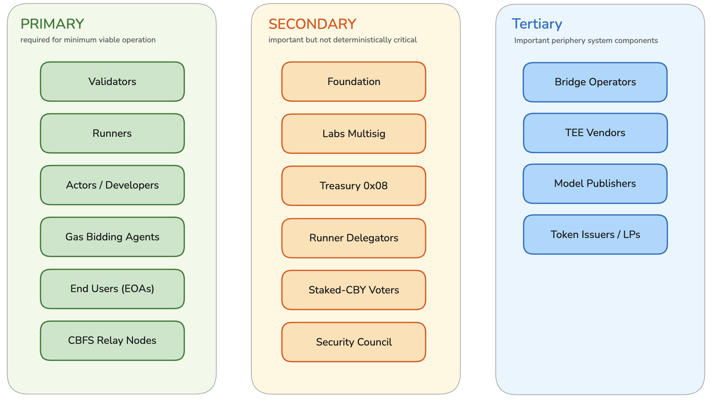
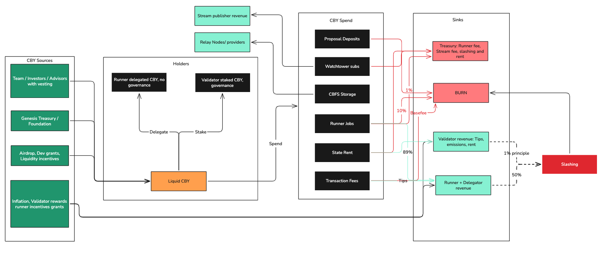
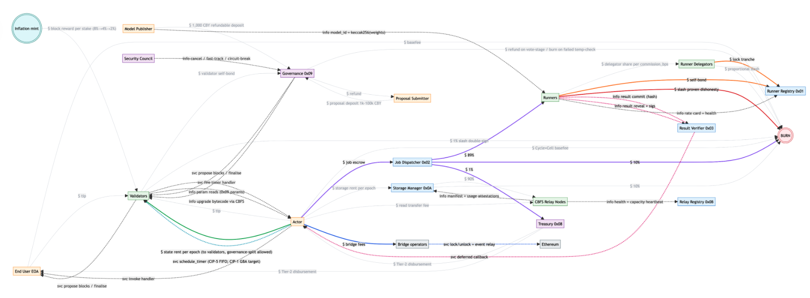
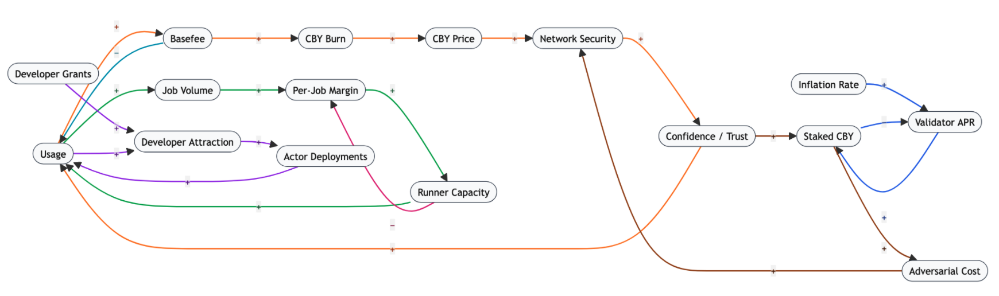

# 🛰️ Design review

<!-- Notion page id: 3a3e6c7d-52db-83e4-b234-015ca328911a -->

## Cowboy Protocol - System Architecture Design Review

*Prepared by Vending Machine · April 2026 · Status: Draft for internal review*

---

### Abstract

This document is a design review of the Cowboy Protocol - a Layer-1 blockchain purpose-built for autonomous AI agents. The goal is to reconstruct the full flow-through of the protocol, validate our internal understanding, identify design holes and latent risks before they become load-bearing, and refine a candidate list of network objectives and system requirements for the Cowboy team to confirm.

It is deliberately scoped to deep understanding and problem articulation. Concept generation and downstream phases will follow in separate documents once the Cowboy team has confirmed the objectives and the risk register.

The document is based on the Cowboy Technical Whitepaper (authoritative for numerical parameters), the public documentation at docs.cowboy.inc, the GitHub, and Cowboy's own "Open Design Questions" pages. Where the public docs mark a parameter as "out of scope / governance-defined," the whitepaper's value is treated as the team's current intent.

---

### 1. Stakeholders

#### 1.1 Stakeholder Roles and Positions

| # | Stakeholder | Role | Position | Primary interactions |
|---|---|---|---|---|
| 1 | **Validators** | Run Simplex BFT consensus nodes: propose blocks via VRF rotation, vote, aggregate QCs via BLS12-381, execute the STF (state transition function). Self-bonded only (no delegation in v1). | Primary | Users, Proposer role, Governance, Treasury, Foundation |
| 2 | **Runners** | Off-chain compute workers executing LLM inference, HTTP, and MCP jobs. VRF-selected into committees, submit commit-reveal results, earn 89% of job payments. Must maintain effective stake ≥ `max(10k CBY, 1.5× declared_max_job_value)` with ≥10% self-bond. | Primary | Actors, Delegators, Runner Registry `0x01`, Result Verifier `0x03`, CBFS Relay Nodes |
| 3 | **Runner Delegators** (CIP-13) | CBY holders who delegate stake to specific runners to earn a share of the runner's 89% payout. Up to 200 delegators per runner; 8 active tranches per delegator; slashable proportionally alongside the runner. No governance vote weight. | Primary | Runners, Runner Registry |
| 4 | **Actors / Developers** | Build Python programs deployed to the chain (CREATE2-style addresses). Actors hold balance, store state, receive messages, schedule timers, and request jobs. Developers author and deploy them. | Primary | Runners, other Actors, Users, Gas Bidding Agents, CBFS |
| 5 | **Gas Bidding Agents (GBAs)** | A specialised actor class: read-only-callable actors that bid on timer execution on behalf of their owner actor at block time. Default GBA provided by the protocol for actors that don't supply their own. | Primary | Actors, Scheduler |
| 6 | **End Users (EOAs)** | Transact with actors (invoke handlers, transfer CBY, deploy, etc.) via signed transactions. | Primary | Actors, Validators |
| 7 | **CBFS Relay Nodes** (CIP-9) | Storage nodes that hold encrypted, erasure-coded shards of actor/runner data over QUIC. Stake, register with health/capacity, serve reads, and settle storage rent via on-chain attestations. | Primary | Runners, Actors, Relay Registry `0x0B`, Storage Manager `0x0A` |
| 8 | **Staked-CBY Governance Voters** | Staked CBY holders (whether via validator or for voting purposes  in the unbonding queue at snapshot) who vote in the staked-CBY chamber. Delegators to validators may override their validator's vote. | Primary | Governance `0x09` |
| 9 | **Security Council (7-of-9)** | Named individuals with narrow emergency powers: cancel queued proposals during timelock, fast-track Tier 3 upgrades, circuit-break a specific system actor with mandatory retroactive ratification within 7 days. Cannot propose, vote, upgrade, or spend. | Primary | Governance |
| 10 | **Foundation** | Off-chain legal entity holding the treasury address and running off-chain operations. Receives funds only when a treasury disbursement proposal passes. No protocol authority. | Secondary | Treasury `0x08`, Governance |
| 11 | **Labs Multisig** | Controls only the governance portal frontend (static assets + gateway actor). No protocol authority. | Secondary | Governance UI |
| 12 | **TEE Vendors** (Intel SGX, AMD SEV, ARM TrustZone) | Provide hardware roots of trust that runners use for TEE-attested execution; their root keys are what the TEE Verifier `0x05` ultimately trusts. | Secondary | Runners, TEE Verifier |
| 13 | **Third-Party Bridge Operators** | Operate the canonical bridge(s) between Ethereum and Cowboy for wETH/wERC-20 mint-burn and event subscription relay. Selected by governance; Cowboy does **not** operate its own bridge validator set. | Secondary | Actors, Ethereum, Governance |
| 14 | **Model Publishers** | Submit `model_id = keccak256(weights‖arch‖tokenizer‖license)` to the model registry with a refundable 1,000 CBY deposit. Governance may flag/ban models. | Secondary | Runners, Governance |
| 15 | **Token Issuers / DEX LPs** (CIP-20/21) | Deploy CIP-20 fungible tokens and provide liquidity in the native DEX pools. Part of the composability surface but not core to consensus. | Secondary | Users, Actors |
| 16 | **Treasury ****`0x08`** | System actor accumulating 1% of Runner job payments and any other governance-directed inflows; disbursed only by Tier-2 governance proposal. | Secondary | Governance, Foundation |

#### 1.2 Stakeholder Tiers

**Why these classifications:**

- Runners, CBFS Relay Nodes, and GBAs are marked primary even though each could be argued as secondary, because Cowboy's defining value proposition - **autonomous Python agents that can call LLMs, persist large data, and schedule themselves** - breaks without any of them. An actor that can't reliably get a timer executed or can't reach a runner isn't different from a keeper-dependent Ethereum contract.
- Runner Delegators are secondary because delegation is the mechanism by which runner capacity can grow beyond self-bonded CBY, which is essential for the marketplace to scale past a small group of well-capitalised operators but not essential for operation.
- The Security Council is primary because governance can't safely activate without it at launch - its role is explicitly "permanent, reduce only via Tier 4."
- The Foundation and Labs Multisig are secondary because the protocol functions without them; they are operational wrappers.
- Bridge Operators are tertiary because Ethereum interop is valuable but not required for an actor to run.

---

### 2. Stakeholder Value Accrual

| Stakeholder | Value Accrual |
|---|---|
| **Validators** | (a) Block inflation rewards distributed proportionally to stake; (b) 100% of Cycle and Cell *tips* on blocks they propose; (c) tips on Runner-result-carrying transactions and timer executions; (d) optionally, governance influence via the validator chamber (one-validator-one-vote). |
| **Runners** | 89% of every successfully verified job payment (less whatever share their commission_bps reserves for delegators), plus a small aggregator bonus when they serve as the designated aggregator. Reputation builds selection weight and max job value. Also: Runner Compute Incentives bucket (8% of genesis = 80M CBY) paid out usage-based per runner-hour. |
| **Runner Delegators** | A runner-configured share (`commission_bps` reserved by the runner, remainder to delegators) of the 89% settlement payout, attributed pro-rata across that runner's delegated stake. |
| **Actors / Developers** | (a) Fee revenue if they build actors that charge users for handlers (CIP-18 payment gating); (b) Developer Grants bucket (3% = 30M CBY) for milestone-based grants; (c) indirect value via ownership of successful agent products. |
| **Gas Bidding Agents** | GBAs are actors. If a third-party team builds a better-performing GBA than the protocol default, they can monetise it (charge per-bid fees, subscription, or take a cut of saved gas). This is an entirely emergent market. |
| **End Users (EOAs)** | No direct monetary accrual. Utility: access to autonomous agents, price discovery through the DEX (CIP-21), ownership of tokens, and - in theory - the ability to participate in governance if they stake. |
| **CBFS Relay Nodes** | Per-byte per-epoch storage rent settled on-chain via Relay billing attestations, plus per-byte transfer fees for serving reads. |
| **Staked-CBY Voters** | Governance voice on all Tier 0–4 proposals; indirect influence over validator rewards and all tunable parameters. Runner-delegated stake has zero governance weight. |
| **Security Council** | No direct economic accrual from the role. Position is reputational. Foundation may separately compensate members via treasury disbursement (itself subject to Tier-2 governance). |
| **Foundation** | Holds and operates the treasury address subject to Tier-2 governance disbursement; runs off-chain coordination, branding, and grants programmes. |
| **Labs Multisig** | None from the protocol. Compensation is an off-chain arrangement. |
| **TEE Vendors** | No direct accrual from Cowboy (vendor revenue is from their hardware/cloud business). They are a trust dependency, not a participant. |
| **Bridge Operators** | Per-message fees for bridging and event relay, paid by actors in CBY. Terms governed by the specific bridge the governance selects. |
| **Model Publishers** | Get their model listed and routable to runners. No direct fee; the 1,000 CBY is a refundable deposit. Indirect value is model adoption. |
| **Token Issuers / DEX LPs** | Trading fees, MEV, token issuance fees, speculative upside on launched tokens. |
| **Treasury** | Accumulates 1% of Runner job payments and any other governance-directed flows. No direct "accrual" - it is a sink, not a stakeholder - but included because treasury depletion/accumulation is a tracked economic variable. |

---

### 3. Protocol Value Accrual

This is the inverse view: how the protocol captures value *from* each stakeholder - the security contribution, fee contribution, or liquidity contribution that keeps the network functioning.

| Stakeholder | How the protocol captures value from this stakeholder |
|---|---|
| **Validators** | Stake collateral → consensus security (fault tolerance up to `f < n/3`). Block production → liveness. Slashable stake for double-signing / proposer equivocation at 1% per offence (conservative). |
| **Runners** | Stake collateral → off-chain compute integrity. Execution capacity → the whole Runner lane (25% of block cycles) is meaningless without them. Job payments pass through a 10% burn and 1% Treasury split before reaching them. |
| **Runner Delegators** | Provide capital that extends runner capacity without requiring runner operators to bond everything themselves. Pay nothing to the protocol directly but their stake is slashable. |
| **Actors / Developers** | Pay Cycle and Cell basefees (burned) and tips (validator) on every message. Pay Runner escrow for every off-chain job. Pay CBFS rent for every persistent byte. Pay state rent on on-chain storage above the 10 KB grace threshold. |
| **Gas Bidding Agents** | Pay cycles to execute their bidding logic on every timer deliberation; pay for their own actor state. |
| **End Users (EOAs)** | Pay Cycle and Cell basefees (burned) and tips on every user transaction. They are the ultimate source of non-inflationary fee revenue. |
| **CBFS Relay Nodes** | Provide storage capacity and read bandwidth; must stake to register. Their settlement is a protocol-critical data flow. |
| **Staked-CBY Voters** | Lock CBY into staking (opportunity cost = foregone liquidity/trading) to gain voice. Locked stake reduces float and contributes indirectly to token price stability. |
| **Security Council** | Provides an explicit human-in-the-loop for catastrophic emergencies, which lets the rest of the protocol be designed more aggressively (e.g., hot-code upgrades via Tier-3 fast-track). |
| **Foundation** | Operates the legal/regulatory wrapper and grants infrastructure. Captures regulatory risk off the protocol itself. |
| **Bridge Operators** | Move ETH/ERC-20 value into Cowboy's economic zone, extending the addressable-capital surface. Bring in CBY fees from every bridged event. |
| **Model Publishers** | Pay the 1,000 CBY refundable deposit (capital lockup). Provide the runnable model catalogue that makes Runners useful. |
| **Token Issuers / DEX LPs** | Pay Cell costs for token state, DEX trading fees flow into the protocol ecosystem (CIP-21 specifies distribution). |
| **Treasury** | Sink that accumulates protocol-level value: 1% of every job payment plus governance-directed flows. Does not "capture value from" - it is where captured value lands. |

---

### 4. Components and Mechanisms

| Mechanism | Role | Interactions |
|---|---|---|
| **Simplex BFT consensus** | Safety + liveness under partial synchrony; ~1s blocks, ~2s finality; mandatory VRF-based proposer rotation every block. | Validators |
| **PVM (Python Virtual Machine)** | Deterministic execution environment pinned to Python 3.11.8; softfloat, disabled GC, fixed hash seed, module whitelist, 10 MiB memory cap, recursion depth 32, no cyclic references allowed (`DeterminismError`). | Actors, Validators |
| **Dual-metered fee market (CIP-3)** | Two independent EIP-1559 markets: Cycles (compute) and Cells (bytes). Targets 10M cycles / 500k bytes per block; elasticity E=2; α=8, δ=0.125. Basefees 100% burned, tips to proposer. | Users, Actors, Validators, Basefee actor `0x06` |
| **Native timer scheduler - current (CIP-5)** | FIFO within height bucket; fixed 550k cycles / 550k cells budget per timer fire; `MAX_TIMERS_PER_ACTOR = 1,024`. No GBA auction, no priority queue, no tiered calendar queue - those are Phase 3+ on the CIP-5 roadmap. | Actors, Validators |
| **Native timer scheduler - target (CIP-1)** | Tiered calendar queue (block ring → epoch queue → overflow Merkleized BST) with GBA auction inside the 20% Timer lane and per-actor anti-starvation weights. Not yet shipped. | Actors, GBAs, Validators |
| **Dedicated lanes (§6.3)** | Block space partitioning: System 5% / Timer 20% / Runner 25% / User 50% with cascade. Independent fee multipliers per lane. | All transaction senders |
| **Runner marketplace (CIP-2)** | Fisher-Yates stake-weighted VRF sortition with log₂-compressed selection weights (CIP-2 rev 2026-03-05); default M=5 / N=3 committee; designated-aggregator commit-reveal (rev 2026-03-09); 15-min challenge window; six verification modes; TEE/ZK options. 89/10/1 payout split. | Actors, Runners, Delegators, Job Dispatcher `0x02`, Result Verifier `0x03` |
| **Runner delegation (CIP-13)** | CBY holders delegate stake to runners to increase their VRF weight and max job value; earn a configured share of the 89% payout; unbonding ~24h; proportional slashing. Hard caps at 200 delegators/runner and 8 active tranches/delegator. | Delegators, Runners, Runner Registry `0x01` |
| **State rent + eviction (§§7–8)** | 10 KB grace threshold; rent 0.001 CBY/byte/year baseline (governance-tunable); 7 rent-epoch grace + 3 rent-epoch warning + eviction at 10. Eviction archives data; code, address, balance, storage root hash preserved and restorable. | Actors, Validators |
| **CBFS (CIP-4/9)** | Client-side AES-256-GCM encryption; Reed-Solomon (K data + M parity); QUIC transport; FUSE mount. `StorageCommitment` anchored on-chain; Relay Node billing via attestations. Autonomous repair/rebalance. | Actors, Runners, Relay Nodes, Storage Manager `0x0A`, Relay Registry `0x0B` |
| **QMDB state (CIP-4)** | Three flat key-value databases (`state_db`, `tx_index`, `tx_receipts`) with Blake3 Merkle commitments; 54-byte keys with byte-prefix routing; O(1) reads/writes; native Merkle proofs for light clients. | Validators, Light clients |
| **Threshold-BLS VRF beacon** | Per-block randomness from previous QC; actors derive sub-randomness via `HKDF(R_n, label)`. Epoch keys rotate. | Validators, Actors, Runner Dispatcher, Scheduler |
| **Entitlements system (§15)** | Declarative permissions: actors `require`, runners `provide`; scheduler matches only if `requires ⊆ provides`; syscalls fail on missing entitlement; child actors inherit only `inheritable:true`. | Actors, Runners, Deployment, Scheduler, VM |
| **Model registry** | Permissionless publishing with 1,000 CBY refundable deposit; governance flag/ban. Canonical `model_id = keccak256(weights‖arch‖tokenizer‖license)`. | Model Publishers, Runners, Governance |
| **Bicameral governance (CIP-12 / ****`0x09`****)** | Two chambers (staked-CBY + validator), five tiers (0–4) with escalating quorum/approval/timelock; on-chain temperature check; Security Council narrow emergency powers; Tier-3 hot-code upgrades for system actors `0x01`–`0x0B`. | Staked voters, Validators, Security Council, All system actors |
| **System actors ****`0x01`****–****`0x0B`** | 11 canonical system actors: Runner Registry, Job Dispatcher, Result Verifier, Secrets Manager, TEE Verifier, Dual Basefee, Entitlement Registry, Treasury, Governance, Storage Manager, Relay Registry. Upgradeable via Tier-3 proposals. | All stakeholders indirectly |
| **Ethereum interop (§16)** | Shared secp256k1 keys; actors can verify EIP-712; third-party bridge for wETH/wERC-20 and event subscription. Governance selects bridge. | Users, Actors, Bridge Operators |
| **CIP-18 Payment Gating** | Native primitive for actors to charge users for handler access. | Actors, Users |
| **CIP-20 Fungible Tokens** | Native platform token standard with validation hooks (≤50k cycles per transfer). | Users, Actors |
| **CIP-21 DEX / Liquidity Pools** | Native AMM primitive for CIP-20 tokens. | Users, LPs, Actors |
| **CIP-22 Continuous Clearing Auctions** | Auction primitive (e.g., for MEV-relevant ordering or resource allocation). | Users, Actors |

---

### 5. Value Flow Map

The diagram below shows all meaningful CBY, service, and information flows. 

**Notes on the diagram:**

- The diagram deliberately shows `$ slashed stake → BURN` for validators and proven-dishonest runners (whitepaper §8.4: "Slashed stake - 100% Burned"). This is a design decision worth revisiting in Phase 2; many protocols route part of slashed stake to a bug-bounty or reporter fund to incentivise catching misbehaviour.
- The aggregator bonus flow is not parameterised in the whitepaper (described as "a small bonus"); this is flagged in Section 10.
- Inflation is minted and distributed to validators pro-rata, not via a staking-pool intermediary, because validator staking is self-bonded only. (Runner staking supports delegation; validator staking does not.)

---

### 6. Stakeholder Behaviour Preferences

This is the most analytically important table in the document. For each primary stakeholder, we identify what the network wants them to do, what it wants to prevent, and whether the current design genuinely aligns with that goal - not just whether an incentive exists, but whether it is *calibrated correctly*.

| Stakeholder | Desired Behaviour | Undesired Behaviour | Is incentive adequate? | Is disincentive adequate? |
|---|---|---|---|---|
| **Validators** | Run the reference software honestly; propose valid blocks within the 1s cadence; vote promptly; stay online. | Double-sign, equivocate, stay offline, censor transactions, collude to reorder for profit (MEV). | **Partially.** Block rewards + tips are the explicit incentive. APY is unspecified (whitepaper defers to governance). Without a target APY it's impossible to assess whether running a validator is more attractive than, e.g., running a runner or delegating to one. The dual-meter tip structure gives validators upside during congestion, which is good for their economics but also good for users during spikes (fee elasticity E=2). | **Weakly.** Double-signing slash is only **1%** - conservative by industry standard (Ethereum slashes ≥0.25% plus correlation penalty, Cosmos ~5%, Polkadot up to 100% for multi-validator equivocation). At 1%, an adversarial validator weighing the expected profit of an attack against the cost of being caught may find the cost too low, especially if they hold a large stake with substantial upside elsewhere. Extended downtime is "no slash" which is also generous - whitepaper is explicit this is the conservative choice, but it means validators with unreliable infrastructure can free-ride on more reliable peers. Jailing is the main disciplinary tool. |
| **Runners** | Honestly execute jobs, return correct results, maintain good uptime, match runner capabilities to their declared entitlements, price competitively. | Fabricate results, misreport resource usage, run a different model than promised, time out without delivering, collude within a committee. | **Strong on paper.** 89% of job payments is generous; a 10% burn creates deflationary pressure proportional to use; delegators expand capacity. The aggregator bonus (unspecified) rewards honest aggregation. But: (a) reputation penalties for operational failure are unquantified - how fast does a runner's VRF weight decay, and how quickly can it recover? - (b) the 8% Runner Compute Incentives bucket (80M CBY) runs for some unspecified period and then stops; the post-subsidy economics need to work stand-alone. | **Partial.** Slashing happens only on *proven dishonesty* (fabricated results detected via challenge; wrong model detected via TEE attestation mismatch). Operational failures (timeout, empty output, schema violation) trigger reputation penalties only. This is sensible - you don't want to slash for a transient network error - but it creates a problem: **a runner that accepts more jobs than it can actually serve loses only reputation, while capturing some fraction of jobs as honest work.** In commit-reveal semantics, a runner that commits and then refuses to reveal can't be *proven* dishonest in the cryptographic sense; whether the slashing logic treats this as dishonesty or as operational failure is implementation-defined.  |
| **Runner Delegators** | Delegate to honest, high-capacity runners; rebalance toward better-performing runners over time. | Delegate blindly, spread too thin, chase yield into runners that are about to be slashed, coordinate to centralise capacity in one operator. | **Asymmetric.** Delegators capture yield without operating any infrastructure. The 200-delegator cap per runner and 8-active-tranche cap per delegator are pragmatic bounds. Yield is a function of the runner's `commission_bps` (runner sets their own cut); this creates a market where delegators shop on commission, but also means runners can compete by *lowering* commission into a race to the bottom that destabilises runner economics long-term. | **Adequate.** Delegators bear proportional slashing risk (good) and a 24h unbonding period. But delegators have no governance voice so they cannot influence parameters that affect their returns (burn percentage, payout split, runner committee sizes). This disempowers the most capital-flexible group. |
| **Actors / Developers** | Deploy useful applications; charge users (CIP-18); manage rent; request jobs competitively; write idempotent handlers; respect reentrancy-depth limits. | Deploy spam / attack actors, attempt to DoS timers, bloat state, fabricate or infinite-loop around the cycle meter, execute economic exploits on the runner marketplace (e.g., 3-runner sybil in a 5-committee). | **Market-driven.** There is no protocol-level developer reward (beyond the 30M CBY Developer Grants bucket). Actors profit only if their users pay them. This is philosophically correct - the protocol shouldn't subsidise apps - but means early ecosystem depends heavily on grants execution and on the runner subsidy being spent on actors that drive real usage. | **Strong on unit-level abuses, weak on economic abuses.** DoS mitigations are dense (depth 32, fanout 1024, mailbox 1 MB, `per_actor_per_block_cycles` = 1M burstable, progressive timer deposits, exponential same-block surcharges). Economic abuse is less well-defended: an adversary who posts a high-value job with a committee sized 5 and threshold 3 *and* controls 3 colluding runners can always "win" consensus. With M=5, N=3, the adversary needs to control ≥3 of 5 selected slots - probabilistically harder the more independent runners there are, but explicitly vulnerable if the total active runner count is small. |
| **Gas Bidding Agents** | Bid competitively on behalf of their owner actor; respect the owner's balance; don't spam bids; implement graceful failover. | Bid irrationally high and drain the owner's balance; collude across actors; manipulate the timer lane by bidding in patterns that front-run other timers. | **Emergent.** GBAs are themselves actors - they pay cycles for every bid evaluation. This is good: it prevents zero-cost spam bidding. Third-party GBA-as-a-service providers will emerge and charge; a protocol-default GBA is provided for passive actors. | **Weak.** The whitepaper does not specify what happens if a GBA returns an invalid or maliciously high bid - is the bid clamped, rejected, or does it succeed and drain the owner? The deferred-timer anti-starvation boost helps against "outbid everyone perpetually," but the interaction between GBA strategy and the timer basefee under sustained congestion is genuinely unknown without simulation. This is a major area of ambiguity. |
| **End Users (EOAs)** | Transact; pay fees; delegate or stake to participate in governance. | DoS the public mempool; spam low-fee transactions; exploit edge cases in EIP-1559 behaviour. | **Market-driven.** Users transact because they want to use actors. No direct reward. | **Indirect.** Basefee + tip model is industry standard and economically sound. The `max_tx_size = 128 KiB` cap and lane isolation prevent the worst spam vectors. Nothing prevents a determined spammer from congesting the public mempool at high cost - but that cost is paid to validators in tips, which is acceptable. |
| **CBFS Relay Nodes** | Store assigned shards reliably; serve reads promptly; honestly report capacity and health; participate in autonomous repair. | Withhold shards, underreport usage (if that's possible under the protocol), drop offline without notifying, overcharge. | **Unclear.** Storage rent + read bandwidth fees is the mechanism. The concrete rates are not in the public whitepaper extracts - the Relay Registry tracks "stake, health, capacity" but the economics are more detailed in CIP-9 which we should audit separately. | **Unclear.** The whitepaper mentions "challenge-based availability" in CIP-9 but the slashing schedule, challenge bond size, and who issues challenges are not visible in the materials reviewed here. **Gap flagged.** |
| **Staked-CBY Voters** | Participate in governance; vote on proposals they understand; delegate to knowledgeable delegates; don't vote apathetically. | Sell-vote, flash-loan-vote, ignore Tier-0 proposals (low quorum = minority control), coordinate to pass rent-extracting proposals. | **Weak.** Staking yields are unspecified. Governance participation is purely voluntary civic duty. History across Cosmos, Compound, Uniswap shows this leads to <5% effective turnout and whale dominance. | **Weak.** The tier system is the main protection: Tier 2 treasury disbursements need 15% quorum and >55% approval per CIP-12 (2026-04-09), which is *better* than most DAOs but still crossable by a single large holder. Flash-loan governance is mitigated by snapshotting at `snapshot_block` (stake must be staked, not just held), and unbonding stake still counts at its pre-unbond weight at the snapshot — so a flash-loaned staker would need to actually stake, wait for the snapshot, then vote, then unbond (7-day delay). This is meaningfully stronger than simple balance-based voting. |
| **Security Council** | Only intervene in genuine emergencies; retroactively justify any circuit-break within 7 days; abstain from directing policy. | Use emergency powers for routine decisions; delay ratification votes; become politicised; collude with a large holder. | **None (role-based).** Members accept civic responsibility. Long-term compensation must come from off-chain Foundation contracts. | **Strong in design.** Powers are narrow: cancel during timelock, fast-track Tier 3, circuit-break with retroactive ratification. Cannot propose, vote, upgrade directly, or spend. Requires 7-of-9. Membership changes are Tier 4 (20% quorum, >66% approval, 14-day timelock) per CIP-12. This is a mature design. |

---

### 7. Minimum Viable Ecosystem

**MVE definition:** The smallest set of stakeholders, token functionality and mechanisms that can execute Cowboy's core value proposition - an autonomous actor that schedules itself and requests a verified LLM inference, paid for in CBY.

**Required:**

- **≥1 validator** (really ≥4 for BFT fault tolerance): runs Simplex consensus, produces blocks
- **≥1 actor:** deployed Python program with state and a handler
- **≥1 user or triggering mechanism:** at minimum, an EOA that initialises the actor
- **≥1 runner:** registered and staked, with the relevant entitlements (LLM model, provider API key)
- **The scheduler:** required for any non-trivial actor that wants to execute autonomously
- **Runner Registry ****`0x01`**** + Job Dispatcher ****`0x02`**** + Result Verifier ****`0x03`****:** the commit-reveal machinery
- **Dual Basefee ****`0x06`****:** fee market state
- **Entitlement Registry ****`0x07`****:** to route the job to the right runner
- **A way to pay job escrow:** an actor balance funded in CBY
**Optional for MVE but commonly assumed:**

- Delegators (you can run with self-bonded runners only at small scale)
- CBFS (only needed if the actor uses off-chain storage)
- Governance, Security Council, Treasury (no parameter changes at launch)
- Ethereum bridge
- CIP-20/21/22 (tokens, DEX, auctions)

#### 7.1 MVE Value Flow

#### 7.2 Identified incentive-alignment risks in the MVE

Even at the minimum viable scope, several misalignments are already present and will amplify at scale. These are the candidate design challenges for Phase 2 concept generation.

1. **Runner economics during cold-start.** (→) Whitepaper specifies `effective_stake ≥ max(10,000 CBY, 1.5× declared_max_job_value)` and 10% self-bond. At low CBY prices this is trivially cheap (10,000 × $0.10 = $1,000), and at high CBY prices it may be prohibitive for small operators. The collateral floor is *token-denominated* but the collateral requirement should probably scale with the *dollar value* of the jobs the runner is willing to serve. As CBY appreciates, existing stakes become much more productive, benefiting incumbents; as it depreciates, stake security weakens relative to the dollar value of jobs.
1. **Committee size vs runner count.** (→) Default committee M=5, threshold N=3. With a small runner population (e.g., 20 active runners), the probability of an adversary controlling 3 slots after staking ~60% of total runner stake is non-trivial. The protocol doesn't adapt committee size to population density - this is a static parameter that will be load-bearing at launch.
1. **Timer lane + GBA auction under congestion (target design only). (****→****)** GBA auction is not yet live — CIP-5 rev 2026-03-19 ships FIFO within a height bucket and defers the auction to Phase 3. When the auction does ship, the default GBA's bidding strategy is protocol-provided but not detailed in the whitepaper. If the default is conservative and third-party GBAs are more aggressive, actors using defaults will be systematically deprioritised — creating implicit pressure toward third-party GBA services, which could centralise.
1. **Aggregator bonus magnitude.** (→)"A small bonus" is not a number. If too small, there's no reason to take on the aggregator role (off-chain data collection is real work); if too large, runners will optimise for becoming aggregator rather than for getting results right. Designated-aggregator selection is "highest reputation in the committee," which also means new runners can never be aggregators, which hurts reputation bootstrapping.
1. **No slashing for non-reveal.** (**→**) If a runner commits `hash(result)` and then refuses to reveal, the protocol must classify this. Treating it as operational failure (reputation only) opens a denial-of-verification attack where an adversary commits garbage, waits to see other commits, then refuses to reveal if the majority is unfavourable. Treating it as dishonesty (slash) means a runner who legitimately crashes mid-job is slashed for an operational failure. **This binary is the defining question of commit-reveal integrity and it's not visible in the materials reviewed.**
1. **State rent math at launch.** (→) With `rent_rate = 0.001 CBY/byte/year` and a 10 KB grace threshold, rent for a 1 MB actor = ~1.014 CBY/year. At CBY = $0.10 this is $0.10/year — trivially cheap. At CBY = $10 this is $10.14/year — uncomfortable for small developers. The rent rate needs a pricing mechanism that decouples from CBY/USD volatility, but the current spec keeps it purely token-denominated.
1. **Bridge trust assumption.** (→) The protocol explicitly outsources bridge validation to a third party. Whatever security assumptions that bridge makes become Cowboy's assumptions for any value that crosses over. A single-bridge choice concentrates risk; multi-bridge adds complexity; the whitepaper defers the decision entirely to governance, which means **this must be resolved before mainnet or users will be exposed**.

---

### 8. Causal Loop Diagram

The following diagram captures the primary reinforcing (R) and balancing (B) feedback loops in the Cowboy economic system. Labels use `+` for same-direction effects and `-` for inverse effects.

#### 8.1 Labelled loops

| ID | Type | Loop | Why it matters |
|---|---|---|---|
| **R1** | Reinforcing | Usage → basefee → burn → CBY price → network security budget → confidence → usage | The central deflationary flywheel. Only becomes dominant if usage is sufficient. Breaks if usage stays below basefee targets and basefees collapse to the floor (=1). |
| **R2** | Reinforcing | Usage → job volume → runner profit per job → runner capacity → serves more jobs → enables more usage | The runner-side flywheel. Depends on the 8% Runner Compute Incentives bucket getting runners in before R2 is self-sustaining. |
| **R3** | Reinforcing | Developer grants → developer attraction → actor deployments → usage → developer attraction | The ecosystem flywheel. 30M CBY bucket is time-bound; self-sustaining version requires actor products that generate enough revenue to reinvest. |
| **B1** | Balancing | Inflation → validator APR → staked ratio → APR compression → less new staking | Classic PoS balancing loop. Missing data: target staked ratio, APR elasticity, security-floor trigger threshold. |
| **B2** | Balancing | Usage → basefee → usage | EIP-1559 elasticity. With E=2 and δ=0.125, basefee adjusts at most 12.5% per block - relatively aggressive; validators will see meaningful volatility. |
| **B3** | Balancing | Runner capacity → committee quality → lower per-job margin → slower capacity growth | Competitive pressure within the runner marketplace. Weak if delegation concentrates stake in a few runners. |
| **B4** | Balancing | Stake growth → adversarial cost of capture → safer network → more trust → more stake | Only balancing if adversarial cost actually scales with stake; if delegation centralises, adversarial cost scales with delegator diversity, not gross stake. |

#### 8.2 Key insight from the CLD

The two most powerful loops (R1 and R2) are both **usage-driven**. The protocol's long-term economic health is fundamentally a function of adoption. All three balancing loops have ambiguous magnitude because three critical parameters are unspecified: validator APR target, runner reward scaling, and the security-floor trigger threshold. This is the single most important finding of the review: **Cowboy has chosen most of its microeconomic mechanisms carefully but has deferred the macroeconomic anchors that determine whether those mechanisms operate inside or outside their stable regions.**

---

### 9. Network Objectives Review

#### 9.1 Design Tensions Identified

The system architecture analysis above reveals several tensions that any objective prioritisation must resolve. These tensions are what make the objective-weighting exercise meaningful — they are the real choices.

1. **Decentralisation vs. runner marketplace bootstrap.** A small committee (M=5, N=3) is robust if the runner set is large and independent, but vulnerable in the early network. Subsidies accelerate runner capacity but also let well-capitalised early operators entrench before the wider market forms.
1. **Storage affordability vs. state bloat defence.** State rent at 0.001 CBY/byte/year is cheap enough to keep developers happy while CBY is cheap, but state bloat is permanent and the design pays for it forever. A rent rate that auto-adjusts to CBY/USD price is logically correct but introduces oracle risk.
1. **Validator accessibility vs. security budget.** Lower `minimum_validator_stake` → more decentralised validator set → less collateral behind each consensus vote. Higher minimum → fewer, richer validators → more collateral but more centralised.
1. **LLM non-determinism vs. verifiability.** Six verification modes is a thoughtful recognition that LLM outputs aren't reproducible, but it pushes the trust decision onto developers who may choose the cheapest mode (`none`) without understanding the implications.
1. **Governance agility vs. predictability.** Five-tier governance with hot-code upgrades is powerful but means the protocol is genuinely mutable. Users must trust the ongoing governance process, not just the launch design.
1. **Open runner market vs. model publisher gatekeeping.** Permissionless model registry is good; governance flag/ban is pragmatic but creates a future political fight the first time it's used.
1. **Dual-meter precision vs. UX simplicity.** Cycle and Cell fees are microeconomically superior to single-gas but require wallets to estimate two metered quantities and users to think about both. Ethereum users spent years learning a single gas number.
1. **Slashing conservatism vs. deterrent strength.** The 1% validator slash is industry-low and favours validator onboarding, but leaves the network with thin defence-in-depth against determined attackers who have outside upside.
1. **Security Council permanence vs. progressive decentralisation.** A 7-of-9 permanent emergency council is safer at launch but can become a political fixture. The "reduce only via Tier 4" rule is smart but needs honest execution.
1. **Ethereum interop convenience vs. third-party bridge risk.** Shared keys are a genuine UX win; delegating bridge security to third parties concentrates risk outside the protocol's own verification.

#### 9.2 Proposed Network Objectives (DRAFT - for Cowboy team confirmation)

The following is Vending Machine's proposed objectives list derived from the architecture analysis. These are framed to be specific, measurable, and mutually distinguishable. They should be treated as a starting point for the live review session with the Cowboy team, not as a final list.

| # | Objective | Type | Description | Conflicts With | Measurement | Confirmed |
|---|---|---|---|---|---|---|
| 1 | **Consensus security** | Objective | Maintain economic security of Simplex BFT PoS such that the cost of acquiring ≥⅓ of active validator stake exceeds a target dollar threshold at launch and grows with network value. | 4, 6 | Total staked value (USD) / estimated attack cost; inflation-adjusted validator APR | ☐ |
| 2 | **Runner marketplace integrity** | Objective | Ensure that off-chain compute results are reliably correct and verifiable under each trust model, with runner honesty dominating collusion profitability across plausible adversary sizes. | 4, 5 | % of jobs verified successfully; challenge rate; successful challenges / total challenges; runner churn | ☐ |
| 3 | **Developer attraction and retention** | Objective | Attract Python-competent developers and AI/agent builders in sufficient numbers to populate the actor ecosystem within the first 24 months. | 4 | # of unique deploying addresses per month; # of active (non-evicted) actors; deposited CBY in non-system actors | ☐ |
| 4 | **Long-run fee sustainability** | Objective | Achieve a state within a defined horizon (e.g., 5 years) where fee revenue (from basefees burned + tips + runner flows) sufficiently rewards validators and runners without dependence on inflation. | 1, 2, 3 | Ratio of (tips + runner flows) to inflation rewards; burn vs. mint net over 90-day windows | ☐ |
| 5 | **Resistance to state bloat and eviction griefing** | Objective | Keep the total on-chain state size growing sub-linearly with usage, with eviction operating as a credible but humane pressure-relief valve. | 3, 6 | Total state size trajectory; eviction events per month; restoration events per month | ☐ |
| 6 | **Accessibility of governance participation** | Objective | Ensure that effective voting turnout exceeds a threshold across proposal tiers and that no single holder or validator can unilaterally pass a Tier 2+ proposal. | 1, 9 | % of staked CBY voting; Gini of voting power; % proposals passing below 15% participation | ☐ |
| 7 | **Timer liveness and fairness** | Objective | Ensure that non-adversarial timers fire within a bounded delay from their scheduled block, even under congestion, and that no single actor can monopolise the timer lane. | 8 | Median delay between scheduled and actual fire block; % of timers deferred more than N blocks; actor concentration in executed timers | ☐ |
| 8 | **Predictable fee UX** | Objective | Wallet-level fee estimation achieves within-X% accuracy across 95% of transactions under normal load, such that users are rarely surprised by final cost. | 7 | % of txs where `final_fee / estimated_fee ∈ [0.85, 1.15]`; basefee volatility (std/mean per epoch) | ☐ |
| 9 | **Credible decentralisation of the Security Council and Foundation** | Objective | Over time, visibly demonstrate that the Security Council's emergency powers are used sparingly, with retroactive ratification and with membership that is not dominated by Foundation-aligned individuals. | 6 | Council actions per year; ratification passage %; Foundation-held Council seats (SHOULD be ≤1); rotation rate | ☐ |
| 10 | **Bridge security bound** | Objective | Any asset bridged from Ethereum is protected by a third-party bridge whose economic security (staked value behind the bridge) meets or exceeds the total value currently bridged. | 10 | Σ TVL bridged / Σ bridge operator stake ratio; diversification across multiple bridges | ☐ |

#### 9.3 Constraints (Hard Requirements)

These are proposed as *constraints* (pass/fail), not optimised objectives. Designs that violate constraints should be eliminated rather than scored.

| # | Constraint | Rationale |
|---|---|---|
| C1 | **Determinism is inviolable.** No mechanism may introduce non-determinism into PVM execution under any threat model. | Loss of determinism breaks consensus safety. |
| C2 | **Safety under f < n/3 Byzantine validators must be preserved.** | Simplex BFT assumption is load-bearing for the entire design. |
| C3 | **No user may be forced to lose funds through protocol-defined mechanisms** (other than explicit staking bonds, governance-approved slashing, fees, or rent paid for services rendered). | Reasonable property-rights floor. |
| C4 | **No single entity may unilaterally pass a Tier 2+ governance proposal.** | Codifies "no plutocrat can spend the treasury alone." |
| C5 | **The Security Council cannot propose, upgrade, or disburse directly** - it can only intervene on queued actions. | Preserves the intended separation of powers. |
| C6 | **Determinism of the cost table must be preserved across upgrades.** Cost table changes are consensus-critical and Tier 3 at minimum. | Prevents stealth changes that break cross-validator agreement. |
| C7 | **Slashed stake destination must be pre-committed** (currently 100% burn). Any change to this destination is itself Tier 3+. | Prevents governance capture via "redirect slash to favoured party." |

#### 9.4 Objective Interdependencies

A qualitative view of which objectives reinforce or conflict with each other. This is the map the Cowboy team should keep in mind when they assign importance weights in Phase 3.

|  | 1 | 2 | 3 | 4 | 5 | 6 | 7 | 8 | 9 | 10 |
|---|---|---|---|---|---|---|---|---|---|---|
| **1. Consensus security** | — | + | 0 | − | 0 | + | 0 | 0 | + | 0 |
| **2. Runner marketplace integrity** | + | — | + | − | 0 | 0 | 0 | 0 | 0 | 0 |
| **3. Developer attraction** | 0 | + | — | − | − | 0 | + | + | 0 | + |
| **4. Fee sustainability** | − | − | − | — | + | 0 | 0 | 0 | 0 | 0 |
| **5. State bloat resistance** | 0 | 0 | − | + | — | 0 | 0 | 0 | 0 | 0 |
| **6. Governance accessibility** | + | 0 | 0 | 0 | 0 | — | 0 | 0 | + | 0 |
| **7. Timer liveness / fairness** | 0 | 0 | + | 0 | 0 | 0 | — | − | 0 | 0 |
| **8. Predictable fee UX** | 0 | 0 | + | 0 | 0 | 0 | − | — | 0 | 0 |
| **9. Council legitimacy** | + | 0 | 0 | 0 | 0 | + | 0 | 0 | — | 0 |
| **10. Bridge security** | 0 | 0 | + | 0 | 0 | 0 | 0 | 0 | 0 | — |

Legend: `+` = reinforces, `−` = conflicts, `0` = largely independent.

**Major tensions to be aware of:**

- Objectives 3 (developer attraction) and 4 (fee sustainability) are directly opposed: developer-friendly fees deplete the fee-burn flywheel.
- Objectives 4 (sustainability) and 1 (security) are mildly opposed: higher inflation attracts more validators but hurts long-run fee sustainability.
- Objectives 7 (timer liveness) and 8 (fee UX) are opposed: aggressive GBA auctioning produces volatile, unpredictable effective fees for timer-using actors.

---

### 10. Preliminary Discussion

Synthesising across the preceding nine sections, we identify seven key findings that should shape the remaining phases of this engagement.

#### 10.1 The protocol is well-architected at the component level and under-specified at the economic anchor level

Cowboy's technical design is mature: the dual-metered fee model is a genuine improvement over single-gas, the tiered calendar queue with GBA auctioning is novel and thoughtful as a target design (CIP-1; CIP-5 currently ships FIFO-within-height-bucket with the auction deferred to Phase 3), the commit-reveal runner protocol with six verification modes correctly handles the non-determinism of LLM outputs, and the QMDB + Blake3 storage choice is a deliberate performance engineering decision. The bicameral governance with tiered timelocks and the narrow Security Council design is more carefully thought through than most L1s.

However, three categories of parameters are deferred to "governance-defined" in the public docs: (a) **validator economics** (minimum stake, APR target, security-floor trigger), (b) **runner reputation dynamics** (decay rate, recovery rate, implied VRF weight functions), and (c) **bridge selection**. Each of these is load-bearing at launch. A protocol cannot launch with governance-defined validator minimum stake and expect governance to function, because governance itself requires staked CBY that requires validators that require a minimum stake. This circularity must be broken by committing to genesis defaults — even if those defaults are scheduled for early governance review.

#### 10.2 The Runner marketplace is the most novel and the most risky subsystem

The runner marketplace is Cowboy's most differentiated claim. It is also the subsystem with the most unanswered design questions:

- Committee size (M=5, N=3) is static; adaptive sizing is not specified.
- Aggregator bonus magnitude is unspecified.
- Behaviour under non-reveal is unspecified.
- Reputation decay/recovery mathematics are unspecified.
- Interaction between `semantic_similarity` mode and embedding model selection is a potential circularity.
- Economic circularity: a runner's effective stake floor is CBY-denominated but jobs are USD-valuable.
Of these, the non-reveal case and the reputation dynamics are the most urgent to resolve because they directly determine whether the 10% burn + 1% treasury split is a correct pricing of marketplace integrity.

#### 10.3 The timer subsystem is load-bearing but has significant unknowns

Actors that schedule themselves are the core value proposition - without reliable timers, Cowboy is just Ethereum with Python. The tiered calendar queue is a sound target design (CIP-1) and the DoS mitigations are thorough, but CIP-5 (rev 2026-03-19) currently ships a simpler FIFO-within-height-bucket implementation with the GBA auction deferred to Phase 3. When the auction does ship, the GBA concept elegantly sidesteps the problem of pre-paying for distant future execution. But the default GBA bidding strategy, the GBA invalid-bid handling, and the interaction between timer basefee (which rises with queue depth) and actor balance thresholds are all currently specified at the level of mechanism, not parameter. Simulation is the only way to find the stable region here.

#### 10.4 The 1% validator slashing is an explicit, conscious tradeoff - but the tradeoff must be made clear

Cosmos slashes ~5% for double-signing. Ethereum has correlation-scaled slashing that can reach 50%+ for coordinated attacks. Polkadot slashes up to 100%. Cowboy at 1% is the softest in the class. The whitepaper frames this as deliberate conservatism ("jailing rather than stake destruction"), which is a defensible position - but it implicitly assumes that reputational cost and opportunity cost of jailing are high enough to substitute for economic slashing. Whether that assumption holds at launch, when validator reputations don't yet exist, is worth explicit team confirmation.

#### 10.5 State rent + eviction is elegant but depends on stable CBY/USD

The rent formula uses `rent_rate = 0.001 CBY/byte/year` as a starting point. This is CBY-denominated. If CBY appreciates 10×, rent costs 10× in USD. If CBY crashes 10×, state bloat becomes free in real terms. Since rent adjusts based on total state size (`rent_rate_{i+1} = rent_rate_i × (1 + clamp((S - T) / (T × α), -δ, +δ))`) the system *does* self-correct for over-consumption, but only in CBY terms. A dollar-stable rent would require an oracle, which introduces a different trust assumption. The current design is defensible but should be stress-tested against extreme CBY price paths.

#### 10.6 Runner delegators are the disempowered majority

CIP-13 creates a capital-flexible group who bears slashing risk but has zero governance voice. This is defensible at launch (delegators may not be knowledgeable enough to vote well) but creates a future legitimacy problem: the group whose behaviour most affects runner health has no say in runner-relevant parameters. A natural compromise - giving delegators partial vote weight (e.g., 25%) on runner-parameter-specific proposals only - is worth exploring in Phase 2.

#### 10.7 The bridge question is a latent critical path

The whitepaper's Ethereum interop section is explicit: "Bridge selection and integration are determined by governance. The protocol does not implement its own bridge validator set." This means the first governance vote will be, effectively, choosing the security model for any value bridged from Ethereum. This is an enormous decision to push onto a governance process that is itself new. Two concrete options to prepare before mainnet:

1. **Pre-select a bridge via the core team** with a commitment to retire it via governance if it misbehaves.
1. **Launch with no bridge** and treat Ethereum interop as a post-launch feature gated by governance selection.
The current implicit path - launch with governance unspecified and the bridge also unspecified - is the worst of both worlds.

---

### 11. Risk Register (summary)

A compact risk register derived from the architecture analysis. Severity uses L/M/H; Likelihood is a rough prior given the design as-specified; Phase-2 priority indicates which risks should drive concept generation.

| # | Risk | Severity | Likelihood | Owner | Phase-2 Priority |
|---|---|---|---|---|---|
| R1 | Validator slash (1%) too weak to deter coordinated attacks at scale | H | M | Cowboy consensus team | High |
| R2 | Runner non-reveal attack exploits ambiguous slashing classification | H | M | Runner subsystem team | Critical |
| R3 | Small runner population allows committee capture at M=5, N=3 | H | H at launch, L at scale | Runner team | High |
| R4 | Default GBA behaviour systematically disadvantages non-GBA-sophisticated actors | M | H | Scheduler team | Medium |
| R5 | CBY price volatility makes state rent either punitive or ineffective | M | H | Economics / governance | Medium |
| R6 | Third-party bridge choice becomes the weakest link in network security | H | M | Governance | Critical |
| R7 | Runner delegator disenfranchisement produces post-launch legitimacy crisis | M | M | Governance | Medium |
| R8 | Governance low turnout enables whale capture at Tier 2 (15% quorum per CIP-12) | M | M | Governance | Medium |
| R9 | Security-floor inflation trigger threshold unspecified → staking ratio races to zero if CBY crashes early | H | L | Economics team | High |
| R10 | `semantic_similarity` verification mode has embedding-model circularity | M | H | Runner team | Medium |
| R11 | Aggregator bonus size is under-specified → either no-one aggregates or everyone games for the role | M | H | Runner team | High |
| R12 | Validator APR unspecified at launch → validators can't make build-vs-rent decisions | H | H | Economics team | Critical |
| R13 | Reputation dynamics for runners are unspecified → VRF weight distribution is unknown | M | H | Runner team | High |
| R14 | State rent is CBY-denominated, no oracle path to USD-stable rent | M | M | Economics team | Medium |
| R15 | Slashed stake burn prevents bounty for challengers; reduces challenge incentive | M | M | Runner team / Economics | Medium |

---

### 12. Gaps Requiring Team Clarification

Items where the materials reviewed (whitepaper, public docs, GitHub README, CIP index) do not contain enough detail to complete the analysis. These should be raised with the Cowboy team before proceeding to Phase 2.

| # | Gap | Why it matters |
|---|---|---|
| G1 | **`minimum_validator_stake`** genesis default | Required to size the validator set and estimate security budget |
| G2 | **Validator APR target** (or equivalent emission formula) | Required to model B1 loop and validator participation decisions |
| G3 | **Security-floor inflation trigger threshold** (staked-ratio below which inflation rises) | Required to model worst-case inflation schedules and validator onboarding |
| G4 | **Runner reputation decay and recovery formulas** | Required to model runner market dynamics and VRF selection distribution |
| G5 | **Aggregator bonus size and computation** | Required to model aggregator incentive and committee dynamics |
| G6 | **Protocol behaviour on runner commit-without-reveal** | Determines whether commit-reveal is cryptographically honest |
| G7 | **Default GBA bidding strategy spec** | Required to model timer market dynamics |
| G8 | **CBFS Relay Node economics** - rent rates, challenge bond, slashing schedule | Required to model storage economy |
| G9 | **Bridge selection process and candidate bridges** | Required to assess pre-mainnet risk |
| G10 | **Runner Compute Incentives emission schedule** - over what period are the 80M CBY disbursed, and what's the per-runner-hour rate formula | Required to model runner economics at each phase |
| G11 | **Liquidity Mining emission curve** (23.3M CBY, "front-loaded over 12 months") | Required to model float and price discovery |
| G12 | **Validator commission model** - can they charge users additional per-block fees, or only receive tips? | Required to model validator revenue |
| G13 | **`commission_bps`**** bounds** - is there a cap on runner commission, or can a runner set 100%? | Required to model delegator UX and race-to-the-bottom risk |
| G14 | **Unbonding lifecycle for runners** - CIP-13 §3.3–§3.4 confirms `UNBONDING_BLOCKS` applies to delegator tranches; runner self-bond unbonding is handled through `RunnerDeregister`, which force-initiates unbonding on all tranches. (Partially resolved.) | Required to model exit dynamics |
| G15 | **Per-rent-epoch length and catch-up fee mechanics** | Required to model eviction pressure |
| G16 | **Governance parameter store initial values** - many parameters are "governance-tunable" with genesis defaults not explicitly listed | Required to understand launch state |

---

### 13. Recommended Next Steps

1. **Circulate this document with the Cowboy team** and ask them to confirm or correct the objectives list (§9.2), the constraints (§9.3), and the gap list (§12). The objectives confirmation is the critical checkpoint; everything else downstream depends on it.
1. **Hold a working session** to close the most important gaps - G1, G2, G3, G6, G9, and G12 are the ones that cannot wait.
1. **Decide whether to proceed with Phase 2 (concept generation)** on the highest-priority Phase-2 items from the risk register: R1/R12 (validator economics), R2/R3/R11 (runner marketplace integrity), and R6 (bridge selection). These three clusters are the largest economic design decisions still open.
1. **Separately, scope the cadCAD modelling work** (Phase 5 of the MBSE process, but can begin in parallel) for the runner marketplace and validator staking - these are the two areas where parameter choice most materially affects outcomes and where simulation produces the highest-value insights.

---

### Disclaimer

This documentation is provided for informational purposes only and is based on a modified version of MIT's Model-Based Systems Engineering process adapted for blockchain mechanism design. It does not constitute financial, investment, or legal advice. All parameter values and mechanism descriptions are drawn from documentation available as of the review date and may be superseded by subsequent Cowboy team decisions. References to "governance-tunable" parameters reflect Cowboy's own documentation; Vending Machine makes no representation about which values will be selected at genesis or changed afterward.

---
