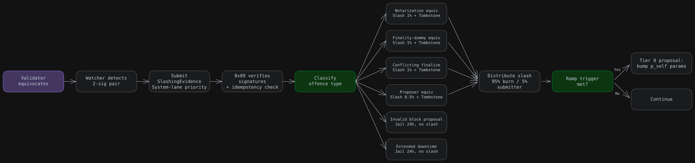
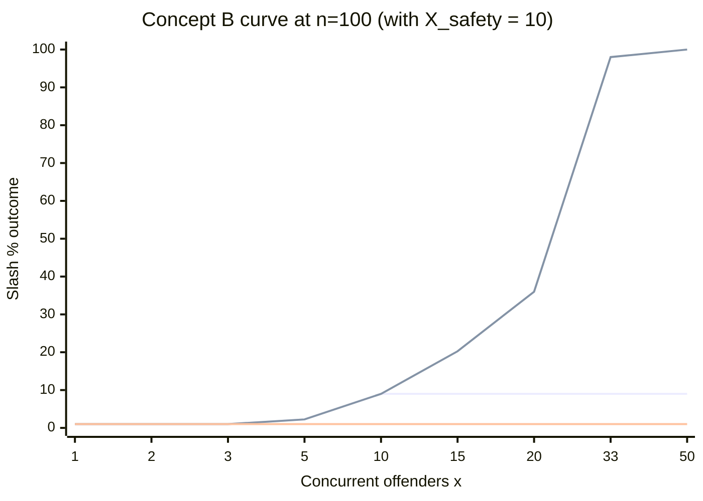
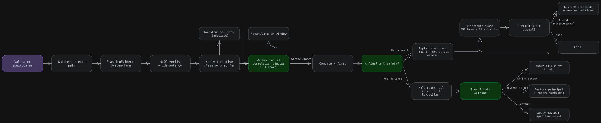
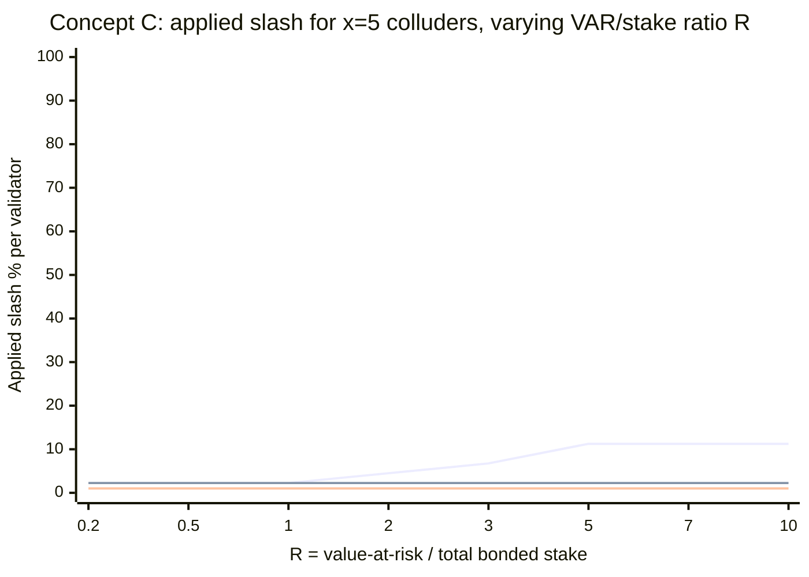
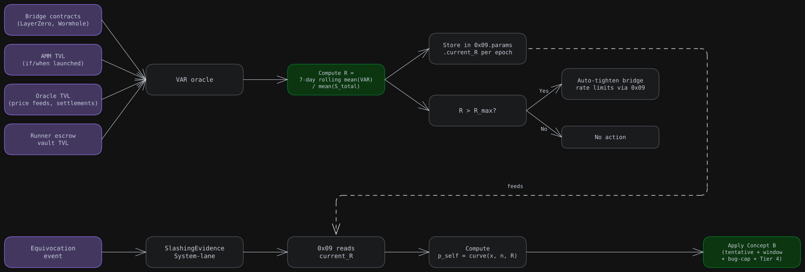
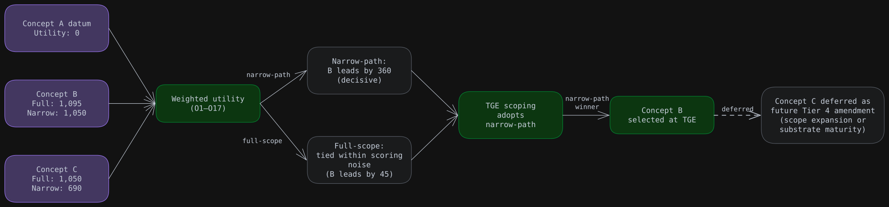

# 💡 Slashing - Concept Generation & Selection

<!-- Notion page id: bffe6c7d-52db-82cf-a778-019d6a0e40fb -->

### 1. Overview

This document outlines Concept Generation phase of Cowboy slashing design. It builds on the [System Architecture & Objectives document](/ae8e6c7d52db838699f2817884b55d75?pvs=25), which establishes the minimum-stake regime, enumerates Simplex BFT's four cryptographically-attributable evidence types, derives the per-block extractable-value model ($V_{extractable}$), and articulates the final objectives that the slashing curve must satisfy. The subsequent Selection phase will evaluate the three concepts presented here against those objectives.

The three concepts are deliberately divergent along the dimension that drives the most consequential design decision - slash magnitude and curve shape - while holding the remainder of the slashing architecture constant.

- **Concept A** (the datum) is a polished version of the current whitepaper §11.3 baseline: a flat 1% rate with complete Simplex evidence enumeration and an explicit post-TGE ramp schedule.
- **Concept B** adopts a Polkadot-style quadratic correlation curve, augmented with a piecewise floor that preserves worst-case-actor deterrence and a bug-correlation safety cap that defers upper-tail slashes to Tier 4 governance review.
- **Concept C** extends Concept B with an on-chain value-at-risk oracle, scaling slash magnitude by the system-wide ratio $R$ between value-at-risk and total bonded stake - so the deterrent self-adapts as the chain matures, without governance intervention.

#### Held constant across all three concepts

- Minimum-stake regime: hysteresis bands $S_{in} / S_{low} / S_{out} = 0.50\% / 0.40\% / 0.33\%$ of staked CBY, with per-validator concentration cap $S_{max} = 5\%$
- Permanent tombstoning on equivocation
- 1:1 alignment with Simplex's four-offence evidence model (notarization equivocation, finality-dummy equivocation, conflicting finalize, proposer equivocation)
- System-lane priority for `SlashingEvidence` transactions
- Distribution: 95% burn / 5% to evidence submitter
Variation is therefore isolated to curve shape, correlation handling, and the value-at-risk integration surface. Each concept is presented below with its overview, architecture, key mechanisms, stakeholder impact, analysis (strengths / weaknesses / risks), and precedents, followed by a side-by-side comparison.

---

## 2. Concept Generation

### 2.1 Concept A: Polished Whitepaper Baseline (DATUM)

**One-liner:** 

- Keep the flat-rate, jail-heavy philosophy but reorder offences to match Simplex's evidence model and add an explicit ramp commitment.

#### 2.1.1 Overview

This is §11.3 whitepaper with surgical changes: enumerate the four Simplex BFT evidence types correctly, classify `SlashingEvidence` as System-lane and publish a ramp schedule. No structural change in slashing philosophy. Stays close to the Sui / Aptos / Sei v2 / Berachain family: a conservative launch posture with an explicit commitment to scale slashing magnitude post-TGE. The underlying assumption is that jail and permanent tombstone, paired with a published ramp schedule, constitute sufficient deterrence during the launch period. Curve calibration is deferred to subsequent CIPs once empirical TGE+30d / +90d / +180d data becomes available.

#### 2.1.2 Architecture

#### 2.1.3 Key mechanisms

| Element | Value |
|---|---|
| Notarization equivocation slash | 1% + tombstone |
| Finality-dummy equivocation slash | 1% + tombstone |
| Conflicting finalize slash | 1% + tombstone |
| Proposer equivocation slash | 0.5% + tombstone (per-block VRF makes leader equivocation rare per validator) |
| Invalid block proposal | Jail only (24h, exponential repeats) |
| Extended downtime | Jail only |
| Distribution | 95% burn / 5% submitter |
| Correlation handling | None (flat) |
| Ramp triggers | Total value-at-risk (bridges + AMM + oracle settlements + runner escrows) > 5× total bonded stake → Tier 0 review; candidate ceiling > 300 ([System Architecture & Objectives](https://app.notion.com/p/3520016b29278109b391d192ffe5e44b) $S_{out}$ admits ~300) → Tier 0 review; TGE+12mo → mandatory review |

#### 2.1.4 Stakeholder impact

- **Validators:** 
  - Low principal exposure (1% × ~$24k–$120k stake = $240–$1,200 across $100M–$500M FDV per *System Architecture & Objectives* document worked example). 
  - Main consequence is tombstone + lost commission stream
- **Delegators**
  - Minimal (1% × delegation)
- **Value-at-risk consumers** (bridges, AMM LPs, oracle consumers, runner escrow holders)
  - Rely on confirmation thresholds and per-surface settlement assumptions
- **Foundation**
  - Unchanged

#### 2.1.5 Analysis

| Strengths | Weaknesses | Risks |
|---|---|---|
| Minimal change from current whitepaper | Cannot differentiate honest fault from cartel | Deterrent ratio degrades as on-chain value-at-risk grows (bridges + AMM + oracle + runner escrow) |
| Operationally simple - one parameter per offence | Flat % mis-prices high-value-density chains | Cartel attack costs $240–$1,200 per validator (System Architecture & Objectives baseline) while $V_{extractable}$ at hot-start tail reaches $30k–$60k (up to $165k at the hot-start tail-of-tail) |
| No risk of bug-induced over-slashing | 5 colluders cost 1% each, not 5× the deterrent | Slash magnitude already symbolic at launch ($240–$1,200, [System Architecture & Objectives](https://app.notion.com/p/3520016b29278109b391d192ffe5e44b)) - jail + tombstone is the actual deterrent; slash itself never becomes the binding consequence |
| Aligned with peer launches | Curve is silent on cartel | Ramp depends on governance executing |
| Explicit ramp schedule documents intent |  |  |

#### 2.1.6 Precedents

| Precedent | Pattern |
|---|---|
| Sui | 0% principal slash; reward forfeiture only |
| Aptos | No slashing implemented; governance removal |
| Sei v2 | 0% principal; tombstone only |
| Berachain | CometBFT defaults; BGT untouched |
| Cosmos Hub | 5% flat double-sign (this concept's ancestral baseline at 1%) |

---

### 2.2 Concept B: Polkadot-Curve with Bug Guardrails

**One-liner:** 

- Quadratic correlation curve recalibrated for $n=100$, with a piecewise floor preserving worst-case-actor deterrence and a bug-correlation safety cap that triggers Tier 4 auto-review before applying upper-tail slashes.

#### 2.2.1 Overview

Adopts Polkadot's $(3 \cdot x/n)^2$ shape but with modifications derived from Polkadot empirical findings.

Variables:

- $x$ = number of validators committing the same offence within the correlation window
- $n$ = active validator set size
- $X_{safety}$ = correlation threshold above which auto-review is triggered (default 10, ≈ 10% of n=100).
Three modifications:

- **Piecewise floor** 
  - $\max(p_{floor}, (c \cdot x/n)^2)$ so isolated equivocation costs at least 1%, preserving the worst-case-actor deterrent that Polkadot's pure curve loses at small $n$.
- **Bug-correlation safety cap** 
  - At $x \geq X_{safety}$, automatically open a Tier 4 review proposal *before* applying upper-tail slashes. Slashes for $x \leq X_{safety}$ apply normally
  - The tail is gated on governance signoff. Directly addresses the Polkadot empirical pattern where every correlated event was bugs and not cartels.
- **Cryptographic reversal pathway**
  - Governance can reverse via Tier 4, but only with `evidence_invalidity_proof`. No discretionary bailout. Resolves System Architecture & Objectives OQ-S8 along the cryptographic-only axis (vs. discretionary).

#### 2.2.2 Curve formula

$$
p_{self}(x, n) = \min\left[\max\left(p_{floor}, \left(\frac{c \cdot x}{n}\right)^2\right), 1\right]
$$

Tier 0 governance-tunable defaults:

- $c = 3$ (Polkadot's empirically-untested coefficient; sits at lower end of [System Architecture & Objectives](https://app.notion.com/p/3520016b29278109b391d192ffe5e44b) Final Objectives' 3–6 range. Tier 0 tunable to $c = 6$ if 100% slash should hit at $x = 20\%$ rather than $x = 33\%$)
- $p_{floor} = 1\%$ (worst-case-actor deterrent floor)
- $X_{safety} = 10$ (10% of expected n=100 validator set)
- $n$ = active validator set size (live)

The flat ceiling at $x=10$ is the bug-correlation cap - the maximum that auto-applies. Beyond $X_{safety}$, the curve only delivers higher slashes if Tier 4 governance affirmatively rules the event was attack and not a bug.

#### 2.2.3 Architecture

#### 2.2.4 Key mechanisms

| Element | Value |
|---|---|
| Curve | $\min(\max(p_{floor}, (c \cdot x/n)^2), 1)$ |
| $c$ (curve coefficient) | 3 (default; Tier 0 tunable to 6 — [System Architecture & Objectives](https://app.notion.com/p/3520016b29278109b391d192ffe5e44b) Final Objectives 3–6 range) |
| $p_{floor}$ | 1% (Tier 0 tunable) |
| $X_{safety}$ (bug-correlation cap) | 10 (Tier 0 tunable) |
| Correlation window | 1 epoch ≈ 1 hour, 3600 iterations |
| Settlement | Tentative on inclusion (with x_so_far), final at window boundary (max-of rule) |
| Bug-correlation auto-review | Tier 4 ReviewSlash auto-proposal at x ≥ X_safety |
| Reversal | Two Tier 4 paths: (a) bug-correlation auto-review for x ≥ X_safety — gates upper-tail before application; (b) post-application cryptographic appeal via `evidence_invalidity_proof` |
| Tombstone | Immediate; only Tier 4 reversal removes |
| Distribution | 95% burn / 5% submitter |

#### 2.2.5 Stakeholder impact (by scenario)

- Single-validator HSM (Hardware Security Module)
  - 1% slash + tombstone not recoverable - below X_safety
  - Cryptographic appeal applies only if signatures invalid
- 5-validator coordinated test failure
  - 2.25% slash each auto-applies
  - Not recoverable below X_safety
- 10-validator runtime upgrade bug, x=10
  - 9% applied
  - Tier 4 review opens, likely reversed if bug-cause shown
- 20-validator cartel attempt, x=20
  - 9% applied
  - Tier 4 review for additional 27%, likely affirmed if no bug
- 34-validator cartel, x=34, BFT broken
  - 9% applied + Tier 4 review affirmed → 100% slash

#### 2.2.6 Analysis

| Strengths | Weaknesses | Risks |
|---|---|---|
| Production-tested shape (Polkadot) | More complex than flat | $c=3$ is inherited directly from Polkadot's empirically-untested upper tail; coefficient may need recalibration based on Cowboy-specific evidence post-TGE |
| Structurally encodes honest-fault vs cartel | Coefficient untested at upper tail empirically | $X_{safety}$ threshold tuning is critical: too low = real cartels escape via review; too high = bug events get hammered |
| Bug-correlation cap addresses Polkadot's empirical failure mode | Window-boundary settlement adds timing complexity | Tier 4 review window (~21 days) means tentative slashes hold validators offline a long time |
| Cryptographic reversal preserves recoverability | Reversal mechanism could become attack vector if proof requirements are weak | Validators may grief by intentionally co-equivocating to trigger bug-cap and force governance attention |
| Floor preserves worst-case-actor deterrent | Settlement complexity = more state in 0x09 |  |
| Tunable via Tier 0 (coefficient) and Tier 4 (curve shape) |  |  |

#### 2.2.7 Precedents

| Precedent | What we adopt | What we change |
|---|---|---|
| Polkadot NPoS $(3x/n)^2$ | Curve shape, max-of rule | Recalibrate for n=100; add piecewise floor; add $X_{safety}$ cap |
| Ethereum correlation penalty | Spirit of correlated punishment | Different time domain (epoch vs 36-day) |
| Polkadot post-incident referenda | Reversibility concept | Cryptographically gate it (no discretionary bailout) |
| Cosmos evidence-submitter bounty | 5% to submitter | Same |

---

### 2.3 Concept C: Value-Density-Tracking Slash

**One-liner:** 

- Slash magnitude scales with measurable on-chain value-at-risk relative to total bonded stake, recomputed each epoch - so deterrent ratio is preserved as the chain matures, without governance intervention.

#### 2.3.1 Overview

The most adaptive design. Inspired by Solana SIMD-0212 (parabolic value-density curve) and EigenLayer's allocated-stake model. The base philosophy: a slash that's appropriate at TGE will be too small at TGE+180d once value-at-risk (bridges + AMM + oracle + runner escrow) has increased 10x. Rather than relying on governance to ramp, the slash itself tracks the security budget.

Built on top of Concept B (so it inherits the curve, bug-cap, reversal), it adds a `value_at_risk` oracle that 0x09 reads each epoch and uses to scale the curve.

> 📝
> Note: VAR is total registered value-at-risk across bridges / AMM / oracle / runner escrow, distinct from the per-block $V_{per\_proposer\_slot}$ defined in [System Architecture & Objectives](https://app.notion.com/p/3520016b29278109b391d192ffe5e44b). Concept C scales the per-block slash by the system-wide ratio $R = \overline{\text{VAR}}_{7d} / \overline{S_{total}}_{7d}$ (7-day rolling means on numerator and denominator to resist short-window manipulation).
> 

#### 2.3.2 Curve formula

$$
p_{self}(x, n, R) = \min\left[\max\left(p_{floor}, \left(\frac{c \cdot x}{n}\right)^2 \cdot f(R)\right), 1\right]
$$

$$
R = \frac{\overline{V_{bridges} + V_{amm} + V_{oracle} + V_{runner\_escrow}}_{\text{7d}}}{\overline{S_{total}}_{\text{7d}}}
$$

(7-day rolling mean of numerator and denominator, sampled at epoch boundary)

$$
f(R) = \begin{cases} 1 & R \leq 1 \\ R & 1 < R \leq R_{max} \\ R_{max} & R > R_{max} \text{ (and triggers automatic bridge rate-limit)} \end{cases}
$$

Tier 0 defaults: 

- $c=3$ 
- $p_{floor}=1%$
- $R_{max}=5$

#### 2.3.3 Architecture

#### 2.3.4 Key mechanisms

| Element | Value |
|---|---|
| Curve | $\min(\max(p_{floor}, (c \cdot x/n)^2 \cdot f(R)), 1)$ |
| All Concept B mechanisms | Inherited (curve, bug-cap, reversal, settlement) |
| VAR oracle | New system actor (slot to be allocated via CIP-12 amendment); reads from registered bridge / AMM / oracle / runner-escrow modules each epoch |
| $R$ (VAR ratio) | 7-day rolling mean of per-epoch VAR and $S_{total}$ (anti-manipulation); stored in `0x09.params` |
| $R_{max}$ | 5 (Tier 0 tunable); above this, auto-rate-limit triggers |
| Auto-rate-limit | When R > R_max, 0x09 sends `RateLimitTighten` messages to registered bridges |
| Distribution | 95% burn / 5% submitter (same as Concept A and B) |

#### 2.3.5 Analysis

| Strengths | Weaknesses | Risks |
|---|---|---|
| Adaptive - tracks actual security budget | Significant new infrastructure (VAR oracle) | Flash oracle manipulation defeated by 7-day rolling window. Residual risk is multi-day sustained manipulation requiring sustained capital |
| Solves "deterrent degrades over time" structurally | Requires new per-bridge integration - `RateLimitTighten` is not a standardized primitive in LayerZero V2 or Wormhole Governor | Coordination cost with bridge providers |
| Aligns with EigenLayer / Symbiotic philosophy | No production precedent at chain-level (only per-AVS in EL) | Validators must integrate VAR-tracker monitoring to compute real-time slashing risk; non-stationary slash function complicates validator-side EV calculation and may shift validator signup at TGE |
| Bridge rate-limit creates structural defense-in-depth | More moving parts lead to higher bug-surface risk | Oracle latency could mis-price R during fast events |
| At TGE while $R \leq 1$, $f(R) = 1$ and the curve reduces to Concept B's - same low-risk launch profile | VAR oracle is itself a governance-tunable surface | Bridge rate-limit may overshoot, breaking legitimate flows |

#### 2.3.6 Precedents

| Precedent | Pattern |
|---|---|
| Solana SIMD-0212 | Parabolic value-density curve (proposed, not live) |
| EigenLayer Unique Stake | Per-AVS allocated stake with up to 100% slash |
| Babylon Phase-2 | Per-BSN configurable slash ratio |
| Hyperliquid HIP-3 | Deployer-scoped up-to-100% slash |
| Wormhole Governor | Auto-rate-limit on inventory pressure |

> ⚠️
> Concept C is the most novel - no production deployment of *exactly* this design exists. It synthesises ideas from multiple post-2024 systems but is genuinely beyond the SOTA. That's a feature for a chain like Cowboy that's setting precedent anyway, but it's the highest-implementation-risk option.
> 

---

### 2.4 Side-by-side comparison

| Dimension | Concept A | Concept B | Concept C |
|---|---|---|---|
| Slash shape | Flat | Quadratic curve | Quadratic × VAR multiplier |
| Differentiates honest-fault from cartel? | No | Yes (via x) | Yes (via x and R) |
| Deterrent ratio over time | Degrades | Stable in x; degrades in R | Stable |
| Bug-correlation handling | None | Auto Tier 4 review | Inherited from B |
| Reversal | Tier 4 governance | Tier 4 cryptographic | Tier 4 cryptographic |
| New infrastructure required | None | Curve evaluation in 0x09 | VAR oracle + bridge rate-limit messaging |
| Implementation complexity | Low | Medium | High |
| Production precedent | Strong (Sui, Aptos, Sei) | Strong (Polkadot, with mods) | Weak (synthesis of newer designs) |
| Suitable at TGE | Yes (current spec) | Yes | Yes (low R behaves like B) |
| Suitable at maturity | Likely insufficient | Adequate if ramp is exercised | Self-adapting |

---

## 3. Concept Selection

### 3.1 Overview

This section outlines the Concept Selection phase of Cowboy L1's slashing design exercise. It evaluates the three concepts produced in Concept Generation - Concept A (polished whitepaper baseline), Concept B (Polkadot-style correlation curve with bug guardrails), and Concept C (Concept B extended with an on-chain value-at-risk oracle) - against the final objectives established in System Architecture & Objectives. The analysis follows a Pugh-style structure: a qualitative comparison, an unweighted +/−/S matrix, and a weighted utility analysis under two scoping scenarios (full-scope and narrow-path), with Concept A as the datum throughout. The selected concept advances to the Critical Design Review phase for full specification.

---

### 3.2 Methodology note: scope of objectives

Objectives O1-O14 are inherited from the System Architecture & Objectives' Final Objectives table and capture design-quality dimensions: how well each concept satisfies the slashing system's intended properties. This Selection phase adds three further objectives (O15-O17) that capture decisive but previously unscored dimensions.

- **O15 - Implementation cost / engineering effort**
  - Engineering surface required beyond the polished whitepaper baseline.
- **O16 - Production precedent**
  - Whether the design has live production deployment for its core mechanism.
- **O17 - Substrate readiness at TGE**
  - Whether the concept depends on external substrates that may not be mature at launch.
Standard practice often separates design-quality objectives from cost-and-feasibility considerations. The Pugh and weighted utility analyses below combine both within a single framework, since the cost, precedent, and substrate-readiness dimensions materially influence the selection between Concept B and Concept C and warrant visibility alongside the design-quality scoring.

---

### 3.3 Qualitative comparison (B and C vs A datum)

| Objective | B vs A | C vs A |
|---|---|---|
| Deter byzantine across lifecycle | **Better**. Curve at x=10 → 9% vs flat 1%, imposing meaningful cost on coordinated attempts | **Better still** at maturity due to f(R). At TGE behaves equivalently to B |
| Differentiate honest-fault from cartel | **Much better**. The curve enforces this structurally. 1 colluder = 1%, 5 = 2.25%, 10 = 9% | Equivalent to B on this dimension |
| Scale to value-at-risk | **Equivalent**. B does not track VAR directly | **Much better**. Explicit VAR ratio R modifier |
| Preserve validator participation | **Worse**. Higher slash exposure even with the bug-correlation cap | **Worse than B**. Dynamic exposure adds calculation uncertainty for validators |
| BFT-provable / Simplex-aligned | Equivalent | Equivalent |
| Governance-tunable | Better. Coefficient, floor, and X_safety are all tunable | More tunable surface, with correspondingly more attack surface |
| Bound worst-case correlated | **Much better**. Asymptotes to 100% at BFT threshold (subject to Tier 4 review) | Equivalent to B |
| Published ramp schedule | Worse. Relies on coefficient changes, less explicit ramp | Better. Auto-ramps via R |
| Permanent tombstoning | Equivalent | Equivalent |
| 1:1 with Simplex evidence | Equivalent | Equivalent |
| System-lane evidence | Equivalent | Equivalent |
| Value-density calibration | Better. Calibrates via correlation x | Much better. Calibrates via x and R |
| Bug-correlation safety cap | **Much better**. Explicit X_safety with auto Tier 4 review | Inherits from B |
| Cryptographic reversal | Better. Explicit `evidence_invalidity_proof` payload | Inherits from B |
| Implementation cost / engineering effort | Worse. Curve evaluation, X_safety logic, ReviewSlash flow, and settlement state in 0x09 | Much worse. Adds VAR oracle as a new system actor, runner-escrow accounting, and bridge rate-limit messaging on top of B |
| Production precedent | Better. Polkadot's curve has live production since 2020 in the small-x regime | Worse. No production precedent for chain-level VAR-adaptive slashing |
| Substrate readiness at TGE | Equivalent. No new external substrates required | Worse. Depends on bridge inventory feed, oracle TVL feed, and runner escrow accounting, all nascent at TGE |

### 3.4 Pugh matrix (+ / − / S)

| # | Objective | A | B | C |
|---|---|---|---|---|
| O1 | Deter byzantine | DATUM | + | + |
| O2 | Diff. fault from cartel | DATUM | + | + |
| O3 | Scale to VAR | DATUM | S | + |
| O4 | Preserve participation | DATUM | − | − |
| O5 | BFT-provable | DATUM | S | S |
| O6 | Governance-tunable | DATUM | + | + |
| O7 | Bound worst-case | DATUM | + | + |
| O8 | Published ramp | DATUM | − | + |
| O9 | Permanent tombstone | DATUM | S | S |
| O10 | Simplex 1:1 | DATUM | S | S |
| O11 | System-lane | DATUM | S | S |
| O12 | Value-density calib | DATUM | + | + |
| O13 | Bug-correlation cap | DATUM | + | + |
| O14 | Cryptographic reversal | DATUM | + | + |
| O15 | Implementation cost | DATUM | − | − |
| O16 | Production precedent | DATUM | + | − |
| O17 | Substrate readiness at TGE | DATUM | S | − |
| **Σ +** |  | - | **9** | **9** |
| **Σ −** |  | - | 2 | 4 |
| **Σ S** |  | - | 6 | 4 |
| **Net** |  | 0 | **+7** | **+5** |

Both concepts improve over A on the design-quality objectives (O1-O14). With cost, precedent, and substrate readiness (O15-O17) added, B narrowly leads (Net +7 vs +5). Concept C's mechanism-design advantages on O3, O8, and O12 are offset by its higher implementation cost (O15), absent production precedent at chain level (O16), and dependence on substrates not mature at TGE (O17).

### 3.5 Weighted Pugh (−3 to +3)

| # | Objective | A | B | C | B reasoning | C reasoning |
|---|---|---|---|---|---|---|
| O1 | Deter byzantine | 0 | +2 | +3 | Curve adds coordination deterrence | Adds VAR-adaptive scaling at maturity |
| O2 | Diff. fault from cartel | 0 | +3 | +3 | Core function of the correlation curve | Equivalent |
| O3 | Scale to VAR | 0 | 0 | +3 | Does not track VAR | VAR ratio is the core mechanism |
| O4 | Preserve participation | 0 | −1 | −2 | Higher principal exposure even with the piecewise floor | Dynamic exposure adds uncertainty |
| O5 | BFT-provable | 0 | 0 | 0 | Equivalent evidence model | Equivalent |
| O6 | Governance-tunable | 0 | +1 | +2 | Coefficient + floor + cap | Adds R_max |
| O7 | Bound worst-case | 0 | +3 | +3 | Curve asymptotes to 100% | Equivalent |
| O8 | Published ramp | 0 | −1 | +1 | Less explicit ramp | Ramps automatically via R |
| O9 | Permanent tombstone | 0 | 0 | 0 | Equivalent | Equivalent |
| O10 | Simplex 1:1 | 0 | 0 | 0 | Equivalent | Equivalent |
| O11 | System-lane | 0 | 0 | 0 | Equivalent | Equivalent |
| O12 | Value-density | 0 | +1 | +3 | Partial via correlation | Full via R |
| O13 | Bug-correlation cap | 0 | +3 | +3 | Explicit X_safety | Inherited |
| O14 | Cryptographic reversal | 0 | +2 | +2 | Explicit payload | Inherited |
| O15 | Implementation cost | 0 | −1 | −3 | Curve, X_safety, settlement, and ReviewSlash add moderate engineering surface | Adds VAR oracle, runner-escrow accounting, and bridge rate-limit messaging on top of B |
| O16 | Production precedent | 0 | +1 | −3 | Polkadot's curve has live production since 2020 | No production precedent for chain-level VAR-adaptive slashing |
| O17 | Substrate readiness at TGE | 0 | 0 | −3 | No new external substrates required | Depends on nascent bridge / oracle / runner-escrow feeds |
| **Total** |  | **0** | **+13** | **+12** |  |  |

Both concepts improve substantially over the datum on the design-quality objectives. With the cost-and-feasibility objectives (O15-O17) included, Concept B narrowly leads on raw weighted score (+13 vs +12). Concept C's gains on O1, O3, O6, O8, and O12 are offset by its higher implementation cost (O15), absent production precedent (O16), and dependence on substrates not yet mature at TGE (O17). The Utility Scores section below examines how this balance shifts under different scoping weights.

### 3.6 Utility scores (two weighting scenarios)

The selection between Concept B and Concept C is materially sensitive to an architectural question that has not yet been settled: what is the scope of L1 slashing? Two positions are defensible.

- **Full-scope** treats L1 slashing as the primary economic backstop for the entire stack, including bridge inventory, oracle TVL, and runner escrow. Under this view, the slashing curve must scale with aggregate value-at-risk, and all 14 design-quality objectives (O1-O14) are weighted within scope. The cost-and-feasibility objectives (O15-O17) apply uniformly under both scoping scenarios.
- **Narrow-path** treats L1 slashing as covering only BFT-correctness violations. Bridge, oracle, and runner-escrow value-at-risk is the responsibility of those subsystems' own security mechanisms, consistent with the EigenLayer / Symbiotic layered model. Objectives O3 (Scale to VAR) and O12 (Value-density calibration) are therefore partly out of L1's scope and are down-weighted accordingly.
Scoring under both scenarios makes the dependence of the recommendation on this scoping decision explicit. The path adopted for the final selection is identified in the Decision section.

#### 3.6.1 Scenario 1: Full-scope weights

| # | Objective | Weight | A | B | C |
|---|---|---|---|---|---|
| O1 | Deter byzantine | 90 | 0 | 180 | 270 |
| O2 | Diff fault from cartel | 85 | 0 | 255 | 255 |
| O3 | Scale to VAR | 75 | 0 | 0 | 225 |
| O4 | Preserve participation | 70 | 0 | −70 | −140 |
| O5 | BFT-provable | 95 | 0 | 0 | 0 |
| O6 | Governance-tunable | 60 | 0 | 60 | 120 |
| O7 | Bound worst-case | 80 | 0 | 240 | 240 |
| O8 | Published ramp | 65 | 0 | −65 | 65 |
| O9 | Tombstone | 90 | 0 | 0 | 0 |
| O10 | Simplex 1:1 | 95 | 0 | 0 | 0 |
| O11 | System-lane | 75 | 0 | 0 | 0 |
| O12 | Value-density | 80 | 0 | 80 | 240 |
| O13 | Bug-correlation cap | 90 | 0 | 270 | 270 |
| O14 | Cryptographic reversal | 75 | 0 | 150 | 150 |
| O15 | Implementation cost | 70 | 0 | −70 | −210 |
| O16 | Production precedent | 65 | 0 | +65 | −195 |
| O17 | Substrate readiness at TGE | 80 | 0 | 0 | −240 |
| **Total** |  |  | **0** | **1,095** | **1,050** |

Under full-scope weights with cost-and-feasibility objectives included, the result is essentially a tie (B 1,095, C 1,050). The 45-point margin is within the noise of the qualitative ±3 scoring and could flip with modest changes to weights or scores. Without O15-O17 (design-quality only), Concept C leads by 595 points. The cost-and-feasibility objectives bring the comparison into balance under full-scope but do not produce a robust winner. **Under full-scope the choice is genuinely contested**, with Concept C marginally favored on design quality alone. If Cowboy's scope expands to make L1 slashing the explicit economic backstop for bridge, oracle, and runner-escrow value, Concept C becomes the appropriate design.

#### 3.6.2 Scenario 2: Narrow-path-corrected weights

Under the narrow path, L1 handles BFT-correctness slashing. Bridge, oracle, and runner value-at-risk are addressed at those respective layers (EigenLayer / Symbiotic philosophy). O3 and O12 are therefore largely out of scope at the L1 layer. Their resolution belongs to bridge governance and oracle modules.

Recalibrated weights:

- O3 Scale to VAR: 75 → **30**
- O12 Value-density calibration: 80 → **35**
- Concept C's O1 score also reduces to +2, as its maturity-adaptive advantage addresses a problem outside the narrow scope

| # | Objective | Weight (narrow) | A | B | C |
|---|---|---|---|---|---|
| O1 | Deter byzantine | 90 | 0 | 180 | 180 |
| O2 | Diff fault from cartel | 85 | 0 | 255 | 255 |
| O3 | Scale to VAR | 30 | 0 | 0 | 90 |
| O4 | Preserve participation | 70 | 0 | −70 | −140 |
| O5 | BFT-provable | 95 | 0 | 0 | 0 |
| O6 | Governance-tunable | 60 | 0 | 60 | 120 |
| O7 | Bound worst-case | 80 | 0 | 240 | 240 |
| O8 | Published ramp | 65 | 0 | −65 | 65 |
| O9 | Tombstone | 90 | 0 | 0 | 0 |
| O10 | Simplex 1:1 | 95 | 0 | 0 | 0 |
| O11 | System-lane | 75 | 0 | 0 | 0 |
| O12 | Value-density | 35 | 0 | 35 | 105 |
| O13 | Bug-correlation cap | 90 | 0 | 270 | 270 |
| O14 | Cryptographic reversal | 75 | 0 | 150 | 150 |
| O15 | Implementation cost | 70 | 0 | −70 | −210 |
| O16 | Production precedent | 65 | 0 | +65 | −195 |
| O17 | Substrate readiness at TGE | 80 | 0 | 0 | −240 |
| **Total** |  |  | **0** | **1,050** | **690** |

Under narrow-path weights with cost-and-feasibility objectives included, **Concept B leads decisively with a 360-point margin over Concept C**. The lead is robust to reasonable variations in weights and scores. Under narrow-path scoping, the selection is clear.

### 3.7 Decision

> ✅
> **Selected for TGE: Concept B - Polkadot-Curve with Bug Guardrails. Concept C deferred as the appropriate future iteration.**
> 
> The selection is scope-dependent:
> 
> - Under **narrow-path** scoping (L1 handles BFT-correctness, with bridge, oracle, and runner-escrow value-at-risk addressed at those layers), Concept B leads decisively (+360 weighted, Net +7 vs +5 unweighted). Cowboy adopts the narrow-path reading at TGE, consistent with the EigenLayer / Symbiotic layered-security philosophy.
> - Under **full-scope** scoping (L1 slashing as the primary economic backstop for the entire stack), the result is essentially a tie (B +45, within scoring noise). Without the cost-and-feasibility objectives, Concept C leads by 595 points on design quality alone. If Cowboy's scope expands to make L1 slashing the explicit backstop for bridge, oracle, and runner-escrow value, Concept C becomes the appropriate design.
> Decisive factors for Concept B at TGE under the narrow-path reading:
> 
> 1. **Substrate readiness at TGE (O17)**
>   1. Concept C's adaptive multiplier f(R) is only as accurate as its VAR feed. The substrates that feed the oracle (bridge inventory, oracle TVL, runner escrow) are nascent at TGE and have limited operational history. Concept B does not depend on these feeds.
> 1. **Implementation cost (O15)**
>   1. Concept C requires net-new infrastructure (VAR oracle as a system actor, runner-escrow accounting, bridge rate-limit messaging) on top of all of Concept B's mechanisms. The marginal benefit at launch does not justify the marginal engineering surface.
> 1. **Sequencing without lock-in**
>   1. Concept B preserves every within-scope mechanism advance over Concept A: the correlation curve, piecewise floor, bug-correlation safety cap, and cryptographic reversal pathway. The only deferred element is the VAR multiplier, which Cowboy can introduce as a Tier 4 amendment once the substrate infrastructure has matured, without any change to Concept B's curve, floor, or cap parameters.
> Concept C remains the appropriate next iteration. Its adaptive properties become directly valuable once on-chain value-at-risk reaches the magnitude at which a static slash schedule materially under-deters, and once the substrate infrastructure (bridge inventory feeds, oracle TVL feeds, runner-escrow accounting) is mature enough to support real-time pricing. The transition can be executed via CIP rather than a hard fork.
> 

### 3.8 Forward to Critical Design Review

Critical Design Review will produce the full specification of Concept B as a whitepaper §11.3 / §25.3 amendment, covering the items below. Items marked (inv.) are inherited from the Concept Generation invariants held constant across all three concepts and require formalization rather than fresh selection.

- Full curve formula with worked numerical examples at n=100
- Tier 0 tunable parameters with defaults and acceptable ranges (c = 3, p_floor = 1%, X_safety = 10, n live)
- Per-offence severity table aligned with Simplex's four evidence types (inv.)
- Correlation window mechanics and tentative-then-final settlement (max-of rule, 1-epoch window)
- Bug-correlation safety cap implementation, including the Tier 4 ReviewSlash auto-proposal flow: payload schema, vote outcomes (Affirm attack, Reverse as bug, Partial), and review window duration
- Cryptographic reversal payload via Tier 4 `evidence_invalidity_proof` (CIP-12 amendment)
- Tombstone semantics: immediate on slash application, removable only via Tier 4 reversal (cryptographic appeal or bug-cause review)
- Delegator compensation logic on reverse-as-bug outcomes (principal restoration, accrued-rewards treatment)
- Downtime jail policy separated from principal slashing (inv.)
- Slashing-evidence System-lane classification, idempotency requirements, and submitter-identification rules (inv.)
- Distribution: 95% burn / 5% to evidence submitter (inv.)
- Launch-phase ramp schedule with milestone triggers, including the coefficient ramp lever c = 3 → c = 6 as the primary Tier 0 magnitude adjustment
