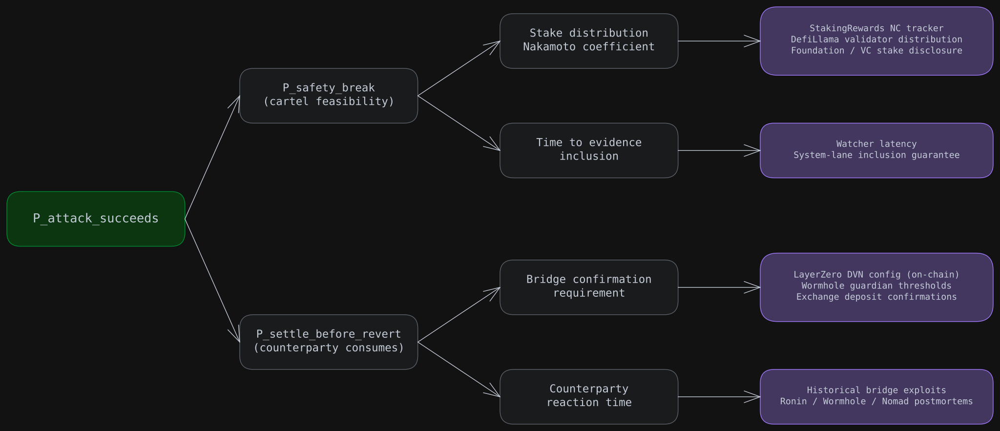
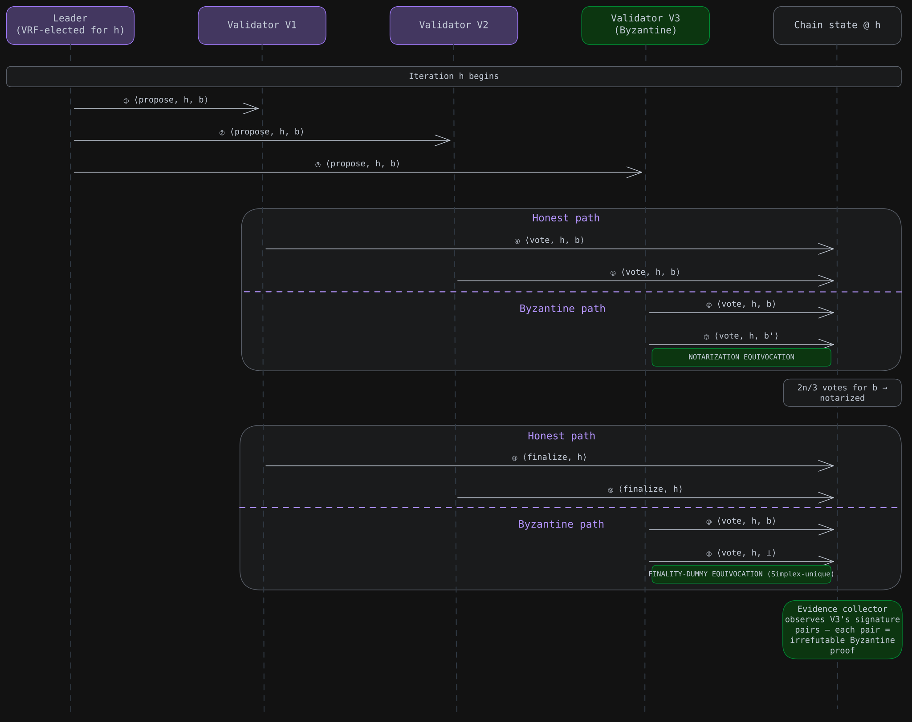
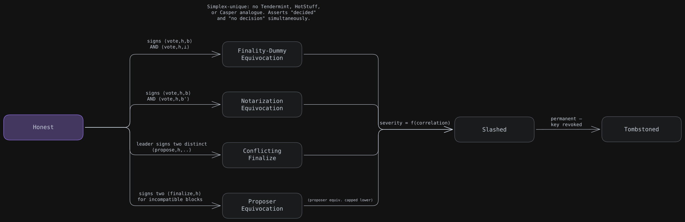
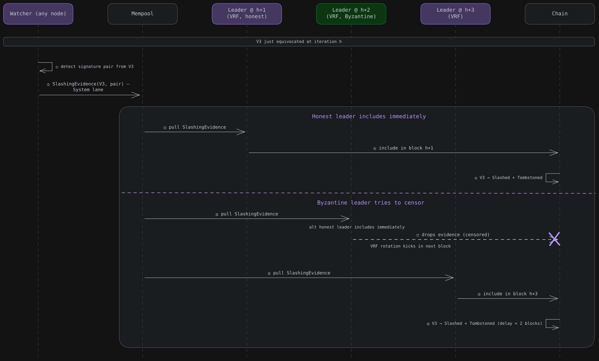
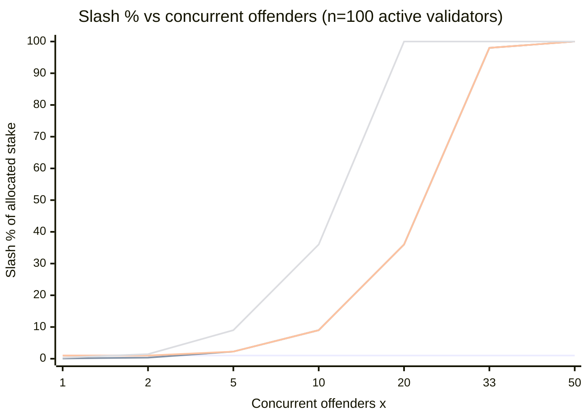
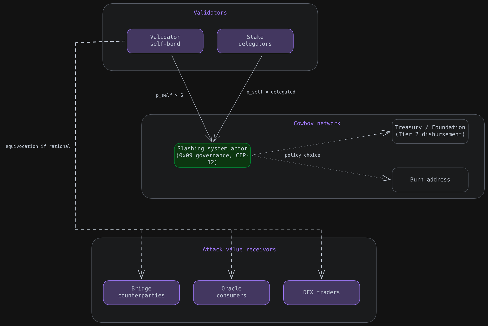

# 🔒 Slashing - System Architecture & Objectives

<!-- Notion page id: ae8e6c7d-52db-8386-99f2-817884b55d75 -->

## 1. Scope

### 1.1 Objective

This document  addresses the slashing parameters that the whitepaper §11 specifies structurally and leaves to governance to calibrate.

The analysis derives recommended TGE values and a forward-looking trajectory across three considerations specific to Cowboy's design:

- Simplex BFT's evidence model - the four attributable Byzantine offences, including the dummy-vote case that is unique to Simplex
- Per-block VRF leader rotation - implications for slashing-evidence inclusion under censorship attempts
- Value-density profile at TGE+30d - a 1-second-block agent-driven L1 with bridges live at launch

### 1.2 In scope

L1 BFT-correctness slashing:

- Minimum validator stake (relative floor, hysteresis bands, per-validator cap)
- Simplex evidence enumeration (offences slashable by signature-pair proof)
- Slashing magnitude options (flat vs. correlation curves)
- Slashing-evidence inclusion path (system-lane budget, VRF rotation interplay)
- Distribution rules (burn vs. evidence-submitter share)

## 2. Empirical context

### 2.1 Slashing landscape (2024–2026) - Modern L1s and restaking systems

The L1 slashing landscape has bifurcated since 2023:

- **Bootstrap-style "no burn":** Sui (0% principal), Aptos (no slashing), Sei v2 (0% with tombstone), Monad (no automated slashing yet), Solana (recording-only, SIMD-0204 / 0212 pending), Berachain (BGT untouched). New L1s converged on "jail + tombstone, ramp magnitude later."
- **AVS-style configurable slashing:** EigenLayer (up to 100% allocated stake, live April 2025), Symbiotic (vault-defined 0–100%, January 2025), Karak (DSS-defined cap), Babylon (per-BSN ratio; Phase-2 launched at 0.1% with explicit ramp plan), Hyperliquid HIP-3 (deployer up-to-100%).
- **Correlation-curve outliers:** Polkadot's `min((3·x/n)², 1)`, Ethereum's correlation penalty `min(B, 3·S·B/T)`. These remain the gold-standard mechanism shapes.
Cowboy's flat 1% sits between regimes - neither bootstrap-style "no burn" nor SOTA value-at-risk-calibrated. It is defensible peer-relative for a launch parameter, but it is not modern mechanism design.

### 2.2 Simplex BFT - production status

| Project | Status | Slashing in production? |
|---|---|---|
| **Tempo** (Stripe / Paradigm, via Commonware C-Simplex) | Mainnet live since March 2026 | **Permissioned** - no public slashing economics |
| **Solana Alpenglow / Votor** (Simplex-derived) | Governance passed (98%), testnet, mainnet late 2026 | Slashing layered separately via SIMD-0204 / 0212 |
| **Ava Labs Go reference** | Library | n/a |

### 2.3 Polkadot's curve - empirical effectiveness since 2020

The curve most often cited as a reference shape has been untested in production at the upper tail:

| Metric | Finding |
|---|---|
| Years live | 6+ (Polkadot mainnet May 2020) |
| Documented slashing events | ~10 major incidents on Polkadot / Kusama |
| Cause distribution | **0% malicious, 100% bugs / operator error** |
| Largest applied equivocation slash | <1% |
| Times curve fired at >9% in production | **Zero verified cases** |
| Times curve fired at 100% (cartel) | **Zero** |
| Times governance reversed slash | Effectively all non-trivial cases |
| Coefficient ("3" in 3x/n) tuning since launch | Never changed |
| Fisherman bounty actually claimed externally | **Zero documented cases** |

**Three implications for Cowboy:**

- The curve's deterrence is theoretical - never tested against real cartels.
- Every near-miss involved bugs, not attacks. Quadratic punishment of correlation is **exactly the wrong shape** for the actual production failure mode.
- Governance reversibility is the *de facto* cap on applied slashes. 
Despite this, Polkadot's shape remains a strong reference shape due to:

- Clean mathematical derivation
- Production-tested in the small-x regime where it produces sensible small slashes
- Better than flat % on every dimension
- Empirical findings tell us what to *fix:* add bug-correlation guardrails and gate reversibility cryptographically.

## 3. Value-density

The whitepaper's flat 1% number does not account for the fact that the deterrent must scale with the chain's actual value-at-risk. Define:

$$
V_{extractable} = V_{per\_proposer\_slot} \times P_{settle\_before\_revert}
$$

Where:

- $V_{per\_proposer\_slot}$ = sum of value-bearing operations in the equivocated block(s) - bridge withdrawals (LayerZero, Wormhole), AMM swaps, oracle settlements, runner job escrow releases.
- $P_{settle\_before\_revert}$ = probability the malicious finalisation gets *consumed* by a counterparty before the equivocation is detected and reverted.
For a flat-percentage slashing scheme to deter the rational attacker:

$$
S \times p_{self} > V_{extractable} \times P_{attack\_succeeds}
$$

Where $S$ = validator's stake, $p_{self}$ = slash percentage, $P_{attack\_succeeds}$ = probability the equivocation actually finalises (function of cartel fraction $f$).

### 3.1 Decomposing each input

### **3.2 Empirical baseline for Cowboy at TGE:**

| Variable | Cowboy launch estimate | Source / rationale |
|---|---|---|
| $T_{finality}$ | ~2 s | Whitepaper §11.1 |
| $n$ (validator set) | ~100 | Estimate |
| Validator self-bond $S$ (TGE relative floor) | 200–300k CBY (~$20k–$150k across FDV) | Per §"Minimum validator stake" below; Sui SIP-39 hysteresis at FDV $100M–$500M |
| Nakamoto Coefficient at TGE | 3–7 | Comparable new L1s: Sui ~5, Aptos ~5, Sei ~7, Berachain ~7 |
| Bridge confirmation requirement | ~64 blocks (~64s) | LayerZero V2 typical for new chains |
| $P_{settle\_before\_revert}$ | 0.1–0.2 | Detection-to-evidence latency / confirmation window |
| $V_{per\_proposer\_slot}$ per block at TGE+30d | Cold-start: $90 avg / $60k tail. Hot-start: $700–$2.1k avg / $300k tail (rare conjunction $825k) | LayerZero/Stargate dominant (Wormhole $10k/24h floor irrelevant for new chains); + native DEX, oracle settlements, CEX hot-wallet, runner escrows. Sourced from Berachain Feb 2025 / Sei Aug 2023 TGE+30d data |
| $V_{extractable}$ per offence | $6k–$12k (cold-start tail) \| $30k–$60k (hot-start tail) \| $82k–$165k (hot-start tail-of-tail) | $V_{per\_proposer\_slot}$ tail × $P_{settle}$ (0.1–0.2) |
| Slash at relative floor ($S_{low} \times p_{floor}$) | ~$240–$1,200 across FDV | Symbolic at TGE; jail + permanent tombstone is primary deterrent (peer L1 standard at launch). Slash magnitude calibration is in-progress in subsequent phases |

### 3.3 Minimum validator stake

The whitepaper §11.1 and  §13 leaves `minimum_validator_stake` as "governance-tunable" with no number. This section replaces it with a derivation grounded in industry precedent and Cowboy's chosen consensus implementation.

#### 3.3.1 Industry methodology research

Of 11 modern L1s investigated (Ethereum, Solana, Sui, Aptos, Avalanche, Polkadot, Hyperliquid, Tempo, Monad, Celestia, Berachain), **only Ethereum has a published numerical derivation** - and Vitalik himself now considers it obsolete given BLS aggregation. Every other chain either picks an arbitrary token amount (Aptos 1M APT, Avalanche 2,000 AVAX, Hyperliquid 10K HYPE), avoids a fixed minimum entirely (Solana, Polkadot, Monad, Celestia, Berachain), or uses a relative voting-power formula (Sui SIP-39: 3/10,000 of staked supply). **No chain ties minimum stake to slashing-deterrent economics.**

Sui SIP-39 is the most defensible structural reference: token-price-independent (denominated in fraction of staked supply), auto-adjusting with network growth, with hysteresis bands preventing churn.

#### 3.3.2 Reference architecture: SIP-39 adapted

Two modifications for Cowboy:

**1. Tighter bands and per-validator cap**

Sui's 0.03% threshold admits ~3,333 candidates. Cowboy's target of $n \approx 100$ active validators implies a 10× tighter floor, plus a per-validator cap to enforce NC ≥ 7. Proposed defaults:

| Threshold | Value | Purpose / implicit ceiling |
|---|---|---|
| $S_{in}$ (entry) | 0.50% of staked CBY | Floor for new validators; ~200 candidate ceiling |
| $S_{low}$ (maintenance / low-watermark) | 0.40% of staked CBY | Active-set floor; ~250 candidate ceiling |
| $S_{out}$ (eviction) | 0.33% of staked CBY | Eviction trigger; ~300 candidate ceiling |
| $S_{max}$ (per-validator cap) | 5.0% of staked CBY | Concentration cap to enforce NC ≥ 7 ($33\% / NC_{target}$); peer-comparable to Sui ~5, Aptos ~5, Sei ~7, Berachain ~7 |

With realistic Pareto-distributed stake, 50–200 validators meet $S_{low}$ in practice, yielding $n \approx 100$ at steady state. Hysteresis ($S_{in} > S_{low} > S_{out}$) prevents flapping under price volatility. The cap ratio $S_{max} / S_{low} = 12.5\times$ gives validators substantial growth headroom while preventing single-actor dominance and coalition concentration is addressed separately by the slashing curve's correlation penalty (see OQ-S8).

**2. Magnitude verified against Cowboy's consensus implementation**

Whitepaper §11.4 (Network Layer) specifies *"votes go directly to the proposer"* over QUIC + TLS 1.3, with BLS12-381 aggregation per §20.1. This is leader-aggregator and not all-to-all gossip. Wire-format and bandwidth analysis:

- Vote payload ≈ **145–155 bytes** (96 B BLS-G2 signature + 32 B block hash + ~16 B headers). Sourced from Commonware `commonware-consensus::simplex` `types.rs` and whitepaper §20.1.
- QC at $n = 300$ ≈ **180 bytes** (96 B aggregate sig + 38 B signer bitmap + headers)
- **Leader inbound burst** at 25% of 1 Gbps absorbs $n \approx 52{,}000$ validators before performance degration happens, i.e., bandwidth is non-binding for any realistic Cowboy committee
The binding ceiling on $n$ is therefore operational/decentralization (NC ≥ 7, governance complexity, validator coordination), not consensus mechanics. The candidate ceiling of ~300 from $S_{out}$ is justified by NC ≥ 7 with realistic stake distribution.

#### 3.3.3 Worked example at TGE

Assumptions:

- 1B CBY genesis supply (whitepaper §13)
- **10% float at TGE** (~100M CBY circulating)
- **60% of float effectively staked** (~60M CBY = 6% of genesis; consistent with liquid-only TGE pattern from Hyperliquid TGE+6mo and Sei Aug 2023 baseline)
Hysteresis bands applied to total staked CBY:

| FDV | Implied CBY price | $S_{in}$ (300k CBY) | $S_{low}$ (240k CBY) | $S_{out}$ (200k CBY) | Slash at $S_{low}$ (1%) |
|---|---|---|---|---|---|
| $100M | $0.10 | $30,000 | $24,000 | $20,000 | $240 |
| $200M | $0.20 | $60,000 | $48,000 | $40,000 | $480 |
| $500M | $0.50 | $150,000 | $120,000 | $100,000 | $1,200 |

Validator entry threshold lands at **$30k–$150k** across FDV scenarios which is peer-comparable to Avalanche P-chain ($60k–$200k for 2,000 AVAX) and Hyperliquid (~$80k for 10,000 HYPE pre-mainnet pricing). Cowboy lands on the lower end of the modern peer range, appropriate for a small early L1.

> 📌
> **Headline:** TGE minimum stake is set by the relative floor (~200–300k CBY = $20k–$150k depending on FDV). Slash magnitude, with the current 1% constant slashing, is symbolic at launch making jail + permanent tombstone the actual deterrent. Aligned with peer L1 practice. Slashing curve calibration ($p_{floor}$, coefficient $c$, ramp schedule) is still under active discussion in subsequent phases.
> 

## 4. Simplex evidence model - what is actually slashable

Under Simplex's safety proof, four distinct two-signature pairs constitute cryptographically attributable Byzantine misbehaviour. The current whitepaper §11.3 collapses three of them into "double signing" and omits the dummy-vote case entirely.

## 5. Per-block VRF rotation - slashing-evidence inclusion path

VRF rotation actually **helps** slashing-evidence robustness — censorship by any single Byzantine leader only delays inclusion by one block. But this only holds if `SlashingEvidence` has guaranteed System-lane budget. Whitepaper §31 already specifies `system_lane_capacity = 5%`. The missing specification is classifying `SlashingEvidence` as System-lane traffic.

## 6. Candidate curve shapes (n=100)

> 💡
> Curves shown for orientation. Final shape, floor, and coefficient are open in OQ-S8.
> 

| Scenario | Whitepaper 1% | Polkadot @ n=100 | Piecewise candidate | Steeper |
|---|---|---|---|---|
| Single isolated equivocator (HSM bug, key restore) | 1% | 0.09% | 1% | 0.36% |
| 2 colluders | 1% | 0.36% | 1% | 1.44% |
| 5 colluders (5%) | 1% | 2.25% | 2.25% | 9% |
| 10 colluders (10%) | 1% | 9% | 9% | 36% |
| 20 colluders (20%) | 1% | 36% | 36% | 100% |
| 33 colluders (BFT threshold) | 1% | 98% | 98% | 100% |

## 7. Stakeholders and value flow

## 8. Tensions surfaced

- **Launch-phase deterrent vs steady-state deterrent**
  - The §11.3 framing assumes reputational + opportunity-cost penalties dominate. At TGE these substrates are zero.
- **Honest-fault vs malicious-attack symmetry**
  - Flat 1% punishes a misconfigured single validator identically to a coordinated cartel. Modern systems break this symmetry via correlation curves.
- **Consensus surface vs application surface**
  - Cowboy bundles BFT safety, bridge inventory, oracle TVL, and runner economics into a single L1 slash %. These have different value-at-risk profiles.
- **Worst-case actor vs typical actor**
  - Reputation / opportunity cost binds the long-running validator with delegations. It does not bind a single-shot attacker who spun up at minimum stake to attack a bridge on day 30.
- **Provability vs severity.** 
  - Higher slashes raise the cost of false-positives. Simplex's two-vote-per-iteration evidence is unambiguous but the cost of false-positives still scales with the magnitude chosen, so a steeper curve raises the bar on every offence type, including those with weaker evidence chains.
- **Agent-native attack profile.** 
  - Cowboy is the first L1 where the *user* class is autonomous software. Bots can spin up validators from their own treasury, attack-and-exit faster than human-rate governance, and may cluster correlated faults if many agents share frameworks. Argues *for* correlation scaling and not against it.

## 9. Open questions

| OQ | Gap | Resolution path |
|---|---|---|
| OQ-S1 | $V_{per\_proposer\_slot}$ scoping must include all value-bearing operations — LayerZero/Stargate (dominant), native DEX, oracle settlements, CEX hot-wallet sweeps, runner escrows; Wormhole Governor ($10k/24h floor for new chains) is irrelevant for sizing | Per-source estimate sourced from Berachain Feb 2025 / Sei Aug 2023 TGE+30d data (see baseline table). Re-derive at TGE+30d/+90d/+180d once Cowboy devnet/mainnet live |
| OQ-S2 | Cowboy hasn't pinned a `commonware-consensus` crate version | Whitepaper amendment to normatively pin a version or reproduce struct layout |
| OQ-S3 | Per-validator bandwidth budget (25% of 1 Gbps) is a stipulation, not a citation | benchmark Cowboy devnet validators |
| OQ-S4 | NEW_VIEW (view-change) message size and frequency unstated | Whitepaper §20.1 amendment; bound `view_change_rate` under partial synchrony |
| OQ-S5 | `block_hash` digest type ambiguous in whitepaper (Blake3 in CIP-4 §QMDB; Keccak256 in §13.1) | Whitepaper amendment to pin which digest is in the QC |
| OQ-S6 | $V_{per\_proposer\_slot}$ ramp schedule (TGE → mature) for converting the deterrent inequality from normative target to enforceable constraint as stake and value-density scale | Tie ramp triggers to bridge/oracle TVL milestones; publish in CIP-12 amendment alongside slashing distribution rules. Define V trajectory: cold-start anchor → hot-start tail → mature value-density |
| OQ-S7 | CEX hot-wallet tail size at TGE+30d - most uncertain $V_{per\_proposer\_slot}$ component, dominates 99.9th percentile | Trace comparable launch (Berachain Binance hot-wallet) via Arkham Intelligence post-TGE; tighten 99.9th-pct bound on hot-start scenario |
| OQ-S8 | Slashing curve calibration itself - $p_{floor}$, correlation coefficient $c$, piecewise vs. pure quadratic, distribution split (burn vs. evidence-submitter), reversal proof types — still under active discussion | Resolved in subsequent phases of this design exercise (Concept Generation, Selection, CDR) |

## 10. Final objectives

| Objective | Type | Concrete meaning at n=100 |
|---|---|---|
| Deter Byzantine attack, across mature chain lifecycle, with ramp per OQ-S6 | Objective | Worst-case attacker EV ≤ 0 even with no reputational stake |
| Differentiate honest-fault from malicious-attack severity | Objective | Single-validator equivocation costs floor; 5-validator cartel ~10× floor; 1/3 cartel costs full stake |
| Scale slash to value-at-risk on the secured surface | Objective | Stake-at-risk should track bridge inventory and oracle TVL, not be set once and forgotten |
| Preserve validator participation incentives | Objective | False-positive cost stays bounded; clear evidentiary thresholds; tombstone reversible only via Tier 4 |
| Bound worst-case correlated failure - at n=100, asymptote to 100% by x=33 (BFT threshold) | Objective | Curve coefficient ≈ 3–6 based on whether the decision is 100% slash at x=33% or x=20% |
| Published ramp schedule tied to network-maturity milestones | Objective | E.g., "p_self floor doubles when bridge inventory exceeds 5× total bonded stake" |
| Permanent tombstoning on equivocation | Constraint | Match Sei v2 / Celestia / Babylon converged practice |
| Enumerate slashable offences in 1:1 correspondence with Simplex's evidence model | Constraint | Four offences: notarization equivocation, finality-dummy equivocation, conflicting finalize, proposer equivocation |
| Calibrate to per-block value-density, not flat % | Objective | Use formal V_extractable formula. Ramp p_self with measurable on-chain quantity |
| Honest-correlated-fault safety cap: when x ≥ X_safety, auto-trigger Tier 4 governance review | Objective | Polkadot empirical failure mode is bugs producing correlated faults. Quadratic punishment is structurally inappropriate for this case |
| Cryptographically-gated slash reversal via Tier 4 (proof of evidence invalidity, not discretionary) | Objective | Avoid "every slash gets bailed out" failure mode while preserving honest-fault recoverability |
| Slashing-evidence transactions have guaranteed System-lane inclusion | Constraint | Architectural - addition to dual-metered-gas spec, not just a slashing param |
| BFT-provable, deterministic, aligned 1:1 with Simplex's four evidence types | Constraint | Drop "double signing" umbrella and explicitly enumerate the four signature-pair offences |
| Governance-tunable without hard fork (curve coefficient as Tier 0 param) | Constraint | Curve shape itself can be Tier 4 if we want flexibility |
