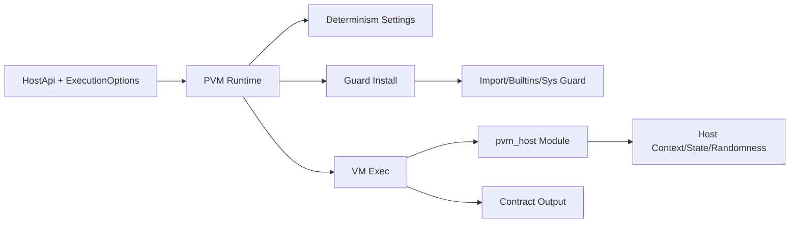
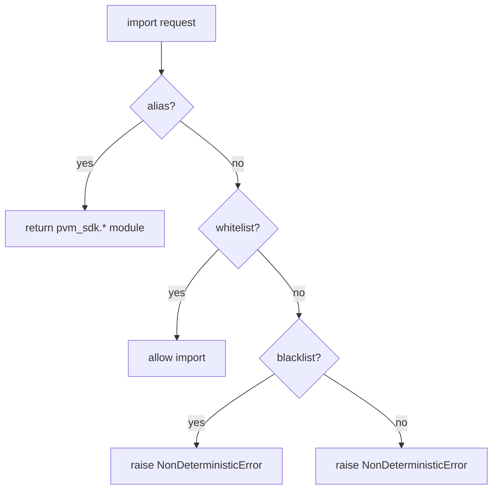
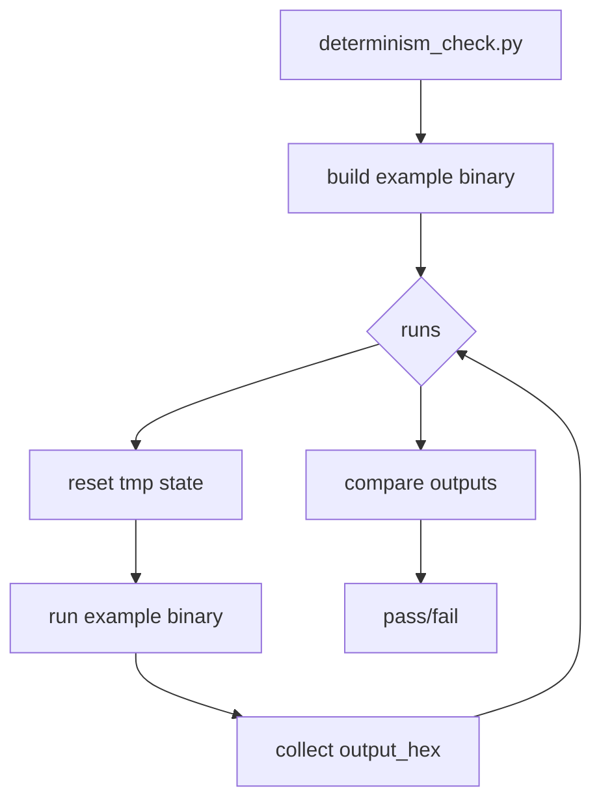
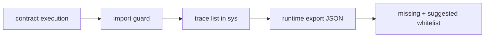

# PVM 确定性 Demo 实施全量复盘（阶段 A）

本文记录一次完整的确定性阶段 A 落地过程：从设计取舍、代码实施、demo 验证到排错闭环。内容包含详细步骤、问题与解决方式、原理解释，并补充阶段 B/C/D 的概要。

---

## 0. 结论摘要（先说结论）

- 本次选择“确定性阶段 A”作为落地点：先保障执行环境可控、输入可追溯、标准库受限，再做可复现实验 demo。
- 产出包括：runtime 确定性设置、import/builtins/sys guard、stdlib shim、demo 合约、自动一致性检查脚本。
- 过程中主要问题来自“stdlib 隐式依赖链”与“macOS dyld 运行环境”，均已补齐与自动化处理。
- 实际验证：demo 可多次重复运行，`output_hex` 完全一致。

---

## 1. 为什么先做阶段 A，以及 B/C/D 简介

### 1.1 选择阶段 A 的原因

- **最低风险/最高收益**：只改 runtime 层和 stdlib 边界，不触碰 VM 内核（SoftFloat/gas）即可让执行环境收敛到可控范围。
- **快速验证闭环**：guard + shim + demo 能立刻证明“确定性入口”生效，避免先做大改动再返工。
- **便于后续扩展**：A 为 B/C/D 打下稳定边界（白名单、异常映射、runtime hooks）。

### 1.2 后续阶段简述（B/C/D）

- **阶段 B：Opcode 级 gas 计量**
  - 在 VM opcode dispatch 中计费，提供链侧可控的“执行成本上限”。
  - 输出固定 gas 表，结合 HostApi 计费。

- **阶段 C：SoftFloat 与 float 确定性**
  - 以 SoftFloat 替换 `f64`，稳定 `hash(float)` 与 `repr/str`。
  - `math` 模块使用 softfloat 子集，确保跨平台一致。

- **阶段 D：Checkpoint/Resume 版本锁定**
  - Checkpoint 元信息携带 `pvm_version/stdlib_hash/code_hash`。
  - Resume 校验必须一致，否则拒绝执行。

---

## 2. 实施范围与核心文件

### 2.1 仅覆盖阶段 A 的内容

- Runtime deterministic settings
- import/builtins/sys guard
- stdlib shim（time/random/sys）
- demo 合约与多次一致性检查

### 2.2 主要文件路径

- `crates/pvm-runtime/src/determinism.rs`
- `crates/pvm-runtime/src/guard.rs`
- `crates/pvm-runtime/src/lib.rs`
- `crates/pvm-runtime/src/module.rs`
- `Lib/pvm_sdk/*`
- `examples/pvm_runtime_chain_demo/determinism_demo.py`
- `examples/pvm_runtime_chain_demo/determinism_check.py`
- `examples/pvm_runtime_chain_demo/README.md`

---

## 3. 逐步实施过程（按实际推进顺序）

### 3.1 增加 DeterminismOptions 并接入 runtime

**目标**：让 deterministic 设置可配置，并与旧接口兼容。

**实现**：
- 新增 `DeterminismOptions`，提供默认白/黑名单。
- `ExecutionOptions` 新增 `determinism: Option<DeterminismOptions>`。
- 保留旧字段 `deterministic: bool`，当其为 true 时自动转为 `DeterminismOptions`。

**核心设置**（determinism.enabled 时强制）：
- `hash_seed` 固定化
- `ignore_environment/import_site/user_site/isolated/safe_path` 全打开
- `install_signal_handlers = false`

### 3.2 安装 guard（import/builtins/sys）

**目标**：确保所有外部输入和系统行为可控。

**实现点**：
- 在 interpreter 进入后安装 guard：`guard::install(vm, det, host_module_name)`。
- guard 用 Python 代码实现：
  - 覆盖 `builtins.__import__`：白名单通过、黑名单拒绝。
  - 插入 `sys.meta_path` finder：拦截非法 import。
  - 禁止 `open/io.open`：直接抛 `DeterministicValidationError`。
  - 固定 `sys.path` 为 runtime 计算路径。

### 3.3 异常类型与 HostError 映射

**目标**：链侧稳定错误码映射。

新增异常类型：
- `DeterministicValidationError` -> `HostError::InvalidInput`
- `NonDeterministicError` -> `HostError::Forbidden`
- `OutOfGasError` -> `HostError::OutOfGas`

在 `map_exception` 中识别并映射，确定性异常会打印出来方便排错。

### 3.4 stdlib shim 模块

**目标**：将非确定性模块替换为 host 驱动的确定性模块。

- `pvm_time`：返回 `pvm_host.context().timestamp_ms`
- `pvm_random`：基于 `pvm_host.randomness(domain)` 生成可重复随机
- `pvm_sys`：为后续版本锁定预留字段

### 3.5 Demo 合约与一致性检查脚本

**Demo 合约**：`determinism_demo.py`
- 展示：state/event 复现、random/time shim、blocked 模块/IO。

**一致性检查**：`determinism_check.py`
- 多次运行同一合约，比较 `output_hex`。
- 可选 `--decode` 打印 JSON。
- 自动设置 `DYLD_FALLBACK_LIBRARY_PATH`（macOS / conda / Homebrew）。
- 构建阶段剥离 `DYLD_*`，避免 conda libc++ 干扰 `cargo build`。

---

## 4. 关键问题清单与修复说明（完整排错链路）

### 4.1 Rust 编译错误：`new_str` 参数类型不匹配
- **现象**：`PyStr` 不接受 `&String`。
- **原因**：`vm.ctx.new_str` 要求 `&str`。
- **解决**：改为 `item.as_str()`。
- **原理**：`String` 与 `&str` 是不同类型，需要显式转换。

### 4.2 import guard 触发 `Error: Forbidden`

**现象**：运行 demo 大量 `NonDeterministicError: module not allowed`。

**原因**：stdlib 模块内部会继续 import 依赖模块（尤其是 C 扩展）。

**解决策略**：
- 逐次捕获被拒模块名并加入白名单。
- 按依赖链补全（如 `hashlib -> warnings -> re -> enum -> functools -> abc -> _py_abc -> _weakrefset -> _weakref`）。

**代表性依赖链**：
- `str.encode("ascii")` -> `encodings` -> `codecs`
- `json` -> `_json` + `re`
- `hashlib` -> `_hashlib/_sha*` + `warnings`
- `re` -> `_sre` + `enum` -> `functools` -> `abc` -> `_py_abc` -> `_weakrefset` -> `_weakref`
- `collections` -> `keyword` + `reprlib` -> `_thread`

**原理**：白名单策略本质是“仅允许预定义模块集合”，必须包含所有隐式依赖。

### 4.3 `unknown encoding: ascii`

- **现象**：`str(...).encode("ascii")` 失败。
- **原因**：`sys.path_hooks` 被清空，导致 codecs 机制无法加载。
- **修复**：不再清空 `sys.path_hooks`，仅固定 `sys.path`。
- **原理**：编码查找依赖 path hooks；清空会破坏加载流程。

### 4.4 `import random` 返回 `pvm_sdk` 包而非子模块

- **现象**：`random.randbytes` 不存在。
- **原因**：`__import__("a.b")` 默认返回 `a`。
- **修复**：alias 时使用 `fromlist` 强制返回子模块。
- **原理**：Python import 的返回值依赖 `fromlist` 语义。

### 4.5 macOS dyld / conda libc++ 相关问题

- **现象 A**：`libiconv.2.dylib` 缺失。
- **原因**：运行时没有找到 libiconv；Homebrew 不一定安装。
- **解决**：自动把 `CONDA_PREFIX/lib` 与常见路径写入 `DYLD_FALLBACK_LIBRARY_PATH`。

- **现象 B**：`cargo build` 被 conda libc++ 覆盖导致 SIGSEGV。
- **原因**：`DYLD_LIBRARY_PATH` 覆盖系统 libc++。
- **解决**：构建阶段清除 `DYLD_*`，运行阶段仅设置 `DYLD_FALLBACK_LIBRARY_PATH`。

**原理**：`DYLD_LIBRARY_PATH` 优先级高，会覆盖系统动态库；`DYLD_FALLBACK_LIBRARY_PATH` 优先级低，更安全。

---

## 5. 原理解释（核心机制）

### 5.1 确定性输入边界

只允许：`code / input / host_state / host_context / randomness` 影响结果；其他输入被 guard 屏蔽。

### 5.2 runtime 设置为何能降低非确定性

- `hash_seed` 固定：避免哈希随机化
- `ignore_environment`：禁止读取环境变量
- `isolated/safe_path`：隔离 `sys.path` 与用户 site-packages
- `import_site=false`：阻止隐式 site 注入

### 5.3 import guard 的作用

- 将“可用模块集合”限制在白名单内。
- 拦截隐式 import，防止 OS/IO/网络等模块进入 VM。

### 5.4 shim 模块的意义

- 将时间/随机数从“本机”转移到“链上下文”。
- 确保跨节点输入一致，从而共识一致。

---

## 6. Demo 输出字段说明

`determinism_demo.py` 返回 JSON（hex 编码）：

- `blocked`：记录被拒的模块与 open/IO。
- `module_time/module_random`：确认 `time/random` 映射到 `pvm_sdk`。
- `timestamp_ns`：来自 `pvm_host.context`。
- `random_hex`：来自 `pvm_host.randomness`。
- `state_hex/event_hex`：状态与事件一致性验证。

多次运行应得到完全一致的 `output_hex`。

---

## 7. 图示与流程图

### 7.1 确定性运行路径（整体）



### 7.2 Import Guard 判定流程



### 7.3 一致性检查脚本流程



---

## 8. 产出文件清单

- `crates/pvm-runtime/src/determinism.rs`
- `crates/pvm-runtime/src/guard.rs`
- `crates/pvm-runtime/src/lib.rs`
- `crates/pvm-runtime/src/module.rs`
- `Lib/pvm_sdk/__init__.py`
- `Lib/pvm_sdk/pvm_time.py`
- `Lib/pvm_sdk/pvm_random.py`
- `Lib/pvm_sdk/pvm_sys.py`
- `examples/pvm_runtime_chain_demo/determinism_demo.py`
- `examples/pvm_runtime_chain_demo/determinism_check.py`
- `examples/pvm_runtime_chain_demo/README.md`

---

## 9. 运行方式

**单次 demo**：
```bash
cargo run --release --example pvm_runtime_chain_demo -- examples/pvm_runtime_chain_demo/determinism_demo.py hello
```

**多次一致性检查**：
```bash
python examples/pvm_runtime_chain_demo/determinism_check.py --runs 5 --decode
```

---

## 10. 后续建议（含工具补充）

### 10.1 白名单生成工具（import tracing）

**目的**：自动构建“实际依赖闭包”，减少手工抓漏模块。

**核心思路**：
- 在 guard 层拦截 `__import__`，把所有 import 记录到 `sys._pvm_import_trace`。
- `trace_allow_all` 模式允许继续执行，保证能收集到完整依赖链。
- runtime 把 trace 输出为 JSON，自动给出 `missing` 与 `whitelist_suggested`。

**输出字段**（`tmp/pvm_import_trace.json`）：
- `trace`：按发生顺序记录的 import（含重复）。
- `unique`：去重后的依赖闭包。
- `missing`：白名单缺口（最小增量）。
- `blacklisted`：命中黑名单的 import（需要人工确认）。
- `whitelist_suggested`：基础白名单 + 最小增量。

**使用方式**：
```bash
python examples/pvm_runtime_chain_demo/determinism_check.py \
  --runs 1 \
  --trace-imports tmp/pvm_import_trace.json \
  --trace-allow-all \
  --print-whitelist
```

或直接运行二进制：
```bash
cargo run --release --example pvm_runtime_chain_demo -- \
  --trace-imports tmp/pvm_import_trace.json \
  --trace-allow-all \
  examples/pvm_runtime_chain_demo/determinism_demo.py hello
```

**工具流程图**：


### 10.2 阶段 B/C/D 落地

- **阶段 B**：opcode gas 计量。
- **阶段 C**：SoftFloat 与 float 确定性。
- **阶段 D**：checkpoint 版本锁定。
