# Node、Actor、Runner 调用流程详解

本文档详细说明 Node、Actor、Runner 之间的完整调用流程，包括 LLM、HTTP、MCP 三种任务类型的执行架构。

---

## 系统角色说明

| 角色 | 位置 | 职责 |
|------|------|------|
| **Node** | 链上 | 运行共识（Simplex BFT）、执行交易、管理状态 |
| **Actor** | 链上（PVM 中执行） | 用户编写的智能合约，调用 Runner 执行任务 |
| **System Actors** | 链上 | Runner Registry、Job Dispatcher、Result Verifier |
| **Runner Node** | 链下（独立进程） | 执行 LLM/HTTP/MCP 等计算任务，完全独立于 Node |
| **LLM Provider** | 外部服务 | 提供 LLM 推理能力（OpenAI、Anthropic、本地模型等） |
| **MCP Server** | 外部服务 | 提供工具调用能力（数据库、文件系统、浏览器等） |

---

## 完整系统架构

```
┌─────────────────────────────────────────────────────────────────────────────────┐
│                              Cowboy Chain (主链)                                 │
│                                                                                  │
│   ┌────────────────────────────────────────────────────────────────────────┐   │
│   │                           用户 Actor (智能合约)                          │   │
│   │   @runner.continuation(timeout_blocks=100)                             │   │
│   │   async def process(self, msg):                                        │   │
│   │       # 可以调用任意组合的任务                                            │   │
│   │       llm_result = await runner.llm(prompt="分析市场...")               │   │
│   │       http_data = await runner.http(url="https://api.example.com")     │   │
│   │       db_result = await runner.mcp(server="postgres", tool="query")    │   │
│   └────────────────────────────────────────────────────────────────────────┘   │
│                                        │                                        │
│                                        ▼                                        │
│   ┌────────────────────────────────────────────────────────────────────────┐   │
│   │                          System Actors (系统合约)                        │   │
│   │  ┌──────────────────┐  ┌──────────────────┐  ┌──────────────────┐     │   │
│   │  │  Runner Registry │  │  Job Dispatcher  │  │ Result Verifier  │     │   │
│   │  │  (Runner 注册表) │  │   (任务分发器)    │  │   (结果验证器)    │     │   │
│   │  └──────────────────┘  └──────────────────┘  └──────────────────┘     │   │
│   └────────────────────────────────────────────────────────────────────────┘   │
│                                        │                                        │
└────────────────────────────────────────┼────────────────────────────────────────┘
                                         │
                                         │ REST API (心跳、获取任务、提交结果)
                                         │
┌────────────────────────────────────────▼────────────────────────────────────────┐
│                              Runner Node (链下执行节点)                           │
│                                                                                  │
│   ┌────────────────────────────────────────────────────────────────────────┐   │
│   │                           Executor Registry                             │   │
│   │                        (执行器注册与路由)                                 │   │
│   └────────────────────────────────────────────────────────────────────────┘   │
│                    │                    │                    │                   │
│                    ▼                    ▼                    ▼                   │
│   ┌──────────────────────┐ ┌──────────────────────┐ ┌──────────────────────┐   │
│   │     LLM Executor     │ │    HTTP Executor     │ │     MCP Executor     │   │
│   │  ┌────────────────┐  │ │  ┌────────────────┐  │ │  ┌────────────────┐  │   │
│   │  │ OpenAI Client  │  │ │  │ HTTP Client    │  │ │  │ MCP Client     │  │   │
│   │  │ Anthropic      │  │ │  │ TLS 验证       │  │ │  │ Stdio/HTTP/WS  │  │   │
│   │  │ 本地模型       │  │ │  │ 数据提取       │  │ │  │ 工具调用       │  │   │
│   │  └────────────────┘  │ │  └────────────────┘  │ │  └────────────────┘  │   │
│   └──────────┬───────────┘ └──────────┬───────────┘ └──────────┬───────────┘   │
│              │                        │                        │                │
└──────────────┼────────────────────────┼────────────────────────┼────────────────┘
               │                        │                        │
               ▼                        ▼                        ▼
┌──────────────────────┐ ┌──────────────────────┐ ┌──────────────────────────────┐
│   LLM Providers      │ │   HTTP Endpoints     │ │      MCP Servers             │
│  ┌────────────────┐  │ │  ┌────────────────┐  │ │  ┌────────────┐ ┌─────────┐ │
│  │ OpenAI API     │  │ │  │ REST APIs      │  │ │  │ postgres   │ │ browser │ │
│  │ Anthropic API  │  │ │  │ GraphQL APIs   │  │ │  │ filesystem │ │ github  │ │
│  │ 本地 Ollama    │  │ │  │ Web 页面       │  │ │  │ slack      │ │ ...     │ │
│  │ vLLM/TGI      │  │ │  │ 数据源         │  │ │  └────────────┘ └─────────┘ │
│  └────────────────┘  │ │  └────────────────┘  │ │                              │
└──────────────────────┘ └──────────────────────┘ └──────────────────────────────┘
```

---

## Runner Node 内部架构

### 执行器类型对比

| 执行器 | 用途 | 外部依赖 | 典型场景 |
|--------|------|----------|----------|
| **LLM Executor** | AI 推理 | OpenAI/Anthropic/本地模型 | 文本生成、分析、翻译 |
| **HTTP Executor** | 网络请求 | 任意 HTTP 端点 | API 调用、数据获取、网页抓取 |
| **MCP Executor** | 工具调用 | MCP 服务器 | 数据库查询、文件操作、浏览器控制 |

### 架构图 (Mermaid)

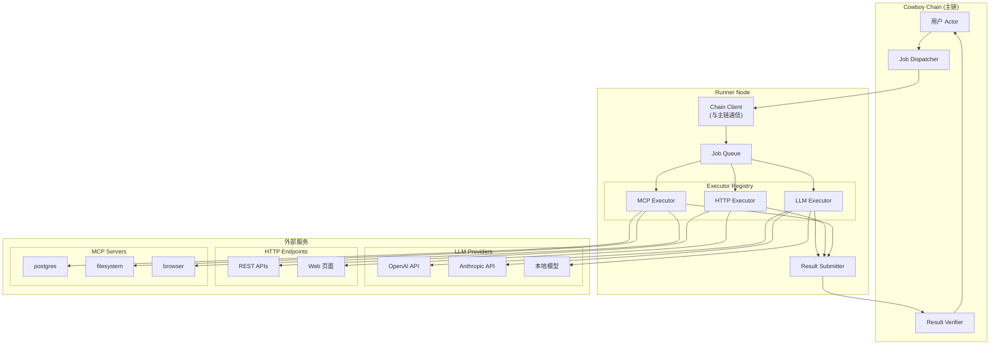

---

## 三种任务类型详解

### 1. LLM 任务

**用途**：调用大语言模型进行文本生成、分析、翻译等 AI 任务。

**架构**：
```
Runner Node                          LLM Provider
┌─────────────────┐                 ┌─────────────────┐
│   LLM Executor  │ ──── HTTPS ──→ │   OpenAI API    │
│                 │                 │   Anthropic API │
│ - API Key 管理  │ ←── 响应 ────  │   本地 Ollama   │
│ - 重试逻辑      │                 │   vLLM/TGI      │
│ - 结果解析      │                 └─────────────────┘
└─────────────────┘
```

**任务示例**：
```json
{
  "type": "Llm",
  "model_id": "0x...",
  "prompt": "分析 BTC 未来 24 小时的市场趋势",
  "system_prompt": "你是一个专业的加密货币分析师",
  "temperature": 0.7,
  "max_tokens": 1000
}
```

**执行流程**：
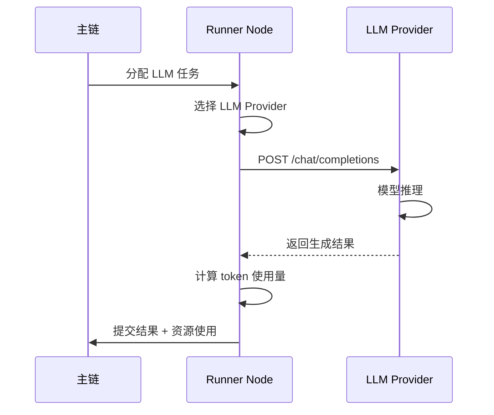

---

### 2. HTTP 任务

**用途**：发起 HTTP 请求，获取外部数据（API、网页、数据源）。

**架构**：
```
Runner Node                          HTTP Endpoints
┌─────────────────┐                 ┌─────────────────┐
│  HTTP Executor  │ ──── HTTPS ──→ │   REST API      │
│                 │                 │   GraphQL API   │
│ - TLS 验证      │ ←── 响应 ────  │   Web 页面      │
│ - 数据提取      │                 │   JSON 数据源   │
│ - 新鲜度检查    │                 └─────────────────┘
└─────────────────┘
```

**任务示例**：
```json
{
  "type": "Http",
  "url": "https://api.coingecko.com/api/v3/simple/price?ids=bitcoin&vs_currencies=usd",
  "method": "GET",
  "headers": {
    "Accept": "application/json"
  },
  "extraction": {
    "method": "JsonPath",
    "selectors": {
      "price": "$.bitcoin.usd"
    }
  },
  "freshness": {
    "max_age_seconds": 60
  }
}
```

**执行流程**：
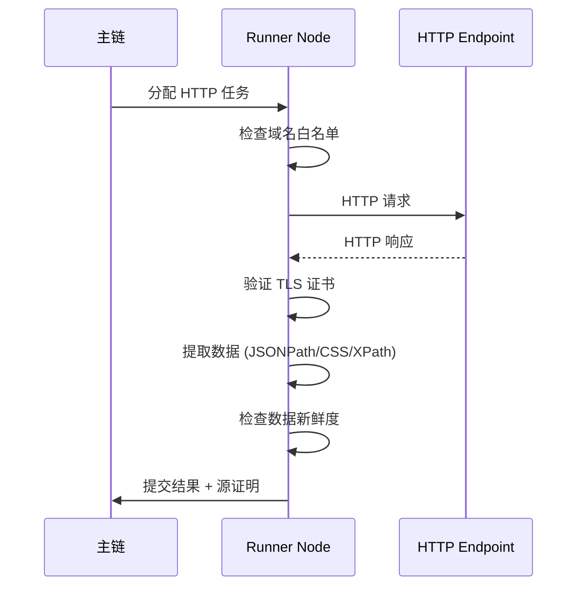

**特性**：
- **域名白名单**：只允许访问预先配置的域名
- **TLS 证书验证**：记录证书指纹，防止中间人攻击
- **数据提取**：支持 JSONPath、CSS Selector、XPath、Regex
- **新鲜度检查**：确保数据在指定时间内获取

---

### 3. MCP 任务

**用途**：通过 MCP (Model Context Protocol) 调用外部工具。

**架构**：
```
Runner Node                          MCP Servers
┌─────────────────┐                 ┌─────────────────────────────────┐
│   MCP Executor  │                 │  ┌─────────────┐ ┌───────────┐ │
│                 │ ─── Stdio ───→ │  │  postgres   │ │ filesystem│ │
│ - 连接管理      │ ─── HTTP ────→ │  └─────────────┘ └───────────┘ │
│ - 工具发现      │ ─── WebSocket→ │  ┌─────────────┐ ┌───────────┐ │
│ - 参数验证      │ ←── 响应 ────  │  │   browser   │ │   github  │ │
└─────────────────┘                 │  └─────────────┘ └───────────┘ │
                                    └─────────────────────────────────┘
```

**任务示例**：
```json
{
  "type": "Mcp",
  "server": "postgres",
  "tool_name": "query",
  "arguments": {
    "sql": "SELECT * FROM market_data WHERE symbol = 'BTC' ORDER BY timestamp DESC LIMIT 10"
  },
  "timeout_seconds": 30
}
```

**执行流程**：
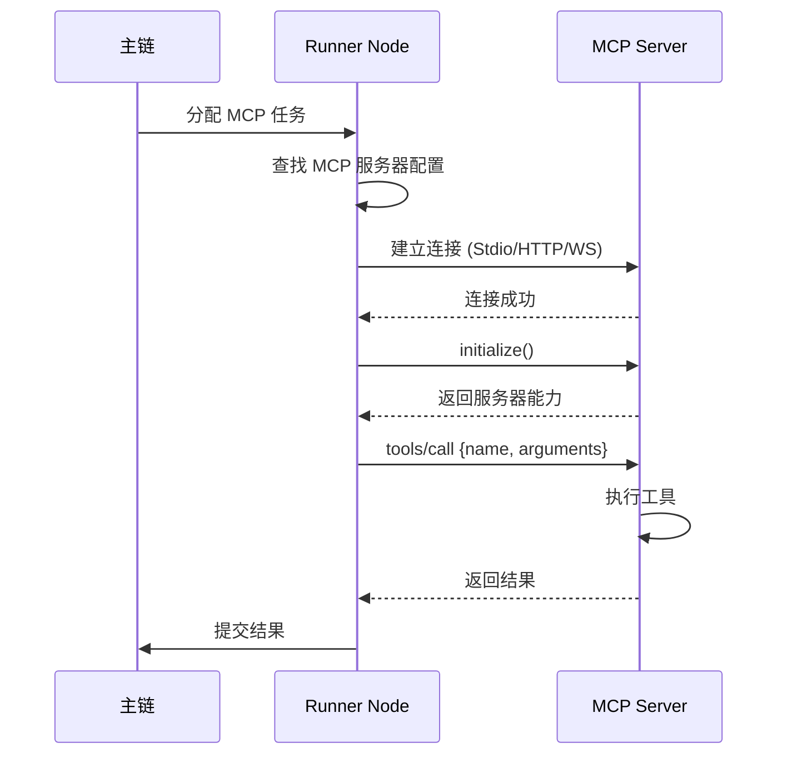

**MCP 传输类型**：

| 传输类型 | 使用场景 | 示例 |
|----------|----------|------|
| **Stdio** | 本地进程 | `npx -y @modelcontextprotocol/server-postgres` |
| **HTTP** | 远程服务 | `https://mcp.example.com/postgres` |
| **WebSocket** | 实时双向 | `wss://mcp.example.com/browser` |

**常见 MCP 服务器**：

| 服务器 | 功能 | 典型工具 |
|--------|------|----------|
| `postgres` | 数据库访问 | `query`, `execute`, `list_tables` |
| `filesystem` | 文件操作 | `read_file`, `write_file`, `list_directory` |
| `browser` | 浏览器控制 | `navigate`, `screenshot`, `click` |
| `github` | GitHub 操作 | `search_repos`, `create_issue`, `list_prs` |
| `slack` | Slack 通信 | `send_message`, `list_channels` |

---

## MCP 服务接入指南

### 配置方式

MCP 服务通过配置文件接入 Runner，每个 MCP 服务器需要以下配置：

```yaml
# runner-config.yaml
mcp_servers:
  # Stdio 方式 - 本地进程
  - name: "postgres"
    transport:
      type: "Stdio"
      command: "npx"
      args: ["-y", "@modelcontextprotocol/server-postgres"]
    endpoint: "postgresql://localhost:5432/mydb"
    auth:
      type: "None"
    timeout_seconds: 30
    enabled: true

  # HTTP 方式 - 远程服务
  - name: "github"
    transport:
      type: "Http"
      url: "https://mcp.example.com/github"
    auth:
      type: "BearerToken"
      token: "${GITHUB_TOKEN}"
    timeout_seconds: 60
    enabled: true

  # WebSocket 方式 - 实时双向
  - name: "browser"
    transport:
      type: "WebSocket"
      url: "wss://mcp.example.com/browser"
    auth:
      type: "ApiKey"
      key: "${BROWSER_API_KEY}"
      header: "X-API-Key"
    timeout_seconds: 120
    enabled: true
```

### 三种传输类型架构

```
┌─────────────────────────────────────────────────────────────────────────────┐
│                              Runner Node                                     │
│                                                                              │
│   ┌─────────────────────────────────────────────────────────────────────┐   │
│   │                          MCP Executor                                │   │
│   │                                                                      │   │
│   │   ┌─────────────┐   ┌─────────────┐   ┌─────────────────────────┐  │   │
│   │   │ Stdio 连接   │   │ HTTP 连接   │   │ WebSocket 连接          │  │   │
│   │   │             │   │             │   │                         │  │   │
│   │   │ 启动子进程   │   │ POST 请求   │   │ 持久连接                 │  │   │
│   │   │ stdin/stdout │   │ JSON-RPC   │   │ 双向通信                 │  │   │
│   │   └──────┬──────┘   └──────┬──────┘   └────────────┬────────────┘  │   │
│   └──────────┼─────────────────┼──────────────────────┼────────────────┘   │
└──────────────┼─────────────────┼──────────────────────┼────────────────────┘
               │                 │                      │
               ▼                 ▼                      ▼
┌──────────────────────┐ ┌──────────────────┐ ┌──────────────────────────────┐
│   本地 MCP 服务器     │ │  远程 MCP 服务   │ │    实时 MCP 服务              │
│                      │ │                  │ │                              │
│  npx @mcp/postgres   │ │  API Gateway     │ │  Browser Automation          │
│  uvx mcp-filesystem  │ │  Serverless      │ │  Real-time Data              │
│  python mcp_server   │ │  Cloud Service   │ │  Streaming                   │
└──────────────────────┘ └──────────────────┘ └──────────────────────────────┘
```

### MCP 接入流程

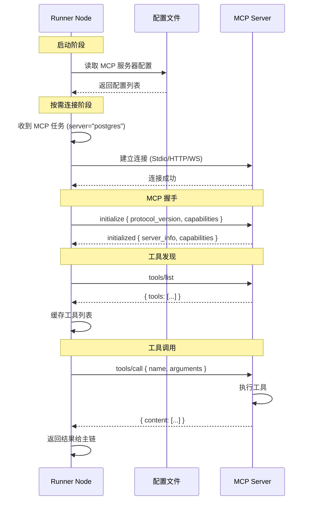

### 代码示例

**Runner 配置加载**：
```rust
// 加载 MCP 服务器配置
let mcp_configs: Vec<McpServerConfig> = load_config("mcp_servers.yaml")?;

// 创建 MCP Executor
let mcp_executor = McpExecutor::new(mcp_configs);

// 注册到执行器注册表
executor_registry.register("mcp", Box::new(mcp_executor));
```

**MCP 任务执行**：
```rust
impl McpExecutor {
    async fn execute(&self, job: &JobSpec) -> Result<RunnerResult> {
        // 1. 解析 MCP 任务参数
        let (server, tool_name, arguments) = match &job.job_type {
            JobType::Mcp { server, tool_name, arguments, .. } => {
                (server, tool_name, arguments)
            }
            _ => return Err(ExecutorError::InvalidJobType),
        };
        
        // 2. 获取或创建 MCP 客户端连接
        self.get_or_create_client(server).await?;
        
        // 3. 调用工具
        let response = self.call_tool(server, tool_name, arguments).await?;
        
        // 4. 返回结果
        Ok(RunnerResult {
            job_id: job.job_id,
            data: serde_json::to_value(&response)?,
            usage: ResourceUsage::default(),
            ..Default::default()
        })
    }
}
```

### 常用 MCP 服务器安装

| MCP 服务器 | 安装命令 | 提供的工具 |
|------------|----------|------------|
| **postgres** | `npx -y @modelcontextprotocol/server-postgres` | query, execute, list_tables |
| **filesystem** | `npx -y @modelcontextprotocol/server-filesystem` | read_file, write_file, list_directory |
| **github** | `npx -y @modelcontextprotocol/server-github` | search_repos, create_issue, list_prs |
| **slack** | `npx -y @modelcontextprotocol/server-slack` | send_message, list_channels |
| **puppeteer** | `npx -y @modelcontextprotocol/server-puppeteer` | navigate, screenshot, click |
| **memory** | `npx -y @modelcontextprotocol/server-memory` | store, retrieve, search |

### 认证方式

```rust
pub enum McpAuth {
    /// Bearer Token (OAuth, JWT)
    BearerToken { token: String },
    
    /// API Key (自定义 Header)
    ApiKey { key: String, header: String },
    
    /// 无认证 (本地服务)
    None,
}
```

### 实战示例：接入天气预报 MCP

以下是接入免费天气预报 MCP 服务的完整示例，使用 [weather-mcp](https://github.com/skyloevil/weather-mcp)（基于 Open-Meteo API，无需 API Key）。

#### 1. 安装天气 MCP 服务器

```bash
# 克隆仓库
git clone https://github.com/skyloevil/weather-mcp.git
cd weather-mcp

# 创建虚拟环境并安装依赖（需要 Python 3.10+）
python3 -m venv venv
source venv/bin/activate
pip install -r requirements.txt

# 测试运行
python server.py
```

#### 2. Runner 配置

```yaml
# runner-config.yaml
mcp_servers:
  - name: "weather"
    transport:
      type: "Stdio"
      # 使用虚拟环境中的 Python 解释器
      command: "/home/ubuntu/workspace/weather-mcp/venv/bin/python"
      args: ["/home/ubuntu/workspace/weather-mcp/server.py"]
    auth:
      type: "None"
    timeout_seconds: 30
    enabled: true
```

#### 3. 天气 MCP 提供的工具

| 工具名 | 功能 | 主要参数 |
|--------|------|----------|
| `weather_search_location` | 搜索城市获取坐标 | `city`, `count` |
| `weather_get_current` | 获取当前天气 | `latitude`, `longitude`, `temperature_unit` |
| `weather_get_forecast` | 多日天气预报（1-16天） | `latitude`, `longitude`, `days` |
| `weather_get_hourly` | 小时天气预报（1-168小时） | `latitude`, `longitude`, `hours` |

#### 4. 任务提交示例

**查询北京当前天气：**

```json
{
  "job_id": "weather-001",
  "job_type": {
    "Mcp": {
      "server": "weather",
      "tool_name": "weather_get_current",
      "arguments": {
        "latitude": 39.9042,
        "longitude": 116.4074,
        "temperature_unit": "celsius",
        "response_format": "json"
      }
    }
  },
  "reward": 100,
  "deadline": 1000
}
```

**获取上海 7 天天气预报：**

```json
{
  "job_id": "weather-002",
  "job_type": {
    "Mcp": {
      "server": "weather",
      "tool_name": "weather_get_forecast",
      "arguments": {
        "latitude": 31.2304,
        "longitude": 121.4737,
        "days": 7,
        "temperature_unit": "celsius",
        "response_format": "markdown"
      }
    }
  },
  "reward": 150,
  "deadline": 1000
}
```

#### 5. 执行流程

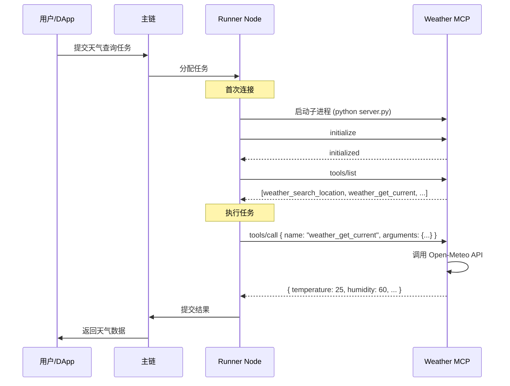

#### 6. 返回结果示例

```json
{
  "job_id": "weather-001",
  "status": "completed",
  "result": {
    "location": {
      "latitude": 39.9042,
      "longitude": 116.4074,
      "timezone": "Asia/Shanghai"
    },
    "current": {
      "time": "2026-01-28T15:00",
      "temperature": 2.5,
      "feels_like": -1.2,
      "humidity": 45,
      "wind_speed": 12.5,
      "wind_direction": 315,
      "weather_code": 1,
      "weather_description": "Mainly Clear"
    }
  },
  "usage": {
    "api_calls": 1,
    "latency_ms": 234
  }
}
```

#### 7. 常用城市坐标参考

| 城市 | 纬度 (latitude) | 经度 (longitude) |
|------|-----------------|------------------|
| 北京 | 39.9042 | 116.4074 |
| 上海 | 31.2304 | 121.4737 |
| 广州 | 23.1291 | 113.2644 |
| 深圳 | 22.5431 | 114.0579 |
| 杭州 | 30.2741 | 120.1551 |
| 东京 | 35.6762 | 139.6503 |
| 纽约 | 40.7128 | -74.0060 |
| 伦敦 | 51.5074 | -0.1278 |

> **提示**：也可以使用 `weather_search_location` 工具动态搜索城市坐标。

### 实战示例：接入比特币行情 MCP

以下是接入比特币/加密货币行情 MCP 服务的完整示例，使用 [mcp-crypto-price](https://github.com/truss44/mcp-crypto-price)（基于 CoinCap API，支持 STDIO 和 HTTP 传输）。

#### 1. 安装比特币行情 MCP 服务器

**方案一：使用 npx（推荐，最简单）**

```bash
# 无需安装，直接通过 npx 运行
npx -y mcp-crypto-price
```

**方案二：本地安装**

```bash
# 克隆仓库（可选）
git clone https://github.com/truss44/mcp-crypto-price.git
cd mcp-crypto-price

# 安装依赖
npm install

# 构建
npm run build
```

#### 2. Runner 配置

**使用 STDIO 传输（推荐）：**

```yaml
# runner-config.yaml
mcp_servers:
  - name: "crypto-price"
    transport:
      type: "Stdio"
      command: "npx"
      args: ["-y", "mcp-crypto-price"]
    auth:
      type: "None"
    timeout_seconds: 30
    enabled: true
```

**使用 HTTP 传输（适合远程部署）：**

```bash
# 启动 HTTP 服务器
cd mcp-crypto-price
npm run build
npm run start:http
# 服务器会输出地址，例如：http://localhost:3000
```

```yaml
# runner-config.yaml
mcp_servers:
  - name: "crypto-price"
    transport:
      type: "Http"
      url: "http://localhost:3000"
    auth:
      type: "None"
    timeout_seconds: 30
    enabled: true
```

**可选：配置 CoinCap API Key（提高速率限制）**

```yaml
mcp_servers:
  - name: "crypto-price"
    transport:
      type: "Stdio"
      command: "npx"
      args: ["-y", "mcp-crypto-price"]
    env:
      COINCAP_API_KEY: "${COINCAP_API_KEY}"  # 从环境变量读取
    auth:
      type: "None"
    timeout_seconds: 30
    enabled: true
```

> **注意**：CoinCap v2 API 即将停用，建议从 [pro.coincap.io/dashboard](https://pro.coincap.io/dashboard) 获取 API Key 使用 v3 API。

#### 3. 比特币行情 MCP 提供的工具

| 工具名 | 功能 | 主要参数 |
|--------|------|----------|
| `get-crypto-price` | 获取当前价格和 24h 统计 | `symbol` (如 "BTC", "ETH") |
| `get-market-analysis` | 市场分析（交易所、VWAP 等） | `symbol` |
| `get-historical-analysis` | 历史价格分析（最多 30 天） | `symbol`, `days`, `interval` |

#### 4. 任务提交示例

**查询比特币当前价格：**

```json
{
  "job_id": "crypto-001",
  "job_type": {
    "Mcp": {
      "server": "crypto-price",
      "tool_name": "get-crypto-price",
      "arguments": {
        "symbol": "BTC"
      }
    }
  },
  "reward": 100,
  "deadline": 1000
}
```

**获取以太坊市场分析：**

```json
{
  "job_id": "crypto-002",
  "job_type": {
    "Mcp": {
      "server": "crypto-price",
      "tool_name": "get-market-analysis",
      "arguments": {
        "symbol": "ETH"
      }
    }
  },
  "reward": 150,
  "deadline": 1000
}
```

**查询比特币 7 天历史价格趋势：**

```json
{
  "job_id": "crypto-003",
  "job_type": {
    "Mcp": {
      "server": "crypto-price",
      "tool_name": "get-historical-analysis",
      "arguments": {
        "symbol": "BTC",
        "days": 7,
        "interval": "1h"
      }
    }
  },
  "reward": 200,
  "deadline": 1000
}
```

#### 5. 执行流程

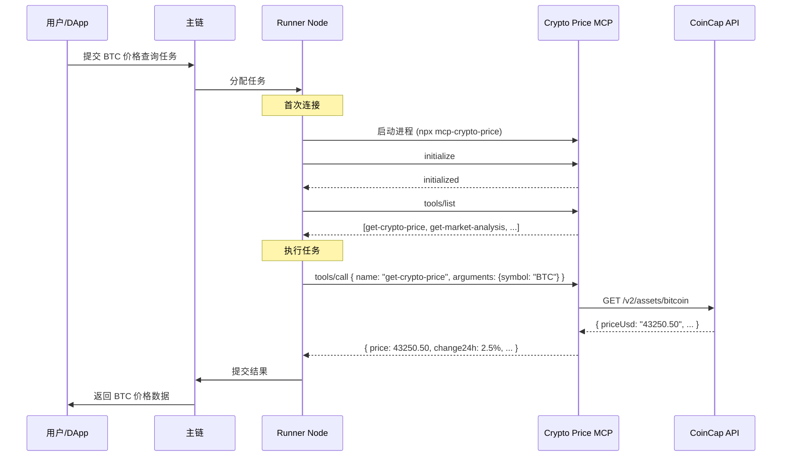

#### 6. 返回结果示例

**get-crypto-price 返回：**

```json
{
  "job_id": "crypto-001",
  "status": "completed",
  "result": {
    "symbol": "BTC",
    "name": "Bitcoin",
    "price": 43250.50,
    "priceUsd": "$43,250.50",
    "change24h": 2.5,
    "change24hPercent": "+2.5%",
    "volume24h": 28500000000,
    "marketCap": 850000000000,
    "rank": 1
  },
  "usage": {
    "api_calls": 1,
    "latency_ms": 156
  }
}
```

**get-market-analysis 返回：**

```json
{
  "job_id": "crypto-002",
  "status": "completed",
  "result": {
    "symbol": "ETH",
    "vwap": 2450.25,
    "topExchanges": [
      {"name": "Binance", "volume": 1200000000},
      {"name": "Coinbase", "volume": 850000000},
      {"name": "Kraken", "volume": 420000000}
    ],
    "priceVariations": {
      "min": 2430.00,
      "max": 2470.00,
      "spread": 40.00
    }
  }
}
```

#### 7. 支持的加密货币符号

| 符号 | 名称 | 常见用途 |
|------|------|----------|
| BTC | Bitcoin | 比特币 |
| ETH | Ethereum | 以太坊 |
| BNB | Binance Coin | 币安币 |
| SOL | Solana | 索拉纳 |
| XRP | Ripple | 瑞波币 |
| ADA | Cardano | 卡尔达诺 |
| DOGE | Dogecoin | 狗狗币 |
| DOT | Polkadot | 波卡 |
| MATIC | Polygon | 多边形 |
| AVAX | Avalanche | 雪崩 |

> **提示**：CoinCap API 支持 2000+ 种加密货币，可以使用任何有效的符号。

#### 8. 替代方案：多交易所行情 MCP

如果需要从多个交易所获取数据，可以使用 [mcp-server-ccxt](https://github.com/Nayshins/mcp-server-ccxt)：

```bash
# 安装
pip install mcp ccxt

# 配置
mcp_servers:
  - name: "crypto-exchanges"
    transport:
      type: "Stdio"
      command: "python"
      args: ["/path/to/mcp-server-ccxt/crypto_server.py"]
```

该方案支持：
- Binance, Coinbase, Kraken, KuCoin 等多个交易所
- 实时价格、历史 OHLCV 数据
- 交易对查询（如 BTC/USDT）

### 自定义 MCP 服务器开发

如果需要开发自定义 MCP 服务器，可以参考以下模板：

**Python 版本**：
```python
from mcp.server import Server, NotificationOptions
from mcp.server.models import InitializationOptions
import mcp.types as types

server = Server("my-custom-server")

@server.list_tools()
async def handle_list_tools() -> list[types.Tool]:
    return [
        types.Tool(
            name="my_tool",
            description="My custom tool",
            inputSchema={
                "type": "object",
                "properties": {
                    "param1": {"type": "string"}
                },
                "required": ["param1"]
            }
        )
    ]

@server.call_tool()
async def handle_call_tool(name: str, arguments: dict) -> list[types.TextContent]:
    if name == "my_tool":
        result = do_something(arguments["param1"])
        return [types.TextContent(type="text", text=result)]
    raise ValueError(f"Unknown tool: {name}")

# 启动服务器 (stdio 模式)
async def main():
    async with mcp.server.stdio.stdio_server() as (read_stream, write_stream):
        await server.run(read_stream, write_stream, InitializationOptions())
```

**TypeScript 版本**：
```typescript
import { Server } from "@modelcontextprotocol/sdk/server/index.js";
import { StdioServerTransport } from "@modelcontextprotocol/sdk/server/stdio.js";

const server = new Server({
  name: "my-custom-server",
  version: "1.0.0",
}, {
  capabilities: { tools: {} }
});

server.setRequestHandler("tools/list", async () => ({
  tools: [{
    name: "my_tool",
    description: "My custom tool",
    inputSchema: {
      type: "object",
      properties: { param1: { type: "string" } },
      required: ["param1"]
    }
  }]
}));

server.setRequestHandler("tools/call", async (request) => {
  if (request.params.name === "my_tool") {
    const result = doSomething(request.params.arguments.param1);
    return { content: [{ type: "text", text: result }] };
  }
  throw new Error(`Unknown tool: ${request.params.name}`);
});

const transport = new StdioServerTransport();
await server.connect(transport);
```

---

## 组件关系总结

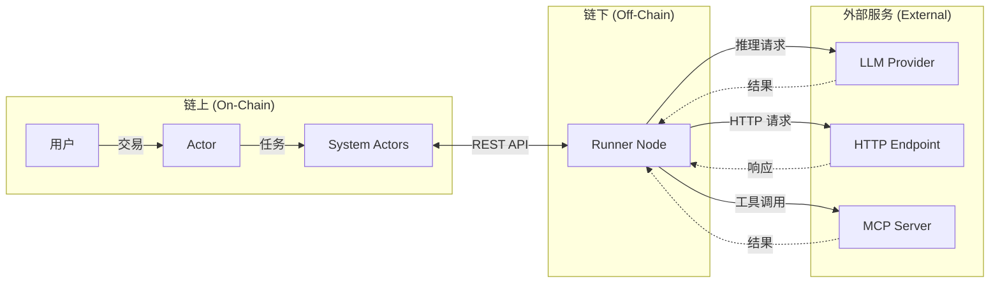

### 角色职责对比

| 组件 | 职责 | 与 Runner 的关系 |
|------|------|------------------|
| **主链** | 接收用户任务，分发给 Runner，验证结果 | Runner 的任务来源和结果提交目标 |
| **Runner Node** | 执行实际计算任务 | 核心执行节点 |
| **LLM Provider** | 提供 AI 推理能力 | Runner 的后端服务（LLM 任务） |
| **HTTP Endpoint** | 提供数据服务 | Runner 的数据来源（HTTP 任务） |
| **MCP Server** | 提供工具能力 | Runner 的工具提供者（MCP 任务） |

### 简单类比

| 角色 | 类比 |
|------|------|
| **主链** | 外卖平台（接单、派单、验收） |
| **Runner Node** | 外卖骑手（执行配送任务） |
| **LLM Provider** | AI 餐厅（提供智能服务） |
| **HTTP Endpoint** | 普通餐厅（提供数据/商品） |
| **MCP Server** | 专业工具店（提供特定工具/能力） |

---

┌─────────────────────────────────────────────────────────────────────────┐
│                           Cowboy Chain Node                              │
│                                                                          │
│  ┌─────────────────────────────────────────────────────────────────┐   │
│  │  Step 1: 用户发送交易                                            │   │
│  │  User TX: "分析 BTC 市场"                                        │   │
│  └──────────────────────────┬──────────────────────────────────────┘   │
│                              │                                           │
│                              ▼                                           │
│  ┌─────────────────────────────────────────────────────────────────┐   │
│  │  Step 2: PVM 执行 Actor 代码                                     │   │
│  │  ┌──────────────────────────────────────────────────────────┐  │   │
│  │  │  Actor: MarketAnalyzer                                    │  │   │
│  │  │  @runner.continuation(timeout_blocks=100)                 │  │   │
│  │  │  async def analyze(self, msg):                            │  │   │
│  │  │      ctx = capture()                                      │  │   │
│  │  │      ctx.result = await runner.llm(                       │  │   │
│  │  │          prompt="Analyze BTC market trends...",           │  │   │
│  │  │          verification=Verify.majority_vote(n=3, t=2)      │  │   │
│  │  │      )                                                     │  │   │
│  │  │      return ctx.result                                     │  │   │
│  │  └──────────────────────────────────────────────────────────┘  │   │
│  └──────────────────────────┬──────────────────────────────────────┘   │
│                              │                                           │
│                              ▼                                           │
│  ┌─────────────────────────────────────────────────────────────────┐   │
│  │  Step 3: Actor → Job Dispatcher (System Actor)                   │   │
│  │  发送消息: RunnerJob { job_type: "llm", payload: {...} }         │   │
│  └──────────────────────────┬──────────────────────────────────────┘   │
│                              │                                           │
│                              ▼                                           │
│  ┌─────────────────────────────────────────────────────────────────┐   │
│  │  Step 4: Job Dispatcher 查询 Runner Registry                     │   │
│  │  - 筛选支持 LLM 的活跃 Runner                                     │   │
│  │  - VRF 选择 3 个 Runner 组成委员会                                │   │
│  └──────────────────────────┬──────────────────────────────────────┘   │
│                              │                                           │
│                              ▼                                           │
│  ┌─────────────────────────────────────────────────────────────────┐   │
│  │  Step 5: Job Dispatcher 广播任务                                  │   │
│  │  消息: 分配给 Runner 1, 2, 3                                      │   │
│  └──────────────────────────┬──────────────────────────────────────┘   │
│                              │                                           │
└──────────────────────────────┼───────────────────────────────────────────┘
                               │
                               │ 消息传递 (Message Passing)
                               │
┌──────────────────────────────▼───────────────────────────────────────────┐
│                      Runner Network (链下独立系统)                         │
│                                                                           │
│  ┌─────────────────┐  ┌─────────────────┐  ┌─────────────────┐          │
│  │    Runner 1     │  │    Runner 2     │  │    Runner 3     │          │
│  │  (OpenAI API)   │  │ (Anthropic API) │  │  (本地模型)      │          │
│  └────────┬────────┘  └────────┬────────┘  └────────┬────────┘          │
│           │                    │                    │                    │
│           │  Step 6: 各自独立执行 LLM 推理                                │
│           │  - 调用 LLM API                                              │
│           │  - 计算资源使用量                                             │
│           │  - 生成结果                                                  │
│           │                    │                    │                    │
│           ▼                    ▼                    ▼                    │
│  ┌─────────────────────────────────────────────────────────────────┐    │
│  │  Step 7: 各 Runner 提交结果到链上                                 │    │
│  │  RunnerResult { cid, status: "ok", result: "BTC看涨..." }        │    │
│  └──────────────────────────┬──────────────────────────────────────┘    │
│                              │                                           │
└──────────────────────────────┼───────────────────────────────────────────┘
                               │
                               │ 消息传递 (回到链上)
                               │
┌──────────────────────────────▼───────────────────────────────────────────┐
│                           Cowboy Chain Node                              │
│                                                                          │
│  ┌─────────────────────────────────────────────────────────────────┐   │
│  │  Step 8: Result Verifier (System Actor) 收集结果                  │   │
│  │  - 收到 3 个结果                                                  │   │
│  │  - 执行 majority_vote 验证                                        │   │
│  │  - 2/3 结果一致 → 验证通过                                         │   │
│  └──────────────────────────┬──────────────────────────────────────┘   │
│                              │                                           │
│                              ▼                                           │
│  ┌─────────────────────────────────────────────────────────────────┐   │
│  │  Step 9: Result Verifier → Actor 回调                            │   │
│  │  消息: RunnerResult { result: "BTC看涨...", consensus: 2/3 }      │   │
│  └──────────────────────────┬──────────────────────────────────────┘   │
│                              │                                           │
│                              ▼                                           │
│  ┌─────────────────────────────────────────────────────────────────┐   │
│  │  Step 10: PVM 恢复 Actor 执行                                     │   │
│  │  - 从 continuation state 恢复 ctx                                 │   │
│  │  - ctx.result = "BTC看涨..."                                      │   │
│  │  - 继续执行后续逻辑（如执行交易）                                    │   │
│  └─────────────────────────────────────────────────────────────────┘   │
│                                                                          │
└──────────────────────────────────────────────────────────────────────────┘

### 流程图 (Mermaid 版本)

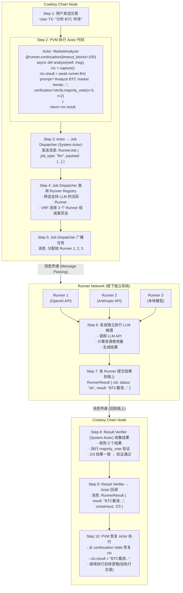

---

## 完整调用流程图

```mermaid
sequenceDiagram
    participant User as 用户
    participant Node as Cowboy Node
    participant PVM as PVM (虚拟机)
    participant Actor as Actor (智能合约)
    participant JD as Job Dispatcher
    participant RR as Runner Registry
    participant R1 as Runner 1
    participant R2 as Runner 2
    participant R3 as Runner 3
    participant RV as Result Verifier

    %% Step 1-2: 用户触发 Actor
    User->>Node: 发送交易: "分析 BTC 市场"
    Node->>PVM: 执行交易
    PVM->>Actor: 调用 analyze() 方法

    %% Step 3: Actor 发送任务
    Actor->>JD: 发送 RunnerJob<br/>{job_type: "llm", prompt: "..."}

    %% Step 4: 查询可用 Runner
    JD->>RR: 查询支持 LLM 的活跃 Runner
    RR-->>JD: 返回候选 Runner 列表

    %% Step 5: VRF 选择并广播任务
    Note over JD: VRF 选择 3 个 Runner
    JD->>R1: 分配任务
    JD->>R2: 分配任务
    JD->>R3: 分配任务

    %% Step 6: Runner 独立执行
    Note over R1,R3: 链下独立执行 (不依赖 Node)
    R1->>R1: 调用 OpenAI API
    R2->>R2: 调用 Anthropic API
    R3->>R3: 本地模型推理

    %% Step 7: 提交结果
    R1->>RV: 提交结果: "BTC 看涨..."
    R2->>RV: 提交结果: "BTC 看涨..."
    R3->>RV: 提交结果: "BTC 看跌..."

    %% Step 8: 验证结果
    Note over RV: majority_vote 验证<br/>2/3 一致 → 通过

    %% Step 9-10: 回调 Actor
    RV->>Actor: 回调: 验证通过的结果
    Actor->>PVM: 恢复执行 (从 await 后继续)
    PVM->>Node: 执行完成
    Node-->>User: 返回结果
```

---

## 系统架构图

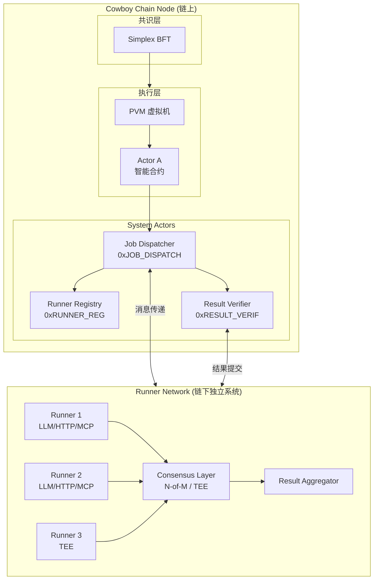

---

## 详细步骤说明

### Step 1-2: 用户触发 Actor

```python
# 用户发送交易，触发 Actor 的 analyze 方法
# Actor 代码在 PVM 中执行

@runner.continuation(timeout_blocks=100)
async def analyze(self, msg):
    ctx = capture()  # 捕获需要跨块保存的上下文
    
    ctx.result = await runner.llm(
        prompt="Analyze BTC market trends for the next 24 hours",
        verification=Verify.builder()
            .mode("majority_vote")
            .runners(3)
            .threshold(2)
            .build(),
        max_price=1000000000000000000,  # 1 CBY
        timeout_blocks=100,
    )
    
    # 这里会暂停，等待 Runner 结果返回
    return ctx.result
```

### Step 3-5: 链上任务分发

```rust
// Job Dispatcher (System Actor) 处理任务

// 1. 查询 Runner Registry，获取支持 LLM 的活跃 Runner
let candidates = registry.get_active_runners(RunnerFilter {
    job_types: vec![JobType::Llm],
    health: HealthStatus::Healthy,
    min_reputation: 50,
});

// 2. VRF 确定性选择 3 个 Runner
let vrf_seed = generate_vrf_seed(&job_spec, current_block);
let committee = vrf_select(&candidates, 3, &vrf_seed);

// 3. 广播任务给选中的 Runner
for runner in committee {
    send_message(runner.address, RunnerJob {
        job_id: job_spec.job_id,
        job_type: JobType::Llm,
        payload: job_spec.params,
        timeout_block: current_block + 100,
    });
}
```

### Step 6: Runner 执行（链下独立）

```rust
// Runner 节点（独立进程，不在 Node 内部）

impl LlmExecutor for Runner {
    async fn execute(&self, job: &RunnerJob) -> Result<JobResult> {
        // 调用 LLM API（如 OpenAI）
        let response = self.openai_client
            .chat_completion(ChatRequest {
                model: "gpt-4",
                messages: vec![Message::user(job.payload.prompt.clone())],
                max_tokens: job.payload.max_tokens,
            })
            .await?;
        
        // 计算资源使用
        let usage = ResourceUsage {
            input_tokens: response.usage.prompt_tokens,
            output_tokens: response.usage.completion_tokens,
        };
        
        Ok(JobResult {
            data: response.content,
            usage,
            timestamp: SystemTime::now(),
        })
    }
}
```

### Step 7-8: 结果验证

```rust
// Result Verifier (System Actor) 验证结果

fn verify_majority_vote(&self, job_spec: &JobSpec, results: Vec<RunnerResult>) {
    // 统计投票
    let mut vote_counts: HashMap<String, u32> = HashMap::new();
    for result in &results {
        let key = hash(&result.data);
        *vote_counts.entry(key).or_insert(0) += 1;
    }
    
    // 找到多数
    let (winning_hash, count) = vote_counts.iter().max_by_key(|(_, c)| *c).unwrap();
    
    // 检查是否达到阈值 (2/3)
    if *count >= job_spec.verification.threshold {
        // 验证通过，回调 Actor
        let final_result = results.iter()
            .find(|r| hash(&r.data) == *winning_hash)
            .unwrap();
        
        send_callback(job_spec.callback, final_result);
    }
}
```

### Step 9-10: Actor 恢复执行

```python
# PVM 恢复 Actor 执行
# 从 continuation state 读取 ctx
# ctx.result 已被填充

@runner.continuation(timeout_blocks=100)
async def analyze(self, msg):
    ctx = capture()
    
    ctx.result = await runner.llm(...)  # ← 从这里恢复，result 已有值
    
    # 继续执行后续逻辑
    if "看涨" in ctx.result:
        self.execute_buy_order()
    
    return ctx.result
```

---

## 任务生命周期状态图

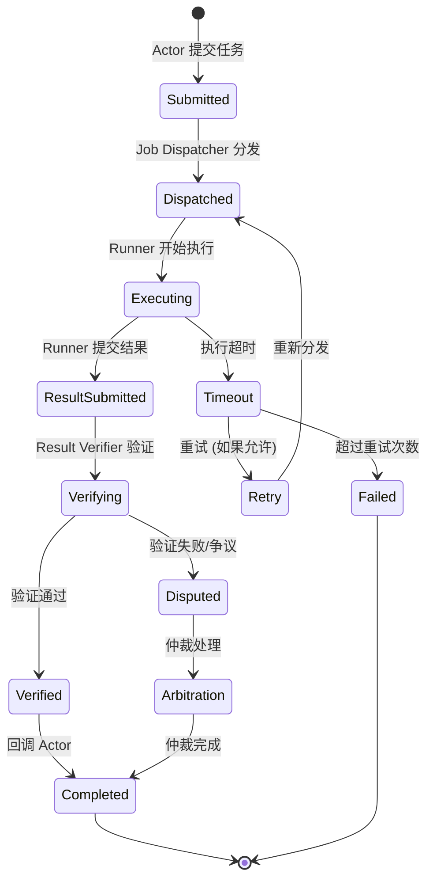

---

## 关键交互总结

| 步骤 | 发起方 | 接收方 | 通信方式 | 说明 |
|------|--------|--------|----------|------|
| 1 | 用户 | Node | 交易 | 用户发送 TX 触发 Actor |
| 2 | Node | PVM | 内部调用 | Node 调用 PVM 执行 Actor 代码 |
| 3 | Actor | Job Dispatcher | 消息 | Actor 发送 RunnerJob |
| 4 | Job Dispatcher | Runner Registry | 查询 | 获取可用 Runner 列表 |
| 5 | Job Dispatcher | Runner Network | 消息 | 广播任务给选中的 Runner |
| 6 | Runner | 外部 API | HTTP | Runner 调用 LLM API |
| 7 | Runner | Result Verifier | 消息 | 提交执行结果 |
| 8 | Result Verifier | - | 内部 | 执行验证逻辑 |
| 9 | Result Verifier | Actor | 回调 | 发送验证后的结果 |
| 10 | Node | PVM | 内部调用 | 恢复 Actor 执行 |

---

## 数据流图

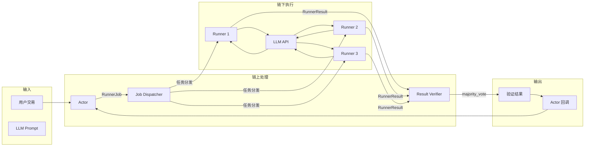

---

## 核心要点

1. **Node** 是基础设施层，负责共识和交易执行
2. **Actor** 运行在 Node 内部的 PVM 中，是链上智能合约
3. **Runner** 是完全独立的链下进程，不依赖 Node 或 PVM
4. **System Actors**（Registry、Dispatcher、Verifier）作为链上中间层协调 Actor 和 Runner
5. 整个流程是**异步的**，Actor 在 `await` 处暂停，等待结果后恢复执行

---

## 相关文档

- [Runner 系统详细设计](./RUNNER_SYSTEM_DESIGN.md)
- [Runner 实施方案](./Runner_Implementation_Plan_CN.md)
- [README](./README.md)

---

*文档创建时间：2026-01-27*
