# MPP + Session 集成研究：Cowboy Runner 体系下的机器支付协议

**日期**: 2026-04-28
**作者**: Research note
**状态**: 研究草稿（尚未形成 CIP）
**关联 CIP**: CIP-2（Off-Chain Compute）、CIP-3（Fee Model）、CIP-7（Simple Stream Protocol）、CIP-20（Fungible Tokens）

**图索引**：

| Fig | 内容 | 章节 |
|-----|------|------|
| 1 | 两种支付模式选择 — flowchart | §2.3 |
| 2 | Charge / 402 流程 — sequence | §2.3.1 |
| 3 | Tempo session 生命周期 — sequence | §2.4 |
| 4 | Cowboy 现状（单 Job 路径） — graph | §4.1 |
| 5 | Cowboy MPP Session 架构 — graph | §5.2 |
| 6 | Session 状态机 — state | §5.3 |
| 7 | Cowboy 端到端时序 — sequence | §5.5 |
| 8 | Settlement 分润流向 — flowchart | §5.5 |
| 9 | Dispute 仲裁路径 — flowchart | §5.6 |
| 10 | CIP-7 vs MPP Session — graph | §5.8 |
| 11 | 战略定位（Cowboy 作为结算层） — graph | §7 |

---

## 1. 研究背景与目标

### 1.1 来源

- 周会纪要：本周需研究 Tempo 的 **MPP（Machine Payment Protocol）**，调研结合 Cowboy node + runner 体系做 **session-based 支付** 的可行性。核心结论是「调用 Runner 不必经过 Cowboy 链路，但结算放在 Cowboy 上」，并以 CBY 作为初期结算资产。
- 参考实现：
  - 协议主页 [mpp.dev/overview](https://mpp.dev/overview)
  - IETF 规范聚合站 [paymentauth.org](https://paymentauth.org/)
  - Tempo 文档 [docs.tempo.xyz/guide/machine-payments](https://docs.tempo.xyz/guide/machine-payments) 与 [docs.tempo.xyz/learn/tempo/machine-payments](https://docs.tempo.xyz/learn/tempo/machine-payments)
  - 官方 SDK：[wevm/mppx (TypeScript)](https://github.com/wevm/mppx)、[tempoxyz/mpp-rs (Rust)](https://github.com/tempoxyz/mpp-rs)、Python `pympp`
  - 第三方解读：[Cloudflare Agents 文档](https://developers.cloudflare.com/agents/agentic-payments/mpp/)、[Stripe 公告](https://stripe.com/blog/machine-payments-protocol)、[Visa MPP 公告](https://corporate.visa.com/en/sites/visa-perspectives/innovation/visa-card-specification-sdk-for-machine-payments-protocol.html)

### 1.2 我们要回答的问题

1. MPP 解决了什么问题？它的两种支付模式（**charge / 402** 与 **session**）分别长什么样？
2. Tempo 给出的「session + 链上托管 + 链下凭证」实现是怎么落地的？
3. 把这套 session 模型嫁接到 Cowboy 时，**链下直连 Runner、链上只承担清算**这一约束应如何在 `node/` 与 `runner/` 中表达？
4. Cowboy 既有 CIP-2 的「按 Job 单笔托管 + commit-reveal + 多人共识」与 CIP-7 的「按 epoch 流式收费」是不是已经够用？要不要再加一个 Session 系统 Actor？

---

## 2. MPP 协议本体

### 2.1 协议定位

MPP 是 Stripe 与 Tempo Labs 联合提交给 IETF 的开放支付协议草案，把 HTTP 402（"Payment Required"）从历史遗留状态码激活成一等公民，让 **Agent / App / 人类** 都能在一次 HTTP 请求里完成 "请求资源 → 收到收费挑战 → 支付 → 重试 → 拿到资源 + 收据" 的全流程。

文档 [mpp.dev/overview](https://mpp.dev/overview) 把协议定位为 "open protocol for machine-to-machine payments"，强调：
> Idempotency, security, and receipts are first-class primitives.

### 2.2 三方角色

| 角色 | 职责 |
|------|------|
| **Developer** | 集成 MPP client，把支付能力嵌入应用 / Agent |
| **Agent** | 自动发现服务、自动支付、自动调用，完全无人值守 |
| **Service** | 集成 MPP server，对受保护接口返回 `402` 与 `WWW-Authenticate: Payment` 挑战 |

### 2.3 两种支付模式

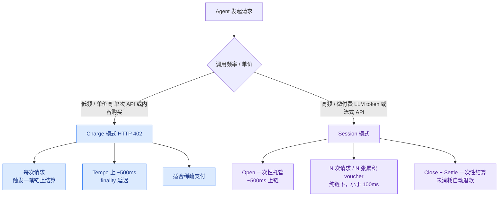

#### 2.3.1 Charge（402，单次结算）

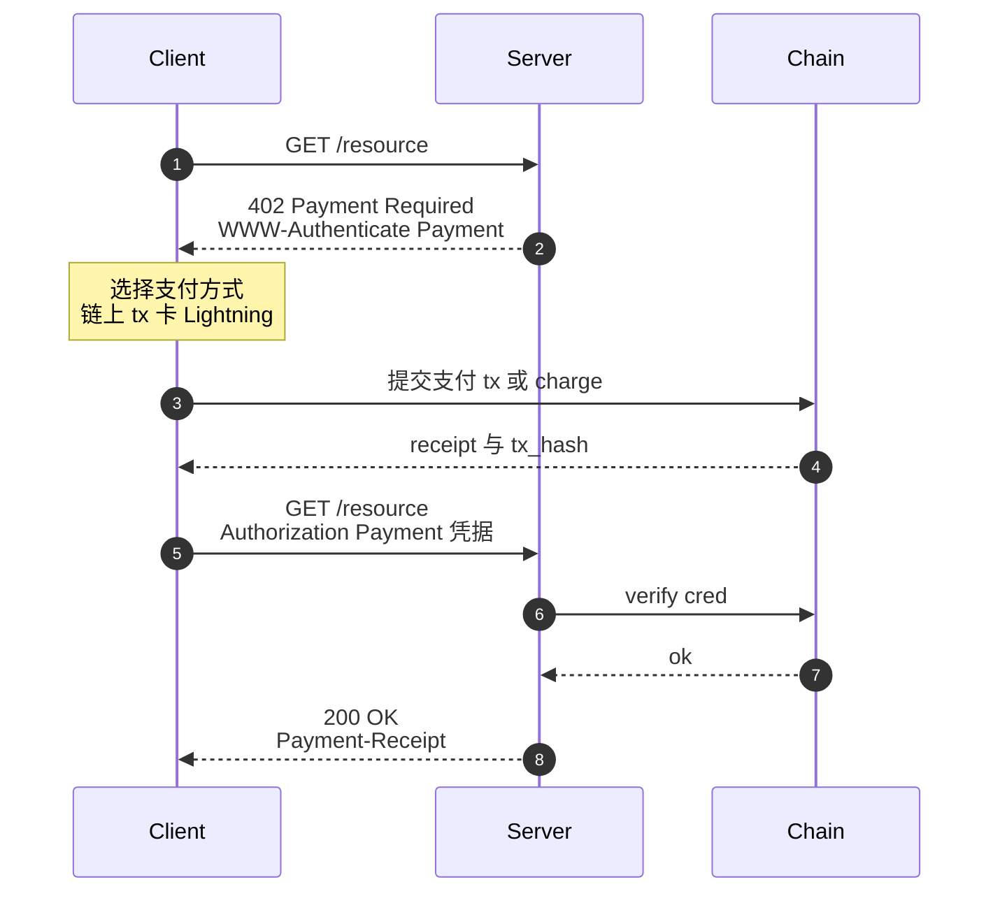

- HTTP 头：`WWW-Authenticate: Payment`、`Authorization: Payment`、`Payment-Receipt`、`Retry-After`
- 状态码：`402` 挑战、`200` 成功
- 每次调用都要落链一次结算（在 Tempo 上 ~500ms）
- 适合：单次 API 调用、内容购买、低频高价值请求

#### 2.3.2 Session（链上托管 + 链下累积凭证）

> "When you use pay-as-you-go services, MPP opens a session — a payment channel where your wallet deposits funds into an escrow contract, then pays per request using signed vouchers off-chain." — [docs.tempo.xyz](https://docs.tempo.xyz/learn/tempo/machine-payments)

Tempo 把它定位为 LLM 推理、流式数据、模型推理等 **高频微付费** 场景的首选模式，因为它把 "上链一次 → 链下高频结算 → 上链一次" 的成本摊薄到几千上万次微请求里。
- 单次微付费可低至 \$0.0001
- 单次请求延迟 < 100ms（无 RPC、无 DB lookup，凭证直接 `ecrecover`）
- Session 结束时一次性批量结算到链上，未消耗的余额自动退款

### 2.4 Session 生命周期（Tempo 实现）

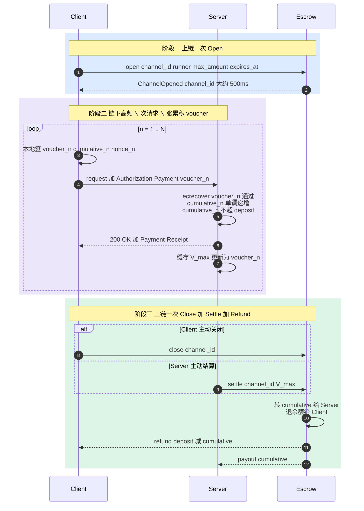

#### 步骤

1. **Open**：Client 与 Server 协商 channel 参数（最大金额、过期块、price advert）。Client 调用托管合约，把资金（USDG / 在 Cowboy 场景里是 CBY）打到 escrow，得到 `channel_id`。Tempo 文档给出的 setup 时间是 "roughly 500ms"。
2. **Voucher**：每次请求 Client 用 EIP-712 类型化数据签一张 **累积** voucher：
   ```
   Voucher {
       channel_id:  bytes32
       cumulative_amount: uint256       // 自 session 开启以来的累积金额
       nonce:       uint64              // 单调递增，防回放
       expires_at:  uint64              // 过期时间或块高
   }
   ```
   关键点：**累积**而非增量。最新的一张能完全覆盖旧的，断电重连不丢账。
3. **Verify**：Server 对每张 voucher 调 `ecrecover`，校验签名者 = channel.owner、`cumulative_amount` 单调递增且不超过 escrow 余额。验证不需要 RPC，整个 path 是纯本地 + 内存。
4. **Serve**：通过校验后立即返回资源。Server 在内存中保留 `V_max`（迄今为止累积金额最大的 voucher）。
5. **Close / Settle**：任意一方触发：Client 关停 session、Server 觉得用户消耗已结束、达到 timeout、达到 escrow 上限。任一方把 `V_max` 提交到 escrow 合约：
   - 合约转 `cumulative_amount` 给 Server
   - 剩余余额退给 Client
   - 关闭 channel
6. **Refund**：未消耗的部分自动退还。如果 Server 在 dispute window 内出新 voucher（`cumulative_amount` 更大），可以更新结算。

### 2.5 协议规范散布在哪

`mpp.dev/specification` 实际重定向到 [paymentauth.org](https://paymentauth.org/)，那里聚合了多份 IETF Draft：

- **Payment HTTP Authentication Scheme**（核心 402/header 规范）
- **Payment Intent & Charge Specifications**（charge 抽象）
- 每种支付方式（Card、EVM、Lightning、Solana、Stellar、Stripe、Tempo）一份 charge spec
- **Lightning Session Spec** 与 **Tempo Session Spec**（session 抽象按链分别定义）
- **Payment Discovery**（服务端如何宣告自己接受哪些方式 / 价目）
- **JSON-RPC & MCP Transport**（除 HTTP 外，把支付头嵌入 JSON-RPC / MCP 调用）

也就是说，MPP 是分层的：协议骨架在 `paymentauth.org`、具体 method 实现按链各自一份。我们要做的是 **新写一份 "Cowboy Session Spec"**（或直接在 EVM session spec 上替换签名域），让 CBY 成为可结算资产。

### 2.6 SDK 现状

| 语言 | 包 | 仓库 | 备注 |
|------|----|------|------|
| TypeScript | `mppx` | [wevm/mppx](https://github.com/wevm/mppx) | 参考实现。`Mppx.charge / stream / free`、内置 fetch 拦截、含 `session/multi-fetch`、`session/sse` 示例 |
| Python | `pympp` | mpp.dev/sdk/python | 高低层都有 |
| Rust | `mpp-rs` | [tempoxyz/mpp-rs](https://github.com/tempoxyz/mpp-rs) | feature: `client/server/tempo/stripe/evm/middleware/tower/axum/ws/utils`，已有 `WsMessage / WsResponse` 类型支持双向 session 支付 |
| Solana | `mpp-sdk` | [solana-foundation/mpp-sdk](https://github.com/solana-foundation/mpp-sdk) | 链特定 method |
| Stellar | `stellar-mpp-sdk` | [stellar/stellar-mpp-sdk](https://github.com/stellar/stellar-mpp-sdk) | 链特定 method |

mppx 中的 `Session.ts` 存在但本研究没拉到原文（文件路径 404，可能在子目录），其暴露的概念有：Session、Voucher、Channel、ChannelStore、pluggable authorization strategies、voucher 签名/验证、双方 EIP-712 类型定义。这部分要在 PoC 阶段直接读源码确认。

---

## 3. Tempo 的具体实现要点

Tempo 是 MPP 的 reference settlement chain。它的特征：

- **稳定币结算**：默认用 USDG（Tempo 主网原生稳定币）做计价，~500ms 终局。
- **Fee sponsorship**：Server 可以代付 gas，Client 只需要稳定币本金，对 Agent 用户体验友好。
- **MPP-as-a-Service**：链本身嵌了一组 Escrow 合约和会话注册表，并通过 Tempo CLI / SDK 暴露：
  ```
  curl -fsSL https://tempo.xyz/install | bash
  tempo request <url>           # 自动处理 402
  tempo wallet ...              # 钱包 / channel 操作
  ```
- **签名**：EIP-712 类型化数据 + EVM 风格 secp256k1 + `ecrecover`。Tempo 是 EVM 兼容链，所以与 wevm/mppx 共享同一套签名域。
- **Privy / Cloudflare 集成**：Cloudflare Agents 和 Privy 都把 Tempo session 作为「为 Agent 配钱包」的官方推荐路径。

要点摘录：

> "Agents deposit funds into an escrow contract (roughly 500ms setup time), then issue cumulative EIP-712 signed vouchers with each subsequent request. The server verifies vouchers via ecrecover with no RPC call or database lookup required, enabling sub-100ms latency."

> "Thousands of micro-interactions batch-settle into a single on-chain transaction when the session ends, with unused funds refunded."

---

## 4. Cowboy 现状盘点

### 4.1 现有支付/结算原语

| 原语 | 出处 | 概要 |
|------|------|------|
| **按 Job 单笔托管** | `node/execution/src/runner/dispatcher.rs:678-708`（D1: Escrow） | 提交 Job 时立即从 submitter 扣 `max_price + tip`，记账到 Job Dispatcher（`0x02`）名下 |
| **commit-reveal + 多人共识** | `node/execution/src/runner/verifier.rs:36-251`（commit/reveal 入口）、`verifier.rs:524-771`（`verify_results` 各 mode 分支） | 60% 时间窗 commit、40% 窗口 reveal；按 `VerificationMode` 做共识；少数派会被 slash |
| **Settlement 分润** | `verifier.rs:332-465`（`handle_job_result_submit` 内 governance 读取 + payout） | `SettlementConfig{runner_percent, burn_percent, treasury_percent}`，默认 89/10/1，由 governance actor `0x09` 通过 `UpdateSettlementConfig` 修改 |
| **Slashing** | `node/execution/src/runner/registry.rs:317`（CIP-25 §β Task 8 后从 verifier 搬至 registry） | 50% treasury / 50% burn；stake 跌破 `MIN_STAKE_CBY_WEI` 就 reputation = 0 |
| **Stake-weighted VRF 选 Runner** | `dispatcher.rs:950-1100+`（`select_runner_committee_with_seed`） | Fisher-Yates + log2(stake) 权重压缩，避免大鲸垄断 |
| **CIP-7 Simple Stream Protocol**（草案，**未实现**） | `refs/cips/cip-7-simple-stream-protocol.md` | 按 epoch 滚动续费的「流」原语；CIP 中拟把 Stream Key Manager 放在 `0x06`，但当前实现已把 `0x06` 用作 `DUAL_BASEFEE`（见脚注[^a]），CIP-7 落地需另行选址。账户级 entitlement 当前在 `ENTITLEMENT_REGISTRY 0x07` |
| **CIP-20 Fungible Tokens** | `refs/cips/cip-20-fungible-tokens.md` | hook gas 上限 50k 的代币标准，已可作为 USD-pegged 资产（未来支持 USDC peg）|

[^a]: 截至 2026-05-06，`node/runner/src/system_actors.rs` 已分配的 system actor 地址为：`0x01` RunnerRegistry、`0x02` JobDispatcher、`0x03` ResultVerifier、`0x04` SecretsManager、`0x05` TeeVerifier、`0x06` DualBasefee、`0x07` EntitlementRegistry、`0x08` Treasury、`0x09` Governance、`0x0A` StorageManager、`0x0B` RelayRegistry。CIP-7 文本中的 `0x06` 为草案占位，需要重新协商。

下图描绘当前 Cowboy 单 Job 的支付/结算路径。每一次调用都要走完整一圈链上流程，没有「批量摊销」的入口：

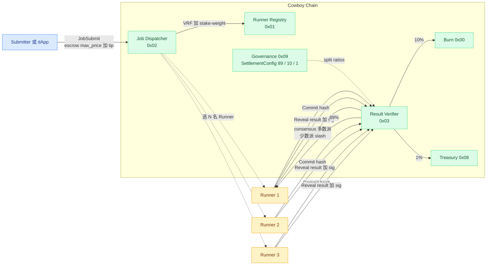

每完成一次调用，都需要 1 笔 `JobSubmit` + 1 轮多人 commit + 1 轮 reveal + 1 笔 settle。这套机制保证了正确性但代价高，不适合 LLM 高频微调用——这正是 Session 模式要补的空白。

### 4.2 既有结构与 MPP session 的对照

| MPP session 概念 | Cowboy 已有 | 差距 |
|------------------|-------------|------|
| Escrow contract | Job Dispatcher 单 job 托管；CIP-7 stream key 账户托管 | **没有 channel/session 级托管**，每个 job 单独走一遍 |
| Cumulative voucher | RunnerResult 已经签名（`signature: Option<[u8; 65]>` 在 `node/runner/src/types.rs:355-365`，serde 在 `596-660`） | RunnerResult 是「单次执行结果签名」，**不是累积金额签名**；payer 方目前不直接对金额签名 |
| Channel ID | 无 | 需要新增 `session_id` 概念 |
| Off-chain voucher exchange | 无；当前所有 Job 都要先上链托管 + 选 Runner + commit-reveal | **当前没有「绕开链直接调 Runner」的路径** |
| Settlement 关闭 | 单 job 触发 settle；governable 分润 | 改成「批量结算 N 张 job/cost 凭证」即可复用，分润机制完全沿用 |
| 退款 | 单 job 内 max_price 没用完会保留在 Dispatcher（事实退还到 submitter？需查） | session 结束时退余额是新需求 |
| 仲裁/争议窗口 | `dispute_window_blocks` 已落地（`types/src/constants.rs:232` 定义 `DISPUTE_WINDOW_BLOCKS = 75`，dispatcher/verifier 全路径启用） | 直接复用作为 Session Closing 窗口 |

### 4.3 关键发现

1. **共识与签名机制可复用**：CIP-2 已经把 secp256k1 签名 + commit-reveal + 多人共识 + slashing 全部实现。Session 模式不需要替换它，而是把它**当作可选 Verification 路径**——大多数请求走 voucher 直连，少数高价值或有争议的请求 fallback 到 commit-reveal 的多人验证。
2. **CIP-7 给了一半流式范式**：epoch-based 续费、X25519 sealed key 已经在做"流式付费"，但它是 **按时间段** 而非 **按消耗**，对 LLM token 计费仍然不够细。session voucher 是按消耗的、累积签名的另一条曲线。
3. **结算资产**：周会确认初期就用 CBY；将来如果接入 CBY-pegged 稳定币（CIP-20 的应用场景），可以无缝升级。
4. **绕过链直连**是关键架构变化：现状所有 Job 必须 `JobSubmit` → 链上选 Runner → 链上 commit/reveal。要支持 "链下直接调 Runner，链上只结算"，必须允许 Runner 接受 **不在链上预先注册** 的 off-chain 请求，并在收到 voucher 后自行决定信任与服务。

---

## 5. 集成设计：Cowboy MPP Session

### 5.1 设计原则

1. **不动 CIP-2 的核心**：Job-based 同步 / 异步执行保留。Session 是叠加的 fast path。
2. **Session Actor 单一职责**：只做托管和最终结算，不做执行调度。
3. **Voucher 签名复用 secp256k1 + EIP-712 风格类型化数据**，与 Cowboy 现有账户签名相同，方便 Agent 工具复用。
4. **CBY 优先，未来支持 CIP-20 token**。
5. **结算时复用 SettlementConfig 分润**：runner / burn / treasury 拿同样的比例，governance 可调。
6. **链下交互协议复用 MPP HTTP 头**：既能跟 Tempo / Stripe SDK 互通，也能让 Cowboy Runner 同时是 Tempo 服务端。

### 5.2 角色

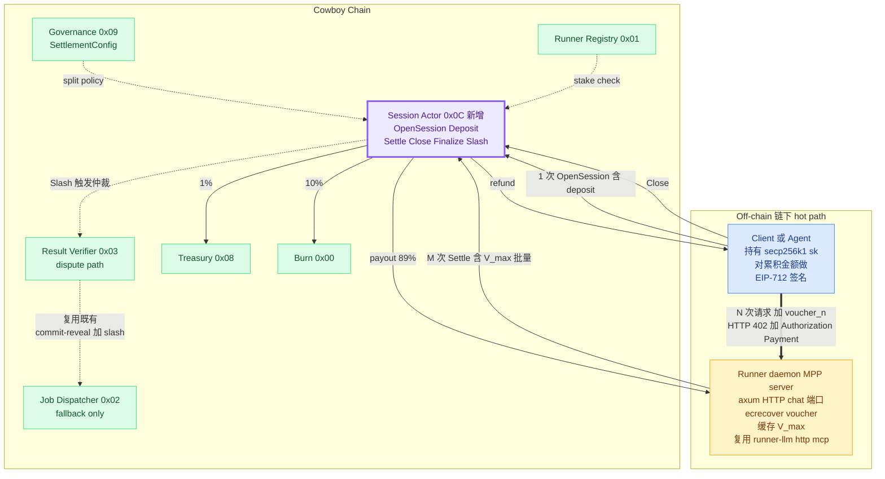

> 紫色框 `Session Actor 0x0C` 是唯一新增的链上组件；其他系统 actor 都已存在并以最小侵入方式接入（`Slash` 路径调用既有 `Verifier 0x03`/`Dispatcher 0x02`，分润比例从 `Governance 0x09` 读取）。链下侧 Runner daemon 复用既有 `runner-llm` / `runner-http` / `runner-mcp` executor。

### 5.3 链上：Session Actor

新增一个 system actor，地址建议 `0x0C`（紧邻已分配的 `0x0A` `STORAGE_MANAGER`、`0x0B` `RELAY_REGISTRY`）。

```rust
// node/runner/src/types.rs（或 node/types）
pub struct Session {
    pub session_id: [u8; 32],
    pub payer: Address,
    pub runner: Address,                 // 单 runner；多 runner 走多 session
    pub asset: SessionAsset,             // CBY 或 CIP-20 token
    pub deposit: u128,                   // 当前托管额
    pub spent: u128,                     // 已结算额（从最新 voucher 来）
    pub max_amount: u128,                // 上限（不超过 deposit）
    pub price_advert: PriceAdvert,       // 价目（input_token、output_token、http_call、...）
    pub opened_at_block: u64,
    pub expires_at_block: u64,
    pub last_voucher_nonce: u64,
    pub status: SessionStatus,           // Open | Closing | Settled | Refunded
    pub dispute_window: u64,             // 复用 CIP-2 的 dispute_window_blocks
}

pub enum SessionAsset {
    Cby,
    Cip20 { actor: Address },
}
```

**消息接口（System Instruction）**：

| Op | 入参 | 行为 |
|----|------|------|
| `OpenSession` | `payer, runner, asset, max_amount, expires_at, price_advert` | 创建 session，从 payer 转 `max_amount` 到 Session Actor（CBY 直接转账；CIP-20 走 token transferFrom），返回 `session_id` |
| `Deposit` | `session_id, amount` | session 中途追加托管 |
| `Settle` | `session_id, voucher` | 任意人提交（一般是 runner）。校验 voucher → 转 `voucher.cumulative_amount - session.spent` 给 runner（按 SettlementConfig 分润给 burn / treasury）→ 更新 `spent` 和 `last_voucher_nonce` |
| `CloseSession` | `session_id` | payer 发起；进入 `Closing` 状态，启动 `dispute_window` |
| `Finalize` | `session_id` | 任意人在 dispute window 后调用：把剩余托管退还给 payer |
| `Slash` | `session_id, evidence` | 仲裁路径（见 §5.6） |

**所需新指令 opcode**（占位）：基于 CIP-3 已经分配的 opcode 表新增 6 个，详见 §6.1。

**Session 状态机**：

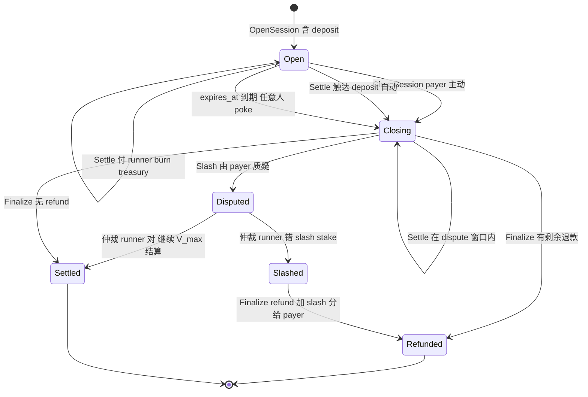

四个稳定状态：`Open`（接受 voucher / Deposit / Settle）、`Closing`（dispute window 中，仍可补提 voucher）、`Settled` / `Refunded`（终态）。`Disputed` 是中间瞬态：入口为 `Slash`，出口走 CIP-2 既有共识。

### 5.4 Voucher 格式（链下）

```rust
// runner-common 新增
#[derive(Serialize, Deserialize, Clone, Debug)]
pub struct SessionVoucher {
    pub session_id: [u8; 32],
    pub cumulative_amount: u128,        // 自 open 起的累计金额（CBY wei 或 token 最小单位）
    pub nonce: u64,                     // 单调递增
    pub expires_at: u64,                // unix timestamp 或 block height
    pub usage_digest: [u8; 32],         // keccak256(usage_log) 用于审计 / 争议
    pub signature: [u8; 65],            // secp256k1 (r,s,v)
}
```

签名域用 EIP-712 风格：

```
domain = EIP712Domain {
    name: "Cowboy MPP Session",
    version: "1",
    chainId: <cowboy_chain_id>,
    verifyingContract: <SESSION_ACTOR_ADDRESS>,
}

types = {
    Voucher: [
        ("session_id", "bytes32"),
        ("cumulative_amount", "uint128"),
        ("nonce", "uint64"),
        ("expires_at", "uint64"),
        ("usage_digest", "bytes32"),
    ]
}
```

这样 wevm/mppx 的客户端只要换 domain 就能签 Cowboy voucher，不需要重写客户端。

### 5.5 链下：Runner 端改造

在 `runner/crates/runner-node` 中新增 `session_handler`：

1. **HTTP server 模块（新）**：runner 暴露一个 HTTP/WS 端口（推荐复用已有 `runner-http` crate 的依赖），实现 MPP 的 `WWW-Authenticate: Payment` 挑战。
2. **Session manager（新）**：
   - 监听链上 `SessionOpen` 事件，维护本地 channel state（`session_id → Session`）。
   - 收到客户端请求 → 验证 `Authorization: Payment` 头里的 voucher：
     - `ecrecover(voucher) == session.payer`
     - `voucher.cumulative_amount > local.cumulative_amount`
     - `voucher.cumulative_amount ≤ session.deposit`
     - `voucher.nonce > local.nonce`
     - `voucher.expires_at > now`
   - 通过 → 调用既有 executor（`runner-llm` / `runner-http` / `runner-mcp`）→ 返回结果 + `Payment-Receipt` 头。
   - 内存里保留 `V_max`，定期 checkpoint 到本地 sled/sqlite 以防崩溃。
3. **Settlement scheduler**：
   - 周期性 / 触发性（session 关闭、达到阈值、临近过期）调用 `Settle(session_id, V_max)` 上链。
   - 失败重试（链拥堵 / dispute 等）。
4. **Pricing**：和 `RateCard` 一致；price_advert 在 OpenSession 时由双方协商，Runner 必须遵守。
5. **执行器复用**：LLM / HTTP / MCP 三类完全复用 `runner-llm`、`runner-http`、`runner-mcp`，只是不再从 chain 拉 JobSpec，而是从 HTTP body 拉。

**端到端时序**（Cowboy 上一次完整 LLM session）：

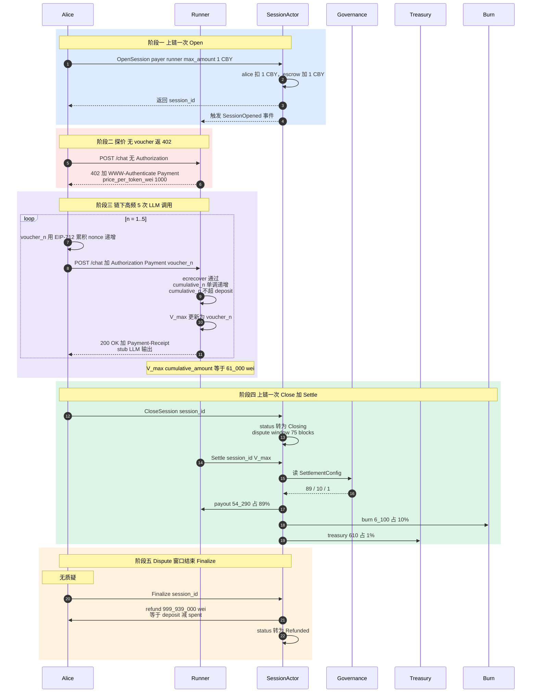

> 整段流程链上仅产生 **3 笔 tx**（OpenSession / Settle / Finalize），却覆盖了任意多次 LLM 调用——这就是 MPP session 相对单 Job 的核心收益。

**Settle 时刻的资金流向**（以 voucher.cumulative_amount = 61_000 wei、deposit = 1_000_000_000 wei 为例）：

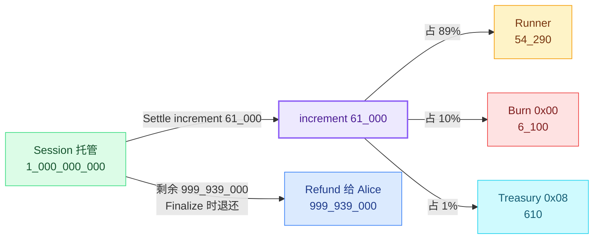

分润比例完全取自 `node/runner/src/types.rs::SettlementConfig`，governance actor `0x09` 通过 `UpdateSettlementConfig` 调整时，session 与单 Job 路径同步生效。

### 5.6 验证 / 仲裁路径

MPP 默认乐观信任 voucher（`ecrecover` 即生效）。但 Cowboy 已有的 commit-reveal + slashing 给我们提供了一条 **可选** 的 dispute fallback：

1. Payer 在 `dispute_window` 内对某次结算质疑 → 调 `Slash(session_id, evidence)`。
2. Evidence 包含：
   - 该次请求的 `usage_log`（明文）+ Runner 在 voucher `usage_digest` 中签名声明的内容
   - 另一组验证 Runner（按 CIP-2 VerificationMode 选的 N 人）出的对照结果
3. 仲裁 actor 比较两边的 `usage_digest`、按 `VerificationMode`（如 `MajorityVote`、`StructuredMatch`）判定。
4. Runner 错 → slash 部分 stake；payer 错 → 罚没 dispute deposit（防滥用）。

> 实务上：默认所有 Session 都是「单 Runner + 乐观信任」，因为这才是 MPP 的速度优势所在。dispute 路径只在被触发时才付出多 Runner 共识的成本，类似 optimistic rollup 的争议机制。

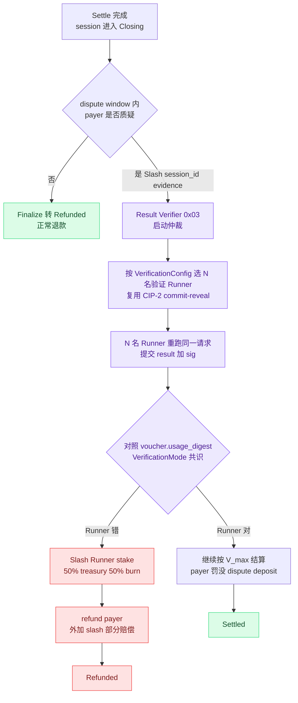

仲裁路径**完全复用** CIP-2 既有的 `Result Verifier 0x03` + commit-reveal + slashing，没有引入新的共识机制——session 本身只是"乐观快路径 + 既有慢路径"的组合。

### 5.7 安全 / 拒绝服务考量

| 攻击 | 缓解 |
|------|------|
| Payer 不签 voucher 但持续请求 | Runner 在某个未支付请求数（如 1）后立刻拒绝，强制每次都带 voucher |
| Runner 收钱不干活 | dispute 路径 + 该 Runner 的 stake 抵押；Payer 可调用 `CloseSession` 进入 dispute window |
| Voucher 重放 | `nonce` 单调 + Settle 时校验 ≤ `last_voucher_nonce` |
| Payer 在 settle 前提走 deposit | Open 时 deposit 立即被 Session Actor 锁定，链上账户无法独立花费 |
| Runner 提交过期 voucher | 合约在 `Settle` 时校验 `expires_at`（既可用 block height 也可用 timestamp，Cowboy 倾向 block height） |
| 高频 voucher DDoS Runner | Runner 端做 rate limit + 拒绝 voucher_amount 增量小于 min_increment 的请求 |
| Payer 私钥泄露 | session 有 `max_amount` 上限，泄露损失被封顶 |

### 5.8 与 CIP-7 的关系

CIP-7 是「按 epoch 续费的密钥访问流」，针对的是 **publisher 把流加密、subscriber 按时间段付费拿密钥** 的模型，更像 Substack。本研究的 session 是 **按消耗付费 metered service**，更像 OpenAI API。

| 维度 | CIP-7 Stream | MPP Session |
|------|--------------|-------------|
| 计价 | 按时间段（epoch） | 按消耗（token 数 / 调用次数） |
| 资金 | epoch 提前付 | deposit 一次，voucher 累积扣 |
| 状态 | epoch boundary 续费 | 任意时刻关停 |
| Use case | 直播/订阅 | LLM 推理、API 调用 |

两者**正交**，可共存。一个 Runner 完全可以同时跑 CIP-7 stream 和 MPP session。

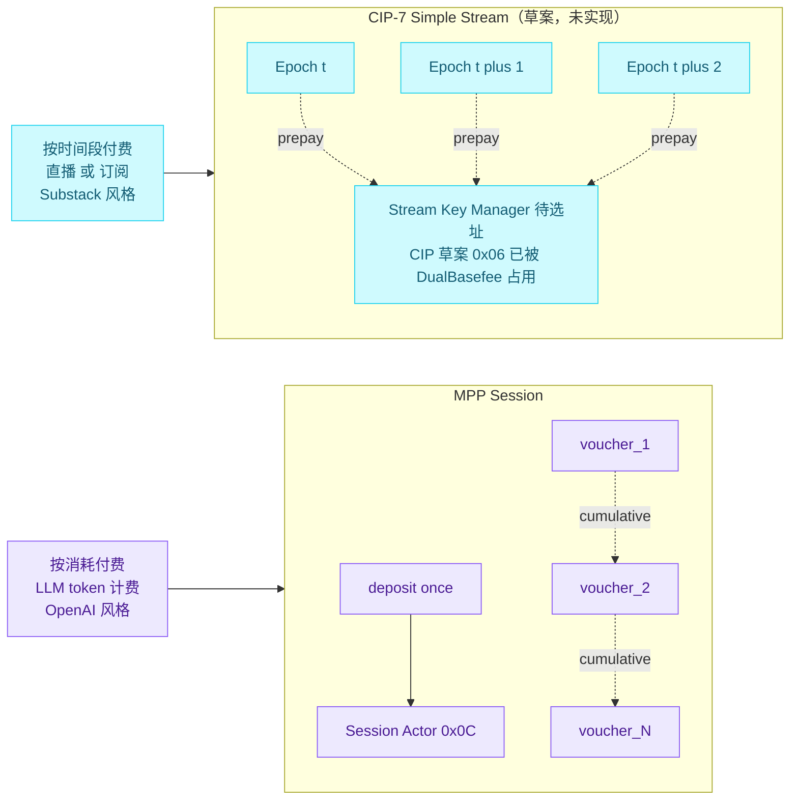

---

## 6. 落地路线建议

### 6.1 PoC 阶段（2–3 周）

- **CIP 草案**：起一份 `cip-2x-mpp-session.md`，把 §5 的 Session Actor、voucher 格式、opcode 分配、dispute window、SettlementConfig 复用都写清楚。Opcode 占用：在 CIP-3 fee table 后追加 6 个新 opcode（OpenSession / Deposit / Settle / CloseSession / Finalize / Slash），fee 表条目同步给 governance 治理参数。
- **types 改动**：`node/types/src/` 加 `Session`、`SessionAsset`、`SessionStatus`、`SessionVoucher`、`PriceAdvert`。
- **system actor 实现**：`node/execution/src/runner/session.rs`（新文件），仿 `dispatcher.rs` / `verifier.rs` 的 handler 风格。
- **runner-common**：把 `SessionVoucher` 与 EIP-712 域定义放进去，runner 与 CLI 共用。
- **runner 端**：在 `runner/crates/runner-node` 加 `session/` 子模块和 axum HTTP server，复用 `runner-llm`。
- **CLI 工具**：`cowboy session open / fund / close / list`，方便手工测试。
- **示例**：`examples/llm_session/`，跑一个 Agent ↔ Runner 的 session 全流程。

### 6.2 验证目标

- 单 session 1000 次 LLM 调用、链上只产生 2 笔 tx（open + settle），延迟 < 100ms / 次。
- session 中断（runner 重启 / 客户端崩溃）后，账本能从 voucher 恢复，不丢账。
- dispute 路径：Payer 提交不一致 evidence，Slash 正确执行，stake 损失符合 SettlementConfig。
- 与 wevm/mppx 客户端互通：跑通 mppx 的 `Mppx.create({ methods: [cowboy(...)] })` 用例（需要给 mppx 写一个 Cowboy method 适配器）。

### 6.3 后续

- **CIP-20 token 作为 session 资产**：让 USD-pegged 的 CIP-20 代币也能托管，对应 Tempo 用 USDG 的体验。
- **TEE 增强**：CIP-23 的 TEE Verifier `0x05` 给 Runner 提供 `tee_attestation`，session voucher 的 `usage_digest` 可与 TEE 报告绑定，提高乐观信任的可靠性。
- **Multi-runner session**：把单 Runner session 扩展为 N-of-M 共识 session（可惜延迟会回落）。短期不做，长期作为高安全档位。
- **跨链 session bridge**：把 Tempo / Stripe / Lightning 的 session voucher 通过 MPP 协议层桥接到 Cowboy 结算（见 §7）。

---

## 7. 战略含义

会议纪要里那句**"调用 Runner 不必经过 Cowboy，付款在 Cowboy 上"** 其实暗含一个非常关键的产品定位：

> Cowboy 不必抢成为 "AI 工作负载执行链"，而是先做 **AI 工作负载的结算层**。

如果 MPP 成为机器支付的事实标准（Stripe + Tempo + Visa + Cloudflare 已经卡位），那么：

- 任何遵循 MPP 的 service（LLM API、MCP server、HTTP 资源、链下数据源）都能在 Cowboy 上开 session 结算。
- Runner 既是 Cowboy 的执行者，也可以同时是 **任意 MPP server**。Runner 跑 LLM 推理时，对 Tempo 的支付、对 Cowboy 的支付走完全相同的 voucher 流，只是 EIP-712 domain 不同。
- 反过来，Cowboy 的 Job 也可以从其它链导入：用户在 Solana / Stellar 上签 voucher，Runner 把 settlement 桥到 Cowboy。

短期推荐**先做单链 PoC**，确认 voucher + Session Actor + Runner 端流程跑通，再考虑跨链。

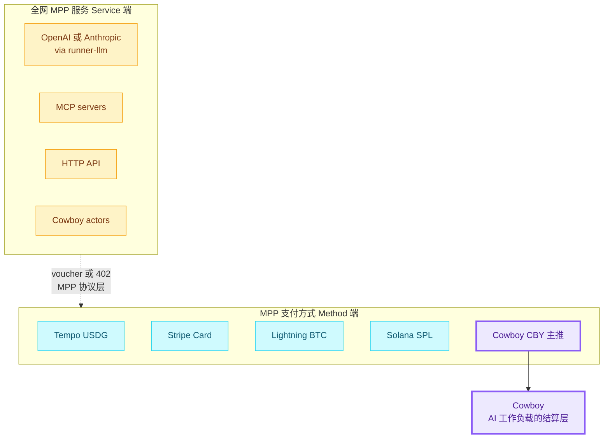

只要 Cowboy 的 Session Actor 能跟 MPP 兼容，任何 MPP service 都可以选 CBY 作结算路径，反过来 Cowboy Runner 也可以同时为多个 MPP method 服务。这是 Cowboy 不必自己抢「执行层」就能吃到 AI 经济的入场券。

---

## 8. 资料索引

- 协议：[mpp.dev/overview](https://mpp.dev/overview)、[mpp.dev/protocol](https://mpp.dev/protocol)、[paymentauth.org](https://paymentauth.org/)
- Tempo：[docs.tempo.xyz/guide/machine-payments](https://docs.tempo.xyz/guide/machine-payments)、[docs.tempo.xyz/learn/tempo/machine-payments](https://docs.tempo.xyz/learn/tempo/machine-payments)、[Tempo CLI wallet](https://docs.tempo.xyz/cli/wallet)、[tempoxyz/wallet](https://github.com/tempoxyz/wallet)
- 解读：[Cloudflare Agents MPP](https://developers.cloudflare.com/agents/agentic-payments/mpp/)、[Stripe blog](https://stripe.com/blog/machine-payments-protocol)、[Privy blog](https://privy.io/blog/building-on-privy-with-tempo-machine-payments-protocol)、[Formo blog](https://formo.so/blog/mpp-machine-payments-protocol-explained)、[Visa announcement](https://corporate.visa.com/en/sites/visa-perspectives/innovation/visa-card-specification-sdk-for-machine-payments-protocol.html)、[Apify blog](https://blog.apify.com/machine-payments-protocol-overview/)、[QuickNode docs](https://www.quicknode.com/docs/build-with-ai/mpp-payments)、[GetBlock blog](https://getblock.io/blog/what-is-a-machine-payments-protocol-mpp/)
- SDK：[wevm/mppx](https://github.com/wevm/mppx)、[tempoxyz/mpp-rs](https://github.com/tempoxyz/mpp-rs)、[mpp.dev/sdk/python](https://mpp.dev/sdk/python)、[solana-foundation/mpp-sdk](https://github.com/solana-foundation/mpp-sdk)、[stellar/stellar-mpp-sdk](https://github.com/stellar/stellar-mpp-sdk)、[starc007/mppx-proxy](https://github.com/starc007/mppx-proxy)
- Cowboy 现状（重点文件，行号截至 2026-05-06）：
  - `node/runner/src/system_actors.rs:11-66`（system actor 地址权威定义：`0x01-0x0B`）
  - `node/types/src/constants.rs:142-232`（`BASEFEE_SYSTEM_ACTOR=0x06`、`GOVERNANCE_SYSTEM_ACTOR=0x09`、`SETTLEMENT_CONFIG_KEY`、`DISPUTE_WINDOW_BLOCKS=75`）
  - `node/runner/src/types.rs:91-117`（`RunnerRegistration`）、`136-156`（`RateCard`）、`283-340`（`VerificationConfig` / `VerificationMode` 五变体）、`355-365`（`RunnerResult.signature: Option<[u8; 65]>`）、`596-660`（`RunnerResult` serde）、`746-779`（`SettlementConfig` 默认 89/10/1 + `is_valid`）
  - `node/execution/src/runner/dispatcher.rs:297-708`（`handle_job_submit` + D1 escrow `678-708`）、`830-910`（`handle_job_cancel` D3 退款）、`950-1100+`（`select_runner_committee_with_seed` + 1.5× stake filter）
  - `node/execution/src/runner/verifier.rs:36-251`（commit/reveal 入口）、`332-465`（settlement payout + governance 读取）、`524-771`（`verify_results` 五种 mode）
  - `node/execution/src/runner/registry.rs:18`（`handle_runner_register` + 1.5× stake check）、`317`（`slash_runner`，CIP-25 §β Task 8 后从 verifier.rs 搬至此）
  - `runner/crates/runner-node/src/`（runner daemon 主体）
  - `refs/cips/cip-2-offchain-compute.md`（含 `cip-2-offchain-compute-v2.md`）、`refs/cips/cip-3-fee-model.md`、`refs/cips/cip-7-simple-stream-protocol.md`、`refs/cips/cip-23-tee-execution.md`（含 `-v2.md`）
