# MPP + Session Integration Research: Machine Payment Protocol on the Cowboy Runner Stack

**Date**: 2026-04-28
**Author**: Research note
**Status**: Research draft (not yet a CIP)
**Related CIPs**: CIP-2 (Off-Chain Compute), CIP-3 (Fee Model), CIP-7 (Simple Stream Protocol), CIP-20 (Fungible Tokens)

**Figure index**:

| Fig | Content | Section |
|-----|---------|---------|
| 1 | Two payment modes — flowchart | §2.3 |
| 2 | Charge / 402 flow — sequence | §2.3.1 |
| 3 | Tempo session lifecycle — sequence | §2.4 |
| 4 | Cowboy today (per-Job path) — graph | §4.1 |
| 5 | Cowboy MPP Session architecture — graph | §5.2 |
| 6 | Session state machine — state | §5.3 |
| 7 | Cowboy end-to-end timing — sequence | §5.5 |
| 8 | Settlement payout flow — flowchart | §5.5 |
| 9 | Dispute arbitration path — flowchart | §5.6 |
| 10 | CIP-7 vs MPP Session — graph | §5.8 |
| 11 | Strategic positioning (Cowboy as a settlement layer) — graph | §7 |

---

## 1. Background and Goals

### 1.1 Origin

- Weekly meeting notes: this week we need to study Tempo's **MPP (Machine Payment Protocol)** and assess the feasibility of building **session-based payments** on the Cowboy node + runner stack. The headline conclusion was "calls to a Runner do not have to go through the Cowboy chain, but settlement happens on Cowboy", with CBY as the initial settlement asset.
- Reference material:
  - Protocol home page [mpp.dev/overview](https://mpp.dev/overview)
  - IETF spec aggregator [paymentauth.org](https://paymentauth.org/)
  - Tempo docs [docs.tempo.xyz/guide/machine-payments](https://docs.tempo.xyz/guide/machine-payments) and [docs.tempo.xyz/learn/tempo/machine-payments](https://docs.tempo.xyz/learn/tempo/machine-payments)
  - Official SDKs: [wevm/mppx (TypeScript)](https://github.com/wevm/mppx), [tempoxyz/mpp-rs (Rust)](https://github.com/tempoxyz/mpp-rs), Python `pympp`
  - Third-party write-ups: [Cloudflare Agents docs](https://developers.cloudflare.com/agents/agentic-payments/mpp/), [Stripe announcement](https://stripe.com/blog/machine-payments-protocol), [Visa MPP announcement](https://corporate.visa.com/en/sites/visa-perspectives/innovation/visa-card-specification-sdk-for-machine-payments-protocol.html)

### 1.2 Questions to answer

1. What problem does MPP solve, and what do its two payment modes (**charge / 402** and **session**) look like in practice?
2. How is Tempo's "session + on-chain escrow + off-chain vouchers" implementation actually wired up?
3. When grafting this session model onto Cowboy, how should the constraint "off-chain direct call to Runner; chain handles only settlement" be expressed in `node/` and `runner/`?
4. Is Cowboy's existing CIP-2 ("per-Job escrow + commit-reveal + multi-party consensus") and CIP-7 ("epoch-based streaming charge") already enough? Do we still need a Session system actor on top?

---

## 2. The MPP Protocol Itself

### 2.1 Positioning

MPP is an open payment protocol draft jointly submitted by Stripe and Tempo Labs to the IETF. It revives HTTP 402 ("Payment Required") from a legacy curiosity into a first-class status code so that **Agents / Apps / humans** can complete the full "request resource → receive payment challenge → pay → retry → get resource + receipt" cycle inside a single HTTP exchange.

[mpp.dev/overview](https://mpp.dev/overview) positions the protocol as an "open protocol for machine-to-machine payments", emphasizing:
> Idempotency, security, and receipts are first-class primitives.

### 2.2 Three roles

| Role | Responsibility |
|------|----------------|
| **Developer** | Integrates the MPP client; embeds payment capability into apps / agents |
| **Agent** | Auto-discovers services, auto-pays, auto-invokes — fully unattended |
| **Service** | Integrates the MPP server; returns `402` and a `WWW-Authenticate: Payment` challenge on protected endpoints |

### 2.3 Two payment modes

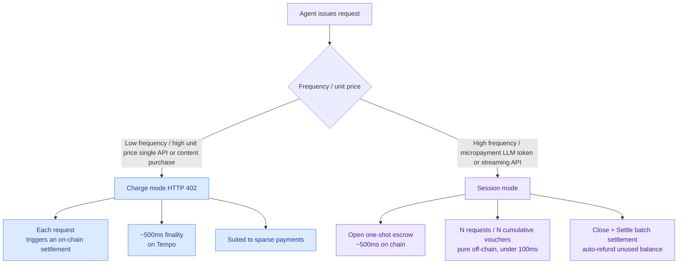

#### 2.3.1 Charge (402, single settlement)

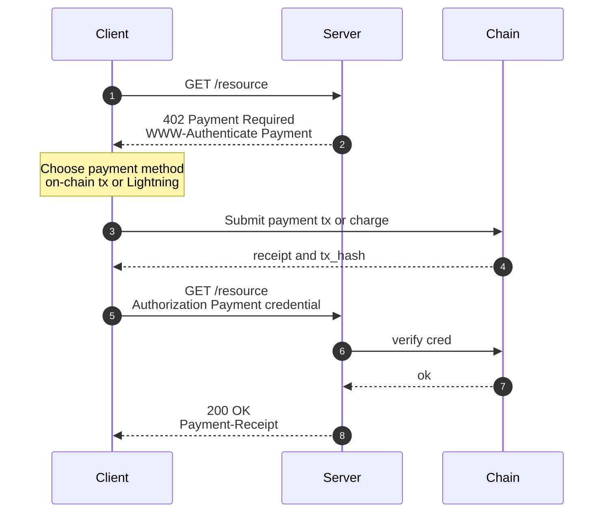

- HTTP headers: `WWW-Authenticate: Payment`, `Authorization: Payment`, `Payment-Receipt`, `Retry-After`
- Status codes: `402` for the challenge, `200` on success
- Every call lands one settlement on chain (~500ms on Tempo)
- Suits: one-off API calls, content purchases, low-frequency high-value requests

#### 2.3.2 Session (on-chain escrow + off-chain cumulative vouchers)

> "When you use pay-as-you-go services, MPP opens a session — a payment channel where your wallet deposits funds into an escrow contract, then pays per request using signed vouchers off-chain." — [docs.tempo.xyz](https://docs.tempo.xyz/learn/tempo/machine-payments)

Tempo positions session mode as the preferred path for **high-frequency micropayment** scenarios — LLM inference, streaming data, model inference — because it amortizes the "one on-chain hop → many off-chain settlements → one on-chain hop" cost across thousands or tens of thousands of micro-requests.

- Per-call payments as low as \$0.0001
- Per-request latency under 100ms (no RPC, no DB lookup, vouchers go straight through `ecrecover`)
- At session end, all activity batch-settles on chain in one transaction; unused balance is refunded automatically

### 2.4 Session lifecycle (Tempo implementation)

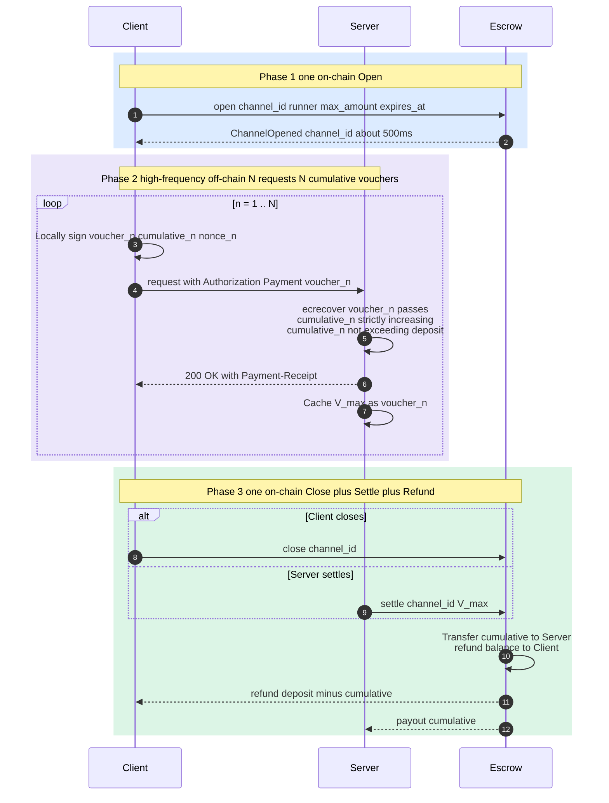

#### Steps

1. **Open**: Client and Server negotiate channel parameters (max amount, expiry block, price advert). The Client calls the escrow contract, transferring funds (USDG / CBY in the Cowboy case) into escrow and obtaining a `channel_id`. Tempo's docs quote a setup time of "roughly 500ms".
2. **Voucher**: For each request the Client signs an EIP-712 typed-data **cumulative** voucher:
   ```
   Voucher {
       channel_id:        bytes32
       cumulative_amount: uint256       // running total since session opened
       nonce:             uint64        // strictly increasing, replay-resistant
       expires_at:        uint64        // expiry timestamp or block height
   }
   ```
   Key point: **cumulative**, not incremental. The latest voucher fully supersedes older ones, so a power-cycle and reconnect can never lose accounting state.
3. **Verify**: For each voucher the Server runs `ecrecover` and checks signer == channel.owner, `cumulative_amount` strictly increasing, and `cumulative_amount` not exceeding the escrow balance. Verification needs no RPC — the entire path is local + in-memory.
4. **Serve**: On success the Server returns the resource immediately, keeping `V_max` (the voucher with the largest cumulative amount seen so far) in memory.
5. **Close / Settle**: Triggered by either side: Client closes the session, Server decides the user is done, timeout, or the escrow ceiling is hit. Either party submits `V_max` to the escrow contract:
   - The contract transfers `cumulative_amount` to the Server
   - The remaining balance is refunded to the Client
   - The channel closes
6. **Refund**: Any unconsumed balance is returned automatically. If the Server posts a higher-cumulative voucher inside the dispute window, settlement can be updated.

### 2.5 Where the protocol spec lives

`mpp.dev/specification` actually redirects to [paymentauth.org](https://paymentauth.org/), which aggregates several IETF Drafts:

- **Payment HTTP Authentication Scheme** (the core 402/header spec)
- **Payment Intent & Charge Specifications** (the charge abstraction)
- One charge spec per payment method (Card, EVM, Lightning, Solana, Stellar, Stripe, Tempo)
- **Lightning Session Spec** and **Tempo Session Spec** (session abstraction defined per chain)
- **Payment Discovery** (how a server advertises which methods / prices it accepts)
- **JSON-RPC & MCP Transport** (embedding payment headers in JSON-RPC / MCP calls beyond plain HTTP)

In other words MPP is layered: the protocol skeleton lives at `paymentauth.org` and each method has its own implementation. Our task is to **author a "Cowboy Session Spec"** (or take the EVM session spec and swap in our signing domain) so that CBY becomes a settlement asset.

### 2.6 SDK landscape

| Language | Package | Repository | Notes |
|----------|---------|------------|-------|
| TypeScript | `mppx` | [wevm/mppx](https://github.com/wevm/mppx) | Reference implementation. `Mppx.charge / stream / free`, built-in fetch interception, `session/multi-fetch` and `session/sse` examples |
| Python | `pympp` | mpp.dev/sdk/python | Both high- and low-level APIs |
| Rust | `mpp-rs` | [tempoxyz/mpp-rs](https://github.com/tempoxyz/mpp-rs) | Features: `client/server/tempo/stripe/evm/middleware/tower/axum/ws/utils`, ships `WsMessage / WsResponse` for two-way session payments |
| Solana | `mpp-sdk` | [solana-foundation/mpp-sdk](https://github.com/solana-foundation/mpp-sdk) | Chain-specific method |
| Stellar | `stellar-mpp-sdk` | [stellar/stellar-mpp-sdk](https://github.com/stellar/stellar-mpp-sdk) | Chain-specific method |

mppx contains a `Session.ts` we did not retrieve in this research (the path 404'd, possibly in a subdirectory). The concepts it surfaces include: Session, Voucher, Channel, ChannelStore, pluggable authorization strategies, voucher signing/verification, and EIP-712 type definitions on both sides. We will need to read the source directly during the PoC phase to confirm details.

---

## 3. Tempo Implementation Highlights

Tempo is the reference settlement chain for MPP. Its characteristics:

- **Stablecoin settlement**: USDG (Tempo mainnet's native stablecoin) is the default unit of account, with ~500ms finality.
- **Fee sponsorship**: Servers can pay gas on the user's behalf, so a Client only needs the stablecoin principal — friendly UX for Agents.
- **MPP-as-a-Service**: the chain ships an escrow contract suite and a session registry, exposed through the Tempo CLI / SDK:
  ```
  curl -fsSL https://tempo.xyz/install | bash
  tempo request <url>           # auto-handles 402
  tempo wallet ...              # wallet / channel ops
  ```
- **Signing**: EIP-712 typed data + EVM-flavored secp256k1 + `ecrecover`. Tempo is EVM-compatible, so it shares the same signing domain as wevm/mppx.
- **Privy / Cloudflare integration**: both Cloudflare Agents and Privy treat Tempo session as the official "give your Agent a wallet" recommendation.

Pull-quotes:

> "Agents deposit funds into an escrow contract (roughly 500ms setup time), then issue cumulative EIP-712 signed vouchers with each subsequent request. The server verifies vouchers via ecrecover with no RPC call or database lookup required, enabling sub-100ms latency."

> "Thousands of micro-interactions batch-settle into a single on-chain transaction when the session ends, with unused funds refunded."

---

## 4. Inventory of Cowboy Today

### 4.1 Existing payment / settlement primitives

| Primitive | Location | Summary |
|-----------|----------|---------|
| **Per-Job escrow** | `node/execution/src/runner/dispatcher.rs:515-533` | At Job submission, immediately deduct `max_price + tip` from the submitter and book it under the Job Dispatcher (`0x92`) |
| **Commit-reveal + multi-party consensus** | `node/execution/src/runner/verifier.rs:87-251` | 60% commit window, 40% reveal window; consensus per `VerificationMode`; the minority is slashed |
| **Settlement split** | `verifier.rs:317-418` | `SettlementConfig{runner_percent, burn_percent, treasury_percent}`, default 89/10/1, mutable by governance actor `0x09` via `UpdateSettlementConfig` |
| **Slashing** | `verifier.rs:31-84` | 50% treasury / 50% burn; reputation drops to 0 if stake falls below MIN_STAKE |
| **Stake-weighted VRF runner selection** | `dispatcher.rs:925-1010` | Fisher-Yates + log2(stake) weight compression to prevent whale dominance |
| **CIP-7 Simple Stream Protocol** | `refs/cips/cip-7-simple-stream-protocol.md` | Epoch-rolling subscription "stream" primitive, Stream Key Manager `0x06` manages X25519 keys; account-level entitlement |
| **CIP-20 Fungible Tokens** | `refs/cips/cip-20-fungible-tokens.md` | Token standard with a 50k hook gas cap, already usable as a USD-pegged asset (USDC peg planned) |

The diagram below shows Cowboy's current per-Job payment / settlement path. Every call traverses the full on-chain loop — there is no entry point for "batched amortization":

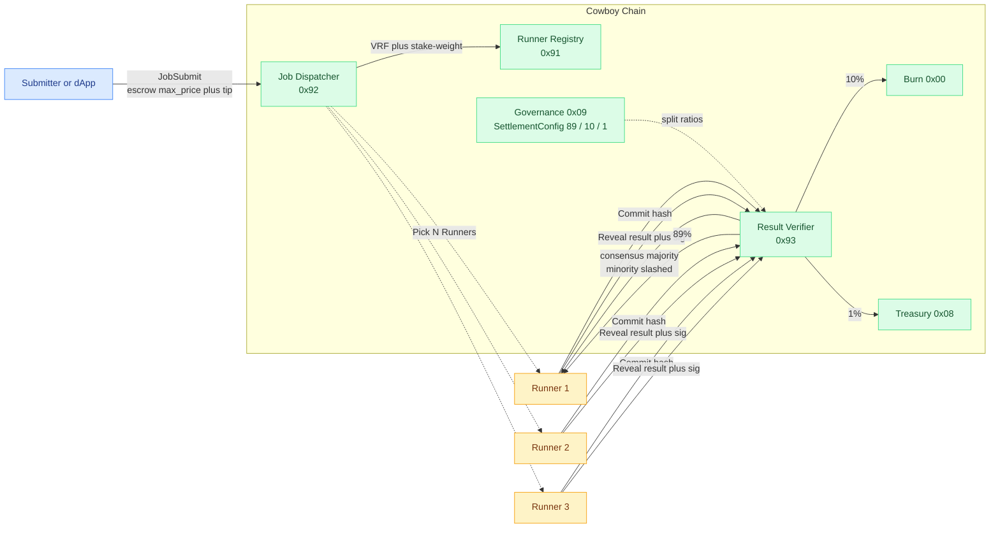

Each call requires one `JobSubmit` + one round of multi-party commit + one round of reveal + one settle transaction. The mechanism guarantees correctness but at a cost that does not fit high-frequency LLM micro-calls — exactly the gap Session mode is meant to fill.

### 4.2 Mapping existing structures to MPP session

| MPP session concept | What Cowboy already has | Gap |
|---------------------|-------------------------|-----|
| Escrow contract | Per-Job escrow in Job Dispatcher; CIP-7 stream key per-account escrow | **No channel/session-level escrow** — every job runs the loop independently |
| Cumulative voucher | RunnerResult is already signed (`signature: Option<[u8; 65]>` in `node/runner/src/types.rs:243-257`) | RunnerResult is a "single execution result signature", **not a cumulative-amount signature**; the payer side does not currently sign over amounts at all |
| Channel ID | None | Need a new `session_id` concept |
| Off-chain voucher exchange | None — every Job has to escrow on chain, pick a Runner on chain, then commit-reveal | **No path today for "talk to a Runner directly without going on chain"** |
| Settlement close | Per-Job settle trigger; governable split | Becomes "batch-settle N job/cost vouchers" — fully reuses the split machinery |
| Refund | Unused max_price within a Job stays at the Dispatcher (does it actually refund to submitter? needs verification) | "Refund leftover at session end" is a new requirement |
| Arbitration / dispute window | `dispute_window_blocks` already exists in `VerificationConfig` but is not yet active | Natural extension point |

### 4.3 Key findings

1. **Consensus and signing primitives are reusable**: CIP-2 already provides secp256k1 signatures + commit-reveal + multi-party consensus + slashing in full. Session mode does not need to replace them — it should treat them as an **optional verification path**, where most requests go via direct vouchers and only a few high-value or disputed requests fall back to multi-runner commit-reveal verification.
2. **CIP-7 is half of the streaming paradigm**: epoch-based subscription and X25519 sealed keys already cover "streaming pay", but they are **per time slice** rather than **per consumption**, which is too coarse for LLM token billing. Session vouchers — pay-per-consumption with cumulative signatures — are an orthogonal curve.
3. **Settlement asset**: the weekly meeting confirmed CBY for the initial cut. If a CBY-pegged stablecoin (a CIP-20 use case) lands later, the upgrade is seamless.
4. **Bypassing the chain for direct connection** is the key architectural change: today every Job must `JobSubmit` → on-chain Runner selection → on-chain commit/reveal. To support "talk to the Runner off-chain, settle on-chain", Runners must accept **off-chain requests that are not pre-registered on chain** and decide whether to trust and serve once they receive a voucher.

---

## 5. Integration Design: Cowboy MPP Session

### 5.1 Design principles

1. **Don't touch the core of CIP-2**: Job-based sync / async execution stays. Session is an additive fast path.
2. **Single-purpose Session Actor**: it does escrow and final settlement only — no execution scheduling.
3. **Voucher signing reuses secp256k1 + EIP-712-style typed data**, identical to existing Cowboy account signing, so Agent tooling can be reused.
4. **CBY first, CIP-20 tokens later**.
5. **Reuse SettlementConfig at settlement time**: runner / burn / treasury take the same percentages, governance can tune them.
6. **Off-chain protocol reuses MPP HTTP headers**: this gives interop with Tempo / Stripe SDKs and lets a Cowboy Runner double as a Tempo server.

### 5.2 Roles

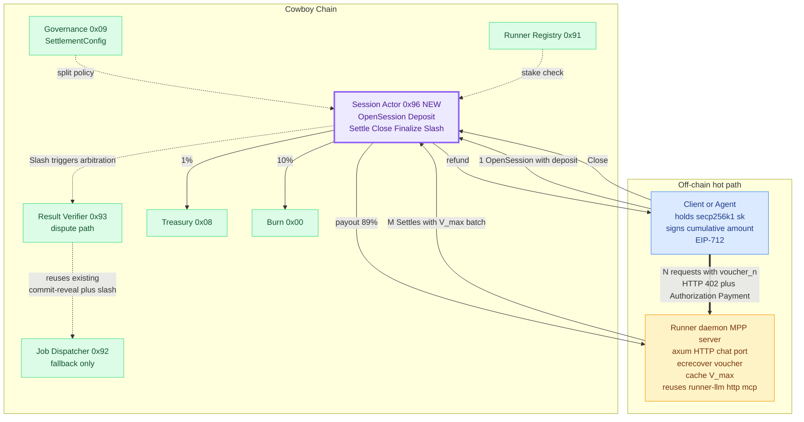

> The purple `Session Actor 0x96` box is the only new on-chain component. Every other system actor already exists and is wired in with minimum invasiveness (the `Slash` path calls into the existing `Verifier 0x93`/`Dispatcher 0x92`; split ratios are read from `Governance 0x09`). On the off-chain side the Runner daemon reuses the existing `runner-llm` / `runner-http` / `runner-mcp` executors.

### 5.3 On-chain: Session Actor

A new system actor at the suggested address `0x96` (adjacent to the existing `0x91-0x95`).

```rust
// node/runner/src/types.rs (or node/types)
pub struct Session {
    pub session_id: [u8; 32],
    pub payer: Address,
    pub runner: Address,                 // single runner; multi-runner uses multiple sessions
    pub asset: SessionAsset,             // CBY or CIP-20 token
    pub deposit: u128,                   // current escrowed amount
    pub spent: u128,                     // already-settled amount (from latest voucher)
    pub max_amount: u128,                // ceiling (≤ deposit)
    pub price_advert: PriceAdvert,       // pricing (input_token, output_token, http_call, ...)
    pub opened_at_block: u64,
    pub expires_at_block: u64,
    pub last_voucher_nonce: u64,
    pub status: SessionStatus,           // Open | Closing | Settled | Refunded
    pub dispute_window: u64,             // reuses CIP-2's dispute_window_blocks
}

pub enum SessionAsset {
    Cby,
    Cip20 { actor: Address },
}
```

**Message interface (System Instructions)**:

| Op | Inputs | Behavior |
|----|--------|----------|
| `OpenSession` | `payer, runner, asset, max_amount, expires_at, price_advert` | Create a session, transfer `max_amount` from the payer to the Session Actor (CBY = direct transfer; CIP-20 = token transferFrom), return `session_id` |
| `Deposit` | `session_id, amount` | Top up an open session mid-flight |
| `Settle` | `session_id, voucher` | Anyone may submit (typically the runner). Validate voucher → transfer `voucher.cumulative_amount - session.spent` to the runner (with split to burn / treasury per SettlementConfig) → update `spent` and `last_voucher_nonce` |
| `CloseSession` | `session_id` | Initiated by payer; enters `Closing`, starts the `dispute_window` |
| `Finalize` | `session_id` | Anyone may call after the dispute window expires: refund the remaining escrow to the payer |
| `Slash` | `session_id, evidence` | Arbitration path (see §5.6) |

**New opcodes required** (placeholders): six new entries on top of the CIP-3 opcode table; details in §6.1.

**Session state machine**:

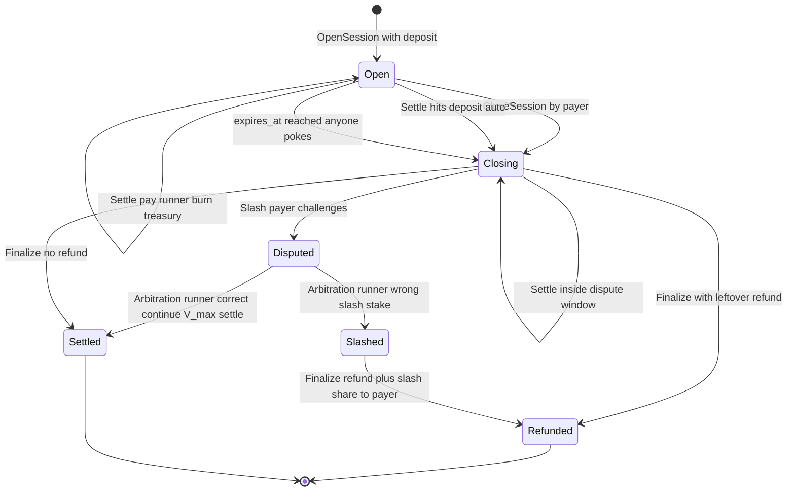

Four stable states: `Open` (accepts vouchers / Deposit / Settle), `Closing` (in the dispute window, additional vouchers still allowed), `Settled` / `Refunded` (terminal). `Disputed` is a transient intermediate: entered via `Slash`, exited via the existing CIP-2 consensus path.

### 5.4 Voucher format (off-chain)

```rust
// added in runner-common
#[derive(Serialize, Deserialize, Clone, Debug)]
pub struct SessionVoucher {
    pub session_id: [u8; 32],
    pub cumulative_amount: u128,        // running total since open (CBY wei or token's smallest unit)
    pub nonce: u64,                     // strictly increasing
    pub expires_at: u64,                // unix timestamp or block height
    pub usage_digest: [u8; 32],         // keccak256(usage_log) for audit / dispute
    pub signature: [u8; 65],            // secp256k1 (r,s,v)
}
```

Signing domain in EIP-712 style:

```
domain = EIP712Domain {
    name: "Cowboy MPP Session",
    version: "1",
    chainId: <cowboy_chain_id>,
    verifyingContract: <SESSION_ACTOR_ADDRESS>,
}

types = {
    Voucher: [
        ("session_id", "bytes32"),
        ("cumulative_amount", "uint128"),
        ("nonce", "uint64"),
        ("expires_at", "uint64"),
        ("usage_digest", "bytes32"),
    ]
}
```

This way a wevm/mppx client only swaps the domain to sign Cowboy vouchers — no client rewrite required.

### 5.5 Off-chain: Runner-side changes

Add a `session_handler` to `runner/crates/runner-node`:

1. **HTTP server module (new)**: the runner exposes an HTTP/WS port (recommend reusing dependencies from the existing `runner-http` crate) and implements MPP's `WWW-Authenticate: Payment` challenge.
2. **Session manager (new)**:
   - Subscribe to on-chain `SessionOpen` events; maintain local channel state (`session_id → Session`).
   - On a client request → validate the voucher in the `Authorization: Payment` header:
     - `ecrecover(voucher) == session.payer`
     - `voucher.cumulative_amount > local.cumulative_amount`
     - `voucher.cumulative_amount ≤ session.deposit`
     - `voucher.nonce > local.nonce`
     - `voucher.expires_at > now`
   - On success → call into the existing executors (`runner-llm` / `runner-http` / `runner-mcp`) → return result + `Payment-Receipt` header.
   - Keep `V_max` in memory; checkpoint to local sled/sqlite periodically to survive crashes.
3. **Settlement scheduler**:
   - Periodically / event-driven (session close, threshold reached, near-expiry) call `Settle(session_id, V_max)` on chain.
   - Retry on failure (chain congestion, dispute, etc.).
4. **Pricing**: aligned with `RateCard`; `price_advert` is negotiated at OpenSession and the Runner must respect it.
5. **Executor reuse**: the LLM / HTTP / MCP families fully reuse `runner-llm`, `runner-http`, `runner-mcp` — they just stop pulling JobSpec from the chain and pull it from the HTTP body instead.

**End-to-end timing** (one full LLM session on Cowboy):

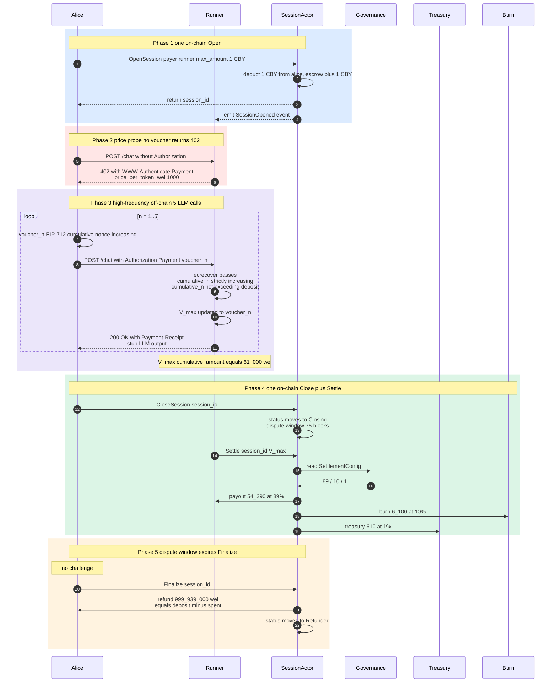

> The full flow produces exactly **3 on-chain transactions** (OpenSession / Settle / Finalize), yet covers an arbitrary number of LLM calls — this is the core MPP-session win over per-Job mode.

**Money flow at Settle time** (with voucher.cumulative_amount = 61_000 wei, deposit = 1_000_000_000 wei):

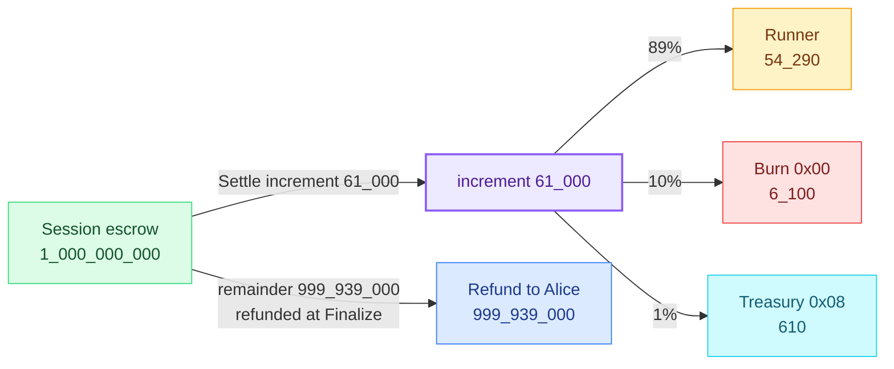

The split ratios come straight from `node/runner/src/types.rs::SettlementConfig`. When governance actor `0x09` updates them via `UpdateSettlementConfig`, the change applies to both session and per-Job paths simultaneously.

### 5.6 Verification / arbitration path

MPP optimistically trusts vouchers by default (ecrecover is the only check). But Cowboy's existing commit-reveal + slashing gives us an **optional** dispute fallback:

1. Inside `dispute_window`, the payer challenges a settlement → call `Slash(session_id, evidence)`.
2. Evidence contains:
   - The plaintext `usage_log` for that request and what the Runner attested in the voucher's `usage_digest`
   - A separate set of verification Runners (N picked per CIP-2 `VerificationMode`) producing comparison output
3. The arbitration actor compares both `usage_digest` values and adjudicates per `VerificationMode` (e.g. `MajorityVote`, `StructuredMatch`).
4. Runner wrong → slash a portion of stake; payer wrong → forfeit dispute deposit (anti-abuse).

> In practice: every Session is "single Runner + optimistic trust" by default — that is what gives MPP its speed. The dispute path only pays the cost of multi-Runner consensus when triggered, similar to the dispute mechanism in optimistic rollups.

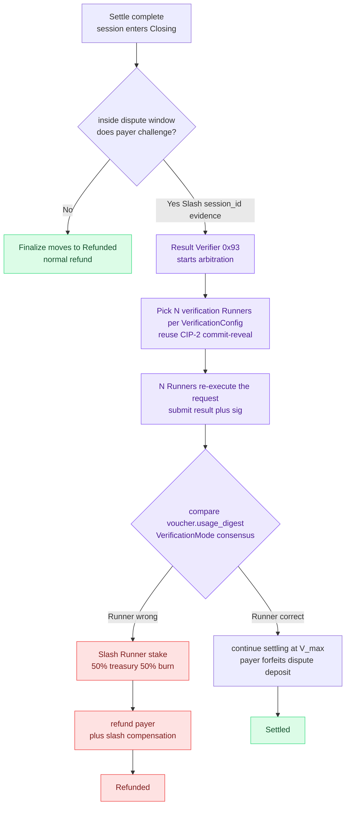

The arbitration path **fully reuses** CIP-2's existing `Result Verifier 0x93` + commit-reveal + slashing — no new consensus mechanism. Session itself is just "optimistic fast path + existing slow path".

### 5.7 Security / DoS considerations

| Attack | Mitigation |
|--------|------------|
| Payer keeps requesting without signing vouchers | After some unpaid-request count (e.g. 1) the Runner refuses, forcing every request to carry a voucher |
| Runner takes payment but skips work | Dispute path + the Runner's stake collateral; the Payer can call `CloseSession` to enter the dispute window |
| Voucher replay | Strictly increasing `nonce` + Settle-time check `≤ last_voucher_nonce` |
| Payer withdraws deposit before settle | At Open the deposit is locked into the Session Actor immediately; the on-chain account cannot spend it independently |
| Runner submits an expired voucher | The contract verifies `expires_at` on `Settle` (block height or timestamp; Cowboy prefers block height) |
| High-frequency voucher DDoS against Runner | Runner-side rate limiting + reject vouchers whose increment is below `min_increment` |
| Payer key leak | The session has a `max_amount` ceiling; loss is capped |

### 5.8 Relationship to CIP-7

CIP-7 is "epoch-subscription key access stream", aimed at the **publisher encrypts the stream, subscriber pays per period to fetch keys** model — closer to Substack. The session in this research is **metered service paid per consumption** — closer to the OpenAI API.

| Dimension | CIP-7 Stream | MPP Session |
|-----------|--------------|-------------|
| Pricing | per time slice (epoch) | per consumption (token count / call count) |
| Funds | prepaid each epoch | deposit once, vouchers cumulatively debit |
| State | renewed at epoch boundary | closeable at any moment |
| Use case | livestream / subscription | LLM inference, API calls |

The two are **orthogonal** and can coexist. A single Runner can run CIP-7 streams and MPP sessions side by side.

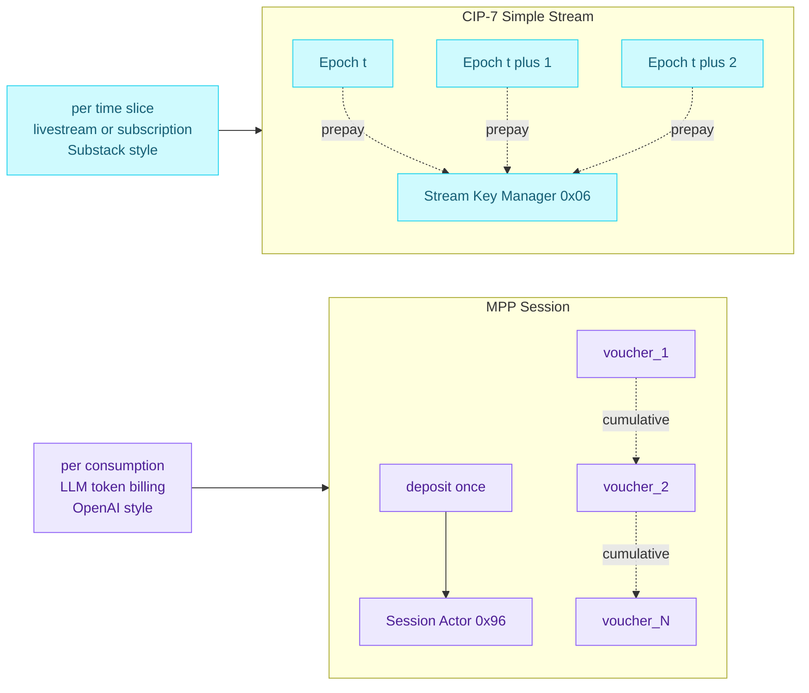

---

## 6. Roll-out Recommendation

### 6.1 PoC phase (2–3 weeks)

- **CIP draft**: open `cip-2x-mpp-session.md`, capturing §5's Session Actor, voucher format, opcode allocation, dispute window, and SettlementConfig reuse. Opcode footprint: append six new opcodes to the CIP-3 fee table (OpenSession / Deposit / Settle / CloseSession / Finalize / Slash); fee-table entries also flow into governance parameters.
- **types changes**: in `node/types/src/`, add `Session`, `SessionAsset`, `SessionStatus`, `SessionVoucher`, `PriceAdvert`.
- **System actor implementation**: `node/execution/src/runner/session.rs` (new file), in the same handler style as `dispatcher.rs` / `verifier.rs`.
- **runner-common**: place `SessionVoucher` and the EIP-712 domain definition here, shared by runner and CLI.
- **Runner side**: add a `session/` submodule and an axum HTTP server in `runner/crates/runner-node`, reusing `runner-llm`.
- **CLI tooling**: `cowboy session open / fund / close / list` for manual testing.
- **Example**: `examples/llm_session/`, an end-to-end Agent ↔ Runner session.

### 6.2 Validation targets

- 1000 LLM calls in a single session, only 2 on-chain txs (open + settle), per-call latency < 100ms.
- After session disruption (runner restart / client crash), the ledger recovers from the latest voucher with no lost accounting.
- Dispute path: payer submits inconsistent evidence, Slash executes correctly, stake loss matches SettlementConfig.
- Interop with the wevm/mppx client: get `Mppx.create({ methods: [cowboy(...)] })` working end to end (we will need to write a Cowboy method adapter for mppx).

### 6.3 Follow-ups

- **CIP-20 token as session asset**: let USD-pegged CIP-20 tokens be escrowable, mirroring Tempo's USDG experience.
- **TEE enhancement**: the TEE Verifier `0x95` from CIP-23 supplies the Runner with `tee_attestation`; the session voucher's `usage_digest` can bind to the TEE report, reinforcing optimistic trust.
- **Multi-runner session**: extend single-runner sessions into N-of-M consensus sessions (latency degrades). Not for the short term — keep as a high-security tier later.
- **Cross-chain session bridge**: bridge Tempo / Stripe / Lightning session vouchers into Cowboy settlement via the MPP protocol layer (see §7).

---

## 7. Strategic Implications

The line in the meeting notes — **"calls to the Runner do not have to go through Cowboy; payment happens on Cowboy"** — actually carries a critical product framing:

> Cowboy doesn't need to fight to be the "AI workload execution chain"; it should first be the **AI workload settlement layer**.

If MPP becomes the de facto standard for machine payments (Stripe + Tempo + Visa + Cloudflare are already staking out positions), then:

- Any MPP-compliant service (LLM API, MCP server, HTTP resource, off-chain data feed) can open a session and settle on Cowboy.
- A Runner is both a Cowboy executor and **any MPP server**. When the Runner runs LLM inference, the voucher flow for a Tempo payment vs. a Cowboy payment is identical — only the EIP-712 domain differs.
- Conversely, Cowboy Jobs can be imported from other chains: a user signs a voucher on Solana / Stellar and a Runner bridges settlement to Cowboy.

Short term we recommend a **single-chain PoC** to validate the voucher + Session Actor + Runner-side flow end to end, before extending to cross-chain.

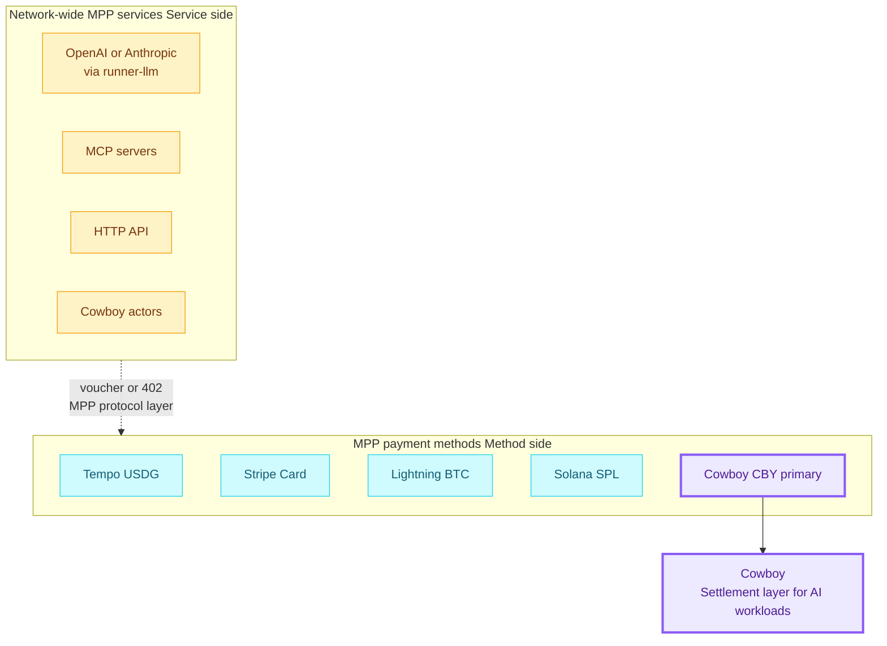

As long as Cowboy's Session Actor is MPP-compatible, any MPP service can pick CBY as a settlement path, and a Cowboy Runner can serve multiple MPP methods at once. This is Cowboy's ticket into the AI economy without having to fight to be the "execution layer".

---

## 8. References

- Protocol: [mpp.dev/overview](https://mpp.dev/overview), [mpp.dev/protocol](https://mpp.dev/protocol), [paymentauth.org](https://paymentauth.org/)
- Tempo: [docs.tempo.xyz/guide/machine-payments](https://docs.tempo.xyz/guide/machine-payments), [docs.tempo.xyz/learn/tempo/machine-payments](https://docs.tempo.xyz/learn/tempo/machine-payments), [Tempo CLI wallet](https://docs.tempo.xyz/cli/wallet), [tempoxyz/wallet](https://github.com/tempoxyz/wallet)
- Write-ups: [Cloudflare Agents MPP](https://developers.cloudflare.com/agents/agentic-payments/mpp/), [Stripe blog](https://stripe.com/blog/machine-payments-protocol), [Privy blog](https://privy.io/blog/building-on-privy-with-tempo-machine-payments-protocol), [Formo blog](https://formo.so/blog/mpp-machine-payments-protocol-explained), [Visa announcement](https://corporate.visa.com/en/sites/visa-perspectives/innovation/visa-card-specification-sdk-for-machine-payments-protocol.html), [Apify blog](https://blog.apify.com/machine-payments-protocol-overview/), [QuickNode docs](https://www.quicknode.com/docs/build-with-ai/mpp-payments), [GetBlock blog](https://getblock.io/blog/what-is-a-machine-payments-protocol-mpp/)
- SDKs: [wevm/mppx](https://github.com/wevm/mppx), [tempoxyz/mpp-rs](https://github.com/tempoxyz/mpp-rs), [mpp.dev/sdk/python](https://mpp.dev/sdk/python), [solana-foundation/mpp-sdk](https://github.com/solana-foundation/mpp-sdk), [stellar/stellar-mpp-sdk](https://github.com/stellar/stellar-mpp-sdk), [starc007/mppx-proxy](https://github.com/starc007/mppx-proxy)
- Cowboy today (key files):
  - `node/runner/src/types.rs:16-38, 100-117, 220-227, 243-257, 589-625`
  - `node/execution/src/runner/dispatcher.rs:35-37, 515-533, 925-1010`
  - `node/execution/src/runner/verifier.rs:31-84, 87-251, 317-418`
  - `node/execution/src/runner/registry.rs:64-81`
  - `runner/src/main.rs:1-163`
  - `refs/cips/cip-2-offchain-compute.md`, `refs/cips/cip-7-simple-stream-protocol.md`, `refs/cips/cip-3-fee-model.md`, `refs/cips/cip-23-tee-execution.md`
