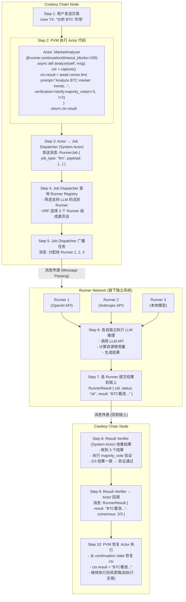
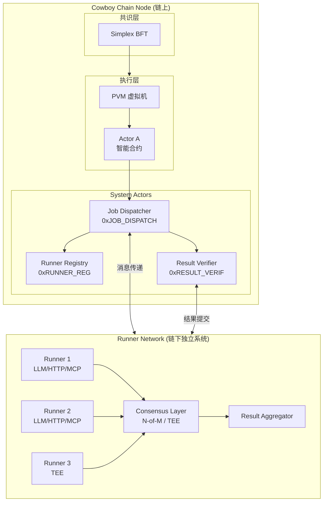
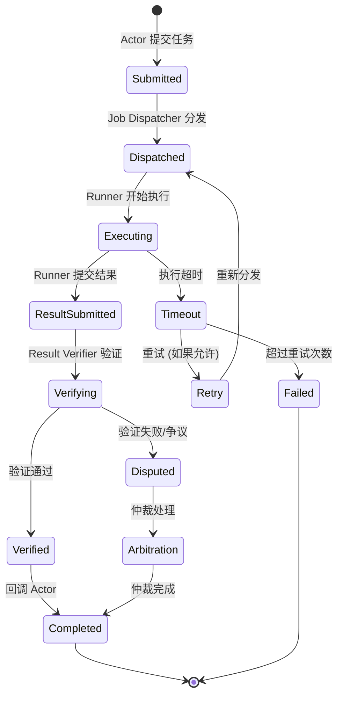
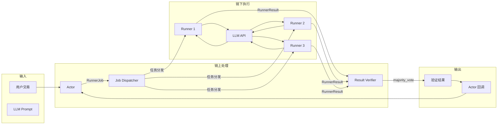

# Node、Actor、Runner 调用流程详解

本文档通过一个实际案例（LLM 市场分析）详细说明 Node、Actor、Runner 之间的完整调用流程。

---

## 系统角色说明

| 角色 | 位置 | 职责 |
|------|------|------|
| **Node** | 链上 | 运行共识（Simplex BFT）、执行交易、管理状态 |
| **Actor** | 链上（PVM 中执行） | 用户编写的智能合约，调用 Runner 执行任务 |
| **System Actors** | 链上 | Runner Registry、Job Dispatcher、Result Verifier |
| **Runner** | 链下（独立进程） | 执行 LLM/HTTP/MCP 等计算任务，完全独立于 Node |

---

┌─────────────────────────────────────────────────────────────────────────┐
│                           Cowboy Chain Node                              │
│                                                                          │
│  ┌─────────────────────────────────────────────────────────────────┐   │
│  │  Step 1: 用户发送交易                                            │   │
│  │  User TX: "分析 BTC 市场"                                        │   │
│  └──────────────────────────┬──────────────────────────────────────┘   │
│                              │                                           │
│                              ▼                                           │
│  ┌─────────────────────────────────────────────────────────────────┐   │
│  │  Step 2: PVM 执行 Actor 代码                                     │   │
│  │  ┌──────────────────────────────────────────────────────────┐  │   │
│  │  │  Actor: MarketAnalyzer                                    │  │   │
│  │  │  @runner.continuation(timeout_blocks=100)                 │  │   │
│  │  │  async def analyze(self, msg):                            │  │   │
│  │  │      ctx = capture()                                      │  │   │
│  │  │      ctx.result = await runner.llm(                       │  │   │
│  │  │          prompt="Analyze BTC market trends...",           │  │   │
│  │  │          verification=Verify.majority_vote(n=3, t=2)      │  │   │
│  │  │      )                                                     │  │   │
│  │  │      return ctx.result                                     │  │   │
│  │  └──────────────────────────────────────────────────────────┘  │   │
│  └──────────────────────────┬──────────────────────────────────────┘   │
│                              │                                           │
│                              ▼                                           │
│  ┌─────────────────────────────────────────────────────────────────┐   │
│  │  Step 3: Actor → Job Dispatcher (System Actor)                   │   │
│  │  发送消息: RunnerJob { job_type: "llm", payload: {...} }         │   │
│  └──────────────────────────┬──────────────────────────────────────┘   │
│                              │                                           │
│                              ▼                                           │
│  ┌─────────────────────────────────────────────────────────────────┐   │
│  │  Step 4: Job Dispatcher 查询 Runner Registry                     │   │
│  │  - 筛选支持 LLM 的活跃 Runner                                     │   │
│  │  - VRF 选择 3 个 Runner 组成委员会                                │   │
│  └──────────────────────────┬──────────────────────────────────────┘   │
│                              │                                           │
│                              ▼                                           │
│  ┌─────────────────────────────────────────────────────────────────┐   │
│  │  Step 5: Job Dispatcher 广播任务                                  │   │
│  │  消息: 分配给 Runner 1, 2, 3                                      │   │
│  └──────────────────────────┬──────────────────────────────────────┘   │
│                              │                                           │
└──────────────────────────────┼───────────────────────────────────────────┘
                               │
                               │ 消息传递 (Message Passing)
                               │
┌──────────────────────────────▼───────────────────────────────────────────┐
│                      Runner Network (链下独立系统)                         │
│                                                                           │
│  ┌─────────────────┐  ┌─────────────────┐  ┌─────────────────┐          │
│  │    Runner 1     │  │    Runner 2     │  │    Runner 3     │          │
│  │  (OpenAI API)   │  │ (Anthropic API) │  │  (本地模型)      │          │
│  └────────┬────────┘  └────────┬────────┘  └────────┬────────┘          │
│           │                    │                    │                    │
│           │  Step 6: 各自独立执行 LLM 推理                                │
│           │  - 调用 LLM API                                              │
│           │  - 计算资源使用量                                             │
│           │  - 生成结果                                                  │
│           │                    │                    │                    │
│           ▼                    ▼                    ▼                    │
│  ┌─────────────────────────────────────────────────────────────────┐    │
│  │  Step 7: 各 Runner 提交结果到链上                                 │    │
│  │  RunnerResult { cid, status: "ok", result: "BTC看涨..." }        │    │
│  └──────────────────────────┬──────────────────────────────────────┘    │
│                              │                                           │
└──────────────────────────────┼───────────────────────────────────────────┘
                               │
                               │ 消息传递 (回到链上)
                               │
┌──────────────────────────────▼───────────────────────────────────────────┐
│                           Cowboy Chain Node                              │
│                                                                          │
│  ┌─────────────────────────────────────────────────────────────────┐   │
│  │  Step 8: Result Verifier (System Actor) 收集结果                  │   │
│  │  - 收到 3 个结果                                                  │   │
│  │  - 执行 majority_vote 验证                                        │   │
│  │  - 2/3 结果一致 → 验证通过                                         │   │
│  └──────────────────────────┬──────────────────────────────────────┘   │
│                              │                                           │
│                              ▼                                           │
│  ┌─────────────────────────────────────────────────────────────────┐   │
│  │  Step 9: Result Verifier → Actor 回调                            │   │
│  │  消息: RunnerResult { result: "BTC看涨...", consensus: 2/3 }      │   │
│  └──────────────────────────┬──────────────────────────────────────┘   │
│                              │                                           │
│                              ▼                                           │
│  ┌─────────────────────────────────────────────────────────────────┐   │
│  │  Step 10: PVM 恢复 Actor 执行                                     │   │
│  │  - 从 continuation state 恢复 ctx                                 │   │
│  │  - ctx.result = "BTC看涨..."                                      │   │
│  │  - 继续执行后续逻辑（如执行交易）                                    │   │
│  └─────────────────────────────────────────────────────────────────┘   │
│                                                                          │
└──────────────────────────────────────────────────────────────────────────┘

### 流程图 (Mermaid 版本)



---

## 完整调用流程图

```mermaid
sequenceDiagram
    participant User as 用户
    participant Node as Cowboy Node
    participant PVM as PVM (虚拟机)
    participant Actor as Actor (智能合约)
    participant JD as Job Dispatcher
    participant RR as Runner Registry
    participant R1 as Runner 1
    participant R2 as Runner 2
    participant R3 as Runner 3
    participant RV as Result Verifier

    %% Step 1-2: 用户触发 Actor
    User->>Node: 发送交易: "分析 BTC 市场"
    Node->>PVM: 执行交易
    PVM->>Actor: 调用 analyze() 方法

    %% Step 3: Actor 发送任务
    Actor->>JD: 发送 RunnerJob<br/>{job_type: "llm", prompt: "..."}

    %% Step 4: 查询可用 Runner
    JD->>RR: 查询支持 LLM 的活跃 Runner
    RR-->>JD: 返回候选 Runner 列表

    %% Step 5: VRF 选择并广播任务
    Note over JD: VRF 选择 3 个 Runner
    JD->>R1: 分配任务
    JD->>R2: 分配任务
    JD->>R3: 分配任务

    %% Step 6: Runner 独立执行
    Note over R1,R3: 链下独立执行 (不依赖 Node)
    R1->>R1: 调用 OpenAI API
    R2->>R2: 调用 Anthropic API
    R3->>R3: 本地模型推理

    %% Step 7: 提交结果
    R1->>RV: 提交结果: "BTC 看涨..."
    R2->>RV: 提交结果: "BTC 看涨..."
    R3->>RV: 提交结果: "BTC 看跌..."

    %% Step 8: 验证结果
    Note over RV: majority_vote 验证<br/>2/3 一致 → 通过

    %% Step 9-10: 回调 Actor
    RV->>Actor: 回调: 验证通过的结果
    Actor->>PVM: 恢复执行 (从 await 后继续)
    PVM->>Node: 执行完成
    Node-->>User: 返回结果
```

---

## 系统架构图



---

## 详细步骤说明

### Step 1-2: 用户触发 Actor

```python
# 用户发送交易，触发 Actor 的 analyze 方法
# Actor 代码在 PVM 中执行

@runner.continuation(timeout_blocks=100)
async def analyze(self, msg):
    ctx = capture()  # 捕获需要跨块保存的上下文
    
    ctx.result = await runner.llm(
        prompt="Analyze BTC market trends for the next 24 hours",
        verification=Verify.builder()
            .mode("majority_vote")
            .runners(3)
            .threshold(2)
            .build(),
        max_price=1000000000000000000,  # 1 CBY
        timeout_blocks=100,
    )
    
    # 这里会暂停，等待 Runner 结果返回
    return ctx.result
```

### Step 3-5: 链上任务分发

```rust
// Job Dispatcher (System Actor) 处理任务

// 1. 查询 Runner Registry，获取支持 LLM 的活跃 Runner
let candidates = registry.get_active_runners(RunnerFilter {
    job_types: vec![JobType::Llm],
    health: HealthStatus::Healthy,
    min_reputation: 50,
});

// 2. VRF 确定性选择 3 个 Runner
let vrf_seed = generate_vrf_seed(&job_spec, current_block);
let committee = vrf_select(&candidates, 3, &vrf_seed);

// 3. 广播任务给选中的 Runner
for runner in committee {
    send_message(runner.address, RunnerJob {
        job_id: job_spec.job_id,
        job_type: JobType::Llm,
        payload: job_spec.params,
        timeout_block: current_block + 100,
    });
}
```

### Step 6: Runner 执行（链下独立）

```rust
// Runner 节点（独立进程，不在 Node 内部）

impl LlmExecutor for Runner {
    async fn execute(&self, job: &RunnerJob) -> Result<JobResult> {
        // 调用 LLM API（如 OpenAI）
        let response = self.openai_client
            .chat_completion(ChatRequest {
                model: "gpt-4",
                messages: vec![Message::user(job.payload.prompt.clone())],
                max_tokens: job.payload.max_tokens,
            })
            .await?;
        
        // 计算资源使用
        let usage = ResourceUsage {
            input_tokens: response.usage.prompt_tokens,
            output_tokens: response.usage.completion_tokens,
        };
        
        Ok(JobResult {
            data: response.content,
            usage,
            timestamp: SystemTime::now(),
        })
    }
}
```

### Step 7-8: 结果验证

```rust
// Result Verifier (System Actor) 验证结果

fn verify_majority_vote(&self, job_spec: &JobSpec, results: Vec<RunnerResult>) {
    // 统计投票
    let mut vote_counts: HashMap<String, u32> = HashMap::new();
    for result in &results {
        let key = hash(&result.data);
        *vote_counts.entry(key).or_insert(0) += 1;
    }
    
    // 找到多数
    let (winning_hash, count) = vote_counts.iter().max_by_key(|(_, c)| *c).unwrap();
    
    // 检查是否达到阈值 (2/3)
    if *count >= job_spec.verification.threshold {
        // 验证通过，回调 Actor
        let final_result = results.iter()
            .find(|r| hash(&r.data) == *winning_hash)
            .unwrap();
        
        send_callback(job_spec.callback, final_result);
    }
}
```

### Step 9-10: Actor 恢复执行

```python
# PVM 恢复 Actor 执行
# 从 continuation state 读取 ctx
# ctx.result 已被填充

@runner.continuation(timeout_blocks=100)
async def analyze(self, msg):
    ctx = capture()
    
    ctx.result = await runner.llm(...)  # ← 从这里恢复，result 已有值
    
    # 继续执行后续逻辑
    if "看涨" in ctx.result:
        self.execute_buy_order()
    
    return ctx.result
```

---

## 任务生命周期状态图



---

## 关键交互总结

| 步骤 | 发起方 | 接收方 | 通信方式 | 说明 |
|------|--------|--------|----------|------|
| 1 | 用户 | Node | 交易 | 用户发送 TX 触发 Actor |
| 2 | Node | PVM | 内部调用 | Node 调用 PVM 执行 Actor 代码 |
| 3 | Actor | Job Dispatcher | 消息 | Actor 发送 RunnerJob |
| 4 | Job Dispatcher | Runner Registry | 查询 | 获取可用 Runner 列表 |
| 5 | Job Dispatcher | Runner Network | 消息 | 广播任务给选中的 Runner |
| 6 | Runner | 外部 API | HTTP | Runner 调用 LLM API |
| 7 | Runner | Result Verifier | 消息 | 提交执行结果 |
| 8 | Result Verifier | - | 内部 | 执行验证逻辑 |
| 9 | Result Verifier | Actor | 回调 | 发送验证后的结果 |
| 10 | Node | PVM | 内部调用 | 恢复 Actor 执行 |

---

## 数据流图



---

## 核心要点

1. **Node** 是基础设施层，负责共识和交易执行
2. **Actor** 运行在 Node 内部的 PVM 中，是链上智能合约
3. **Runner** 是完全独立的链下进程，不依赖 Node 或 PVM
4. **System Actors**（Registry、Dispatcher、Verifier）作为链上中间层协调 Actor 和 Runner
5. 整个流程是**异步的**，Actor 在 `await` 处暂停，等待结果后恢复执行

---

## 相关文档

- [Runner 系统详细设计](./RUNNER_SYSTEM_DESIGN.md)
- [Runner 实施方案](./Runner_Implementation_Plan_CN.md)
- [README](./README.md)

---

*文档创建时间：2026-01-27*
