# Cowboy SDK Development Task Checklist and Weekly Schedule

**Project**: Cowboy SDK and PVM Refinement  
**Document Version**: v3_EN  
**Created Date**: 2025-12-17

---

## Task Checklist Overview

### Module Dependency Diagram

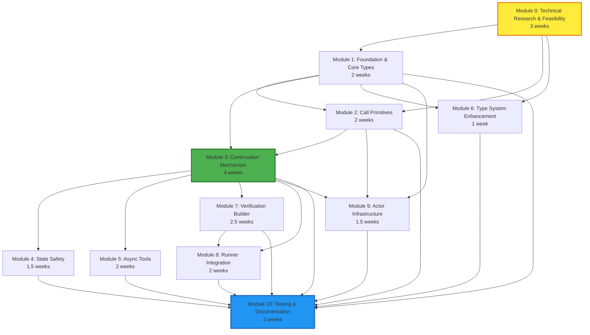

### Development Timeline Gantt Chart

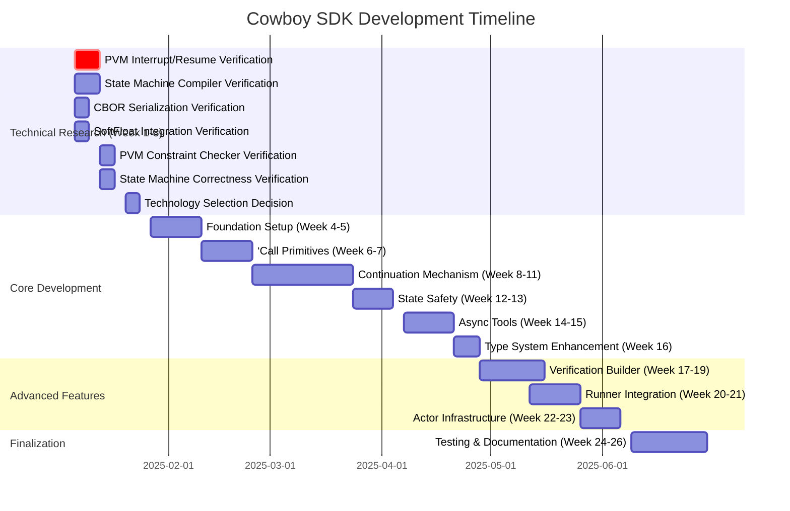

### Module Workload Distribution

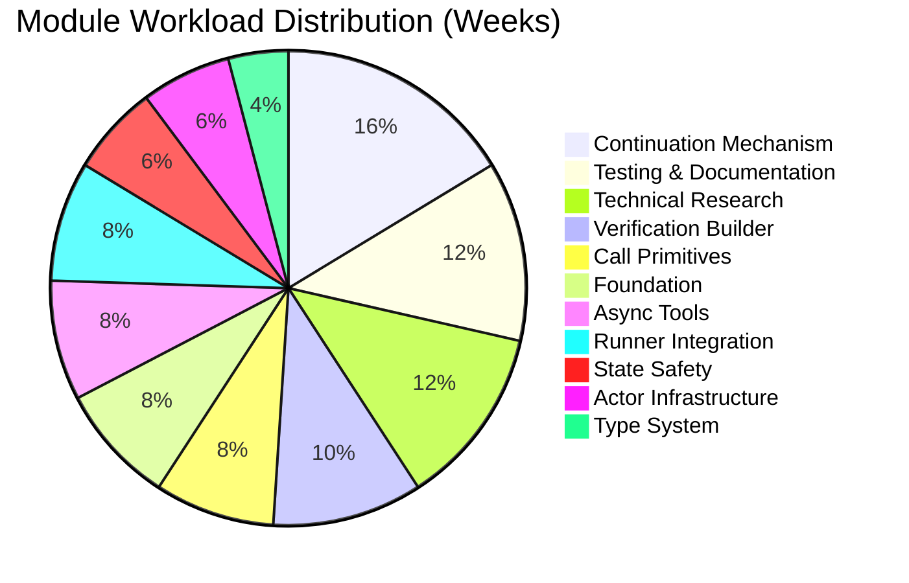

### Key Milestone Timeline

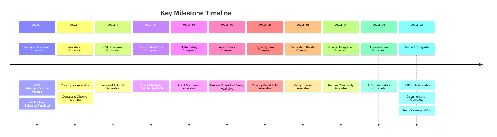

### Task Priority Matrix

| Task Module | Complexity | Importance | Priority | Quadrant |
|-------------|------------|------------|----------|----------|
| PVM Interrupt/Resume | High (0.8) | Critical (0.95) | 🔴 Critical | Q2 |
| Continuation Compiler | Very High (0.9) | Critical (0.9) | 🔴 Critical | Q2 |
| Foundation | Medium (0.4) | Critical (0.9) | 🟠 High Priority | Q1 |
| Call Primitives | Medium-High (0.6) | High (0.85) | 🟠 High Priority | Q1 |
| State Safety | Medium (0.5) | High (0.8) | 🟠 High Priority | Q1 |
| Testing & Docs | Medium (0.5) | High (0.8) | 🟠 High Priority | Q1 |
| Runner Integration | Medium-High (0.6) | Medium-High (0.75) | 🟡 Medium Priority | Q1 |
| Verification Builder | High (0.7) | Medium (0.7) | 🟡 Medium Priority | Q4 |
| Async Tools | Medium (0.5) | Medium (0.7) | 🟡 Medium Priority | Q3 |
| Type System | Low (0.3) | Medium (0.65) | 🟢 Low Priority | Q3 |
| Actor Infrastructure | Medium (0.4) | Medium (0.6) | 🟢 Low Priority | Q3 |

**Quadrant Descriptions**:
- **Quadrant 1 (High Priority)**: Low complexity, high importance - should be completed first
- **Quadrant 2 (Critical Tasks)**: High complexity, high importance - requires focused attention and resources
- **Quadrant 3 (Low Priority)**: Low/medium complexity, low/medium importance - can be deferred
- **Quadrant 4 (Secondary Tasks)**: High complexity, low/medium importance - evaluate necessity

### Task Priority Visualization

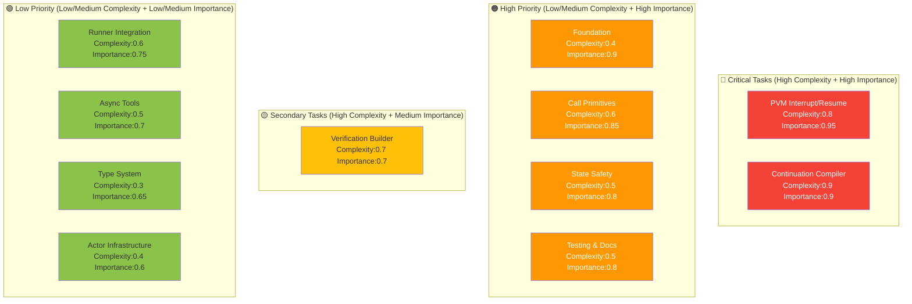

### Technical Research Task Breakdown

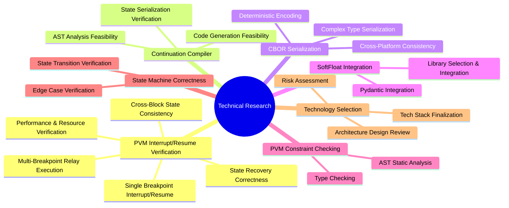

### Development Phase Flowchart

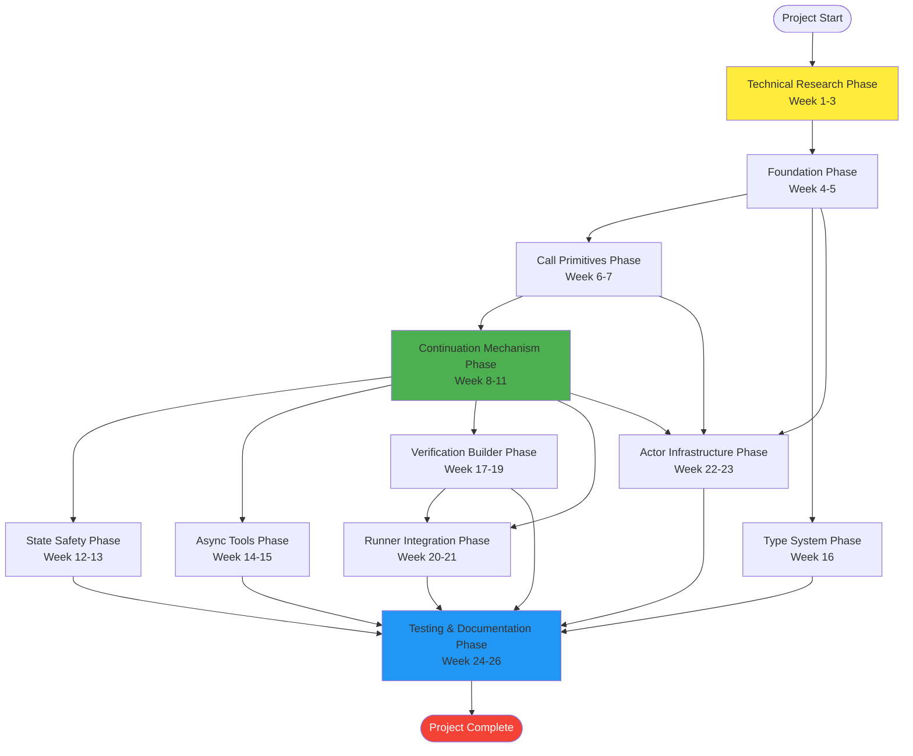

### Risk and Dependency Diagram

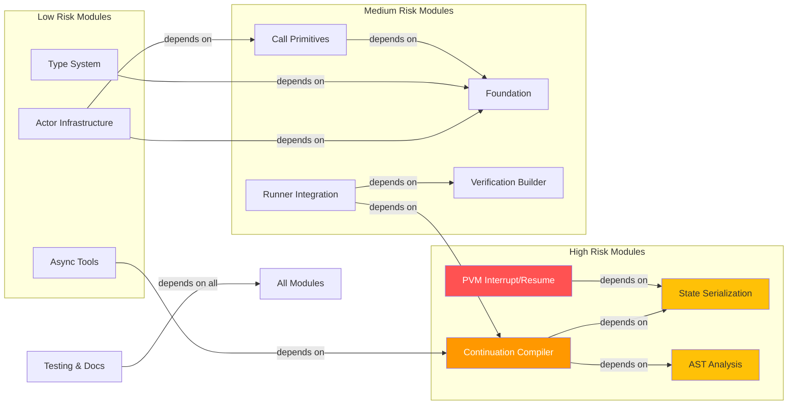

---

## I. Task Checklist (By Module)

### Module 0: Technical Research & Feasibility Verification

#### 0.1 PVM Interrupt and Resume Verification
- [ ] **Single Breakpoint Interrupt/Resume Verification**
  - Verify PVM can correctly interrupt at await points
  - Verify complete execution state can be saved on interrupt (local variables, call stack, continuation state)
  - Verify execution can resume from breakpoint in new block
  - Verify resumed execution results match continuous execution
  - Create minimal prototype: single breakpoint interrupt/resume test
- [ ] **Multi-Breakpoint Relay Execution Verification**
  - Verify functions with multiple await points can interrupt and resume multiple times
  - Verify correct continuation to next await point after each resume
  - Verify state consistency across multiple interrupt/resume cycles
  - Verify state serialization/deserialization correctness after multiple operations
  - Create minimal prototype: multi-breakpoint relay test (3-5 await points)
- [ ] **Cross-Block State Consistency Verification**
  - Verify state remains valid when resuming at different block heights
  - Verify state storage persistence (storage to Actor storage)
  - Verify state cleanup mechanism (correct deletion after completion or timeout)
  - Verify concurrent continuation state isolation (multiple continuations coexisting)
  - Create minimal prototype: cross-block state consistency test
- [ ] **State Recovery Correctness Verification**
  - Verify local variable values are correct on resume
  - Verify control flow is correct on resume (if/else branches, loop state)
  - Verify exception handling state is correct on resume (try/except block state)
  - Verify capture() context is correct on resume
  - Verify guard state validation is correct on resume
  - Create minimal prototype: state recovery correctness test suite
- [ ] **Performance and Resource Verification**
  - Verify interrupt/resume performance overhead (serialization/deserialization time)
  - Verify state storage size (ensure within 64 KiB limit)
  - Verify concurrent continuation count limits (100 active states)
  - Verify state cleanup performance impact
  - Create minimal prototype: performance benchmark test

**Verification Criteria**:
- Can correctly implement single breakpoint interrupt and resume
- Can correctly implement multi-breakpoint relay execution (at least 5 await points)
- Cross-block state consistency maintained
- Resumed execution results exactly match continuous execution
- Performance overhead acceptable (serialization/deserialization < 10ms)
- State storage size within limits

**Estimated Effort**: 1 week

---

#### 0.2 Continuation State Machine Compiler Verification
- [ ] **AST Analysis Feasibility Verification**
  - Verify Python AST library can accurately identify await points in async functions
  - Verify ability to identify await in conditional branches (if/else)
  - Verify ability to identify await in loops
  - Verify ability to identify await in exception handling (try/except)
  - Create minimal prototype: analyze simple async function, output await point list
- [ ] **Code Generation Feasibility Verification**
  - Verify ability to split async function into original function + resume function
  - Verify ability to generate state transition code
  - Verify generated code executes correctly
  - Create minimal prototype: compile a simple function with 2 await points
- [ ] **State Serialization Verification**
  - Verify capture() captured variables can be correctly serialized to CBOR
  - Verify complex object (nested dict, list) serialization
  - Verify deserialized object equivalence to original
  - Create minimal prototype: serialization/deserialization test

**Verification Criteria**: 
- Can successfully analyze async functions containing await
- Can generate executable state machine code
- Serialization/deserialization maintains data integrity

**Estimated Effort**: 1 week

---

#### 0.3 CBOR Deterministic Serialization Verification
- [ ] **Canonical CBOR Implementation Verification**
  - Verify existing CBOR library (cbor2) supports deterministic encoding
  - Verify dictionary key sorting stability
  - Verify cross-platform consistency (x86, ARM)
  - Create minimal prototype: same data generates same bytes on different platforms
- [ ] **Complex Type Serialization Verification**
  - Verify SoftFloat serialization
  - Verify ordered_set serialization
  - Verify nested structure serialization
  - Create minimal prototype: complex object serialization test

**Verification Criteria**:
- Same input generates same output on different platforms
- Serialized data can be correctly deserialized

**Estimated Effort**: 0.5 weeks

---

#### 0.4 SoftFloat Integration Verification
- [ ] **SoftFloat Library Selection and Integration**
  - Research available Python softfloat libraries (pysoftfloat, softfloat-py, etc.)
  - Verify library cross-platform determinism
  - Verify performance overhead (compared to native float)
  - Create minimal prototype: basic operation test
- [ ] **Pydantic Integration Verification**
  - Verify SoftFloat can be integrated into Pydantic models
  - Verify field validation works correctly
  - Verify serialization uses SoftFloat
  - Create minimal prototype: CowboyModel prototype

**Verification Criteria**:
- SoftFloat operations produce consistent results across platforms
- Can integrate well with Pydantic
- Performance overhead acceptable (<10x native float)

**Estimated Effort**: 0.5 weeks

---

#### 0.5 PVM Constraint Checker Verification
- [ ] **AST Static Analysis Verification**
  - Verify ability to detect forbidden imports via AST analysis (time, random, pickle)
  - Verify ability to detect forbidden function calls (sys.exit, os.system, etc.)
  - Verify ability to detect float type usage
  - Create minimal prototype: checker prototype that detects common violations
- [ ] **Type Checking Verification**
  - Verify mypy can detect float type
  - Verify ability to extend mypy checking rules via plugins
  - Create minimal prototype: type checker prototype

**Verification Criteria**:
- Can detect all forbidden operations listed in documentation
- Checker false positive rate <5%

**Estimated Effort**: 0.5 weeks

---

#### 0.6 State Machine Correctness Verification
- [ ] **State Transition Correctness Verification**
  - Create test cases: async functions with conditional branches
  - Verify state machine correctly handles branches
  - Verify state recovery correctness
  - Create minimal prototype: complete state machine test suite
- [ ] **Edge Case Verification**
  - Verify handling of maximum await point count (8)
  - Verify loop limit checking
  - Verify exception handling state serialization
  - Create minimal prototype: edge case test cases

**Verification Criteria**:
- State machine correctly handles all supported patterns
- Edge cases do not cause crashes or errors

**Estimated Effort**: 0.5 weeks

---

#### 0.7 Technology Selection Decision
- [ ] **Technology Stack Finalization**
  - Finalize CBOR library based on verification results
  - Finalize SoftFloat library
  - Finalize AST analysis toolchain
  - Finalize code generation strategy
- [ ] **Architecture Design Review**
  - Review Continuation compiler overall architecture
  - Review state storage solution
  - Review error handling strategy
- [ ] **Risk Assessment and Mitigation**
  - Identify high-risk technical points
  - Develop mitigation plans
  - Determine backup solutions

**Estimated Effort**: 0.5 weeks

**Total Estimated Effort**: 3 weeks (some tasks can be executed in parallel)

---

### Module 1: Foundation and Core Types

#### 1.1 Project Initialization
- [ ] Create project structure (Python packages, module organization)
- [ ] Configure development environment (poetry/pip, pytest, mypy, black)
- [ ] Set up CI/CD pipeline (GitHub Actions)
- [ ] Write basic README and contribution guidelines

#### 1.2 Core Type System
- [ ] Implement `SoftFloat` type (based on softfloat library, deterministic floating point)
- [ ] Implement `ordered_set` type (insertion-order preserving set)
- [ ] Implement `BlockHeight` type (semantic block height)
- [ ] Implement `CowboyModel` base class (inherits Pydantic, adds PVM constraints)
- [ ] Implement CBOR serialization utilities (Canonical CBOR, key sorting)
- [ ] Implement deterministic hash utilities (keccak256 wrapper)

#### 1.3 PVM Constraint Checker
- [ ] Implement AST checker (forbid time, random, pickle imports, etc.)
- [ ] Implement type checker (forbid float, enforce SoftFloat)
- [ ] Implement set auto-converter (set → ordered_set)
- [ ] Implement compile-time verification tools

**Estimated Effort**: 2 weeks

---

### Module 2: Call Primitives

#### 2.1 Synchronous Call `call()`
- [ ] Implement `call()` function (target Actor, method, arguments, cycles_limit)
- [ ] Implement call depth tracking (cumulative up to 32 levels)
- [ ] Implement return value CBOR serialization
- [ ] Implement error handling and rollback propagation
- [ ] Write unit tests (depth limits, serialization, error handling)

#### 2.2 Asynchronous Message `send()`
- [ ] Implement `send()` function (target Actor, message body)
- [ ] Implement message ID generation (keccak256(sender + nonce + target + payload))
- [ ] Implement message queue management (queued by call order)
- [ ] Implement message deduplication mechanism
- [ ] Write unit tests (message ID uniqueness, order guarantees)

#### 2.3 ActorRef Syntactic Sugar
- [ ] Implement `ActorRef` class (address wrapper)
- [ ] Implement method call proxy (`oracle.get_price()` → `call()`)
- [ ] Implement type hint support (IDE completion)
- [ ] Write unit tests (proxy calls, type checking)

#### 2.4 Reentrancy Protection
- [ ] Implement `@reentrancy_guard` decorator
- [ ] Implement lock mechanism (deterministic lock based on keccak256(method + caller))
- [ ] Implement exception safety (finally block unlock)
- [ ] Write unit tests (reentrancy attack protection, lock uniqueness)

**Estimated Effort**: 2 weeks

---

### Module 3: Continuation Mechanism (Core)

#### 3.1 Continuation Decorator Framework
- [ ] Implement `@runner.continuation` decorator
- [ ] Implement `@actor.continuation` decorator
- [ ] Implement decorator parameter parsing (guard_unchanged, timeout_blocks)
- [ ] Implement decorator metadata storage

#### 3.2 State Machine Compiler
- [ ] Implement AST analyzer (identify await points, branches, loops)
- [ ] Implement state number generation (one state per await point)
- [ ] Implement function splitting logic (original function + resume function)
- [ ] Implement state transition code generation
- [ ] Implement conditional branch handling (if/else state branches)
- [ ] Implement exception handling state serialization

#### 3.3 capture() Mechanism
- [ ] Implement `capture()` function (returns context object)
- [ ] Implement context object property access interception
- [ ] Implement cross-await variable capture (auto-serialize to continuation state)
- [ ] Implement context recovery logic (deserialize from continuation state)
- [ ] Write unit tests (variable capture, type checking, CBOR serialization)

#### 3.4 bounded_loop Support
- [ ] Implement `@bounded_loop` decorator
- [ ] Implement loop iteration limit checking
- [ ] Implement state generation for await in loops (unroll to multiple states)
- [ ] Implement LoopBoundExceeded exception
- [ ] Write unit tests (loop unrolling, limit checking)

#### 3.5 Continuation State Storage
- [ ] Implement state storage interface (`__continuation:{correlation_id}`)
- [ ] Implement state serialization (CBOR format)
- [ ] Implement state deserialization
- [ ] Implement state integrity verification (checksum)
- [ ] Implement state cleanup mechanism (delete after completion/timeout)
- [ ] Implement storage quota checking (64 KiB per state, 100 active states)
- [ ] Write unit tests (storage/recovery, quota limits)

#### 3.6 correlation_id Management
- [ ] Implement correlation_id generation (keccak256(actor + method + nonce))
- [ ] Implement correlation_id to continuation mapping
- [ ] Implement timeout timer association (automatic cancellation mechanism)

**Estimated Effort**: 4 weeks

---

### Module 4: State Safety Mechanism

#### 4.1 Decorator-Level Guard
- [ ] Implement `guard_unchanged` parameter parsing
- [ ] Implement state snapshot capture (CBOR serialization + keccak256)
- [ ] Implement state validation on resume (recalculate hash and compare)
- [ ] Implement StateConflictError exception
- [ ] Write unit tests (state change detection, multi-key guard)

#### 4.2 Object-Level Guard
- [ ] Implement `storage.guard()` method
- [ ] Implement `GuardedValue` class (snapshot_hash + value)
- [ ] Implement `.value` access validation logic
- [ ] Implement integration with continuation state
- [ ] Write unit tests (fine-grained guard, lazy validation)

#### 4.3 Guard and Capture Collaboration
- [ ] Implement support for simultaneous use scenarios
- [ ] Write integration tests (complex workflows)

**Estimated Effort**: 1.5 weeks

---

### Module 5: Async Tools

#### 5.1 Timeout Mechanism
- [ ] Implement `timeout_blocks` parameter handling
- [ ] Implement timer ID generation (keccak256(msg_id + "timer"))
- [ ] Implement timeout timer scheduling (call set_timer system Actor)
- [ ] Implement timeout callback handling (RunnerTimeoutError)
- [ ] Implement auto-cleanup (cancel timer when result arrives)
- [ ] Write unit tests (timeout trigger, auto-cleanup)

#### 5.2 Retry Mechanism
- [ ] Implement `Retry` class (max_attempts, backoff strategy)
- [ ] Implement exponential backoff algorithm ([1, 2, 4, 8] block delays)
- [ ] Implement VRF-based jitter (HKDF(VRF_Beacon, actor_addr))
- [ ] Implement retry state tracking
- [ ] Write unit tests (retry logic, deterministic delays)

#### 5.3 TaskGroup Structured Concurrency
- [ ] Implement `TaskGroup` context manager
- [ ] Implement `create_task()` method (create parallel tasks)
- [ ] Implement task creation order tracking (deterministic nonce assignment)
- [ ] Implement result aggregation (return in creation order)
- [ ] Implement wait-for-all-tasks-complete logic
- [ ] Write unit tests (parallel execution, order guarantees)

**Estimated Effort**: 2 weeks

---

### Module 6: Type System Enhancement

#### 6.1 CowboyModel Enhancement
- [ ] Complete `CowboyModel` base class (inherits Pydantic BaseModel)
- [ ] Implement field validation (forbid float, enforce SoftFloat)
- [ ] Implement CBOR serialization support
- [ ] Implement JSON Schema generation (for Runner validation)
- [ ] Write unit tests (model validation, serialization)

#### 6.2 Type Converters
- [ ] Implement float → SoftFloat auto-conversion
- [ ] Implement set → ordered_set auto-conversion
- [ ] Implement type checking decorators
- [ ] Write unit tests (type conversion, checkers)

**Estimated Effort**: 1 week

---

### Module 7: Verification Builder

#### 7.1 Verify Builder Framework
- [ ] Implement `Verify` class
- [ ] Implement `builder()` static method
- [ ] Implement fluent API (.mode(), .runners(), .threshold(), .check())
- [ ] Implement `.build()` method (generate canonical JSON, ordered keys)
- [ ] Write unit tests (builder API, JSON output)

#### 7.2 Verification Mode Implementation
- [ ] Implement `none` mode
- [ ] Implement `economic_bond` mode
- [ ] Implement `majority_vote` mode
- [ ] Implement `structured_match` mode
- [ ] Implement `deterministic` mode
- [ ] Implement `semantic_similarity` mode
- [ ] Write unit tests (each mode configuration generation)

#### 7.3 Built-in Checker Implementation
- [ ] Implement `exact_match()` checker
- [ ] Implement `json_schema_valid()` checker
- [ ] Implement `structured_match()` checker
- [ ] Implement `majority_vote()` checker
- [ ] Implement `numeric_tolerance()` checker
- [ ] Implement `numeric_range()` checker
- [ ] Implement `set_equality()` checker
- [ ] Implement `contains_all()` / `contains_none()` checkers
- [ ] Implement `regex_match()` checker
- [ ] Implement `length_bounds()` checker
- [ ] Implement `semantic_similarity()` checker
- [ ] Implement `no_prompt_leak()` checker
- [ ] Implement `entropy_check()` checker
- [ ] Implement `custom()` checker (custom Actor validator)
- [ ] Write unit tests (each checker configuration)

**Estimated Effort**: 2.5 weeks

---

### Module 8: Runner Integration

#### 8.1 Runner Client
- [ ] Implement `runner.llm()` API (prompt, response_model, verification, etc.)
- [ ] Implement `runner.http()` API (url, method, headers, extraction, etc.)
- [ ] Implement task spec construction (Job Spec JSON generation)
- [ ] Implement task submission logic (send to Runner system Actor)
- [ ] Implement result reception handling (extract result from message)
- [ ] Implement result validation (based on verification mode)
- [ ] Write unit tests (API calls, task spec generation)

#### 8.2 Runner Result Handling
- [ ] Implement result deserialization (JSON → response_model)
- [ ] Implement validation failure handling (RunnerValidationError)
- [ ] Implement timeout handling (RunnerTimeoutError)
- [ ] Implement retry logic integration
- [ ] Write unit tests (result handling, error scenarios)

**Estimated Effort**: 2 weeks

---

### Module 9: Actor Decorators and Infrastructure

#### 9.1 @actor Decorator
- [ ] Implement `@actor` decorator (class decorator)
- [ ] Implement Actor class metadata storage
- [ ] Implement method registration mechanism
- [ ] Implement `@actor.callable` decorator (mark synchronously callable methods)
- [ ] Write unit tests (decorator functionality)

#### 9.2 Storage Interface
- [ ] Implement `storage.get()` / `storage.set()` / `storage.delete()` methods
- [ ] Implement `storage.guard()` method (see Module 4)
- [ ] Implement storage quota checking
- [ ] Write unit tests (storage operations)

#### 9.3 Message Handling Framework
- [ ] Implement message routing (dispatch to handler based on action field)
- [ ] Implement message deduplication (based on message ID)
- [ ] Implement continuation resume routing (auto-call resume function)
- [ ] Write unit tests (message routing, deduplication)

**Estimated Effort**: 1.5 weeks

---

### Module 10: Testing and Documentation

#### 10.1 Unit Tests
- [ ] Write unit tests for all modules (coverage >80%)
- [ ] Implement test utilities (Mock Actor, Mock Runner, test helper functions)
- [ ] Implement determinism test utilities (cross-platform consistency verification)

#### 10.2 Integration Tests
- [ ] Implement end-to-end tests (complete workflows)
- [ ] Implement Continuation state machine tests
- [ ] Implement mixed usage pattern tests (call + send + await)
- [ ] Implement PVM constraint violation tests (ensure correct interception)

#### 10.3 Documentation
- [ ] Write API reference documentation (all public APIs)
- [ ] Write user guide (quick start, common patterns)
- [ ] Write developer guide (internal architecture, extension guide)
- [ ] Write example code (usage examples for each major feature)
- [ ] Write migration guide (migrate from manual message passing to SDK)

#### 10.4 Example Projects
- [ ] Create example Actor projects (TradingBot, PriceOracle, etc.)
- [ ] Create complete workflow examples (mixed use of three primitives)
- [ ] Create best practices examples

**Estimated Effort**: 3 weeks

---

## II. Team Weekly Schedule

### Week 1-3: Technical Research and Feasibility Verification

**Objective**: Verify key technology feasibility, finalize technology selection, reduce development risk

**Note**: Some verification tasks can be parallelized, estimated 3 weeks to complete all verification work

**Team Tasks**:
- **PVM Interrupt and Resume Verification** (Priority):
  - Single breakpoint interrupt/resume verification (interrupt, state save, resume execution)
  - Multi-breakpoint relay execution verification (multiple interrupt/resume, state consistency)
  - Cross-block state consistency verification (persistent storage, state isolation)
  - State recovery correctness verification (local variables, control flow, exception handling state)
  - Performance and resource verification (serialization overhead, storage size, concurrency limits)
  - Create minimal prototype: complete interrupt/resume test suite
- **Continuation State Machine Compiler Verification**:
  - AST analysis feasibility verification (identify await points, branches, loops)
  - Code generation feasibility verification (function splitting, state transition code generation)
  - State serialization verification (capture variable CBOR serialization)
  - Create minimal prototype to verify core flow
- **CBOR Deterministic Serialization Verification**:
  - Verify CBOR library deterministic encoding capability
  - Verify cross-platform consistency (x86, ARM)
  - Verify complex type serialization
- **SoftFloat Integration Verification**:
  - Research and select SoftFloat library
  - Verify cross-platform determinism
  - Verify performance overhead
  - Verify Pydantic integration
- **PVM Constraint Checker Verification**:
  - AST static analysis verification (detect forbidden imports, function calls)
  - Type checking verification (mypy extension)
  - Create checker prototype
- **State Machine Correctness Verification**:
  - State transition correctness verification (conditional branches, exception handling)
  - Edge case verification (max await points, loop limits)
- **Technology Selection Decision**:
  - Finalize tech stack (CBOR library, SoftFloat library, AST tools)
  - Architecture design review
  - Risk assessment and mitigation plans

**Deliverables**:
- Technical verification report (feasibility conclusions, performance data, risk analysis)
- Minimal prototype code (interrupt/resume prototype, Continuation compiler prototype, checker prototype)
- Technology selection document (selected libraries and tools, rationale)
- Architecture design document (interrupt/resume mechanism, Continuation compiler architecture, state storage solution)

**Milestone**: Key technology feasibility verified, technology selection finalized, ready to begin formal development

---

### Week 4-5: Foundation Setup

**Objective**: Establish project foundation, implement core types and constraint checking

**Team Tasks**:
- Project structure setup (Python packages, module organization)
- Development environment configuration (poetry, pytest, mypy, black, CI/CD)
- Core type system implementation (SoftFloat, ordered_set, BlockHeight)
- CBOR serialization utilities (Canonical CBOR, key sorting)
- Deterministic hash utilities (keccak256 wrapper)
- CowboyModel base class implementation (inherits Pydantic, adds PVM constraints)
- PVM constraint checker (AST checking, type checking, set auto-conversion)
- Type converters (float→SoftFloat, set→ordered_set)
- Unit test framework setup
- Basic documentation framework and README

**Milestone**: Core type system available, PVM constraint checker working

---

### Week 6-7: Call Primitives Implementation

**Objective**: Implement call(), send(), and ActorRef

**Team Tasks**:
- `call()` function implementation (target Actor, method, arguments, cycles_limit)
- Call depth tracking (cumulative up to 32 levels)
- Return value CBOR serialization
- Error handling and rollback propagation
- `send()` function implementation (target Actor, message body)
- Message ID generation (keccak256(sender + nonce + target + payload))
- Message queue management (queued by call order)
- Message deduplication mechanism
- `ActorRef` class implementation (address wrapper, method call proxy)
- Type hint support (IDE completion)
- `@reentrancy_guard` decorator implementation
- Lock mechanism implementation (deterministic lock based on keccak256(method + caller))
- Exception safety handling (finally block unlock)
- Unit tests (all features)
- Documentation

**Milestone**: Three call primitives available, basic Actor communication working

---

### Week 8-11: Continuation Mechanism (Core)

**Objective**: Implement Continuation state machine compiler

**Team Tasks**:
- Continuation decorator framework (`@runner.continuation`, `@actor.continuation`)
- Decorator parameter parsing (guard_unchanged, timeout_blocks)
- State machine compiler core:
  - AST analyzer (identify await points, branches, loops)
  - State number generation (one state per await point)
  - Function splitting logic (original function + resume function)
  - State transition code generation
  - Conditional branch handling (if/else state branches)
  - Exception handling state serialization
- `capture()` mechanism implementation:
  - `capture()` function (returns context object)
  - Context object property access interception
  - Cross-await variable capture (auto-serialize to continuation state)
  - Context recovery logic (deserialize from continuation state)
- `@bounded_loop` decorator implementation:
  - Loop iteration limit checking
  - State generation for await in loops (unroll to multiple states)
  - LoopBoundExceeded exception
- Continuation state storage:
  - State storage interface (`__continuation:{correlation_id}`)
  - State serialization/deserialization (CBOR format)
  - State integrity verification (checksum)
  - State cleanup mechanism (delete after completion/timeout)
  - Storage quota checking (64 KiB per state, 100 active states)
- correlation_id management (keccak256(actor + method + nonce))
- Unit tests (all features)
- Documentation

**Milestone**: Continuation mechanism core complete, can compile simple async functions

---

### Week 12-13: State Safety Mechanism

**Objective**: Implement Guard mechanism

**Team Tasks**:
- Decorator-level Guard implementation:
  - `guard_unchanged` parameter parsing
  - State snapshot capture (CBOR serialization + keccak256)
  - State validation on resume (recalculate hash and compare)
  - StateConflictError exception
- Object-level Guard implementation:
  - `storage.guard()` method
  - `GuardedValue` class (snapshot_hash + value)
  - `.value` access validation logic
  - Integration with continuation state
- Guard and Capture collaboration support
- Unit tests (decorator-level, object-level, collaboration scenarios)
- Integration tests
- Documentation

**Milestone**: Guard mechanism available, state safety ensured

---

### Week 14-15: Async Tools

**Objective**: Implement Timeout, Retry, and TaskGroup

**Team Tasks**:
- Timeout mechanism implementation:
  - `timeout_blocks` parameter handling
  - Timer ID generation (keccak256(msg_id + "timer"))
  - Timeout timer scheduling (call set_timer system Actor)
  - Timeout callback handling (RunnerTimeoutError)
  - Auto-cleanup (cancel timer when result arrives)
- Retry mechanism implementation:
  - `Retry` class (max_attempts, backoff strategy)
  - Exponential backoff algorithm ([1, 2, 4, 8] block delays)
  - VRF-based jitter (HKDF(VRF_Beacon, actor_addr))
  - Retry state tracking
- TaskGroup structured concurrency:
  - `TaskGroup` context manager
  - `create_task()` method (create parallel tasks)
  - Task creation order tracking (deterministic nonce assignment)
  - Result aggregation (return in creation order)
  - Wait-for-all-tasks-complete logic
- Unit tests (all features)
- Documentation

**Milestone**: Async tools fully available

---

### Week 16: Type System Enhancement

**Objective**: Complete CowboyModel and type conversion

**Team Tasks**:
- CowboyModel enhancement:
  - Field validation (forbid float, enforce SoftFloat)
  - CBOR serialization support
  - JSON Schema generation (for Runner validation)
- Type converter enhancement:
  - float → SoftFloat auto-conversion
  - set → ordered_set auto-conversion
  - Type checking decorators
- Unit tests (model validation, serialization, type conversion)
- Type system documentation
- Example code
- Integration tests

**Milestone**: Type system fully available

---

### Week 17-19: Verification Builder

**Objective**: Implement Verify builder and all checkers

**Team Tasks**:
- Verify builder framework:
  - `Verify` class
  - `builder()` static method
  - Fluent API (.mode(), .runners(), .threshold(), .check())
  - `.build()` method (generate canonical JSON, ordered keys)
- Verification mode implementation (6 modes):
  - `none` mode
  - `economic_bond` mode
  - `majority_vote` mode
  - `structured_match` mode
  - `deterministic` mode
  - `semantic_similarity` mode
- Built-in checker implementation (13 checkers):
  - `exact_match()`, `json_schema_valid()`, `structured_match()`
  - `majority_vote()`, `numeric_tolerance()`, `numeric_range()`
  - `set_equality()`, `contains_all()`, `contains_none()`
  - `regex_match()`, `length_bounds()`, `semantic_similarity()`
  - `no_prompt_leak()`, `entropy_check()`, `custom()`
- Unit tests (builder API, each mode configuration, each checker)
- Verification builder documentation
- Example code
- Integration tests

**Milestone**: Verification builder fully available

---

### Week 20-21: Runner Integration

**Objective**: Implement Runner client and result handling

**Team Tasks**:
- Runner client framework:
  - Task spec construction (Job Spec JSON generation)
  - Task submission logic (send to Runner system Actor)
- Runner API implementation:
  - `runner.llm()` API (prompt, response_model, verification, etc.)
  - `runner.http()` API (url, method, headers, extraction, etc.)
- Runner result handling:
  - Result reception handling (extract result from message)
  - Result deserialization (JSON → response_model)
  - Result validation (based on verification mode)
  - Validation failure handling (RunnerValidationError)
  - Timeout handling (RunnerTimeoutError)
  - Retry logic integration
- Unit tests (API calls, task spec generation, result handling, error scenarios)
- Runner integration documentation
- Example code
- End-to-end tests

**Milestone**: Runner integration fully available

---

### Week 22-23: Actor Infrastructure

**Objective**: Complete Actor decorators and message handling

**Team Tasks**:
- Actor decorators:
  - `@actor` decorator enhancement (class decorator)
  - Actor class metadata storage
  - Method registration mechanism
  - `@actor.callable` decorator (mark synchronously callable methods)
- Storage interface:
  - `storage.get()` / `storage.set()` / `storage.delete()` methods
  - Storage quota checking
- Message handling framework:
  - Message routing (dispatch to handler based on action field)
  - Message deduplication (based on message ID)
  - Continuation resume routing (auto-call resume function)
- Unit tests (decorator functionality, storage operations, message routing, deduplication)
- Actor infrastructure documentation
- Example code
- Integration tests

**Milestone**: Actor infrastructure fully available

---

### Week 24-26: Testing and Documentation

**Objective**: Complete test coverage and documentation

**Team Tasks**:
- Test completion:
  - Supplement unit tests for all modules (coverage >80%)
  - Test utility enhancement (Mock Actor, Mock Runner, test helper functions)
  - Determinism test utilities (cross-platform consistency verification)
  - Integration test development (end-to-end tests, complete workflows)
  - Continuation state machine tests
  - Mixed usage pattern tests (call + send + await)
  - PVM constraint violation tests (ensure correct interception)
  - Performance tests (critical path performance benchmarks)
  - Raise test coverage to >85%
- Documentation:
  - API reference documentation (all public APIs)
  - User guide (quick start, common patterns)
  - Developer guide (internal architecture, extension guide)
  - Example code (usage examples for each major feature)
  - Migration guide (migrate from manual message passing to SDK)
- Example projects:
  - Create example Actor projects (TradingBot, PriceOracle, etc.)
  - Create complete workflow examples (mixed use of three primitives)
  - Create best practices examples

**Milestone**: SDK fully available, documentation complete, test coverage >85%

---

## III. Key Milestones

| Week | Milestone | Deliverables |
|------|-----------|--------------|
| 3 | Technical Research Complete | Key technology feasibility verified (incl. PVM interrupt/resume), technology selection finalized, architecture design complete |
| 5 | Foundation Complete | Core types, constraint checker available |
| 7 | Call Primitives Complete | call(), send(), ActorRef available |
| 11 | Continuation Core Complete | State machine compiler available, can compile simple async functions |
| 13 | State Safety Complete | Guard mechanism available |
| 15 | Async Tools Complete | Timeout, Retry, TaskGroup available |
| 16 | Type System Complete | CowboyModel fully available |
| 19 | Verification Builder Complete | Verify builder and all checkers available |
| 21 | Runner Integration Complete | Runner client fully available |
| 23 | Infrastructure Complete | Actor decorators and message handling complete |
| 26 | Project Complete | SDK fully available, documentation complete, test coverage >85% |

---

## IV. Risks and Dependencies

### Technical Risks
1. **State Machine Compiler Complexity**: Continuation mechanism is core, requires thorough design
   - **Mitigation**: Week 1-3 conduct technical research, verify AST analysis and code generation feasibility, create minimal prototype; Week 8-11 focused development
2. **PVM Interrupt and Resume**: Need to correctly resume after PVM execution interrupt, involves state serialization and cross-block execution
   - **Mitigation**: Week 1-3 verify PVM interrupt/resume mechanism feasibility, including single breakpoint, multi-breakpoint relay execution, cross-block state consistency; create complete interrupt/resume prototype; Week 8-11 implementation references verification results
3. **PVM Constraint Checking**: Requires deep understanding of Python AST
   - **Mitigation**: Week 1-3 verify AST static analysis and mypy extension feasibility; use existing tools (ast, mypy), Week 4-5 establish foundation
4. **CBOR Serialization**: Must ensure Canonical format
   - **Mitigation**: Week 1-3 verify CBOR library deterministic encoding capability and cross-platform consistency; use mature library (cbor2), Week 4-5 verification
5. **SoftFloat Integration**: Need to find suitable library and verify performance
   - **Mitigation**: Week 1-3 research and verify SoftFloat library, evaluate performance overhead; Week 4-5 complete integration
6. **State Serialization Complexity**: capture() variables may contain complex objects
   - **Mitigation**: Week 1-3 verify complex object CBOR serialization feasibility; Week 8-11 implementation references verification results

### Dependencies
- **Module 0 (Technical Research)**: Foundation for all subsequent modules, must be completed before formal development
- Module 1 (Foundation) depends on Module 0 (technology selection finalized)
- Module 2 (Call Primitives) depends on Module 1 (Foundation)
- Module 3 (Continuation) depends on Module 0 (compiler feasibility verification), Module 1, and Module 2
- Module 4 (State Safety) depends on Module 3
- Module 5 (Async Tools) depends on Module 3
- Module 6 (Type System) depends on Module 0 (SoftFloat verification), Module 1
- Module 7 (Verification Builder) can be developed in parallel
- Module 8 (Runner Integration) depends on Module 3 and Module 7

---

## V. Task Checklist Summary

### Module Task Statistics

| Module | Module Name | Sub-modules | Main Tasks | Estimated Effort | Priority | Risk Level |
|--------|-------------|-------------|------------|------------------|----------|------------|
| 0 | Technical Research & Feasibility | 7 | 35+ | 3 weeks | Highest | High |
| 1 | Foundation & Core Types | 3 | 15+ | 2 weeks | High | Medium |
| 2 | Call Primitives | 4 | 20+ | 2 weeks | High | Medium |
| 3 | Continuation Mechanism | 6 | 30+ | 4 weeks | Highest | High |
| 4 | State Safety | 3 | 12+ | 1.5 weeks | High | Medium |
| 5 | Async Tools | 3 | 15+ | 2 weeks | Medium | Low |
| 6 | Type System Enhancement | 2 | 10+ | 1 week | Medium | Low |
| 7 | Verification Builder | 3 | 20+ | 2.5 weeks | Medium | Low |
| 8 | Runner Integration | 2 | 12+ | 2 weeks | High | Medium |
| 9 | Actor Infrastructure | 3 | 12+ | 1.5 weeks | Medium | Low |
| 10 | Testing & Documentation | 4 | 25+ | 3 weeks | High | Low |
| **Total** | **11 Modules** | **40** | **200+** | **26 weeks** | - | - |

*Note: Module effort sum is 24.5 weeks; actual project duration is 26 weeks (fractional weeks rounded up in scheduling)*

### Technical Research Task Checklist

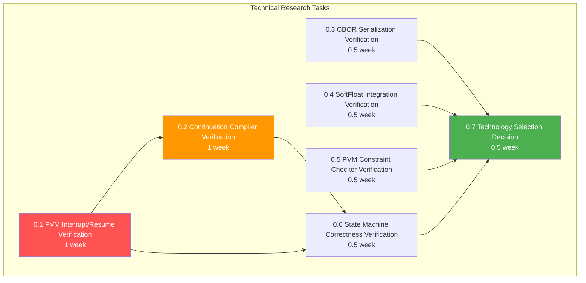

### Development Phase Task Checklist

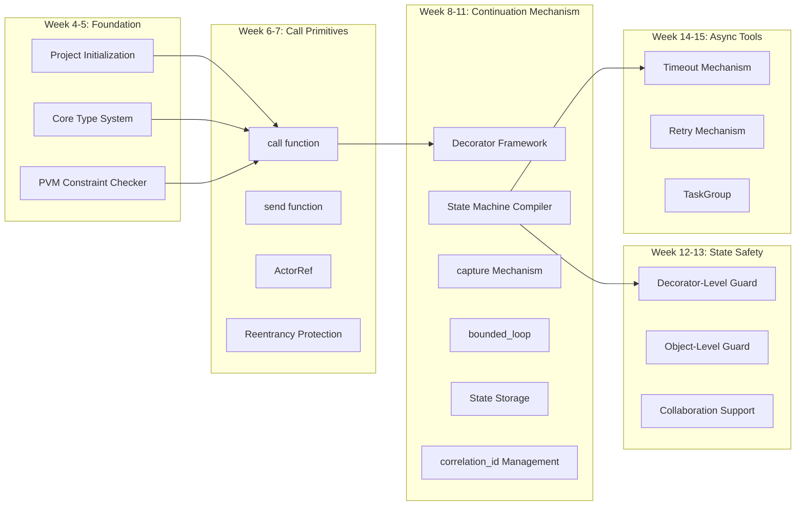

### Complete Task Checklist Tree

```mermaid
graph TD
    Root[Cowboy SDK Development] --> M0[Module 0: Technical Research<br/>3 weeks]
    Root --> M1[Module 1: Foundation<br/>2 weeks]
    Root --> M2[Module 2: Call Primitives<br/>2 weeks]
    Root --> M3[Module 3: Continuation<br/>4 weeks]
    Root --> M4[Module 4: State Safety<br/>1.5 weeks]
    Root --> M5[Module 5: Async Tools<br/>2 weeks]
    Root --> M6[Module 6: Type System<br/>1 week]
    Root --> M7[Module 7: Verification Builder<br/>2.5 weeks]
    Root --> M8[Module 8: Runner Integration<br/>2 weeks]
    Root --> M9[Module 9: Actor Infrastructure<br/>1.5 weeks]
    Root --> M10[Module 10: Testing & Docs<br/>3 weeks]
    
    M0 --> M0_1[0.1 PVM Interrupt/Resume]
    M0 --> M0_2[0.2 Compiler Verification]
    M0 --> M0_3[0.3 CBOR Verification]
    M0 --> M0_4[0.4 SoftFloat]
    M0 --> M0_5[0.5 Constraint Checking]
    M0 --> M0_6[0.6 Correctness Verification]
    M0 --> M0_7[0.7 Technology Selection]
    
    M1 --> M1_1[1.1 Project Initialization]
    M1 --> M1_2[1.2 Core Types]
    M1 --> M1_3[1.3 Constraint Checker]
    
    M2 --> M2_1[2.1 call function]
    M2 --> M2_2[2.2 send function]
    M2 --> M2_3[2.3 ActorRef]
    M2 --> M2_4[2.4 Reentrancy Protection]
    
    M3 --> M3_1[3.1 Decorator Framework]
    M3 --> M3_2[3.2 State Machine Compiler]
    M3 --> M3_3[3.3 capture Mechanism]
    M3 --> M3_4[3.4 bounded_loop]
    M3 --> M3_5[3.5 State Storage]
    M3 --> M3_6[3.6 correlation_id]
    
    M4 --> M4_1[4.1 Guard Decorator]
    M4 --> M4_2[4.2 Guard Object]
    M4 --> M4_3[4.3 Collaboration Support]
    
    M5 --> M5_1[5.1 Timeout]
    M5 --> M5_2[5.2 Retry]
    M5 --> M5_3[5.3 TaskGroup]
    
    M6 --> M6_1[6.1 CowboyModel]
    M6 --> M6_2[6.2 Type Converters]
    
    M7 --> M7_1[7.1 Builder Framework]
    M7 --> M7_2[7.2 Verification Modes]
    M7 --> M7_3[7.3 Checkers]
    
    M8 --> M8_1[8.1 Runner Client]
    M8 --> M8_2[8.2 Result Handling]
    
    M9 --> M9_1[9.1 @actor Decorator]
    M9 --> M9_2[9.2 Storage Interface]
    M9 --> M9_3[9.3 Message Handling]
    
    M10 --> M10_1[10.1 Unit Tests]
    M10 --> M10_2[10.2 Integration Tests]
    M10 --> M10_3[10.3 Documentation]
    M10 --> M10_4[10.4 Example Projects]
    
    style M0 fill:#ffeb3b
    style M3 fill:#4caf50
    style M10 fill:#2196f3
    style M0_1 fill:#ff5252,color:#fff
```

### Task Completion Tracking Table

| Module | Total Tasks | Completed | In Progress | Pending | Completion Rate |
|--------|-------------|-----------|-------------|---------|-----------------|
| Module 0 | 35 | 0 | 0 | 35 | 0% |
| Module 1 | 15 | 0 | 0 | 15 | 0% |
| Module 2 | 20 | 0 | 0 | 20 | 0% |
| Module 3 | 30 | 0 | 0 | 30 | 0% |
| Module 4 | 12 | 0 | 0 | 12 | 0% |
| Module 5 | 15 | 0 | 0 | 15 | 0% |
| Module 6 | 10 | 0 | 0 | 10 | 0% |
| Module 7 | 20 | 0 | 0 | 20 | 0% |
| Module 8 | 12 | 0 | 0 | 12 | 0% |
| Module 9 | 12 | 0 | 0 | 12 | 0% |
| Module 10 | 25 | 0 | 0 | 25 | 0% |
| **Total** | **206** | **0** | **0** | **206** | **0%** |

*Note: This table can be updated in real-time as the project progresses*

---

## VI. Summary

**Total Effort**: 26 weeks (~6.5 months, including 3 weeks technical research)  
**Critical Path**: Technical Research (incl. PVM interrupt/resume verification) → Foundation → Call Primitives → Continuation Mechanism → Other Modules → Testing & Documentation

**Success Criteria**:
1. Technical research complete, key technology feasibility verified (incl. PVM interrupt/resume mechanism), technology selection finalized
2. PVM interrupt and resume mechanism verification passed (single breakpoint, multi-breakpoint relay, cross-block state consistency)
3. All functional modules implemented
4. Test coverage >85%
5. Documentation complete, including user guide and API reference
6. At least 3 complete example projects
7. Pass PVM determinism tests

