# Cowboy SDK 开发任务清单与周计划

**项目**: Cowboy SDK and PVM Refinement  
**文档版本**: v3_EN  
**创建日期**: 2025-12-17

---

## 任务清单概览图

### 模块依赖关系图

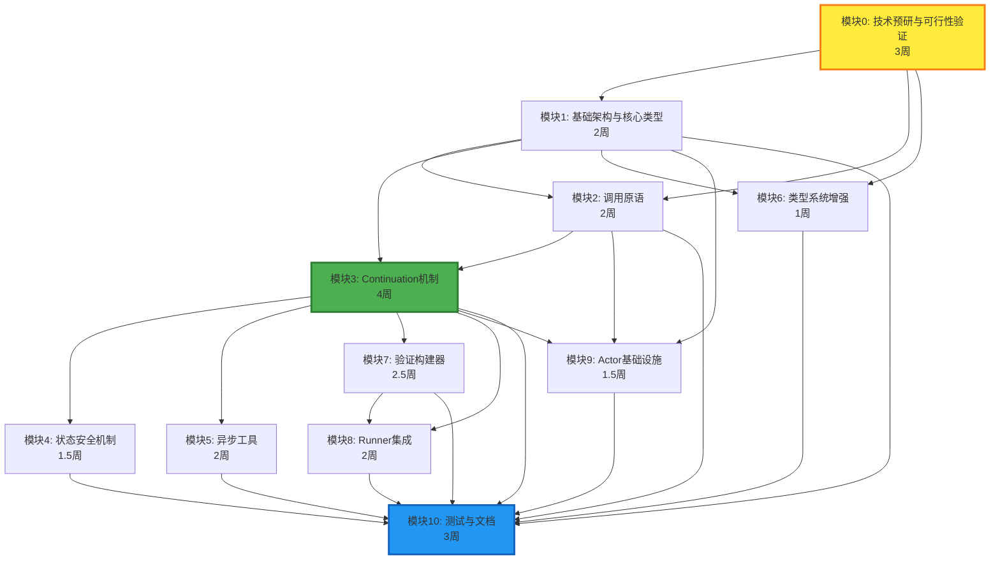

### 开发时间线甘特图

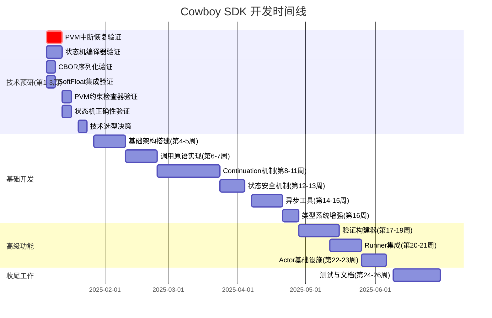

### 模块工作量分布图

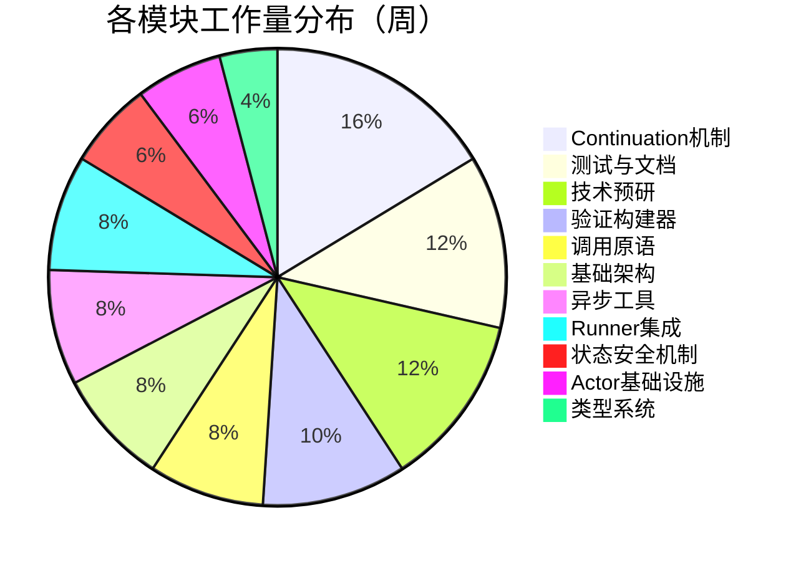

### 关键里程碑时间线

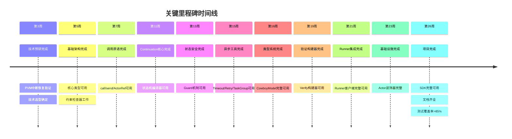

### 任务优先级矩阵

| 任务模块 | 复杂度 | 重要性 | 优先级 | 象限 |
|---------|--------|--------|--------|------|
| PVM中断恢复 | 高 (0.8) | 极高 (0.95) | 🔴 关键任务 | 象限2 |
| Continuation编译器 | 极高 (0.9) | 极高 (0.9) | 🔴 关键任务 | 象限2 |
| 基础架构 | 中 (0.4) | 极高 (0.9) | 🟠 高优先级 | 象限1 |
| 调用原语 | 中高 (0.6) | 高 (0.85) | 🟠 高优先级 | 象限1 |
| 状态安全 | 中 (0.5) | 高 (0.8) | 🟠 高优先级 | 象限1 |
| 测试文档 | 中 (0.5) | 高 (0.8) | 🟠 高优先级 | 象限1 |
| Runner集成 | 中高 (0.6) | 中高 (0.75) | 🟡 中等优先级 | 象限1 |
| 验证构建器 | 高 (0.7) | 中 (0.7) | 🟡 中等优先级 | 象限4 |
| 异步工具 | 中 (0.5) | 中 (0.7) | 🟡 中等优先级 | 象限3 |
| 类型系统 | 低 (0.3) | 中 (0.65) | 🟢 低优先级 | 象限3 |
| Actor基础设施 | 中 (0.4) | 中 (0.6) | 🟢 低优先级 | 象限3 |

**象限说明**:
- **象限1（高优先级）**: 低复杂度、高重要性 - 应优先完成
- **象限2（关键任务）**: 高复杂度、高重要性 - 需要重点关注和资源投入
- **象限3（低优先级）**: 低/中复杂度、低/中重要性 - 可延后处理
- **象限4（次要任务）**: 高复杂度、低/中重要性 - 需要评估是否必要

### 任务优先级可视化图

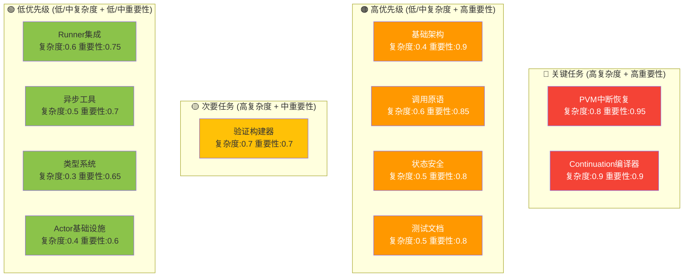

### 技术预研任务分解图

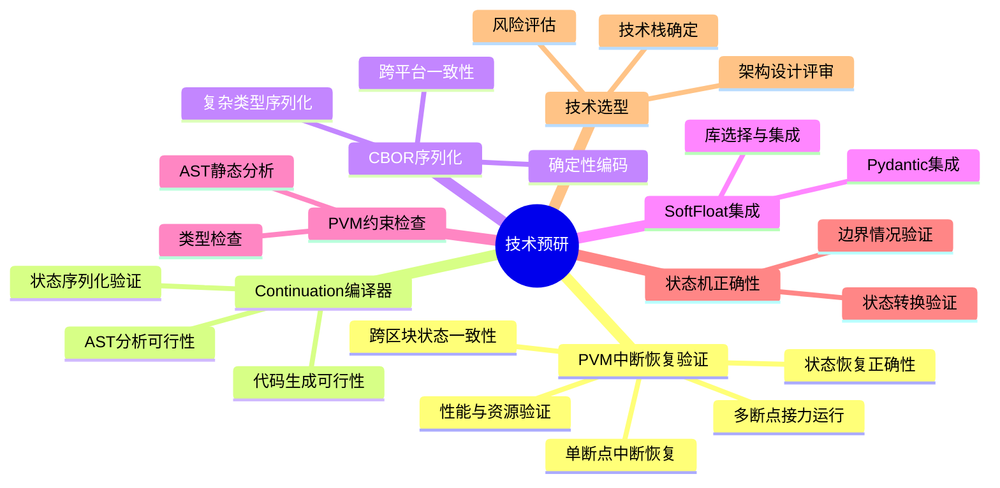

### 开发阶段流程图

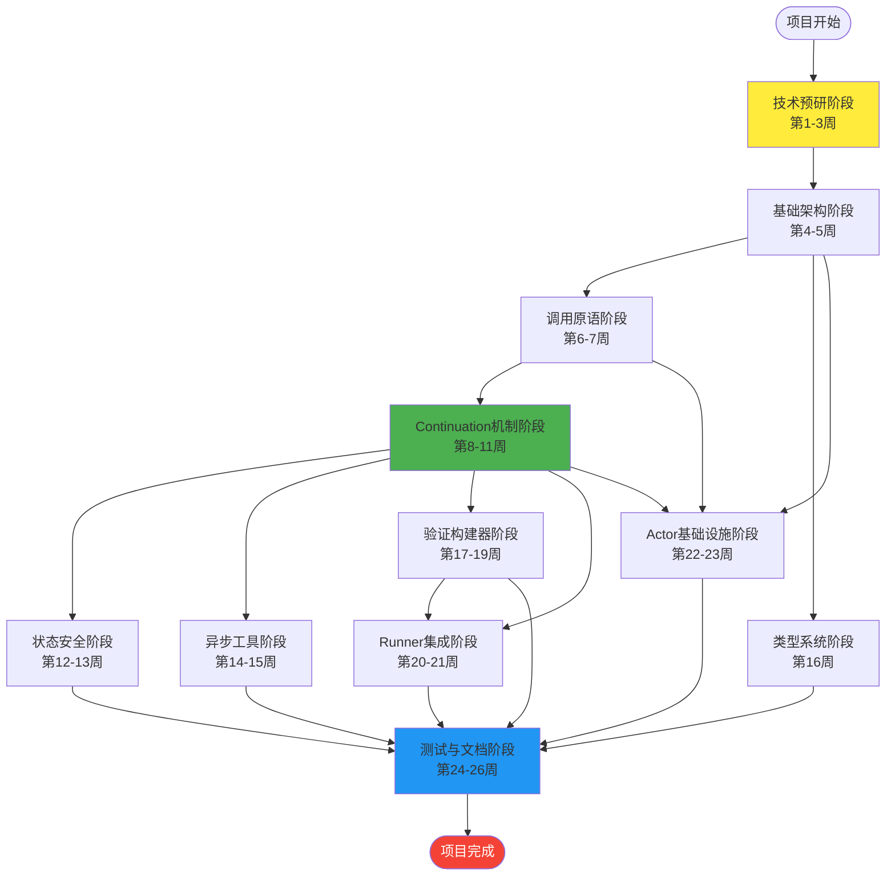

### 风险与依赖关系图

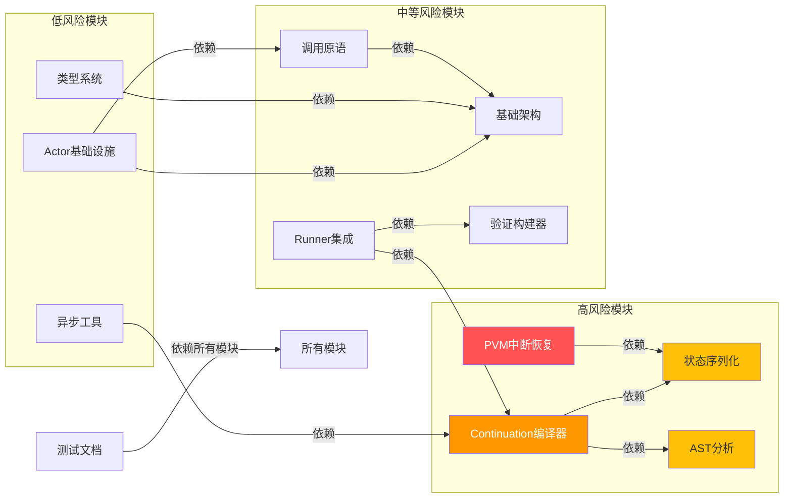

---

## 一、任务清单（按模块细化）

### 模块0: 技术预研与可行性验证 (Technical Feasibility)

#### 0.1 PVM运行中断与恢复验证
- [ ] **单断点中断恢复验证**
  - 验证PVM在执行到await点时能够正确中断
  - 验证中断时能够保存完整执行状态（局部变量、调用栈、continuation state）
  - 验证在新区块中能够从断点恢复执行
  - 验证恢复后的执行结果与连续执行一致
  - 创建最小原型：单断点中断恢复测试
- [ ] **多断点接力运行验证**
  - 验证包含多个await点的函数能够多次中断和恢复
  - 验证每次恢复后能够正确继续到下一个await点
  - 验证状态在多次中断恢复间保持一致性
  - 验证状态序列化/反序列化在多次操作后仍然正确
  - 创建最小原型：多断点接力运行测试（3-5个await点）
- [ ] **跨区块状态一致性验证**
  - 验证在不同区块高度恢复时，状态仍然有效
  - 验证状态存储的持久性（存储到Actor storage）
  - 验证状态清理机制（完成或超时后正确删除）
  - 验证并发continuation的状态隔离（多个continuation同时存在）
  - 创建最小原型：跨区块状态一致性测试
- [ ] **状态恢复正确性验证**
  - 验证恢复时局部变量值正确
  - 验证恢复时控制流正确（if/else分支、循环状态）
  - 验证恢复时异常处理状态正确（try/except块状态）
  - 验证恢复时capture()上下文正确
  - 验证恢复时guard状态验证正确
  - 创建最小原型：状态恢复正确性测试套件
- [ ] **性能与资源验证**
  - 验证中断恢复的性能开销（序列化/反序列化时间）
  - 验证状态存储大小（确保不超过64 KiB限制）
  - 验证并发continuation数量限制（100个活跃状态）
  - 验证状态清理对性能的影响
  - 创建最小原型：性能基准测试

**验证标准**:
- 能够正确实现单断点中断和恢复
- 能够正确实现多断点接力运行（至少5个await点）
- 跨区块状态保持一致性
- 状态恢复后执行结果与连续执行完全一致
- 性能开销可接受（序列化/反序列化 < 10ms）
- 状态存储大小在限制内

**预估工作量**: 1周

---

#### 0.2 Continuation状态机编译器验证
- [ ] **AST分析可行性验证**
  - 验证Python AST库能否准确识别async函数中的await点
  - 验证能否识别条件分支（if/else）中的await
  - 验证能否识别循环中的await
  - 验证能否识别异常处理（try/except）中的await
  - 创建最小原型：分析简单async函数，输出await点列表
- [ ] **代码生成可行性验证**
  - 验证能否将async函数拆分为原始函数+resume函数
  - 验证能否生成状态转换代码
  - 验证生成的代码能否正确执行
  - 创建最小原型：编译一个简单的2个await点的函数
- [ ] **状态序列化验证**
  - 验证capture()捕获的变量能否正确序列化为CBOR
  - 验证复杂对象（嵌套dict、list）的序列化
  - 验证反序列化后的对象是否与原对象等价
  - 创建最小原型：序列化/反序列化测试

**验证标准**: 
- 能够成功分析包含await的async函数
- 能够生成可执行的状态机代码
- 序列化/反序列化保持数据完整性

**预估工作量**: 1周

---

#### 0.3 CBOR确定性序列化验证
- [ ] **Canonical CBOR实现验证**
  - 验证现有CBOR库（cbor2）是否支持确定性编码
  - 验证字典键排序是否稳定
  - 验证跨平台一致性（x86、ARM）
  - 创建最小原型：相同数据在不同平台生成相同字节
- [ ] **复杂类型序列化验证**
  - 验证SoftFloat序列化
  - 验证ordered_set序列化
  - 验证嵌套结构序列化
  - 创建最小原型：复杂对象序列化测试

**验证标准**:
- 相同输入在不同平台生成相同输出
- 序列化后的数据能够正确反序列化

**预估工作量**: 0.5周

---

#### 0.4 SoftFloat集成验证
- [ ] **SoftFloat库选择与集成**
  - 调研可用的Python softfloat库（pysoftfloat、softfloat-py等）
  - 验证库的跨平台确定性
  - 验证性能开销（与原生float对比）
  - 创建最小原型：基本运算测试
- [ ] **Pydantic集成验证**
  - 验证能否将SoftFloat集成到Pydantic模型
  - 验证字段验证是否正常工作
  - 验证序列化是否使用SoftFloat
  - 创建最小原型：CowboyModel原型

**验证标准**:
- SoftFloat运算在不同平台结果一致
- 能够与Pydantic良好集成
- 性能开销可接受（<10x原生float）

**预估工作量**: 0.5周

---

#### 0.5 PVM约束检查器验证
- [ ] **AST静态分析验证**
  - 验证能否通过AST分析检测禁止的导入（time、random、pickle）
  - 验证能否检测禁止的函数调用（sys.exit、os.system等）
  - 验证能否检测float类型使用
  - 创建最小原型：检查器原型，能够检测常见违规
- [ ] **类型检查验证**
  - 验证mypy能否检测float类型
  - 验证能否通过插件扩展mypy检查规则
  - 创建最小原型：类型检查器原型

**验证标准**:
- 能够检测文档中列出的所有禁止操作
- 检查器误报率<5%

**预估工作量**: 0.5周

---

#### 0.6 状态机正确性验证
- [ ] **状态转换正确性验证**
  - 创建测试用例：包含条件分支的async函数
  - 验证状态机能否正确处理分支
  - 验证状态恢复是否正确
  - 创建最小原型：完整的状态机测试套件
- [ ] **边界情况验证**
  - 验证最大await点数量（8个）的处理
  - 验证循环上限检查
  - 验证异常处理状态序列化
  - 创建最小原型：边界测试用例

**验证标准**:
- 状态机能够正确处理所有支持的模式
- 边界情况不会导致崩溃或错误

**预估工作量**: 0.5周

---

#### 0.7 技术选型决策
- [ ] **技术栈最终确定**
  - 基于验证结果确定CBOR库
  - 确定SoftFloat库
  - 确定AST分析工具链
  - 确定代码生成策略
- [ ] **架构设计评审**
  - 评审Continuation编译器的整体架构
  - 评审状态存储方案
  - 评审错误处理策略
- [ ] **风险评估与缓解**
  - 识别高风险技术点
  - 制定缓解方案
  - 确定备选方案

**预估工作量**: 0.5周

**总预估工作量**: 3周（部分任务可并行执行）

---

### 模块1: 基础架构与核心类型 (Foundation)

#### 1.1 项目初始化
- [ ] 创建项目结构（Python包、模块划分）
- [ ] 配置开发环境（poetry/pip、pytest、mypy、black）
- [ ] 设置CI/CD流程（GitHub Actions）
- [ ] 编写基础README和贡献指南

#### 1.2 核心类型系统
- [ ] 实现 `SoftFloat` 类型（基于softfloat库，确定性浮点）
- [ ] 实现 `ordered_set` 类型（插入顺序集合）
- [ ] 实现 `BlockHeight` 类型（语义化区块高度）
- [ ] 实现 `CowboyModel` 基类（继承Pydantic，添加PVM约束）
- [ ] 实现CBOR序列化工具（Canonical CBOR，键排序）
- [ ] 实现确定性哈希工具（keccak256包装）

#### 1.3 PVM约束检查器
- [ ] 实现AST检查器（禁止time、random、pickle等导入）
- [ ] 实现类型检查器（禁止float，强制SoftFloat）
- [ ] 实现set自动转换器（set → ordered_set）
- [ ] 实现编译时验证工具

**预估工作量**: 2周

---

### 模块2: 调用原语 (Call Primitives)

#### 2.1 同步调用 `call()`
- [ ] 实现 `call()` 函数（目标Actor、方法、参数、cycles_limit）
- [ ] 实现调用深度跟踪（累计到32层限制）
- [ ] 实现返回值CBOR序列化
- [ ] 实现错误处理和回滚传播
- [ ] 编写单元测试（深度限制、序列化、错误处理）

#### 2.2 异步消息 `send()`
- [ ] 实现 `send()` 函数（目标Actor、消息体）
- [ ] 实现消息ID生成（keccak256(sender + nonce + target + payload)）
- [ ] 实现消息队列管理（按调用顺序排队）
- [ ] 实现消息去重机制
- [ ] 编写单元测试（消息ID唯一性、顺序保证）

#### 2.3 ActorRef语法糖
- [ ] 实现 `ActorRef` 类（地址封装）
- [ ] 实现方法调用代理（`oracle.get_price()` → `call()`）
- [ ] 实现类型提示支持（IDE补全）
- [ ] 编写单元测试（代理调用、类型检查）

#### 2.4 重入保护
- [ ] 实现 `@reentrancy_guard` 装饰器
- [ ] 实现锁机制（基于keccak256(method + caller)的确定性锁）
- [ ] 实现异常安全（finally块解锁）
- [ ] 编写单元测试（重入攻击防护、锁唯一性）

**预估工作量**: 2周

---

### 模块3: Continuation机制 (核心)

#### 3.1 Continuation装饰器框架
- [ ] 实现 `@runner.continuation` 装饰器
- [ ] 实现 `@actor.continuation` 装饰器
- [ ] 实现装饰器参数解析（guard_unchanged、timeout_blocks）
- [ ] 实现装饰器元数据存储

#### 3.2 状态机编译器
- [ ] 实现AST分析器（识别await点、分支、循环）
- [ ] 实现状态编号生成（每个await点一个状态）
- [ ] 实现函数拆分逻辑（原始函数 + resume函数）
- [ ] 实现状态转换代码生成
- [ ] 实现条件分支处理（if/else状态分支）
- [ ] 实现异常处理状态序列化

#### 3.3 capture()机制
- [ ] 实现 `capture()` 函数（返回上下文对象）
- [ ] 实现上下文对象属性访问拦截
- [ ] 实现跨await变量捕获（自动序列化到continuation state）
- [ ] 实现上下文恢复逻辑（从continuation state反序列化）
- [ ] 编写单元测试（变量捕获、类型检查、CBOR序列化）

#### 3.4 bounded_loop支持
- [ ] 实现 `@bounded_loop` 装饰器
- [ ] 实现循环迭代上限检查
- [ ] 实现循环内await的状态生成（展开为多个状态）
- [ ] 实现LoopBoundExceeded异常
- [ ] 编写单元测试（循环展开、上限检查）

#### 3.5 Continuation状态存储
- [ ] 实现状态存储接口（`__continuation:{correlation_id}`）
- [ ] 实现状态序列化（CBOR格式）
- [ ] 实现状态反序列化
- [ ] 实现状态完整性校验（checksum）
- [ ] 实现状态清理机制（完成/超时后删除）
- [ ] 实现存储配额检查（64 KiB单状态，100个活跃状态）
- [ ] 编写单元测试（存储/恢复、配额限制）

#### 3.6 correlation_id管理
- [ ] 实现correlation_id生成（keccak256(actor + method + nonce)）
- [ ] 实现correlation_id到continuation的映射
- [ ] 实现超时定时器关联（自动取消机制）

**预估工作量**: 4周

---

### 模块4: 状态安全机制 (State Safety)

#### 4.1 Guard装饰器级
- [ ] 实现 `guard_unchanged` 参数解析
- [ ] 实现状态快照捕获（CBOR序列化 + keccak256）
- [ ] 实现恢复时状态验证（重新计算哈希并比较）
- [ ] 实现StateConflictError异常
- [ ] 编写单元测试（状态变更检测、多key守卫）

#### 4.2 Guard对象级
- [ ] 实现 `storage.guard()` 方法
- [ ] 实现 `GuardedValue` 类（snapshot_hash + value）
- [ ] 实现 `.value` 访问时的验证逻辑
- [ ] 实现与continuation state的集成
- [ ] 编写单元测试（精细守卫、延迟验证）

#### 4.3 Guard与Capture协作
- [ ] 实现两者同时使用的场景支持
- [ ] 编写集成测试（复杂工作流）

**预估工作量**: 1.5周

---

### 模块5: 异步工具 (Async Tools)

#### 5.1 Timeout机制
- [ ] 实现 `timeout_blocks` 参数处理
- [ ] 实现定时器ID生成（keccak256(msg_id + "timer")）
- [ ] 实现超时定时器调度（调用set_timer系统Actor）
- [ ] 实现超时回调处理（RunnerTimeoutError）
- [ ] 实现自动清理（结果到达时取消定时器）
- [ ] 编写单元测试（超时触发、自动清理）

#### 5.2 Retry机制
- [ ] 实现 `Retry` 类（max_attempts、backoff策略）
- [ ] 实现指数退避算法（[1, 2, 4, 8] 区块延迟）
- [ ] 实现VRF-based抖动（HKDF(VRF_Beacon, actor_addr)）
- [ ] 实现重试状态跟踪
- [ ] 编写单元测试（重试逻辑、确定性延迟）

#### 5.3 TaskGroup结构化并发
- [ ] 实现 `TaskGroup` 上下文管理器
- [ ] 实现 `create_task()` 方法（创建并行任务）
- [ ] 实现任务创建顺序跟踪（确定性nonce分配）
- [ ] 实现结果聚合（按创建顺序返回）
- [ ] 实现等待所有任务完成逻辑
- [ ] 编写单元测试（并行执行、顺序保证）

**预估工作量**: 2周

---

### 模块6: 类型系统增强 (Type System)

#### 6.1 CowboyModel完善
- [ ] 完善 `CowboyModel` 基类（继承Pydantic BaseModel）
- [ ] 实现字段验证（禁止float，强制SoftFloat）
- [ ] 实现CBOR序列化支持
- [ ] 实现JSON Schema生成（用于Runner验证）
- [ ] 编写单元测试（模型验证、序列化）

#### 6.2 类型转换器
- [ ] 实现float → SoftFloat自动转换
- [ ] 实现set → ordered_set自动转换
- [ ] 实现类型检查装饰器
- [ ] 编写单元测试（类型转换、检查器）

**预估工作量**: 1周

---

### 模块7: 验证构建器 (Verification Builder)

#### 7.1 Verify构建器框架
- [ ] 实现 `Verify` 类
- [ ] 实现 `builder()` 静态方法
- [ ] 实现链式调用API（.mode()、.runners()、.threshold()、.check()）
- [ ] 实现 `.build()` 方法（生成规范JSON，键有序）
- [ ] 编写单元测试（构建器API、JSON输出）

#### 7.2 验证模式实现
- [ ] 实现 `none` 模式
- [ ] 实现 `economic_bond` 模式
- [ ] 实现 `majority_vote` 模式
- [ ] 实现 `structured_match` 模式
- [ ] 实现 `deterministic` 模式
- [ ] 实现 `semantic_similarity` 模式
- [ ] 编写单元测试（各模式配置生成）

#### 7.3 内置检查器实现
- [ ] 实现 `exact_match()` 检查器
- [ ] 实现 `json_schema_valid()` 检查器
- [ ] 实现 `structured_match()` 检查器
- [ ] 实现 `majority_vote()` 检查器
- [ ] 实现 `numeric_tolerance()` 检查器
- [ ] 实现 `numeric_range()` 检查器
- [ ] 实现 `set_equality()` 检查器
- [ ] 实现 `contains_all()` / `contains_none()` 检查器
- [ ] 实现 `regex_match()` 检查器
- [ ] 实现 `length_bounds()` 检查器
- [ ] 实现 `semantic_similarity()` 检查器
- [ ] 实现 `no_prompt_leak()` 检查器
- [ ] 实现 `entropy_check()` 检查器
- [ ] 实现 `custom()` 检查器（自定义Actor验证器）
- [ ] 编写单元测试（各检查器配置）

**预估工作量**: 2.5周

---

### 模块8: Runner集成 (Runner Integration)

#### 8.1 Runner客户端
- [ ] 实现 `runner.llm()` API（prompt、response_model、verification等参数）
- [ ] 实现 `runner.http()` API（url、method、headers、extraction等参数）
- [ ] 实现任务规范构建（Job Spec JSON生成）
- [ ] 实现任务提交逻辑（发送到Runner系统Actor）
- [ ] 实现结果接收处理（从消息中提取结果）
- [ ] 实现结果验证（根据verification模式）
- [ ] 编写单元测试（API调用、任务规范生成）

#### 8.2 Runner结果处理
- [ ] 实现结果反序列化（JSON → response_model）
- [ ] 实现验证失败处理（RunnerValidationError）
- [ ] 实现超时处理（RunnerTimeoutError）
- [ ] 实现重试逻辑集成
- [ ] 编写单元测试（结果处理、错误场景）

**预估工作量**: 2周

---

### 模块9: Actor装饰器与基础设施

#### 9.1 @actor装饰器
- [ ] 实现 `@actor` 装饰器（类装饰器）
- [ ] 实现Actor类元数据存储
- [ ] 实现方法注册机制
- [ ] 实现 `@actor.callable` 装饰器（标记可同步调用方法）
- [ ] 编写单元测试（装饰器功能）

#### 9.2 Storage接口
- [ ] 实现 `storage.get()` / `storage.set()` / `storage.delete()` 方法
- [ ] 实现 `storage.guard()` 方法（见模块4）
- [ ] 实现存储配额检查
- [ ] 编写单元测试（存储操作）

#### 9.3 消息处理框架
- [ ] 实现消息路由（根据action字段分发到对应handler）
- [ ] 实现消息去重（基于message ID）
- [ ] 实现continuation恢复路由（自动调用resume函数）
- [ ] 编写单元测试（消息路由、去重）

**预估工作量**: 1.5周

---

### 模块10: 测试与文档

#### 10.1 单元测试
- [ ] 为所有模块编写单元测试（覆盖率 >80%）
- [ ] 实现测试工具（Mock Actor、Mock Runner、测试辅助函数）
- [ ] 实现确定性测试工具（跨平台一致性验证）

#### 10.2 集成测试
- [ ] 实现端到端测试（完整工作流）
- [ ] 实现Continuation状态机测试
- [ ] 实现混合使用模式测试（call + send + await）
- [ ] 实现PVM约束违反测试（确保被正确拦截）

#### 10.3 文档编写
- [ ] 编写API参考文档（所有公开API）
- [ ] 编写用户指南（快速开始、常见模式）
- [ ] 编写开发者指南（内部架构、扩展指南）
- [ ] 编写示例代码（每个主要功能的使用示例）
- [ ] 编写迁移指南（从手动消息传递迁移到SDK）

#### 10.4 示例项目
- [ ] 创建示例Actor项目（TradingBot、PriceOracle等）
- [ ] 创建完整工作流示例（混合使用三种原语）
- [ ] 创建最佳实践示例

**预估工作量**: 3周

---

## 二、团队周计划

### 第1-3周：技术预研与可行性验证

**目标**: 验证关键技术可行性，确定技术选型，降低开发风险

**说明**: 部分验证任务可以并行进行，预计需要3周时间完成所有验证工作

**团队任务**:
- **PVM运行中断与恢复验证**（优先）:
  - 单断点中断恢复验证（中断、状态保存、恢复执行）
  - 多断点接力运行验证（多次中断恢复、状态一致性）
  - 跨区块状态一致性验证（持久化存储、状态隔离）
  - 状态恢复正确性验证（局部变量、控制流、异常处理状态）
  - 性能与资源验证（序列化开销、存储大小、并发限制）
  - 创建最小原型：完整的中断恢复测试套件
- **Continuation状态机编译器验证**:
  - AST分析可行性验证（识别await点、分支、循环）
  - 代码生成可行性验证（函数拆分、状态转换代码生成）
  - 状态序列化验证（capture变量CBOR序列化）
  - 创建最小原型验证核心流程
- **CBOR确定性序列化验证**:
  - 验证CBOR库的确定性编码能力
  - 验证跨平台一致性（x86、ARM）
  - 验证复杂类型序列化
- **SoftFloat集成验证**:
  - 调研并选择SoftFloat库
  - 验证跨平台确定性
  - 验证性能开销
  - 验证Pydantic集成
- **PVM约束检查器验证**:
  - AST静态分析验证（检测禁止导入、函数调用）
  - 类型检查验证（mypy扩展）
  - 创建检查器原型
- **状态机正确性验证**:
  - 状态转换正确性验证（条件分支、异常处理）
  - 边界情况验证（最大await点、循环上限）
- **技术选型决策**:
  - 确定技术栈（CBOR库、SoftFloat库、AST工具）
  - 架构设计评审
  - 风险评估与缓解方案

**交付物**:
- 技术验证报告（包含可行性结论、性能数据、风险分析）
- 最小原型代码（中断恢复原型、Continuation编译器原型、检查器原型）
- 技术选型文档（确定的库和工具、理由）
- 架构设计文档（中断恢复机制、Continuation编译器架构、状态存储方案）

**里程碑**: 关键技术可行性得到验证，技术选型确定，可以开始正式开发

---

### 第4-5周：基础架构搭建

**目标**: 建立项目基础，实现核心类型和约束检查

**团队任务**:
- 项目结构搭建（Python包、模块划分）
- 开发环境配置（poetry、pytest、mypy、black、CI/CD）
- 核心类型系统实现（SoftFloat、ordered_set、BlockHeight）
- CBOR序列化工具（Canonical CBOR，键排序）
- 确定性哈希工具（keccak256包装）
- CowboyModel基类实现（继承Pydantic，添加PVM约束）
- PVM约束检查器（AST检查、类型检查、set自动转换）
- 类型转换器（float→SoftFloat、set→ordered_set）
- 单元测试框架搭建
- 基础文档框架和README

**里程碑**: 基础类型系统可用，PVM约束检查器工作

---

### 第6-7周：调用原语实现

**目标**: 实现call()、send()和ActorRef

**团队任务**:
- `call()` 函数实现（目标Actor、方法、参数、cycles_limit）
- 调用深度跟踪（累计到32层限制）
- 返回值CBOR序列化
- 错误处理和回滚传播
- `send()` 函数实现（目标Actor、消息体）
- 消息ID生成（keccak256(sender + nonce + target + payload)）
- 消息队列管理（按调用顺序排队）
- 消息去重机制
- `ActorRef` 类实现（地址封装、方法调用代理）
- 类型提示支持（IDE补全）
- `@reentrancy_guard` 装饰器实现
- 锁机制实现（基于keccak256(method + caller)的确定性锁）
- 异常安全处理（finally块解锁）
- 单元测试（所有功能）
- 文档编写

**里程碑**: 三种调用原语可用，基础Actor通信工作

---

### 第8-11周：Continuation机制（核心）

**目标**: 实现Continuation状态机编译器

**团队任务**:
- Continuation装饰器框架（`@runner.continuation`、`@actor.continuation`）
- 装饰器参数解析（guard_unchanged、timeout_blocks）
- 状态机编译器核心：
  - AST分析器（识别await点、分支、循环）
  - 状态编号生成（每个await点一个状态）
  - 函数拆分逻辑（原始函数 + resume函数）
  - 状态转换代码生成
  - 条件分支处理（if/else状态分支）
  - 异常处理状态序列化
- `capture()` 机制实现：
  - `capture()` 函数（返回上下文对象）
  - 上下文对象属性访问拦截
  - 跨await变量捕获（自动序列化到continuation state）
  - 上下文恢复逻辑（从continuation state反序列化）
- `@bounded_loop` 装饰器实现：
  - 循环迭代上限检查
  - 循环内await的状态生成（展开为多个状态）
  - LoopBoundExceeded异常
- Continuation状态存储：
  - 状态存储接口（`__continuation:{correlation_id}`）
  - 状态序列化/反序列化（CBOR格式）
  - 状态完整性校验（checksum）
  - 状态清理机制（完成/超时后删除）
  - 存储配额检查（64 KiB单状态，100个活跃状态）
- correlation_id管理（keccak256(actor + method + nonce)）
- 单元测试（所有功能）
- 文档编写

**里程碑**: Continuation机制核心功能完成，可以编译简单async函数

---

### 第12-13周：状态安全机制

**目标**: 实现Guard机制

**团队任务**:
- Guard装饰器级实现：
  - `guard_unchanged` 参数解析
  - 状态快照捕获（CBOR序列化 + keccak256）
  - 恢复时状态验证（重新计算哈希并比较）
  - StateConflictError异常
- Guard对象级实现：
  - `storage.guard()` 方法
  - `GuardedValue` 类（snapshot_hash + value）
  - `.value` 访问时的验证逻辑
  - 与continuation state的集成
- Guard与Capture协作支持
- 单元测试（装饰器级、对象级、协作场景）
- 集成测试
- 文档编写

**里程碑**: Guard机制可用，状态安全得到保障

---

### 第14-15周：异步工具

**目标**: 实现Timeout、Retry和TaskGroup

**团队任务**:
- Timeout机制实现：
  - `timeout_blocks` 参数处理
  - 定时器ID生成（keccak256(msg_id + "timer")）
  - 超时定时器调度（调用set_timer系统Actor）
  - 超时回调处理（RunnerTimeoutError）
  - 自动清理（结果到达时取消定时器）
- Retry机制实现：
  - `Retry` 类（max_attempts、backoff策略）
  - 指数退避算法（[1, 2, 4, 8] 区块延迟）
  - VRF-based抖动（HKDF(VRF_Beacon, actor_addr)）
  - 重试状态跟踪
- TaskGroup结构化并发：
  - `TaskGroup` 上下文管理器
  - `create_task()` 方法（创建并行任务）
  - 任务创建顺序跟踪（确定性nonce分配）
  - 结果聚合（按创建顺序返回）
  - 等待所有任务完成逻辑
- 单元测试（所有功能）
- 文档编写

**里程碑**: 异步工具完整可用

---

### 第16周：类型系统增强

**目标**: 完善CowboyModel和类型转换

**团队任务**:
- CowboyModel完善：
  - 字段验证（禁止float，强制SoftFloat）
  - CBOR序列化支持
  - JSON Schema生成（用于Runner验证）
- 类型转换器完善：
  - float → SoftFloat自动转换
  - set → ordered_set自动转换
  - 类型检查装饰器
- 单元测试（模型验证、序列化、类型转换）
- 类型系统文档
- 示例代码
- 集成测试

**里程碑**: 类型系统完整可用

---

### 第17-19周：验证构建器

**目标**: 实现Verify构建器和所有检查器

**团队任务**:
- Verify构建器框架：
  - `Verify` 类
  - `builder()` 静态方法
  - 链式调用API（.mode()、.runners()、.threshold()、.check()）
  - `.build()` 方法（生成规范JSON，键有序）
- 验证模式实现（6种模式）：
  - `none` 模式
  - `economic_bond` 模式
  - `majority_vote` 模式
  - `structured_match` 模式
  - `deterministic` 模式
  - `semantic_similarity` 模式
- 内置检查器实现（13个检查器）：
  - `exact_match()`、`json_schema_valid()`、`structured_match()`
  - `majority_vote()`、`numeric_tolerance()`、`numeric_range()`
  - `set_equality()`、`contains_all()`、`contains_none()`
  - `regex_match()`、`length_bounds()`、`semantic_similarity()`
  - `no_prompt_leak()`、`entropy_check()`、`custom()`
- 单元测试（构建器API、各模式配置、各检查器）
- 验证构建器文档
- 示例代码
- 集成测试

**里程碑**: 验证构建器完整可用

---

### 第20-21周：Runner集成

**目标**: 实现Runner客户端和结果处理

**团队任务**:
- Runner客户端框架：
  - 任务规范构建（Job Spec JSON生成）
  - 任务提交逻辑（发送到Runner系统Actor）
- Runner API实现：
  - `runner.llm()` API（prompt、response_model、verification等参数）
  - `runner.http()` API（url、method、headers、extraction等参数）
- Runner结果处理：
  - 结果接收处理（从消息中提取结果）
  - 结果反序列化（JSON → response_model）
  - 结果验证（根据verification模式）
  - 验证失败处理（RunnerValidationError）
  - 超时处理（RunnerTimeoutError）
  - 重试逻辑集成
- 单元测试（API调用、任务规范生成、结果处理、错误场景）
- Runner集成文档
- 示例代码
- 端到端测试

**里程碑**: Runner集成完整可用

---

### 第22-23周：Actor基础设施

**目标**: 完善Actor装饰器和消息处理

**团队任务**:
- Actor装饰器：
  - `@actor` 装饰器完善（类装饰器）
  - Actor类元数据存储
  - 方法注册机制
  - `@actor.callable` 装饰器（标记可同步调用方法）
- Storage接口：
  - `storage.get()` / `storage.set()` / `storage.delete()` 方法
  - 存储配额检查
- 消息处理框架：
  - 消息路由（根据action字段分发到对应handler）
  - 消息去重（基于message ID）
  - Continuation恢复路由（自动调用resume函数）
- 单元测试（装饰器功能、存储操作、消息路由、去重）
- Actor基础设施文档
- 示例代码
- 集成测试

**里程碑**: Actor基础设施完整可用

---

### 第24-26周：测试与文档

**目标**: 完善测试覆盖和文档

**团队任务**:
- 测试完善：
  - 为所有模块补充单元测试（覆盖率 >80%）
  - 测试工具完善（Mock Actor、Mock Runner、测试辅助函数）
  - 确定性测试工具（跨平台一致性验证）
  - 集成测试编写（端到端测试、完整工作流）
  - Continuation状态机测试
  - 混合使用模式测试（call + send + await）
  - PVM约束违反测试（确保被正确拦截）
  - 性能测试（关键路径性能基准）
  - 测试覆盖率提升到>85%
- 文档编写：
  - API参考文档（所有公开API）
  - 用户指南（快速开始、常见模式）
  - 开发者指南（内部架构、扩展指南）
  - 示例代码（每个主要功能的使用示例）
  - 迁移指南（从手动消息传递迁移到SDK）
- 示例项目：
  - 创建示例Actor项目（TradingBot、PriceOracle等）
  - 创建完整工作流示例（混合使用三种原语）
  - 创建最佳实践示例

**里程碑**: SDK完整可用，文档齐全，测试覆盖率>85%

---

## 三、关键里程碑

| 周次 | 里程碑 | 交付物 |
|------|--------|--------|
| 3 | 技术预研完成 | 关键技术可行性验证（含PVM中断恢复），技术选型确定，架构设计完成 |
| 5 | 基础架构完成 | 核心类型、约束检查器可用 |
| 7 | 调用原语完成 | call()、send()、ActorRef可用 |
| 11 | Continuation核心完成 | 状态机编译器可用，可编译简单async函数 |
| 13 | 状态安全完成 | Guard机制可用 |
| 15 | 异步工具完成 | Timeout、Retry、TaskGroup可用 |
| 16 | 类型系统完成 | CowboyModel完整可用 |
| 19 | 验证构建器完成 | Verify构建器和所有检查器可用 |
| 21 | Runner集成完成 | Runner客户端完整可用 |
| 23 | 基础设施完成 | Actor装饰器和消息处理完整 |
| 26 | 项目完成 | SDK完整可用，文档齐全，测试覆盖率>85% |

---

## 四、风险与依赖

### 技术风险
1. **状态机编译器复杂度**: Continuation机制是核心，需要充分设计
   - **缓解**: 第1-3周进行技术预研，验证AST分析和代码生成可行性，创建最小原型；第8-11周集中开发
2. **PVM运行中断与恢复**: 需要在PVM执行中断后正确恢复，涉及状态序列化和跨区块执行
   - **缓解**: 第1-3周验证PVM中断恢复机制可行性，包括单断点、多断点接力运行、跨区块状态一致性；创建完整的中断恢复原型；第8-11周实现时参考验证结果
3. **PVM约束检查**: 需要深入理解Python AST
   - **缓解**: 第1-3周验证AST静态分析和mypy扩展可行性；使用现有工具（ast、mypy），第4-5周建立基础
4. **CBOR序列化**: 需要确保Canonical格式
   - **缓解**: 第1-3周验证CBOR库的确定性编码能力和跨平台一致性；使用成熟库（cbor2），第4-5周验证
5. **SoftFloat集成**: 需要找到合适的库并验证性能
   - **缓解**: 第1-3周调研并验证SoftFloat库，评估性能开销；第4-5周完成集成
6. **状态序列化复杂性**: capture()变量可能包含复杂对象
   - **缓解**: 第1-3周验证复杂对象的CBOR序列化可行性；第8-11周实现时参考验证结果

### 依赖关系
- **模块0（技术预研）**: 所有后续模块的基础，必须在正式开发前完成
- 模块1（基础架构）依赖模块0（技术选型确定）
- 模块2（调用原语）依赖模块1（基础架构）
- 模块3（Continuation）依赖模块0（编译器可行性验证）、模块1和模块2
- 模块4（状态安全）依赖模块3
- 模块5（异步工具）依赖模块3
- 模块6（类型系统）依赖模块0（SoftFloat验证）、模块1
- 模块7（验证构建器）可并行开发
- 模块8（Runner集成）依赖模块3和模块7

---

---

## 五、任务清单汇总表

### 模块任务统计

| 模块 | 模块名称 | 子模块数 | 主要任务数 | 预估工作量 | 优先级 | 风险等级 |
|------|---------|---------|-----------|-----------|--------|---------|
| 0 | 技术预研与可行性验证 | 7 | 35+ | 3周 | 最高 | 高 |
| 1 | 基础架构与核心类型 | 3 | 15+ | 2周 | 高 | 中 |
| 2 | 调用原语 | 4 | 20+ | 2周 | 高 | 中 |
| 3 | Continuation机制 | 6 | 30+ | 4周 | 最高 | 高 |
| 4 | 状态安全机制 | 3 | 12+ | 1.5周 | 高 | 中 |
| 5 | 异步工具 | 3 | 15+ | 2周 | 中 | 低 |
| 6 | 类型系统增强 | 2 | 10+ | 1周 | 中 | 低 |
| 7 | 验证构建器 | 3 | 20+ | 2.5周 | 中 | 低 |
| 8 | Runner集成 | 2 | 12+ | 2周 | 高 | 中 |
| 9 | Actor基础设施 | 3 | 12+ | 1.5周 | 中 | 低 |
| 10 | 测试与文档 | 4 | 25+ | 3周 | 高 | 低 |
| **总计** | **11个模块** | **40个** | **200+** | **26周** | - | - |

*注：各模块工作量总和为24.5周，项目实际执行时间为26周（非整数周在排期时向上取整）*

### 技术预研任务清单

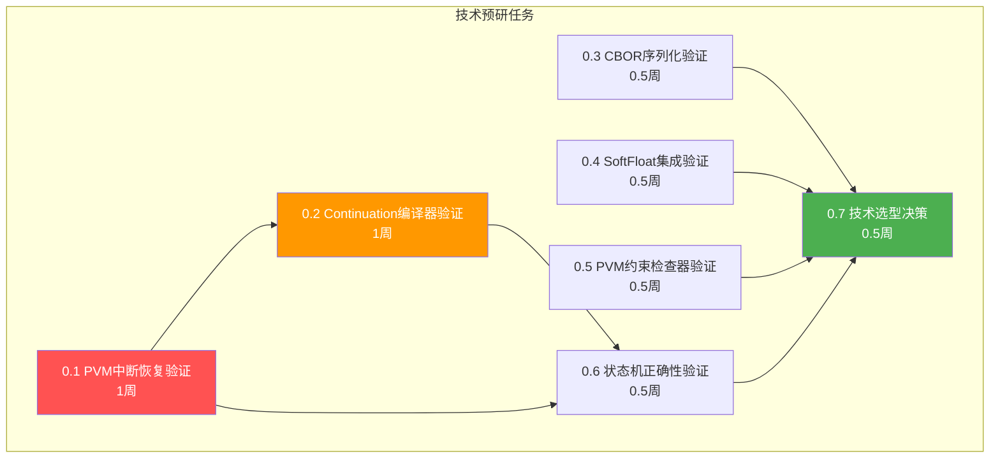

### 开发阶段任务清单

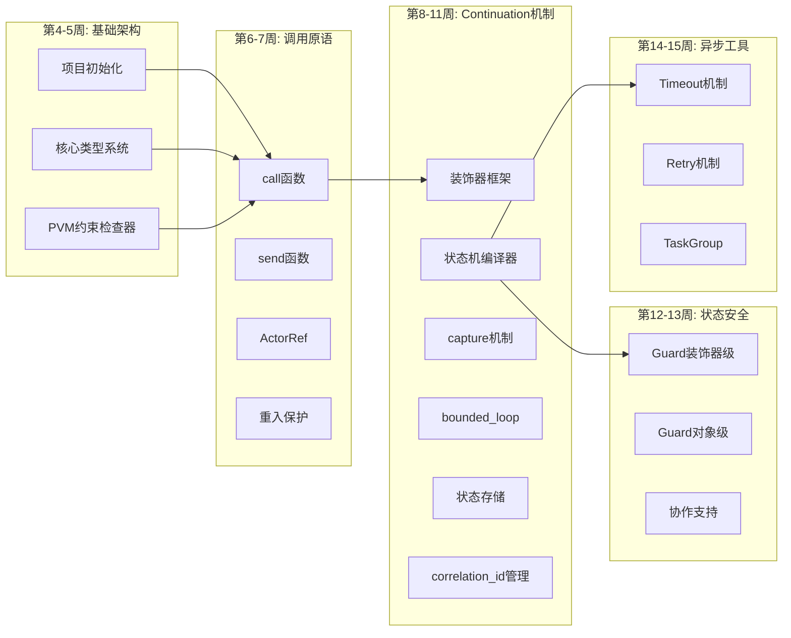

### 完整任务清单树状图

```mermaid
graph TD
    Root[Cowboy SDK开发] --> M0[模块0: 技术预研<br/>3周]
    Root --> M1[模块1: 基础架构<br/>2周]
    Root --> M2[模块2: 调用原语<br/>2周]
    Root --> M3[模块3: Continuation<br/>4周]
    Root --> M4[模块4: 状态安全<br/>1.5周]
    Root --> M5[模块5: 异步工具<br/>2周]
    Root --> M6[模块6: 类型系统<br/>1周]
    Root --> M7[模块7: 验证构建器<br/>2.5周]
    Root --> M8[模块8: Runner集成<br/>2周]
    Root --> M9[模块9: Actor基础设施<br/>1.5周]
    Root --> M10[模块10: 测试文档<br/>3周]
    
    M0 --> M0_1[0.1 PVM中断恢复]
    M0 --> M0_2[0.2 编译器验证]
    M0 --> M0_3[0.3 CBOR验证]
    M0 --> M0_4[0.4 SoftFloat]
    M0 --> M0_5[0.5 约束检查]
    M0 --> M0_6[0.6 正确性验证]
    M0 --> M0_7[0.7 技术选型]
    
    M1 --> M1_1[1.1 项目初始化]
    M1 --> M1_2[1.2 核心类型]
    M1 --> M1_3[1.3 约束检查器]
    
    M2 --> M2_1[2.1 call函数]
    M2 --> M2_2[2.2 send函数]
    M2 --> M2_3[2.3 ActorRef]
    M2 --> M2_4[2.4 重入保护]
    
    M3 --> M3_1[3.1 装饰器框架]
    M3 --> M3_2[3.2 状态机编译器]
    M3 --> M3_3[3.3 capture机制]
    M3 --> M3_4[3.4 bounded_loop]
    M3 --> M3_5[3.5 状态存储]
    M3 --> M3_6[3.6 correlation_id]
    
    M4 --> M4_1[4.1 Guard装饰器]
    M4 --> M4_2[4.2 Guard对象]
    M4 --> M4_3[4.3 协作支持]
    
    M5 --> M5_1[5.1 Timeout]
    M5 --> M5_2[5.2 Retry]
    M5 --> M5_3[5.3 TaskGroup]
    
    M6 --> M6_1[6.1 CowboyModel]
    M6 --> M6_2[6.2 类型转换器]
    
    M7 --> M7_1[7.1 构建器框架]
    M7 --> M7_2[7.2 验证模式]
    M7 --> M7_3[7.3 检查器]
    
    M8 --> M8_1[8.1 Runner客户端]
    M8 --> M8_2[8.2 结果处理]
    
    M9 --> M9_1[9.1 @actor装饰器]
    M9 --> M9_2[9.2 Storage接口]
    M9 --> M9_3[9.3 消息处理]
    
    M10 --> M10_1[10.1 单元测试]
    M10 --> M10_2[10.2 集成测试]
    M10 --> M10_3[10.3 文档编写]
    M10 --> M10_4[10.4 示例项目]
    
    style M0 fill:#ffeb3b
    style M3 fill:#4caf50
    style M10 fill:#2196f3
    style M0_1 fill:#ff5252,color:#fff
```

### 任务完成度追踪表

| 模块 | 总任务数 | 已完成 | 进行中 | 待开始 | 完成率 |
|------|---------|--------|--------|--------|--------|
| 模块0 | 35 | 0 | 0 | 35 | 0% |
| 模块1 | 15 | 0 | 0 | 15 | 0% |
| 模块2 | 20 | 0 | 0 | 20 | 0% |
| 模块3 | 30 | 0 | 0 | 30 | 0% |
| 模块4 | 12 | 0 | 0 | 12 | 0% |
| 模块5 | 15 | 0 | 0 | 15 | 0% |
| 模块6 | 10 | 0 | 0 | 10 | 0% |
| 模块7 | 20 | 0 | 0 | 20 | 0% |
| 模块8 | 12 | 0 | 0 | 12 | 0% |
| 模块9 | 12 | 0 | 0 | 12 | 0% |
| 模块10 | 25 | 0 | 0 | 25 | 0% |
| **总计** | **206** | **0** | **0** | **206** | **0%** |

*注：此表可在项目进行过程中实时更新*

---

## 六、总结

**总工作量**: 26周（约6.5个月，含3周技术预研）  
**关键路径**: 技术预研（含PVM中断恢复验证） → 基础架构 → 调用原语 → Continuation机制 → 其他模块 → 测试文档

**成功标准**:
1. 技术预研完成，关键技术可行性得到验证（含PVM中断恢复机制），技术选型确定
2. PVM运行中断与恢复机制验证通过（单断点、多断点接力、跨区块状态一致性）
3. 所有功能模块实现完成
4. 测试覆盖率 >85%
5. 文档完整，包含用户指南和API参考
6. 至少3个完整示例项目
7. 通过PVM确定性测试

