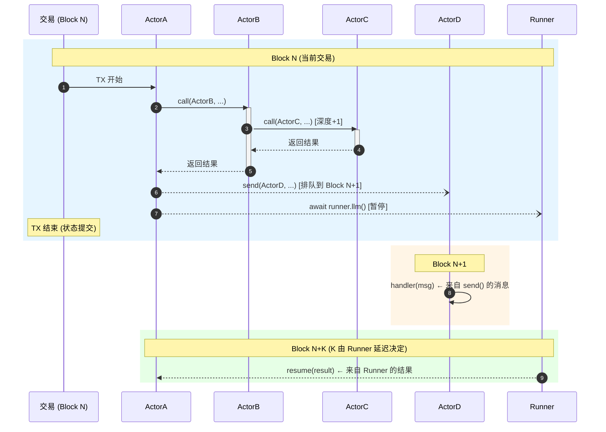
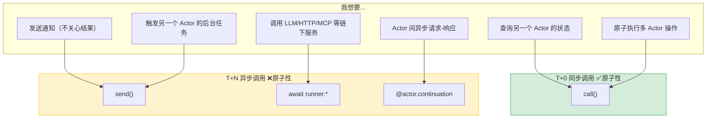
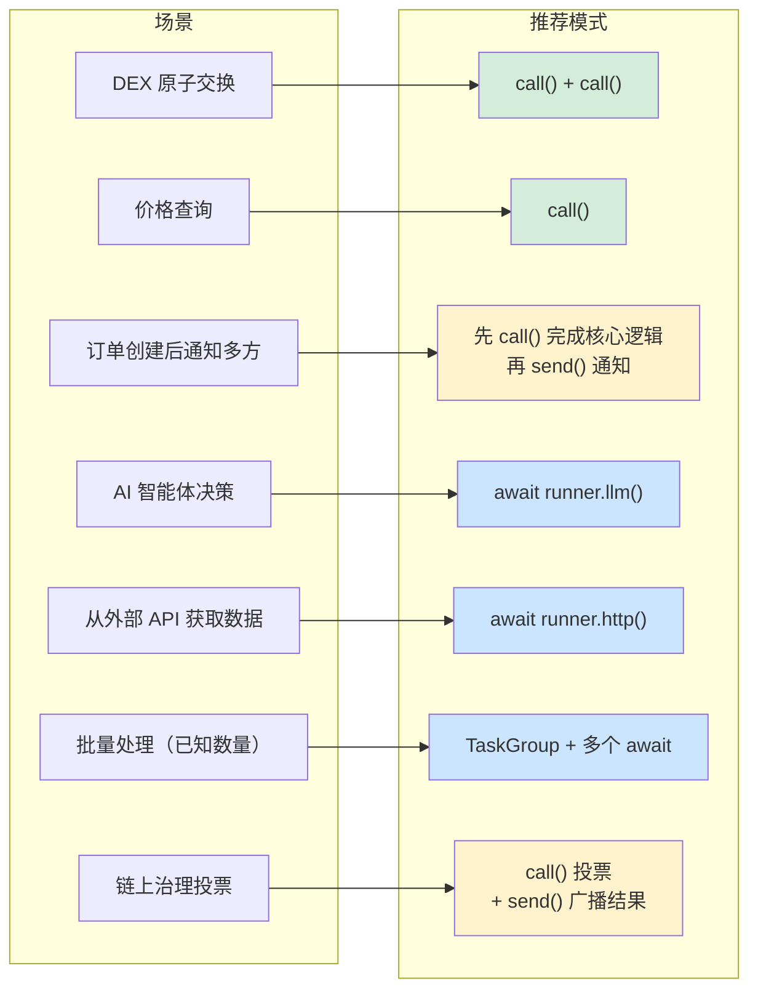

# Cowboy SDK 和 PVM 细化设计建议

**状态**: 草案  
**版本**: 2.0  
**更新日期**: 2025-12-17

---

## 概述

本改进方案旨在通过高级抽象隐藏底层机制（消息传递、Timer、Gas），同时严格遵守 Cowboy 主链定义的 PVM 确定性约束（无 JIT、软浮点、固定哈希种子、CBOR 序列化）。

### 设计原则

1. **确定性优先**：所有 SDK 抽象必须编译为确定性的链上操作
2. **显式优于隐式**：跨区块边界的状态必须显式声明
3. **安全默认**：防止开发者无意中写出破坏共识的代码
4. **渐进式复杂性**：简单场景用简单 API，复杂场景有完整控制

---

## 第一章：调用原语与投递时机

### 1.1 三种调用原语

Cowboy SDK 提供三种调用原语，适用于不同场景：

| 原语 | 投递时机 | 返回值 | 原子性 | 回滚传播 | 典型用例 |
|------|---------|--------|--------|----------|---------|
| `call()` | T+0 (同交易) | ✅ 直接返回 | ✅ 共享上下文 | ✅ 级联回滚 | 原子操作、状态查询 |
| `send()` | T+N (下一区块) | ❌ 无 | ❌ 独立交易 | ❌ 不可撤回 | 通知、触发任务 |
| `await continuation` | T+N (链下执行后) | ✅ 恢复返回 | ❌ 独立交易 | ❌ 不可撤回 | LLM、HTTP、MCP、跨 Actor 异步 |

### 1.2 执行时序图



### 1.3 同步调用 (call) - T+0

同步调用在当前交易内立即执行，共享原子性上下文。

**PVM 确定性约束**：
- 调用深度累计到重入上限（32），每次 `call()` 消耗 1 层深度
- 必须显式传递 `cycles_limit`，防止无限递归
- 返回值必须是 CBOR 可序列化类型

```python
from cowboy_sdk import call

def atomic_swap(self, user: str, amount_a: int, amount_b: int):
    """
    同步调用语义：
    - 立即执行：call() 在当前交易内立即跳转到目标 Actor
    - 共享上下文：调用者和被调用者共享同一交易的读写集
    - 原子回滚：任何位置 raise 都会回滚整个调用链
    """
    
    # 同步调用：立即执行并返回结果
    balance_a = call(
        target="0x1111...",
        method="get_balance",
        args={"user": user},
        cycles_limit=5000  # 必须显式指定
    )
    
    if balance_a < amount_a:
        raise InsufficientBalance()
    
    # 这两个 transfer 在同一交易内原子执行
    call(
        target="0x1111...", 
        method="transfer", 
        args={"from_addr": user, "to_addr": self.address, "amount": amount_a},
        cycles_limit=10000
    )
    
    call(
        target="0x2222...", 
        method="transfer",
        args={"from_addr": self.address, "to_addr": user, "amount": amount_b},
        cycles_limit=10000
    )
    # 如果执行到这里没有异常，两个 transfer 都会提交
```

**语法糖：ActorRef**

```python
from cowboy_sdk import ActorRef

@actor
class TradingBot:
    def check_arbitrage(self):
        # SDK 语法糖：自动生成 call() 调用
        oracle = ActorRef("0x4444...")
        price = oracle.get_price("ETH")  # 编译为 call(...)
        
        if price < 1000:
            self.execute_buy()
```

### 1.4 异步消息 (send) - T+N

异步消息排队到下一区块投递，无返回值，不可撤回。

**PVM 确定性约束**：
- 同一交易内多次 `send()` 产生的消息，按调用顺序排队
- 消息 ID：`keccak256(sender_addr + nonce + target + payload_hash)`
- 消息严格在下一区块开始时投递

```python
from cowboy_sdk import send

def trigger_downstream(self, order_id: str):
    """
    异步消息语义：
    - 延迟投递：消息排队到下一区块
    - 无返回值：send() 立即返回 None
    - 不可撤回：消息发送后无法取消
    """
    
    # 发送通知（发后即忘）
    send(
        target="0x3333...",
        message={"action": "notify", "order_id": order_id}
    )
    
    # 可以连续发送多条，按顺序投递
    send(target="0x4444...", message={"action": "log", "order_id": order_id})
    send(target="0x5555...", message={"action": "audit", "order_id": order_id})
```

**⚠️ 发后即忘的风险与补偿模式**

```python
# ❌ 反模式：send() 后 raise 导致不一致
def risky_workflow(self, order_id: str):
    send(target="0x3333...", message={"action": "order_created", ...})
    
    result = call(target="0x1111...", method="reserve_inventory", ...)
    if not result.success:
        # ⚠️ send() 已发出，无法撤回
        raise InventoryError()

# ✅ 推荐模式：先完成可能失败的操作，最后再 send()
def safe_workflow(self, order_id: str):
    # 先执行所有可能失败的同步调用
    result = call(target="0x1111...", method="reserve_inventory", ...)
    if not result.success:
        raise InventoryError()
    
    call(target="0x2222...", method="charge_payment", ...)
    
    # 所有关键操作成功后，再发送通知
    send(target="0x3333...", message={"action": "order_created", ...})
```

### 1.5 重入与循环调用

```python
from cowboy_sdk import call, reentrancy_guard

@actor
class ContractA:
    def method_1(self, depth: int = 0):
        if depth > 5:
            return "max depth reached"
        
        # 调用 B，B 会回调 A.method_2
        # 合法的重入，只要总深度 ≤ 32
        result = call(
            target="0xBBBB...",
            method="call_back_to_a",
            args={"depth": depth},
            cycles_limit=50000
        )
        return result

@actor
class SafeToken:
    # SDK 装饰器自动处理重入保护
    @reentrancy_guard
    def transfer(self, to: str, amount: int):
        # SDK 自动在入口加锁，出口解锁
        # 锁的 key 基于 keccak256(method_name + caller_addr) 确定性生成
        pass
```

---

## 第二章：Continuation 机制

Continuation 是 Cowboy 处理跨区块异步操作的核心机制。SDK 提供两种 Continuation 装饰器：

| 装饰器 | 用途 | await 目标 |
|--------|------|-----------|
| `@runner.continuation` | 调用链下 Runner 服务 | `runner.llm()`, `runner.http()`, `runner.mcp()` 等 |
| `@actor.continuation` | Actor 间异步请求-响应 | `ActorRef.async_*()` 方法 |

**两者共享同一套编译策略和状态机机制**，区别仅在于 await 的目标不同。

### 2.1 编译策略：显式状态机转换

SDK 将 async 函数编译为有限状态自动机（FSM），每个 `await` 点定义一个状态。

**PVM 确定性约束**：
- 状态序列化使用 Canonical CBOR
- 状态 ID：`keccak256(actor_addr + method_name + invocation_nonce)`
- 每个 Continuation 状态占用 Actor 存储配额
- 捕获的变量必须是 CBOR 可序列化类型（禁止闭包、函数引用、生成器）

### 2.2 capture() - 显式状态捕获

开发者必须使用 `capture()` 显式声明需要跨 await 保留的变量：

```python
from cowboy_sdk import runner, capture

@runner.continuation
async def sequential_workflow(self, msg):
    # 声明需要跨 await 捕获的变量
    ctx = capture()
    
    # Step 1: 第一个 await
    ctx.step1 = await runner.http("https://api1.com/data")
    # 编译后：发送消息 + 保存 {state: 1, ctx: {step1: ...}} + return
    
    # Step 2: 使用 step1 结果
    ctx.step2 = await runner.llm(f"Analyze: {ctx.step1}")
    # 编译后：恢复状态 + 发送消息 + 保存 {state: 2, ctx: {...}} + return
    
    # Step 3: 最终处理
    self.storage.set("result", ctx.step2.summary)
    # 编译后：恢复状态 + 执行 + 清理 Continuation 状态
```

### 2.3 支持的模式与限制

| 模式 | 支持状态 | 说明 |
|------|---------|------|
| 顺序 await | ✅ 支持（最多8个） | 每个 await 生成一个状态转换 |
| 条件 await | ✅ 支持 | 状态机包含分支 |
| 循环中 await | ⚠️ 有限支持 | **必须使用 `@bounded_loop` 声明上限** |
| try/except 中 await | ✅ 支持 | 异常状态也被序列化 |
| 嵌套函数调用中 await | ❌ 不支持 | 必须平铺到顶层函数 |
| 递归 await | ❌ 不支持 | 无法序列化递归栈 |

### 2.4 条件分支 await

```python
@runner.continuation
async def conditional_workflow(self, msg):
    ctx = capture()
    
    ctx.analysis = await runner.llm("Initial analysis...")
    
    # 条件分支：状态机包含两个可能的后续状态
    if ctx.analysis.confidence > 0.8:
        # 分支 A: 状态 2A
        ctx.details = await runner.llm("Deep dive...")
        self.execute_high_confidence(ctx.details)
    else:
        # 分支 B: 状态 2B  
        ctx.fallback = await runner.http("https://fallback-api.com")
        self.execute_low_confidence(ctx.fallback)
```

### 2.5 有界循环 await

**循环中使用 await 必须声明迭代上限**：

```python
from cowboy_sdk import runner, capture, bounded_loop

@runner.continuation
async def loop_workflow(self, msg):
    ctx = capture()
    
    ctx.items = await runner.http("https://api.com/items")
    ctx.results = []
    
    # bounded_loop 声明循环上限，编译器据此生成状态
    # 如果实际迭代超过 max_iterations，抛出 LoopBoundExceeded
    @bounded_loop(max_iterations=10)
    async def process_items():
        for item in ctx.items[:10]:  # 必须在循环前切片
            result = await runner.process(item)
            ctx.results.append(result)
    
    await process_items()
    
    return aggregate(ctx.results)
```

### 2.6 错误处理与 await

```python
@runner.continuation
async def error_handling_workflow(self, msg):
    ctx = capture()
    
    try:
        ctx.result = await runner.llm("...", timeout_blocks=50)
        self.process(ctx.result)
        
    except RunnerTimeoutError:
        # 超时：SDK 确定性地在第 N+50 块触发此分支
        ctx.fallback = await runner.http("https://fallback.com")
        self.process_fallback(ctx.fallback)
        
    except RunnerValidationError as e:
        # 验证失败：Runner 返回的结果不符合 Schema
        self.log_error(e)
```

### 2.7 @actor.continuation - Actor 间异步调用

用于 Actor 间的异步请求-响应模式（非 Runner）：

```python
from cowboy_sdk import actor, capture

@actor
class TradingBot:
    @actor.continuation(timeout_blocks=100)
    async def query_multiple_oracles(self, assets: list[str]):
        ctx = capture()  # 同样需要 capture()
        
        oracle = ActorRef("0x4444...")
        ctx.results = []
        
        # 必须使用 bounded_loop
        @bounded_loop(max_iterations=5)
        async def fetch_prices():
            for asset in assets[:5]:
                # await 被编译为 send() + 回调处理器
                price = await oracle.async_get_price(asset)
                ctx.results.append(price)
        
        await fetch_prices()
        return ctx.results
```

### 2.8 Continuation 状态存储

```python
# Continuation 状态存储在 Actor 的特殊命名空间下
# Key: __continuation:{correlation_id}
# Value: CBOR({
#     "state": int,           # 当前状态编号
#     "ctx": dict,            # 捕获的变量
#     "created_block": int,   # 创建时的区块高度
#     "timeout_block": int,   # 超时区块高度
#     "checksum": bytes       # 状态完整性校验
# })

# 存储限制
CONTINUATION_MAX_SIZE = 64 * 1024  # 单个 Continuation 最大 64 KiB
CONTINUATION_MAX_COUNT = 100        # 每个 Actor 最多 100 个活跃 Continuation
```

### 2.9 编译输出示例（信息性）

原始代码：
```python
@runner.continuation
async def example(self, msg):
    ctx = capture()
    ctx.a = await runner.llm("step1")
    ctx.b = await runner.llm(f"step2: {ctx.a}")
    return ctx.b
```

编译后等价于：
```python
def example(self, msg):
    cont_state = self._load_continuation(msg)
    
    if cont_state is None:
        # 初始调用：发送第一个任务
        correlation_id = self._gen_correlation_id()
        self._save_continuation(correlation_id, {"state": 0, "ctx": {}})
        send(RUNNER, {
            "job_type": "llm", "prompt": "step1",
            "correlation_id": correlation_id,
            "reply_handler": "example__resume"
        })
        return
    
def example__resume(self, msg):
    cont_state = self._load_continuation(msg.correlation_id)
    ctx = cont_state["ctx"]
    
    if cont_state["state"] == 0:
        ctx["a"] = msg.result
        self._save_continuation(msg.correlation_id, {"state": 1, "ctx": ctx})
        send(RUNNER, {
            "job_type": "llm", "prompt": f"step2: {ctx['a']}",
            "correlation_id": msg.correlation_id,
            "reply_handler": "example__resume"
        })
        return
        
    elif cont_state["state"] == 1:
        ctx["b"] = msg.result
        self._delete_continuation(msg.correlation_id)
        return ctx["b"]
```

---

## 第三章：状态安全机制

Cowboy 提供两种互补的状态安全机制：

| 机制 | 用途 | 作用时机 |
|------|------|---------|
| `guard` | **验证**状态在跨块期间未改变 | Continuation 恢复时 |
| `capture` | **保存**局部变量跨块传递 | await 点前后 |

### 3.1 Guard 机制 - 状态防卫

Guard 用于防止跨块执行导致的状态过期（Stale State）漏洞。

**PVM 确定性约束**：
- 禁止对象标识比较（`id()` 或 `is`）
- 状态指纹使用 Canonical CBOR + `keccak256` 计算
- 不能使用 `pickle` 或不稳定的 JSON

#### 方式 A：装饰器级守卫

```python
# 声明：在恢复执行前，必须确保指定的 storage keys 未改变
@runner.continuation(guard_unchanged=["price", "config"])
async def execute_strategy(self, msg):
    # SDK 内部逻辑：
    # 1. 捕获当前值：v1 = keccak256(cbor(storage.get("price")))
    # 2. 将 v1 写入 continuation state
    # 3. 发送任务...
    # 4. (跨块等待) ...
    # 5. 恢复时重新计算：v2 = keccak256(cbor(storage.get("price")))
    # 6. 如果 v1 != v2，抛出 StateConflictError
    
    result = await runner.llm("Analyze market...")
    self.buy()
```

#### 方式 B：对象级精细守卫

```python
async def flexible_trade(self, msg):
    # .guard() 返回一个 GuardedValue 对象
    # 内部存储：{'key': 'balance', 'snapshot_hash': '0x123...', 'value': 1000}
    balance = self.storage.guard("balance") 
    
    try:
        # SDK 自动将 balance 的 snapshot_hash 注入到 continuation state
        result = await runner.llm(...)
        
        # 显式访问 .value 会触发校验
        # 如果当前 storage["balance"] 的哈希与 snapshot 不一致，抛出异常
        new_balance = balance.value - 100
        self.storage.set("balance", new_balance)
        
    except StateConflictError:
        # 确定性异常：所有节点都会在同一指令处抛出异常
        self.log("Balance changed, aborting.")
```

### 3.2 Guard 与 Capture 的协作

`guard` 和 `capture` 解决不同问题，可以同时使用：

```python
@runner.continuation(guard_unchanged=["user_balance"])  # 验证余额未变
async def complex_workflow(self, msg):
    ctx = capture()  # 保存局部变量
    
    # ctx 保存计算中间结果
    ctx.analysis = await runner.llm("...")
    
    # guard_unchanged 确保 user_balance 在等待期间未被其他交易修改
    # 如果被修改，恢复时会抛出 StateConflictError
    
    ctx.decision = await runner.llm(f"Based on {ctx.analysis}...")
    
    # 执行时 user_balance 保证与开始时一致
    self.execute_trade(ctx.decision)
```

**区别总结**：
- `capture()` 保存**局部变量**（函数内的临时值）
- `guard_unchanged` 验证**存储状态**（Actor 的持久化数据）

---

## 第四章：异步工具

### 4.1 Timeout 与 Retry

**PVM 确定性约束**：
- 时间单位必须是**区块高度**，禁止使用秒或 `time.time()`
- 重试抖动（Jitter）必须使用链上 VRF，禁止 `random.random()`

```python
from cowboy_sdk import Retry

async def fetch_data(self):
    try:
        result = await runner.http(
            url="https://api.example.com",
            # PVM 约束：timeout 必须是整数（区块数）
            timeout_blocks=20,  
            
            # 重试策略：延迟序列为固定的 [1, 2, 4, 8] 个区块
            # 如果需要 jitter，SDK 内部使用 HKDF(VRF_Beacon, actor_addr) 生成
            retry_policy=Retry(max_attempts=3, backoff="exponential") 
        )
    except RunnerTimeoutError:
        # 确定性错误，所有节点都会在第 N+20 个区块触发
        self.cleanup()
```

**SDK 内部实现**：
- Timer ID 生成：`keccak256(current_msg_id + "timer")`，确保所有节点一致
- 自动清理：收到 Runner 结果或触发 Timeout 时，SDK 自动取消另一方的资源

### 4.2 TaskGroup - 结构化并发

允许开发者以同步代码的思维编写并行任务。

**PVM 确定性约束**：
- `TaskGroup` 内的任务创建顺序必须严格一致，决定消息的 Nonce 和哈希
- 结果聚合时，SDK 以**确定性顺序**（按任务创建顺序）返回结果

```python
async with runner.TaskGroup() as tg:
    # 任务1：创建时消耗 nonce N
    t1 = tg.create_task(runner.llm(prompt="A"))
    # 任务2：创建时消耗 nonce N+1
    t2 = tg.create_task(runner.llm(prompt="B"))

# 执行到这里，意味着所有任务都已完成
# PVM 约束：无论 t1 和 t2 谁先返回，result 的访问顺序都是确定的
if t1.result.score > t2.result.score:
    self.action()
```

---

## 第五章：类型系统

### 5.1 CowboyModel - PVM 安全的数据模型

标准 Pydantic `BaseModel` 可能使用非确定性行为。SDK 提供定制的 `CowboyModel`：

**PVM 确定性约束**：
- Python 原生 `float` 依赖硬件 FPU，是非确定性的
- 必须使用 `SoftFloat` 替代 `float`
- `Decimal` 必须指定精度

```python
from cowboy_sdk import CowboyModel, Field
from cowboy_sdk.types import SoftFloat

class MarketAnalysis(CowboyModel):
    # 必须使用 SoftFloat 替代 float
    sentiment_score: SoftFloat = Field(..., ge=0, le=1)
    tags: list[str]
    # 金额使用字符串，避免浮点精度问题
    price_target: str  

@actor
class Trader:
    async def analyze(self):
        # response_model 告诉 Runner 需要符合该 JSON Schema
        result = await runner.llm(
            prompt="Analyze...",
            response_model=MarketAnalysis
        )
        
        # SDK 内部：
        # 1. 收到 JSON 结果
        # 2. 使用 canonical CBOR 规则校验
        # 3. 实例化 MarketAnalysis (若校验失败抛出 DeterministicValidationError)
        
        if result.sentiment_score > SoftFloat("0.8"):
            self.buy()
```

### 5.2 PVM 专用类型

| 类型 | 替代 | 说明 |
|------|------|------|
| `SoftFloat` | `float` | 使用软件浮点库，跨平台确定性 |
| `ordered_set` | `set` | 插入顺序集合，迭代顺序确定 |
| `BlockHeight` | `int` | 语义化的区块高度类型 |

---

## 第六章：声明式验证构建器

使用链式调用替代手写复杂的 `verification` JSON 配置。

**PVM 确定性约束**：
- 无论代码如何调用，最终生成的 Job Spec JSON 必须键值有序

### 6.1 基础 API

```python
from cowboy_sdk import Verify
from cowboy_sdk.types import SoftFloat

await runner.llm(
    prompt="...",
    verification=Verify.builder()
        .mode("structured_match")
        .runners(5)
        .threshold(3)
        .check(Verify.numeric_tolerance("score", SoftFloat("0.05")))
        .check(Verify.no_prompt_leak())
        .check(Verify.custom(actor="0x123...", method="check_quality"))
        .build() 
)
```

### 6.2 验证模式

| 模式 | 方法 | 说明 |
|------|------|------|
| `none` | `.mode("none")` | 无验证，仅保证未交付 |
| `economic_bond` | `.mode("economic_bond")` | 单 Runner + 保证金 |
| `majority_vote` | `.mode("majority_vote")` | 指定字段多数投票 |
| `structured_match` | `.mode("structured_match")` | 验证器函数匹配 |
| `deterministic` | `.mode("deterministic")` | 精确匹配 + TEE |
| `semantic_similarity` | `.mode("semantic_similarity")` | 嵌入相似度 |

### 6.3 内置检查器

| 检查器 | 说明 |
|--------|------|
| `Verify.exact_match()` | 字节对字节相等 |
| `Verify.json_schema_valid(schema)` | JSON Schema 验证 |
| `Verify.structured_match(fields)` | 指定字段必须匹配 |
| `Verify.majority_vote(field)` | 字段值 >50% 同意 |
| `Verify.numeric_tolerance(field, tolerance)` | 数字在 ±tolerance 内 |
| `Verify.numeric_range(field, min, max)` | 数字在边界内 |
| `Verify.set_equality(field)` | 无序集合相等 |
| `Verify.contains_all(substrings)` | 输出包含必需字符串 |
| `Verify.contains_none(substrings)` | 输出排除字符串 |
| `Verify.regex_match(pattern)` | 正则表达式匹配 |
| `Verify.length_bounds(min, max)` | 输出长度在边界内 |
| `Verify.semantic_similarity(threshold)` | 嵌入余弦相似性 |
| `Verify.no_prompt_leak()` | 输出不包含系统提示 |
| `Verify.entropy_check(min_entropy)` | 输出不是重复/退化的 |
| `Verify.custom(actor, method)` | 自定义验证器 Actor |

### 6.4 完整示例

```python
from cowboy_sdk import Verify, runner
from cowboy_sdk.types import SoftFloat

# 场景：金融分析，需要高可靠性
await runner.llm(
    prompt="Analyze BTC market trends...",
    response_model=MarketAnalysis,
    verification=Verify.builder()
        .mode("structured_match")
        .runners(5)
        .threshold(3)
        # 必须通过 Schema 验证
        .check(Verify.json_schema_valid(MarketAnalysis.schema()))
        # sentiment_score 误差不超过 0.05
        .check(Verify.numeric_tolerance("sentiment_score", SoftFloat("0.05")))
        # tags 字段必须完全匹配
        .check(Verify.structured_match(["tags"]))
        # 不允许泄露系统提示
        .check(Verify.no_prompt_leak())
        # 自定义业务逻辑验证
        .check(Verify.custom(actor="0xABC...", method="validate_analysis"))
        .build(),
    # 其他选项
    timeout_blocks=100,
    tee_required=True
)
```

---

## 第七章：混合使用模式

### 7.1 综合示例

```python
from cowboy_sdk import actor, runner, call, send, capture, Verify
from cowboy_sdk.types import SoftFloat

@actor
class TradingAgent:
    
    @runner.continuation(guard_unchanged=["user_balance"])
    async def hybrid_workflow(self, msg):
        """展示三种原语的混合使用"""
        ctx = capture()
        
        # Step 1: 同步调用查询状态 (T+0)
        ctx.balance = call(
            target="0x1111...",
            method="get_balance",
            args={"user": msg.user},
            cycles_limit=5000
        )
        
        # Step 2: 链下 LLM 分析 (T+N)
        ctx.analysis = await runner.llm(
            prompt=f"Should user with balance {ctx.balance} trade?",
            timeout_blocks=100,
            verification=Verify.builder()
                .mode("structured_match")
                .runners(3)
                .threshold(2)
                .check(Verify.json_schema_valid(TradeDecision.schema()))
                .build()
        )
        
        # Step 3: 基于分析结果决策
        if ctx.analysis.recommendation == "trade":
            # 同步调用执行交易 (T+0，在恢复的这个交易内原子执行)
            # guard_unchanged 确保 user_balance 未变
            call(
                target="0x2222...",
                method="execute_trade",
                args={"user": msg.user, "amount": ctx.balance // 2},
                cycles_limit=50000
            )
        
        # Step 4: 发送通知 (T+N，下一区块)
        send(
            target="0x3333...",
            message={
                "action": "trade_completed",
                "user": msg.user,
                "analysis": ctx.analysis.summary
            }
        )
```

---

## 附录 A：PVM 兼容性铁律

开发者必须遵守以下规则：

| # | 规则 | 替代方案 |
|---|------|---------|
| 1 | 禁止 `import time` | 使用 **Block Height** |
| 2 | 禁止 `import random` | 使用 **SDK 提供的 VRF 接口** |
| 3 | 禁止 `float` | 使用 **`cowboy_sdk.types.SoftFloat`** |
| 4 | 禁止 `set()` | SDK 自动转换为 **`ordered_set`** |
| 5 | 禁止 `pickle` | 跨块数据必须支持 **CBOR** |
| 6 | `call()` 深度限制 | 累计不超过 **32 层**，必须显式传递 **cycles_limit** |
| 7 | `await` 点限制 | 单个 Continuation 函数最多 **8 个顺序 await** |
| 8 | 循环中 await | 必须使用 **`@bounded_loop`** 声明迭代上限 |
| 9 | Continuation 捕获 | 使用 **`capture()`** 显式声明跨 await 保留的变量 |
| 10 | `send()` 不可撤回 | 先完成可能失败的 `call()`，最后再 `send()` |

---

## 附录 B：调用语义速查表

### B.1 调用原语选择



### B.2 场景推荐模式



---

## 附录 C：机制对比表

| 机制 | 用途 | 作用域 | 时机 |
|------|------|--------|------|
| `capture()` | 保存局部变量 | 函数内 | await 前后 |
| `guard_unchanged` | 验证存储状态未变 | storage keys | Continuation 恢复时 |
| `storage.guard()` | 精细验证单个 key | 单个 key | 访问 .value 时 |
| `@reentrancy_guard` | 防止重入攻击 | 方法级 | 方法入口/出口 |
| `@bounded_loop` | 限制循环迭代 | 循环块 | 循环执行时 |

---

## 变更日志

- **v2.1** (2025-12-17):
  - 将所有 ASCII 图表转换为 Mermaid 格式
  - 1.2 执行时序图：转换为 sequenceDiagram
  - 附录 B 调用语义速查表：转换为 flowchart，拆分为 B.1 调用原语选择 和 B.2 场景推荐模式

- **v2.0** (2025-12-17): 
  - 合并原第六节与第八节，消除重复
  - 明确 `@actor.continuation` 与 `@runner.continuation` 的关系
  - 补充 `guard` 与 `capture` 的协作说明
  - 统一循环 await 的规则（必须使用 `@bounded_loop`）
  - 扩展第六章验证构建器的完整 API
  - 新增附录 C 机制对比表

