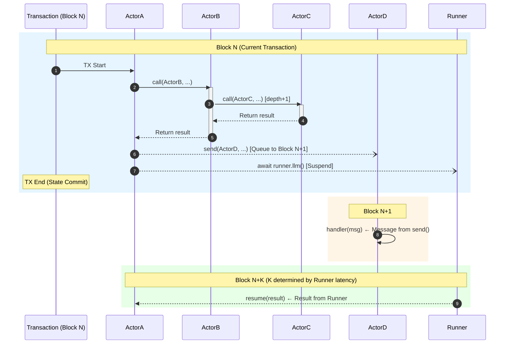
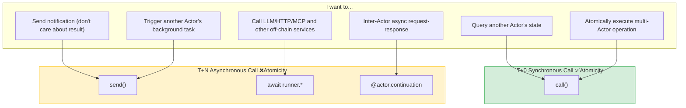
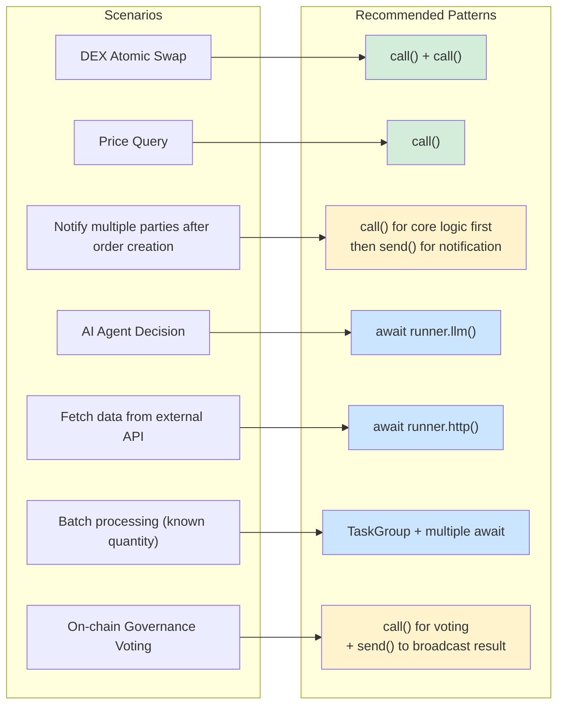

# Cowboy SDK and PVM Refinement Design Proposal

**Status**: Draft  
**Version**: 2.0  
**Updated**: 2025-12-17

---

## Overview

This improvement proposal aims to hide underlying mechanisms (message passing, Timer, Gas) through high-level abstractions while strictly adhering to the PVM determinism constraints defined by the Cowboy mainchain (no JIT, soft-float, fixed hash seed, CBOR serialization).

### Design Principles

1. **Determinism First**: All SDK abstractions must compile to deterministic on-chain operations
2. **Explicit Over Implicit**: State crossing block boundaries must be explicitly declared
3. **Secure by Default**: Prevent developers from inadvertently writing code that breaks consensus
4. **Progressive Complexity**: Simple APIs for simple scenarios, full control for complex scenarios

---

## Chapter 1: Call Primitives and Delivery Timing

### 1.1 Three Call Primitives

The Cowboy SDK provides three call primitives for different scenarios:

| Primitive | Delivery Timing | Return Value | Atomicity | Rollback Propagation | Typical Use Cases |
|-----------|-----------------|--------------|-----------|----------------------|-------------------|
| `call()` | T+0 (same transaction) | ✅ Direct return | ✅ Shared context | ✅ Cascading rollback | Atomic operations, state queries |
| `send()` | T+N (next block) | ❌ None | ❌ Independent transaction | ❌ Irrevocable | Notifications, triggering tasks |
| `await continuation` | T+N (after off-chain execution) | ✅ Resume return | ❌ Independent transaction | ❌ Irrevocable | LLM, HTTP, MCP, cross-Actor async |

### 1.2 Execution Sequence Diagram



### 1.3 Synchronous Call (call) - T+0

Synchronous calls execute immediately within the current transaction, sharing atomic context.

**PVM Determinism Constraints**:
- Call depth accumulates to reentrancy limit (32), each `call()` consumes 1 depth level
- Must explicitly pass `cycles_limit` to prevent infinite recursion
- Return values must be CBOR serializable types

```python
from cowboy_sdk import call

def atomic_swap(self, user: str, amount_a: int, amount_b: int):
    """
    Synchronous call semantics:
    - Immediate execution: call() jumps to target Actor immediately within current transaction
    - Shared context: Caller and callee share the same transaction's read-write set
    - Atomic rollback: raise at any point rolls back the entire call chain
    """
    
    # Synchronous call: execute immediately and return result
    balance_a = call(
        target="0x1111...",
        method="get_balance",
        args={"user": user},
        cycles_limit=5000  # Must explicitly specify
    )
    
    if balance_a < amount_a:
        raise InsufficientBalance()
    
    # These two transfers execute atomically within the same transaction
    call(
        target="0x1111...", 
        method="transfer", 
        args={"from_addr": user, "to_addr": self.address, "amount": amount_a},
        cycles_limit=10000
    )
    
    call(
        target="0x2222...", 
        method="transfer",
        args={"from_addr": self.address, "to_addr": user, "amount": amount_b},
        cycles_limit=10000
    )
    # If execution reaches here without exceptions, both transfers are committed
```

**Syntactic Sugar: ActorRef**

```python
from cowboy_sdk import ActorRef

@actor
class TradingBot:
    def check_arbitrage(self):
        # SDK syntactic sugar: automatically generates call() invocation
        oracle = ActorRef("0x4444...")
        price = oracle.get_price("ETH")  # Compiles to call(...)
        
        if price < 1000:
            self.execute_buy()
```

### 1.4 Asynchronous Message (send) - T+N

Asynchronous messages are queued for delivery in the next block, with no return value and irrevocable.

**PVM Determinism Constraints**:
- Multiple `send()` calls within the same transaction queue messages in call order
- Message ID: `keccak256(sender_addr + nonce + target + payload_hash)`
- Messages are strictly delivered at the start of the next block

```python
from cowboy_sdk import send

def trigger_downstream(self, order_id: str):
    """
    Asynchronous message semantics:
    - Delayed delivery: Messages queue to next block
    - No return value: send() returns None immediately
    - Irrevocable: Messages cannot be cancelled after sending
    """
    
    # Send notification (fire and forget)
    send(
        target="0x3333...",
        message={"action": "notify", "order_id": order_id}
    )
    
    # Can send multiple messages consecutively, delivered in order
    send(target="0x4444...", message={"action": "log", "order_id": order_id})
    send(target="0x5555...", message={"action": "audit", "order_id": order_id})
```

**⚠️ Fire-and-Forget Risks and Compensation Patterns**

```python
# ❌ Anti-pattern: raise after send() causes inconsistency
def risky_workflow(self, order_id: str):
    send(target="0x3333...", message={"action": "order_created", ...})
    
    result = call(target="0x1111...", method="reserve_inventory", ...)
    if not result.success:
        # ⚠️ send() already dispatched, cannot be revoked
        raise InventoryError()

# ✅ Recommended pattern: Complete potentially failing operations first, then send()
def safe_workflow(self, order_id: str):
    # Execute all potentially failing synchronous calls first
    result = call(target="0x1111...", method="reserve_inventory", ...)
    if not result.success:
        raise InventoryError()
    
    call(target="0x2222...", method="charge_payment", ...)
    
    # Send notifications only after all critical operations succeed
    send(target="0x3333...", message={"action": "order_created", ...})
```

### 1.5 Reentrancy and Circular Calls

```python
from cowboy_sdk import call, reentrancy_guard

@actor
class ContractA:
    def method_1(self, depth: int = 0):
        if depth > 5:
            return "max depth reached"
        
        # Call B, B will callback to A.method_2
        # Legal reentrancy, as long as total depth ≤ 32
        result = call(
            target="0xBBBB...",
            method="call_back_to_a",
            args={"depth": depth},
            cycles_limit=50000
        )
        return result

@actor
class SafeToken:
    # SDK decorator automatically handles reentrancy protection
    @reentrancy_guard
    def transfer(self, to: str, amount: int):
        # SDK automatically locks at entry, unlocks at exit
        # Lock key is deterministically generated based on keccak256(method_name + caller_addr)
        pass
```

---

## Chapter 2: Continuation Mechanism

Continuation is the core mechanism for Cowboy to handle cross-block asynchronous operations. The SDK provides two Continuation decorators:

| Decorator | Purpose | await Target |
|-----------|---------|--------------|
| `@runner.continuation` | Call off-chain Runner services | `runner.llm()`, `runner.http()`, `runner.mcp()`, etc. |
| `@actor.continuation` | Inter-Actor async request-response | `ActorRef.async_*()` methods |

**Both share the same compilation strategy and state machine mechanism**, differing only in the await target.

### 2.1 Compilation Strategy: Explicit State Machine Transformation

The SDK compiles async functions into Finite State Automata (FSM), with each `await` point defining a state.

**PVM Determinism Constraints**:
- State serialization uses Canonical CBOR
- State ID: `keccak256(actor_addr + method_name + invocation_nonce)`
- Each Continuation state occupies Actor storage quota
- Captured variables must be CBOR serializable types (closures, function references, generators are prohibited)

### 2.2 capture() - Explicit State Capture

Developers must use `capture()` to explicitly declare variables that need to be preserved across await:

```python
from cowboy_sdk import runner, capture

@runner.continuation
async def sequential_workflow(self, msg):
    # Declare variables to capture across await
    ctx = capture()
    
    # Step 1: First await
    ctx.step1 = await runner.http("https://api1.com/data")
    # After compilation: send message + save {state: 1, ctx: {step1: ...}} + return
    
    # Step 2: Use step1 result
    ctx.step2 = await runner.llm(f"Analyze: {ctx.step1}")
    # After compilation: restore state + send message + save {state: 2, ctx: {...}} + return
    
    # Step 3: Final processing
    self.storage.set("result", ctx.step2.summary)
    # After compilation: restore state + execute + cleanup Continuation state
```

### 2.3 Supported Patterns and Limitations

| Pattern | Support Status | Notes |
|---------|----------------|-------|
| Sequential await | ✅ Supported (max 8) | Each await generates a state transition |
| Conditional await | ✅ Supported | State machine includes branches |
| await in loops | ⚠️ Limited support | **Must use `@bounded_loop` to declare upper bound** |
| await in try/except | ✅ Supported | Exception states are also serialized |
| await in nested function calls | ❌ Not supported | Must flatten to top-level function |
| Recursive await | ❌ Not supported | Cannot serialize recursive stack |

### 2.4 Conditional Branch await

```python
@runner.continuation
async def conditional_workflow(self, msg):
    ctx = capture()
    
    ctx.analysis = await runner.llm("Initial analysis...")
    
    # Conditional branch: state machine includes two possible subsequent states
    if ctx.analysis.confidence > 0.8:
        # Branch A: State 2A
        ctx.details = await runner.llm("Deep dive...")
        self.execute_high_confidence(ctx.details)
    else:
        # Branch B: State 2B  
        ctx.fallback = await runner.http("https://fallback-api.com")
        self.execute_low_confidence(ctx.fallback)
```

### 2.5 Bounded Loop await

**Using await in loops requires declaring iteration upper bound**:

```python
from cowboy_sdk import runner, capture, bounded_loop

@runner.continuation
async def loop_workflow(self, msg):
    ctx = capture()
    
    ctx.items = await runner.http("https://api.com/items")
    ctx.results = []
    
    # bounded_loop declares loop upper bound, compiler generates states accordingly
    # If actual iterations exceed max_iterations, throws LoopBoundExceeded
    @bounded_loop(max_iterations=10)
    async def process_items():
        for item in ctx.items[:10]:  # Must slice before loop
            result = await runner.process(item)
            ctx.results.append(result)
    
    await process_items()
    
    return aggregate(ctx.results)
```

### 2.6 Error Handling with await

```python
@runner.continuation
async def error_handling_workflow(self, msg):
    ctx = capture()
    
    try:
        ctx.result = await runner.llm("...", timeout_blocks=50)
        self.process(ctx.result)
        
    except RunnerTimeoutError:
        # Timeout: SDK deterministically triggers this branch at block N+50
        ctx.fallback = await runner.http("https://fallback.com")
        self.process_fallback(ctx.fallback)
        
    except RunnerValidationError as e:
        # Validation failure: Runner result doesn't conform to Schema
        self.log_error(e)
```

### 2.7 @actor.continuation - Inter-Actor Async Calls

For async request-response patterns between Actors (not Runner):

```python
from cowboy_sdk import actor, capture

@actor
class TradingBot:
    @actor.continuation(timeout_blocks=100)
    async def query_multiple_oracles(self, assets: list[str]):
        ctx = capture()  # Also requires capture()
        
        oracle = ActorRef("0x4444...")
        ctx.results = []
        
        # Must use bounded_loop
        @bounded_loop(max_iterations=5)
        async def fetch_prices():
            for asset in assets[:5]:
                # await compiles to send() + callback handler
                price = await oracle.async_get_price(asset)
                ctx.results.append(price)
        
        await fetch_prices()
        return ctx.results
```

### 2.8 Continuation State Storage

```python
# Continuation state is stored under a special namespace in Actor storage
# Key: __continuation:{correlation_id}
# Value: CBOR({
#     "state": int,           # Current state number
#     "ctx": dict,            # Captured variables
#     "created_block": int,   # Block height at creation
#     "timeout_block": int,   # Timeout block height
#     "checksum": bytes       # State integrity checksum
# })

# Storage limits
CONTINUATION_MAX_SIZE = 64 * 1024  # Single Continuation max 64 KiB
CONTINUATION_MAX_COUNT = 100        # Max 100 active Continuations per Actor
```

### 2.9 Compilation Output Example (Informative)

Original code:
```python
@runner.continuation
async def example(self, msg):
    ctx = capture()
    ctx.a = await runner.llm("step1")
    ctx.b = await runner.llm(f"step2: {ctx.a}")
    return ctx.b
```

Compiled equivalent:
```python
def example(self, msg):
    cont_state = self._load_continuation(msg)
    
    if cont_state is None:
        # Initial call: send first task
        correlation_id = self._gen_correlation_id()
        self._save_continuation(correlation_id, {"state": 0, "ctx": {}})
        send(RUNNER, {
            "job_type": "llm", "prompt": "step1",
            "correlation_id": correlation_id,
            "reply_handler": "example__resume"
        })
        return
    
def example__resume(self, msg):
    cont_state = self._load_continuation(msg.correlation_id)
    ctx = cont_state["ctx"]
    
    if cont_state["state"] == 0:
        ctx["a"] = msg.result
        self._save_continuation(msg.correlation_id, {"state": 1, "ctx": ctx})
        send(RUNNER, {
            "job_type": "llm", "prompt": f"step2: {ctx['a']}",
            "correlation_id": msg.correlation_id,
            "reply_handler": "example__resume"
        })
        return
        
    elif cont_state["state"] == 1:
        ctx["b"] = msg.result
        self._delete_continuation(msg.correlation_id)
        return ctx["b"]
```

---

## Chapter 3: State Safety Mechanisms

Cowboy provides two complementary state safety mechanisms:

| Mechanism | Purpose | Timing |
|-----------|---------|--------|
| `guard` | **Verify** state unchanged during cross-block period | On Continuation resume |
| `capture` | **Save** local variables across blocks | Before and after await points |

### 3.1 Guard Mechanism - State Protection

Guard prevents stale state vulnerabilities caused by cross-block execution.

**PVM Determinism Constraints**:
- Object identity comparison (`id()` or `is`) is prohibited
- State fingerprint uses Canonical CBOR + `keccak256`
- Cannot use `pickle` or unstable JSON

#### Method A: Decorator-Level Guard

```python
# Declaration: Before resuming execution, specified storage keys must be unchanged
@runner.continuation(guard_unchanged=["price", "config"])
async def execute_strategy(self, msg):
    # SDK internal logic:
    # 1. Capture current value: v1 = keccak256(cbor(storage.get("price")))
    # 2. Write v1 to continuation state
    # 3. Send task...
    # 4. (Cross-block wait) ...
    # 5. On resume, recalculate: v2 = keccak256(cbor(storage.get("price")))
    # 6. If v1 != v2, throw StateConflictError
    
    result = await runner.llm("Analyze market...")
    self.buy()
```

#### Method B: Object-Level Fine-Grained Guard

```python
async def flexible_trade(self, msg):
    # .guard() returns a GuardedValue object
    # Internal storage: {'key': 'balance', 'snapshot_hash': '0x123...', 'value': 1000}
    balance = self.storage.guard("balance") 
    
    try:
        # SDK automatically injects balance's snapshot_hash into continuation state
        result = await runner.llm(...)
        
        # Explicitly accessing .value triggers validation
        # If current storage["balance"] hash doesn't match snapshot, throws exception
        new_balance = balance.value - 100
        self.storage.set("balance", new_balance)
        
    except StateConflictError:
        # Deterministic exception: all nodes throw exception at the same instruction
        self.log("Balance changed, aborting.")
```

### 3.2 Collaboration Between Guard and Capture

`guard` and `capture` solve different problems and can be used together:

```python
@runner.continuation(guard_unchanged=["user_balance"])  # Verify balance unchanged
async def complex_workflow(self, msg):
    ctx = capture()  # Save local variables
    
    # ctx saves intermediate computation results
    ctx.analysis = await runner.llm("...")
    
    # guard_unchanged ensures user_balance wasn't modified by other transactions during wait
    # If modified, throws StateConflictError on resume
    
    ctx.decision = await runner.llm(f"Based on {ctx.analysis}...")
    
    # user_balance is guaranteed to be consistent with start time during execution
    self.execute_trade(ctx.decision)
```

**Summary of Differences**:
- `capture()` saves **local variables** (temporary values within the function)
- `guard_unchanged` verifies **storage state** (Actor's persistent data)

---

## Chapter 4: Async Tools

### 4.1 Timeout and Retry

**PVM Determinism Constraints**:
- Time units must be **block height**, using seconds or `time.time()` is prohibited
- Retry jitter must use on-chain VRF, `random.random()` is prohibited

```python
from cowboy_sdk import Retry

async def fetch_data(self):
    try:
        result = await runner.http(
            url="https://api.example.com",
            # PVM constraint: timeout must be integer (block count)
            timeout_blocks=20,  
            
            # Retry policy: delay sequence is fixed [1, 2, 4, 8] blocks
            # If jitter is needed, SDK internally uses HKDF(VRF_Beacon, actor_addr)
            retry_policy=Retry(max_attempts=3, backoff="exponential") 
        )
    except RunnerTimeoutError:
        # Deterministic error, all nodes trigger at block N+20
        self.cleanup()
```

**SDK Internal Implementation**:
- Timer ID generation: `keccak256(current_msg_id + "timer")`, ensures consistency across all nodes
- Automatic cleanup: When Runner result is received or Timeout triggers, SDK automatically cancels the other resource

### 4.2 TaskGroup - Structured Concurrency

Allows developers to write parallel tasks with synchronous code thinking.

**PVM Determinism Constraints**:
- Task creation order within `TaskGroup` must be strictly consistent, determining message Nonce and hash
- When aggregating results, SDK returns results in **deterministic order** (by task creation order)

```python
async with runner.TaskGroup() as tg:
    # Task 1: consumes nonce N at creation
    t1 = tg.create_task(runner.llm(prompt="A"))
    # Task 2: consumes nonce N+1 at creation
    t2 = tg.create_task(runner.llm(prompt="B"))

# Reaching here means all tasks are complete
# PVM constraint: regardless of which returns first, result access order is deterministic
if t1.result.score > t2.result.score:
    self.action()
```

---

## Chapter 5: Type System

### 5.1 CowboyModel - PVM-Safe Data Model

Standard Pydantic `BaseModel` may use non-deterministic behavior. The SDK provides a customized `CowboyModel`:

**PVM Determinism Constraints**:
- Python native `float` depends on hardware FPU, is non-deterministic
- Must use `SoftFloat` instead of `float`
- `Decimal` must specify precision

```python
from cowboy_sdk import CowboyModel, Field
from cowboy_sdk.types import SoftFloat

class MarketAnalysis(CowboyModel):
    # Must use SoftFloat instead of float
    sentiment_score: SoftFloat = Field(..., ge=0, le=1)
    tags: list[str]
    # Use string for amounts to avoid floating-point precision issues
    price_target: str  

@actor
class Trader:
    async def analyze(self):
        # response_model tells Runner to conform to this JSON Schema
        result = await runner.llm(
            prompt="Analyze...",
            response_model=MarketAnalysis
        )
        
        # SDK internal:
        # 1. Receive JSON result
        # 2. Validate using canonical CBOR rules
        # 3. Instantiate MarketAnalysis (throws DeterministicValidationError if validation fails)
        
        if result.sentiment_score > SoftFloat("0.8"):
            self.buy()
```

### 5.2 PVM-Specific Types

| Type | Replaces | Description |
|------|----------|-------------|
| `SoftFloat` | `float` | Uses software floating-point library, cross-platform deterministic |
| `ordered_set` | `set` | Insertion-ordered set, deterministic iteration order |
| `BlockHeight` | `int` | Semantic block height type |

---

## Chapter 6: Declarative Verification Builder

Use fluent chaining to replace hand-written complex `verification` JSON configuration.

**PVM Determinism Constraints**:
- Regardless of how code is called, the final generated Job Spec JSON must have ordered keys

### 6.1 Basic API

```python
from cowboy_sdk import Verify
from cowboy_sdk.types import SoftFloat

await runner.llm(
    prompt="...",
    verification=Verify.builder()
        .mode("structured_match")
        .runners(5)
        .threshold(3)
        .check(Verify.numeric_tolerance("score", SoftFloat("0.05")))
        .check(Verify.no_prompt_leak())
        .check(Verify.custom(actor="0x123...", method="check_quality"))
        .build() 
)
```

### 6.2 Verification Modes

| Mode | Method | Description |
|------|--------|-------------|
| `none` | `.mode("none")` | No verification, only guarantees non-delivery |
| `economic_bond` | `.mode("economic_bond")` | Single Runner + bond |
| `majority_vote` | `.mode("majority_vote")` | Majority vote on specified field |
| `structured_match` | `.mode("structured_match")` | Validator function matching |
| `deterministic` | `.mode("deterministic")` | Exact match + TEE |
| `semantic_similarity` | `.mode("semantic_similarity")` | Embedding similarity |

### 6.3 Built-in Checkers

| Checker | Description |
|---------|-------------|
| `Verify.exact_match()` | Byte-for-byte equality |
| `Verify.json_schema_valid(schema)` | JSON Schema validation |
| `Verify.structured_match(fields)` | Specified fields must match |
| `Verify.majority_vote(field)` | Field value >50% agreement |
| `Verify.numeric_tolerance(field, tolerance)` | Number within ±tolerance |
| `Verify.numeric_range(field, min, max)` | Number within bounds |
| `Verify.set_equality(field)` | Unordered set equality |
| `Verify.contains_all(substrings)` | Output contains required strings |
| `Verify.contains_none(substrings)` | Output excludes strings |
| `Verify.regex_match(pattern)` | Regular expression match |
| `Verify.length_bounds(min, max)` | Output length within bounds |
| `Verify.semantic_similarity(threshold)` | Embedding cosine similarity |
| `Verify.no_prompt_leak()` | Output doesn't contain system prompt |
| `Verify.entropy_check(min_entropy)` | Output is not repetitive/degenerate |
| `Verify.custom(actor, method)` | Custom validator Actor |

### 6.4 Complete Example

```python
from cowboy_sdk import Verify, runner
from cowboy_sdk.types import SoftFloat

# Scenario: Financial analysis, requiring high reliability
await runner.llm(
    prompt="Analyze BTC market trends...",
    response_model=MarketAnalysis,
    verification=Verify.builder()
        .mode("structured_match")
        .runners(5)
        .threshold(3)
        # Must pass Schema validation
        .check(Verify.json_schema_valid(MarketAnalysis.schema()))
        # sentiment_score error not exceeding 0.05
        .check(Verify.numeric_tolerance("sentiment_score", SoftFloat("0.05")))
        # tags field must match exactly
        .check(Verify.structured_match(["tags"]))
        # No system prompt leakage allowed
        .check(Verify.no_prompt_leak())
        # Custom business logic validation
        .check(Verify.custom(actor="0xABC...", method="validate_analysis"))
        .build(),
    # Other options
    timeout_blocks=100,
    tee_required=True
)
```

---

## Chapter 7: Mixed Usage Patterns

### 7.1 Comprehensive Example

```python
from cowboy_sdk import actor, runner, call, send, capture, Verify
from cowboy_sdk.types import SoftFloat

@actor
class TradingAgent:
    
    @runner.continuation(guard_unchanged=["user_balance"])
    async def hybrid_workflow(self, msg):
        """Demonstrates mixed usage of three primitives"""
        ctx = capture()
        
        # Step 1: Synchronous call to query state (T+0)
        ctx.balance = call(
            target="0x1111...",
            method="get_balance",
            args={"user": msg.user},
            cycles_limit=5000
        )
        
        # Step 2: Off-chain LLM analysis (T+N)
        ctx.analysis = await runner.llm(
            prompt=f"Should user with balance {ctx.balance} trade?",
            timeout_blocks=100,
            verification=Verify.builder()
                .mode("structured_match")
                .runners(3)
                .threshold(2)
                .check(Verify.json_schema_valid(TradeDecision.schema()))
                .build()
        )
        
        # Step 3: Decision based on analysis result
        if ctx.analysis.recommendation == "trade":
            # Synchronous call to execute trade (T+0, executes atomically in resumed transaction)
            # guard_unchanged ensures user_balance is unchanged
            call(
                target="0x2222...",
                method="execute_trade",
                args={"user": msg.user, "amount": ctx.balance // 2},
                cycles_limit=50000
            )
        
        # Step 4: Send notification (T+N, next block)
        send(
            target="0x3333...",
            message={
                "action": "trade_completed",
                "user": msg.user,
                "analysis": ctx.analysis.summary
            }
        )
```

---

## Appendix A: PVM Compatibility Iron Rules

Developers must adhere to the following rules:

| # | Rule | Alternative |
|---|------|-------------|
| 1 | Prohibit `import time` | Use **Block Height** |
| 2 | Prohibit `import random` | Use **SDK-provided VRF interface** |
| 3 | Prohibit `float` | Use **`cowboy_sdk.types.SoftFloat`** |
| 4 | Prohibit `set()` | SDK automatically converts to **`ordered_set`** |
| 5 | Prohibit `pickle` | Cross-block data must support **CBOR** |
| 6 | `call()` depth limit | Cumulative max **32 levels**, must explicitly pass **cycles_limit** |
| 7 | `await` point limit | Single Continuation function max **8 sequential awaits** |
| 8 | await in loops | Must use **`@bounded_loop`** to declare iteration upper bound |
| 9 | Continuation capture | Use **`capture()`** to explicitly declare variables preserved across await |
| 10 | `send()` is irrevocable | Complete potentially failing `call()` first, then `send()` last |

---

## Appendix B: Call Semantics Quick Reference

### B.1 Call Primitive Selection



### B.2 Scenario Recommended Patterns



---

## Appendix C: Mechanism Comparison Table

| Mechanism | Purpose | Scope | Timing |
|-----------|---------|-------|--------|
| `capture()` | Save local variables | Within function | Before and after await |
| `guard_unchanged` | Verify storage state unchanged | storage keys | On Continuation resume |
| `storage.guard()` | Fine-grained verification of single key | Single key | When accessing .value |
| `@reentrancy_guard` | Prevent reentrancy attacks | Method level | Method entry/exit |
| `@bounded_loop` | Limit loop iterations | Loop block | During loop execution |

