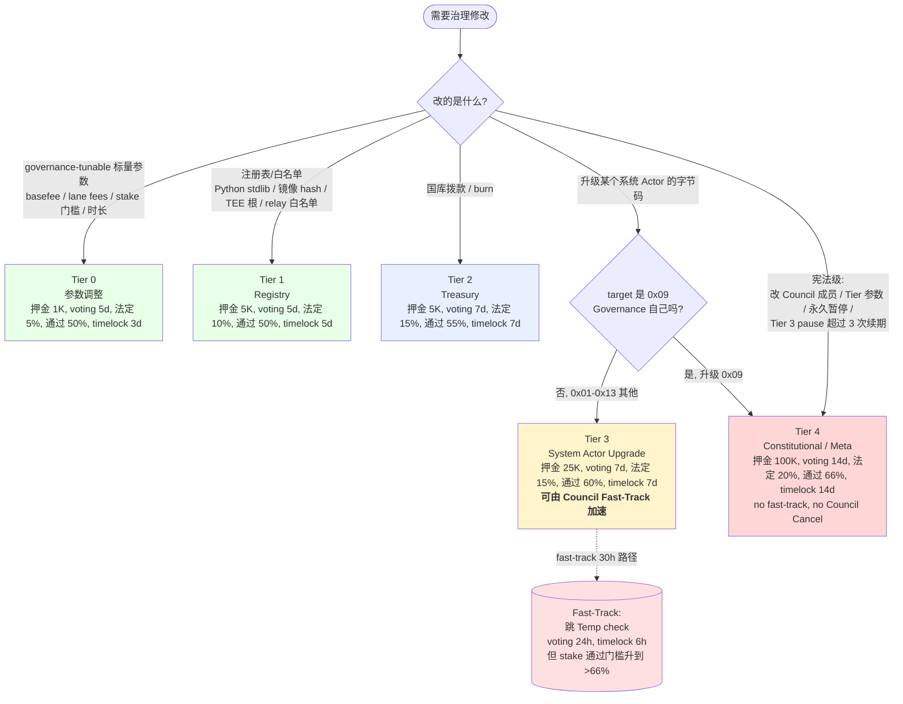

# 链上治理与系统 Actor 升级（CIP-12）

Cowboy 治理由 `0x09 GOVERNANCE` 系统 Actor 实现，采用**双院制**投票（质押 CBY + 验证者一人一票），配合永久 **Security Council**（7-of-9 多签）作为紧急制动。升级机制内置于 `0x09` 本身，不单独做 `SystemActorUpgrader`。

**状态**：CIP-12 为 Draft（2026-04-09 创建），本页随之为 draft；CIP-12 完整双院流程尚未实现。**代码侧已落地的治理面**：
- `SettlementConfig` 存储于 `0x09`（`UpdateSettlementConfig` opcode 40）
- `Proposal` 表 + `PROPOSAL_COUNTER_KEY`（demo voting：每地址 1 票，非 token-weighted；Phase 2 才加 ERC20Votes checkpoints）
- 三个 proposal payload kind（`node/runner/src/types.rs:835`）：
  - `UpdateBasefeeConfig` —— 通用 `SubmitProposal` (opcode 45) 路径，CIP-3 治理
  - `DrainRelay` —— **`SubmitDrainRelayProposal` (opcode 85)**，CIP-9 §13.3
  - `UpdateAutoDrainPolicy` —— **`SubmitAutoDrainPolicyProposal` (opcode 86)**，CIP-9 §13.4
- 通用执行路径：`CastVote` (opcode 46) → `ExecuteProposal` (opcode 47) 按 `payload_kind` 路由到具体 apply 函数

CIP-12 Tier 0-4 完整提案分类、双院投票门槛、Security Council、Tier 3 系统 Actor bytecode 升级都是 spec-only。

---

## 三类实体（职责隔离）

| 实体 | 职责 | 协议权限 |
|---|---|---|
| Foundation | 法律主体、持有国库地址、链下运营 | **无**（只能作为已通过提案的拨款接收方）|
| Security Council | 7-of-9 多签，固定任期 | 仅三项：**Cancel**（timelock 期内取消 Tier 0–3 提案）、**Fast-Track**（对 Tier 3 紧急加速）、**Circuit-Break**（暂停某个系统 Actor，7 天自动恢复除非 Tier 3 批准延期）|
| Labs Multisig | 3-of-5，仅控制治理 Portal 前端（CBFS 静态资源 + CIP-11 Gateway Actor）| **无协议权限**；Portal 被攻破只影响默认 UI |

Foundation 与 Council 签名人集合 / Council 与 Labs Multisig 签名人集合均有重叠上限，防关联妥协。

---

## 提案 Tier 与门槛



| Tier | 范围 | 押金 | Temp check | Voting | Stake 法定 | Stake 通过 | Validator | Timelock | Fast-track |
|---|---|---|---|---|---|---|---|---|---|
| 0 | 参数调整（任何 governance-tunable 标量）| 1K CBY | 3 天 | 5 天 | 5% | >50% | >50% | 3 天 | ✗ |
| 1 | 注册表与白名单（stdlib / 镜像 / 模型旗 / TEE 根 / relay 白名单）| 5K | 3 天 | 5 天 | 10% | >50% | >50% | 5 天 | ✗ |
| 2 | 国库拨款（资助 / 流动性激励 / 审计费 / 销毁）| 5K | 5 天 | 7 天 | 15% | >55% | >50% | 7 天 | ✗ |
| 3 | 系统 Actor 升级（`0x01`–`0x0B` 除 `0x09`；激活后扩 `0x0D`-`0x13`）| 25K | 7 天 | 7 天 | 15% | >60% | >50% | 7 天 | **✓** |
| 4 | 宪法级 / 元治理（升级 `0x09`、改 Council 成员、改 Tier 参数、永久暂停、超过 3 次 Tier 3 延期后的续期）| 100K | 14 天 | 14 天 | 20% | >66% | >66% | 14 天 | ✗ |

所有数字本身都可由 Tier 4 调整。押金在进入投票阶段后才退还；Temp check 失败或投票阶段内撤回则押金销毁。

---

## 提案生命周期（代码已落地路径）

```mermaid
sequenceDiagram
    autonumber
    participant Sub as Submitter
    participant Gov as 0x09 GOVERNANCE
    participant V as Validators / Stakers
    participant Council as Security Council<br/>(7-of-9 multisig)
    participant Target as 目标系统 Actor<br/>(0x06 basefee / 0x0B relay / ...)

    rect rgb(235, 245, 255)
        Note over Sub,Gov: ① 提交（3 种入口，全部进同一 Proposal 表）
        alt 通用提案（如 UpdateBasefeeConfig）
            Sub->>Gov: SubmitProposal (opcode 45)
        else DrainRelay
            Sub->>Gov: SubmitDrainRelayProposal (opcode 85)<br/>payload_kind = DrainRelay
        else UpdateAutoDrainPolicy
            Sub->>Gov: SubmitAutoDrainPolicyProposal (opcode 86)<br/>payload_kind = UpdateAutoDrainPolicy
        end
        Gov->>Gov: 校验 voting_blocks ∈ [MIN, MAX]<br/>bump PROPOSAL_COUNTER_KEY<br/>写 Proposal{state: Active, voting_deadline}
        Gov-->>Sub: emit governance.proposal.submitted
    end

    rect rgb(255, 250, 235)
        Note over V,Gov: ② 投票窗口（per-Tier voting 时长）
        loop voting_deadline_block 之前
            V->>Gov: CastVote (opcode 46) { proposal_id, support: bool }
            Gov->>Gov: 累计 for_votes / against_votes<br/>(demo: 每地址 1 票; Phase 2: ERC20Votes)
        end
        opt Council 在 timelock 期内 Cancel
            Council->>Gov: Cancel(proposal_id)
            Gov->>Gov: state → Cancelled, 押金销毁
        end
    end

    rect rgb(235, 255, 235)
        Note over Gov,Target: ③ 执行（任何人可触发，幂等）
        Sub->>Gov: ExecuteProposal (opcode 47) { proposal_id }
        Gov->>Gov: 校验 deadline 已过 + 投票通过 + 未 cancelled
        alt payload_kind = UpdateBasefeeConfig
            Gov->>Target: 写入 0x06 的 basefee config
        else payload_kind = DrainRelay
            Gov->>Target: enqueue_governance_auto_drain(0x0B, node_id)
            Note over Target: 下一 epoch 块级 storage_settlement 拾取
        else payload_kind = UpdateAutoDrainPolicy
            Gov->>Target: validate_auto_drain_policy → apply<br/>写 0x0B:AUTO_DRAIN_POLICY_KEY
        end
        Gov-->>Sub: emit governance.proposal.executed
    end
```

**代码落地范围**（`node/execution/src/execution/system_instruction.rs:747-905`）：opcode 45/46/47/85/86 全部 ✅；payload_kind 三种全部 ✅。CIP-12 完整 Tier 参数（押金、门槛、Temp check、Timelock、双院制）是 spec-only —— 当前代码用简化的"每地址 1 票 + 单 voting_blocks"路径运行 demo。

---

## 双院规则（Bicameral）

通过条件须**同时满足**：

```
stake_quorum_met     : total_stake_voted      >= stake_quorum_pct × active_stake
stake_approval_met   : yes_stake / (yes + no) > stake_approval_pct
validator_majority   : yes_validators / active_validators > validator_majority_pct
not_cancelled        : Security Council 在 timelock 期内未 Cancel
```

- **Stake 院**权重来源：质押给 Validator 的 CBY（自质押 + 委托均计；钱包内未质押 CBY 权重为 0）；Delegator 可覆盖 Validator 的票。
- **Validator 院**一人一票，与持仓无关。质押院通过但 Validator 院不通过 → **驳回**（Validator 对运营参数有实质否决权）。

**参与不足自动延期**：到 `voting_ends` 时若质押或 Validator 参与率低于各自 floor（默认 Validator 60%、Stake 为该 Tier 法定的 60%），窗口延长 `voting_extension_blocks`（默认 1 天），**快照不变**。最多延 `max_voting_extensions = 3` 次后强制清算，避免不参与者无限拖延。

---

## 系统 Actor 升级（Tier 3）

Payload `SystemActorUpgrade { target, new_code_hash, code_ref, migration: Option<MigrationSpec>, activation_delay_blocks, rollback_window_blocks, spec_ref }`：

- **`target` 必须 ∈ `0x01`–`0x0B` 且 ≠ `0x09`**（`0x09` 自升级走 Tier 4 `MetaGovernance { op: UpgradeGovernance }`，无 fast-track、无 Council Cancel、禁 pause）。
- 提交时验证：代码哈希匹配、PVM 确定性白名单通过、字节码 ≤ 512 KiB、`rollback_window_blocks >= 7 days`。
- 时间用**偏移量**描述；绝对块号在 queue 时计算：`activation_block = executable_at + activation_delay_blocks`。

**两条执行路径**（由 `migration` 是否为 `None` 决定）：

1. **无 migration**（纯代码指针替换）：`activation_block` 时单原子事务内 `rollback_slot ← old` → `actor_versions ← new` → emit `SystemActorUpgraded`。下一条消息即走新字节码，**零停机**。
2. **带 migration**：先 **quiesce** 排空队列一块，再原子执行 `rollback_slot ← old`、写新版本、调 `migration.fn_name(args)`、校验后置 state hash。任一步失败 → **同事务原子回滚**，队列自动恢复到旧代码；无需人工介入。

**Rollback Slot**：`rollback_deadline` 之前任何 Tier 3 Fast-Track 提案可直接指回 `rollback_slot`（旧字节码之前已上过链，不再重验）。过期后退化为普通 Tier 3。

---

## Fast-Track（仅 Tier 3）

Council 7-of-9 背书可触发：

| 阶段 | 正常 Tier 3 | Fast-Track |
|---|---|---|
| Temp check | 7 天 | **跳过**（Council 背书替代）|
| 投票窗口 | 7 天 | **24 小时** |
| Timelock | 7 天 | **6 小时** |
| Stake 通过 | >60% | **>66%** |
| Stake 法定 / Validator | 15% / >50% | 15% / >50%（不变）|

总路径 ~30 小时。提案仍须通过双院，Council 只是压缩时钟。不适用于未有补丁或共识未形成的场景（那种情况应用 Circuit-Break + 常规 Tier 3 配合）。

---

## Circuit-Breaker

```mermaid
stateDiagram-v2
    [*] --> Normal
    Normal --> Paused: Council 7-of-9 签 Circuit{target, Pause}<br/>→ 0x09; expires_at = block + 7d
    state Paused {
        direction LR
        [*] --> AwaitRatify: 0x09 自动生成<br/>Tier 3 RatifyExtend 提案<br/>(押金 0, 跳 Temp check, voting 7d / 24h fast-track)
        AwaitRatify --> Extended: 双院通过<br/>expires_at += pause_extend_blocks (默认 30d)<br/>extension_count += 1
        AwaitRatify --> AutoRevert: 7d 内未通过<br/>OR 直接到 expires_at
        Extended --> AwaitRatify: 下一轮 RatifyExtend<br/>(若 extension_count < 3)
        Extended --> Tier4Required: extension_count == 3<br/>(合计 ~90d 已超上限)
        Tier4Required --> PermanentPause: Tier 4 PauseExtendPermanent<br/>或 PausePermanent 通过
    }
    Paused --> Normal: AutoRevert<br/>(expires_at 到, 无续期通过)
    PermanentPause --> [*]: 永久暂停, 仅 Tier 4 可解
    AutoRevert --> Normal: actor 恢复消息处理

    note right of Normal
        target Actor 正常处理消息
    end note
    note right of Paused
        target Actor 全部消息<br/>revert ActorPaused
    end note
```



**关键约束**：
- target 不能是 `0x09` Governance 自己（pause 自己会死锁治理本身）
- Council 单边权限止于发起 Pause —— 任何延期必须经双院投票批准（Tier 3 RatifyExtend）
- 3 次 Tier 3 续期上限（~90 天）后必须经 Tier 4 宪法级提案，防 Council "事实永久暂停"
- 超过上限的 Tier 3 续期在 payload 校验阶段直接拒绝
- 任意时刻 Tier 3 `Unpause` 成功后重置 `extension_count = 0` 并清 `paused_actors[target]`。
- **`0x09` 本身不可 pause**（会造成治理死锁）。

---

## Cancellation 与 Griefing Cap（§7.8）

Council 的 Cancel 权不限频率，但累计触发**社区 review**：

- 每次 Cancel 写入 `council_cancellations` 并 emit `CancellationExecuted`。
- 滚动窗口 `cancellation_review_window_blocks`（默认 90 天）内达到 `cancellation_review_threshold`（默认 **3**）次 → `0x09` **自动**生成 Tier 4 `MetaGovernance { op: ReviewCouncil }` 提案（押金 0）。
- 可通过结果：`Affirm` / `Warn` / `Rotate`（替换若干 Council 签名人）。
- Council 不能 Cancel Tier 4 提案（包括对其自身的 Review）。

---

## 不可升级项（须验证者协调 hard fork）

- 区块与交易格式、签名方案
- Simplex BFT 共识规则
- `0x09` 升级机制本身（Tier 4 可换 `0x09` 字节码，但执行层对 "`0x09` 是治理权威" 这一事实的识别是 fork 级）
- 创世分配

---

## 与代码现状对照d

| 规范要素 | 代码现状 |
|---|---|
| `0x09` 系统 Actor 地址 | ✅ `node/types/src/constants.rs:139`（`GOVERNANCE_SYSTEM_ACTOR = 0x09`）|
| `SettlementConfig` 存 `0x09` | ✅ 已实现（`runner_percent/burn_percent/treasury_percent`）|
| `UpdateSettlementConfig` opcode 40 授权仅 `0x09` | ✅ `system_instruction.rs:448-506` |
| `target_pool` 枚举（CIP-14 v2 / CIP-10 v2 共用）| ❌ v2 precondition：`UpdateSettlementConfig` 需扩展 `target_pool` 字段，6 个变体（MAIN / REGISTRY / GATEWAY_POOL / CONTAINER / REGISTRY_TLD_COW / REGISTRY_TLD_COWBOY）。详见 [[settlement-slashing]] §SettlementConfig |
| `SubmitProposal/CastVote/ExecuteProposal` opcodes 45/46/47 | ✅ 代码已分配占位（`node/types/src/execution.rs:517-525`），完整双院流程未实现 |
| `UpdateBasefeeConfig` opcode 44 / `UpdateTimerConfig` opcode 49 | ✅ 代码占位；前者 CIP-3 governance、后者 CIP-5 revised §6.4 治理可调 |
| `UpdateCpuRoot` (opcode 58) / `UpdateNrasRoot` (opcode 59) | ❌ CIP-23 v2 §4 spec：`0x09` 通过这两条更新 TEE 根证书，`effective_at` 强制 ≥ 1 week 延迟 |
| 治理投票 / Temp check / 双院 / Timelock | ❌ 未实现 |
| Security Council / Fast-Track / Circuit-Break | ❌ 未实现 |
| 系统 Actor 字节码升级（`SystemActorUpgrade` payload）| ❌ 未实现（Tier 3 Payload 与现有 opcode 43 `UpgradeActor` 并非同一物，需分清）|

---

## 相关

- [[../entities/system-actors]] — `0x09` 地址与现有职责
- [[settlement-slashing]] — `SettlementConfig` 现为 `0x09` 唯一实装功能
- [[runner-delegation]] — CIP-13 参数均由 CIP-12 Tier 0 调整
- [[../parameters]] — 现有常量

## 源文档冲突 / 漂移

- **Tier 3 `SystemActorUpgrade` vs 现有 opcode 43 `UpgradeActor`**：前者是治理 Payload（不是 SystemInstruction opcode），后者是已有指令；CIP-12 未说明两者关系，实现阶段需明确是否合并或废弃其一。
- CIP-12 开放问题（§9）列出 7 项待裁决（验证者票平局、多选票语义、Council 轮换节奏、Portal 审查、Delegation 覆盖费率、可 pause 目标附加门槛、migration 排空上限）。

## Sources

- `refs/cips/cip-12-governance.md` — 全文规范（Draft, 2026-04-09）
- `node/types/src/constants.rs:136-139` — `BASEFEE_SYSTEM_ACTOR = 0x06`、`GOVERNANCE_SYSTEM_ACTOR = 0x09`
- `node/execution/src/execution/system_instruction.rs:448-506` — `UpdateSettlementConfig` 实现（目前 `0x09` 唯一实装动作）
- `refs/whitepaper/*` §11 — 治理总纲（细则以 CIP-12 为准）
