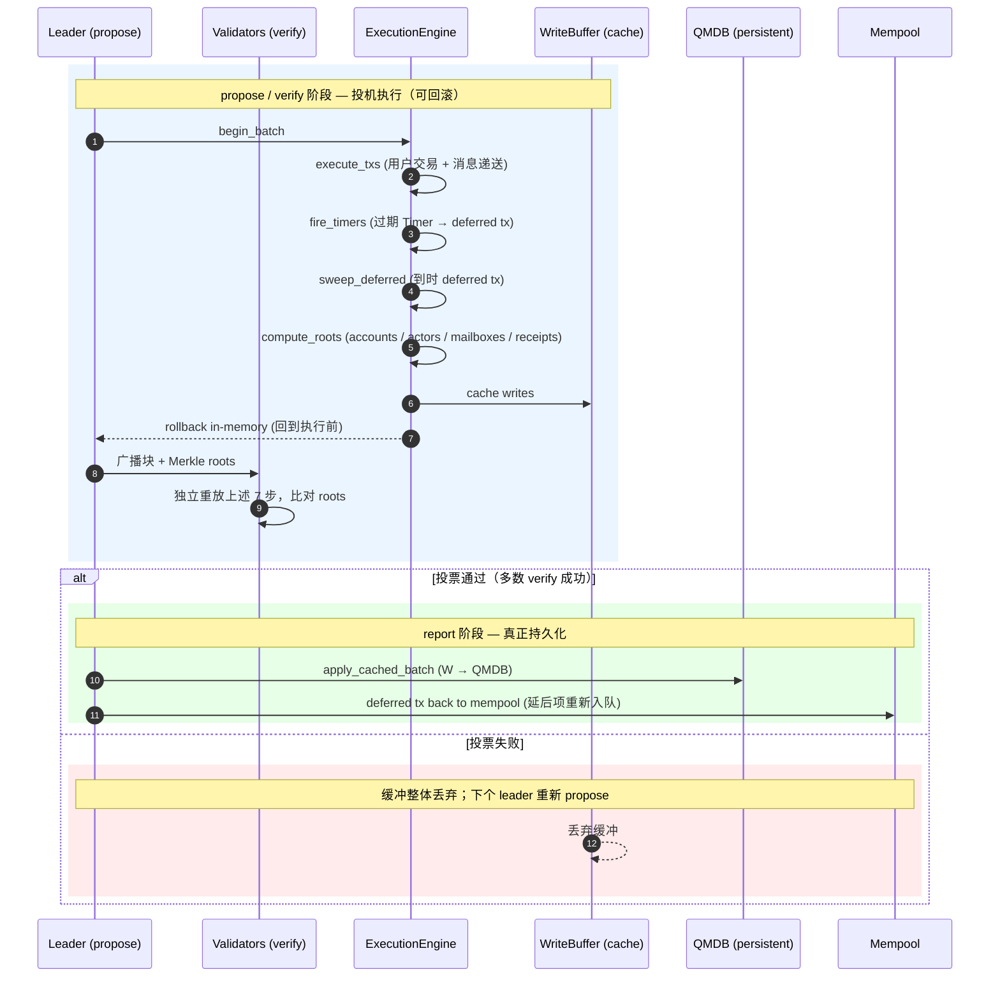

# 投机执行（Speculative Execution）

Cowboy 基于 Simplex BFT：Leader `propose` 块、验证者 `verify`、多数通过后 `report` 提交。执行在 propose/verify 阶段**投机**完成（可回滚），report 阶段才真正持久化。

---

## 三阶段

**关键转换点**：
- 步骤 ⑥ `cache` + 步骤 ⑦ `rollback` 是配对的 —— propose/verify 阶段所有写入都进 WriteBuffer，链上状态保持执行前的样子。这是"投机"的本质。
- 步骤 ⑩（report）才是不可逆的：`apply_cached_batch` 把 WriteBuffer 整体落盘 QMDB。
- 步骤 ⑪ 把 deferred tx 重新喂回 mempool，是跨块 Continuation 的入口（见 [[continuation]]）。

源：`node/storage/src/speculative.rs:152-475`

---

## Gas Lane 分区

每块按类别独立 lane，避免 priority inversion：
- `LANE_USER` — 普通交易
- `LANE_RUNNER` — Runner 结果提交
- `LANE_TIMER` — Timer deferred
- `LANE_SYSTEM` — 系统 actor

每 lane 独立 cycles/cells 预算；达预算的 tx 延后到下块。

---

## Burn / Tip 分配

投机执行结束后计算本块 basefee（burn）与 tip 分配：
- Basefee 部分 100% burn
- Tip 按 `SettlementConfig` 分配（runner / burn / treasury）
- 详见 [[settlement-slashing]]

---

## Deferred Tx

三类来源：
1. 跨块 Continuation 恢复（Runner 结果、Timer fire）
2. 当块 lane 预算已满的 tx
3. 跨 Actor 调用延迟项

约束：
- `MAX_PENDING_DEFERRED_PER_ACTOR = 64` — 每 Actor 待处理上限
- `DEFERRED_TX_MAX_AGE_BLOCKS = 1,000` — 超龄丢弃

---

## Merkle Roots

每块在 compute_roots 阶段算：
- Accounts root（CBY 余额 + nonce）
- Actors root（code + storage + mailbox）
- Receipts root（执行结果）
- **未来**: MPT 统一 state root（CIP-4 预留，未实现）

---

## 源文档冲突 / 漂移

- CIP-1 原描述 "Timer 先于 Tx"，代码为反向；修正案 E-1
- CIP-4 MPT state root 未实现（Draft 阶段）

---

## 相关
- [[../entities/node]] — 节点架构
- [[timer-mechanism]] — Timer 如何进入 deferred
- [[actor-model]] — 消息驱动
- [[settlement-slashing]] — 分配规则
