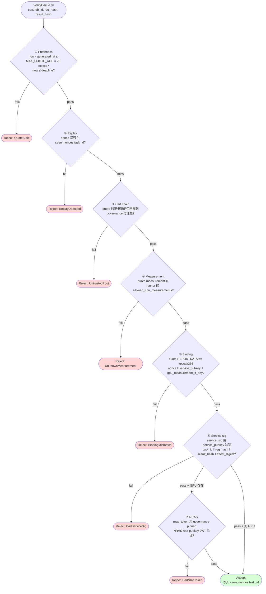

# TEE Execution & Composite Attestation (CIP-23 v2)

Hardware-rooted attestation pipeline that turns CIP-2 `VerificationMode::Deterministic + tee_required` from a field-presence flag into a cryptographically enforced guarantee. Introduces the **Composite Attestation Envelope (CAE)** binding a CPU TEE quote (TDX / SEV-SNP / Nitro) + NVIDIA NCC GPU report + service signature into one receipt, and turns TEE Verifier `0x05` from a stub into a real verification actor.

> **⚠️ 2026-05-26 opcode + 块时间修正**：
> - **CIP-23 v2 §4 提议的 opcodes 57-60**（`VerifyCae` / `UpdateCpuRoot` / `UpdateNrasRoot` / `GcNonces`）**与代码冲突**：`node/types/src/execution.rs` 中 57 = `SessionSlash`（CIP-8）、60-63 = `RegisterTeeTrustedKey` 等（CIP-24 §3.3，TEE Verifier 支持指令，**已在代码**）。CIP-23 v2 自身的 4 个 attestation handler 未实装，需激活时落到 ≥87 free range；详见 CIP-13 §1 主表与 [[../drift]] V-3。
> - **块时间统一到 1s**（CIP-23 r1, 2026-05-26）：`MAX_QUOTE_AGE` 150 blocks @ 500ms → **75 blocks @ 1s**（≈75s wall-clock 保持不变）；`BINDING_RENEWAL_PERIOD` 12,096 blocks → **604,800 blocks @ 1s**（≈7 days；原 12,096 算术错误已勘正）。

> **v1 → v2 主要变更**：显式三层 chain (`sec.tee_required` entitlement → `VerificationConfig.tee_required` 字段 → `MeasurementBinding`)；`nitro` 加入 `CANONICAL_TEE_TYPES`（v1 §3.3 列了但 registry.rs:211 未加）；与 CIP-13 v2 委托正交（TEE 资格是分类能力，非 stake 阈值）；`BillingAttestation.tee_signature` CAE 是**每次 billing event 临时生成**（不缓存 measurement_binding 时的 quote）。

---

## 为什么存在

当前代码（`runner/crates/tee-verifier` / `result-verifier` / `node/execution/src/runner/dispatcher.rs` / `secrets-manager`）把 `tee_required` 实现成**字段存在性检查**或**自声明布尔位**。任何 Runner 可以谎称支持 TEE 却不提交任何密码学证据。CIP-23 v2 把这整条链路换成硬件根信任。

---

## 三层资格 chain（CIP-23 v2 §1，新明确）

每个 TEE-required job 触及三个独立的 layer，分布在生命周期的不同时刻：

```mermaid
flowchart LR
    subgraph L1["① Actor manifest"]
        A1[sec.tee_required<br/>entitlement<br/>registry.rs:158]
        A2[Actor owner 在部署时设]
    end
    subgraph L2["② Job spec"]
        B1[VerificationConfig.tee_required: bool<br/>runner/src/types.rs:171]
        B2[Submitter 在 submit_task 时设]
    end
    subgraph L3["③ Runner record"]
        C1[MeasurementBinding<br/>CIP-23 §3.7]
        C2[Runner 在注册 / 续约时设]
    end

    L1 -->|声明该 actor MUST<br/>用 tee_required job| L2
    L2 -->|Dispatcher 过滤：<br/>MeasurementBinding.status == Active<br/>&& expires_at > submission_block| L3
    L3 -->|结果阶段：Result Verifier MUST<br/>对每个 Deterministic+tee_required 结果<br/>调 0x05::VerifyCae| Verify[(0x05 TEE Verifier<br/>7 步验证流水线)]

    style L1 fill:#e7f3ff
    style L2 fill:#fff4e0
    style L3 fill:#e8ffe8
    style Verify fill:#ffe0e0
```



| Layer | 字段 / 记录 | 何时设置 | 权威方 |
|---|---|---|---|
| **Actor manifest** | `sec.tee_required` entitlement (`registry.rs:158`) | Actor 部署时 | Actor owner |
| **Job spec** | `VerificationConfig.tee_required: bool` (`runner/src/types.rs:171`) | `submit_task` 时 | Submitter |
| **Runner record** | `MeasurementBinding` (CIP-23 §3.7) | Runner 注册 / 续约时 | Runner |

三层在三个不同时刻独立校验，构成纵深防御 —— 攻击者必须同时控制 actor owner / submitter / runner 三方才能绕过 TEE 资格。

---

## CAE v1 结构（D-CBOR）

```rust
CompositeAttestation {
  version,                             // = 1
  cpu: CpuAttestation  { tee_type, quote, cert_chain_cid, measurement, pcr_extension },
  gpu: Option<GpuAttestation {tee_type=NvidiaNcc, nras_token, gpu_measurement, bound_cpu_pubkey}>,
  service_sig: { scheme, service_pubkey, sig },    // sig over (task_id‖req_hash‖H(result)‖attest_digest)
  freshness: { nonce, deadline, generated_at },
}
```

**核心绑定规则 (MANDATORY)**:

```
quote.REPORTDATA  ==  keccak256(nonce ‖ service_pubkey ‖ gpu_measurement_if_any)
```

```mermaid
flowchart LR
    Nonce[freshness.nonce<br/>每次 task 唯一] --> Hash
    Pub[service_sig.service_pubkey<br/>该 runner 的服务签名公钥] --> Hash
    GpuM[gpu_measurement<br/>NRAS report 中的 GPU 状态] --> Hash
    Hash[keccak256<br/>= REPORTDATA] --> CPU[CPU quote<br/>TDX/SEV-SNP/Nitro<br/>REPORTDATA 字段]
    CPU -.绑定.- ServiceSig[service_sig.sig<br/>签 task_id ‖ req_hash ‖<br/>H(result) ‖ attest_digest]
    GpuM -.绑定.- Gpu[GPU NCC report<br/>nras_token + bound_cpu_pubkey]
    Gpu -.bound_cpu_pubkey ==.- Pub

    style Hash fill:#fff4cc
    style CPU fill:#ffe0e0
    style Gpu fill:#e0ffe0
    style ServiceSig fill:#e0e0ff
```

CPU quote ↔ 服务签名密钥 ↔ GPU NCC 报告 ↔ 任务 nonce 四者互相绑定，任何一个被替换都使整包失效。`bound_cpu_pubkey` 字段把 GPU NRAS 报告锚回 CPU 签名公钥，防止"拼接"攻击（取 A 节点的 CPU quote + B 节点的 GPU report）。

---

## TEE Verifier 系统 Actor (0x05) 验证流水线

7 步：**Freshness → Replay → Cert chain → Measurement → Binding → Service sig → NRAS**。



Gas 预算：TDX + NCC 全验证 ≈ 200k cycles（远低于 `BLOCK_CYCLES_TARGET = 10M`），每块可验证 ~50 个 CAE。

| 根信任 | 链 |
|---|---|
| TDX | PCS root → TD Module → TD quote |
| SEV-SNP | AMD root → VCEK → Report |
| Nitro | AWS Nitro root → signing cert → attestation doc |
| GPU | NVIDIA NRAS root pubkey → JWT claims |

Measurement 白名单**不**重复存放在 TEE Verifier —— 存在 Runner Registry 的 `measurement_binding` 里。

**opcodes 57–60**（CIP-23 v2 §4，从 v1 §3.6.2 的 50-53 修正；canonical 主表见 CIP-13 v2 §1）:

| Op | 指令 | Caller |
|---|---|---|
| **57** | `VerifyCae { cae, job_id, req_hash, result_hash }` | Result Verifier `0x03` |
| **58** | `UpdateCpuRoot { tee_type, cert_der, effective_at }` | Governance `0x09` (delay ≥ 1w) |
| **59** | `UpdateNrasRoot { pubkey, effective_at }` | Governance `0x09` |
| **60** | `GcNonces { upto_block }` | Permissionless |

> v1 §3.6.2 选了 50-53，与代码 `SYS_EXTEND_TIMER=50` / `SYS_DEPLOY_CODE=51` 冲突；CIP-23 v2 §4 收回到 57-60 的 free range。

**Gas**: TDX + NCC 全验证 ≈ 200k cycles，远低于 `BLOCK_CYCLES_TARGET = 10M`，每块可验证 ~50 个 CAE。

---

## `tee_type` 与 VerificationMode 资格映射（v2 §2）

`registry.rs:158-167` 定义 `sec.tee_required` 带 `tee_type: Str` 参数（canonical 列表 `registry.rs:211`）。CIP-23 v2 §2 明确各值与 `Deterministic` mode 的资格关系：

| `tee_type` | Eligible `VerificationMode` |
|---|---|
| `tdx` | All（含 `Deterministic`）|
| `sev` | All（含 `Deterministic`）|
| `nitro` | All（含 `Deterministic`）|
| `sgx` | All **EXCEPT** `Deterministic`（legacy tier，IAS/EPID 2025-04-02 EOL）|

> **代码侧 amendment**：`registry.rs::CANONICAL_TEE_TYPES` 当前 `&["sgx", "sev", "tdx"]`；CIP-23 v2 要求**追加 `"nitro"`**。一行代码改动，作为 precondition。

---

## Attestation-first Runner Registration（CIP-2 §5.4 修订）

弃用 `runner.capabilities.tee_support` 布尔 —— Dispatcher 改查 Registry 的 `MeasurementBinding`：

```rust
MeasurementBinding {
  cpu_tee_type, allowed_cpu_measurements, allowed_gpu_measurements,
  service_pubkey, bound_at, expires_at, status ∈ {Active, Deprecated, Revoked}
}
```

注册时 Runner 必须提交 `initial_cae`，Registry 跨 actor 调 `0x05::VerifyCae` 通过后才写入绑定。`BINDING_RENEWAL_PERIOD` 默认 ≈ 7 天，过期降级为 `Deprecated`（历史结果仍可验证，但不再入候选池）。

---

## 与 CIP-13 v2 委托的正交关系（v2 §3）

TEE runner 可接受委托：
- 委托质押计入 `effective_stake`，影响 VRF 权重与最大 Job 价值（CIP-13 v2 §2 amend CIP-2 §5）
- **委托质押不**影响 TEE 资格 —— 资格是 `MeasurementBinding.status` 的分类检查，不是 stake 阈值
- 低自质押 + 高委托质押的 runner 仍可能被选中（高 VRF 权重）；`MIN_SELF_BOND_BPS = 1000`（10%）保证有切身利益
- TEE 伪造 slash：自质押不受封顶；委托侧受 `MAX_DELEGATION_SLASH_PER_EPOCH_BPS = 500`（5%）per-epoch 限制（CIP-13 v2 §3.6）

---

## Deterministic 模式的升级（CIP-2 §9 修订）

| 维度 | 旧 | CIP-23 v2 后 |
|---|---|---|
| `tee_required` 过滤 | 查 `runner.capabilities.tee_support` 布尔 | 查 Registry `MeasurementBinding.status == Active && expires_at > now` |
| Deterministic 结果验证 | 字节级比较 + 检查 `tee_attestation` 字段不为空 | 字节级 + **强制**调用 `0x05::VerifyCae` (opcode 57) per result；任一 CAE 失败整 Job 失败 |
| 其他模式（None / EconomicBond / MajorityVote / StructuredMatch / SemanticSimilarity）| 不变 | 不变；CAE 可选，如附带则必须通过验证 |

**SGX = legacy**: IAS/EPID 2025-04-02 EOL；SGX 明确不进 Deterministic 候选池（v2 §2 表）。

---

## Secrets Manager (0x04) 强制 CAE 校验（v1 §3.10 / v2 §5.1）

`get_secret()` 旧签名接 `Option<TeeAttestation>` 但忽略之。CIP-23 后变成 MANDATORY CAE + 策略比对：

```
require(attestation.cpu.measurement ∈ policy.allowed_measurements)
require(attestation.service_sig.service_pubkey ∈ policy.allowed_services)
→ 调 0x05::VerifyCae → 返回 HPKE 封装的密文（只在 CVM 内解密）
```

接受委托的 runner 也可调 `get_secret` —— 释放与 stake 来源无关，只与 measurement 有关；delegator 对 secret 无可见性。

---

## BillingAttestation 统一到 CAE（CIP-10 §12.3 修订 + v2 §5.1 数据源澄清）

CIP-10 v1 `BillingAttestation.tee_signature: Option<Vec<u8>>` Ed25519 签名 → CIP-23 §3.12 改为 `Option<CompositeAttestation>`。复用 `0x05::VerifyCae` 管道（`result_hash = keccak(billing_fields_rlp)`）。

**数据源（v2 §5.1 新明确）**：CAE 是**每次 billing event 临时生成**，不缓存 measurement_binding 时的 quote：
- `freshness.nonce` MUST = `keccak(billing_attestation_fields_excluding_signature ‖ submission_block_hash)`
- `REPORTDATA` MUST = `keccak(nonce ‖ service_pubkey ‖ keccak(billing_fields_rlp))`
- `MAX_QUOTE_AGE = 75 blocks`（≈75s @ 1s 块；CIP-23 r1 2026-05-26 从原 150 blocks @ 500ms 重算）应用 freshness anchor

cert chain 可以缓存（同平台不变）；quote 必须新鲜。措施 binding 时的 attestation 用于 binding 校验，是另一份独立 CAE。

---

## 存储策略（避免 state 膨胀）

| 字段 | 位置 |
|---|---|
| `attest_digest = keccak(cae_cbor)` | 链上 `task/result/<task_id>.cae_digest`（审计句柄）|
| `cpu_measurement` / `gpu_measurement` / `service_pubkey` | Runner Registry `measurement_binding` |
| 完整 CAE（30–100 KiB，quote + cert chain）| CIP-9 Relay Node / IPFS，链上只存 CID |
| `seen_nonces[task_id]` | TEE Verifier state；GC 窗口 = `DISPUTE_WINDOW_BLOCKS = 75` |

---

## 硬件栈选型（`refs/plans/cowboy-tee-execution-design.md` §4）

| Tier      | 选择                                             |
| --------- | ---------------------------------------------- |
| **主 CPU** | Intel TDX                                      |
| **主 GPU** | NVIDIA NCC (H100 / H200)                       |
| **次 CPU** | AMD SEV-SNP, AWS Nitro Enclaves                |
| **三线**    | ARM CCA（年轻），SGX（legacy）                        |
| **启用层**   | Confidential Containers (CoCo) + Trustee / KBS |

CVM 基础镜像：`cowboy/runner-tee-base:v1`，CIP-10 §5.5 扩展；Yocto / buildroot 可复现构建。

---

## 路线图（18 周）

| Phase | 时长 | 交付 |
|---|---|---|
| P0 Scaffolding | 2w | 类型 + opcode 骨架（stub 逻辑）|
| P1 TDX-only MVP | 6w | 端到端 DCAP + 注册-首证 + Deterministic 验证闭环 |
| P2 CPU + GPU + CoCo | 6w | NCC + NRAS + Trustee KBS + Secrets Manager TEE-gating |
| P3 多 backend + Billing | 4w | SEV-SNP / Nitro + BillingAttestation 接 `0x05` |

---

## 不做的事（明确边界）

- 不在 PVM 内部跑 enclave（PVM 确定性不变，`tee_call` 只是 SDK helper 翻译成 `SubmitJob`）
- 不自研 attestation SDK / enclave framework（用 DCAP + NRAS + CoCo 现成栈）
- 不在 L1 state 上存整份 quote（只锚 digest + CID）
- 不要求所有 Runner 都跑 TEE；非 TEE Runner 继续承担其他 VerificationMode

---

## 源文档冲突 / 漂移

- **System Actor 地址权威**: CIP-23 v1 §3.2 明确 supersede `CLAUDE.md` 与 `node/types/README.md` 中 `0x91-0x95` 老列表。已在 [[../drift]] 记录；workspace CLAUDE.md 待更新
- **opcode 50-53 v1 错配 → 57-60 v2 修正**：详见 [[../drift]] 与 CIP-13 v2 §1 主表
- **块时间统一到 1s**（CIP-23 r1, 2026-05-26）：原 v2 草案"@ 500ms"假设已废，`MAX_QUOTE_AGE` 75 blocks ≈ 75s @ 1s（wall-clock 不变）；`BINDING_RENEWAL_PERIOD` 604,800 blocks ≈ 7d @ 1s（修正原 12,096 算术错误）。[[../drift]] L-5 已收口
- **CANONICAL_TEE_TYPES 缺 nitro**：v2 §2 要求追加；属于 precondition

---

## 相关

- [[runner-verification]] — VerificationMode 6 variants；Deterministic 加强 + DnsTxtRecordMatch / DnsCnameMatch（CIP-2 v2）
- [[runner-delegation]] — CIP-13 v2 委托与 TEE 资格正交
- [[../entities/runner-lifecycle]] — Phase 1 attestation-first 注册
- [[../entities/system-actors]] — `0x05` TEE Verifier 角色
- [[../drift]] — 地址权威 / 块时间 / opcode 重排 / nitro entry

## Sources

- `refs/cips/cip-23-tee-execution.md` — v2 spec（Draft, 2026-04-21）：三层 chain + opcodes 57-60 + nitro + BillingAttestation 数据源 + CIP-13 正交
- `refs/cips/cip-23-tee-execution.md` — v1 EN（Part I）保留参考
- `refs/cips/cip-2-offchain-compute.md` — DNS verifier check 兼容上下文
- `refs/cips/cip-10-runner-containers.md` — BillingAttestation 接入 0x0F
- `refs/cips/cip-13-runner-delegation.md` §1 — opcode 主分配表
- `refs/plans/cowboy-tee-execution-design.md` — 实施设计
